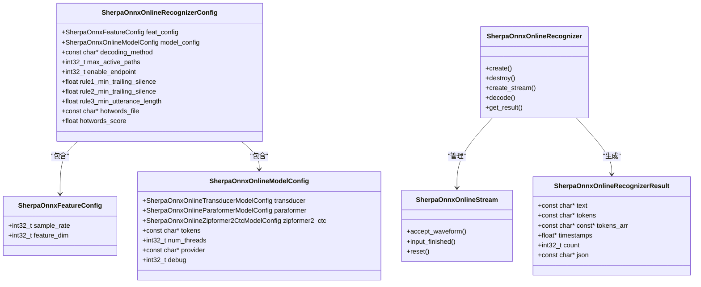
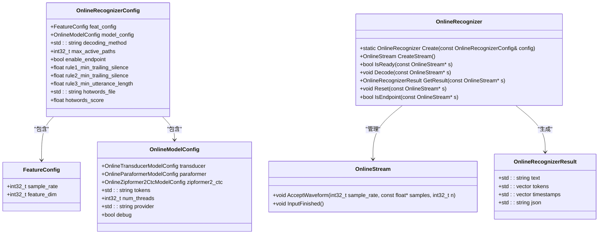
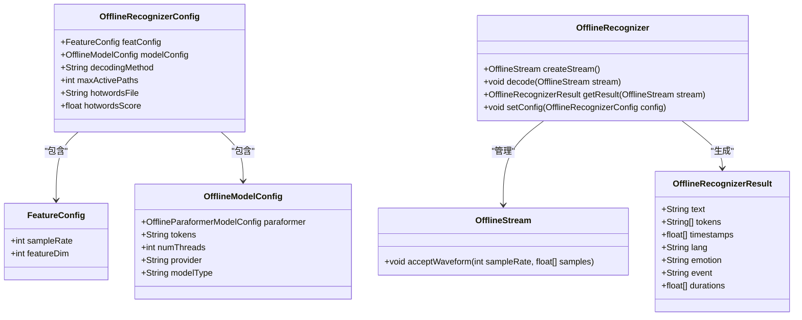

# API参考

<cite>
**本文档引用的文件**   
- [c-api.h](file://sherpa-onnx/c-api/c-api.h)
- [cxx-api.h](file://sherpa-onnx/c-api/cxx-api.h)
- [OfflineRecognizer.kt](file://sherpa-onnx/kotlin-api/OfflineRecognizer.kt)
- [Tts.kt](file://sherpa-onnx/kotlin-api/Tts.kt)
- [sherpa_onnx.pas](file://sherpa-onnx/pascal-api/sherpa_onnx.pas)
- [c-api-examples](file://c-api-examples/)
- [java-api-examples](file://java-api-examples/)
- [kotlin-api-examples](file://kotlin-api-examples/)
- [pascal-api-examples](file://pascal-api-examples/)
- [python-api-examples](file://python-api-examples/)
- [swift-api-examples](file://swift-api-examples/)
- [go-api-examples](file://go-api-examples/)
- [dart-api-examples](file://dart-api-examples/)
- [wasm](file://wasm/)
</cite>

## 目录
1. [简介](#简介)
2. [C API](#c-api)
3. [C++ API](#c++-api)
4. [Python API](#python-api)
5. [Java API](#java-api)
6. [Kotlin API](#kotlin-api)
7. [Swift API](#swift-api)
8. [Go API](#go-api)
9. [Dart API](#dart-api)
10. [Rust API](#rust-api)
11. [Pascal API](#pascal-api)
12. [WebAssembly API](#webassembly-api)
13. [API版本控制与向后兼容性](#api版本控制与向后兼容性)
14. [错误代码与调试指南](#错误代码与调试指南)

## 简介
sherpa-onnx是一个跨平台的语音识别和语音合成工具包，提供了多种编程语言的API接口。本API参考文档详细介绍了所有公开接口，包括C、C++、Python、Java、Kotlin、Swift、Go、Dart、Rust、Pascal和WebAssembly API。文档涵盖了函数签名、参数、返回值、异常处理、使用示例以及不同API之间的关系和互操作性。

**Section sources**
- [c-api.h](file://sherpa-onnx/c-api/c-api.h#L1-L1900)
- [cxx-api.h](file://sherpa-onnx/c-api/cxx-api.h#L1-L823)

## C API
C API是sherpa-onnx的基础API，其他语言的API都是基于C API构建的。它提供了语音识别、语音合成、关键词检测、语音活动检测等功能。

### 核心数据结构


**Diagram sources **
- [c-api.h](file://sherpa-onnx/c-api/c-api.h#L82-L800)

### 主要函数
| 函数 | 参数 | 返回值 | 描述 |
|------|------|--------|------|
| `SherpaOnnxCreateOnlineRecognizer` | `const SherpaOnnxOnlineRecognizerConfig* config` | `const SherpaOnnxOnlineRecognizer*` | 创建在线语音识别器 |
| `SherpaOnnxDestroyOnlineRecognizer` | `const SherpaOnnxOnlineRecognizer* recognizer` | `void` | 销毁在线语音识别器 |
| `SherpaOnnxCreateOnlineStream` | `const SherpaOnnxOnlineRecognizer* recognizer` | `const SherpaOnnxOnlineStream*` | 创建在线音频流 |
| `SherpaOnnxDestroyOnlineStream` | `const SherpaOnnxOnlineStream* stream` | `void` | 销毁在线音频流 |
| `SherpaOnnxOnlineStreamAcceptWaveform` | `const SherpaOnnxOnlineStream* stream, int32_t sample_rate, const float* samples, int32_t n` | `void` | 接受音频波形数据 |
| `SherpaOnnxIsOnlineStreamReady` | `const SherpaOnnxOnlineRecognizer* recognizer, const SherpaOnnxOnlineStream* stream` | `int32_t` | 检查音频流是否准备好解码 |
| `SherpaOnnxDecodeOnlineStream` | `const SherpaOnnxOnlineRecognizer* recognizer, const SherpaOnnxOnlineStream* stream` | `void` | 解码在线音频流 |
| `SherpaOnnxGetOnlineStreamResult` | `const SherpaOnnxOnlineRecognizer* recognizer, const SherpaOnnxOnlineStream* stream` | `const SherpaOnnxOnlineRecognizerResult*` | 获取在线音频流的识别结果 |

**Section sources**
- [c-api.h](file://sherpa-onnx/c-api/c-api.h#L250-L405)

### 使用示例
```c
// 初始化配置
SherpaOnnxOnlineRecognizerConfig config = {
    .feat_config = {
        .sample_rate = 16000,
        .feature_dim = 80,
    },
    .model_config = {
        .paraformer = {
            .encoder = "encoder.onnx",
            .decoder = "decoder.onnx",
        },
        .tokens = "tokens.txt",
        .num_threads = 4,
        .provider = "cpu",
        .model_type = "paraformer",
    },
    .decoding_method = "greedy_search",
};

// 创建识别器
const SherpaOnnxOnlineRecognizer *recognizer =
    SherpaOnnxCreateOnlineRecognizer(&config);

// 创建音频流
const SherpaOnnxOnlineStream *stream =
    SherpaOnnxCreateOnlineStream(recognizer);

// 处理音频数据
while (has_more_audio()) {
    float *samples = get_audio_samples();
    int32_t n = get_num_samples();
    
    // 接受音频数据
    SherpaOnnxOnlineStreamAcceptWaveform(stream, 16000, samples, n);
    
    // 检查是否可以解码
    while (SherpaOnnxIsOnlineStreamReady(recognizer, stream)) {
        SherpaOnnxDecodeOnlineStream(recognizer, stream);
    }
    
    // 获取结果
    const SherpaOnnxOnlineRecognizerResult *result =
        SherpaOnnxGetOnlineStreamResult(recognizer, stream);
        
    if (result && result->text[0] != '\0') {
        printf("识别结果: %s\n", result->text);
        SherpaOnnxDestroyOnlineRecognizerResult(result);
    }
}

// 清理资源
SherpaOnnxDestroyOnlineStream(stream);
SherpaOnnxDestroyOnlineRecognizer(recognizer);
```

**Section sources**
- [c-api-examples](file://c-api-examples/streaming-paraformer-c-api.c)

## C++ API
C++ API是C API的封装，提供了更现代的C++接口，使用智能指针和异常处理。

### 核心类


**Diagram sources **
- [cxx-api.h](file://sherpa-onnx/c-api/cxx-api.h#L75-L209)

### 主要功能
C++ API通过模板和智能指针提供了更安全的内存管理。`OnlineRecognizer`和`OnlineStream`类都继承自`MoveOnly`模板类，确保了资源的正确释放。

```cpp
// 创建配置
sherpa_onnx::cxx::OnlineRecognizerConfig config;
config.feat_config.sample_rate = 16000;
config.feat_config.feature_dim = 80;
config.model_config.paraformer.encoder = "encoder.onnx";
config.model_config.paraformer.decoder = "decoder.onnx";
config.model_config.tokens = "tokens.txt";
config.model_config.num_threads = 4;
config.model_config.provider = "cpu";
config.model_config.model_type = "paraformer";
config.decoding_method = "greedy_search";

// 创建识别器
auto recognizer = sherpa_onnx::cxx::OnlineRecognizer::Create(config);

// 创建音频流
auto stream = recognizer.CreateStream();

// 处理音频数据
while (has_more_audio()) {
    auto samples = get_audio_samples();
    int32_t n = get_num_samples();
    
    // 接受音频数据
    stream.AcceptWaveform(16000, samples.data(), n);
    
    // 解码
    while (recognizer.IsReady(&stream)) {
        recognizer.Decode(&stream);
    }
    
    // 获取结果
    auto result = recognizer.GetResult(&stream);
    if (!result.text.empty()) {
        std::cout << "识别结果: " << result.text << std::endl;
    }
}
```

**Section sources**
- [cxx-api.h](file://sherpa-onnx/c-api/cxx-api.h#L187-L207)

## Python API
Python API通过pybind11绑定C++ API，提供了易于使用的Python接口。

### 安装
```bash
pip install sherpa-onnx
```

### 核心类
```python
import sherpa_onnx

# 创建配置
config = sherpa_onnx.OfflineRecognizerConfig(
    feat_config=sherpa_onnx.FeatureConfig(sample_rate=16000, feature_dim=80),
    model_config=sherpa_onnx.OfflineModelConfig(
        paraformer=sherpa_onnx.OfflineParaformerModelConfig(model="model.onnx"),
        tokens="tokens.txt",
        num_threads=4,
        provider="cpu",
    ),
    decoding_method="greedy_search",
)

# 创建识别器
recognizer = sherpa_onnx.OfflineRecognizer(config)

# 创建流
stream = recognizer.create_stream()

# 接受音频数据
samples = get_audio_samples()
stream.accept_waveform(16000, samples)

# 解码
recognizer.decode(stream)

# 获取结果
result = recognizer.get_result(stream)
print(f"识别结果: {result.text}")
```

**Section sources**
- [python-api-examples](file://python-api-examples/offline-decode-files.py)

## Java API
Java API通过JNI调用C API，提供了Android平台的语音识别功能。

### 核心类


**Diagram sources **
- [OfflineRecognizer.kt](file://sherpa-onnx/kotlin-api/OfflineRecognizer.kt#L106-L123)

### 使用示例
```java
// 创建配置
OfflineModelConfig modelConfig = new OfflineModelConfig();
modelConfig.paraformer = new OfflineParaformerModelConfig();
modelConfig.paraformer.model = "model.onnx";
modelConfig.tokens = "tokens.txt";
modelConfig.numThreads = 4;
modelConfig.provider = "cpu";
modelConfig.modelType = "paraformer";

OfflineRecognizerConfig config = new OfflineRecognizerConfig();
config.featConfig = new FeatureConfig();
config.featConfig.sampleRate = 16000;
config.featConfig.featureDim = 80;
config.modelConfig = modelConfig;
config.decodingMethod = "greedy_search";

// 创建识别器
OfflineRecognizer recognizer = new OfflineRecognizer(config);

// 创建流
OfflineStream stream = recognizer.createStream();

// 接受音频数据
float[] samples = getAudioSamples();
stream.acceptWaveform(16000, samples);

// 解码
recognizer.decode(stream);

// 获取结果
OfflineRecognizerResult result = recognizer.getResult(stream);
System.out.println("识别结果: " + result.text);

// 释放资源
recognizer.release();
```

**Section sources**
- [java-api-examples](file://java-api-examples/NonStreamingDecodeFileParaformer.java)

## Kotlin API
Kotlin API是Java API的Kotlin版本，提供了更现代化的API。

### 核心数据类
```kotlin
data class OfflineRecognizerConfig(
    var featConfig: FeatureConfig = FeatureConfig(),
    var modelConfig: OfflineModelConfig = OfflineModelConfig(),
    var hr: HomophoneReplacerConfig = HomophoneReplacerConfig(),
    var decodingMethod: String = "greedy_search",
    var maxActivePaths: Int = 4,
    var hotwordsFile: String = "",
    var hotwordsScore: Float = 1.5f,
    var ruleFsts: String = "",
    var ruleFars: String = "",
    var blankPenalty: Float = 0.0f,
)

data class OfflineRecognizerResult(
    val text: String,
    val tokens: Array<String>,
    val timestamps: FloatArray,
    val lang: String,
    val emotion: String,
    val event: String,
    val durations: FloatArray,
)
```

### 使用示例
```kotlin
// 创建配置
val modelConfig = OfflineModelConfig().apply {
    paraformer = OfflineParaformerModelConfig().apply {
        model = "model.onnx"
    }
    tokens = "tokens.txt"
    numThreads = 4
    provider = "cpu"
    modelType = "paraformer"
}

val config = OfflineRecognizerConfig().apply {
    featConfig = FeatureConfig().apply {
        sampleRate = 16000
        featureDim = 80
    }
    modelConfig = modelConfig
    decodingMethod = "greedy_search"
}

// 创建识别器
val recognizer = OfflineRecognizer(config)

// 创建流
val stream = recognizer.createStream()

// 接受音频数据
val samples = getAudioSamples()
stream.acceptWaveform(16000, samples)

// 解码
recognizer.decode(stream)

// 获取结果
val result = recognizer.getResult(stream)
println("识别结果: ${result.text}")

// 释放资源
recognizer.release()
```

**Section sources**
- [OfflineRecognizer.kt](file://sherpa-onnx/kotlin-api/OfflineRecognizer.kt#L120-L200)

## Swift API
Swift API提供了iOS平台的语音识别功能。

### 核心类
```swift
class SherpaOnnxOfflineRecognizer {
    init(config: SherpaOnnxOfflineRecognizerConfig)
    func createStream() -> SherpaOnnxOfflineStream
    func decode(stream: SherpaOnnxOfflineStream)
    func getResult(stream: SherpaOnnxOfflineStream) -> SherpaOnnxOfflineRecognizerResult
    func setConfig(config: SherpaOnnxOfflineRecognizerConfig)
}

class SherpaOnnxOfflineStream {
    func acceptWaveform(sampleRate: Int32, samples: [Float])
}

class SherpaOnnxOfflineRecognizerResult {
    let text: String
    let tokens: [String]
    let timestamps: [Float]
    let lang: String
    let emotion: String
    let event: String
    let durations: [Float]
}
```

### 使用示例
```swift
// 创建配置
let modelConfig = SherpaOnnxOfflineModelConfig()
modelConfig.paraformer = SherpaOnnxOfflineParaformerModelConfig()
modelConfig.paraformer.model = "model.onnx"
modelConfig.tokens = "tokens.txt"
modelConfig.numThreads = 4
modelConfig.provider = "cpu"
modelConfig.modelType = "paraformer"

let config = SherpaOnnxOfflineRecognizerConfig()
config.featConfig = SherpaOnnxFeatureConfig()
config.featConfig.sampleRate = 16000
config.featConfig.featureDim = 80
config.modelConfig = modelConfig
config.decodingMethod = "greedy_search"

// 创建识别器
let recognizer = SherpaOnnxOfflineRecognizer(config: config)

// 创建流
let stream = recognizer.createStream()

// 接受音频数据
let samples = getAudioSamples()
stream.acceptWaveform(sampleRate: 16000, samples: samples)

// 解码
recognizer.decode(stream: stream)

// 获取结果
let result = recognizer.getResult(stream: stream)
print("识别结果: \(result.text)")
```

**Section sources**
- [swift-api-examples](file://swift-api-examples/decode-file.swift)

## Go API
Go API通过CGO调用C API，提供了Go语言的接口。

### 核心类型
```go
type OfflineRecognizerConfig struct {
    FeatConfig    FeatureConfig
    ModelConfig   OfflineModelConfig
    DecodingMethod string
    MaxActivePaths int
    HotwordsFile   string
    HotwordsScore  float32
}

type FeatureConfig struct {
    SampleRate int32
    FeatureDim int32
}

type OfflineModelConfig struct {
    Paraformer OfflineParaformerModelConfig
    Tokens     string
    NumThreads int32
    Provider   string
    ModelType  string
}

type OfflineRecognizer struct {
    ptr unsafe.Pointer
}

type OfflineStream struct {
    ptr unsafe.Pointer
}

type OfflineRecognizerResult struct {
    Text       string
    Tokens     []string
    Timestamps []float32
    Lang       string
    Emotion    string
    Event      string
    Durations  []float32
}
```

### 使用示例
```go
// 创建配置
config := &sherpa.OfflineRecognizerConfig{
    FeatConfig: sherpa.FeatureConfig{
        SampleRate: 16000,
        FeatureDim: 80,
    },
    ModelConfig: sherpa.OfflineModelConfig{
        Paraformer: sherpa.OfflineParaformerModelConfig{
            Model: "model.onnx",
        },
        Tokens:     "tokens.txt",
        NumThreads: 4,
        Provider:   "cpu",
        ModelType:  "paraformer",
    },
    DecodingMethod: "greedy_search",
}

// 创建识别器
recognizer, err := sherpa.NewOfflineRecognizer(config)
if err != nil {
    log.Fatal(err)
}
defer recognizer.Destroy()

// 创建流
stream := recognizer.CreateStream()
defer stream.Destroy()

// 接受音频数据
samples := getAudioSamples()
stream.AcceptWaveform(16000, samples)

// 解码
recognizer.Decode(stream)

// 获取结果
result := recognizer.GetResult(stream)
fmt.Printf("识别结果: %s\n", result.Text)
```

**Section sources**
- [go-api-examples](file://go-api-examples/non-streaming-decode-files/main.go)

## Dart API
Dart API提供了Flutter框架的语音识别功能。

### 核心类
```dart
class OfflineRecognizerConfig {
  final FeatureConfig featConfig;
  final OfflineModelConfig modelConfig;
  final String decodingMethod;
  final int maxActivePaths;
  final String hotwordsFile;
  final double hotwordsScore;

  OfflineRecognizerConfig({
    required this.featConfig,
    required this.modelConfig,
    this.decodingMethod = 'greedy_search',
    this.maxActivePaths = 4,
    this.hotwordsFile = '',
    this.hotwordsScore = 1.5,
  });
}

class OfflineRecognizer {
  final Pointer _recognizer;

  OfflineRecognizer._(this._recognizer);

  factory OfflineRecognizer(OfflineRecognizerConfig config) {
    final ptr = _createOfflineRecognizer(config);
    return OfflineRecognizer._(ptr);
  }

  OfflineStream createStream() {
    final ptr = _createOfflineStream(_recognizer);
    return OfflineStream._(ptr);
  }

  void decode(OfflineStream stream) {
    _decodeOfflineStream(_recognizer, stream._stream);
  }

  OfflineRecognizerResult getResult(OfflineStream stream) {
    final resultPtr = _getOfflineStreamResult(stream._stream);
    return OfflineRecognizerResult.fromPointer(resultPtr);
  }

  void dispose() {
    _destroyOfflineRecognizer(_recognizer);
  }
}
```

### 使用示例
```dart
// 创建配置
final modelConfig = OfflineModelConfig(
  paraformer: OfflineParaformerModelConfig(model: 'model.onnx'),
  tokens: 'tokens.txt',
  numThreads: 4,
  provider: 'cpu',
  modelType: 'paraformer',
);

final config = OfflineRecognizerConfig(
  featConfig: FeatureConfig(sampleRate: 16000, featureDim: 80),
  modelConfig: modelConfig,
  decodingMethod: 'greedy_search',
);

// 创建识别器
final recognizer = OfflineRecognizer(config);

// 创建流
final stream = recognizer.createStream();

// 接受音频数据
final samples = getAudioSamples();
stream.acceptWaveform(16000, samples);

// 解码
recognizer.decode(stream);

// 获取结果
final result = recognizer.getResult(stream);
print('识别结果: ${result.text}');

// 释放资源
recognizer.dispose();
```

**Section sources**
- [dart-api-examples](file://dart-api-examples/non-streaming-asr/bin/main.dart)

## Rust API
Rust API通过FFI调用C API，提供了内存安全的Rust接口。

### 核心结构
```rust
pub struct OfflineRecognizerConfig {
    pub feat_config: FeatureConfig,
    pub model_config: OfflineModelConfig,
    pub decoding_method: String,
    pub max_active_paths: i32,
    pub hotwords_file: String,
    pub hotwords_score: f32,
}

pub struct FeatureConfig {
    pub sample_rate: i32,
    pub feature_dim: i32,
}

pub struct OfflineModelConfig {
    pub paraformer: OfflineParaformerModelConfig,
    pub tokens: String,
    pub num_threads: i32,
    pub provider: String,
    pub model_type: String,
}

pub struct OfflineRecognizer {
    ptr: *mut c_void,
}

pub struct OfflineStream {
    ptr: *mut c_void,
}

pub struct OfflineRecognizerResult {
    pub text: String,
    pub tokens: Vec<String>,
    pub timestamps: Vec<f32>,
    pub lang: String,
    pub emotion: String,
    pub event: String,
    pub durations: Vec<f32>,
}
```

### 使用示例
```rust
// 创建配置
let model_config = OfflineModelConfig {
    paraformer: OfflineParaformerModelConfig {
        model: "model.onnx".to_string(),
    },
    tokens: "tokens.txt".to_string(),
    num_threads: 4,
    provider: "cpu".to_string(),
    model_type: "paraformer".to_string(),
};

let config = OfflineRecognizerConfig {
    feat_config: FeatureConfig {
        sample_rate: 16000,
        feature_dim: 80,
    },
    model_config,
    decoding_method: "greedy_search".to_string(),
    max_active_paths: 4,
    hotwords_file: "".to_string(),
    hotwords_score: 1.5,
};

// 创建识别器
let recognizer = OfflineRecognizer::new(&config)?;

// 创建流
let stream = recognizer.create_stream();

// 接受音频数据
let samples = get_audio_samples();
stream.accept_waveform(16000, &samples);

// 解码
recognizer.decode(&stream);

// 获取结果
let result = recognizer.get_result(&stream);
println!("识别结果: {}", result.text);
```

**Section sources**
- [rust-api-examples](file://rust-api-examples/README.md)

## Pascal API
Pascal API提供了Free Pascal和Lazarus的接口。

### 核心类型
```pascal
type
  TSherpaOnnxOfflineRecognizerConfig = record
    FeatConfig: TSherpaOnnxFeatureConfig;
    ModelConfig: TSherpaOnnxOfflineModelConfig;
    DecodingMethod: AnsiString;
    MaxActivePaths: Integer;
    HotwordsFile: AnsiString;
    HotwordsScore: Single;
  end;

  TSherpaOnnxFeatureConfig = record
    SampleRate: Integer;
    FeatureDim: Integer;
  end;

  TSherpaOnnxOfflineModelConfig = record
    Paraformer: TSherpaOnnxOfflineParaformerModelConfig;
    Tokens: AnsiString;
    NumThreads: Integer;
    Provider: AnsiString;
    ModelType: AnsiString;
  end;

  TSherpaOnnxOfflineRecognizer = class
  private
    Handle: Pointer;
  public
    constructor Create(Config: TSherpaOnnxOfflineRecognizerConfig);
    destructor Destroy; override;
    function CreateStream: TSherpaOnnxOfflineStream;
    procedure Decode(Stream: TSherpaOnnxOfflineStream);
    function GetResult(Stream: TSherpaOnnxOfflineStream): TSherpaOnnxOfflineRecognizerResult;
  end;
```

### 使用示例
```pascal
// 创建配置
var
  ModelConfig: TSherpaOnnxOfflineModelConfig;
  Config: TSherpaOnnxOfflineRecognizerConfig;
  Recognizer: TSherpaOnnxOfflineRecognizer;
  Stream: TSherpaOnnxOfflineStream;
  Result: TSherpaOnnxOfflineRecognizerResult;
begin
  // 配置模型
  ModelConfig.Paraformer.Model := 'model.onnx';
  ModelConfig.Tokens := 'tokens.txt';
  ModelConfig.NumThreads := 4;
  ModelConfig.Provider := 'cpu';
  ModelConfig.ModelType := 'paraformer';

  // 配置识别器
  Config.FeatConfig.SampleRate := 16000;
  Config.FeatConfig.FeatureDim := 80;
  Config.ModelConfig := ModelConfig;
  Config.DecodingMethod := 'greedy_search';

  // 创建识别器
  Recognizer := TSherpaOnnxOfflineRecognizer.Create(Config);

  // 创建流
  Stream := Recognizer.CreateStream;

  // 接受音频数据
  var Samples := GetAudioSamples;
  Stream.AcceptWaveform(Samples, 16000);

  // 解码
  Recognizer.Decode(Stream);

  // 获取结果
  Result := Recognizer.GetResult(Stream);
  WriteLn('识别结果: ', Result.Text);

  // 释放资源
  Stream.Free;
  Recognizer.Free;
end.
```

**Section sources**
- [sherpa_onnx.pas](file://sherpa-onnx/pascal-api/sherpa_onnx.pas#L456-L469)

## WebAssembly API
WebAssembly API允许在浏览器中运行语音识别功能。

### 核心接口
```javascript
// 初始化WebAssembly模块
async function init() {
    const wasm = await import('./sherpa-onnx-wasm.js');
    await wasm.default();
    return wasm;
}

// 创建识别器
async function createRecognizer() {
    const wasm = await init();
    
    const config = {
        feat_config: {
            sample_rate: 16000,
            feature_dim: 80,
        },
        model_config: {
            paraformer: {
                encoder: 'encoder.onnx',
                decoder: 'decoder.onnx',
            },
            tokens: 'tokens.txt',
            num_threads: 4,
            provider: 'cpu',
            model_type: 'paraformer',
        },
        decoding_method: 'greedy_search',
    };
    
    const recognizer = new wasm.OfflineRecognizer(config);
    return recognizer;
}

// 处理音频数据
async function processAudio(recognizer, audioData) {
    const stream = recognizer.createStream();
    
    // 接受音频数据
    stream.acceptWaveform(16000, audioData);
    
    // 解码
    recognizer.decode(stream);
    
    // 获取结果
    const result = recognizer.getResult(stream);
    console.log('识别结果:', result.text);
    
    // 释放资源
    stream.destroy();
}
```

### 使用示例
```html
<!DOCTYPE html>
<html>
<head>
    <title>sherpa-onnx WebAssembly 示例</title>
</head>
<body>
    <h1>语音识别示例</h1>
    <button id="start">开始录音</button>
    <button id="stop">停止录音</button>
    <div id="result"></div>

    <script type="module">
        import init, { OfflineRecognizer, FeatureConfig, OfflineModelConfig } from './sherpa-onnx-wasm.js';

        let recognizer;
        let stream;
        let mediaRecorder;
        let audioChunks = [];

        document.getElementById('start').addEventListener('click', async () => {
            // 初始化WASM
            await init();
            
            // 创建识别器
            const config = {
                feat_config: {
                    sample_rate: 16000,
                    feature_dim: 80,
                },
                model_config: {
                    paraformer: {
                        encoder: 'encoder.onnx',
                        decoder: 'decoder.onnx',
                    },
                    tokens: 'tokens.txt',
                    num_threads: 4,
                    provider: 'cpu',
                    model_type: 'paraformer',
                },
                decoding_method: 'greedy_search',
            };
            
            recognizer = new OfflineRecognizer(config);
            
            // 开始录音
            const stream = await navigator.mediaDevices.getUserMedia({ audio: true });
            mediaRecorder = new MediaRecorder(stream);
            
            mediaRecorder.ondataavailable = event => {
                audioChunks.push(event.data);
            };
            
            mediaRecorder.start();
        });

        document.getElementById('stop').addEventListener('click', () => {
            mediaRecorder.stop();
            
            mediaRecorder.onstop = async () => {
                const audioBlob = new Blob(audioChunks, { type: 'audio/wav' });
                const arrayBuffer = await audioBlob.arrayBuffer();
                const audioData = new Float32Array(arrayBuffer);
                
                // 处理音频数据
                const stream = recognizer.createStream();
                stream.acceptWaveform(16000, audioData);
                recognizer.decode(stream);
                
                const result = recognizer.getResult(stream);
                document.getElementById('result').textContent = `识别结果: ${result.text}`;
                
                // 释放资源
                stream.destroy();
                recognizer.destroy();
                
                audioChunks = [];
            };
        });
    </script>
</body>
</html>
```

**Section sources**
- [wasm](file://wasm/asr/)

## API版本控制与向后兼容性
sherpa-onnx遵循语义化版本控制（Semantic Versioning），确保API的向后兼容性。

### 版本号格式
版本号采用`主版本号.次版本号.修订号`格式：
- **主版本号**：当进行不兼容的API更改时递增
- **次版本号**：当以向后兼容的方式添加功能时递增
- **修订号**：当进行向后兼容的错误修复时递增

### 向后兼容性策略
1. **C API**：保持二进制兼容性，旧版本的客户端可以使用新版本的库
2. **C++ API**：保持源代码兼容性，旧代码可以在新版本中编译
3. **其他语言API**：通过版本锁定确保依赖的稳定性

### 版本查询
所有API都提供了版本查询功能：

```c
// C API
const char *version = SherpaOnnxGetVersionStr();
const char *git_sha1 = SherpaOnnxGetGitSha1();
const char *git_date = SherpaOnnxGetGitDate();
```

```cpp
// C++ API
std::string version = sherpa_onnx::cxx::GetVersionStr();
std::string git_sha1 = sherpa_onnx::cxx::GetGitSha1();
std::string git_date = sherpa_onnx::cxx::GetGitDate();
```

```python
# Python API
import sherpa_onnx
print(sherpa_onnx.__version__)
```

**Section sources**
- [c-api.h](file://sherpa-onnx/c-api/c-api.h#L56-L73)
- [cxx-api.h](file://sherpa-onnx/c-api/cxx-api.h#L710-L712)

## 错误代码与调试指南
sherpa-onnx提供了详细的错误处理机制和调试信息。

### 错误处理
大多数API调用不会抛出异常，而是通过返回值或状态码指示错误：

```c
// C API通过返回值指示错误
int32_t success = SherpaOnnxFileExists("model.onnx");
if (!success) {
    fprintf(stderr, "模型文件不存在\n");
}
```

```cpp
// C++ API通过异常处理错误
try {
    auto recognizer = sherpa_onnx::cxx::OnlineRecognizer::Create(config);
} catch (const std::exception& e) {
    std::cerr << "创建识别器失败: " << e.what() << std::endl;
}
```

### 调试信息
可以通过设置`debug`参数启用调试信息：

```c
// C API
SherpaOnnxOnlineRecognizerConfig config;
config.model_config.debug = 1; // 启用调试信息
```

```cpp
// C++ API
sherpa_onnx::cxx::OnlineRecognizerConfig config;
config.model_config.debug = true; // 启用调试信息
```

### 常见问题
1. **模型文件加载失败**：检查文件路径和权限
2. **音频采样率不匹配**：确保音频采样率与模型期望的采样率一致
3. **内存不足**：减少线程数或使用更小的模型
4. **性能问题**：尝试不同的provider（cpu、cuda、coreml等）

**Section sources**
- [c-api.h](file://sherpa-onnx/c-api/c-api.h#L118-L119)
- [cxx-api.h](file://sherpa-onnx/c-api/cxx-api.h#L52-L53)