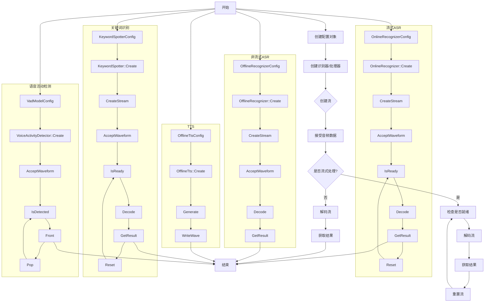

# C++ API

<cite>
**本文档引用的文件**
- [c-api.h](file://sherpa-onnx/c-api/c-api.h)
- [cxx-api.h](file://sherpa-onnx/c-api/cxx-api.h)
- [cxx-api.cc](file://sherpa-onnx/c-api/cxx-api.cc)
- [whisper-cxx-api.cc](file://cxx-api-examples/whisper-cxx-api.cc)
- [sense-voice-cxx-api.cc](file://cxx-api-examples/sense-voice-cxx-api.cc)
- [kws-cxx-api.cc](file://cxx-api-examples/kws-cxx-api.cc)
- [matcha-tts-en-cxx-api.cc](file://cxx-api-examples/matcha-tts-en-cxx-api.cc)
</cite>

## 目录
1. [简介](#简介)
2. [命名空间结构](#命名空间结构)
3. [核心类与RAII设计](#核心类与raii设计)
4. [面向对象设计模式](#面向对象设计模式)
5. [C API与C++ API关系](#c-api与c-api关系)
6. [模板与编译时配置](#模板与编译时配置)
7. [异常处理与STL集成](#异常处理与stl集成)
8. [核心功能模块示例](#核心功能模块示例)

## 简介
sherpa-onnx的C++ API为语音处理任务提供了现代化的C++接口，封装了底层C API的功能。该API设计遵循现代C++最佳实践，包括RAII资源管理、智能指针使用和异常安全。API支持多种语音处理功能，包括流式和非流式自动语音识别（ASR）、关键词识别、文本到语音（TTS）、语音增强和音频标签等。C++ API通过面向对象的设计模式提供了类型安全和内存安全的接口，同时保持了高性能。

**Section sources**
- [cxx-api.h](file://sherpa-onnx/c-api/cxx-api.h#L1-L823)
- [cxx-api.cc](file://sherpa-onnx/c-api/cxx-api.cc#L1-L934)

## 命名空间结构
sherpa-onnx的C++ API采用清晰的命名空间层次结构来组织功能。主要命名空间为`sherpa_onnx::cxx`，其中包含了所有C++包装类和辅助函数。这种命名空间设计避免了名称冲突，并提供了清晰的功能分组。命名空间结构反映了API的功能模块化，每个主要功能类别都有相应的类和配置结构。

```mermaid
classDiagram
class sherpa_onnx : : cxx{
+namespace
}
class OnlineRecognizer{
+Create(config)
+CreateStream()
+Decode(stream)
+GetResult(stream)
}
class OfflineRecognizer{
+Create(config)
+CreateStream()
+Decode(stream)
+GetResult(stream)
}
class KeywordSpotter{
+Create(config)
+CreateStream()
+Decode(stream)
+GetResult(stream)
}
class OfflineTts{
+Create(config)
+Generate(text, sid, speed)
+SampleRate()
+NumSpeakers()
}
class VoiceActivityDetector{
+Create(config, buffer_size)
+AcceptWaveform(samples, n)
+Front()
+Pop()
}
class OfflineSpeechDenoiser{
+Create(config)
+Run(samples, n, sample_rate)
+GetSampleRate()
}
class OfflinePunctuation{
+Create(config)
+AddPunctuation(text)
}
class AudioTagging{
+Create(config)
+Compute(stream, top_k)
}
class LinearResampler{
+Create(in_hz, out_hz, cutoff, zeros)
+Resample(input, dim, flush)
+Reset()
}
class CircularBuffer{
+Create(capacity)
+Push(samples, n)
+Get(start, n)
+Pop(n)
}
class Wave{
+samples : vector<float>
+sample_rate : int32_t
}
class GeneratedAudio{
+samples : vector<float>
+sample_rate : int32_t
}
class DenoisedAudio{
+samples : vector<float>
+sample_rate : int32_t
}
class SpeechSegment{
+start : int32_t
+samples : vector<float>
}
class OnlineRecognizerResult{
+text : string
+tokens : vector<string>
+timestamps : vector<float>
+json : string
}
class OfflineRecognizerResult{
+text : string
+tokens : vector<string>
+timestamps : vector<float>
+durations : vector<float>
+lang : string
+emotion : string
+event : string
+json : string
}
class KeywordResult{
+keyword : string
+tokens : vector<string>
+timestamps : vector<float>
+start_time : float
+json : string
}
class AudioEvent{
+name : string
+index : int32_t
+prob : float
}
sherpa_onnx : : cxx --> OnlineRecognizer
sherpa_onnx : : cxx --> OfflineRecognizer
sherpa_onnx : : cxx --> KeywordSpotter
sherpa_onnx : : cxx --> OfflineTts
sherpa_onnx : : cxx --> VoiceActivityDetector
sherpa_onnx : : cxx --> OfflineSpeechDenoiser
sherpa_onnx : : cxx --> OfflinePunctuation
sherpa_onnx : : cxx --> AudioTagging
sherpa_onnx : : cxx --> LinearResampler
sherpa_onnx : : cxx --> CircularBuffer
sherpa_onnx : : cxx --> Wave
sherpa_onnx : : cxx --> GeneratedAudio
sherpa_onnx : : cxx --> DenoisedAudio
sherpa_onnx : : cxx --> SpeechSegment
sherpa_onnx : : cxx --> OnlineRecognizerResult
sherpa_onnx : : cxx --> OfflineRecognizerResult
sherpa_onnx : : cxx --> KeywordResult
sherpa_onnx : : cxx --> AudioEvent
```

**Diagram sources**
- [cxx-api.h](file://sherpa-onnx/c-api/cxx-api.h#L15-L823)

## 核心类与RAII设计
sherpa-onnx的C++ API采用RAII（资源获取即初始化）设计模式来管理资源生命周期。所有主要类都继承自`MoveOnly`模板类，确保资源的安全管理和防止资源泄漏。`MoveOnly`模板通过删除拷贝构造函数和赋值操作符，只允许移动语义，从而实现了独占所有权。这种设计确保了当对象超出作用域时，其关联的C API资源会自动释放。

```mermaid
classDiagram
class MoveOnly~Derived, T~{
+MoveOnly()
+MoveOnly(const T* p)
+~MoveOnly()
+MoveOnly(MoveOnly&& other)
+operator=(MoveOnly&& other)
+Get() const
+Release()
}
class OnlineStream{
+AcceptWaveform(sample_rate, samples, n)
+InputFinished()
}
class OfflineStream{
+AcceptWaveform(sample_rate, samples, n)
}
MoveOnly~Derived, T~ <|-- OnlineStream
MoveOnly~Derived, T~ <|-- OfflineStream
MoveOnly~Derived, T~ <|-- OnlineRecognizer
MoveOnly~Derived, T~ <|-- OfflineRecognizer
MoveOnly~Derived, T~ <|-- KeywordSpotter
MoveOnly~Derived, T~ <|-- OfflineTts
MoveOnly~Derived, T~ <|-- VoiceActivityDetector
MoveOnly~Derived, T~ <|-- OfflineSpeechDenoiser
MoveOnly~Derived, T~ <|-- OfflinePunctuation
MoveOnly~Derived, T~ <|-- AudioTagging
MoveOnly~Derived, T~ <|-- LinearResampler
MoveOnly~Derived, T~ <|-- CircularBuffer
class OnlineRecognizer{
+Create(config)
+CreateStream()
+IsReady(stream)
+Decode(stream)
+GetResult(stream)
+Reset(stream)
+IsEndpoint(stream)
}
class OfflineRecognizer{
+Create(config)
+CreateStream()
+Decode(stream)
+GetResult(stream)
+SetConfig(config)
}
class KeywordSpotter{
+Create(config)
+CreateStream()
+IsReady(stream)
+Decode(stream)
+GetResult(stream)
+Reset(stream)
}
class OfflineTts{
+Create(config)
+Generate(text, sid, speed, callback, arg)
+Generate2(text, sid, speed, callback, arg)
+SampleRate()
+NumSpeakers()
}
class VoiceActivityDetector{
+Create(config, buffer_size)
+AcceptWaveform(samples, n)
+IsEmpty()
+IsDetected()
+Front()
+Pop()
+Clear()
+Reset()
+Flush()
}
class OfflineSpeechDenoiser{
+Create(config)
+Run(samples, n, sample_rate)
+GetSampleRate()
}
class OfflinePunctuation{
+Create(config)
+AddPunctuation(text)
}
class AudioTagging{
+Create(config)
+Compute(stream, top_k)
+ComputePtr(stream, top_k)
}
class LinearResampler{
+Create(in_hz, out_hz, cutoff, zeros)
+Resample(input, dim, flush)
+Reset()
+GetInputSamplingRate()
+GetOutputSamplingRate()
}
class CircularBuffer{
+Create(capacity)
+Push(samples, n)
+Get(start, n)
+Pop(n)
+Size()
+Head()
+Reset()
}
```



**Diagram sources**
- [cxx-api.h](file://sherpa-onnx/c-api/cxx-api.h#L123-L169)
- [cxx-api.h](file://sherpa-onnx/c-api/cxx-api.h#L171-L823)

## 面向对象设计模式
sherpa-onnx的C++ API采用了多种面向对象设计模式来提供灵活且可扩展的接口。API使用组合模式将复杂的配置结构分解为更小的组件，如`OnlineModelConfig`由多个模型配置子结构组成。工厂模式通过静态`Create`方法实现，为对象创建提供了统一的接口。此外，API使用模板方法模式在基类中定义算法骨架，而将具体实现留给派生类。

```mermaid
classDiagram
class OnlineRecognizerConfig{
+feat_config : FeatureConfig
+model_config : OnlineModelConfig
+decoding_method : string
+max_active_paths : int32_t
+enable_endpoint : bool
+hotwords_file : string
+hotwords_score : float
+ctc_fst_decoder_config : OnlineCtcFstDecoderConfig
+rule_fsts : string
+rule_fars : string
+blank_penalty : float
+hotwords_buf : string
+hr : HomophoneReplacerConfig
}
class OfflineRecognizerConfig{
+feat_config : FeatureConfig
+model_config : OfflineModelConfig
+lm_config : OfflineLMConfig
+decoding_method : string
+max_active_paths : int32_t
+hotwords_file : string
+hotwords_score : float
+rule_fsts : string
+rule_fars : string
+blank_penalty : float
+hr : HomophoneReplacerConfig
}
class KeywordSpotterConfig{
+feat_config : FeatureConfig
+model_config : OnlineModelConfig
+max_active_paths : int32_t
+num_trailing_blanks : int32_t
+keywords_score : float
+keywords_threshold : float
+keywords_file : string
+keywords_buf : string
+keywords_buf_size : int32_t
}
class OfflineTtsConfig{
+model : OfflineTtsModelConfig
+rule_fsts : string
+rule_fars : string
+max_num_sentences : int32_t
+silence_scale : float
}
class OfflineSpeechDenoiserConfig{
+model : OfflineSpeechDenoiserModelConfig
}
class VadModelConfig{
+silero_vad : SileroVadModelConfig
+ten_vad : TenVadModelConfig
+sample_rate : int32_t
+num_threads : int32_t
+provider : string
+debug : bool
}
class OfflinePunctuationConfig{
+model : OfflinePunctuationModelConfig
}
class AudioTaggingConfig{
+model : AudioTaggingModelConfig
+labels : string
+top_k : int32_t
}
class OnlineModelConfig{
+transducer : OnlineTransducerModelConfig
+paraformer : OnlineParaformerModelConfig
+zipformer2_ctc : OnlineZipformer2CtcModelConfig
+nemo_ctc : OnlineNemoCtcModelConfig
+t_one_ctc : OnlineToneCtcModelConfig
+tokens : string
+num_threads : int32_t
+provider : string
+debug : bool
+model_type : string
+modeling_unit : string
+bpe_vocab : string
+tokens_buf : string
}
class OfflineModelConfig{
+transducer : OfflineTransducerModelConfig
+paraformer : OfflineParaformerModelConfig
+nemo_ctc : OfflineNemoEncDecCtcModelConfig
+whisper : OfflineWhisperModelConfig
+tdnn : OfflineTdnnModelConfig
+sense_voice : OfflineSenseVoiceModelConfig
+moonshine : OfflineMoonshineModelConfig
+fire_red_asr : OfflineFireRedAsrModelConfig
+dolphin : OfflineDolphinModelConfig
+zipformer_ctc : OfflineZipformerCtcModelConfig
+canary : OfflineCanaryModelConfig
+wenet_ctc : OfflineWenetCtcModelConfig
+omnilingual : OfflineOmnilingualAsrCtcModelConfig
+tokens : string
+num_threads : int32_t
+debug : bool
+provider : string
+model_type : string
+modeling_unit : string
+bpe_vocab : string
+telespeech_ctc : string
}
class OfflineTtsModelConfig{
+vits : OfflineTtsVitsModelConfig
+matcha : OfflineTtsMatchaModelConfig
+kokoro : OfflineTtsKokoroModelConfig
+kitten : OfflineTtsKittenModelConfig
+zipvoice : OfflineTtsZipvoiceModelConfig
+num_threads : int32_t
+debug : bool
+provider : string
}
class OfflineSpeechDenoiserModelConfig{
+gtcrn : OfflineSpeechDenoiserGtcrnModelConfig
+num_threads : int32_t
+debug : int32_t
+provider : string
}
class AudioTaggingModelConfig{
+zipformer : OfflineZipformerAudioTaggingModelConfig
+ced : string
+num_threads : int32_t
+debug : bool
+provider : string
}
class FeatureConfig{
+sample_rate : int32_t
+feature_dim : int32_t
}
class OnlineTransducerModelConfig{
+encoder : string
+decoder : string
+joiner : string
}
class OnlineParaformerModelConfig{
+encoder : string
+decoder : string
}
class OnlineZipformer2CtcModelConfig{
+model : string
}
class OnlineNemoCtcModelConfig{
+model : string
}
class OnlineToneCtcModelConfig{
+model : string
}
class OfflineTransducerModelConfig{
+encoder : string
+decoder : string
+joiner : string
}
class OfflineParaformerModelConfig{
+model : string
}
class OfflineNemoEncDecCtcModelConfig{
+model : string
}
class OfflineWhisperModelConfig{
+encoder : string
+decoder : string
+language : string
+task : string
+tail_paddings : int32_t
}
class OfflineSenseVoiceModelConfig{
+model : string
+language : string
+use_itn : bool
}
class OfflineMoonshineModelConfig{
+preprocessor : string
+encoder : string
+uncached_decoder : string
+cached_decoder : string
}
class OfflineFireRedAsrModelConfig{
+encoder : string
+decoder : string
}
class OfflineDolphinModelConfig{
+model : string
}
class OfflineZipformerCtcModelConfig{
+model : string
}
class OfflineCanaryModelConfig{
+encoder : string
+decoder : string
+src_lang : string
+tgt_lang : string
+use_pnc : bool
}
class OfflineWenetCtcModelConfig{
+model : string
}
class OfflineOmnilingualAsrCtcModelConfig{
+model : string
}
class OfflineTtsVitsModelConfig{
+model : string
+lexicon : string
+tokens : string
+data_dir : string
+dict_dir : string
+noise_scale : float
+noise_scale_w : float
+length_scale : float
}
class OfflineTtsMatchaModelConfig{
+acoustic_model : string
+vocoder : string
+lexicon : string
+tokens : string
+data_dir : string
+dict_dir : string
+noise_scale : float
+length_scale : float
}
class OfflineTtsKokoroModelConfig{
+model : string
+voices : string
+tokens : string
+data_dir : string
+dict_dir : string
+lexicon : string
+lang : string
+length_scale : float
}
class OfflineTtsKittenModelConfig{
+model : string
+voices : string
+tokens : string
+data_dir : string
+length_scale : float
}
class OfflineTtsZipvoiceModelConfig{
+tokens : string
+text_model : string
+flow_matching_model : string
+vocoder : string
+data_dir : string
+pinyin_dict : string
+feat_scale : float
+t_shift : float
+target_rms : float
+guidance_scale : float
}
class OfflineSpeechDenoiserGtcrnModelConfig{
+model : string
}
class OfflineZipformerAudioTaggingModelConfig{
+model : string
}
class OfflineLMConfig{
+model : string
+scale : float
}
class OfflinePunctuationModelConfig{
+ct_transformer : string
+num_threads : int32_t
+debug : bool
+provider : string
}
class SileroVadModelConfig{
+model : string
+threshold : float
+min_silence_duration : float
+min_speech_duration : float
+window_size : int32_t
+max_speech_duration : float
}
class TenVadModelConfig{
+model : string
+threshold : float
+min_silence_duration : float
+min_speech_duration : float
+window_size : int32_t
+max_speech_duration : float
}
class OnlineCtcFstDecoderConfig{
+graph : string
+max_active : int32_t
}
class HomophoneReplacerConfig{
+dict_dir : string
+lexicon : string
+rule_fsts : string
}
OnlineRecognizerConfig --> FeatureConfig
OnlineRecognizerConfig --> OnlineModelConfig
OnlineRecognizerConfig --> OnlineCtcFstDecoderConfig
OnlineRecognizerConfig --> HomophoneReplacerConfig
OfflineRecognizerConfig --> FeatureConfig
OfflineRecognizerConfig --> OfflineModelConfig
OfflineRecognizerConfig --> OfflineLMConfig
OfflineRecognizerConfig --> HomophoneReplacerConfig
KeywordSpotterConfig --> FeatureConfig
KeywordSpotterConfig --> OnlineModelConfig
OfflineTtsConfig --> OfflineTtsModelConfig
OfflineSpeechDenoiserConfig --> OfflineSpeechDenoiserModelConfig
VadModelConfig --> SileroVadModelConfig
VadModelConfig --> TenVadModelConfig
OfflinePunctuationConfig --> OfflinePunctuationModelConfig
AudioTaggingConfig --> AudioTaggingModelConfig
OnlineModelConfig --> OnlineTransducerModelConfig
OnlineModelConfig --> OnlineParaformerModelConfig
OnlineModelConfig --> OnlineZipformer2CtcModelConfig
OnlineModelConfig --> OnlineNemoCtcModelConfig
OnlineModelConfig --> OnlineToneCtcModelConfig
OfflineModelConfig --> OfflineTransducerModelConfig
OfflineModelConfig --> OfflineParaformerModelConfig
OfflineModelConfig --> OfflineNemoEncDecCtcModelConfig
OfflineModelConfig --> OfflineWhisperModelConfig
OfflineModelConfig --> OfflineTdnnModelConfig
OfflineModelConfig --> OfflineSenseVoiceModelConfig
OfflineModelConfig --> OfflineMoonshineModelConfig
OfflineModelConfig --> OfflineFireRedAsrModelConfig
OfflineModelConfig --> OfflineDolphinModelConfig
OfflineModelConfig --> OfflineZipformerCtcModelConfig
OfflineModelConfig --> OfflineCanaryModelConfig
OfflineModelConfig --> OfflineWenetCtcModelConfig
OfflineModelConfig --> OfflineOmnilingualAsrCtcModelConfig
OfflineTtsModelConfig --> OfflineTtsVitsModelConfig
OfflineTtsModelConfig --> OfflineTtsMatchaModelConfig
OfflineTtsModelConfig --> OfflineTtsKokoroModelConfig
OfflineTtsModelConfig --> OfflineTtsKittenModelConfig
OfflineTtsModelConfig --> OfflineTtsZipvoiceModelConfig
OfflineSpeechDenoiserModelConfig --> OfflineSpeechDenoiserGtcrnModelConfig
AudioTaggingModelConfig --> OfflineZipformerAudioTaggingModelConfig
```



**Diagram sources**
- [cxx-api.h](file://sherpa-onnx/c-api/cxx-api.h#L20-L823)

## C API与C++ API关系
sherpa-onnx的C++ API是基于C API构建的包装层，提供了类型安全和内存安全的接口。C API提供了一组C函数和结构体，而C++ API通过类和方法封装了这些功能。这种设计允许C++ API利用现代C++特性，同时保持与底层C API的兼容性。C++ API通过PIMPL（Pointer to IMPLementation）模式隐藏了实现细节，只暴露必要的接口。

```mermaid
classDiagram
class C_API{
+SherpaOnnxCreateOnlineRecognizer(config)
+SherpaOnnxDestroyOnlineRecognizer(recognizer)
+SherpaOnnxCreateOnlineStream(recognizer)
+SherpaOnnxDestroyOnlineStream(stream)
+SherpaOnnxOnlineStreamAcceptWaveform(stream, sample_rate, samples, n)
+SherpaOnnxIsOnlineStreamReady(recognizer, stream)
+SherpaOnnxDecodeOnlineStream(recognizer, stream)
+SherpaOnnxGetOnlineStreamResult(recognizer, stream)
+SherpaOnnxDestroyOnlineRecognizerResult(result)
+SherpaOnnxOnlineStreamReset(recognizer, stream)
+SherpaOnnxOnlineStreamIsEndpoint(recognizer, stream)
+SherpaOnnxCreateOfflineRecognizer(config)
+SherpaOnnxDestroyOfflineRecognizer(recognizer)
+SherpaOnnxCreateOfflineStream(recognizer)
+SherpaOnnxDestroyOfflineStream(stream)
+SherpaOnnxAcceptWaveformOffline(stream, sample_rate, samples, n)
+SherpaOnnxDecodeOfflineStream(recognizer, stream)
+SherpaOnnxGetOfflineStreamResult(stream)
+SherpaOnnxDestroyOfflineRecognizerResult(result)
+SherpaOnnxCreateKeywordSpotter(config)
+SherpaOnnxDestroyKeywordSpotter(spotter)
+SherpaOnnxCreateKeywordStream(spotter)
+SherpaOnnxIsKeywordStreamReady(spotter, stream)
+SherpaOnnxDecodeKeywordStream(spotter, stream)
+SherpaOnnxGetKeywordResult(spotter, stream)
+SherpaOnnxResetKeywordStream(spotter, stream)
+SherpaOnnxCreateOfflineTts(config)
+SherpaOnnxDestroyOfflineTts(tts)
+SherpaOnnxOfflineTtsGenerate(tts, text, sid, speed)
+SherpaOnnxDestroyOfflineTtsGeneratedAudio(audio)
+SherpaOnnxCreateVoiceActivityDetector(config, buffer_size)
+SherpaOnnxDestroyVoiceActivityDetector(vad)
+SherpaOnnxVoiceActivityDetectorAcceptWaveform(vad, samples, n)
+SherpaOnnxVoiceActivityDetectorDetected(vad)
+SherpaOnnxVoiceActivityDetectorFront(vad)
+SherpaOnnxDestroySpeechSegment(segment)
+SherpaOnnxCreateOfflineSpeechDenoiser(config)
+SherpaOnnxDestroyOfflineSpeechDenoiser(denoiser)
+SherpaOnnxOfflineSpeechDenoiserRun(denoiser, samples, n, sample_rate)
+SherpaOnnxDestroyDenoisedAudio(audio)
+SherpaOnnxCreateOfflinePunctuation(config)
+SherpaOnnxDestroyOfflinePunctuation(punctuation)
+SherpaOnnxOfflinePunctuationAddPunctuation(punctuation, text)
+SherpaOnnxCreateAudioTagging(config)
+SherpaOnnxDestroyAudioTagging(tagging)
+SherpaOnnxAudioTaggingCompute(tagging, stream, top_k)
+SherpaOnnxDestroyAudioEventArray(events)
}
class CXX_API{
+OnlineRecognizer : : Create(config)
+OnlineRecognizer : : CreateStream()
+OnlineStream : : AcceptWaveform(sample_rate, samples, n)
+OnlineRecognizer : : IsReady(stream)
+OnlineRecognizer : : Decode(stream)
+OnlineRecognizer : : GetResult(stream)
+OnlineRecognizer : : Reset(stream)
+OnlineRecognizer : : IsEndpoint(stream)
+OfflineRecognizer : : Create(config)
+OfflineRecognizer : : CreateStream()
+OfflineStream : : AcceptWaveform(sample_rate, samples, n)
+OfflineRecognizer : : Decode(stream)
+OfflineRecognizer : : GetResult(stream)
+KeywordSpotter : : Create(config)
+KeywordSpotter : : CreateStream()
+KeywordSpotter : : IsReady(stream)
+KeywordSpotter : : Decode(stream)
+KeywordSpotter : : GetResult(stream)
+KeywordSpotter : : Reset(stream)
+OfflineTts : : Create(config)
+OfflineTts : : Generate(text, sid, speed)
+VoiceActivityDetector : : Create(config, buffer_size)
+VoiceActivityDetector : : AcceptWaveform(samples, n)
+VoiceActivityDetector : : Front()
+OfflineSpeechDenoiser : : Create(config)
+OfflineSpeechDenoiser : : Run(samples, n, sample_rate)
+OfflinePunctuation : : Create(config)
+OfflinePunctuation : : AddPunctuation(text)
+AudioTagging : : Create(config)
+AudioTagging : : Compute(stream, top_k)
}
CXX_API --> C_API : 封装
```



**Diagram sources**
- [cxx-api.h](file://sherpa-onnx/c-api/cxx-api.h#L1-L823)
- [cxx-api.cc](file://sherpa-onnx/c-api/cxx-api.cc#L1-L934)
- [c-api.h](file://sherpa-onnx/c-api/c-api.h#L1-L1900)

## 模板与编译时配置
sherpa-onnx的C++ API利用C++模板和编译时配置选项来提供灵活性和性能优化。`MoveOnly`模板类是API的核心设计模式，它通过模板参数实现类型安全的资源管理。API还使用模板方法来处理不同类型的回调函数，如TTS生成过程中的进度回调。编译时配置通过CMake选项控制，允许用户根据需求启用或禁用特定功能。

```mermaid
classDiagram
class MoveOnly~Derived, T~{
+MoveOnly()
+MoveOnly(const T* p)
+~MoveOnly()
+MoveOnly(MoveOnly&& other)
+operator=(MoveOnly&& other)
+Get() const
+Release()
}
class OnlineStream{
+AcceptWaveform(sample_rate, samples, n)
+InputFinished()
}
class OfflineStream{
+AcceptWaveform(sample_rate, samples, n)
}
MoveOnly~Derived, T~ <|-- OnlineStream
MoveOnly~Derived, T~ <|-- OfflineStream
MoveOnly~Derived, T~ <|-- OnlineRecognizer
MoveOnly~Derived, T~ <|-- OfflineRecognizer
MoveOnly~Derived, T~ <|-- KeywordSpotter
MoveOnly~Derived, T~ <|-- OfflineTts
MoveOnly~Derived, T~ <|-- VoiceActivityDetector
MoveOnly~Derived, T~ <|-- OfflineSpeechDenoiser
MoveOnly~Derived, T~ <|-- OfflinePunctuation
MoveOnly~Derived, T~ <|-- AudioTagging
MoveOnly~Derived, T~ <|-- LinearResampler
MoveOnly~Derived, T~ <|-- CircularBuffer
class OfflineTtsCallback{
+int32_t(*)(const float* samples, int32_t num_samples, float progress, void* arg)
}
class OnlineRecognizer{
+Create(config)
+CreateStream()
+IsReady(stream)
+Decode(stream)
+GetResult(stream)
+Reset(stream)
+IsEndpoint(stream)
}
class OfflineRecognizer{
+Create(config)
+CreateStream()
+Decode(stream)
+GetResult(stream)
+SetConfig(config)
}
class KeywordSpotter{
+Create(config)
+CreateStream()
+IsReady(stream)
+Decode(stream)
+GetResult(stream)
+Reset(stream)
}
class OfflineTts{
+Create(config)
+Generate(text, sid, speed, callback, arg)
+Generate2(text, sid, speed, callback, arg)
+SampleRate()
+NumSpeakers()
}
class VoiceActivityDetector{
+Create(config, buffer_size)
+AcceptWaveform(samples, n)
+IsEmpty()
+IsDetected()
+Front()
+Pop()
+Clear()
+Reset()
+Flush()
}
class OfflineSpeechDenoiser{
+Create(config)
+Run(samples, n, sample_rate)
+GetSampleRate()
}
class OfflinePunctuation{
+Create(config)
+AddPunctuation(text)
}
class AudioTagging{
+Create(config)
+Compute(stream, top_k)
+ComputePtr(stream, top_k)
}
class LinearResampler{
+Create(in_hz, out_hz, cutoff, zeros)
+Resample(input, dim, flush)
+Reset()
+GetInputSamplingRate()
+GetOutputSamplingRate()
}
class CircularBuffer{
+Create(capacity)
+Push(samples, n)
+Get(start, n)
+Pop(n)
+Size()
+Head()
+Reset()
}
MoveOnly~Derived, T~ --> OnlineStream
MoveOnly~Derived, T~ --> OfflineStream
MoveOnly~Derived, T~ --> OnlineRecognizer
MoveOnly~Derived, T~ --> OfflineRecognizer
MoveOnly~Derived, T~ --> KeywordSpotter
MoveOnly~Derived, T~ --> OfflineTts
MoveOnly~Derived, T~ --> VoiceActivityDetector
MoveOnly~Derived, T~ --> OfflineSpeechDenoiser
MoveOnly~Derived, T~ --> OfflinePunctuation
MoveOnly~Derived, T~ --> AudioTagging
MoveOnly~Derived, T~ --> LinearResampler
MoveOnly~Derived, T~ --> CircularBuffer
OfflineTts --> OfflineTtsCallback
```



**Diagram sources**
- [cxx-api.h](file://sherpa-onnx/c-api/cxx-api.h#L123-L169)
- [cxx-api.h](file://sherpa-onnx/c-api/cxx-api.h#L470-L472)
- [cxx-api.cc](file://sherpa-onnx/c-api/cxx-api.cc#L459-L486)

## 异常处理与STL集成
sherpa-onnx的C++ API通过异常处理和STL集成提供了安全且易于使用的接口。API使用标准C++异常来处理错误情况，如模型加载失败或配置错误。所有字符串操作都使用`std::string`，容器使用`std::vector`，确保了与STL的无缝集成。API还提供了智能指针（如`std::shared_ptr`）来管理复杂对象的生命周期，特别是在与Unreal Engine等外部系统集成时。

```mermaid
classDiagram
class std : : string{
+string
}
class std : : vector~T~{
+vector<T>
}
class std : : shared_ptr~T~{
+shared_ptr<T>
}
class std : : exception{
+exception
}
class OnlineRecognizerResult{
+text : string
+tokens : vector<string>
+timestamps : vector<float>
+json : string
}
class OfflineRecognizerResult{
+text : string
+tokens : vector<string>
+timestamps : vector<float>
+durations : vector<float>
+lang : string
+emotion : string
+event : string
+json : string
}
class KeywordResult{
+keyword : string
+tokens : vector<string>
+timestamps : vector<float>
+start_time : float
+json : string
}
class GeneratedAudio{
+samples : vector<float>
+sample_rate : int32_t
}
class DenoisedAudio{
+samples : vector<float>
+sample_rate : int32_t
}
class SpeechSegment{
+start : int32_t
+samples : vector<float>
}
class AudioEvent{
+name : string
+index : int32_t
+prob : float
}
class Wave{
+samples : vector<float>
+sample_rate : int32_t
}
class OfflineRecognizer{
+GetResultPtr(stream) : shared_ptr<OfflineRecognizerResult>
}
class VoiceActivityDetector{
+FrontPtr() : shared_ptr<SpeechSegment>
}
class OfflineTts{
+Generate2(text, sid, speed, callback, arg) : shared_ptr<GeneratedAudio>
}
class AudioTagging{
+ComputePtr(stream, top_k) : shared_ptr<vector<AudioEvent>>
}
std : : string --> OnlineRecognizerResult
std : : string --> OfflineRecognizerResult
std : : string --> KeywordResult
std : : string --> GeneratedAudio
std : : string --> DenoisedAudio
std : : string --> SpeechSegment
std : : string --> AudioEvent
std : : string --> Wave
std : : vector~T~ --> OnlineRecognizerResult
std : : vector~T~ --> OfflineRecognizerResult
std : : vector~T~ --> KeywordResult
std : : vector~T~ --> GeneratedAudio
std : : vector~T~ --> DenoisedAudio
std : : vector~T~ --> SpeechSegment
std : : vector~T~ --> AudioEvent
std : : vector~T~ --> Wave
std : : shared_ptr~T~ --> OfflineRecognizer
std : : shared_ptr~T~ --> VoiceActivityDetector
std : : shared_ptr~T~ --> OfflineTts
std : : shared_ptr~T~ --> AudioTagging
std : : exception --> OnlineRecognizer
std : : exception --> OfflineRecognizer
std : : exception --> KeywordSpotter
std : : exception --> OfflineTts
std : : exception --> VoiceActivityDetector
std : : exception --> OfflineSpeechDenoiser
std : : exception --> OfflinePunctuation
std : : exception --> AudioTagging
```

**Diagram sources**
- [cxx-api.h](file://sherpa-onnx/c-api/cxx-api.h#L104-L823)
- [cxx-api.cc](file://sherpa-onnx/c-api/cxx-api.cc#L376-L380)
- [cxx-api.cc](file://sherpa-onnx/c-api/cxx-api.cc#L677-L679)
- [cxx-api.cc](file://sherpa-onnx/c-api/cxx-api.cc#L502-L508)
- [cxx-api.cc](file://sherpa-onnx/c-api/cxx-api.cc#L813-L814)

## 核心功能模块示例
sherpa-onnx的C++ API为各种语音处理任务提供了清晰的使用示例。这些示例展示了如何配置和使用不同的功能模块，包括非流式ASR、关键词识别、TTS和语音活动检测。每个示例都遵循类似的模式：创建配置对象、创建识别器或处理器、创建流、接受音频数据、解码或处理，最后获取结果。



**Diagram sources**
- [whisper-cxx-api.cc](file://cxx-api-examples/whisper-cxx-api.cc#L1-L77)
- [sense-voice-cxx-api.cc](file://cxx-api-examples/sense-voice-cxx-api.cc#L1-L79)
- [kws-cxx-api.cc](file://cxx-api-examples/kws-cxx-api.cc#L1-L144)
- [matcha-tts-en-cxx-api.cc](file://cxx-api-examples/matcha-tts-en-cxx-api.cc#L1-L83)