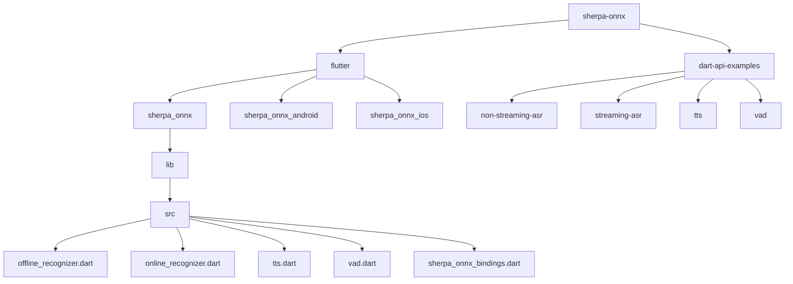
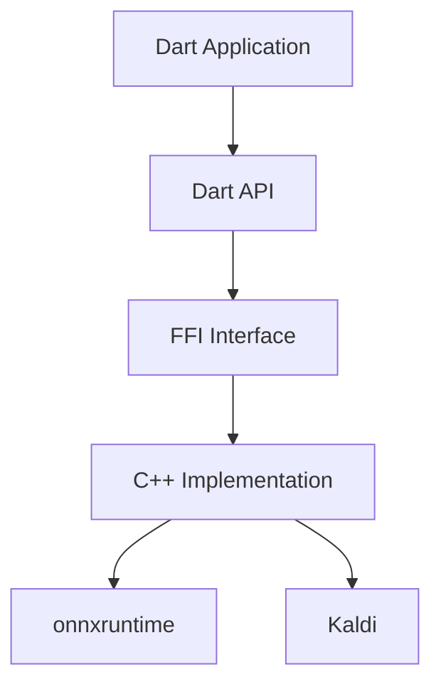
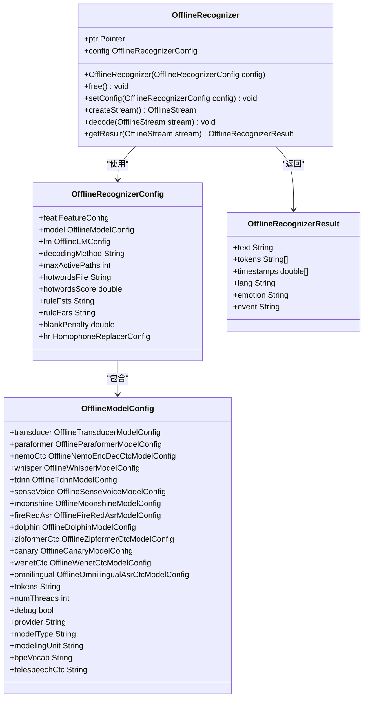
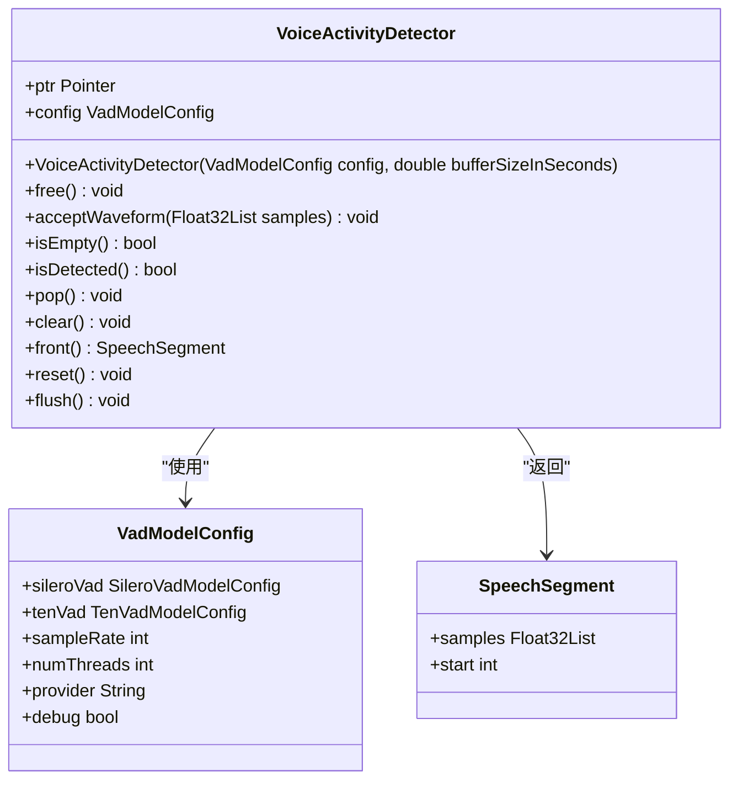
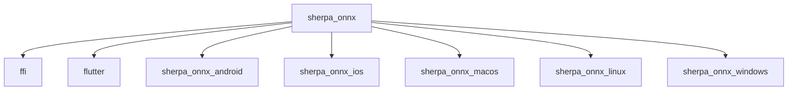

# Dart API

<cite>
**本文档中引用的文件**   
- [sherpa_onnx.dart](file://flutter/sherpa_onnx/lib/sherpa_onnx.dart)
- [sherpa_onnx_bindings.dart](file://flutter/sherpa_onnx/lib/src/sherpa_onnx_bindings.dart)
- [offline_recognizer.dart](file://flutter/sherpa_onnx/lib/src/offline_recognizer.dart)
- [online_recognizer.dart](file://flutter/sherpa_onnx/lib/src/online_recognizer.dart)
- [tts.dart](file://flutter/sherpa_onnx/lib/src/tts.dart)
- [vad.dart](file://flutter/sherpa_onnx/lib/src/vad.dart)
- [pubspec.yaml](file://flutter/sherpa_onnx/pubspec.yaml)
- [paraformer.dart](file://dart-api-examples/non-streaming-asr/bin/paraformer.dart)
- [streaming_asr/paraformer.dart](file://dart-api-examples/streaming-asr/bin/paraformer.dart)
- [kitten-en.dart](file://dart-api-examples/tts/bin/kitten-en.dart)
</cite>

## 目录
1. [简介](#简介)
2. [项目结构](#项目结构)
3. [核心组件](#核心组件)
4. [架构概述](#架构概述)
5. [详细组件分析](#详细组件分析)
6. [依赖分析](#依赖分析)
7. [性能考虑](#性能考虑)
8. [故障排除指南](#故障排除指南)
9. [结论](#结论)

## 简介
sherpa-onnx的Dart API为语音识别、语音合成、说话人分离和说话人识别等语音处理功能提供了全面的接口。该API通过FFI（Foreign Function Interface）与底层C++实现进行交互，支持在Flutter应用中离线使用onnxruntime。API设计注重易用性和性能，提供了非流式和流式两种语音识别模式，以及关键词检测、语音活动检测（VAD）、音频标记等多种功能。本文档详细介绍了Dart API的接口、FFI实现机制、异步编程模型以及与Flutter框架的集成方式。

## 项目结构
sherpa-onnx的Dart相关代码主要位于`flutter/`和`dart-api-examples/`目录下。`flutter/`目录包含了核心的Dart插件实现，而`dart-api-examples/`目录则提供了各种功能的使用示例。



**Diagram sources**
- [flutter/sherpa_onnx/lib/src/offline_recognizer.dart](file://flutter/sherpa_onnx/lib/src/offline_recognizer.dart)
- [flutter/sherpa_onnx/lib/src/online_recognizer.dart](file://flutter/sherpa_onnx/lib/src/online_recognizer.dart)
- [flutter/sherpa_onnx/lib/src/tts.dart](file://flutter/sherpa_onnx/lib/src/tts.dart)
- [flutter/sherpa_onnx/lib/src/vad.dart](file://flutter/sherpa_onnx/lib/src/vad.dart)
- [dart-api-examples/non-streaming-asr/bin/paraformer.dart](file://dart-api-examples/non-streaming-asr/bin/paraformer.dart)
- [dart-api-examples/streaming-asr/bin/paraformer.dart](file://dart-api-examples/streaming-asr/bin/paraformer.dart)
- [dart-api-examples/tts/bin/kitten-en.dart](file://dart-api-examples/tts/bin/kitten-en.dart)

**Section sources**
- [flutter/sherpa_onnx/lib/sherpa_onnx.dart](file://flutter/sherpa_onnx/lib/sherpa_onnx.dart)
- [flutter/sherpa_onnx/pubspec.yaml](file://flutter/sherpa_onnx/pubspec.yaml)

## 核心组件
Dart API的核心组件包括离线语音识别器（OfflineRecognizer）、在线语音识别器（OnlineRecognizer）、离线语音合成器（OfflineTts）和语音活动检测器（VoiceActivityDetector）。这些组件通过FFI与底层C++库进行交互，提供了高级的语音处理功能。

**Section sources**
- [flutter/sherpa_onnx/lib/src/offline_recognizer.dart](file://flutter/sherpa_onnx/lib/src/offline_recognizer.dart)
- [flutter/sherpa_onnx/lib/src/online_recognizer.dart](file://flutter/sherpa_onnx/lib/src/online_recognizer.dart)
- [flutter/sherpa_onnx/lib/src/tts.dart](file://flutter/sherpa_onnx/lib/src/tts.dart)
- [flutter/sherpa_onnx/lib/src/vad.dart](file://flutter/sherpa_onnx/lib/src/vad.dart)

## 架构概述
sherpa-onnx的Dart API采用分层架构，上层是Dart代码，下层是C++实现。Dart代码通过FFI调用C++导出的函数，实现了对语音处理功能的封装。



**Diagram sources**
- [flutter/sherpa_onnx/lib/sherpa_onnx.dart](file://flutter/sherpa_onnx/lib/sherpa_onnx.dart)
- [flutter/sherpa_onnx/lib/src/sherpa_onnx_bindings.dart](file://flutter/sherpa_onnx/lib/src/sherpa_onnx_bindings.dart)

## 详细组件分析

### 离线语音识别器分析
离线语音识别器（OfflineRecognizer）用于处理完整的音频文件，适用于不需要实时响应的场景。

#### 类图


**Diagram sources**
- [flutter/sherpa_onnx/lib/src/offline_recognizer.dart](file://flutter/sherpa_onnx/lib/src/offline_recognizer.dart)

**Section sources**
- [flutter/sherpa_onnx/lib/src/offline_recognizer.dart](file://flutter/sherpa_onnx/lib/src/offline_recognizer.dart)
- [dart-api-examples/non-streaming-asr/bin/paraformer.dart](file://dart-api-examples/non-streaming-asr/bin/paraformer.dart)

### 在线语音识别器分析
在线语音识别器（OnlineRecognizer）用于处理流式音频，适用于需要实时响应的场景。

#### 类图
```mermaid
classDiagram
class OnlineRecognizer {
+ptr Pointer<SherpaOnnxOnlineRecognizer>
+config OnlineRecognizerConfig
+OnlineRecognizer(OnlineRecognizerConfig config)
+free() void
+createStream({String hotwords}) OnlineStream
+isReady(OnlineStream stream) bool
+decode(OnlineStream stream) void
+getResult(OnlineStream stream) OnlineRecognizerResult
+reset(OnlineStream stream) void
+isEndpoint(OnlineStream stream) bool
}
class OnlineRecognizerConfig {
+feat FeatureConfig
+model OnlineModelConfig
+decodingMethod String
+maxActivePaths int
+enableEndpoint bool
+rule1MinTrailingSilence double
+rule2MinTrailingSilence double
+rule3MinUtteranceLength double
+hotwordsFile String
+hotwordsScore double
+ctcFstDecoderConfig OnlineCtcFstDecoderConfig
+ruleFsts String
+ruleFars String
+blankPenalty double
+hr HomophoneReplacerConfig
}
class OnlineModelConfig {
+transducer OnlineTransducerModelConfig
+paraformer OnlineParaformerModelConfig
+zipformer2Ctc OnlineZipformer2CtcModelConfig
+nemoCtc OnlineNemoCtcModelConfig
+toneCtc OnlineToneCtcModelConfig
+tokens String
+numThreads int
+provider String
+debug bool
+modelType String
+modelingUnit String
+bpeVocab String
}
class OnlineRecognizerResult {
+text String
+tokens String[]
+timestamps double[]
}
OnlineRecognizer --> OnlineRecognizerConfig : "使用"
OnlineRecognizer --> OnlineRecognizerResult : "返回"
OnlineRecognizerConfig --> OnlineModelConfig : "包含"
```

**Diagram sources**
- [flutter/sherpa_onnx/lib/src/online_recognizer.dart](file://flutter/sherpa_onnx/lib/src/online_recognizer.dart)

**Section sources**
- [flutter/sherpa_onnx/lib/src/online_recognizer.dart](file://flutter/sherpa_onnx/lib/src/online_recognizer.dart)
- [dart-api-examples/streaming-asr/bin/paraformer.dart](file://dart-api-examples/streaming-asr/bin/paraformer.dart)

### 语音合成器分析
离线语音合成器（OfflineTts）用于将文本转换为语音。

#### 类图
```mermaid
classDiagram
class OfflineTts {
+ptr Pointer<SherpaOnnxOfflineTts>
+config OfflineTtsConfig
+OfflineTts(OfflineTtsConfig config)
+free() void
+generate({String text, int sid, double speed}) GeneratedAudio
+generateWithCallback({String text, int sid, double speed, Function callback}) GeneratedAudio
+sampleRate int
+numSpeakers int
}
class OfflineTtsConfig {
+model OfflineTtsModelConfig
+ruleFsts String
+maxNumSenetences int
+ruleFars String
+silenceScale double
}
class OfflineTtsModelConfig {
+vits OfflineTtsVitsModelConfig
+matcha OfflineTtsMatchaModelConfig
+kokoro OfflineTtsKokoroModelConfig
+kitten OfflineTtsKittenModelConfig
+zipvoice OfflineTtsZipVoiceModelConfig
+numThreads int
+debug bool
+provider String
}
class GeneratedAudio {
+samples Float32List
+sampleRate int
}
OfflineTts --> OfflineTtsConfig : "使用"
OfflineTts --> GeneratedAudio : "返回"
OfflineTtsConfig --> OfflineTtsModelConfig : "包含"
```

**Diagram sources**
- [flutter/sherpa_onnx/lib/src/tts.dart](file://flutter/sherpa_onnx/lib/src/tts.dart)

**Section sources**
- [flutter/sherpa_onnx/lib/src/tts.dart](file://flutter/sherpa_onnx/lib/src/tts.dart)
- [dart-api-examples/tts/bin/kitten-en.dart](file://dart-api-examples/tts/bin/kitten-en.dart)

### 语音活动检测器分析
语音活动检测器（VoiceActivityDetector）用于检测音频中的语音活动。

#### 类图


**Diagram sources**
- [flutter/sherpa_onnx/lib/src/vad.dart](file://flutter/sherpa_onnx/lib/src/vad.dart)

**Section sources**
- [flutter/sherpa_onnx/lib/src/vad.dart](file://flutter/sherpa_onnx/lib/src/vad.dart)

## 依赖分析
Dart API的主要依赖包括`ffi`包，用于实现Dart与C++代码的交互，以及`flutter`框架。此外，还依赖于平台特定的插件，如`sherpa_onnx_android`和`sherpa_onnx_ios`。



**Diagram sources**
- [flutter/sherpa_onnx/pubspec.yaml](file://flutter/sherpa_onnx/pubspec.yaml)

**Section sources**
- [flutter/sherpa_onnx/pubspec.yaml](file://flutter/sherpa_onnx/pubspec.yaml)

## 性能考虑
为了优化性能，建议在移动设备上使用CPU作为推理提供者，而在Web端可以考虑使用WebAssembly。对于流式语音识别，应合理设置缓冲区大小以平衡延迟和性能。在Flutter应用中，可以使用Isolate来避免阻塞UI线程。

## 故障排除指南
常见问题包括模型文件路径错误、FFI调用失败等。确保模型文件路径正确，并且在调用FFI函数前已正确初始化。对于Android和iOS平台，确保已正确配置权限和依赖。

**Section sources**
- [flutter/sherpa_onnx/lib/sherpa_onnx.dart](file://flutter/sherpa_onnx/lib/sherpa_onnx.dart)
- [flutter/sherpa_onnx/lib/src/sherpa_onnx_bindings.dart](file://flutter/sherpa_onnx/lib/src/sherpa_onnx_bindings.dart)

## 结论
sherpa-onnx的Dart API为Flutter应用提供了强大的语音处理能力。通过FFI与底层C++库的高效交互，实现了高性能的语音识别、语音合成等功能。API设计简洁易用，支持多种语音处理模式，适用于各种应用场景。