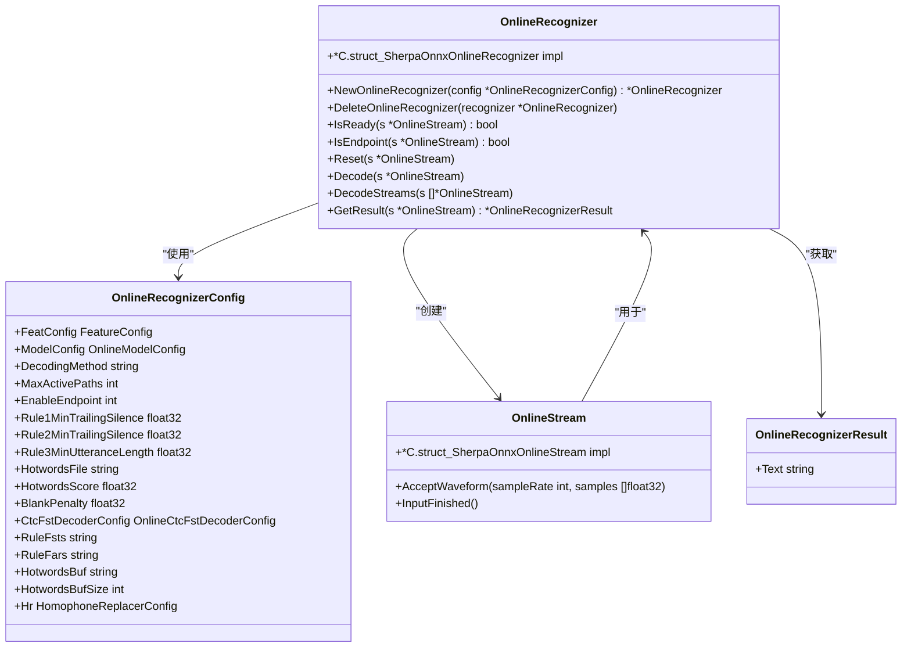
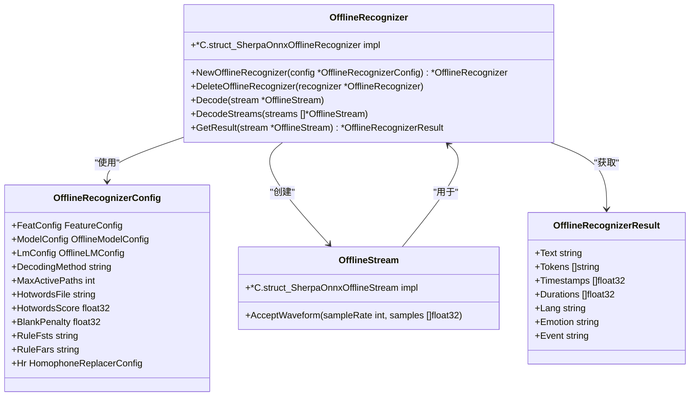

# Go API

<cite>
**本文档引用的文件**   
- [sherpa_onnx.go](file://scripts/go/_internal/sherpa_onnx.go)
- [c-api.h](file://scripts/go/_internal/c-api.h)
- [go.mod](file://scripts/go/_internal/go.mod)
- [build_darwin_amd64.go](file://scripts/go/_internal/build_darwin_amd64.go)
- [build_linux_amd64.go](file://scripts/go/_internal/build_linux_amd64.go)
- [build_windows_amd64.go](file://scripts/go/_internal/build_windows_amd64.go)
- [main.go](file://go-api-examples/real-time-speech-recognition-from-microphone/main.go)
- [main.go](file://go-api-examples/non-streaming-decode-files/main.go)
- [main.go](file://go-api-examples/streaming-decode-files/main.go)
- [main.go](file://go-api-examples/non-streaming-tts/main.go)
</cite>

## 目录
1. [简介](#简介)
2. [项目结构](#项目结构)
3. [核心组件](#核心组件)
4. [架构概述](#架构概述)
5. [详细组件分析](#详细组件分析)
6. [依赖分析](#依赖分析)
7. [性能考虑](#性能考虑)
8. [故障排除指南](#故障排除指南)
9. [结论](#结论)

## 简介
sherpa-onnx Go API 是一个开源的语音识别框架，专为下一代 Kaldi 设计。它仅依赖于 onnxruntime，支持流式和非流式语音识别。该 API 不需要在识别过程中访问网络，所有操作均在本地运行。它支持多种平台，包括 Linux (x86_64, aarch64, arm)、Windows (x86_64, x86)、macOS (x86_64, arm64) 等。

**Section sources**
- [sherpa_onnx.go](file://scripts/go/_internal/sherpa_onnx.go#L1-L39)

## 项目结构
Go API 的实现位于 `scripts/go/_internal/` 目录下，主要由 `sherpa_onnx.go` 文件构成，该文件通过 CGO 绑定 C API。构建脚本针对不同平台（如 Darwin、Linux、Windows）提供了特定的构建文件。示例代码位于 `go-api-examples/` 目录中，涵盖了实时语音识别、文件解码、文本转语音等多种应用场景。

**Section sources**
- [sherpa_onnx.go](file://scripts/go/_internal/sherpa_onnx.go#L1-L39)
- [build_darwin_amd64.go](file://scripts/go/_internal/build_darwin_amd64.go#L1-L6)
- [build_linux_amd64.go](file://scripts/go/_internal/build_linux_amd64.go#L1-L6)
- [build_windows_amd64.go](file://scripts/go/_internal/build_windows_amd64.go#L1-L6)

## 核心组件
Go API 的核心组件包括在线和离线识别器、流式处理、模型配置等。这些组件通过 CGO 绑定到 C API，提供了 Go 语言的接口。

**Section sources**
- [sherpa_onnx.go](file://scripts/go/_internal/sherpa_onnx.go#L52-L800)

## 架构概述
Go API 的架构基于 C API，通过 CGO 进行绑定。Go 代码调用 C 函数，C 函数再调用底层的 C++ 实现。这种架构使得 Go API 能够利用 C++ 的高性能计算能力，同时提供 Go 语言的易用性。

```mermaid
graph TB
subgraph "Go API"
Go[Go 代码]
end
subgraph "CGO"
CGO[CGO 绑定]
end
subgraph "C API"
C[C API]
end
subgraph "C++ 实现"
Cpp[C++ 实现]
end
Go --> CGO
CGO --> C
C --> Cpp
```

**Diagram sources**
- [sherpa_onnx.go](file://scripts/go/_internal/sherpa_onnx.go#L42-L46)
- [c-api.h](file://scripts/go/_internal/c-api.h#L1-L800)

## 详细组件分析
### 在线识别器分析
在线识别器用于实时语音识别，支持流式处理。它通过 `OnlineRecognizer` 结构体实现，提供了创建、销毁、解码等方法。

#### 结构体定义


**Diagram sources**
- [sherpa_onnx.go](file://scripts/go/_internal/sherpa_onnx.go#L169-L383)

### 离线识别器分析
离线识别器用于非流式语音识别，适用于文件解码等场景。它通过 `OfflineRecognizer` 结构体实现，提供了创建、销毁、解码等方法。

#### 结构体定义


**Diagram sources**
- [sherpa_onnx.go](file://scripts/go/_internal/sherpa_onnx.go#L526-L545)

### CGO 绑定实现原理
CGO 绑定通过 `#include` 指令引入 C 头文件，并使用 `import "C"` 导入 C 包。Go 代码通过调用 C 函数来实现与 C API 的交互。C 函数的参数和返回值需要进行类型转换，以确保 Go 和 C 之间的数据一致性。

**Section sources**
- [sherpa_onnx.go](file://scripts/go/_internal/sherpa_onnx.go#L42-L46)

### Goroutine 并发模型
Go API 利用 Goroutine 实现并发处理。在实时语音识别示例中，音频采集和解码分别在不同的 Goroutine 中运行，确保了实时性和高效性。

**Section sources**
- [main.go](file://go-api-examples/real-time-speech-recognition-from-microphone/main.go#L70-L92)

## 依赖分析
Go API 依赖于 `onnxruntime` 进行神经网络计算，通过 CGO 绑定 C API。构建过程依赖于特定平台的构建脚本，确保了跨平台的兼容性。

**Section sources**
- [sherpa_onnx.go](file://scripts/go/_internal/sherpa_onnx.go#L42-L46)
- [c-api.h](file://scripts/go/_internal/c-api.h#L1-L800)

## 性能考虑
在高并发场景下，Go API 的性能受到线程数、模型复杂度和硬件性能的影响。优化建议包括使用多线程计算、选择合适的模型和硬件加速。

**Section sources**
- [sherpa_onnx.go](file://scripts/go/_internal/sherpa_onnx.go#L101-L103)
- [main.go](file://go-api-examples/real-time-speech-recognition-from-microphone/main.go#L22-L23)

## 故障排除指南
常见问题包括模型加载失败、音频格式不支持等。解决方法包括检查模型路径、确保音频格式符合要求等。

**Section sources**
- [main.go](file://go-api-examples/non-streaming-decode-files/main.go#L119-L129)

## 结论
sherpa-onnx Go API 提供了一个强大且灵活的语音识别解决方案，适用于多种应用场景。通过详细的文档和示例，开发者可以快速上手并集成到自己的项目中。