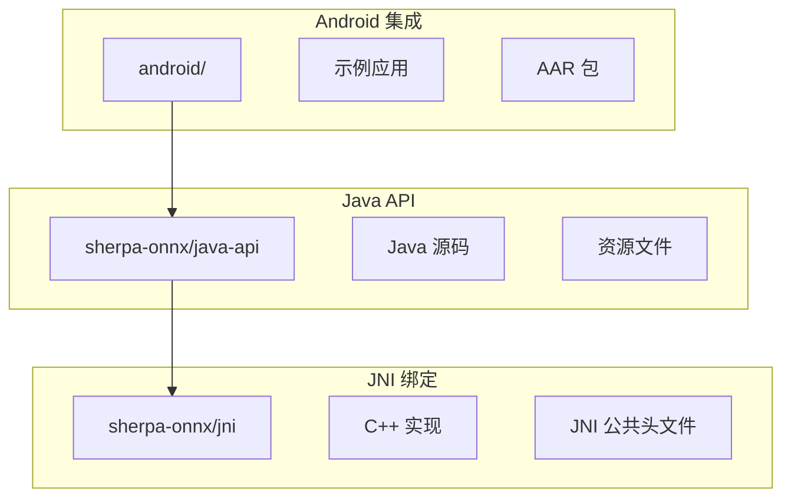
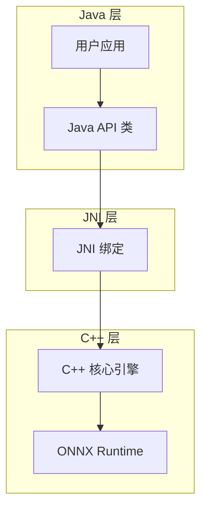
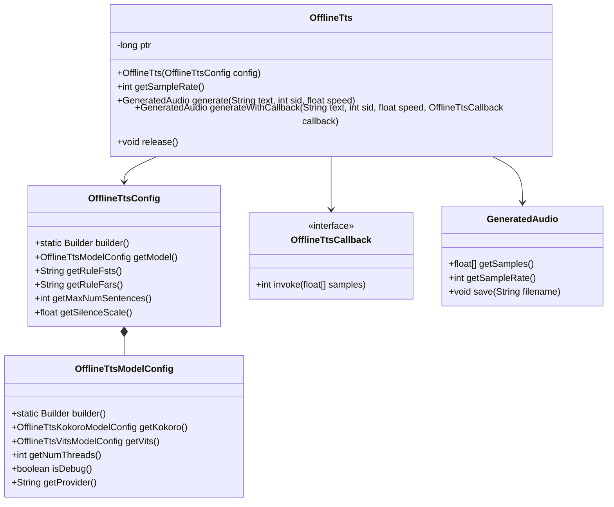
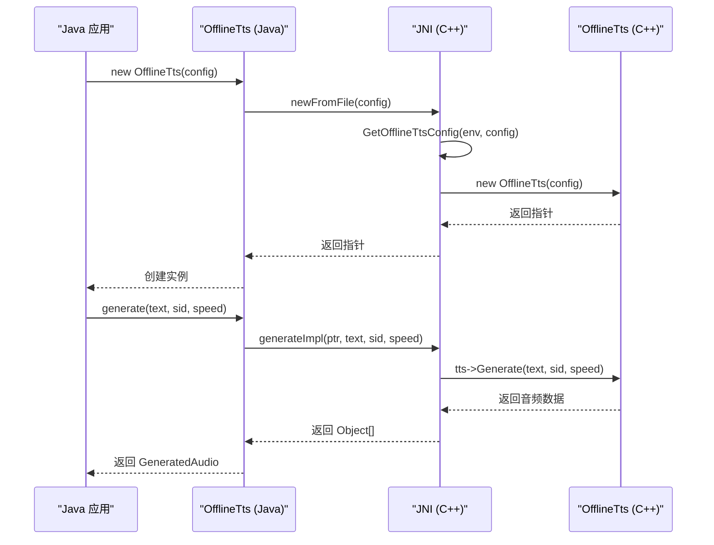
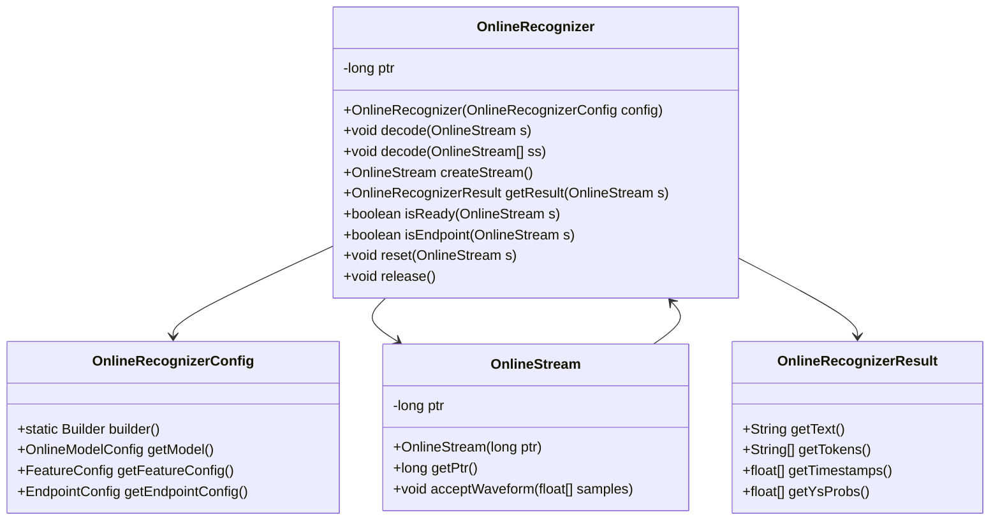
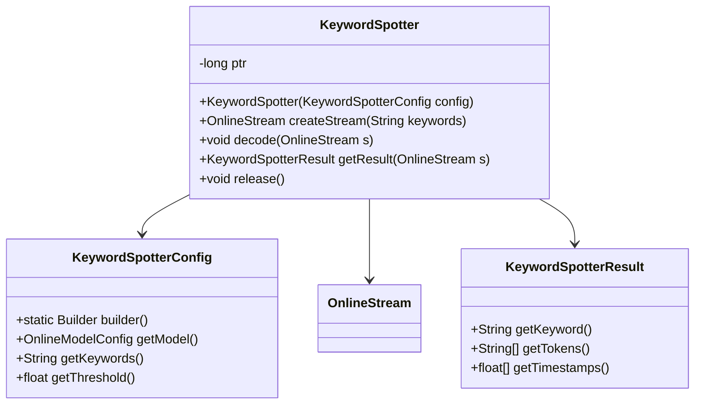
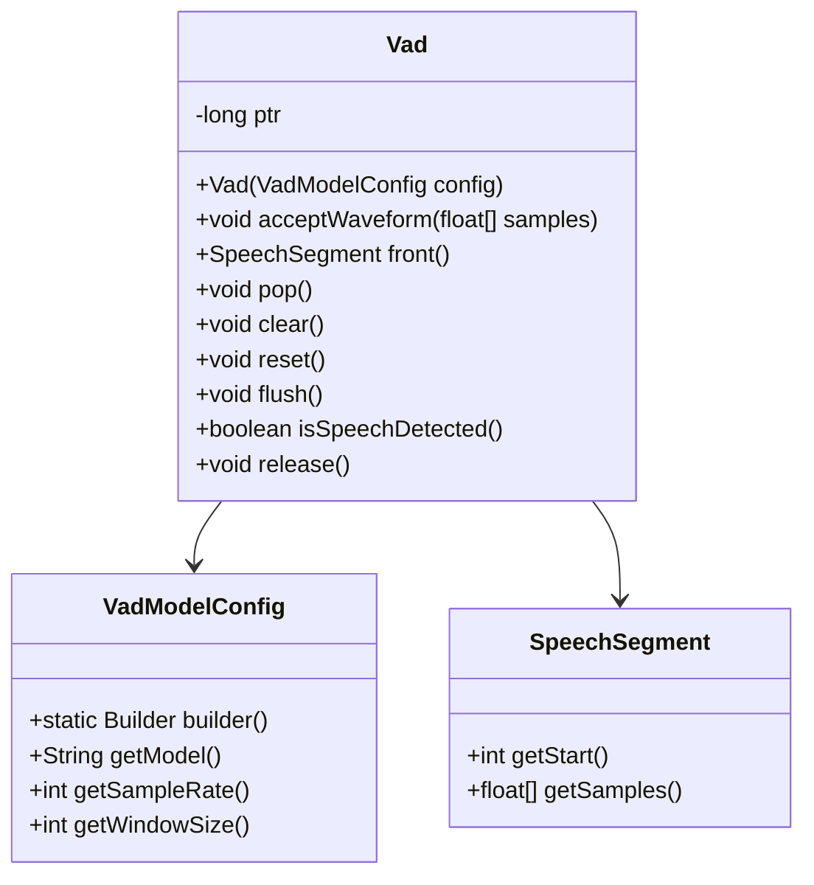

# Java API

<cite>
**本文档中引用的文件**  
- [OfflineTts.java](file://sherpa-onnx/java-api/src/main/java/com/k2fsa/sherpa/onnx/OfflineTts.java)
- [OnlineRecognizer.java](file://sherpa-onnx/java-api/src/main/java/com/k2fsa/sherpa/onnx/OnlineRecognizer.java)
- [KeywordSpotter.java](file://sherpa-onnx/java-api/src/main/java/com/k2fsa/sherpa/onnx/KeywordSpotter.java)
- [OfflineRecognizer.java](file://sherpa-onnx/java-api/src/main/java/com/k2fsa/sherpa/onnx/OfflineRecognizer.java)
- [Vad.java](file://sherpa-onnx/java-api/src/main/java/com/k2fsa/sherpa/onnx/Vad.java)
- [LibraryLoader.java](file://sherpa-onnx/java-api/src/main/java/com/k2fsa/sherpa/onnx/LibraryLoader.java)
- [OfflineTtsConfig.java](file://sherpa-onnx/java-api/src/main/java/com/k2fsa/sherpa/onnx/OfflineTtsConfig.java)
- [OfflineTtsModelConfig.java](file://sherpa-onnx/java-api/src/main/java/com/k2fsa/sherpa/onnx/OfflineTtsModelConfig.java)
- [common.h](file://sherpa-onnx/jni/common.h)
- [offline-tts.cc](file://sherpa-onnx/jni/offline-tts.cc)
- [jni.cc](file://sherpa-onnx/jni/jni.cc)
- [build.gradle](file://android/SherpaOnnxJavaDemo/app/build.gradle)
- [README.md](file://sherpa-onnx/java-api/README.md)
</cite>

## 目录
1. [简介](#简介)
2. [项目结构](#项目结构)
3. [核心组件](#核心组件)
4. [架构概述](#架构概述)
5. [详细组件分析](#详细组件分析)
6. [依赖分析](#依赖分析)
7. [性能考虑](#性能考虑)
8. [故障排除指南](#故障排除指南)
9. [结论](#结论)

## 简介
sherpa-onnx 是一个用于语音识别、语音合成、关键词识别和语音活动检测的高性能跨平台库。本参考文档详细介绍了其 Java API，包括所有核心类、接口和方法的签名，JNI 绑定的实现细节，内存管理机制，异常处理策略，线程安全性和生命周期管理。文档还为 Android 开发场景提供了专门的使用指南、性能优化建议、Gradle 依赖配置、ProGuard 规则和 AAR 集成说明，并为每个核心功能提供了完整的 Java 代码示例。

## 项目结构
sherpa-onnx 项目的 Java API 主要位于 `sherpa-onnx/java-api` 目录下，其核心是 JNI 绑定，位于 `sherpa-onnx/jni` 目录。Android 示例和演示应用位于 `android/` 目录下，展示了如何在 Android 项目中集成和使用该库。



**Diagram sources**
- [sherpa-onnx/java-api](file://sherpa-onnx/java-api)
- [sherpa-onnx/jni](file://sherpa-onnx/jni)
- [android/](file://android/)

**Section sources**
- [sherpa-onnx/java-api](file://sherpa-onnx/java-api)
- [sherpa-onnx/jni](file://sherpa-onnx/jni)
- [android/](file://android/)

## 核心组件
sherpa-onnx Java API 的核心组件包括用于离线和在线语音识别的 `OfflineRecognizer` 和 `OnlineRecognizer`，用于文本转语音的 `OfflineTts`，用于关键词识别的 `KeywordSpotter`，以及用于语音活动检测的 `Vad`。这些类通过 JNI 与底层的 C++ 实现进行交互，并遵循一致的构建器模式进行配置。

**Section sources**
- [OfflineTts.java](file://sherpa-onnx/java-api/src/main/java/com/k2fsa/sherpa/onnx/OfflineTts.java)
- [OnlineRecognizer.java](file://sherpa-onnx/java-api/src/main/java/com/k2fsa/sherpa/onnx/OnlineRecognizer.java)
- [KeywordSpotter.java](file://sherpa-onnx/java-api/src/main/java/com/k2fsa/sherpa/onnx/KeywordSpotter.java)
- [OfflineRecognizer.java](file://sherpa-onnx/java-api/src/main/java/com/k2fsa/sherpa/onnx/OfflineRecognizer.java)
- [Vad.java](file://sherpa-onnx/java-api/src/main/java/com/k2fsa/sherpa/onnx/Vad.java)

## 架构概述
sherpa-onnx Java API 采用分层架构。上层是纯 Java 接口，为开发者提供简洁易用的 API。中层是 JNI 绑定，负责在 Java 和 C++ 之间进行数据转换和函数调用。底层是用 C++ 编写的高性能核心引擎，利用 ONNX Runtime 执行深度学习模型推理。



**Diagram sources**
- [OfflineTts.java](file://sherpa-onnx/java-api/src/main/java/com/k2fsa/sherpa/onnx/OfflineTts.java)
- [jni.cc](file://sherpa-onnx/jni/jni.cc)
- [offline-tts.cc](file://sherpa-onnx/jni/offline-tts.cc)

## 详细组件分析

### OfflineTts 分析
`OfflineTts` 类是文本转语音功能的核心。它使用构建器模式（Builder Pattern）来配置模型和生成参数。该类通过 JNI 调用 C++ 的 `OfflineTts` 实例，并管理其生命周期。

#### 类图


**Diagram sources**
- [OfflineTts.java](file://sherpa-onnx/java-api/src/main/java/com/k2fsa/sherpa/onnx/OfflineTts.java)
- [OfflineTtsConfig.java](file://sherpa-onnx/java-api/src/main/java/com/k2fsa/sherpa/onnx/OfflineTtsConfig.java)
- [OfflineTtsModelConfig.java](file://sherpa-onnx/java-api/src/main/java/com/k2fsa/sherpa/onnx/OfflineTtsModelConfig.java)

#### JNI 绑定实现
JNI 绑定的实现位于 `offline-tts.cc` 文件中。`GetOfflineTtsConfig` 函数负责将 Java 的 `OfflineTtsConfig` 对象转换为 C++ 的 `OfflineTtsConfig` 结构体。宏 `SHERPA_ONNX_JNI_READ_STRING` 和 `SHERPA_ONNX_JNI_READ_FLOAT` 等用于安全地读取 Java 对象的字段。



**Diagram sources**
- [OfflineTts.java](file://sherpa-onnx/java-api/src/main/java/com/k2fsa/sherpa/onnx/OfflineTts.java)
- [offline-tts.cc](file://sherpa-onnx/jni/offline-tts.cc)

**Section sources**
- [OfflineTts.java](file://sherpa-onnx/java-api/src/main/java/com/k2fsa/sherpa/onnx/OfflineTts.java)
- [offline-tts.cc](file://sherpa-onnx/jni/offline-tts.cc)
- [common.h](file://sherpa-onnx/jni/common.h)

### OnlineRecognizer 分析
`OnlineRecognizer` 类用于流式语音识别。它允许创建多个 `OnlineStream` 来处理并发的音频流。`decode` 方法用于将音频数据送入识别器，`getResult` 方法用于获取当前的识别结果。

#### 类图


**Diagram sources**
- [OnlineRecognizer.java](file://sherpa-onnx/java-api/src/main/java/com/k2fsa/sherpa/onnx/OnlineRecognizer.java)

**Section sources**
- [OnlineRecognizer.java](file://sherpa-onnx/java-api/src/main/java/com/k2fsa/sherpa/onnx/OnlineRecognizer.java)

### KeywordSpotter 分析
`KeywordSpotter` 类用于关键词识别。其 API 设计与 `OnlineRecognizer` 类似，但专注于检测预定义的关键词短语。

#### 类图


**Diagram sources**
- [KeywordSpotter.java](file://sherpa-onnx/java-api/src/main/java/com/k2fsa/sherpa/onnx/KeywordSpotter.java)

**Section sources**
- [KeywordSpotter.java](file://sherpa-onnx/java-api/src/main/java/com/k2fsa/sherpa/onnx/KeywordSpotter.java)

### Vad 分析
`Vad` 类用于检测音频流中的语音活动。它提供了一系列方法来处理音频数据并获取语音段。

#### 类图


**Diagram sources**
- [Vad.java](file://sherpa-onnx/java-api/src/main/java/com/k2fsa/sherpa/onnx/Vad.java)

**Section sources**
- [Vad.java](file://sherpa-onnx/java-api/src/main/java/com/k2fsa/sherpa/onnx/Vad.java)

## 依赖分析
sherpa-onnx Java API 的主要依赖是 ONNX Runtime，它必须由用户手动安装。对于 Android 开发，可以通过 AAR 包进行集成。

### Gradle 依赖配置
在 Android 项目的 `build.gradle` 文件中添加依赖：

```gradle
dependencies {
    implementation 'com.github.k2-fsa:sherpa-onnx:v1.12.19'
}
```

### ProGuard 规则
为了防止代码混淆，需要在 `proguard-rules.pro` 文件中添加规则：

```
-keep class com.k2fsa.sherpa.onnx.** { *; }
```

### AAR 集成
也可以直接将 AAR 文件作为依赖项添加到项目中。

**Section sources**
- [build.gradle](file://android/SherpaOnnxJavaDemo/app/build.gradle)
- [README.md](file://sherpa-onnx/java-api/README.md)

## 性能考虑
- **线程安全性**：`OfflineTts` 和 `OnlineRecognizer` 的实例不是线程安全的。每个线程应使用自己的实例，或在访问时进行同步。
- **内存管理**：所有核心类都通过 `release()` 方法或 `finalize()` 方法管理其本机资源。强烈建议在不再需要时手动调用 `release()` 以避免内存泄漏。
- **性能优化**：通过 `setNumThreads` 配置模型以利用多核 CPU。对于 Android，考虑使用 `newFromAsset` 方法直接从 APK 资产加载模型，以减少 I/O 延迟。

## 故障排除指南
- **UnsatisfiedLinkError**：确保 `libsherpa-onnx-jni.so` 库在 `java.library.path` 中，或使用 `-Djava.library.path` 指定其路径。
- **模型加载失败**：检查模型文件路径是否正确，并确保所有必需的文件（如 `tokens.txt`, `espeak-ng-data`）都存在。
- **JNI 字段访问错误**：确保 Java 配置类的字段名称与 C++ 代码中的宏读取的名称完全匹配。

**Section sources**
- [LibraryLoader.java](file://sherpa-onnx/java-api/src/main/java/com/k2fsa/sherpa/onnx/LibraryLoader.java)
- [common.h](file://sherpa-onnx/jni/common.h)
- [README.md](file://sherpa-onnx/java-api/README.md)

## 结论
sherpa-onnx 的 Java API 提供了一个强大且灵活的接口，用于在 Java 和 Android 应用中集成先进的语音处理功能。通过理解其 JNI 绑定机制、内存管理策略和配置模式，开发者可以有效地利用该库构建高性能的语音应用。