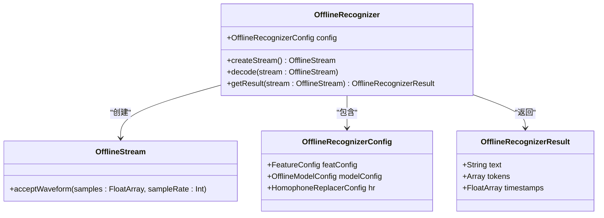
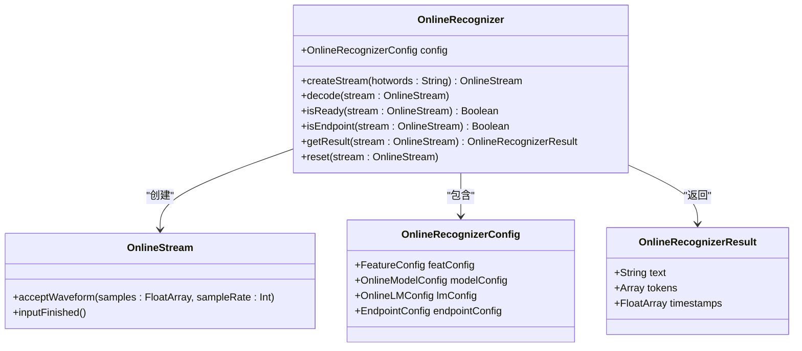
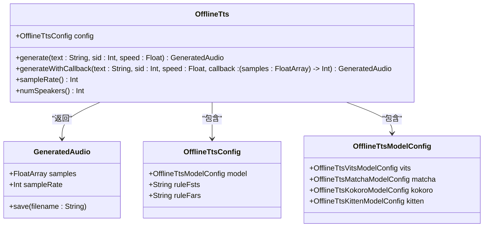
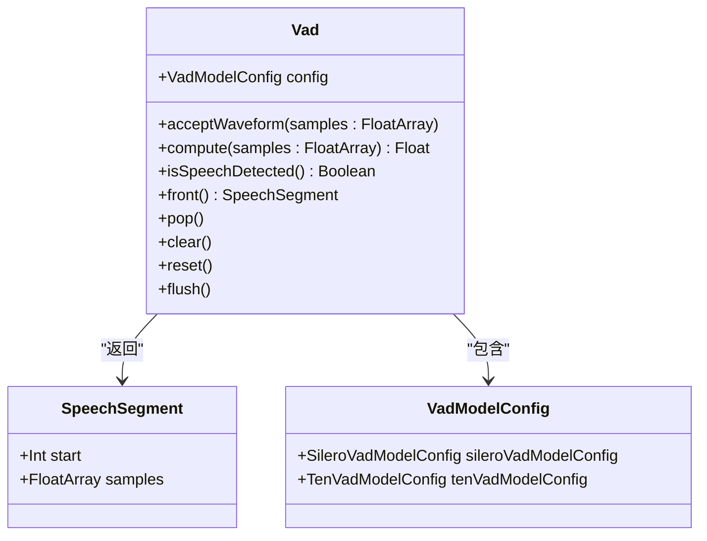
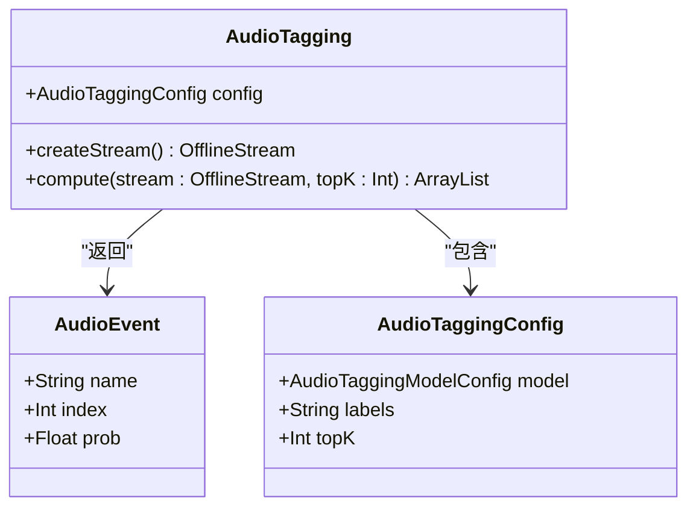
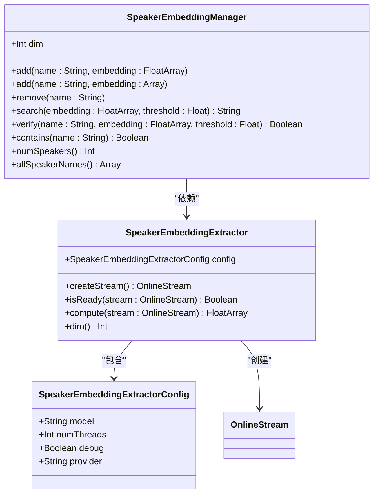

# Kotlin API

<cite>
**本文档中引用的文件**
- [OfflineRecognizer.kt](file://sherpa-onnx/kotlin-api/OfflineRecognizer.kt)
- [OnlineRecognizer.kt](file://sherpa-onnx/kotlin-api/OnlineRecognizer.kt)
- [Tts.kt](file://sherpa-onnx/kotlin-api/Tts.kt)
- [Vad.kt](file://sherpa-onnx/kotlin-api/Vad.kt)
- [WaveReader.kt](file://sherpa-onnx/kotlin-api/WaveReader.kt)
- [FeatureConfig.kt](file://sherpa-onnx/kotlin-api/FeatureConfig.kt)
- [QnnConfig.kt](file://sherpa-onnx/kotlin-api/QnnConfig.kt)
- [HomophoneReplacerConfig.kt](file://sherpa-onnx/kotlin-api/HomophoneReplacerConfig.kt)
- [OfflineStream.kt](file://sherpa-onnx/kotlin-api/OfflineStream.kt)
- [OnlineStream.kt](file://sherpa-onnx/kotlin-api/OnlineStream.kt)
- [AudioTagging.kt](file://sherpa-onnx/kotlin-api/AudioTagging.kt)
- [SpokenLanguageIdentification.kt](file://sherpa-onnx/kotlin-api/SpokenLanguageIdentification.kt)
- [Speaker.kt](file://sherpa-onnx/kotlin-api/Speaker.kt)
- [MainActivity.kt](file://android/SherpaOnnx/app/src/main/java/com/k2fsa/sherpa/onnx/MainActivity.kt)
- [test_offline_asr.kt](file://kotlin-api-examples/test_offline_asr.kt)
</cite>

## 目录
1. [简介](#简介)
2. [核心组件](#核心组件)
3. [离线语音识别](#离线语音识别)
4. [在线语音识别](#在线语音识别)
5. [文本转语音](#文本转语音)
6. [语音活动检测](#语音活动检测)
7. [音频标签](#音频标签)
8. [说话人识别](#说话人识别)
9. [语言特性集成](#语言特性集成)
10. [Android集成](#android集成)
11. [最佳实践](#最佳实践)

## 简介
sherpa-onnx为Kotlin开发者提供了完整的语音处理API，支持离线和在线语音识别、文本转语音、语音活动检测、音频标签和说话人识别等功能。本API专为Android平台设计，利用JNI与底层C++代码交互，提供高性能的语音处理能力。

**本文档中引用的文件**
- [OfflineRecognizer.kt](file://sherpa-onnx/kotlin-api/OfflineRecognizer.kt)
- [OnlineRecognizer.kt](file://sherpa-onnx/kotlin-api/OnlineRecognizer.kt)
- [Tts.kt](file://sherpa-onnx/kotlin-api/Tts.kt)

## 核心组件
sherpa-onnx的Kotlin API由多个核心类组成，每个类负责特定的语音处理任务。主要组件包括语音识别器、文本转语音引擎、语音活动检测器和说话人识别器。这些组件通过JNI与底层C++代码交互，提供高效的语音处理能力。

所有组件都遵循类似的初始化模式：通过配置对象设置参数，然后创建实例。配置对象使用Kotlin的数据类实现，提供类型安全和默认值。组件实例在使用完毕后需要调用`release()`方法释放资源，或依赖Kotlin的垃圾回收机制自动清理。

**本文档中引用的文件**
- [OfflineRecognizer.kt](file://sherpa-onnx/kotlin-api/OfflineRecognizer.kt)
- [OnlineRecognizer.kt](file://sherpa-onnx/kotlin-api/OnlineRecognizer.kt)
- [Tts.kt](file://sherpa-onnx/kotlin-api/Tts.kt)
- [Vad.kt](file://sherpa-onnx/kotlin-api/Vad.kt)

## 离线语音识别
离线语音识别器（OfflineRecognizer）用于处理预先录制的音频文件或完整的音频流。它通过OfflineStream接收音频数据，然后进行解码和识别。



**图源**
- [OfflineRecognizer.kt](file://sherpa-onnx/kotlin-api/OfflineRecognizer.kt)
- [OfflineStream.kt](file://sherpa-onnx/kotlin-api/OfflineStream.kt)

**本文档中引用的文件**
- [OfflineRecognizer.kt](file://sherpa-onnx/kotlin-api/OfflineRecognizer.kt)
- [OfflineStream.kt](file://sherpa-onnx/kotlin-api/OfflineStream.kt)
- [test_offline_asr.kt](file://kotlin-api-examples/test_offline_asr.kt)

## 在线语音识别
在线语音识别器（OnlineRecognizer）用于实时处理流式音频数据，如麦克风输入。它支持端点检测，可以自动识别语音段的开始和结束。



**图源**
- [OnlineRecognizer.kt](file://sherpa-onnx/kotlin-api/OnlineRecognizer.kt)
- [OnlineStream.kt](file://sherpa-onnx/kotlin-api/OnlineStream.kt)

**本文档中引用的文件**
- [OnlineRecognizer.kt](file://sherpa-onnx/kotlin-api/OnlineRecognizer.kt)
- [OnlineStream.kt](file://sherpa-onnx/kotlin-api/OnlineStream.kt)
- [MainActivity.kt](file://android/SherpaOnnx/app/src/main/java/com/k2fsa/sherpa/onnx/MainActivity.kt)

## 文本转语音
文本转语音（TTS）功能将文本转换为自然语音。支持多种TTS模型，包括VITS、Matcha、Kokoro和Kitten。



**图源**
- [Tts.kt](file://sherpa-onnx/kotlin-api/Tts.kt)

**本文档中引用的文件**
- [Tts.kt](file://sherpa-onnx/kotlin-api/Tts.kt)

## 语音活动检测
语音活动检测（VAD）用于检测音频流中的语音活动。支持Silero VAD和Ten VAD两种模型。



**图源**
- [Vad.kt](file://sherpa-onnx/kotlin-api/Vad.kt)

**本文档中引用的文件**
- [Vad.kt](file://sherpa-onnx/kotlin-api/Vad.kt)

## 音频标签
音频标签功能用于识别音频中的声音事件，如音乐、语音、噪音等。



**图源**
- [AudioTagging.kt](file://sherpa-onnx/kotlin-api/AudioTagging.kt)

**本文档中引用的文件**
- [AudioTagging.kt](file://sherpa-onnx/kotlin-api/AudioTagging.kt)

## 说话人识别
说话人识别功能包括说话人嵌入提取器和说话人管理器，用于说话人验证和识别。



**图源**
- [Speaker.kt](file://sherpa-onnx/kotlin-api/Speaker.kt)

**本文档中引用的文件**
- [Speaker.kt](file://sherpa-onnx/kotlin-api/Speaker.kt)

## 语言特性集成
sherpa-onnx的Kotlin API充分利用了Kotlin的语言特性，提供了更安全、更简洁的API。

### 空安全
所有API都遵循Kotlin的空安全原则。配置对象的属性都有默认值，避免了空指针异常。例如，FeatureConfig类的所有属性都有默认值：

```kotlin
data class FeatureConfig(
    var sampleRate: Int = 16000,
    var featureDim: Int = 80,
    var dither: Float = 0.0f
)
```

### 扩展函数
API提供了多个扩展函数来简化常见操作。例如，WaveReader类提供了从资产或文件读取波形的扩展函数：

```kotlin
fun readWave(assetManager: AssetManager, filename: String): WaveData
fun readWave(filename: String): WaveData
```

### 协程支持
虽然API本身不直接使用协程，但可以轻松与协程集成。例如，在Android应用中，可以在协程中调用语音识别操作：

```kotlin
lifecycleScope.launch {
    val result = withContext(Dispatchers.Default) {
        recognizer.getResult(stream)
    }
    textView.text = result.text
}
```

**本文档中引用的文件**
- [FeatureConfig.kt](file://sherpa-onnx/kotlin-api/FeatureConfig.kt)
- [WaveReader.kt](file://sherpa-onnx/kotlin-api/WaveReader.kt)

## Android集成
在Android应用中集成sherpa-onnx需要在build.gradle中添加依赖，并在AndroidManifest.xml中请求录音权限。

### 初始化
在Activity中初始化语音识别器：

```kotlin
val config = OnlineRecognizerConfig(
    featConfig = getFeatureConfig(sampleRate = 16000, featureDim = 80),
    modelConfig = getModelConfig(type = 0)!!,
    endpointConfig = getEndpointConfig(),
    enableEndpoint = true,
)

recognizer = OnlineRecognizer(
    assetManager = application.assets,
    config = config,
)
```

### 麦克风输入
使用AudioRecord从麦克风获取音频数据：

```kotlin
val audioRecord = AudioRecord(
    MediaRecorder.AudioSource.MIC,
    sampleRateInHz,
    AudioFormat.CHANNEL_IN_MONO,
    AudioFormat.ENCODING_PCM_16BIT,
    numBytes * 2
)
```

### 权限处理
在Android 6.0及以上版本中，需要动态请求录音权限：

```kotlin
ActivityCompat.requestPermissions(this, permissions, REQUEST_RECORD_AUDIO_PERMISSION)
```

**本文档中引用的文件**
- [MainActivity.kt](file://android/SherpaOnnx/app/src/main/java/com/k2fsa/sherpa/onnx/MainActivity.kt)

## 最佳实践
### 资源管理
确保在Activity销毁时释放所有资源：

```kotlin
override fun onDestroy() {
    super.onDestroy()
    recognizer.release()
    audioRecord?.release()
}
```

### 错误处理
使用try-catch块处理可能的异常：

```kotlin
try {
    val result = recognizer.getResult(stream)
    // 处理结果
} catch (e: Exception) {
    Log.e(TAG, "识别失败", e)
}
```

### 性能优化
- 使用适当数量的线程：对于复杂的TTS模型，使用更多线程
- 预加载模型：在应用启动时初始化模型，避免在关键路径上延迟
- 复用流对象：在连续识别场景中复用流对象，减少内存分配

**本文档中引用的文件**
- [MainActivity.kt](file://android/SherpaOnnx/app/src/main/java/com/k2fsa/sherpa/onnx/MainActivity.kt)