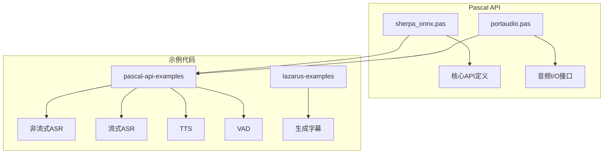
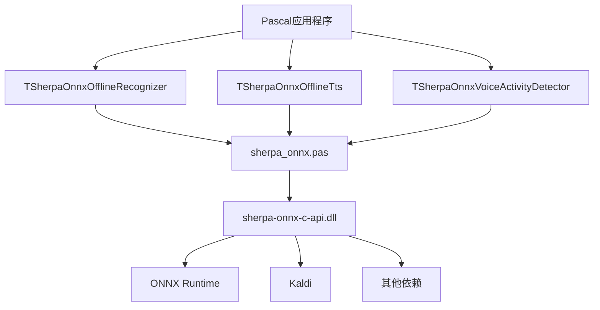
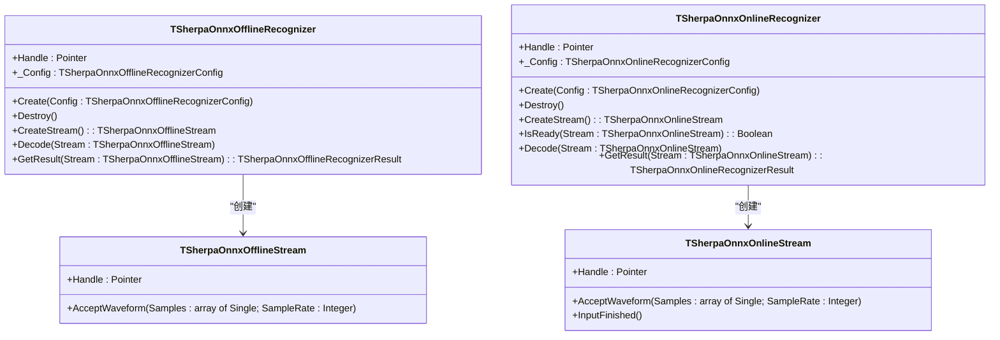
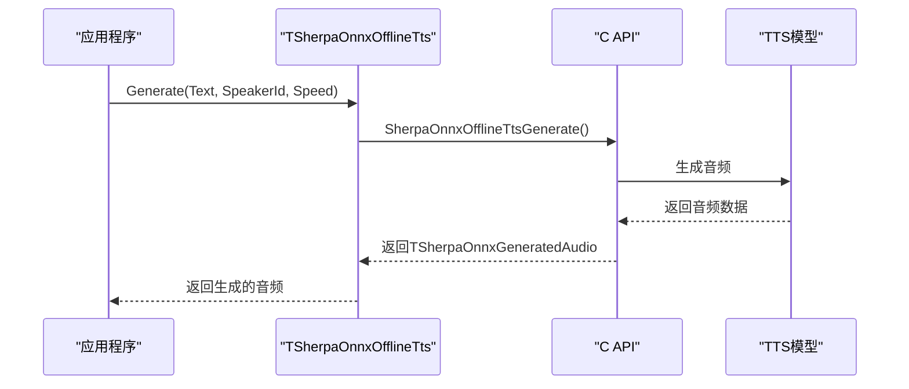
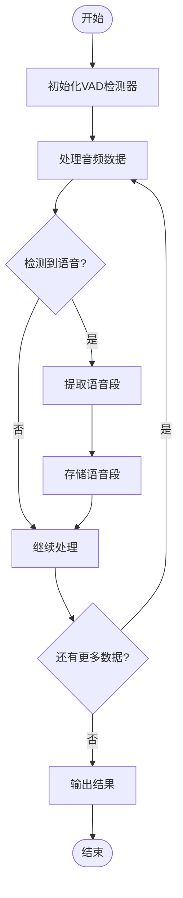
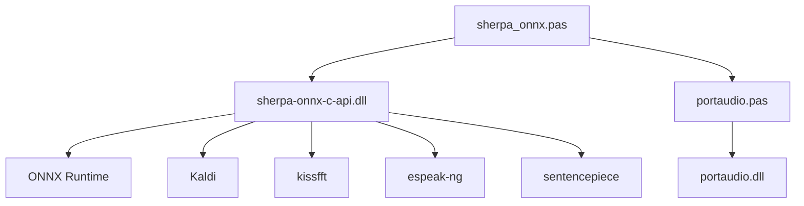

# Pascal API

<cite>
**本文档引用的文件**   
- [sherpa_onnx.pas](file://sherpa-onnx/pascal-api/sherpa_onnx.pas)
- [portaudio.pas](file://sherpa-onnx/pascal-api/portaudio.pas)
- [README.md](file://sherpa-onnx/pascal-api/README.md)
- [generate_subtitles.lpi](file://lazarus-examples/generate_subtitles/generate_subtitles.lpi)
</cite>

## 目录
1. [简介](#简介)
2. [项目结构](#项目结构)
3. [核心组件](#核心组件)
4. [架构概述](#架构概述)
5. [详细组件分析](#详细组件分析)
6. [依赖分析](#依赖分析)
7. [性能考虑](#性能考虑)
8. [故障排除指南](#故障排除指南)
9. [结论](#结论)
10. [附录](#附录) (如有必要)

## 简介
本文档详细记录了sherpa-onnx项目的Pascal API，为Free Pascal和Lazarus IDE用户提供全面的参考。文档涵盖了所有Pascal过程、函数和对象的接口，解释了Free Pascal编译器的特定要求和调用约定，文档化了动态链接库（DLL）的加载机制和内存管理策略。同时，为Lazarus IDE用户提供了项目配置和可视化组件集成指南，并包括Windows和Linux平台的差异说明，以及ANSI/Unicode字符串处理的最佳实践。

## 项目结构
sherpa-onnx项目的Pascal API主要位于`sherpa-onnx/pascal-api`目录下，包含核心API定义文件`sherpa_onnx.pas`和音频I/O库`portaudio.pas`。示例代码分布在`pascal-api-examples`和`lazarus-examples`目录中，展示了各种应用场景的使用方法。

**图源**
- [sherpa_onnx.pas](file://sherpa-onnx/pascal-api/sherpa_onnx.pas)
- [portaudio.pas](file://sherpa-onnx/pascal-api/portaudio.pas)

**节源**
- [sherpa_onnx.pas](file://sherpa-onnx/pascal-api/sherpa_onnx.pas)
- [portaudio.pas](file://sherpa-onnx/pascal-api/portaudio.pas)
- [README.md](file://sherpa-onnx/pascal-api/README.md)

## 核心组件
Pascal API的核心组件包括语音识别、文本转语音、语音活动检测和说话人分离等功能。这些组件通过面向对象的类和记录结构提供，封装了底层C API的复杂性，为Pascal开发者提供了简洁易用的接口。

**节源**
- [sherpa_onnx.pas](file://sherpa-onnx/pascal-api/sherpa_onnx.pas)

## 架构概述
Pascal API采用分层架构，上层是面向对象的Pascal包装类，下层是与C API的绑定。这种设计既保持了Pascal语言的特性，又充分利用了底层C库的高性能。

**图源**
- [sherpa_onnx.pas](file://sherpa-onnx/pascal-api/sherpa_onnx.pas)

## 详细组件分析

### 语音识别组件分析
语音识别组件提供了离线和在线两种模式，支持多种模型类型，包括Transducer、Paraformer和Whisper等。

#### 对于面向对象的组件：

**图源**
- [sherpa_onnx.pas](file://sherpa-onnx/pascal-api/sherpa_onnx.pas#L456-L504)

### 文本转语音组件分析
文本转语音组件支持多种TTS模型，包括VITS、Matcha和Kokoro等，提供了同步和异步两种生成模式。

#### 对于API/服务组件：

**图源**
- [sherpa_onnx.pas](file://sherpa-onnx/pascal-api/sherpa_onnx.pas#L150-L172)

### 语音活动检测组件分析
语音活动检测组件用于检测音频流中的语音段，支持Silero VAD和Ten VAD两种模型。

#### 对于复杂逻辑组件：

**图源**
- [sherpa_onnx.pas](file://sherpa-onnx/pascal-api/sherpa_onnx.pas#L526-L544)

## 依赖分析
Pascal API依赖于多个外部库和组件，包括ONNX Runtime、Kaldi、PortAudio等。这些依赖通过动态链接库的方式加载，确保了跨平台的兼容性。

**图源**
- [sherpa_onnx.pas](file://sherpa-onnx/pascal-api/sherpa_onnx.pas)
- [portaudio.pas](file://sherpa-onnx/pascal-api/portaudio.pas)

**节源**
- [sherpa_onnx.pas](file://sherpa-onnx/pascal-api/sherpa_onnx.pas)
- [portaudio.pas](file://sherpa-onnx/pascal-api/portaudio.pas)

## 性能考虑
在使用Pascal API时，需要注意以下性能考虑：
- 使用适当的线程数配置以平衡CPU使用率和实时性
- 对于流式处理，合理设置缓冲区大小以减少延迟
- 在Windows上使用静态链接可以获得更好的性能
- 对于长时间运行的应用，注意内存泄漏问题

## 故障排除指南
常见问题及解决方案：
- **DLL加载失败**：确保所有依赖的DLL文件都在系统路径中或与可执行文件在同一目录
- **音频设备访问失败**：检查音频设备是否被其他应用程序占用
- **模型加载失败**：验证模型文件路径是否正确，文件是否完整
- **内存不足**：减少并发流的数量或使用更小的模型

**节源**
- [sherpa_onnx.pas](file://sherpa-onnx/pascal-api/sherpa_onnx.pas)
- [portaudio.pas](file://sherpa-onnx/pascal-api/portaudio.pas)

## 结论
sherpa-onnx的Pascal API为Free Pascal和Lazarus开发者提供了一个强大而易用的语音处理工具集。通过详细的文档和丰富的示例，开发者可以快速集成语音识别、文本转语音和语音活动检测等功能到自己的应用程序中。

## 附录
### Free Pascal编译器要求
- 必须使用`{$mode objfpc}`模式
- 需要启用`{$modeSwitch advancedRecords}`以支持记录中的方法
- 建议使用`{$LongStrings ON}`以支持长字符串

### Lazarus IDE项目配置
在Lazarus IDE中配置项目时，需要在项目选项中添加以下设置：
- 在"搜索路径"中添加`..\..\sherpa-onnx\pascal-api`
- 在"库文件"中添加`..\..\build-static\install\lib`或`..\..\build\install\lib`
- 对于Linux版本，需要添加`-dSHERPA_ONNX_USE_SHARED_LIBS`编译选项

### 平台差异说明
- **Windows**：默认使用静态链接，DLL文件名为`sherpa-onnx-c-api.dll`
- **Linux**：默认使用动态链接，库文件名为`libsherpa-onnx-c-api.so`
- **macOS**：使用动态链接，库文件名为`libsherpa-onnx-c-api.dylib`

### ANSI/Unicode字符串处理
Pascal API使用`AnsiString`类型处理字符串，确保与底层C API的兼容性。在处理非ASCII字符时，建议使用UTF-8编码的模型文件和输入文本。