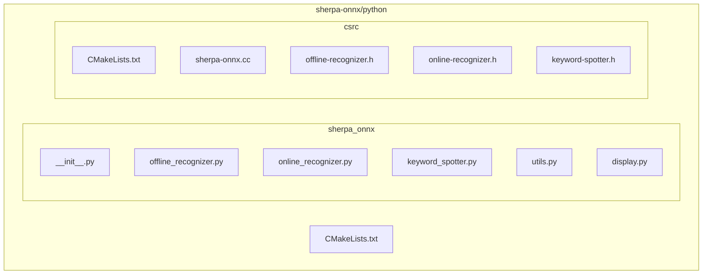
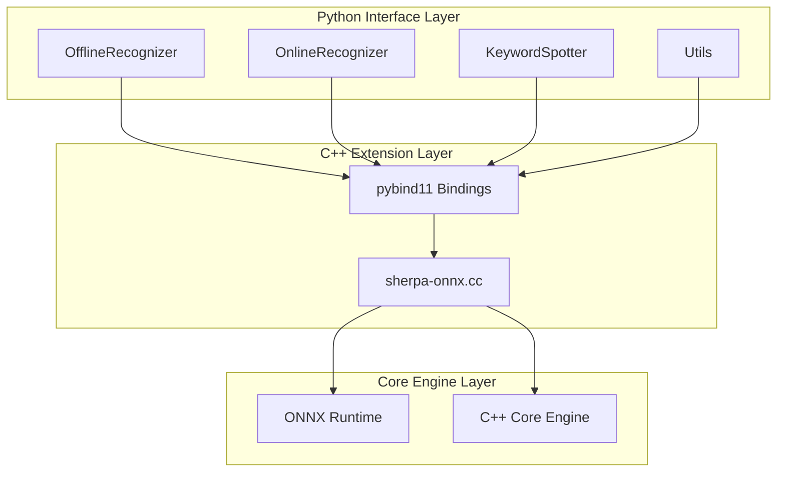
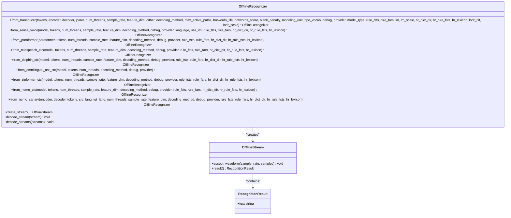
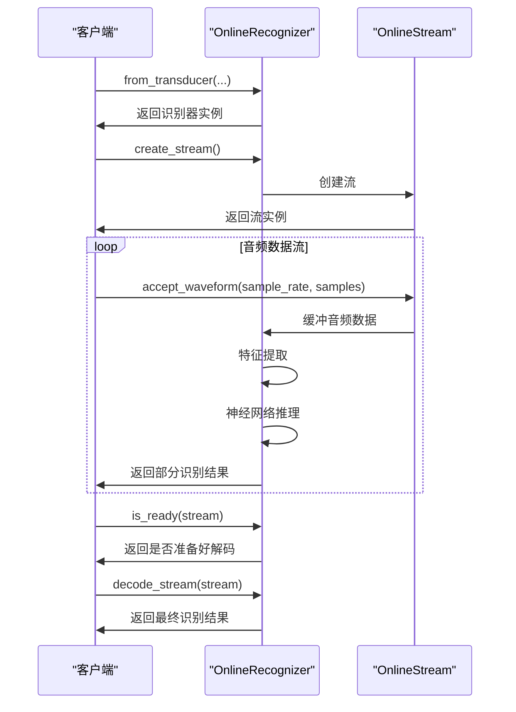
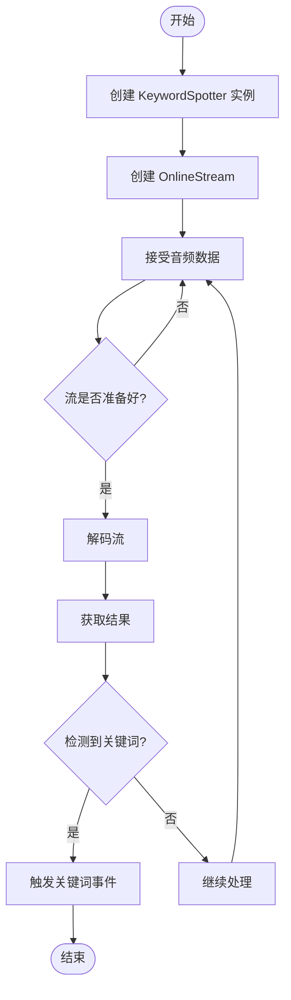
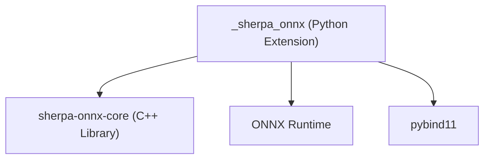

# Python API

<cite>
**本文档中引用的文件**   
- [__init__.py](file://sherpa-onnx/python/sherpa_onnx/__init__.py)
- [CMakeLists.txt](file://sherpa-onnx/python/CMakeLists.txt)
- [csrc/CMakeLists.txt](file://sherpa-onnx/python/csrc/CMakeLists.txt)
- [sherpa-onnx.cc](file://sherpa-onnx/python/csrc/sherpa-onnx.cc)
- [offline_recognizer.py](file://sherpa-onnx/python/sherpa_onnx/offline_recognizer.py)
- [online_recognizer.py](file://sherpa-onnx/python/sherpa_onnx/online_recognizer.py)
- [keyword_spotter.py](file://sherpa-onnx/python/sherpa_onnx/keyword_spotter.py)
- [utils.py](file://sherpa-onnx/python/sherpa_onnx/utils.py)
- [display.py](file://sherpa-onnx/python/sherpa_onnx/display.py)
- [setup.py](file://setup.py)
- [test_offline_recognizer.py](file://sherpa-onnx/python/tests/test_offline_recognizer.py)
- [offline-decode-files.py](file://python-api-examples/offline-decode-files.py)
</cite>

## 目录
1. [简介](#简介)
2. [项目结构](#项目结构)
3. [核心组件](#核心组件)
4. [架构概述](#架构概述)
5. [详细组件分析](#详细组件分析)
6. [依赖分析](#依赖分析)
7. [性能考虑](#性能考虑)
8. [故障排除指南](#故障排除指南)
9. [结论](#结论)

## 简介
sherpa-onnx 是一个用于语音识别、语音合成、关键词检测等语音处理任务的高性能库。其 Python API 通过 pybind11 将 C++ 核心功能绑定到 Python，提供了简洁易用的接口。该 API 支持离线和流式语音识别、语音合成、关键词检测、语音活动检测（VAD）、说话人分离等多种功能。Python API 的设计注重性能和易用性，允许用户通过简单的配置和调用实现复杂的语音处理任务。本文档详细记录了所有 Python 模块、类和函数的接口，重点说明了 Python 绑定的实现机制和性能特征。

## 项目结构
sherpa-onnx 项目的 Python API 相关文件主要位于 `sherpa-onnx/python` 目录下。该目录包含 Python 模块的源代码、C++ 扩展的源代码以及测试文件。Python 模块的源代码位于 `sherpa_onnx` 子目录中，而 C++ 扩展的源代码位于 `csrc` 子目录中。构建系统使用 CMake 来管理 Python 扩展的编译和链接。

**Diagram sources**
- [__init__.py](file://sherpa-onnx/python/sherpa_onnx/__init__.py)
- [CMakeLists.txt](file://sherpa-onnx/python/CMakeLists.txt)
- [csrc/CMakeLists.txt](file://sherpa-onnx/python/csrc/CMakeLists.txt)
- [sherpa-onnx.cc](file://sherpa-onnx/python/csrc/sherpa-onnx.cc)

**Section sources**
- [__init__.py](file://sherpa-onnx/python/sherpa_onnx/__init__.py)
- [CMakeLists.txt](file://sherpa-onnx/python/CMakeLists.txt)
- [csrc/CMakeLists.txt](file://sherpa-onnx/python/csrc/CMakeLists.txt)

## 核心组件
sherpa-onnx Python API 的核心组件包括离线识别器（OfflineRecognizer）、在线识别器（OnlineRecognizer）和关键词检测器（KeywordSpotter）。这些组件通过 pybind11 绑定到 C++ 实现，提供了高性能的语音处理功能。`OfflineRecognizer` 用于处理完整的音频文件，`OnlineRecognizer` 用于流式语音识别，而 `KeywordSpotter` 用于实时检测预定义的关键词。这些组件共享相似的配置模式，通过工厂方法（如 `from_transducer`）创建实例，并接受模型文件路径、线程数、采样率等参数。

**Section sources**
- [offline_recognizer.py](file://sherpa-onnx/python/sherpa_onnx/offline_recognizer.py)
- [online_recognizer.py](file://sherpa-onnx/python/sherpa_onnx/online_recognizer.py)
- [keyword_spotter.py](file://sherpa-onnx/python/sherpa_onnx/keyword_spotter.py)

## 架构概述
sherpa-onnx Python API 的架构分为三层：Python 接口层、C++ 扩展层和核心引擎层。Python 接口层提供用户友好的类和函数，C++ 扩展层使用 pybind11 将 C++ 类和函数绑定到 Python，核心引擎层实现语音处理算法。这种分层架构使得 Python API 既能保持高性能，又能提供简洁的接口。Python API 通过 ONNX Runtime 执行深度学习模型，支持 CPU、CUDA 和 Core ML 等多种执行提供程序。

**Diagram sources**
- [sherpa-onnx.cc](file://sherpa-onnx/python/csrc/sherpa-onnx.cc)
- [offline_recognizer.py](file://sherpa-onnx/python/sherpa_onnx/offline_recognizer.py)
- [online_recognizer.py](file://sherpa-onnx/python/sherpa_onnx/online_recognizer.py)
- [keyword_spotter.py](file://sherpa-onnx/python/sherpa_onnx/keyword_spotter.py)

## 详细组件分析

### 离线识别器分析
`OfflineRecognizer` 类是 sherpa-onnx Python API 的核心组件之一，用于离线语音识别。它提供了多种工厂方法（如 `from_transducer`、`from_paraformer`）来创建不同模型类型的识别器实例。这些方法接受模型文件路径、词元文件路径、线程数等参数，并返回配置好的识别器对象。识别器通过 `create_stream` 方法创建音频流，通过 `accept_waveform` 方法接受音频数据，最后通过 `decode_stream` 或 `decode_streams` 方法进行解码。

#### 对于对象导向组件：

**Diagram sources**
- [offline_recognizer.py](file://sherpa-onnx/python/sherpa_onnx/offline_recognizer.py)
- [offline-recognizer.h](file://sherpa-onnx/python/csrc/offline-recognizer.h)

### 在线识别器分析
`OnlineRecognizer` 类用于流式语音识别，支持实时音频处理。与 `OfflineRecognizer` 类似，它也提供了多种工厂方法来创建不同模型类型的识别器实例。在线识别器支持端点检测，可以在检测到语音结束时自动停止识别。它还支持热词增强和语言模型重打分，以提高识别准确率。

#### 对于API/服务组件：

**Diagram sources**
- [online_recognizer.py](file://sherpa-onnx/python/sherpa_onnx/online_recognizer.py)
- [online-recognizer.h](file://sherpa-onnx/python/csrc/online-recognizer.h)

### 关键词检测器分析
`KeywordSpotter` 类用于实时检测预定义的关键词。它基于流式语音识别模型，通过增强关键词的得分来提高检测灵敏度。用户可以通过 `keywords_file` 参数指定关键词列表，并通过 `keywords_score` 和 `keywords_threshold` 参数调整检测的灵敏度。

#### 对于复杂逻辑组件：

**Diagram sources**
- [keyword_spotter.py](file://sherpa-onnx/python/sherpa_onnx/keyword_spotter.py)
- [keyword-spotter.h](file://sherpa-onnx/python/csrc/keyword-spotter.h)

**Section sources**
- [offline_recognizer.py](file://sherpa-onnx/python/sherpa_onnx/offline_recognizer.py)
- [online_recognizer.py](file://sherpa-onnx/python/sherpa_onnx/online_recognizer.py)
- [keyword_spotter.py](file://sherpa-onnx/python/sherpa_onnx/keyword_spotter.py)

## 依赖分析
sherpa-onnx Python API 的依赖关系主要通过 CMake 构建系统管理。Python 扩展模块 `_sherpa_onnx` 依赖于 `sherpa-onnx-core` 库，该库实现了核心的语音处理算法。此外，Python API 还依赖于 ONNX Runtime 来执行深度学习模型，支持 CPU、CUDA 和 Core ML 等多种执行提供程序。构建系统通过 `pybind11_add_module` 函数将 C++ 源代码编译为 Python 扩展模块，并通过 `target_link_libraries` 函数链接必要的库。

**Diagram sources**
- [csrc/CMakeLists.txt](file://sherpa-onnx/python/csrc/CMakeLists.txt)
- [sherpa-onnx.cc](file://sherpa-onnx/python/csrc/sherpa-onnx.cc)

**Section sources**
- [csrc/CMakeLists.txt](file://sherpa-onnx/python/csrc/CMakeLists.txt)
- [sherpa-onnx.cc](file://sherpa-onnx/python/csrc/sherpa-onnx.cc)

## 性能考虑
sherpa-onnx Python API 的性能主要受以下几个因素影响：模型复杂度、线程数、执行提供程序和硬件性能。用户可以通过调整 `num_threads` 参数来控制神经网络计算的线程数，从而在多核 CPU 上获得更好的性能。选择合适的执行提供程序（如 CUDA）可以在支持的硬件上显著提高推理速度。此外，使用量化模型（如 int8 模型）可以在保持较高准确率的同时减少内存占用和计算时间。

## 故障排除指南
在使用 sherpa-onnx Python API 时，可能会遇到模型文件路径错误、依赖库缺失等问题。确保所有模型文件路径正确，并且所需的依赖库（如 ONNX Runtime、pybind11）已正确安装。如果遇到性能问题，可以尝试调整线程数或更换执行提供程序。对于识别准确率问题，可以尝试使用不同的模型或调整解码参数。

**Section sources**
- [test_offline_recognizer.py](file://sherpa-onnx/python/tests/test_offline_recognizer.py)
- [offline-decode-files.py](file://python-api-examples/offline-decode-files.py)

## 结论
sherpa-onnx Python API 提供了一个强大而灵活的接口，用于实现各种语音处理任务。通过 pybind11 将 C++ 核心功能绑定到 Python，它在保持高性能的同时提供了简洁易用的接口。本文档详细介绍了 API 的各个组件、架构和使用方法，帮助用户快速上手并充分利用其功能。