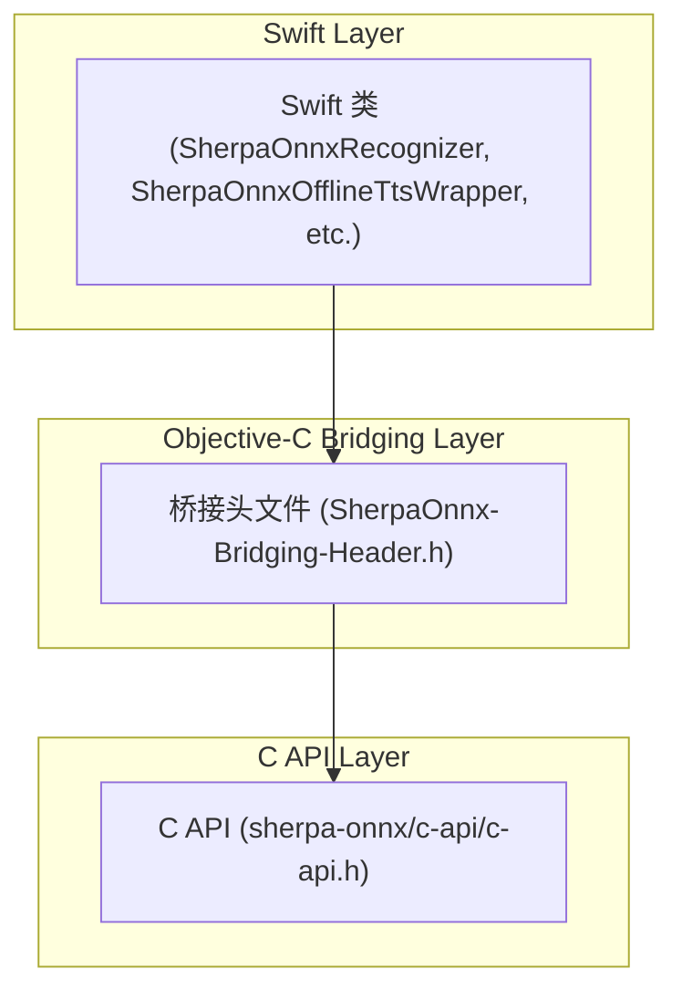
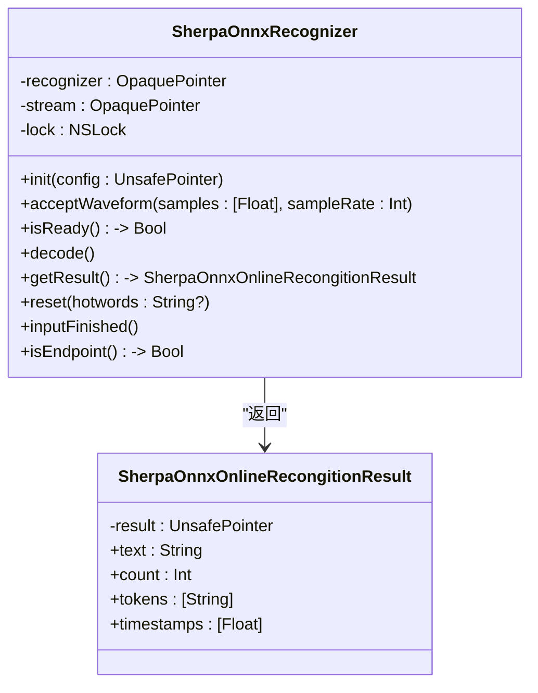
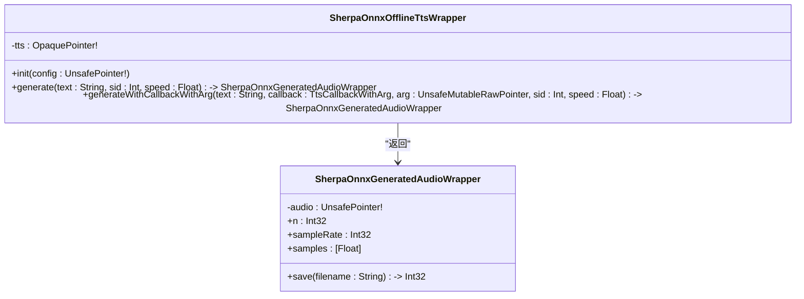
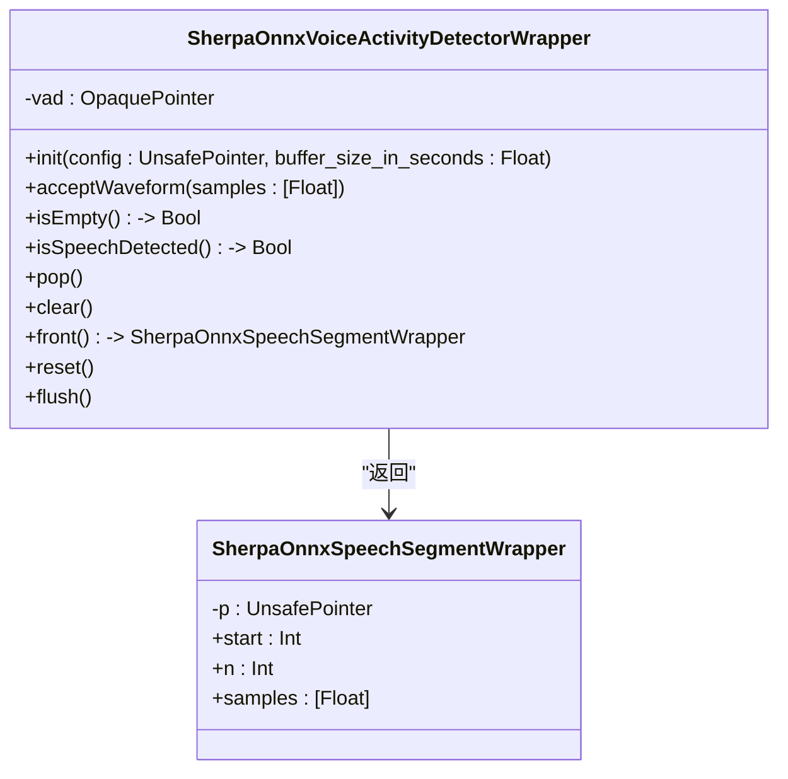
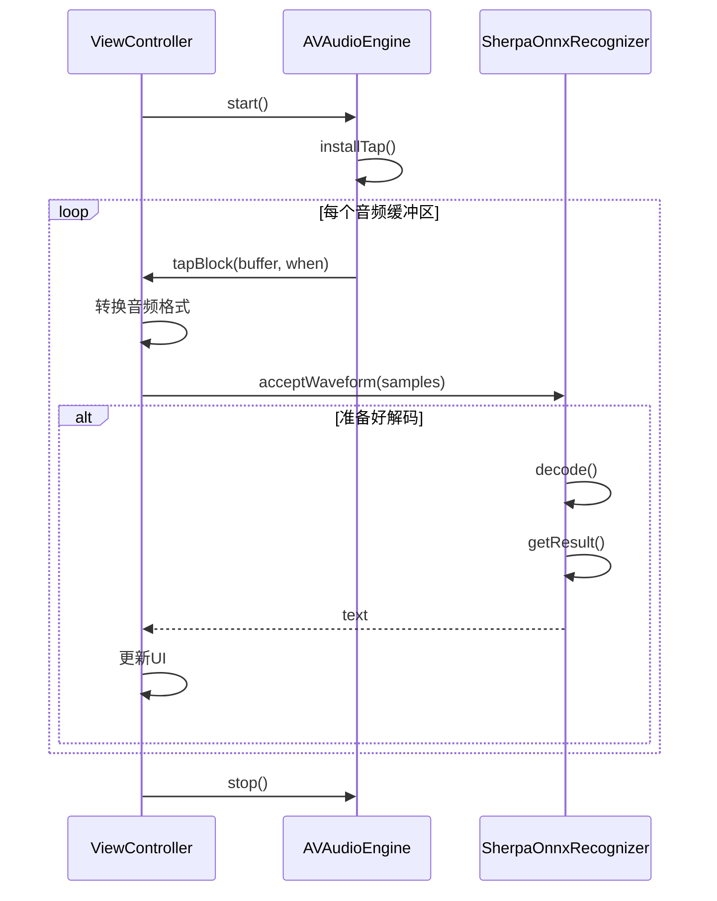
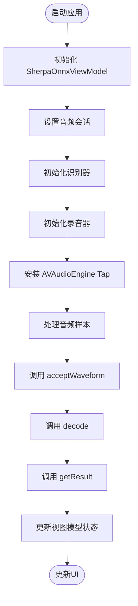
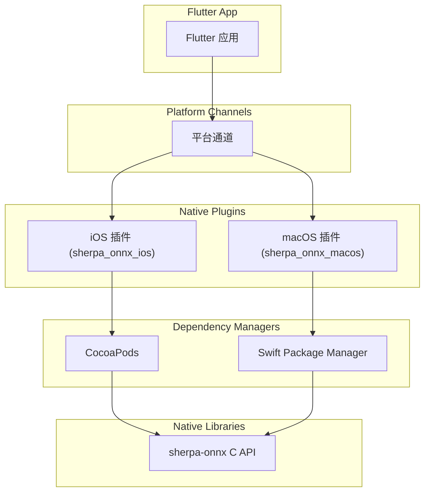

# Swift API

<cite>
**本文档中引用的文件**   
- [SherpaOnnx.swift](file://swift-api-examples/SherpaOnnx.swift)
- [SherpaOnnx-Bridging-Header.h](file://swift-api-examples/SherpaOnnx-Bridging-Header.h)
- [Model.swift](file://ios-swift/SherpaOnnx/SherpaOnnx/Model.swift)
- [ViewController.swift](file://ios-swift/SherpaOnnx/SherpaOnnx/ViewController.swift)
- [ContentView.swift](file://ios-swiftui/SherpaOnnx/SherpaOnnx/ContentView.swift)
- [SherpaOnnxViewModel.swift](file://ios-swiftui/SherpaOnnx/SherpaOnnx/SherpaOnnxViewModel.swift)
- [sherpa_onnx_ios.podspec](file://flutter/sherpa_onnx_ios/ios/sherpa_onnx_ios.podspec)
- [sherpa_onnx_macos.podspec](file://flutter/sherpa_onnx_macos/macos/sherpa_onnx_macos.podspec)
</cite>

## 目录
1. [简介](#简介)
2. [核心组件](#核心组件)
3. [架构概述](#架构概述)
4. [详细组件分析](#详细组件分析)
5. [依赖分析](#依赖分析)
6. [性能考虑](#性能考虑)
7. [故障排除指南](#故障排除指南)
8. [结论](#结论)

## 简介
sherpa-onnx Swift API 为 iOS 和 macOS 应用程序提供了语音识别、语音合成、关键词检测、语音活动检测、说话人识别和语言识别等功能。该 API 通过 Objective-C 桥接头文件封装了底层的 C API，为 Swift 开发者提供了类型安全、内存安全且符合 Swift 惯用法的接口。本参考文档详细记录了所有 Swift 类、方法和属性的接口，解释了 Objective-C 桥接的实现机制和内存管理（ARC）注意事项，并为 iOS 和 macOS 开发提供了 UIKit 和 SwiftUI 的集成示例。

## 核心组件
sherpa-onnx Swift API 的核心组件包括语音识别器（`SherpaOnnxRecognizer`）、离线语音识别器（`SherpaOnnxOfflineRecognizer`）、语音合成器（`SherpaOnnxOfflineTtsWrapper`）、语音活动检测器（`SherpaOnnxVoiceActivityDetectorWrapper`）、关键词检测器（`SherpaOnnxKeywordSpotterWrapper`）、标点符号添加器（`SherpaOnnxOfflinePunctuationWrapper`）和说话人分离器（`SherpaOnnxOfflineSpeakerDiarizationWrapper`）。这些组件通过配置对象（如 `SherpaOnnxOnlineModelConfig`、`SherpaOnnxFeatureConfig` 等）进行初始化，并通过方法调用处理音频数据和生成结果。

**核心组件**
- [SherpaOnnx.swift](file://swift-api-examples/SherpaOnnx.swift#L251-L1695)

## 架构概述
sherpa-onnx Swift API 采用分层架构，上层是 Swift 封装类，下层是 C 语言实现的 API。Swift 封装类通过 Objective-C 桥接头文件与 C API 进行交互，将 C API 的指针和结构体转换为 Swift 的对象和值类型。这种架构使得 Swift 代码可以安全地使用底层的高性能 C 代码，同时保持 Swift 语言的现代特性和安全性。

**图表来源**
- [SherpaOnnx-Bridging-Header.h](file://swift-api-examples/SherpaOnnx-Bridging-Header.h#L7)
- [SherpaOnnx.swift](file://swift-api-examples/SherpaOnnx.swift#L251-L1695)

**章节来源**
- [SherpaOnnx-Bridging-Header.h](file://swift-api-examples/SherpaOnnx-Bridging-Header.h#L1-L10)
- [SherpaOnnx.swift](file://swift-api-examples/SherpaOnnx.swift#L1-L1695)

## 详细组件分析

### 在线语音识别器分析
`SherpaOnnxRecognizer` 类是在线语音识别的核心组件，它封装了 `sherpa-onnx` 的在线识别功能。该类通过 `init(config:)` 构造函数初始化，接受一个 `SherpaOnnxOnlineRecognizerConfig` 配置对象。识别过程通过 `acceptWaveform(samples:sampleRate:)` 方法接收音频样本，`decode()` 方法执行解码，`getResult()` 方法获取识别结果。`reset()` 方法用于重置识别器状态。

**图表来源**
- [SherpaOnnx.swift](file://swift-api-examples/SherpaOnnx.swift#L251-L331)

**章节来源**
- [SherpaOnnx.swift](file://swift-api-examples/SherpaOnnx.swift#L251-L331)

### 离线语音合成器分析
`SherpaOnnxOfflineTtsWrapper` 类提供了离线语音合成功能，它封装了 `sherpa-onnx` 的 TTS 模型。该类通过 `init(config:)` 构造函数初始化，接受一个 `SherpaOnnxOfflineTtsConfig` 配置对象。语音合成通过 `generate(text:sid:speed:)` 方法执行，返回一个 `SherpaOnnxGeneratedAudioWrapper` 对象，该对象包含生成的音频样本和采样率。

**图表来源**
- [SherpaOnnx.swift](file://swift-api-examples/SherpaOnnx.swift#L1072-L1106)

**章节来源**
- [SherpaOnnx.swift](file://swift-api-examples/SherpaOnnx.swift#L1072-L1106)

### 语音活动检测器分析
`SherpaOnnxVoiceActivityDetectorWrapper` 类用于检测音频流中的语音活动。它通过 `init(config:buffer_size_in_seconds:)` 构造函数初始化，接受一个 `SherpaOnnxVadModelConfig` 配置对象和一个缓冲区大小（以秒为单位）。语音样本通过 `acceptWaveform(samples:)` 方法传入，`isSpeechDetected()` 方法检查是否检测到语音，`front()` 方法获取检测到的语音段。

**图表来源**
- [SherpaOnnx.swift](file://swift-api-examples/SherpaOnnx.swift#L796-L845)

**章节来源**
- [SherpaOnnx.swift](file://swift-api-examples/SherpaOnnx.swift#L796-L845)

### UIKit 集成示例
在 UIKit 中，`ViewController` 类展示了如何集成 `SherpaOnnxRecognizer` 进行实时语音识别。`initRecognizer()` 方法初始化识别器，`initRecorder()` 方法设置 `AVAudioEngine` 来捕获麦克风输入，并通过 `installTap(onBus:bufferSize:format:tapBlock:)` 安装一个 tap 来处理音频样本。`startRecorder()` 和 `stopRecorder()` 方法控制录音的开始和停止。

**图表来源**
- [ViewController.swift](file://ios-swift/SherpaOnnx/SherpaOnnx/ViewController.swift#L23-L203)

**章节来源**
- [ViewController.swift](file://ios-swift/SherpaOnnx/SherpaOnnx/ViewController.swift#L23-L203)

### SwiftUI 集成示例
在 SwiftUI 中，`SherpaOnnxViewModel` 类作为视图模型，管理 `SherpaOnnxRecognizer` 的状态和逻辑。`ContentView` 通过 `@StateObject` 属性包装器持有 `SherpaOnnxViewModel` 的实例，并根据视图模型的状态更新 UI。`toggleRecorder()` 方法切换录音状态，`initRecorder()` 方法设置 `AVAudioEngine` 的 tap 来处理音频样本。

**图表来源**
- [SherpaOnnxViewModel.swift](file://ios-swiftui/SherpaOnnx/SherpaOnnx/SherpaOnnxViewModel.swift#L17-L202)
- [ContentView.swift](file://ios-swiftui/SherpaOnnx/SherpaOnnx/ContentView.swift#L10-L47)

**章节来源**
- [SherpaOnnxViewModel.swift](file://ios-swiftui/SherpaOnnx/SherpaOnnx/SherpaOnnxViewModel.swift#L17-L202)
- [ContentView.swift](file://ios-swiftui/SherpaOnnx/SherpaOnnx/ContentView.swift#L10-L47)

## 依赖分析
sherpa-onnx Swift API 依赖于 `sherpa-onnx` 的 C API 库，该库通过 Objective-C 桥接头文件暴露给 Swift 代码。在 Flutter 项目中，`sherpa_onnx_ios` 和 `sherpa_onnx_macos` 插件通过 CocoaPods 或 SPM 集成 `sherpa-onnx` 库。`podspec` 文件定义了库的依赖关系和构建设置。

**图表来源**
- [sherpa_onnx_ios.podspec](file://flutter/sherpa_onnx_ios/ios/sherpa_onnx_ios.podspec)
- [sherpa_onnx_macos.podspec](file://flutter/sherpa_onnx_macos/macos/sherpa_onnx_macos.podspec)

**章节来源**
- [sherpa_onnx_ios.podspec](file://flutter/sherpa_onnx_ios/ios/sherpa_onnx_ios.podspec)
- [sherpa_onnx_macos.podspec](file://flutter/sherpa_onnx_macos/macos/sherpa_onnx_macos.podspec)

## 性能考虑
为了优化性能，建议使用 `Int8` 量化模型（如 `getZhZipformer20230615Int8()`）以减少内存占用和计算开销。在 `AVAudioEngine` 中，选择合适的缓冲区大小（如 1024 个样本）以平衡延迟和 CPU 使用率。对于电池优化，建议在不使用时停止 `AVAudioEngine`，并使用 `isEndpoint()` 方法检测语音结束以及时释放资源。

## 故障排除指南
常见问题包括模型文件未正确添加到项目中、缺少麦克风权限和音频格式不匹配。确保在 `Build Phases -> Copy Bundle Resources` 中添加了模型文件，并在 `Info.plist` 中添加了 `NSMicrophoneUsageDescription` 键。检查 `AVAudioFormat` 是否正确设置为 16kHz、单声道、浮点 PCM 格式。

**章节来源**
- [Model.swift](file://ios-swift/SherpaOnnx/SherpaOnnx/Model.swift#L3-L106)
- [Info.plist](file://ios-swift/SherpaOnnx/SherpaOnnx/Info.plist#L5-L6)

## 结论
sherpa-onnx Swift API 为 iOS 和 macOS 开发者提供了一个强大且易于使用的语音处理工具集。通过详细的 API 参考、Objective-C 桥接机制解释和 UIKit/SwiftUI 集成示例，开发者可以轻松地将语音识别、语音合成和其他功能集成到他们的应用程序中。遵循性能优化和电池优化建议，可以确保应用程序在各种设备上高效运行。