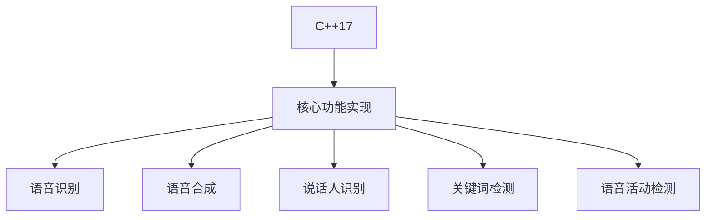
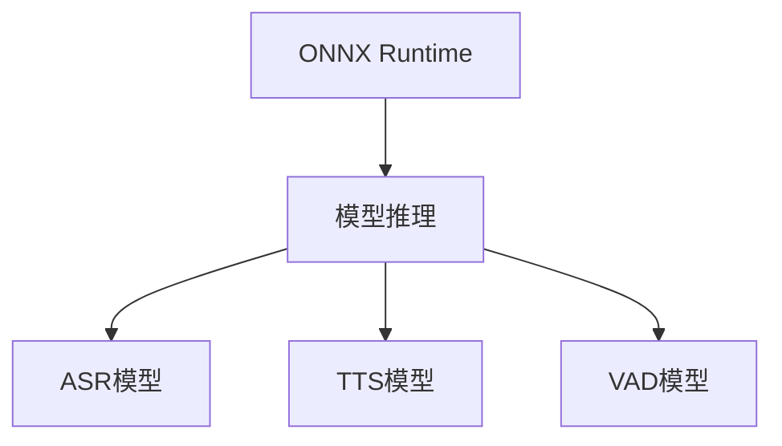
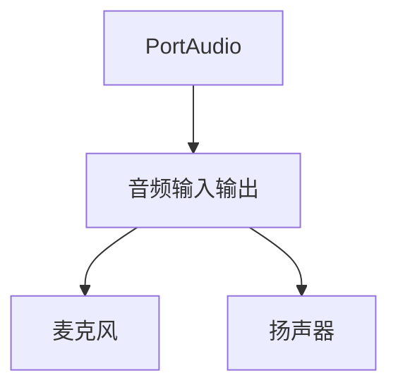
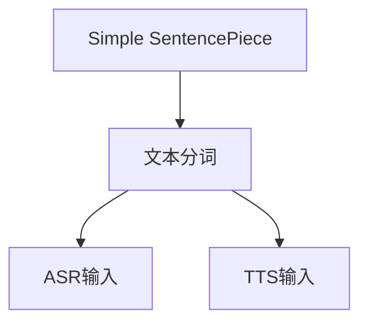
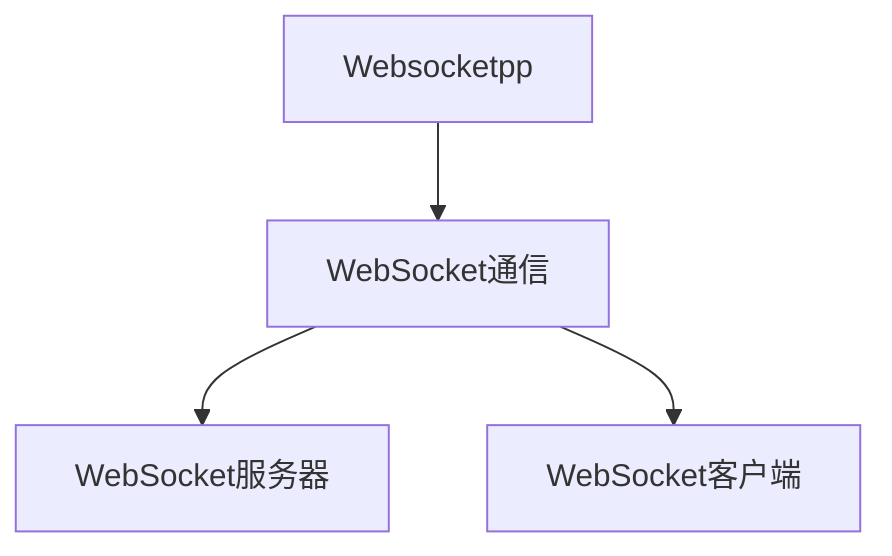
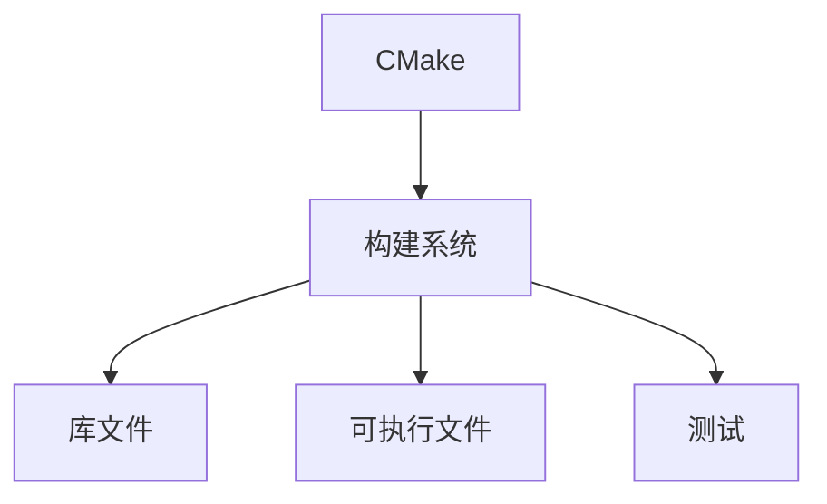
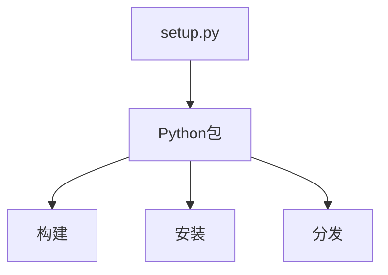

# 技术栈与依赖

<cite>
**本文档引用的文件**   
- [CMakeLists.txt](file://CMakeLists.txt)
- [setup.py](file://setup.py)
- [pom.xml](file://pom.xml)
- [onnxruntime.cmake](file://cmake/onnxruntime.cmake)
- [portaudio.cmake](file://cmake/portaudio.cmake)
- [simple-sentencepiece.cmake](file://cmake/simple-sentencepiece.cmake)
- [websocketpp.cmake](file://cmake/websocketpp.cmake)
- [sherpa-onnx/csrc/CMakeLists.txt](file://sherpa-onnx/csrc/CMakeLists.txt)
- [sherpa-onnx/jni/CMakeLists.txt](file://sherpa-onnx/jni/CMakeLists.txt)
- [sherpa-onnx/c-api/CMakeLists.txt](file://sherpa-onnx/c-api/CMakeLists.txt)
- [sherpa-onnx/python/sherpa_onnx/__init__.py](file://sherpa-onnx/python/sherpa_onnx/__init__.py)
- [README.md](file://README.md)
</cite>

## 目录
1. [项目概述](#项目概述)
2. [核心实现语言](#核心实现语言)
3. [核心依赖库](#核心依赖库)
   - [ONNX Runtime](#onnx-runtime)
   - [PortAudio](#portaudio)
   - [Simple SentencePiece](#simple-sentencepiece)
   - [Websocketpp](#websocketpp)
4. [构建系统](#构建系统)
   - [CMake](#cmake)
   - [setup.py](#setuppy)
   - [pom.xml](#pomxml)
5. [技术栈选择指导](#技术栈选择指导)
6. [版本兼容性与依赖管理](#版本兼容性与依赖管理)

## 项目概述

sherpa-onnx是一个功能丰富的语音处理框架，支持语音识别（ASR）、语音合成（TTS）、说话人分离、关键词检测等多种功能。该项目采用C++作为主要实现语言，并通过多种绑定（Python、Java、C#等）提供跨语言支持。项目支持在多种平台（包括Android、iOS、Windows、macOS、Linux等）上运行，并且支持多种硬件加速（如NPU）。

**Section sources**
- [README.md](file://README.md#L1-L590)

## 核心实现语言

sherpa-onnx项目主要使用C++17作为核心实现语言。项目中的核心功能（如语音识别、语音合成、说话人识别等）均在C++中实现，以确保高性能和跨平台兼容性。C++代码位于`sherpa-onnx/csrc/`目录下，通过CMake进行构建。

项目通过C++的现代特性（如智能指针、lambda表达式等）来提高代码的可读性和安全性。同时，项目使用C++17标准，确保了代码的现代化和高效性。

**Diagram sources**
- [sherpa-onnx/csrc/CMakeLists.txt](file://sherpa-onnx/csrc/CMakeLists.txt#L1-L800)

**Section sources**
- [CMakeLists.txt](file://CMakeLists.txt#L300-L301)
- [sherpa-onnx/csrc/CMakeLists.txt](file://sherpa-onnx/csrc/CMakeLists.txt#L1-L800)

## 核心依赖库

### ONNX Runtime

ONNX Runtime是sherpa-onnx项目的核心依赖，用于模型推理。项目通过ONNX Runtime加载和执行预训练的语音模型（如ASR、TTS等）。ONNX Runtime支持多种硬件加速（如GPU、NPU等），使得sherpa-onnx能够在不同硬件平台上高效运行。

项目通过CMake脚本`cmake/onnxruntime.cmake`自动下载和配置ONNX Runtime。根据不同的平台和硬件，项目会下载相应的ONNX Runtime版本。例如，在Linux x86_64平台上，项目会下载静态或动态链接的ONNX Runtime库。

**Diagram sources**
- [cmake/onnxruntime.cmake](file://cmake/onnxruntime.cmake#L1-L236)

**Section sources**
- [CMakeLists.txt](file://CMakeLists.txt#L473)
- [cmake/onnxruntime.cmake](file://cmake/onnxruntime.cmake#L1-L236)

### PortAudio

PortAudio用于音频输入输出，支持从麦克风采集音频和播放音频。项目通过PortAudio实现语音识别和语音合成的实时处理。PortAudio是一个跨平台的音频I/O库，支持多种操作系统（如Windows、macOS、Linux等）。

项目通过CMake脚本`cmake/portaudio.cmake`自动下载和配置PortAudio。PortAudio以静态库的形式链接到项目中，确保了音频处理的高效性。

**Diagram sources**
- [cmake/portaudio.cmake](file://cmake/portaudio.cmake#L1-L87)

**Section sources**
- [CMakeLists.txt](file://CMakeLists.txt#L481)
- [cmake/portaudio.cmake](file://cmake/portaudio.cmake#L1-L87)

### Simple SentencePiece

Simple SentencePiece用于文本分词，将输入的文本转换为模型可处理的token序列。项目使用Simple SentencePiece来处理ASR和TTS中的文本输入。Simple SentencePiece是一个轻量级的SentencePiece实现，适合嵌入到C++项目中。

项目通过CMake脚本`cmake/simple-sentencepiece.cmake`自动下载和配置Simple SentencePiece。Simple SentencePiece以静态库的形式链接到项目中，确保了文本处理的高效性。

**Diagram sources**
- [cmake/simple-sentencepiece.cmake](file://cmake/simple-sentencepiece.cmake#L1-L74)

**Section sources**
- [CMakeLists.txt](file://CMakeLists.txt#L474)
- [cmake/simple-sentencepiece.cmake](file://cmake/simple-sentencepiece.cmake#L1-L74)

### Websocketpp

Websocketpp用于WebSocket通信，支持实时语音识别和语音合成的网络服务。项目通过Websocketpp实现WebSocket服务器和客户端，使得语音处理可以在网络环境中进行。Websocketpp是一个基于C++的WebSocket库，支持异步通信。

项目通过CMake脚本`cmake/websocketpp.cmake`自动下载和配置Websocketpp。Websocketpp以头文件形式包含在项目中，无需编译。

**Diagram sources**
- [cmake/websocketpp.cmake](file://cmake/websocketpp.cmake#L1-L47)

**Section sources**
- [CMakeLists.txt](file://CMakeLists.txt#L494)
- [cmake/websocketpp.cmake](file://cmake/websocketpp.cmake#L1-L47)

## 构建系统

### CMake

CMake是sherpa-onnx项目的主要构建系统。项目通过CMakeLists.txt文件定义构建规则，支持跨平台编译。CMake脚本负责管理项目的依赖、编译选项和目标文件。

项目根目录下的CMakeLists.txt文件定义了项目的基本配置，如C++标准版本、编译选项、依赖库等。子目录下的CMakeLists.txt文件定义了具体的构建目标，如库文件、可执行文件等。

**Diagram sources**
- [CMakeLists.txt](file://CMakeLists.txt#L1-L580)
- [sherpa-onnx/CMakeLists.txt](file://sherpa-onnx/CMakeLists.txt#L1-L13)

**Section sources**
- [CMakeLists.txt](file://CMakeLists.txt#L1-L580)
- [sherpa-onnx/CMakeLists.txt](file://sherpa-onnx/CMakeLists.txt#L1-L13)

### setup.py

setup.py用于Python包的构建和分发。项目通过setup.py将C++代码编译为Python扩展模块，并打包为Python包。用户可以通过pip安装sherpa-onnx的Python包。

setup.py文件定义了Python包的元数据，如包名、版本、作者等。同时，setup.py还定义了构建Python扩展模块的规则，如C++源文件、编译选项等。

**Diagram sources**
- [setup.py](file://setup.py#L1-L124)

**Section sources**
- [setup.py](file://setup.py#L1-L124)

### pom.xml

pom.xml用于Android库的构建和分发。项目通过pom.xml将C++代码编译为Android库，并打包为AAR文件。用户可以通过Gradle在Android项目中使用sherpa-onnx。

pom.xml文件定义了Android库的元数据，如包名、版本、作者等。同时，pom.xml还定义了构建Android库的规则，如依赖库、编译选项等。

**Diagram sources**
- [pom.xml](file://pom.xml#L1-L20)

**Section sources**
- [pom.xml](file://pom.xml#L1-L20)

## 技术栈选择指导

对于开发者来说，选择合适的技术栈是成功使用sherpa-onnx的关键。以下是一些技术栈选择的指导：

- **C++**: 如果需要高性能和低延迟的语音处理，建议使用C++直接调用sherpa-onnx的核心功能。
- **Python**: 如果需要快速原型开发和实验，建议使用Python绑定。Python绑定提供了简洁的API，适合快速开发。
- **Java/Kotlin**: 如果开发Android应用，建议使用Java或Kotlin绑定。这些绑定提供了与Android平台的良好集成。
- **C#**: 如果开发Windows应用，建议使用C#绑定。C#绑定提供了与.NET平台的良好集成。
- **JavaScript**: 如果开发Web应用，建议使用JavaScript绑定。JavaScript绑定支持在浏览器中运行语音处理。

## 版本兼容性与依赖管理

sherpa-onnx项目通过CMake和setup.py等工具进行依赖管理。项目支持多种版本的依赖库，并通过条件编译确保版本兼容性。

- **ONNX Runtime**: 项目支持多种版本的ONNX Runtime，根据不同的硬件平台选择合适的版本。例如，在Linux ARM64 GPU平台上，项目支持ONNX Runtime 1.11.0到1.18.1版本。
- **PortAudio**: 项目使用PortAudio 19.07.00版本，确保了音频处理的稳定性和兼容性。
- **Simple SentencePiece**: 项目使用Simple SentencePiece 0.7版本，确保了文本分词的准确性。
- **Websocketpp**: 项目使用Websocketpp的develop分支的特定提交，确保了WebSocket通信的稳定性。

项目通过CMake的FetchContent模块自动下载和配置依赖库，简化了依赖管理。开发者无需手动安装依赖库，只需运行CMake构建命令即可。