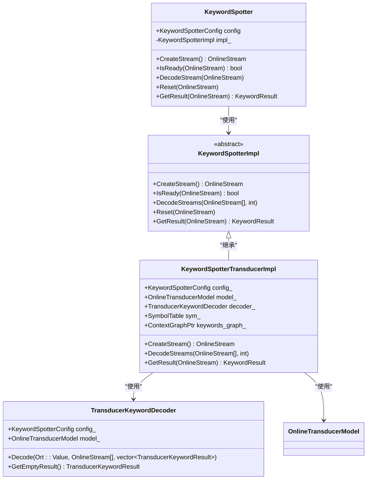
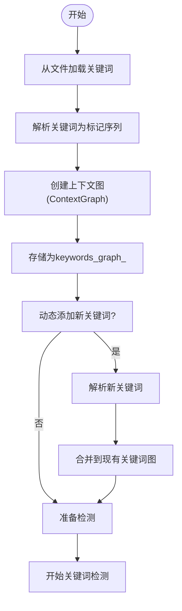
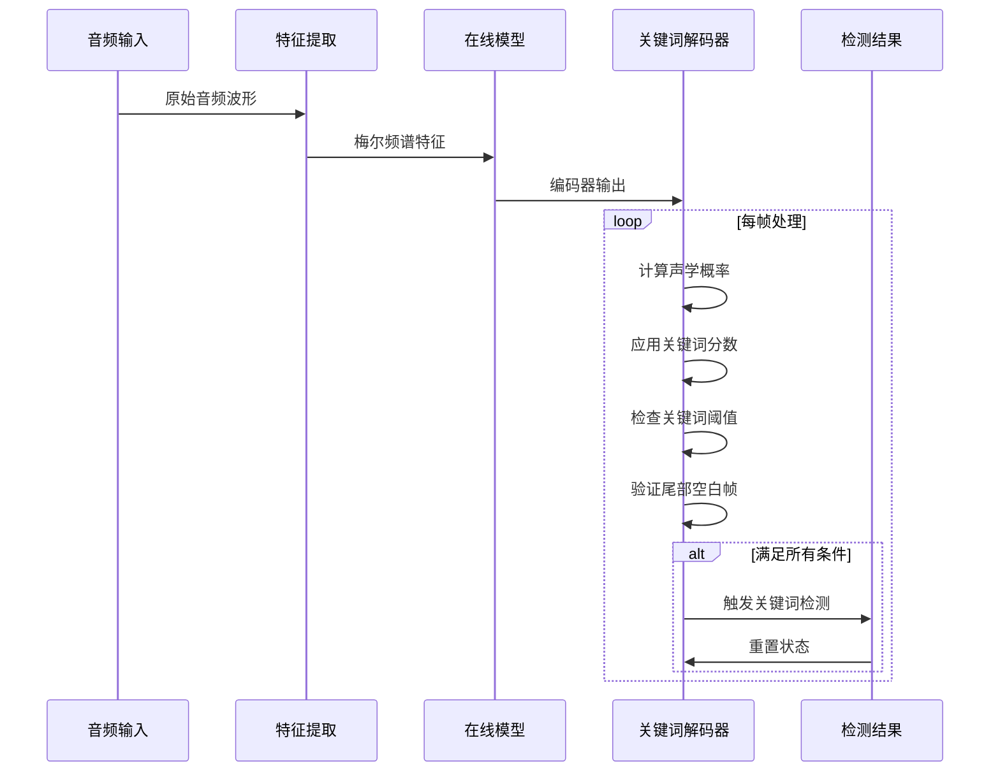
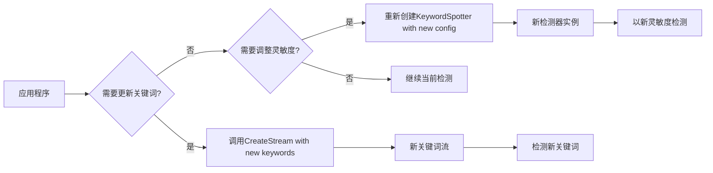

# 关键词检测

<cite>
**本文档引用的文件**
- [keyword-spotter.cc](file://sherpa-onnx/csrc/keyword-spotter.cc)
- [keyword-spotter.h](file://sherpa-onnx/csrc/keyword-spotter.h)
- [keyword-spotter-transducer-impl.h](file://sherpa-onnx/csrc/keyword-spotter-transducer-impl.h)
- [transducer-keyword-decoder.cc](file://sherpa-onnx/csrc/transducer-keyword-decoder.cc)
- [keyword-spotter.py](file://python-api-examples/keyword-spotter.py)
- [keyword-spotter-from-microphone.py](file://python-api-examples/keyword-spotter-from-microphone.py)
- [kws-c-api.c](file://c-api-examples/kws-c-api.c)
- [KeywordSpotterFromFile.java](file://java-api-examples/KeywordSpotterFromFile.java)
</cite>

## 目录
1. [简介](#简介)
2. [架构设计](#架构设计)
3. [关键词列表管理](#关键词列表管理)
4. [误报率控制](#误报率控制)
5. [配置参数说明](#配置参数说明)
6. [动态更新关键词和灵敏度调节](#动态更新关键词和灵敏度调节)
7. [实时检测代码示例](#实时检测代码示例)
8. [应用场景](#应用场景)

## 简介

sherpa-onnx的关键词检测功能基于Zipformer Transducer等先进的语音识别模型，实现了高效的关键词spotting技术。该系统能够在连续的语音流中实时检测预定义的关键词或短语，适用于智能助手、语音唤醒等场景。关键词检测器（KeywordSpotter）采用流式处理架构，能够处理来自麦克风或音频文件的实时输入，并在检测到关键词后立即触发相应操作。

**Section sources**
- [keyword-spotter.cc](file://sherpa-onnx/csrc/keyword-spotter.cc#L1-L189)
- [keyword-spotter.h](file://sherpa-onnx/csrc/keyword-spotter.h#L1-L151)

## 架构设计

关键词检测器的架构基于Zipformer Transducer模型，采用分层设计。核心组件包括特征提取器、在线模型和关键词解码器。系统通过`KeywordSpotter`类提供高层接口，内部使用`KeywordSpotterImpl`实现具体功能。对于Zipformer Transducer模型，系统使用`KeywordSpotterTransducerImpl`作为具体实现。

检测流程如下：音频输入首先通过特征提取器转换为梅尔频谱特征，然后送入在线模型进行编码。解码器使用修改的束搜索算法，在解码过程中与关键词图（ContextGraph）进行匹配。当检测到关键词时，系统会返回包含关键词、时间戳和解码标记的结果。



**Diagram sources**
- [keyword-spotter.h](file://sherpa-onnx/csrc/keyword-spotter.h#L95-L146)
- [keyword-spotter-transducer-impl.h](file://sherpa-onnx/csrc/keyword-spotter-transducer-impl.h#L58-L367)
- [transducer-keyword-decoder.cc](file://sherpa-onnx/csrc/transducer-keyword-decoder.cc#L18-L186)

**Section sources**
- [keyword-spotter.cc](file://sherpa-onnx/csrc/keyword-spotter.cc#L146-L188)
- [keyword-spotter-transducer-impl.h](file://sherpa-onnx/csrc/keyword-spotter-transducer-impl.h#L58-L367)

## 关键词列表管理

关键词列表通过`keywords_file`参数指定，文件中每行包含一个关键词或短语。对于BPE模型，关键词需要以空格分隔的BPE标记形式提供；对于中文字符，每个字符单独分隔。例如："▁HE LL O ▁WORLD" 或 "你 好 世 界"。

系统支持在运行时动态添加关键词。通过`CreateStream`方法的重载版本，可以传入新的关键词字符串，这些关键词会与预定义的关键词合并。关键词之间使用"/"分隔，如"y ǎn y uán @演员/zh ī m íng @知名"。这种机制允许在不重新初始化整个检测器的情况下添加新的检测目标。



**Diagram sources**
- [keyword-spotter-transducer-impl.h](file://sherpa-onnx/csrc/keyword-spotter-transducer-impl.h#L112-L188)
- [kws-c-api.c](file://c-api-examples/kws-c-api.c#L101-L127)

**Section sources**
- [keyword-spotter-transducer-impl.h](file://sherpa-onnx/csrc/keyword-spotter-transducer-impl.h#L112-L188)
- [keyword-spotter.py](file://python-api-examples/keyword-spotter.py#L87-L102)

## 误报率控制

系统通过多个参数来控制误报率，确保检测的准确性和可靠性。主要控制机制包括关键词分数（keywords_score）、关键词阈值（keywords_threshold）和尾部空白帧数（num_trailing_blanks）。

关键词分数为每个关键词标记提供奖励分数，提高其在束搜索中的优先级。关键词阈值设置触发关键词检测的声学概率阈值，只有当检测到的关键词概率超过此阈值时才会触发。尾部空白帧数要求在关键词后必须有一定数量的空白帧（静音），这有助于区分真正的关键词结束和语音中断，减少误报。



**Diagram sources**
- [keyword-spotter.h](file://sherpa-onnx/csrc/keyword-spotter.h#L57-L63)
- [transducer-keyword-decoder.cc](file://sherpa-onnx/csrc/transducer-keyword-decoder.cc#L158-L168)

**Section sources**
- [keyword-spotter.cc](file://sherpa-onnx/csrc/keyword-spotter.cc#L85-L98)
- [transducer-keyword-decoder.cc](file://sherpa-onnx/csrc/transducer-keyword-decoder.cc#L158-L168)

## 配置参数说明

关键词检测器提供了一系列配置参数，用于调整检测行为和性能。主要参数包括：

| 参数名称 | 类型 | 默认值 | 说明 |
|--------|-----|-------|------|
| max_active_paths | int32_t | 4 | 束搜索的束宽大小 |
| num_trailing_blanks | int32_t | 1 | 关键词后所需的尾部空白帧数 |
| keywords_score | float | 1.0 | 关键词标记的奖励分数 |
| keywords_threshold | float | 0.25 | 触发关键词检测的声学概率阈值 |
| keywords_file | string | "" | 包含关键词的文件路径 |
| keywords_buf | string | "" | 包含关键词的内存缓冲区 |

这些参数可以通过`KeywordSpotterConfig`结构体进行设置。`max_active_paths`影响搜索的广度，较大的值可以提高准确性但增加计算开销。`num_trailing_blanks`用于防止误报，确保关键词后有足够的静音。`keywords_score`和`keywords_threshold`共同控制检测的灵敏度。

**Section sources**
- [keyword-spotter.h](file://sherpa-onnx/csrc/keyword-spotter.h#L53-L71)
- [keyword-spotter.cc](file://sherpa-onnx/csrc/keyword-spotter.cc#L81-L98)

## 动态更新关键词和灵敏度调节

系统支持在运行时动态更新关键词和调节检测灵敏度。通过`CreateStream`方法，可以在创建新的检测流时传入不同的关键词集合。这允许应用程序根据上下文动态调整检测目标，例如在不同应用场景下激活不同的关键词。

灵敏度调节可以通过调整`keywords_score`和`keywords_threshold`参数实现。较高的`keywords_score`会使系统对关键词更敏感，而较高的`keywords_threshold`会提高检测的置信度要求，减少误报。这些参数可以在创建`KeywordSpotter`实例时设置，并且可以通过创建新的配置来动态调整。



**Diagram sources**
- [keyword-spotter.h](file://sherpa-onnx/csrc/keyword-spotter.h#L108-L118)
- [kws-c-api.c](file://c-api-examples/kws-c-api.c#L101-L127)

**Section sources**
- [keyword-spotter.h](file://sherpa-onnx/csrc/keyword-spotter.h#L108-L118)
- [keyword-spotter.py](file://python-api-examples/keyword-spotter.py#L87-L102)

## 实时检测代码示例

以下是从麦克风输入实时检测关键词的Python代码示例：

```python
import sherpa_onnx
import sounddevice as sd

def main():
    keyword_spotter = sherpa_onnx.KeywordSpotter(
        tokens="tokens.txt",
        encoder="encoder.onnx",
        decoder="decoder.onnx",
        joiner="joiner.onnx",
        keywords_file="keywords.txt",
        keywords_score=1.5,
        keywords_threshold=0.25,
        provider="cpu",
    )

    sample_rate = 16000
    samples_per_read = int(0.1 * sample_rate)
    stream = keyword_spotter.create_stream()

    with sd.InputStream(channels=1, dtype="float32", samplerate=sample_rate) as s:
        while True:
            samples, _ = s.read(samples_per_read)
            samples = samples.reshape(-1)
            stream.accept_waveform(sample_rate, samples)
            
            while keyword_spotter.is_ready(stream):
                keyword_spotter.decode_stream(stream)
                result = keyword_spotter.get_result(stream)
                if result:
                    print(f"检测到关键词: {result}")
                    keyword_spotter.reset_stream(stream)

if __name__ == "__main__":
    main()
```

此示例展示了如何初始化关键词检测器，从麦克风读取音频流，并实时处理音频以检测关键词。当检测到关键词时，系统会打印结果并重置流以准备下一次检测。

**Section sources**
- [keyword-spotter-from-microphone.py](file://python-api-examples/keyword-spotter-from-microphone.py#L156-L196)
- [kws-c-api.c](file://c-api-examples/kws-c-api.c#L72-L94)

## 应用场景

关键词检测技术在多种场景中具有重要应用价值。在智能助手中，可用于唤醒词检测，如"你好小助手"，实现低功耗监听和快速响应。在会议记录系统中，可检测特定术语或人名，便于后续检索和分析。在智能家居中，可用于控制指令检测，如"打开灯光"、"调节温度"等。

该技术还可用于安全监控，检测特定的警示语或求救信号。在教育领域，可用于语言学习应用，检测学生发音的关键词准确性。由于支持多语言和自定义关键词，该系统具有广泛的适用性，可根据具体需求进行定制和优化。

**Section sources**
- [keyword-spotter.py](file://python-api-examples/keyword-spotter.py#L3-L10)
- [README.md](file://README.md#L1-L10)