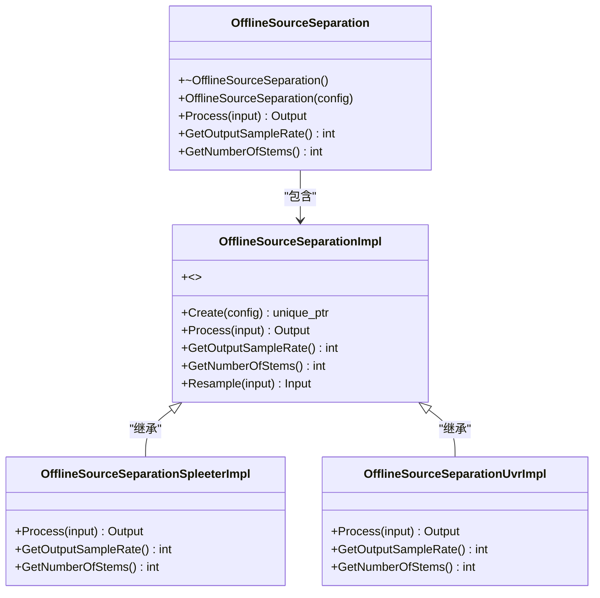
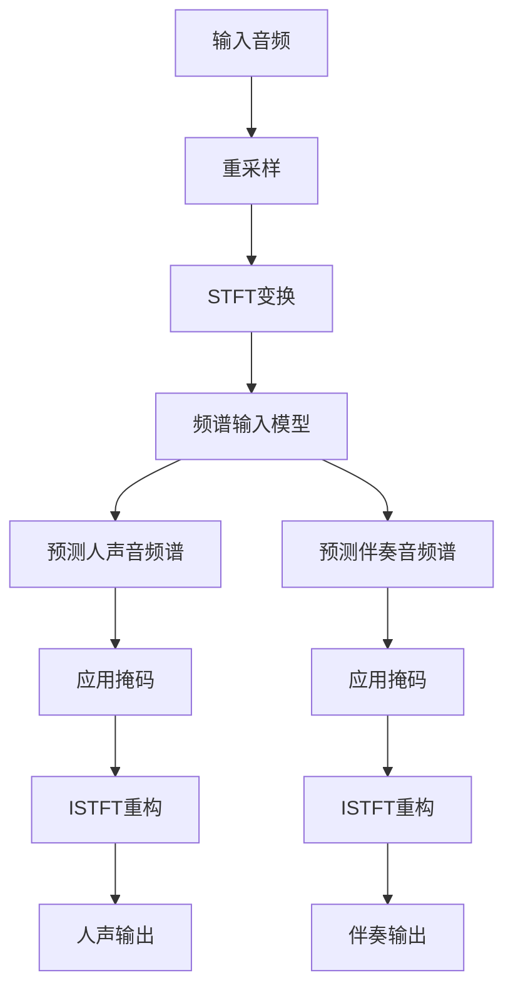
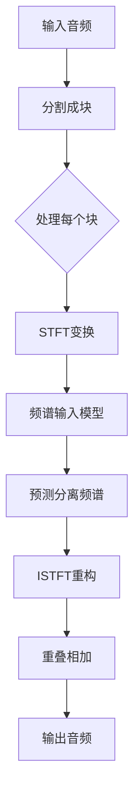
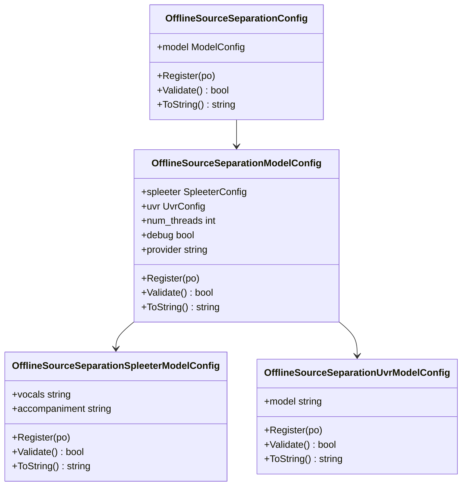

# 源分离

<cite>
**本文档中引用的文件**  
- [offline-source-separation-spleeter.py](file://python-api-examples/offline-source-separation-spleeter.py)
- [offline-source-separation-uvr.py](file://python-api-examples/offline-source-separation-uvr.py)
- [offline-source-separation.h](file://sherpa-onnx/csrc/offline-source-separation.h)
- [offline-source-separation-impl.h](file://sherpa-onnx/csrc/offline-source-separation-impl.h)
- [offline-source-separation-impl.cc](file://sherpa-onnx/csrc/offline-source-separation-impl.cc)
- [offline-source-separation-model-config.h](file://sherpa-onnx/csrc/offline-source-separation-model-config.h)
- [offline-source-separation-model-config.cc](file://sherpa-onnx/csrc/offline-source-separation-model-config.cc)
- [offline-source-separation-spleeter-impl.h](file://sherpa-onnx/csrc/offline-source-separation-spleeter-impl.h)
- [offline-source-separation-uvr-impl.h](file://sherpa-onnx/csrc/offline-source-separation-uvr-impl.h)
- [offline-source-separation-spleeter-model-config.h](file://sherpa-onnx/csrc/offline-source-separation-spleeter-model-config.h)
- [offline-source-separation-uvr-model-config.h](file://sherpa-onnx/csrc/offline-source-separation-uvr-model-config.h)
</cite>

## 目录
1. [引言](#引言)
2. [核心架构设计](#核心架构设计)
3. [频域分析与信号重构](#频域分析与信号重构)
4. [配置参数与分离模式](#配置参数与分离模式)
5. [代码示例与实现](#代码示例与实现)
6. [应用场景](#应用场景)
7. [性能评估与质量分析](#性能评估与质量分析)

## 引言

sherpa-onnx项目提供了基于Spleeter和UVR模型的音频源分离功能，支持人声与伴奏分离以及多音轨提取。该功能通过离线源分离器（OfflineSourceSeparation）实现，利用深度学习模型在频域进行信号分析和重构。系统支持多种配置参数和分离模式，适用于音乐制作、版权分析等场景。

## 核心架构设计

源分离功能的核心是`OfflineSourceSeparation`类，它通过工厂模式创建具体的实现类。系统根据配置文件中的模型类型选择Spleeter或UVR实现。



**图源**  
- [offline-source-separation.h](file://sherpa-onnx/csrc/offline-source-separation.h#L54-L74)
- [offline-source-separation-impl.h](file://sherpa-onnx/csrc/offline-source-separation-impl.h#L15-L35)

**本节来源**  
- [offline-source-separation.h](file://sherpa-onnx/csrc/offline-source-separation.h#L1-L79)
- [offline-source-separation-impl.h](file://sherpa-onnx/csrc/offline-source-separation-impl.h#L1-L40)

## 频域分析与信号重构

源分离过程主要在频域进行，通过短时傅里叶变换（STFT）将时域信号转换为频域表示，然后应用深度学习模型进行分离，最后通过逆短时傅里叶变换（ISTFT）重构时域信号。

### Spleeter实现

Spleeter模型使用STFT将输入音频转换为频谱图，然后通过神经网络预测人声和伴奏的掩码。具体流程如下：

1. 对输入音频进行重采样以匹配模型要求的采样率
2. 计算每个声道的STFT
3. 将频谱输入到ONNX模型中，分别预测人声和伴奏的频谱
4. 应用掩码并使用ISTFT重构时域信号



**图源**  
- [offline-source-separation-spleeter-impl.h](file://sherpa-onnx/csrc/offline-source-separation-spleeter-impl.h#L33-L136)

### UVR实现

UVR模型采用分块处理策略，将长音频分割成固定大小的块进行处理，以处理内存限制并提高处理效率。



**图源**  
- [offline-source-separation-uvr-impl.h](file://sherpa-onnx/csrc/offline-source-separation-uvr-impl.h#L34-L106)

**本节来源**  
- [offline-source-separation-spleeter-impl.h](file://sherpa-onnx/csrc/offline-source-separation-spleeter-impl.h#L1-L235)
- [offline-source-separation-uvr-impl.h](file://sherpa-onnx/csrc/offline-source-separation-uvr-impl.h#L1-L383)

## 配置参数与分离模式

源分离功能通过配置类进行参数设置，支持多种配置选项。

### 配置结构



**图源**  
- [offline-source-separation-model-config.h](file://sherpa-onnx/csrc/offline-source-separation-model-config.h#L16-L41)
- [offline-source-separation-spleeter-model-config.h](file://sherpa-onnx/csrc/offline-source-separation-spleeter-model-config.h#L15-L31)

### 配置参数说明

| 参数 | 类型 | 说明 |
|------|------|------|
| num_threads | int | 运行神经网络的线程数 |
| debug | bool | 是否打印模型加载时的信息 |
| provider | string | 指定使用的计算提供者：cpu, cuda, coreml |
| vocals | string | Spleeter人声模型文件路径 |
| accompaniment | string | Spleeter伴奏模型文件路径 |
| model | string | UVR模型文件路径 |

**本节来源**  
- [offline-source-separation-model-config.h](file://sherpa-onnx/csrc/offline-source-separation-model-config.h#L1-L46)
- [offline-source-separation-model-config.cc](file://sherpa-onnx/csrc/offline-source-separation-model-config.cc#L1-L55)

## 代码示例与实现

以下代码示例展示了如何使用sherpa-onnx进行源分离。

### Spleeter示例

```python
def create_offline_source_separation():
    vocals = "./sherpa-onnx-spleeter-2stems-fp16/vocals.fp16.onnx"
    accompaniment = "./sherpa-onnx-spleeter-2stems-fp16/accompaniment.fp16.onnx"
    
    config = sherpa_onnx.OfflineSourceSeparationConfig(
        model=sherpa_onnx.OfflineSourceSeparationModelConfig(
            spleeter=sherpa_onnx.OfflineSourceSeparationSpleeterModelConfig(
                vocals=vocals,
                accompaniment=accompaniment,
            ),
            num_threads=1,
            debug=False,
            provider="cpu",
        )
    )
    
    return sherpa_onnx.OfflineSourceSeparation(config)
```

**本节来源**  
- [offline-source-separation-spleeter.py](file://python-api-examples/offline-source-separation-spleeter.py#L36-L62)

### UVR示例

```python
def create_offline_source_separation():
    model = "./UVR_MDXNET_9482.onnx"
    
    config = sherpa_onnx.OfflineSourceSeparationConfig(
        model=sherpa_onnx.OfflineSourceSeparationModelConfig(
            uvr=sherpa_onnx.OfflineSourceSeparationUvrModelConfig(
                model=model,
            ),
            num_threads=1,
            debug=False,
            provider="cpu",
        )
    )
    
    return sherpa_onnx.OfflineSourceSeparation(config)
```

**本节来源**  
- [offline-source-separation-uvr.py](file://python-api-examples/offline-source-separation-uvr.py#L36-L57)

## 应用场景

源分离技术在多个领域有广泛应用：

### 音乐制作

- 重新混音：分离人声和伴奏后可以重新调整混音参数
- 翻唱制作：提取伴奏用于翻唱
- 音乐教育：分离不同乐器轨道用于学习

### 版权分析

- 音频指纹：分离后的音轨可以用于更精确的音频指纹识别
- 版权检测：检测音乐作品中是否存在未经授权的采样
- 内容审核：分析音频内容的构成

### 其他应用

- 语音增强：从嘈杂环境中分离语音信号
- 音乐信息检索：分析音乐的结构和组成
- 音频修复：修复老录音中的噪声问题

## 性能评估与质量分析

源分离的质量可以通过多种指标进行评估。

### 实时因子（RTF）

实时因子是衡量处理效率的重要指标，计算公式为：

RTF = 处理时间 / 音频时长

值越小表示处理效率越高。在实际应用中，RTF小于1表示可以实时处理。

### 音频质量评估

| 指标 | 说明 |
|------|------|
| SI-SNR | 信号干扰噪声比，衡量分离质量 |
| SDR | 信号失真比，综合评估分离效果 |
| SAR | 人工失真比，评估引入的失真程度 |
| SIR | 信号干扰比，评估干扰抑制能力 |

**本节来源**  
- [offline-source-separation-spleeter.py](file://python-api-examples/offline-source-separation-spleeter.py#L111-L118)
- [offline-source-separation-uvr.py](file://python-api-examples/offline-source-separation-uvr.py#L107-L114)