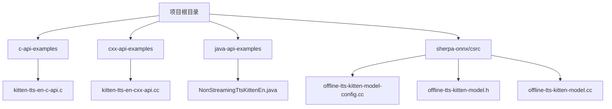
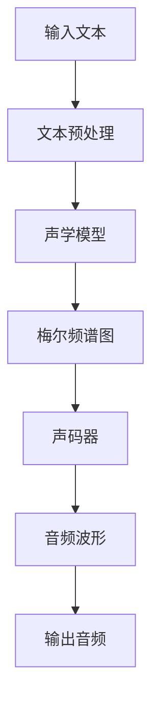
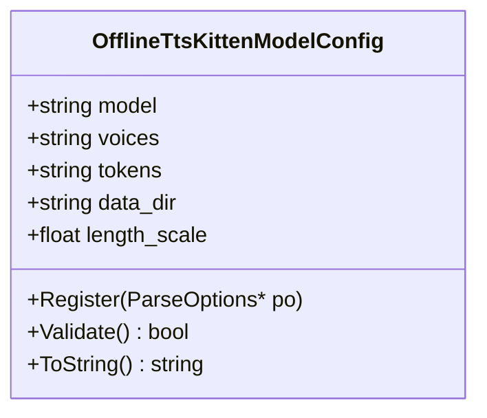
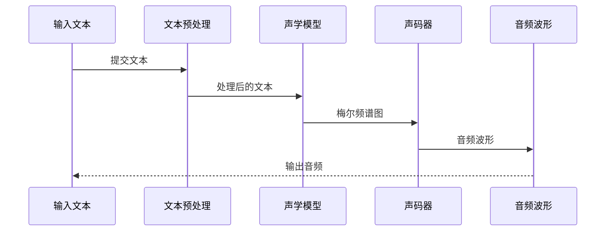
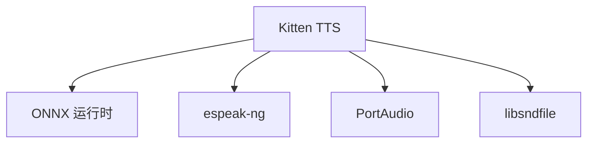

# Kitten语音合成

<cite>
**本文档引用的文件**
- [kitten-tts-en-c-api.c](file://c-api-examples/kitten-tts-en-c-api.c)
- [kitten-tts-en-cxx-api.cc](file://cxx-api-examples/kitten-tts-en-cxx-api.cc)
- [offline-tts-kitten-model-config.cc](file://sherpa-onnx/csrc/offline-tts-kitten-model-config.cc)
- [offline-tts-kitten-model.h](file://sherpa-onnx/csrc/offline-tts-kitten-model.h)
- [offline-tts-kitten-model.cc](file://sherpa-onnx/csrc/offline-tts-kitten-model.cc)
- [OfflineTtsKittenModelConfig.java](file://sherpa-onnx/java-api/src/main/java/com/k2fsa/sherpa/onnx/OfflineTtsKittenModelConfig.java)
- [README.md](file://scripts/kitten-tts/README.md)
</cite>

## 目录
1. [简介](#简介)
2. [项目结构](#项目结构)
3. [核心组件](#核心组件)
4. [架构概述](#架构概述)
5. [详细组件分析](#详细组件分析)
6. [依赖分析](#依赖分析)
7. [性能考量](#性能考量)
8. [故障排除指南](#故障排除指南)
9. [结论](#结论)

## 简介
Kitten TTS 是一个轻量级的文本转语音模型，专为在资源受限的设备上高效运行而设计。该模型基于 ONNX 格式，支持多种编程语言的 API 接口，包括 C、C++、Python、Java、.NET 和 Node.js。Kitten TTS 模型通过集成声学模型和声码器，实现了高质量的语音合成，同时保持了较小的模型体积和较低的推理延迟。

## 项目结构
Kitten TTS 相关的代码和资源分布在多个目录中，主要集中在 `c-api-examples`、`cxx-api-examples`、`java-api-examples` 和 `sherpa-onnx/csrc` 目录下。模型配置和核心实现位于 `sherpa-onnx/csrc` 目录中，而各种语言的示例代码则分布在对应的 API 示例目录中。

**图示来源**
- [kitten-tts-en-c-api.c](file://c-api-examples/kitten-tts-en-c-api.c)
- [kitten-tts-en-cxx-api.cc](file://cxx-api-examples/kitten-tts-en-cxx-api.cc)
- [NonStreamingTtsKittenEn.java](file://java-api-examples/NonStreamingTtsKittenEn.java)
- [offline-tts-kitten-model-config.cc](file://sherpa-onnx/csrc/offline-tts-kitten-model-config.cc)
- [offline-tts-kitten-model.h](file://sherpa-onnx/csrc/offline-tts-kitten-model.h)
- [offline-tts-kitten-model.cc](file://sherpa-onnx/csrc/offline-tts-kitten-model.cc)

**节来源**
- [kitten-tts-en-c-api.c](file://c-api-examples/kitten-tts-en-c-api.c)
- [kitten-tts-en-cxx-api.cc](file://cxx-api-examples/kitten-tts-en-cxx-api.cc)
- [NonStreamingTtsKittenEn.java](file://java-api-examples/NonStreamingTtsKittenEn.java)
- [offline-tts-kitten-model-config.cc](file://sherpa-onnx/csrc/offline-tts-kitten-model-config.cc)
- [offline-tts-kitten-model.h](file://sherpa-onnx/csrc/offline-tts-kitten-model.h)
- [offline-tts-kitten-model.cc](file://sherpa-onnx/csrc/offline-tts-kitten-model.cc)

## 核心组件
Kitten TTS 的核心组件包括模型配置、声学模型和声码器。模型配置文件定义了模型路径、词汇表、声音数据等参数。声学模型负责将文本转换为梅尔频谱图，而声码器则将梅尔频谱图转换为最终的音频波形。

**节来源**
- [offline-tts-kitten-model-config.cc](file://sherpa-onnx/csrc/offline-tts-kitten-model-config.cc)
- [offline-tts-kitten-model.h](file://sherpa-onnx/csrc/offline-tts-kitten-model.h)
- [offline-tts-kitten-model.cc](file://sherpa-onnx/csrc/offline-tts-kitten-model.cc)

## 架构概述
Kitten TTS 的架构基于 ONNX 运行时，支持跨平台部署。模型通过 ONNX 运行时加载，并利用多线程进行高效的推理。声学模型和声码器集成在一个 ONNX 模型中，减少了模型间的通信开销。

**图示来源**
- [offline-tts-kitten-model.cc](file://sherpa-onnx/csrc/offline-tts-kitten-model.cc)
- [kitten-tts-en-c-api.c](file://c-api-examples/kitten-tts-en-c-api.c)

## 详细组件分析
### 模型配置分析
Kitten TTS 的模型配置通过 `OfflineTtsKittenModelConfig` 类进行管理。该类定义了模型路径、声音数据路径、词汇表路径和数据目录等参数。配置参数通过命令行选项进行注册和验证。

**图示来源**
- [offline-tts-kitten-model-config.cc](file://sherpa-onnx/csrc/offline-tts-kitten-model-config.cc)
- [offline-tts-kitten-model-config.h](file://sherpa-onnx/csrc/offline-tts-kitten-model-config.h)

**节来源**
- [offline-tts-kitten-model-config.cc](file://sherpa-onnx/csrc/offline-tts-kitten-model-config.cc)
- [offline-tts-kitten-model-config.h](file://sherpa-onnx/csrc/offline-tts-kitten-model-config.h)

### 声学模型与声码器集成
Kitten TTS 的声学模型和声码器集成在一个 ONNX 模型中。声学模型将输入文本转换为梅尔频谱图，声码器则将梅尔频谱图转换为音频波形。这种集成设计减少了模型间的通信开销，提高了推理效率。

**图示来源**
- [offline-tts-kitten-model.cc](file://sherpa-onnx/csrc/offline-tts-kitten-model.cc)
- [kitten-tts-en-c-api.c](file://c-api-examples/kitten-tts-en-c-api.c)

**节来源**
- [offline-tts-kitten-model.cc](file://sherpa-onnx/csrc/offline-tts-kitten-model.cc)
- [kitten-tts-en-c-api.c](file://c-api-examples/kitten-tts-en-c-api.c)

## 依赖分析
Kitten TTS 依赖于 ONNX 运行时进行模型推理，依赖于 espeak-ng 进行文本到音素的转换。此外，Kitten TTS 还依赖于各种音频处理库，如 PortAudio 和 libsndfile，用于音频的输入输出。

**图示来源**
- [offline-tts-kitten-model.cc](file://sherpa-onnx/csrc/offline-tts-kitten-model.cc)
- [kitten-tts-en-c-api.c](file://c-api-examples/kitten-tts-en-c-api.c)

**节来源**
- [offline-tts-kitten-model.cc](file://sherpa-onnx/csrc/offline-tts-kitten-model.cc)
- [kitten-tts-en-c-api.c](file://c-api-examples/kitten-tts-en-c-api.c)

## 性能考量
Kitten TTS 通过模型量化和压缩策略优化了在移动设备上的部署。模型使用 FP16 量化，减少了模型体积和内存占用。此外，Kitten TTS 支持多线程推理，充分利用了现代设备的多核处理器。

**节来源**
- [kitten-tts-en-c-api.c](file://c-api-examples/kitten-tts-en-c-api.c)
- [kitten-tts-en-cxx-api.cc](file://cxx-api-examples/kitten-tts-en-cxx-api.cc)

## 故障排除指南
在使用 Kitten TTS 时，常见的问题包括模型文件路径错误、依赖库缺失和音频输出问题。确保模型文件路径正确，依赖库已安装，并检查音频输出设备是否正常工作。

**节来源**
- [kitten-tts-en-c-api.c](file://c-api-examples/kitten-tts-en-c-api.c)
- [kitten-tts-en-cxx-api.cc](file://cxx-api-examples/kitten-tts-en-cxx-api.cc)

## 结论
Kitten TTS 是一个高效、轻量级的文本转语音模型，适用于在资源受限的设备上部署。通过集成声学模型和声码器，Kitten TTS 实现了高质量的语音合成，同时保持了较小的模型体积和较低的推理延迟。未来的工作可以进一步优化模型压缩和量化策略，以提高在移动设备上的性能。