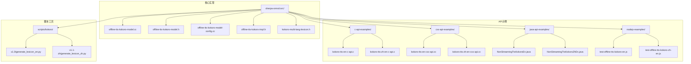
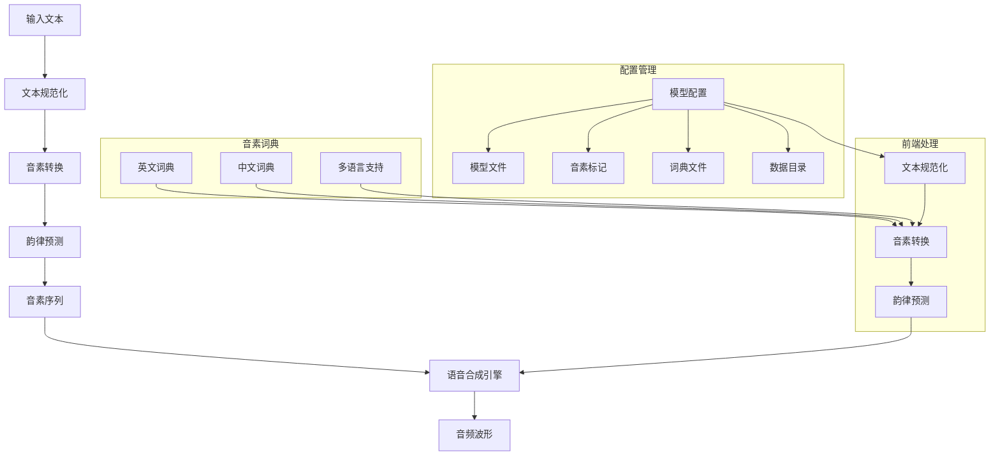
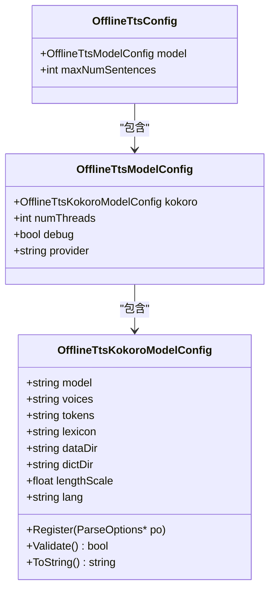
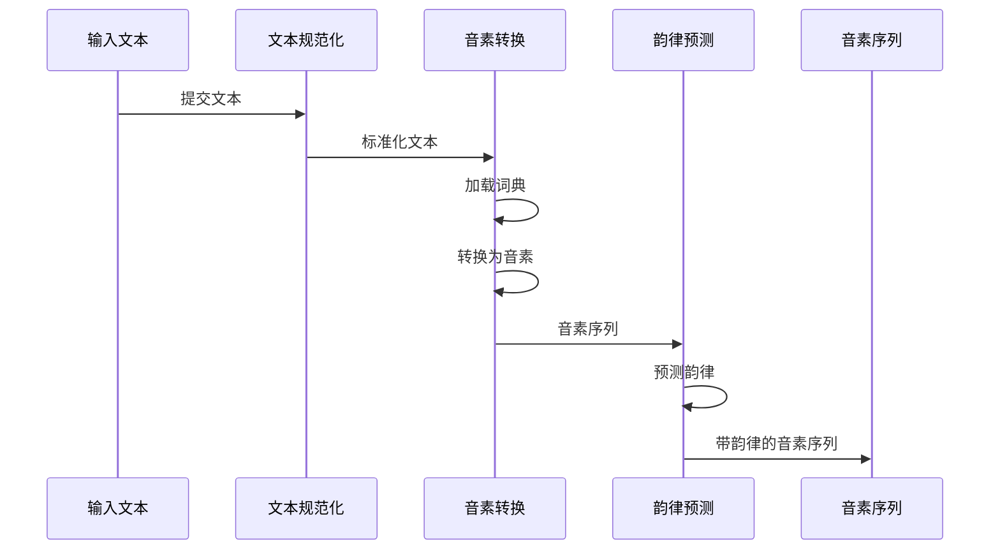
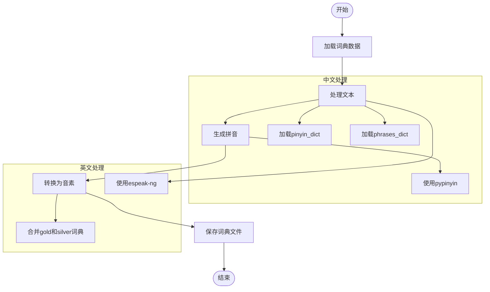
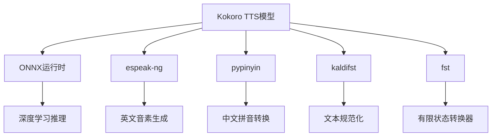

# Kokoro语音合成

<cite>
**本文档引用的文件**   
- [OfflineTtsKokoroModelConfig.java](file://sherpa-onnx/java-api/src/main/java/com/k2fsa/sherpa/onnx/OfflineTtsKokoroModelConfig.java)
- [tts.dart](file://flutter/sherpa_onnx/lib/src/tts.dart)
- [offline-tts-kokoro-model-config.cc](file://sherpa-onnx/csrc/offline-tts-kokoro-model-config.cc)
- [offline-tts-kokoro-model-config.h](file://sherpa-onnx/csrc/offline-tts-kokoro-model-config.h)
- [kokoro-tts-en-c-api.c](file://c-api-examples/kokoro-tts-en-c-api.c)
- [kokoro-tts-zh-en-c-api.c](file://c-api-examples/kokoro-tts-zh-en-c-api.c)
- [kokoro-tts-en-cxx-api.cc](file://cxx-api-examples/kokoro-tts-en-cxx-api.cc)
- [kokoro-tts-zh-en-cxx-api.cc](file://cxx-api-examples/kokoro-tts-zh-en-cxx-api.cc)
- [offline-tts-kokoro-model.cc](file://sherpa-onnx/csrc/offline-tts-kokoro-model.cc)
- [offline-tts-kokoro-model.h](file://sherpa-onnx/csrc/offline-tts-kokoro-model.h)
- [offline-tts-kokoro-impl.h](file://sherpa-onnx/csrc/offline-tts-kokoro-impl.h)
- [kokoro-multi-lang-lexicon.h](file://sherpa-onnx/csrc/kokoro-multi-lang-lexicon.h)
- [lexicon.h](file://sherpa-onnx/csrc/lexicon.h)
- [generate_lexicon_en.py](file://scripts/kokoro/v1.0/generate_lexicon_en.py)
- [generate_lexicon_zh.py](file://scripts/kokoro/v1.1-zh/generate_lexicon_zh.py)
- [OfflineTtsKokoroModelConfig.cs](file://scripts/dotnet/OfflineTtsKokoroModelConfig.cs)
- [kokoro-en.pas](file://pascal-api-examples/tts/kokoro-en.pas)
- [kokoro-zh-en.pas](file://pascal-api-examples/tts/kokoro-zh-en.pas)
- [test-offline-tts-kokoro-zh-en.js](file://nodejs-examples/test-offline-tts-kokoro-zh-en.js)
- [readme.md](file://sherpa-onnx/java-api/readme.md)
- [readme.zh.md](file://sherpa-onnx/java-api/readme.zh.md)
</cite>

## 目录
1. [引言](#引言)
2. [项目结构](#项目结构)
3. [核心组件](#核心组件)
4. [架构概述](#架构概述)
5. [详细组件分析](#详细组件分析)
6. [依赖分析](#依赖分析)
7. [性能考虑](#性能考虑)
8. [故障排除指南](#故障排除指南)
9. [结论](#结论)

## 引言
Kokoro TTS模型是sherpa-onnx项目中的一个先进的文本到语音合成系统，专门设计用于支持多语言语音合成，特别是中英文混合语音。该模型基于ONNX格式，能够在多种硬件平台上高效运行。Kokoro模型通过结合深度学习技术和音素词典生成机制，实现了高质量的语音合成效果。本文档将深入探讨Kokoro模型的架构设计、多语言支持、音素词典生成机制、前端处理流程、配置参数说明、音色选择和语音自然度调优策略，并提供从文本生成音频的实际代码示例。

## 项目结构
Kokoro TTS模型的实现分布在sherpa-onnx项目的多个目录中，主要包括C++核心实现、多种编程语言的API示例以及相关的脚本工具。核心实现位于`sherpa-onnx/csrc/`目录下，而API示例则分布在`c-api-examples/`、`cxx-api-examples/`、`java-api-examples/`等多个目录中，支持C、C++、Java、Python、Node.js等多种编程语言。



**图源**
- [offline-tts-kokoro-model.cc](file://sherpa-onnx/csrc/offline-tts-kokoro-model.cc)
- [kokoro-tts-en-c-api.c](file://c-api-examples/kokoro-tts-en-c-api.c)
- [kokoro-tts-en-cxx-api.cc](file://cxx-api-examples/kokoro-tts-en-cxx-api.cc)
- [NonStreamingTtsKokoroEn.java](file://java-api-examples/NonStreamingTtsKokoroEn.java)
- [test-offline-tts-kokoro-en.js](file://nodejs-examples/test-offline-tts-kokoro-en.js)
- [generate_lexicon_en.py](file://scripts/kokoro/v1.0/generate_lexicon_en.py)

**章节源**
- [offline-tts-kokoro-model.cc](file://sherpa-onnx/csrc/offline-tts-kokoro-model.cc)
- [kokoro-tts-en-c-api.c](file://c-api-examples/kokoro-tts-en-c-api.c)
- [kokoro-tts-en-cxx-api.cc](file://cxx-api-examples/kokoro-tts-en-cxx-api.cc)
- [NonStreamingTtsKokoroEn.java](file://java-api-examples/NonStreamingTtsKokoroEn.java)
- [test-offline-tts-kokoro-en.js](file://nodejs-examples/test-offline-tts-kokoro-en.js)
- [generate_lexicon_en.py](file://scripts/kokoro/v1.0/generate_lexicon_en.py)

## 核心组件
Kokoro TTS模型的核心组件包括模型配置、前端处理、音素词典生成和语音合成引擎。模型配置组件负责管理Kokoro模型的各种参数，如模型文件路径、音素标记文件、词典文件等。前端处理组件负责将输入文本转换为音素序列，包括文本规范化、音素转换和韵律预测。音素词典生成组件负责生成和管理中英文音素词典，支持多语言混合语音合成。语音合成引擎组件负责将音素序列转换为最终的音频波形。

**章节源**
- [OfflineTtsKokoroModelConfig.java](file://sherpa-onnx/java-api/src/main/java/com/k2fsa/sherpa/onnx/OfflineTtsKokoroModelConfig.java)
- [tts.dart](file://flutter/sherpa_onnx/lib/src/tts.dart)
- [offline-tts-kokoro-model-config.cc](file://sherpa-onnx/csrc/offline-tts-kokoro-model-config.cc)
- [offline-tts-kokoro-model-config.h](file://sherpa-onnx/csrc/offline-tts-kokoro-model-config.h)
- [offline-tts-kokoro-impl.h](file://sherpa-onnx/csrc/offline-tts-kokoro-impl.h)
- [kokoro-multi-lang-lexicon.h](file://sherpa-onnx/csrc/kokoro-multi-lang-lexicon.h)
- [lexicon.h](file://sherpa-onnx/csrc/lexicon.h)

## 架构概述
Kokoro TTS模型的架构设计采用了模块化和分层的设计思想，将整个语音合成过程分解为多个独立的组件，每个组件负责特定的功能。这种设计不仅提高了代码的可维护性和可扩展性，还使得模型能够灵活地支持多种语言和音色。



**图源**
- [offline-tts-kokoro-model-config.cc](file://sherpa-onnx/csrc/offline-tts-kokoro-model-config.cc)
- [offline-tts-kokoro-impl.h](file://sherpa-onnx/csrc/offline-tts-kokoro-impl.h)
- [kokoro-multi-lang-lexicon.h](file://sherpa-onnx/csrc/kokoro-multi-lang-lexicon.h)
- [lexicon.h](file://sherpa-onnx/csrc/lexicon.h)

## 详细组件分析

### 模型配置组件分析
Kokoro TTS模型的配置组件负责管理模型的各种参数，这些参数通过`OfflineTtsKokoroModelConfig`类进行定义和管理。配置参数包括模型文件路径、音素标记文件、词典文件、数据目录等。这些参数在模型初始化时被读取，并用于配置语音合成引擎。



**图源**
- [OfflineTtsKokoroModelConfig.java](file://sherpa-onnx/java-api/src/main/java/com/k2fsa/sherpa/onnx/OfflineTtsKokoroModelConfig.java)
- [tts.dart](file://flutter/sherpa_onnx/lib/src/tts.dart)
- [offline-tts-kokoro-model-config.h](file://sherpa-onnx/csrc/offline-tts-kokoro-model-config.h)
- [OfflineTtsKokoroModelConfig.cs](file://scripts/dotnet/OfflineTtsKokoroModelConfig.cs)

**章节源**
- [OfflineTtsKokoroModelConfig.java](file://sherpa-onnx/java-api/src/main/java/com/k2fsa/sherpa/onnx/OfflineTtsKokoroModelConfig.java)
- [tts.dart](file://flutter/sherpa_onnx/lib/src/tts.dart)
- [offline-tts-kokoro-model-config.h](file://sherpa-onnx/csrc/offline-tts-kokoro-model-config.h)
- [OfflineTtsKokoroModelConfig.cs](file://scripts/dotnet/OfflineTtsKokoroModelConfig.cs)

### 前端处理组件分析
Kokoro TTS模型的前端处理组件负责将输入文本转换为音素序列，这是语音合成的关键步骤。前端处理包括文本规范化、音素转换和韵律预测三个主要步骤。文本规范化将输入文本转换为标准格式，音素转换将文本转换为音素序列，韵律预测则为音素序列添加韵律信息。



**图源**
- [offline-tts-kokoro-impl.h](file://sherpa-onnx/csrc/offline-tts-kokoro-impl.h)
- [kokoro-multi-lang-lexicon.h](file://sherpa-onnx/csrc/kokoro-multi-lang-lexicon.h)
- [lexicon.h](file://sherpa-onnx/csrc/lexicon.h)

**章节源**
- [offline-tts-kokoro-impl.h](file://sherpa-onnx/csrc/offline-tts-kokoro-impl.h)
- [kokoro-multi-lang-lexicon.h](file://sherpa-onnx/csrc/kokoro-multi-lang-lexicon.h)
- [lexicon.h](file://sherpa-onnx/csrc/lexicon.h)

### 音素词典生成机制分析
Kokoro TTS模型的音素词典生成机制是其支持多语言混合语音合成的核心。音素词典生成脚本`generate_lexicon_en.py`和`generate_lexicon_zh.py`分别用于生成英文和中文的音素词典。这些脚本利用`pypinyin`库和`espeak-ng`工具，将文本转换为音素序列，并生成相应的词典文件。



**图源**
- [generate_lexicon_en.py](file://scripts/kokoro/v1.0/generate_lexicon_en.py)
- [generate_lexicon_zh.py](file://scripts/kokoro/v1.1-zh/generate_lexicon_zh.py)

**章节源**
- [generate_lexicon_en.py](file://scripts/kokoro/v1.0/generate_lexicon_en.py)
- [generate_lexicon_zh.py](file://scripts/kokoro/v1.1-zh/generate_lexicon_zh.py)

### 语音合成引擎分析
Kokoro TTS模型的语音合成引擎是基于ONNX运行时的深度学习模型，负责将音素序列转换为最终的音频波形。引擎通过`OfflineTtsKokoroModel`类进行封装，提供了简洁的API接口。

```mermaid
classDiagram
class OfflineTtsKokoroModel {
-Impl* impl_
+OfflineTtsKokoroModel(OfflineTtsModelConfig& config)
+~OfflineTtsKokoroModel()
+Run(Ort : : Value x, int64_t sid, float speed) Ort : : Value
+GetMetaData() OfflineTtsKokoroModelMetaData
}
class OfflineTtsKokoroModel : : Impl {
-OfflineTtsModelConfig config_
-Ort : : Env env_
-Ort : : SessionOptions sess_opts_
-std : : unique_ptr<Ort : : Session> sess_
-OfflineTtsKokoroModelMetaData meta_data_
-std : : vector<float> styles_
+Impl(OfflineTtsModelConfig& config)
+Run(Ort : : Value x, int32_t sid, float speed) Ort : : Value
+GetMetaData() OfflineTtsKokoroModelMetaData
}
OfflineTtsKokoroModel --> OfflineTtsKokoroModel : : Impl : "实现"
```

**图源**
- [offline-tts-kokoro-model.cc](file://sherpa-onnx/csrc/offline-tts-kokoro-model.cc)
- [offline-tts-kokoro-model.h](file://sherpa-onnx/csrc/offline-tts-kokoro-model.h)

**章节源**
- [offline-tts-kokoro-model.cc](file://sherpa-onnx/csrc/offline-tts-kokoro-model.cc)
- [offline-tts-kokoro-model.h](file://sherpa-onnx/csrc/offline-tts-kokoro-model.h)

## 依赖分析
Kokoro TTS模型依赖于多个外部库和工具，包括ONNX运行时、espeak-ng、pypinyin等。这些依赖项在模型的构建和运行过程中起着关键作用。



**图源**
- [offline-tts-kokoro-model.cc](file://sherpa-onnx/csrc/offline-tts-kokoro-model.cc)
- [offline-tts-kokoro-impl.h](file://sherpa-onnx/csrc/offline-tts-kokoro-impl.h)
- [kokoro-multi-lang-lexicon.h](file://sherpa-onnx/csrc/kokoro-multi-lang-lexicon.h)
- [lexicon.h](file://sherpa-onnx/csrc/lexicon.h)

**章节源**
- [offline-tts-kokoro-model.cc](file://sherpa-onnx/csrc/offline-tts-kokoro-model.cc)
- [offline-tts-kokoro-impl.h](file://sherpa-onnx/csrc/offline-tts-kokoro-impl.h)
- [kokoro-multi-lang-lexicon.h](file://sherpa-onnx/csrc/kokoro-multi-lang-lexicon.h)
- [lexicon.h](file://sherpa-onnx/csrc/lexicon.h)

## 性能考虑
Kokoro TTS模型在不同硬件平台上的性能表现和资源消耗是评估其实际应用价值的重要指标。模型的性能主要受以下几个因素影响：

1. **线程数**: 通过`num_threads`参数可以控制模型使用的线程数，增加线程数可以提高处理速度，但也会增加CPU占用率。
2. **推理后端**: 模型支持CPU和GPU等多种推理后端，选择合适的后端可以显著提升性能。
3. **模型大小**: 模型文件的大小直接影响加载时间和内存占用，较小的模型更适合资源受限的设备。
4. **实时因子(RTF)**: 实时因子是衡量模型性能的重要指标，RTF越小表示模型的实时性越好。

在实际应用中，可以通过调整这些参数来优化模型的性能。例如，在服务器环境中可以使用更多的线程和GPU加速，而在移动设备上则需要权衡性能和资源消耗。

**章节源**
- [kokoro-tts-en-c-api.c](file://c-api-examples/kokoro-tts-en-c-api.c)
- [kokoro-tts-zh-en-c-api.c](file://c-api-examples/kokoro-tts-zh-en-c-api.c)
- [readme.md](file://sherpa-onnx/java-api/readme.md)
- [readme.zh.md](file://sherpa-onnx/java-api/readme.zh.md)

## 故障排除指南
在使用Kokoro TTS模型时，可能会遇到一些常见问题。以下是一些常见问题及其解决方案：

1. **模型加载失败**: 确保模型文件路径正确，文件存在且可读。检查模型文件是否完整，没有损坏。
2. **音素转换错误**: 检查输入文本是否包含不支持的字符或符号。确保词典文件正确加载。
3. **性能问题**: 如果模型运行缓慢，尝试增加线程数或使用GPU加速。检查系统资源是否充足。
4. **音频质量差**: 调整`length_scale`参数来控制语音速度，尝试不同的音色ID来获得更好的音质。
5. **内存不足**: 减少线程数或使用更小的模型版本。在资源受限的设备上，考虑使用量化模型。

**章节源**
- [kokoro-tts-en-c-api.c](file://c-api-examples/kokoro-tts-en-c-api.c)
- [kokoro-tts-zh-en-c-api.c](file://c-api-examples/kokoro-tts-zh-en-c-api.c)
- [kokoro-en.pas](file://pascal-api-examples/tts/kokoro-en.pas)
- [kokoro-zh-en.pas](file://pascal-api-examples/tts/kokoro-zh-en.pas)

## 结论
Kokoro TTS模型是一个功能强大且灵活的文本到语音合成系统，特别适合需要支持中英文混合语音的应用场景。通过深入分析其架构设计、多语言支持、音素词典生成机制和前端处理流程，我们可以更好地理解和利用这一技术。模型提供了丰富的配置参数和多种编程语言的API支持，使得开发者可以轻松地将其集成到各种应用中。未来，随着技术的不断发展，Kokoro TTS模型有望在更多领域发挥重要作用，为用户提供更加自然和流畅的语音交互体验。