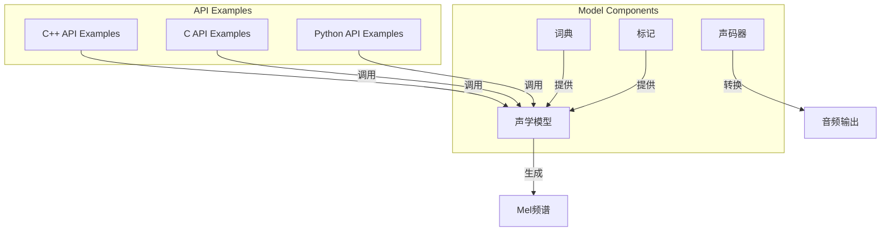
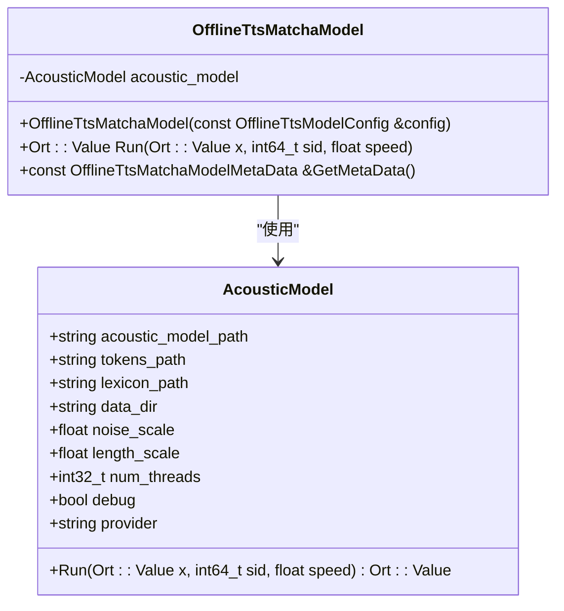
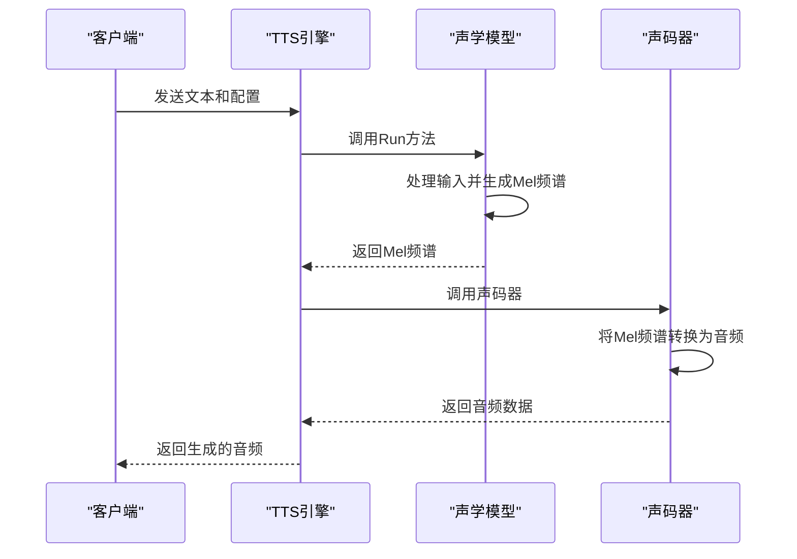
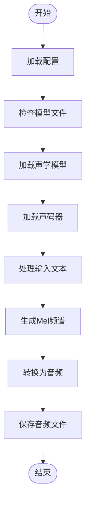
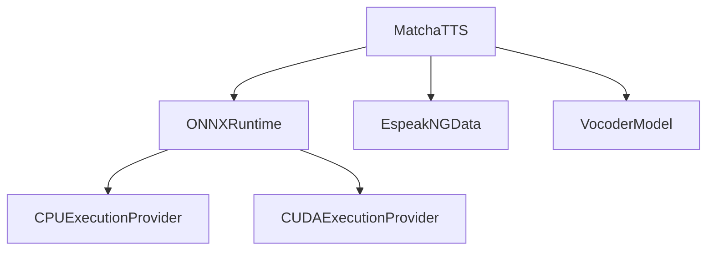

# Matcha语音合成

<cite>
**本文档中引用的文件**   
- [matcha-tts-en-cxx-api.cc](file://cxx-api-examples/matcha-tts-en-cxx-api.cc)
- [matcha-tts-zh-cxx-api.cc](file://cxx-api-examples/matcha-tts-zh-cxx-api.cc)
- [matcha-tts-en-c-api.c](file://c-api-examples/matcha-tts-en-c-api.c)
- [matcha-tts-zh-c-api.c](file://c-api-examples/matcha-tts-zh-c-api.c)
- [offline-tts-play.py](file://python-api-examples/offline-tts-play.py)
- [offline-tts-matcha-model.cc](file://sherpa-onnx/csrc/offline-tts-matcha-model.cc)
- [offline-tts-matcha-model.h](file://sherpa-onnx/csrc/offline-tts-matcha-model.h)
- [offline-tts-matcha-model-meta-data.h](file://sherpa-onnx/csrc/offline-tts-matcha-model-meta-data.h)
- [offline-tts-matcha-model-config.h](file://sherpa-onnx/csrc/offline-tts-matcha-model-config.h)
- [OfflineTtsMatchaModelConfig.java](file://sherpa-onnx/java-api/src/main/java/com/k2fsa/sherpa/onnx/OfflineTtsMatchaModelConfig.java)
</cite>

## 目录
1. [简介](#简介)
2. [项目结构](#项目结构)
3. [核心组件](#核心组件)
4. [架构概述](#架构概述)
5. [详细组件分析](#详细组件分析)
6. [依赖分析](#依赖分析)
7. [性能考虑](#性能考虑)
8. [故障排除指南](#故障排除指南)
9. [结论](#结论)

## 简介
Matcha TTS是一种高质量的文本到语音合成模型，能够生成自然流畅且富有情感的语音。该模型支持多种语言，包括中文和英文，并具备多音色支持、语速语调控制以及情感参数调节等功能。通过端到端训练方法，Matcha TTS利用先进的注意力机制和长序列建模能力，实现了卓越的语音生成效果。本文档将深入探讨Matcha TTS模型的技术细节，包括其架构、配置选项以及实际应用示例。

## 项目结构
Matcha TTS模型在Sherpa-ONNX项目中作为一个独立的模块存在，主要位于`cxx-api-examples`和`c-api-examples`目录下。这些示例展示了如何使用C++和C API来调用Matcha TTS模型进行语音合成。此外，Python API示例也提供了便捷的方式来生成音频文件。

**图源**
- [matcha-tts-en-cxx-api.cc](file://cxx-api-examples/matcha-tts-en-cxx-api.cc)
- [matcha-tts-zh-cxx-api.cc](file://cxx-api-examples/matcha-tts-zh-cxx-api.cc)
- [offline-tts-matcha-model.cc](file://sherpa-onnx/csrc/offline-tts-matcha-model.cc)

**节源**
- [matcha-tts-en-cxx-api.cc](file://cxx-api-examples/matcha-tts-en-cxx-api.cc)
- [matcha-tts-zh-cxx-api.cc](file://cxx-api-examples/matcha-tts-zh-cxx-api.cc)
- [offline-tts-matcha-model.cc](file://sherpa-onnx/csrc/offline-tts-matcha-model.cc)

## 核心组件
Matcha TTS的核心组件包括声学模型、声码器、词典和标记文件。声学模型负责将文本转换为Mel频谱图，而声码器则将Mel频谱图转换为最终的音频信号。词典和标记文件用于指导模型正确地处理输入文本中的词汇和发音。

**节源**
- [offline-tts-matcha-model.cc](file://sherpa-onnx/csrc/offline-tts-matcha-model.cc)
- [offline-tts-matcha-model.h](file://sherpa-onnx/csrc/offline-tts-matcha-model.h)

## 架构概述
Matcha TTS采用端到端的训练方法，结合了注意力机制和长序列建模技术，以实现高质量的语音生成。模型通过学习文本与语音之间的映射关系，能够在生成过程中保持上下文的一致性，并准确地表达情感。

**图源**
- [offline-tts-matcha-model.cc](file://sherpa-onnx/csrc/offline-tts-matcha-model.cc)
- [offline-tts-matcha-model-meta-data.h](file://sherpa-onnx/csrc/offline-tts-matcha-model-meta-data.h)

## 详细组件分析
### 声学模型分析
声学模型是Matcha TTS的关键部分，它接收经过预处理的文本数据并生成相应的Mel频谱图。该模型利用注意力机制来关注输入序列中的重要部分，从而提高生成语音的质量。

#### 对象导向组件：

**图源**
- [offline-tts-matcha-model.cc](file://sherpa-onnx/csrc/offline-tts-matcha-model.cc)
- [offline-tts-matcha-model.h](file://sherpa-onnx/csrc/offline-tts-matcha-model.h)

#### API/服务组件：

**图源**
- [matcha-tts-en-cxx-api.cc](file://cxx-api-examples/matcha-tts-en-cxx-api.cc)
- [matcha-tts-zh-cxx-api.cc](file://cxx-api-examples/matcha-tts-zh-cxx-api.cc)

#### 复杂逻辑组件：

**图源**
- [offline-tts-play.py](file://python-api-examples/offline-tts-play.py)
- [offline-tts-matcha-model.cc](file://sherpa-onnx/csrc/offline-tts-matcha-model.cc)

**节源**
- [offline-tts-matcha-model.cc](file://sherpa-onnx/csrc/offline-tts-matcha-model.cc)
- [offline-tts-play.py](file://python-api-examples/offline-tts-play.py)

### 多音色支持与语速控制
Matcha TTS支持多音色和语速调节功能。用户可以通过设置不同的speaker ID（sid）来选择不同的音色，并通过调整speed参数来改变语音的速度。

**节源**
- [offline-tts-matcha-model.cc](file://sherpa-onnx/csrc/offline-tts-matcha-model.cc)
- [OfflineTtsMatchaModelConfig.java](file://sherpa-onnx/java-api/src/main/java/com/k2fsa/sherpa/onnx/OfflineTtsMatchaModelConfig.java)

## 依赖分析
Matcha TTS依赖于多个外部组件，包括ONNX运行时、espeak-ng数据目录以及特定的声码器模型。这些依赖项确保了模型能够正确地执行文本到语音的转换过程。

**图源**
- [offline-tts-matcha-model-config.h](file://sherpa-onnx/csrc/offline-tts-matcha-model-config.h)
- [offline-tts-matcha-model.cc](file://sherpa-onnx/csrc/offline-tts-matcha-model.cc)

**节源**
- [offline-tts-matcha-model-config.h](file://sherpa-onnx/csrc/offline-tts-matcha-model-config.h)
- [offline-tts-matcha-model.cc](file://sherpa-onnx/csrc/offline-tts-matcha-model.cc)

## 性能考虑
在使用Matcha TTS时，需要考虑计算资源的需求。模型的推理速度受线程数、硬件加速器（如CPU或GPU）以及输入文本长度的影响。为了优化性能，建议根据实际应用场景调整配置参数。

[无节源，因为本节提供一般性指导]

## 故障排除指南
当遇到问题时，可以参考以下步骤进行排查：
1. 确认所有必需的模型文件都已正确下载并放置在指定路径。
2. 检查配置文件中的路径是否正确无误。
3. 查看日志输出以获取详细的错误信息。
4. 确保使用的ONNX运行时版本与模型兼容。

**节源**
- [matcha-tts-en-cxx-api.cc](file://cxx-api-examples/matcha-tts-en-cxx-api.cc)
- [matcha-tts-zh-cxx-api.cc](file://cxx-api-examples/matcha-tts-zh-cxx-api.cc)

## 结论
Matcha TTS是一款功能强大的文本到语音合成工具，具备高质量的语音生成能力和丰富的情感表达特性。通过灵活的配置选项，用户可以根据需求定制输出效果。无论是用于个人项目还是商业应用，Matcha TTS都能提供出色的用户体验。

[无节源，因为本节总结而不分析特定文件]