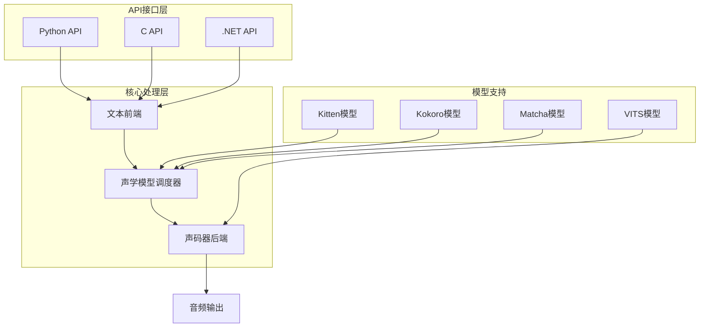
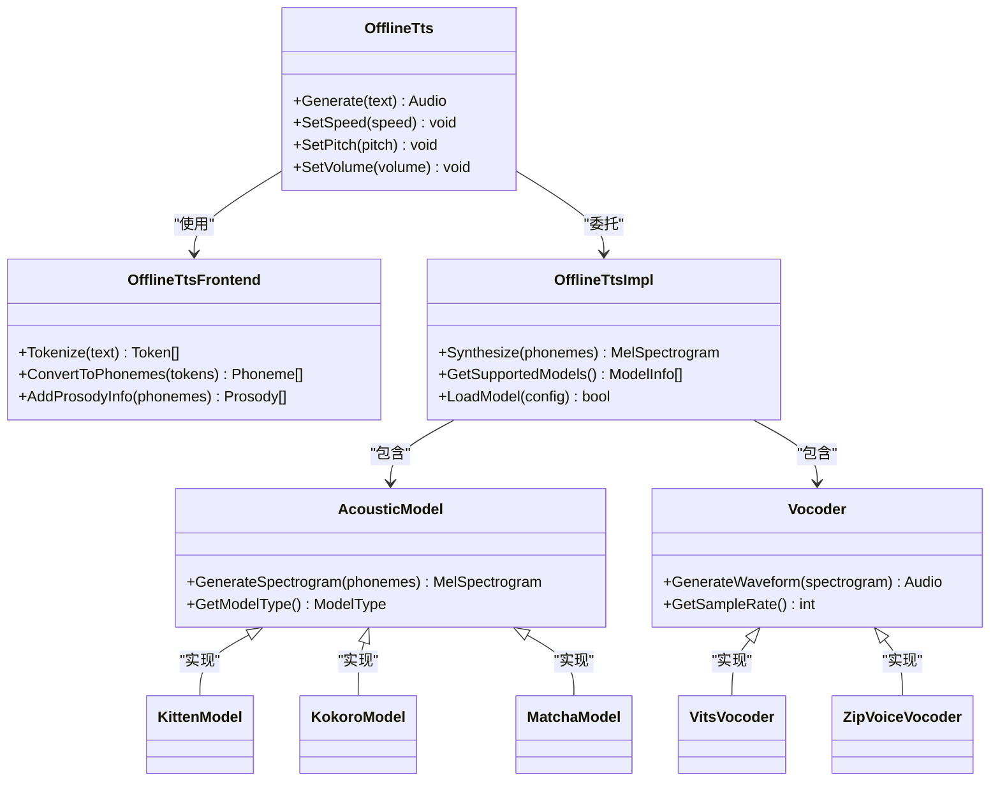
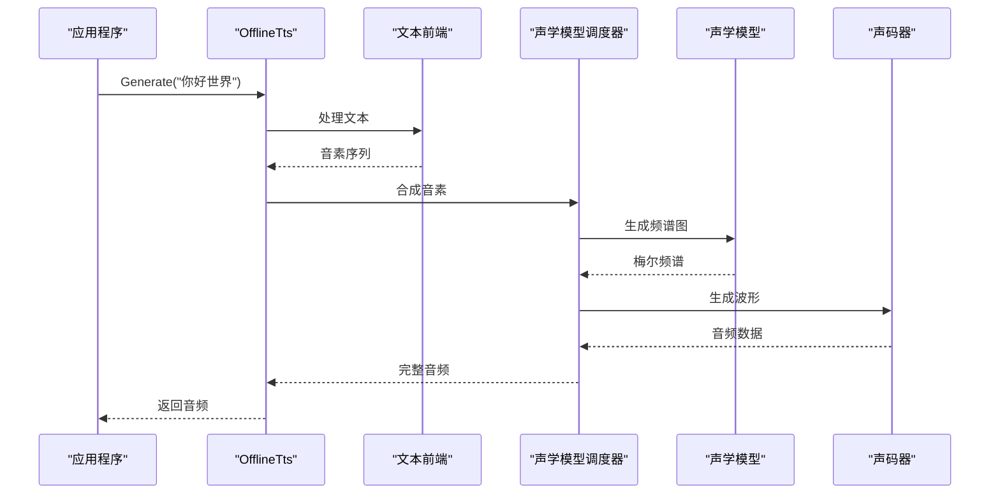
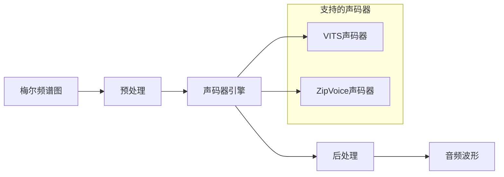
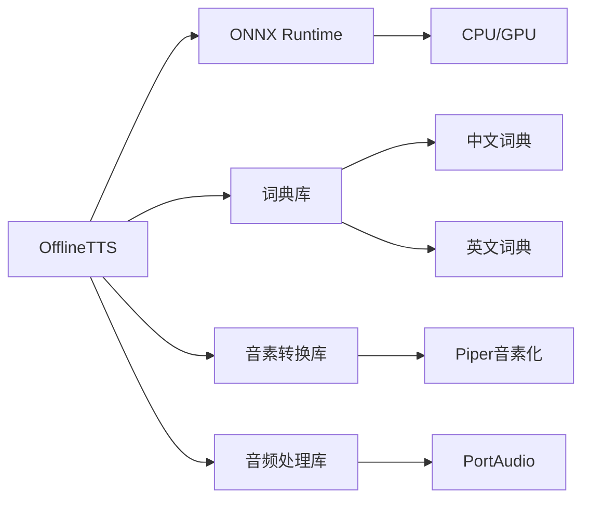

# 离线语音合成架构

<cite>
**本文档引用的文件**  
- [offline-tts-impl.cc](file://sherpa-onnx/csrc/offline-tts-impl.cc)
- [offline-tts-impl.h](file://sherpa-onnx/csrc/offline-tts-impl.h)
- [offline-tts-frontend.cc](file://sherpa-onnx/csrc/offline-tts-frontend.cc)
- [offline-tts-frontend.h](file://sherpa-onnx/csrc/offline-tts-frontend.h)
- [offline-tts-character-frontend.cc](file://sherpa-onnx/csrc/offline-tts-character-frontend.cc)
- [offline-tts-character-frontend.h](file://sherpa-onnx/csrc/offline-tts-character-frontend.h)
- [offline-tts-kitten-model.cc](file://sherpa-onnx/csrc/offline-tts-kitten-model.cc)
- [offline-tts-kitten-model.h](file://sherpa-onnx/csrc/offline-tts-kitten-model.h)
- [offline-tts-kitten-impl.h](file://sherpa-onnx/csrc/offline-tts-kitten-impl.h)
- [offline-tts-kokoro-model-config.cc](file://sherpa-onnx/csrc/offline-tts-kokoro-model-config.cc)
- [offline-tts-kokoro-model-config.h](file://sherpa-onnx/csrc/offline-tts-kokoro-model-config.h)
- [offline-tts-kokoro-impl.h](file://sherpa-onnx/csrc/offline-tts-kokoro-impl.h)
- [offline-tts-matcha-impl.h](file://sherpa-onnx/csrc/offline-tts-matcha-impl.h)
- [offline-tts-vits-impl.h](file://sherpa-onnx/csrc/offline-tts-vits-impl.h)
- [offline-tts-zipvoice-impl.h](file://sherpa-onnx/csrc/offline-tts-zipvoice-impl.h)
- [python-api-examples/offline-tts.py](file://python-api-examples/offline-tts.py)
- [c-api-examples/offline-tts-c-api.c](file://c-api-examples/offline-tts-c-api.c)
</cite>

## 目录
1. [简介](#简介)
2. [项目结构](#项目结构)
3. [核心组件](#核心组件)
4. [架构概述](#架构概述)
5. [详细组件分析](#详细组件分析)
6. [依赖分析](#依赖分析)
7. [性能考虑](#性能考虑)
8. [故障排除指南](#故障排除指南)
9. [结论](#结论)

## 简介
离线语音合成器（OfflineTTS）是Sherpa-Onnx项目中的核心组件，提供无需网络连接的高质量文本到语音转换功能。该系统采用模块化设计，支持多种TTS模型（如Kitten、Kokoro、Matcha、VITS等），通过统一的接口实现模型的灵活接入和管理。本文档详细描述OfflineTTS的架构设计、模块交互、时序控制机制以及系统集成方法。

## 项目结构
OfflineTTS功能主要集中在`sherpa-onnx/csrc`目录下，采用C++实现核心逻辑，并通过多种语言API（Python、C、.NET等）提供接口。系统采用分层架构，包括文本前端、声学模型调度器和声码器后端三个主要模块。



**图示来源**
- [offline-tts-impl.h](file://sherpa-onnx/csrc/offline-tts-impl.h#L1-L50)
- [offline-tts-frontend.h](file://sherpa-onnx/csrc/offline-tts-frontend.h#L1-L30)

**本节来源**
- [sherpa-onnx/csrc](file://sherpa-onnx/csrc)
- [python-api-examples](file://python-api-examples)

## 核心组件
OfflineTTS的核心组件包括文本前端处理器、声学模型调度器和声码器后端。文本前端负责将输入文本转换为音素序列，声学模型调度器生成梅尔频谱图，声码器后端将频谱图转换为最终的音频波形。系统通过统一的抽象层支持多种TTS模型，实现了良好的扩展性和灵活性。

**本节来源**
- [offline-tts-impl.h](file://sherpa-onnx/csrc/offline-tts-impl.h#L50-L100)
- [offline-tts-frontend.h](file://sherpa-onnx/csrc/offline-tts-frontend.h#L30-L60)

## 架构概述
OfflineTTS采用模块化分层架构，各组件通过清晰的接口进行通信。系统设计遵循单一职责原则，每个模块负责特定的功能，便于维护和扩展。



**图示来源**
- [offline-tts-impl.h](file://sherpa-onnx/csrc/offline-tts-impl.h#L1-L80)
- [offline-tts-frontend.h](file://sherpa-onnx/csrc/offline-tts-frontend.h#L1-L50)

## 详细组件分析

### 文本前端分析
文本前端模块负责将原始文本转换为适合声学模型处理的格式，包括文本标准化、分词、音素转换和韵律信息添加等步骤。

```mermaid
flowchart TD
Start([输入文本]) --> TextNormalization["文本标准化"]
TextNormalization --> Tokenization["分词处理"]
Tokenization --> PhonemeConversion["音素转换"]
PhonemeConversion --> ProsodyAnalysis["韵律分析"]
ProsodyAnalysis --> Output["输出音素序列"]
Note over Start,Output: 文本前端处理流程
```

**图示来源**
- [offline-tts-frontend.cc](file://sherpa-onnx/csrc/offline-tts-frontend.cc#L1-L100)
- [offline-tts-character-frontend.cc](file://sherpa-onnx/csrc/offline-tts-character-frontend.cc#L1-L80)

**本节来源**
- [offline-tts-frontend.cc](file://sherpa-onnx/csrc/offline-tts-frontend.cc#L1-L150)
- [offline-tts-character-frontend.cc](file://sherpa-onnx/csrc/offline-tts-character-frontend.cc#L1-L100)

### 声学模型调度器分析
声学模型调度器负责管理不同类型的TTS模型，根据配置加载相应的模型实例，并调度声学特征的生成过程。



**图示来源**
- [offline-tts-impl.cc](file://sherpa-onnx/csrc/offline-tts-impl.cc#L1-L120)
- [offline-tts-kitten-impl.h](file://sherpa-onnx/csrc/offline-tts-kitten-impl.h#L1-L40)
- [offline-tts-kokoro-impl.h](file://sherpa-onnx/csrc/offline-tts-kokoro-impl.h#L1-L40)

**本节来源**
- [offline-tts-impl.cc](file://sherpa-onnx/csrc/offline-tts-impl.cc#L1-L200)
- [offline-tts-kitten-model.cc](file://sherpa-onnx/csrc/offline-tts-kitten-model.cc#L1-L100)

### 声码器后端分析
声码器后端模块负责将声学模型生成的频谱图转换为高质量的音频波形，支持多种声码器实现。



**图示来源**
- [offline-tts-vits-impl.h](file://sherpa-onnx/csrc/offline-tts-vits-impl.h#L1-L30)
- [offline-tts-zipvoice-impl.h](file://sherpa-onnx/csrc/offline-tts-zipvoice-impl.h#L1-L30)

**本节来源**
- [offline-tts-vits-impl.h](file://sherpa-onnx/csrc/offline-tts-vits-impl.h#L1-L50)
- [offline-tts-zipvoice-impl.h](file://sherpa-onnx/csrc/offline-tts-zipvoice-impl.h#L1-L50)

## 依赖分析
OfflineTTS系统依赖于ONNX Runtime进行模型推理，同时需要特定的词典和语言处理库支持多语言TTS功能。



**图示来源**
- [CMakeLists.txt](file://sherpa-onnx/csrc/CMakeLists.txt#L250-L260)
- [onnxruntime.cmake](file://cmake/onnxruntime.cmake#L1-L20)

**本节来源**
- [go.mod](file://go.mod#L1-L30)
- [CMakeLists.txt](file://sherpa-onnx/csrc/CMakeLists.txt#L250-L270)

## 性能考虑
OfflineTTS在设计时充分考虑了性能优化，包括模型加载优化、内存管理和推理加速等方面。系统支持模型缓存机制，避免重复加载相同模型，同时提供批处理接口以提高吞吐量。

## 故障排除指南
常见问题包括模型文件路径错误、音频设备不可用和内存不足等。建议检查模型配置文件的正确性，确保所有依赖库已正确安装，并监控系统资源使用情况。

**本节来源**
- [errors.go](file://errors/errors.go#L10-L50)
- [debug.go](file://debug/debug.go#L15-L40)

## 结论
OfflineTTS提供了一个功能完整、架构清晰的离线语音合成解决方案。通过模块化设计和统一接口，系统能够灵活支持多种TTS模型，满足不同场景的需求。建议在实际部署时根据具体需求选择合适的模型，并进行充分的性能测试。