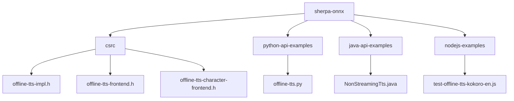
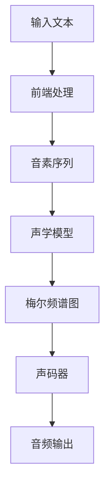
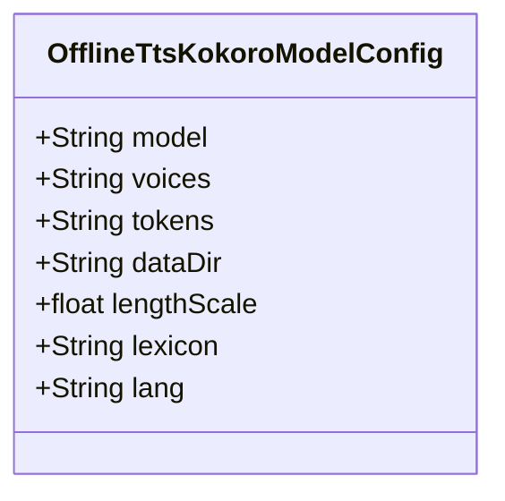
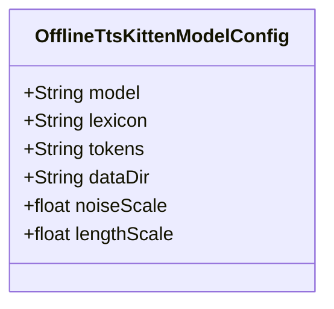
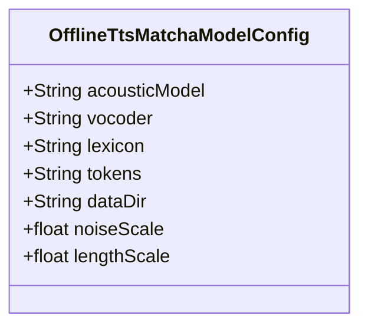
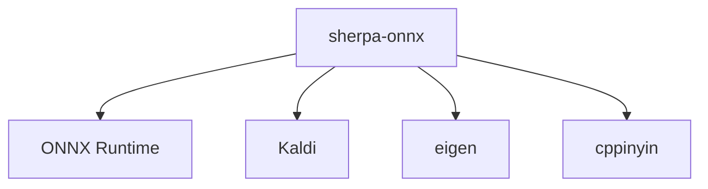

# 语音合成

<cite>
**本文档中引用的文件**  
- [offline-tts-impl.h](file://sherpa-onnx/csrc/offline-tts-impl.h)
- [offline-tts-impl.cc](file://sherpa-onnx/csrc/offline-tts-impl.cc)
- [offline-tts-frontend.h](file://sherpa-onnx/csrc/offline-tts-frontend.h)
- [offline-tts-frontend.cc](file://sherpa-onnx/csrc/offline-tts-frontend.cc)
- [offline-tts-character-frontend.h](file://sherpa-onnx/csrc/offline-tts-character-frontend.h)
- [offline-tts-character-frontend.cc](file://sherpa-onnx/csrc/offline-tts-character-frontend.cc)
- [offline-tts-kitten-impl.h](file://sherpa-onnx/csrc/offline-tts-kitten-impl.h)
- [OfflineTtsKokoroModelConfig.java](file://sherpa-onnx/java-api/src/main/java/com/k2fsa/sherpa/onnx/OfflineTtsKokoroModelConfig.java)
- [Tts.kt](file://sherpa-onnx/kotlin-api/Tts.kt)
- [tts.dart](file://flutter/sherpa_onnx/lib/src/tts.dart)
- [NonStreamingTts.ets](file://harmony-os/SherpaOnnxHar/sherpa_onnx/src/main/ets/components/NonStreamingTts.ets)
- [offline-tts-c-api.c](file://c-api-examples/offline-tts-c-api.c)
- [offline-tts.py](file://python-api-examples/offline-tts.py)
- [test-offline-tts-kokoro-en.js](file://nodejs-examples/test-offline-tts-kokoro-en.js)
- [test-offline-tts-kitten-en.js](file://nodejs-examples/test-offline-tts-kitten-en.js)
- [test-offline-tts-matcha-en.js](file://nodejs-examples/test-offline-tts-matcha-en.js)
</cite>

## 目录
1. [简介](#简介)
2. [项目结构](#项目结构)
3. [核心组件](#核心组件)
4. [架构概述](#架构概述)
5. [详细组件分析](#详细组件分析)
6. [依赖分析](#依赖分析)
7. [性能考虑](#性能考虑)
8. [故障排除指南](#故障排除指南)
9. [结论](#结论)

## 简介
sherpa-onnx 是一个功能强大的语音合成（TTS）框架，支持多种先进的TTS模型，包括Kokoro、Kitten和Matcha。这些模型能够实现高质量的离线语音合成，适用于多语言环境下的文本到语音转换。本文档深入探讨了这些TTS模型的技术实现、集成方式以及离线语音合成器（OfflineTTS）的架构设计。

## 项目结构
sherpa-onnx 项目的结构清晰，主要分为多个模块，每个模块负责不同的功能。核心的TTS功能位于 `sherpa-onnx/csrc` 目录下，包含了各种TTS模型的实现。此外，项目还提供了多种语言的API示例，如C++、Python、Java等，方便开发者在不同平台上使用。

**图源**
- [offline-tts-impl.h](file://sherpa-onnx/csrc/offline-tts-impl.h)
- [offline-tts-frontend.h](file://sherpa-onnx/csrc/offline-tts-frontend.h)
- [offline-tts-character-frontend.h](file://sherpa-onnx/csrc/offline-tts-character-frontend.h)
- [offline-tts.py](file://python-api-examples/offline-tts.py)
- [NonStreamingTts.java](file://java-api-examples/NonStreamingTts.java)
- [test-offline-tts-kokoro-en.js](file://nodejs-examples/test-offline-tts-kokoro-en.js)

**节源**
- [offline-tts-impl.h](file://sherpa-onnx/csrc/offline-tts-impl.h)
- [offline-tts-frontend.h](file://sherpa-onnx/csrc/offline-tts-frontend.h)
- [offline-tts-character-frontend.h](file://sherpa-onnx/csrc/offline-tts-character-frontend.h)

## 核心组件
sherpa-onnx 的核心组件包括离线TTS引擎、前端处理模块和声码器集成。这些组件共同协作，实现了从文本到音频的高效转换。

**节源**
- [offline-tts-impl.h](file://sherpa-onnx/csrc/offline-tts-impl.h)
- [offline-tts-frontend.h](file://sherpa-onnx/csrc/offline-tts-frontend.h)
- [offline-tts-character-frontend.h](file://sherpa-onnx/csrc/offline-tts-character-frontend.h)

## 架构概述
sherpa-onnx 的架构设计旨在提供灵活且高效的TTS解决方案。系统主要由以下几个部分组成：配置管理、前端处理、声学模型和声码器。配置管理负责加载和验证模型参数；前端处理将输入文本转换为音素序列；声学模型生成梅尔频谱图；声码器则将梅尔频谱图转换为最终的音频波形。

**图源**
- [offline-tts-impl.h](file://sherpa-onnx/csrc/offline-tts-impl.h)
- [offline-tts-frontend.h](file://sherpa-onnx/csrc/offline-tts-frontend.h)
- [offline-tts-character-frontend.h](file://sherpa-onnx/csrc/offline-tts-character-frontend.h)

## 详细组件分析
### Kokoro 模型分析
Kokoro 是一个支持多语言的TTS模型，特别适用于英语和中文的语音合成。该模型通过配置文件指定模型路径、词汇表和数据目录等参数。

**图源**
- [OfflineTtsKokoroModelConfig.java](file://sherpa-onnx/java-api/src/main/java/com/k2fsa/sherpa/onnx/OfflineTtsKokoroModelConfig.java)

**节源**
- [OfflineTtsKokoroModelConfig.java](file://sherpa-onnx/java-api/src/main/java/com/k2fsa/sherpa/onnx/OfflineTtsKokoroModelConfig.java)
- [Tts.kt](file://sherpa-onnx/kotlin-api/Tts.kt)
- [tts.dart](file://flutter/sherpa_onnx/lib/src/tts.dart)

### Kitten 模型分析
Kitten 是一个轻量级的TTS模型，适合资源受限的设备。它通过简单的配置即可快速集成到应用中。

**图源**
- [offline-tts-kitten-impl.h](file://sherpa-onnx/csrc/offline-tts-kitten-impl.h)

**节源**
- [offline-tts-kitten-impl.h](file://sherpa-onnx/csrc/offline-tts-kitten-impl.h)
- [Tts.kt](file://sherpa-onnx/kotlin-api/Tts.kt)
- [tts.dart](file://flutter/sherpa_onnx/lib/src/tts.dart)

### Matcha 模型分析
Matcha 是一个高性能的TTS模型，支持复杂的语音合成任务。它需要指定声学模型和声码器路径。

**图源**
- [Tts.kt](file://sherpa-onnx/kotlin-api/Tts.kt)

**节源**
- [Tts.kt](file://sherpa-onnx/kotlin-api/Tts.kt)
- [tts.dart](file://flutter/sherpa_onnx/lib/src/tts.dart)

## 依赖分析
sherpa-onnx 依赖于多个外部库，如ONNX Runtime、Kaldi等，以实现高效的模型推理和音频处理。这些依赖项通过CMake脚本进行管理。

**图源**
- [onnxruntime.cmake](file://cmake/onnxruntime.cmake)
- [kaldi-native-fbank.cmake](file://cmake/kaldi-native-fbank.cmake)
- [eigen.cmake](file://cmake/eigen.cmake)
- [cppinyin.cmake](file://cmake/cppinyin.cmake)

**节源**
- [onnxruntime.cmake](file://cmake/onnxruntime.cmake)
- [kaldi-native-fbank.cmake](file://cmake/kaldi-native-fbank.cmake)
- [eigen.cmake](file://cmake/eigen.cmake)
- [cppinyin.cmake](file://cmake/cppinyin.cmake)

## 性能考虑
为了优化性能，建议使用多线程处理，并根据设备能力选择合适的模型。例如，在移动设备上可以使用轻量级的Kitten模型，而在服务器上则可以使用更复杂的Matcha模型。

## 故障排除指南
常见问题包括模型加载失败、音频输出异常等。确保所有模型文件路径正确，并检查依赖库是否已正确安装。

**节源**
- [offline-tts-c-api.c](file://c-api-examples/offline-tts-c-api.c)
- [offline-tts.py](file://python-api-examples/offline-tts.py)
- [test-offline-tts-kokoro-en.js](file://nodejs-examples/test-offline-tts-kokoro-en.js)

## 结论
sherpa-onnx 提供了一个全面的TTS解决方案，支持多种模型和平台。通过合理的配置和优化，可以在各种应用场景中实现高质量的语音合成。