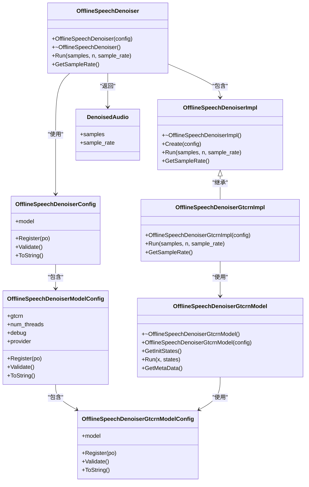
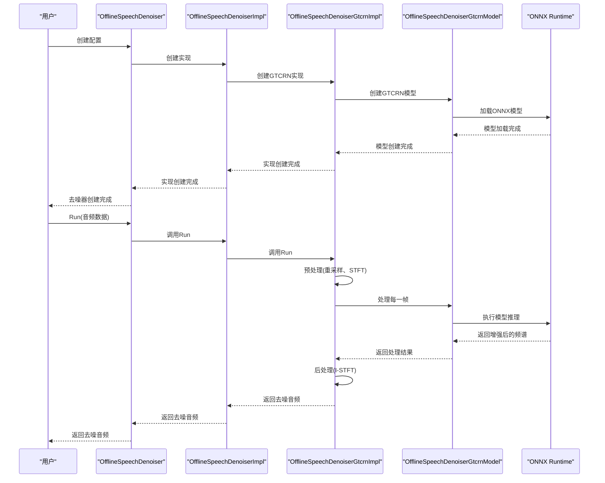
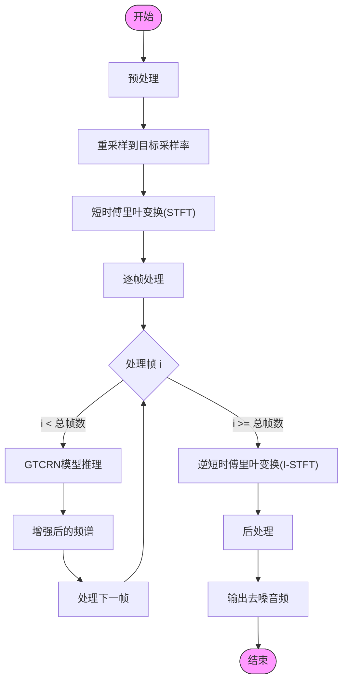
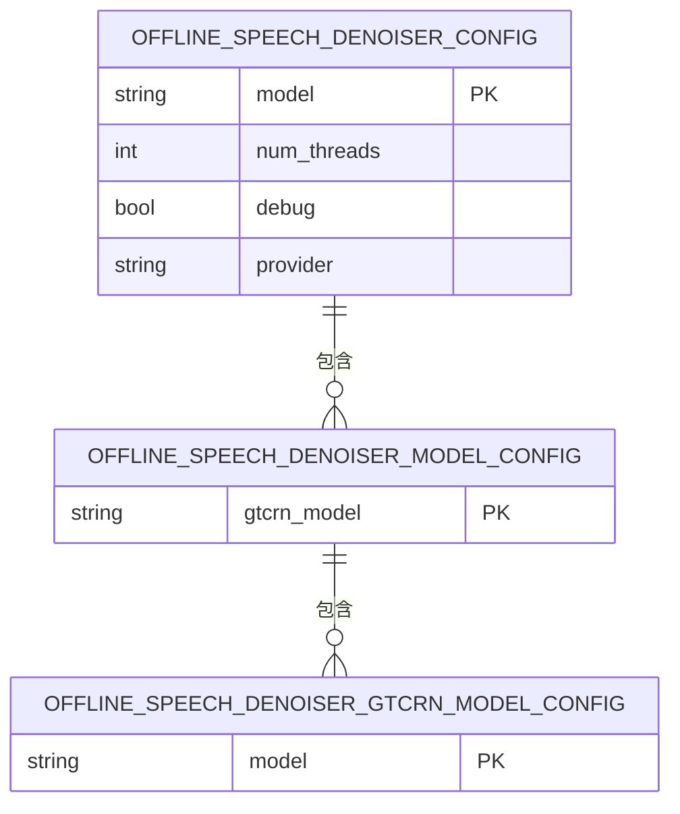
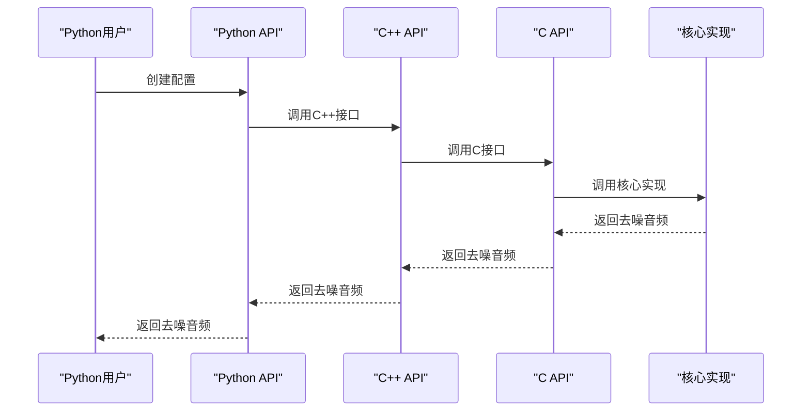

# 语音增强

<cite>
**本文档引用的文件**
- [offline-speech-denoiser.h](file://sherpa-onnx/csrc/offline-speech-denoiser.h)
- [offline-speech-denoiser.cc](file://sherpa-onnx/csrc/offline-speech-denoiser.cc)
- [offline-speech-denoiser-impl.h](file://sherpa-onnx/csrc/offline-speech-denoiser-impl.h)
- [offline-speech-denoiser-impl.cc](file://sherpa-onnx/csrc/offline-speech-denoiser-impl.cc)
- [offline-speech-denoiser-gtcrn-model.h](file://sherpa-onnx/csrc/offline-speech-denoiser-gtcrn-model.h)
- [offline-speech-denoiser-gtcrn-model.cc](file://sherpa-onnx/csrc/offline-speech-denoiser-gtcrn-model.cc)
- [offline-speech-denoiser-gtcrn-impl.h](file://sherpa-onnx/csrc/offline-speech-denoiser-gtcrn-impl.h)
- [offline-speech-denoiser-model-config.h](file://sherpa-onnx/csrc/offline-speech-denoiser-model-config.h)
- [offline-speech-denoiser-gtcrn-model-config.h](file://sherpa-onnx/csrc/offline-speech-denoiser-gtcrn-model-config.h)
- [offline-speech-denoiser-gtcrn-model-meta-data.h](file://sherpa-onnx/csrc/offline-speech-denoiser-gtcrn-model-meta-data.h)
- [offline-speech-enhancement-gtcrn.py](file://python-api-examples/offline-speech-enhancement-gtcrn.py)
- [speech-enhancement-gtcrn-cxx-api.cc](file://cxx-api-examples/speech-enhancement-gtcrn-cxx-api.cc)
- [speech-enhancement-gtcrn-c-api.c](file://c-api-examples/speech-enhancement-gtcrn-c-api.c)
</cite>

## 目录
1. [引言](#引言)
2. [核心架构设计](#核心架构设计)
3. [GTCRN模型实现](#gtcrn模型实现)
4. [频谱处理与音质保持](#频谱处理与音质保持)
5. [配置参数与使用方法](#配置参数与使用方法)
6. [代码示例](#代码示例)
7. [应用场景](#应用场景)
8. [结论](#结论)

## 引言
sherpa-onnx项目提供了基于GTCRN（Gated Temporal Convolutional Recurrent Network）模型的语音增强功能，专注于语音去噪和清晰度提升。该功能通过离线语音去噪器（OfflineSpeechDenoiser）实现，能够有效处理嘈杂音频，生成清晰的语音输出。本文档将深入探讨其技术实现、架构设计和实际应用。

## 核心架构设计

**图示来源**
- [offline-speech-denoiser.h](file://sherpa-onnx/csrc/offline-speech-denoiser.h)
- [offline-speech-denoiser-impl.h](file://sherpa-onnx/csrc/offline-speech-denoiser-impl.h)
- [offline-speech-denoiser-gtcrn-model.h](file://sherpa-onnx/csrc/offline-speech-denoiser-gtcrn-model.h)
- [offline-speech-denoiser-model-config.h](file://sherpa-onnx/csrc/offline-speech-denoiser-model-config.h)
- [offline-speech-denoiser-gtcrn-model-config.h](file://sherpa-onnx/csrc/offline-speech-denoiser-gtcrn-model-config.h)

**本节来源**
- [offline-speech-denoiser.h](file://sherpa-onnx/csrc/offline-speech-denoiser.h)
- [offline-speech-denoiser.cc](file://sherpa-onnx/csrc/offline-speech-denoiser.cc)
- [offline-speech-denoiser-impl.h](file://sherpa-onnx/csrc/offline-speech-denoiser-impl.h)
- [offline-speech-denoiser-impl.cc](file://sherpa-onnx/csrc/offline-speech-denoiser-impl.cc)

## GTCRN模型实现

**图示来源**
- [offline-speech-denoiser-gtcrn-model.cc](file://sherpa-onnx/csrc/offline-speech-denoiser-gtcrn-model.cc)
- [offline-speech-denoiser-gtcrn-impl.h](file://sherpa-onnx/csrc/offline-speech-denoiser-gtcrn-impl.h)
- [offline-speech-denoiser.cc](file://sherpa-onnx/csrc/offline-speech-denoiser.cc)

**本节来源**
- [offline-speech-denoiser-gtcrn-model.h](file://sherpa-onnx/csrc/offline-speech-denoiser-gtcrn-model.h)
- [offline-speech-denoiser-gtcrn-model.cc](file://sherpa-onnx/csrc/offline-speech-denoiser-gtcrn-model.cc)
- [offline-speech-denoiser-gtcrn-model-meta-data.h](file://sherpa-onnx/csrc/offline-speech-denoiser-gtcrn-model-meta-data.h)

## 频谱处理与音质保持

**图示来源**
- [offline-speech-denoiser-gtcrn-impl.h](file://sherpa-onnx/csrc/offline-speech-denoiser-gtcrn-impl.h)
- [offline-speech-denoiser-gtcrn-model.cc](file://sherpa-onnx/csrc/offline-speech-denoiser-gtcrn-model.cc)

**本节来源**
- [offline-speech-denoiser-gtcrn-impl.h](file://sherpa-onnx/csrc/offline-speech-denoiser-gtcrn-impl.h)
- [kaldi-native-fbank/csrc/stft.h](file://kaldi-native-fbank/csrc/stft.h)
- [kaldi-native-fbank/csrc/istft.h](file://kaldi-native-fbank/csrc/istft.h)
- [sherpa-onnx/csrc/resample.h](file://sherpa-onnx/csrc/resample.h)

## 配置参数与使用方法

**图示来源**
- [offline-speech-denoiser-model-config.h](file://sherpa-onnx/csrc/offline-speech-denoiser-model-config.h)
- [offline-speech-denoiser-gtcrn-model-config.h](file://sherpa-onnx/csrc/offline-speech-denoiser-gtcrn-model-config.h)

**本节来源**
- [offline-speech-denoiser-model-config.h](file://sherpa-onnx/csrc/offline-speech-denoiser-model-config.h)
- [offline-speech-denoiser-gtcrn-model-config.h](file://sherpa-onnx/csrc/offline-speech-denoiser-gtcrn-model-config.h)
- [offline-speech-denoiser-config.h](file://sherpa-onnx/csrc/offline-speech-denoiser-config.h)

## 代码示例

**图示来源**
- [offline-speech-enhancement-gtcrn.py](file://python-api-examples/offline-speech-enhancement-gtcrn.py)
- [speech-enhancement-gtcrn-cxx-api.cc](file://cxx-api-examples/speech-enhancement-gtcrn-cxx-api.cc)
- [speech-enhancement-gtcrn-c-api.c](file://c-api-examples/speech-enhancement-gtcrn-c-api.c)

**本节来源**
- [python-api-examples/offline-speech-enhancement-gtcrn.py](file://python-api-examples/offline-speech-enhancement-gtcrn.py)
- [cxx-api-examples/speech-enhancement-gtcrn-cxx-api.cc](file://cxx-api-examples/speech-enhancement-gtcrn-cxx-api.cc)
- [c-api-examples/speech-enhancement-gtcrn-c-api.c](file://c-api-examples/speech-enhancement-gtcrn-c-api.c)

## 应用场景
语音增强技术在电话会议和录音转写中具有重要应用价值。在电话会议中，背景噪声、回声和混响会严重影响通话质量，通过语音增强技术可以有效去除这些干扰，提升语音清晰度，改善沟通体验。在录音转写中，嘈杂的录音环境会导致转写准确率下降，语音增强技术可以预处理音频，去除噪声，提高后续语音识别的准确率。此外，该技术还可应用于语音助手、语音搜索、语音生物识别等场景，提升系统的鲁棒性和用户体验。

**本节来源**
- [offline-speech-enhancement-gtcrn.py](file://python-api-examples/offline-speech-enhancement-gtcrn.py)
- [speech-enhancement-gtcrn-cxx-api.cc](file://cxx-api-examples/speech-enhancement-gtcrn-cxx-api.cc)
- [speech-enhancement-gtcrn-c-api.c](file://c-api-examples/speech-enhancement-gtcrn-c-api.c)

## 结论
sherpa-onnx的语音增强功能基于GTCRN模型，通过离线语音去噪器实现了高效的噪声抑制和语音清晰度提升。其架构设计清晰，通过分层的类结构实现了功能的解耦和扩展性。频谱处理流程包括重采样、STFT、GTCRN模型推理和I-STFT，有效保持了音质。提供了丰富的配置参数和多语言API，便于在不同场景下使用。在电话会议和录音转写等应用中具有显著的价值，能够显著提升语音质量和识别准确率。