# VAD实现

<cite>
**本文档引用的文件**   
- [vad-model.cc](file://sherpa-onnx/csrc/vad-model.cc)
- [silero-vad-model.cc](file://sherpa-onnx/csrc/silero-vad-model.cc)
- [silero-vad-model.h](file://sherpa-onnx/csrc/silero-vad-model.h)
- [vad-model.h](file://sherpa-onnx/csrc/vad-model.h)
- [voice-activity-detector.cc](file://sherpa-onnx/csrc/voice-activity-detector.cc)
- [voice-activity-detector.h](file://sherpa-onnx/csrc/voice-activity-detector.h)
- [vad-model-config.h](file://sherpa-onnx/csrc/vad-model-config.h)
- [silero-vad-model-config.h](file://sherpa-onnx/csrc/silero-vad-model-config.h)
- [vad-cxx-api.cc](file://cxx-api-examples/vad-cxx-api.cc)
- [ten-vad-model.cc](file://sherpa-onnx/csrc/ten-vad-model.cc)
- [ten-vad-model.h](file://sherpa-onnx/csrc/ten-vad-model.h)
- [ten-vad-model-config.h](file://sherpa-onnx/csrc/ten-vad-model-config.h)
</cite>

## 目录
1. [简介](#简介)
2. [核心算法分析](#核心算法分析)
3. [Silero VAD模型架构](#silero-vad模型架构)
4. [特征提取与推理流程](#特征提取与推理流程)
5. [关键参数配置](#关键参数配置)
6. [性能优化与调优策略](#性能优化与调优策略)
7. [C++ API接口文档](#c-api接口文档)
8. [结论](#结论)

## 简介

sherpa-onnx中的语音活动检测（VAD）实现提供了一套完整的语音/非语音分类解决方案，主要基于深度学习模型Silero VAD和Ten VAD。该系统通过分析音频流中的声学特征，准确识别语音段落，广泛应用于语音识别、说话人分离等场景。VAD实现采用模块化设计，支持多种后端（如CPU、RKNN）和跨平台部署，具有良好的可扩展性和性能表现。

**Section sources**
- [vad-model.cc](file://sherpa-onnx/csrc/vad-model.cc#L1-L99)
- [vad-model.h](file://sherpa-onnx/csrc/vad-model.h#L1-L50)

## 核心算法分析

sherpa-onnx的VAD核心算法基于深度学习模型，主要通过Silero VAD模型实现语音/非语音的二分类。算法采用LSTM网络结构，对音频帧进行时序分析，通过概率输出判断是否为语音。核心算法包含两个主要版本：V4和V5，分别对应不同的模型结构和输入输出格式。

在`silero-vad-model.cc`中，`IsSpeech`方法实现了核心的语音检测逻辑。该方法首先通过`Run`函数获取当前音频窗口的语音概率，然后结合灵敏度阈值、最小语音段和最大静音段等参数进行决策。算法采用状态机机制，跟踪语音段的开始、持续和结束，确保检测结果的连续性和稳定性。


**Diagram sources**
- [silero-vad-model.cc](file://sherpa-onnx/csrc/silero-vad-model.cc#L95-L171)

**Section sources**
- [silero-vad-model.cc](file://sherpa-onnx/csrc/silero-vad-model.cc#L74-L171)
- [silero-vad-model.h](file://sherpa-onnx/csrc/silero-vad-model.h#L25-L32)

## Silero VAD模型架构

Silero VAD模型采用LSTM网络架构，具有良好的时序建模能力。模型支持两种版本：V4和V5，分别对应不同的网络结构和输入输出格式。V4版本使用两个LSTM层，每层隐藏维度为64；V5版本则使用隐藏维度为128的LSTM层。

模型的输入包括音频样本、LSTM状态和采样率信息。对于V4版本，输入包含四个部分：音频输入、采样率、隐藏状态h和细胞状态c；对于V5版本，输入包含三个部分：音频输入、状态和采样率。输出方面，V4版本产生三个输出：语音概率、新的隐藏状态hn和新的细胞状态cn；V5版本则产生两个输出：语音概率和新的状态stateN。

模型通过`CheckV4`和`CheckV5`方法验证输入输出的正确性，确保模型结构符合预期。`Init`方法负责初始化ONNX运行时会话，并根据模型版本设置相应的参数。`Reset`方法用于重置LSTM状态，确保模型在新的语音段开始时处于初始状态。

```mermaid
classDiagram
class SileroVadModel {
+Reset()
+IsSpeech(samples, n)
+Compute(samples, n)
+WindowSize()
+WindowShift()
}
class Impl {
-config_
-env_
-sess_opts_
-sess_
-input_names_
-output_names_
-states_
-sample_rate_
-min_silence_samples_
-min_speech_samples_
+Run(samples, n)
+Reset()
+IsSpeech(samples, n)
+Init(model_data, model_data_length)
+Check()
+RunV5(samples, n)
+RunV4(samples, n)
}
SileroVadModel --> Impl : "包含"
Impl --> Ort : : Session : "使用"
```

**Diagram sources**
- [silero-vad-model.cc](file://sherpa-onnx/csrc/silero-vad-model.cc#L29-L470)
- [silero-vad-model.h](file://sherpa-onnx/csrc/silero-vad-model.h#L13-L53)

**Section sources**
- [silero-vad-model.cc](file://sherpa-onnx/csrc/silero-vad-model.cc#L29-L470)
- [silero-vad-model.h](file://sherpa-onnx/csrc/silero-vad-model.h#L13-L53)

## 特征提取与推理流程

VAD系统的特征提取与推理流程是一个连续的过程，从音频输入到语音段输出。流程开始于`VoiceActivityDetector`类的`AcceptWaveform`方法，该方法接收音频样本并将其添加到内部缓冲区。当缓冲区中的样本数量达到窗口大小时，系统开始进行推理。

推理流程首先通过`model_->IsSpeech`方法获取当前窗口的语音概率，然后根据概率值和配置参数判断是否为语音。系统维护一个状态机，跟踪语音段的开始、持续和结束。当检测到语音开始时，系统记录起始位置；当检测到语音结束时，系统将完整的语音段添加到输出队列。

`AcceptWaveform`方法还负责管理内部缓冲区，确保语音段的连续性。当检测到完整的语音段时，系统将其从缓冲区中移除，并将剩余的音频样本保留在缓冲区中用于后续处理。`Flush`方法用于处理最后一个语音段，确保所有检测到的语音都被正确输出。


**Diagram sources**
- [voice-activity-detector.cc](file://sherpa-onnx/csrc/voice-activity-detector.cc#L50-L136)
- [silero-vad-model.cc](file://sherpa-onnx/csrc/silero-vad-model.cc#L74-L171)

**Section sources**
- [voice-activity-detector.cc](file://sherpa-onnx/csrc/voice-activity-detector.cc#L50-L136)
- [silero-vad-model.cc](file://sherpa-onnx/csrc/silero-vad-model.cc#L74-L171)

## 关键参数配置

VAD系统的性能和行为主要由一系列关键参数控制，这些参数通过`VadModelConfig`结构体进行配置。主要参数包括灵敏度阈值、最小语音段、最小静音段、窗口大小和最大语音段等。

灵敏度阈值（threshold）控制语音检测的灵敏度，值越高检测越严格，越不容易将非语音误判为语音。最小语音段（min_speech_duration）定义了有效语音段的最短持续时间，用于过滤短暂的语音片段。最小静音段（min_silence_duration）定义了语音段之间的最短静音间隔，用于分割连续的语音。

窗口大小（window_size）决定了每次推理处理的音频样本数量，影响检测的实时性和准确性。最大语音段（max_speech_duration）用于处理长时间的语音输入，当语音段超过此长度时，系统会调整检测参数以适应长语音的特性。

这些参数可以通过`SetThreshold`和`SetMinSilenceDuration`方法在运行时动态调整，以适应不同的应用场景和环境条件。


**Diagram sources**
- [vad-model-config.h](file://sherpa-onnx/csrc/vad-model-config.h#L15-L42)
- [silero-vad-model-config.h](file://sherpa-onnx/csrc/silero-vad-model-config.h#L13-L40)
- [ten-vad-model-config.h](file://sherpa-onnx/csrc/ten-vad-model-config.h#L13-L41)

**Section sources**
- [vad-model-config.h](file://sherpa-onnx/csrc/vad-model-config.h#L15-L42)
- [silero-vad-model-config.h](file://sherpa-onnx/csrc/silero-vad-model-config.h#L13-L40)
- [ten-vad-model-config.h](file://sherpa-onnx/csrc/ten-vad-model-config.h#L13-L41)

## 性能优化与调优策略

为了在不同噪声环境下获得最佳的VAD性能，需要采用一系列优化和调优策略。首先，根据具体应用场景选择合适的模型版本（V4或V5）和后端（CPU或RKNN）。对于实时性要求高的场景，建议使用优化过的RKNN后端；对于精度要求高的场景，可以使用CPU后端。

在噪声环境下，可以通过调整灵敏度阈值来平衡误报率和漏报率。在高噪声环境中，适当提高阈值可以减少将噪声误判为语音的情况；在低信噪比环境中，适当降低阈值可以确保不漏掉弱语音信号。同时，可以根据环境特点调整最小语音段和最小静音段的长度，以适应不同的语音模式。

对于长语音处理，可以利用`max_speech_duration`参数动态调整检测策略。当语音段较长时，系统会自动调整阈值和静音检测参数，以适应长语音的特点。此外，通过合理设置缓冲区大小和窗口大小，可以在保证检测精度的同时优化内存使用和处理延迟。


**Diagram sources**
- [voice-activity-detector.cc](file://sherpa-onnx/csrc/voice-activity-detector.cc#L51-L64)
- [silero-vad-model.cc](file://sherpa-onnx/csrc/silero-vad-model.cc#L103-L167)

**Section sources**
- [voice-activity-detector.cc](file://sherpa-onnx/csrc/voice-activity-detector.cc#L51-L64)
- [silero-vad-model.cc](file://sherpa-onnx/csrc/silero-vad-model.cc#L103-L167)

## C++ API接口文档

sherpa-onnx提供了完整的C++ API用于VAD功能的集成。核心类包括`VadModel`、`SileroVadModel`和`VoiceActivityDetector`。`VadModel`是抽象基类，定义了VAD模型的基本接口；`SileroVadModel`是具体实现类，封装了Silero VAD模型的功能；`VoiceActivityDetector`是高层接口类，提供了语音段检测的完整功能。

`VoiceActivityDetector`类的主要方法包括`AcceptWaveform`、`IsEmpty`、`Front`、`Pop`和`Flush`。`AcceptWaveform`方法用于输入音频样本；`IsEmpty`方法检查是否有检测到的语音段；`Front`方法获取最前面的语音段；`Pop`方法移除已处理的语音段；`Flush`方法用于处理最后一个语音段。

`VadModel`类提供了`IsSpeech`、`Compute`、`Reset`等核心方法。`IsSpeech`方法判断输入音频是否为语音；`Compute`方法计算语音概率；`Reset`方法重置模型状态。这些方法共同构成了VAD系统的核心功能。

```mermaid
classDiagram
class VoiceActivityDetector {
+AcceptWaveform(samples, n)
+IsEmpty()
+Front()
+Pop()
+Clear()
+Reset()
+Flush()
+IsSpeechDetected()
+CurrentSpeechSegment()
}
class VadModel {
+IsSpeech(samples, n)
+Compute(samples, n)
+Reset()
+WindowSize()
+WindowShift()
+MinSilenceDurationSamples()
+MinSpeechDurationSamples()
+SetMinSilenceDuration(s)
+SetThreshold(threshold)
}
class SileroVadModel {
+Reset()
+IsSpeech(samples, n)
+Compute(samples, n)
+WindowSize()
+WindowShift()
+MinSilenceDurationSamples()
+MinSpeechDurationSamples()
+SetMinSilenceDuration(s)
+SetThreshold(threshold)
}
VoiceActivityDetector --> VadModel : "使用"
SileroVadModel --> VadModel : "继承"
```



**Diagram sources**
- [voice-activity-detector.h](file://sherpa-onnx/csrc/voice-activity-detector.h#L19-L59)
- [vad-model.h](file://sherpa-onnx/csrc/vad-model.h#L13-L45)
- [silero-vad-model.h](file://sherpa-onnx/csrc/silero-vad-model.h#L13-L53)

**Section sources**
- [voice-activity-detector.h](file://sherpa-onnx/csrc/voice-activity-detector.h#L19-L59)
- [vad-model.h](file://sherpa-onnx/csrc/vad-model.h#L13-L45)
- [silero-vad-model.h](file://sherpa-onnx/csrc/silero-vad-model.h#L13-L53)

## 结论

sherpa-onnx的VAD实现提供了一套完整、高效的语音活动检测解决方案。通过深度学习模型Silero VAD，系统能够准确识别语音段落，支持多种配置参数和后端选项。核心算法采用LSTM网络结构，具有良好的时序建模能力，能够有效处理各种语音场景。

系统的模块化设计使得其易于集成和扩展，C++ API提供了清晰的接口，便于在不同应用场景中使用。通过合理配置关键参数和采用适当的优化策略，可以在不同噪声环境下获得最佳的检测性能。未来的工作可以进一步优化模型结构，提高在极端噪声环境下的鲁棒性，同时探索更多应用场景的适配和优化。

**Section sources**
- [vad-model.cc](file://sherpa-onnx/csrc/vad-model.cc#L1-L99)
- [silero-vad-model.cc](file://sherpa-onnx/csrc/silero-vad-model.cc#L1-L522)
- [voice-activity-detector.cc](file://sherpa-onnx/csrc/voice-activity-detector.cc#L1-L282)