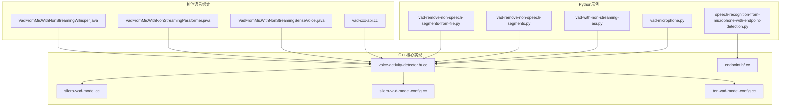
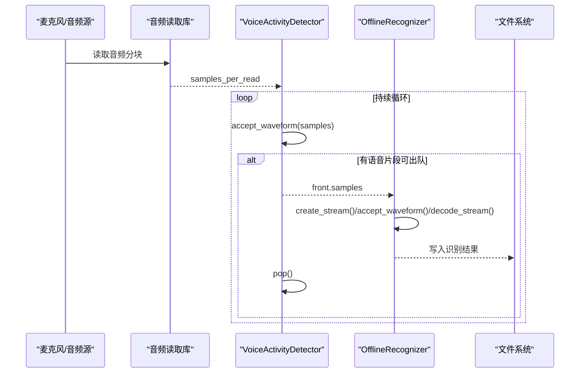
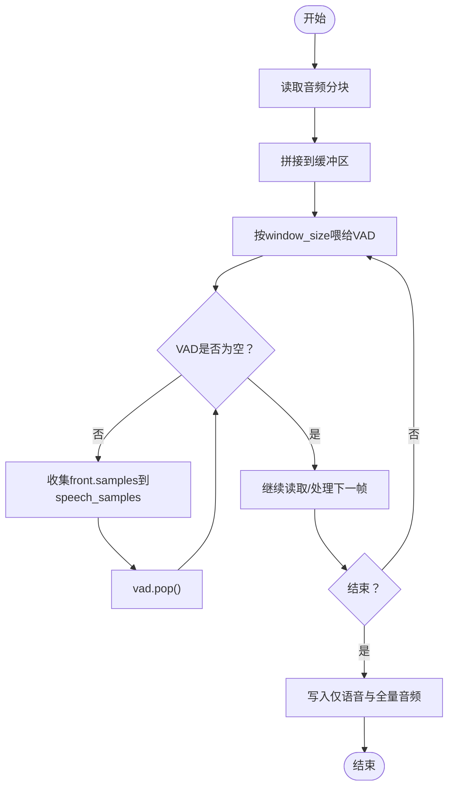
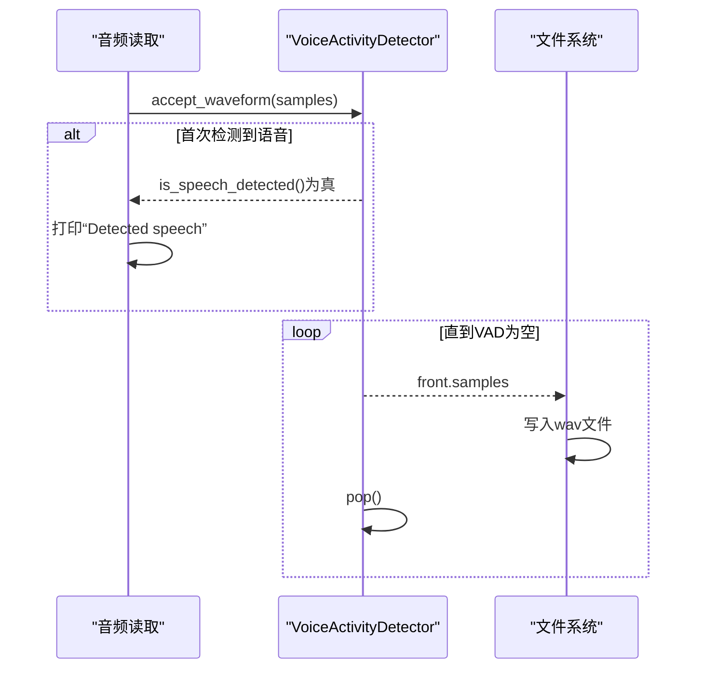
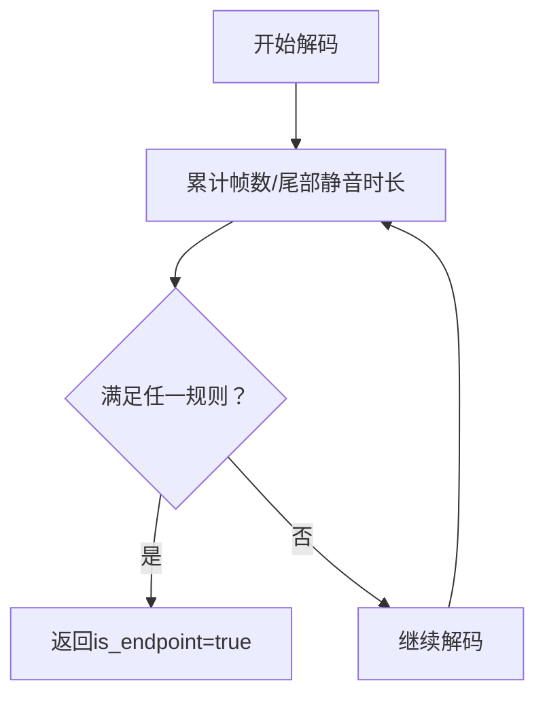
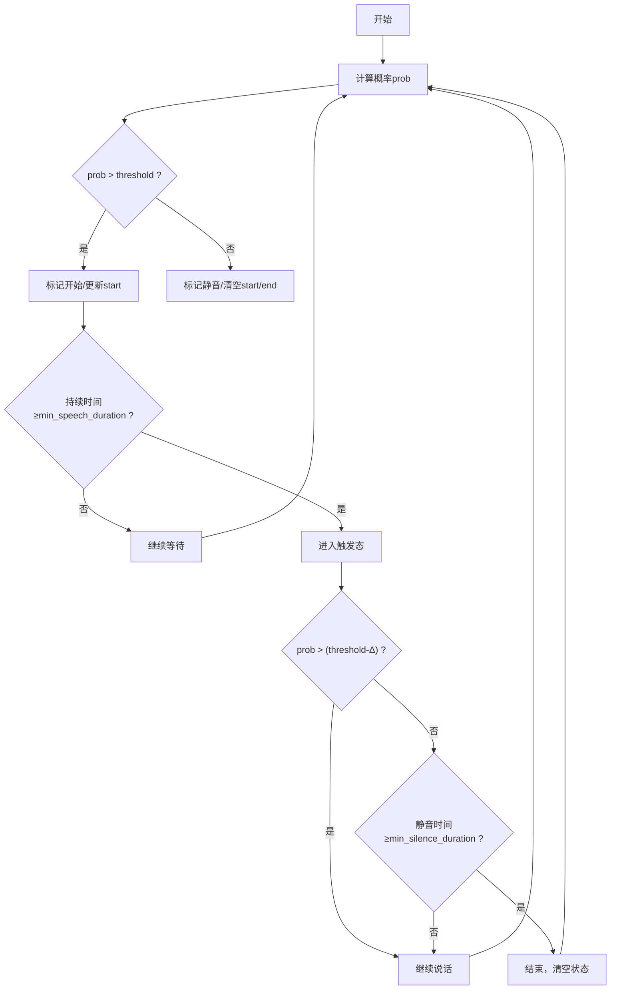
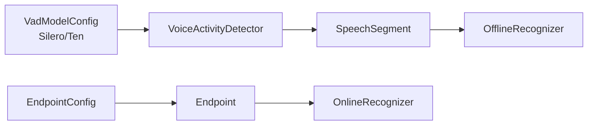

# VAD应用

<cite>
**本文引用的文件**
- [vad-microphone.py](file://python-api-examples/vad-microphone.py)
- [vad-with-non-streaming-asr.py](file://python-api-examples/vad-with-non-streaming-asr.py)
- [vad-remove-non-speech-segments.py](file://python-api-examples/vad-remove-non-speech-segments.py)
- [vad-remove-non-speech-segments-from-file.py](file://python-api-examples/vad-remove-non-speech-segments-from-file.py)
- [voice-activity-detector.h](file://sherpa-onnx/csrc/voice-activity-detector.h)
- [voice-activity-detector.cc](file://sherpa-onnx/csrc/voice-activity-detector.cc)
- [silero-vad-model.cc](file://sherpa-onnx/csrc/silero-vad-model.cc)
- [silero-vad-model-config.cc](file://sherpa-onnx/csrc/silero-vad-model-config.cc)
- [ten-vad-model-config.cc](file://sherpa-onnx/csrc/ten-vad-model-config.cc)
- [endpoint.h](file://sherpa-onnx/csrc/endpoint.h)
- [endpoint.cc](file://sherpa-onnx/csrc/endpoint.cc)
- [speech-recognition-from-microphone-with-endpoint-detection.py](file://python-api-examples/speech-recognition-from-microphone-with-endpoint-detection.py)
- [vad-cxx-api.cc](file://cxx-api-examples/vad-cxx-api.cc)
- [VadFromMicWithNonStreamingSenseVoice.java](file://java-api-examples/VadFromMicWithNonStreamingSenseVoice.java)
- [VadFromMicWithNonStreamingParaformer.java](file://java-api-examples/VadFromMicWithNonStreamingParaformer.java)
- [VadFromMicWithNonStreamingWhisper.java](file://java-api-examples/VadFromMicWithNonStreamingWhisper.java)
</cite>

## 目录
1. [引言](#引言)
2. [项目结构](#项目结构)
3. [核心组件](#核心组件)
4. [架构总览](#架构总览)
5. [详细组件分析](#详细组件分析)
6. [依赖关系分析](#依赖关系分析)
7. [性能考量](#性能考量)
8. [故障排查指南](#故障排查指南)
9. [结论](#结论)
10. [附录](#附录)

## 引言
本文件围绕语音活动检测（VAD）在sherpa-onnx中的实际应用展开，重点覆盖以下场景：
- 端点检测：基于VAD的自动起止检测，用于非流式ASR的触发与截断。
- 静音段移除：从实时或离线音频中提取并合并语音片段，去除静音段。
- 与ASR系统集成：以VAD为前端，驱动非流式ASR进行逐段识别，或与在线ASR的端点规则协同工作。

本文将以vad-microphone.py与vad-with-non-streaming-asr.py两个示例为主线，解释实时音频流处理的工作流程，并给出不同应用场景的配置建议与性能优化思路。

## 项目结构
与VAD及ASR集成直接相关的文件主要分布在如下位置：
- Python示例：python-api-examples目录下包含多个VAD与ASR结合的脚本。
- 核心实现：sherpa-onnx/csrc目录下包含VAD模型、端点检测、语音活动检测器等C++实现。
- 其他语言绑定：Java、C++、Flutter、Node.js等平台的VAD接口封装。



图表来源
- [vad-microphone.py](file://python-api-examples/vad-microphone.py#L1-L126)
- [vad-with-non-streaming-asr.py](file://python-api-examples/vad-with-non-streaming-asr.py#L1-L496)
- [vad-remove-non-speech-segments.py](file://python-api-examples/vad-remove-non-speech-segments.py#L1-L132)
- [vad-remove-non-speech-segments-from-file.py](file://python-api-examples/vad-remove-non-speech-segments-from-file.py#L1-L131)
- [voice-activity-detector.h](file://sherpa-onnx/csrc/voice-activity-detector.h#L1-L63)
- [voice-activity-detector.cc](file://sherpa-onnx/csrc/voice-activity-detector.cc#L1-L231)
- [silero-vad-model.cc](file://sherpa-onnx/csrc/silero-vad-model.cc#L101-L157)
- [silero-vad-model-config.cc](file://sherpa-onnx/csrc/silero-vad-model-config.cc#L33-L125)
- [ten-vad-model-config.cc](file://sherpa-onnx/csrc/ten-vad-model-config.cc#L32-L113)
- [endpoint.h](file://sherpa-onnx/csrc/endpoint.h#L34-L76)
- [endpoint.cc](file://sherpa-onnx/csrc/endpoint.cc#L1-L96)
- [vad-cxx-api.cc](file://cxx-api-examples/vad-cxx-api.cc#L49-L122)
- [VadFromMicWithNonStreamingSenseVoice.java](file://java-api-examples/VadFromMicWithNonStreamingSenseVoice.java#L45-L71)
- [VadFromMicWithNonStreamingParaformer.java](file://java-api-examples/VadFromMicWithNonStreamingParaformer.java#L35-L71)
- [VadFromMicWithNonStreamingWhisper.java](file://java-api-examples/VadFromMicWithNonStreamingWhisper.java#L35-L72)

章节来源
- [vad-microphone.py](file://python-api-examples/vad-microphone.py#L1-L126)
- [vad-with-non-streaming-asr.py](file://python-api-examples/vad-with-non-streaming-asr.py#L1-L496)
- [voice-activity-detector.h](file://sherpa-onnx/csrc/voice-activity-detector.h#L1-L63)
- [voice-activity-detector.cc](file://sherpa-onnx/csrc/voice-activity-detector.cc#L1-L231)

## 核心组件
- VoiceActivityDetector（VAD检测器）
  - 负责接收音频分块，判断是否处于语音活动状态，并缓存检测到的语音片段。
  - 提供accept_waveform、is_speech_detected、empty、front、pop、flush等接口。
- SileroVadModel/TenVadModel（VAD模型）
  - 基于阈值与最小/最大持续时间规则，实现语音开始与结束的判定。
- Endpoint（端点检测）
  - 在在线ASR中用于自动终止解码，避免无限等待。
- OfflineRecognizer/OnlineRecognizer（ASR识别器）
  - 非流式ASR：逐段输入语音片段，逐段输出文本。
  - 在线ASR：启用端点规则，自动根据静音时长与最小语句长度终止解码。

章节来源
- [voice-activity-detector.h](file://sherpa-onnx/csrc/voice-activity-detector.h#L1-L63)
- [voice-activity-detector.cc](file://sherpa-onnx/csrc/voice-activity-detector.cc#L1-L231)
- [silero-vad-model.cc](file://sherpa-onnx/csrc/silero-vad-model.cc#L101-L157)
- [silero-vad-model-config.cc](file://sherpa-onnx/csrc/silero-vad-model-config.cc#L33-L125)
- [ten-vad-model-config.cc](file://sherpa-onnx/csrc/ten-vad-model-config.cc#L32-L113)
- [endpoint.h](file://sherpa-onnx/csrc/endpoint.h#L34-L76)
- [endpoint.cc](file://sherpa-onnx/csrc/endpoint.cc#L1-L96)

## 架构总览
下图展示了从麦克风采集到VAD检测再到ASR识别的整体流程，以及静音段移除的离线流程。



图表来源
- [vad-with-non-streaming-asr.py](file://python-api-examples/vad-with-non-streaming-asr.py#L461-L490)
- [voice-activity-detector.h](file://sherpa-onnx/csrc/voice-activity-detector.h#L30-L52)

## 详细组件分析

### 实时端点检测与ASR集成（vad-with-non-streaming-asr.py）
该示例展示了如何使用VAD作为触发器，驱动非流式ASR进行逐段识别：
- 配置VAD参数（阈值、最小静音/语音持续时间、窗口大小等），创建VoiceActivityDetector。
- 以固定时间片读取音频，将样本拼接后按window_size喂给VAD。
- 当VAD队列非空时，取出首个语音片段，创建ASR流，输入该片段并解码，输出文本。
- 支持多种非流式模型（Transducer、Paraformer、SenseVoice、Whisper、Moonshine等）。

```mermaid
sequenceDiagram
participant SD as "音频读取"
participant VAD as "VoiceActivityDetector"
participant R as "OfflineRecognizer"
participant ST as "OfflineStream"
SD->>VAD : accept_waveform(buffer[ : window_size])
loop 直到buffer耗尽
SD->>VAD : accept_waveform(buffer[ : window_size])
buffer : =buffer[window_size : ]
end
alt VAD非空
VAD-->>VAD : front.samples
VAD->>R : create_stream()
R->>ST : accept_waveform(sample_rate, samples)
R->>R : decode_stream(ST)
R-->>SD : 文本结果
VAD->>VAD : pop()
end
```

图表来源
- [vad-with-non-streaming-asr.py](file://python-api-examples/vad-with-non-streaming-asr.py#L461-L490)
- [voice-activity-detector.h](file://sherpa-onnx/csrc/voice-activity-detector.h#L30-L52)

章节来源
- [vad-with-non-streaming-asr.py](file://python-api-examples/vad-with-non-streaming-asr.py#L424-L496)
- [voice-activity-detector.h](file://sherpa-onnx/csrc/voice-activity-detector.h#L30-L52)

### 静音段移除与合并（vad-remove-non-speech-segments.py / from-file.py）
该示例演示了如何移除非语音段并将所有语音片段合并保存：
- 使用VAD对连续音频进行扫描，将检测到的语音片段依次出队并拼接。
- 支持实时麦克风输入与离线文件两种模式；离线版本支持重采样至16kHz。
- 最终输出仅含语音的音频文件与完整录音文件，便于后续处理。



图表来源
- [vad-remove-non-speech-segments.py](file://python-api-examples/vad-remove-non-speech-segments.py#L95-L129)
- [vad-remove-non-speech-segments-from-file.py](file://python-api-examples/vad-remove-non-speech-segments-from-file.py#L107-L127)

章节来源
- [vad-remove-non-speech-segments.py](file://python-api-examples/vad-remove-non-speech-segments.py#L65-L132)
- [vad-remove-non-speech-segments-from-file.py](file://python-api-examples/vad-remove-non-speech-segments-from-file.py#L78-L131)

### 实时语音检测（vad-microphone.py）
该示例展示了最简化的VAD检测流程：
- 读取麦克风音频，按固定时间片喂给VAD。
- 当检测到语音时打印提示，随后将VAD队列中的语音片段逐一写出为wav文件。



图表来源
- [vad-microphone.py](file://python-api-examples/vad-microphone.py#L86-L120)
- [voice-activity-detector.h](file://sherpa-onnx/csrc/voice-activity-detector.h#L30-L52)

章节来源
- [vad-microphone.py](file://python-api-examples/vad-microphone.py#L36-L126)

### 端点检测（在线ASR）
当使用在线ASR时，可通过端点规则自动终止解码，避免无限等待：
- EndpointConfig包含三条规则：无静音超时、有静音超时、最小语句长度。
- Endpoint::IsEndpoint根据尾部静音时长与总时长判断是否到达端点。



图表来源
- [endpoint.h](file://sherpa-onnx/csrc/endpoint.h#L34-L76)
- [endpoint.cc](file://sherpa-onnx/csrc/endpoint.cc#L76-L96)

章节来源
- [speech-recognition-from-microphone-with-endpoint-detection.py](file://python-api-examples/speech-recognition-from-microphone-with-endpoint-detection.py#L134-L163)
- [endpoint.h](file://sherpa-onnx/csrc/endpoint.h#L34-L76)
- [endpoint.cc](file://sherpa-onnx/csrc/endpoint.cc#L1-L96)

### VAD内部算法与关键参数
- SileroVAD模型采用阈值与最小/最大持续时间策略：
  - 语音开始：概率大于阈值且持续时间超过最小语音时长。
  - 语音结束：概率低于阈值且静音时长超过最小静音时长。
  - 最大语音时长：超过阈值时提升阈值，防止误判长语音。
- 关键参数（节选）：
  - threshold：判断阈值
  - min_silence_duration：最小静音持续时间
  - min_speech_duration：最小语音持续时间
  - max_speech_duration：最大语音持续时间
  - window_size：窗口大小（以采样点计）



图表来源
- [silero-vad-model.cc](file://sherpa-onnx/csrc/silero-vad-model.cc#L101-L157)
- [silero-vad-model-config.cc](file://sherpa-onnx/csrc/silero-vad-model-config.cc#L33-L125)
- [ten-vad-model-config.cc](file://sherpa-onnx/csrc/ten-vad-model-config.cc#L32-L113)

章节来源
- [silero-vad-model.cc](file://sherpa-onnx/csrc/silero-vad-model.cc#L101-L157)
- [silero-vad-model-config.cc](file://sherpa-onnx/csrc/silero-vad-model-config.cc#L33-L125)
- [ten-vad-model-config.cc](file://sherpa-onnx/csrc/ten-vad-model-config.cc#L32-L113)

## 依赖关系分析
- VAD检测器依赖VAD模型配置（Silero/Ten），并通过CircularBuffer缓存最近N秒的音频，以便在语音开始前也能正确识别。
- VAD检测器与ASR识别器之间通过SpeechSegment进行解耦：VAD负责产出片段，ASR负责识别。
- 在线ASR的端点检测与VAD的触发可以并行存在：VAD用于逐段触发，端点检测用于在线解码的自动终止。



图表来源
- [voice-activity-detector.h](file://sherpa-onnx/csrc/voice-activity-detector.h#L1-L63)
- [voice-activity-detector.cc](file://sherpa-onnx/csrc/voice-activity-detector.cc#L1-L231)
- [endpoint.h](file://sherpa-onnx/csrc/endpoint.h#L34-L76)
- [endpoint.cc](file://sherpa-onnx/csrc/endpoint.cc#L1-L96)

章节来源
- [voice-activity-detector.h](file://sherpa-onnx/csrc/voice-activity-detector.h#L1-L63)
- [voice-activity-detector.cc](file://sherpa-onnx/csrc/voice-activity-detector.cc#L1-L231)
- [endpoint.h](file://sherpa-onnx/csrc/endpoint.h#L34-L76)
- [endpoint.cc](file://sherpa-onnx/csrc/endpoint.cc#L1-L96)

## 性能考量
- 窗口大小与延迟
  - window_size越小，响应越快但误判可能增加；越大则更稳健但延迟更高。
  - 建议在16kHz采样率下优先使用512/1024/1536等常见值，以匹配模型训练设置。
- 阈值与持续时间
  - threshold过高会漏检语音，过低会误检噪声；min_silence_duration/min_speech_duration需结合场景调优。
  - 对长语音场景，max_speech_duration可提升阈值以减少误判。
- 缓冲区大小
  - buffer_size_in_seconds决定VAD可回溯的时间范围，影响语音起始检测的准确性。
- 多语言/多模型
  - 不同模型（Paraformer、SenseVoice、Whisper、Moonshine）在相同VAD配置下表现不同，建议针对目标语言与口音微调阈值与持续时间。
- 线程与设备
  - num_threads影响ASR推理速度；设备选择影响音频采集稳定性。

章节来源
- [silero-vad-model-config.cc](file://sherpa-onnx/csrc/silero-vad-model-config.cc#L33-L125)
- [ten-vad-model-config.cc](file://sherpa-onnx/csrc/ten-vad-model-config.cc#L32-L113)
- [vad-with-non-streaming-asr.py](file://python-api-examples/vad-with-non-streaming-asr.py#L449-L460)

## 故障排查指南
- 设备不可用
  - 若未检测到麦克风设备，示例会提示并建议使用ALSA或检查设备索引。
- 模型路径错误
  - 示例会在缺少必需模型文件时抛出断言错误，请确认路径与文件名正确。
- 采样率不匹配
  - 在线ASR示例明确要求16kHz；离线示例会进行重采样，但请确保输入音频格式正确。
- VAD参数不当
  - 阈值过低导致误检，过高导致漏检；最小/最大持续时间设置不合理会影响起止检测精度。
- 端点规则冲突
  - 在线ASR的端点规则与VAD触发可能同时生效，需根据场景权衡：若希望更早结束，可降低min_trailing_silence；若希望更稳，可提高。

章节来源
- [vad-microphone.py](file://python-api-examples/vad-microphone.py#L61-L80)
- [vad-with-non-streaming-asr.py](file://python-api-examples/vad-with-non-streaming-asr.py#L440-L448)
- [speech-recognition-from-microphone-with-endpoint-detection.py](file://python-api-examples/speech-recognition-from-microphone-with-endpoint-detection.py#L165-L178)

## 结论
- VAD在sherpa-onnx中提供了灵活而高效的语音活动检测能力，既可用于实时端点检测，也可用于离线静音段移除。
- 通过与非流式ASR的结合，VAD实现了“开始/结束检测”，显著简化了语音识别的触发逻辑。
- 在线ASR的端点检测可与VAD互补，进一步提升系统的鲁棒性与用户体验。
- 合理配置VAD参数（阈值、最小/最大持续时间、窗口大小）与ASR线程数、设备选择，是获得良好性能的关键。

## 附录

### 应用场景配置建议
- 会议记录
  - 目标：多人轮流发言，需要稳定区分说话人与静音。
  - 建议：较小min_speech_duration（约0.25~0.5s），适中min_silence_duration（约0.25~0.5s），合理max_speech_duration（约5~10s），窗口大小使用512或1024。
- 语音助手
  - 目标：快速响应与低误检。
  - 建议：稍高threshold（如0.4~0.5），较短min_speech_duration（约0.25s），min_silence_duration约0.25s，窗口大小使用512。
- 电话系统
  - 目标：长语音与背景噪声较多。
  - 建议：较高threshold（如0.5~0.6），较长min_speech_duration（约0.5~1.0s），max_speech_duration约5~10s，窗口大小使用1024。

章节来源
- [silero-vad-model-config.cc](file://sherpa-onnx/csrc/silero-vad-model-config.cc#L33-L125)
- [ten-vad-model-config.cc](file://sherpa-onnx/csrc/ten-vad-model-config.cc#L32-L113)
- [vad-with-non-streaming-asr.py](file://python-api-examples/vad-with-non-streaming-asr.py#L452-L459)

### 与其他语言绑定的集成要点
- Java示例展示了VAD与多种非流式模型（SenseVoice、Paraformer、Whisper）的结合方式，适合Android/iOS等平台集成。
- C++示例展示了VAD在离线文件处理中的典型用法，适合嵌入式或桌面应用。

章节来源
- [VadFromMicWithNonStreamingSenseVoice.java](file://java-api-examples/VadFromMicWithNonStreamingSenseVoice.java#L45-L71)
- [VadFromMicWithNonStreamingParaformer.java](file://java-api-examples/VadFromMicWithNonStreamingParaformer.java#L35-L71)
- [VadFromMicWithNonStreamingWhisper.java](file://java-api-examples/VadFromMicWithNonStreamingWhisper.java#L35-L72)
- [vad-cxx-api.cc](file://cxx-api-examples/vad-cxx-api.cc#L49-L122)