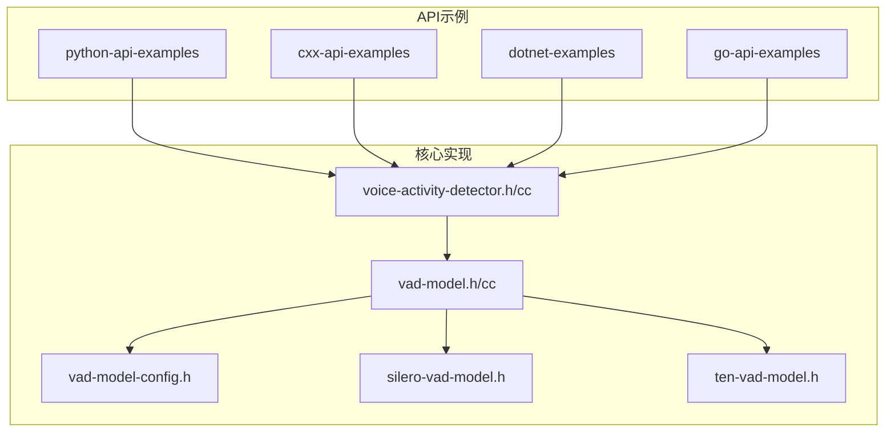
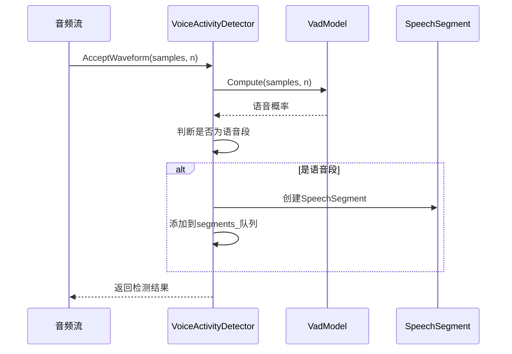
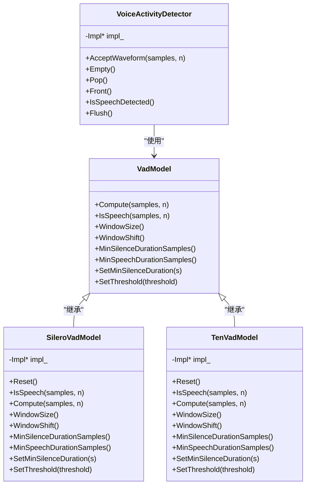
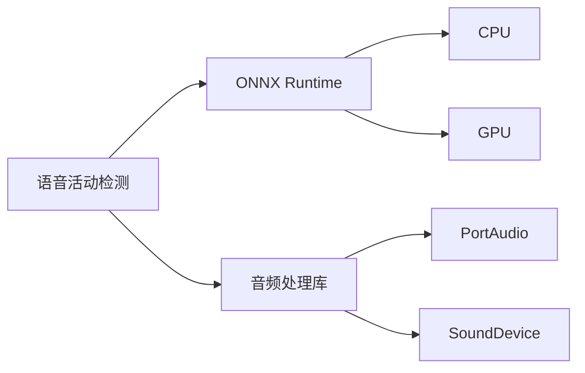

# 语音活动检测

<cite>
**本文档中引用的文件**  
- [voice-activity-detector.h](file://sherpa-onnx/csrc/voice-activity-detector.h)
- [voice-activity-detector.cc](file://sherpa-onnx/csrc/voice-activity-detector.cc)
- [vad-model-config.h](file://sherpa-onnx/csrc/vad-model-config.h)
- [vad-model.h](file://sherpa-onnx/csrc/vad-model.h)
- [vad-model.cc](file://sherpa-onnx/csrc/vad-model.cc)
- [silero-vad-model.h](file://sherpa-onnx/csrc/silero-vad-model.h)
- [ten-vad-model.h](file://sherpa-onnx/csrc/ten-vad-model.h)
- [vad-cxx-api.cc](file://cxx-api-examples/vad-cxx-api.cc)
- [vad-microphone.py](file://python-api-examples/vad-microphone.py)
- [vad-remove-non-speech-segments.py](file://python-api-examples/vad-remove-non-speech-segments.py)
- [vad-with-non-streaming-asr.py](file://python-api-examples/vad-with-non-streaming-asr.py)
- [Program.cs](file://dotnet-examples/vad-non-streaming-asr-paraformer/Program.cs)
- [main.go](file://go-api-examples/vad/main.go)
- [NonStreamingAsrWithVadWorker.ets](file://harmony-os/SherpaOnnxVadAsr/entry/src/main/ets/workers/NonStreamingAsrWithVadWorker.ets)
</cite>

## 目录
1. [简介](#简介)
2. [项目结构](#项目结构)
3. [核心组件](#核心组件)
4. [架构概述](#架构概述)
5. [详细组件分析](#详细组件分析)
6. [依赖分析](#依赖分析)
7. [性能考虑](#性能考虑)
8. [故障排除指南](#故障排除指南)
9. [结论](#结论)

## 简介
sherpa-onnx是一个开源的语音识别工具包，提供了语音活动检测（Voice Activity Detection, VAD）功能，用于检测音频流中的语音活动。该功能基于Silero VAD和Ten VAD等深度学习模型实现，能够准确地识别语音和非语音段，支持实时检测和静音段移除。本文档详细介绍了语音活动检测器的架构设计、灵敏度调节、噪声鲁棒性以及与自动语音识别（ASR）系统的集成方法。

## 项目结构
sherpa-onnx项目的语音活动检测功能主要分布在`sherpa-onnx/csrc`目录下，包括核心的C++实现和相关的头文件。此外，项目还提供了多种语言的API示例，如Python、C++、C#、Go等，方便开发者在不同平台上使用VAD功能。



**Diagram sources**
- [voice-activity-detector.h](file://sherpa-onnx/csrc/voice-activity-detector.h)
- [vad-model.h](file://sherpa-onnx/csrc/vad-model.h)
- [vad-model-config.h](file://sherpa-onnx/csrc/vad-model-config.h)
- [silero-vad-model.h](file://sherpa-onnx/csrc/silero-vad-model.h)
- [ten-vad-model.h](file://sherpa-onnx/csrc/ten-vad-model.h)

**Section sources**
- [voice-activity-detector.h](file://sherpa-onnx/csrc/voice-activity-detector.h)
- [vad-model.h](file://sherpa-onnx/csrc/vad-model.h)
- [vad-model-config.h](file://sherpa-onnx/csrc/vad-model-config.h)

## 核心组件
语音活动检测功能的核心组件包括`VoiceActivityDetector`类、`VadModel`抽象基类以及具体的模型实现`SileroVadModel`和`TenVadModel`。`VoiceActivityDetector`负责管理音频流的处理和语音段的检测，`VadModel`定义了VAD模型的通用接口，而`SileroVadModel`和`TenVadModel`则分别实现了基于Silero VAD和Ten VAD模型的具体逻辑。

**Section sources**
- [voice-activity-detector.h](file://sherpa-onnx/csrc/voice-activity-detector.h)
- [vad-model.h](file://sherpa-onnx/csrc/vad-model.h)
- [silero-vad-model.h](file://sherpa-onnx/csrc/silero-vad-model.h)
- [ten-vad-model.h](file://sherpa-onnx/csrc/ten-vad-model.h)

## 架构概述
语音活动检测器的架构设计遵循模块化原则，将音频处理、模型推理和结果管理分离。`VoiceActivityDetector`类通过`VadModel`接口与具体的VAD模型交互，实现了对不同模型的统一管理。音频流被分割成固定大小的帧，每帧通过`AcceptWaveform`方法送入检测器，模型根据配置的阈值和持续时间参数判断是否为语音段。



**Diagram sources**
- [voice-activity-detector.cc](file://sherpa-onnx/csrc/voice-activity-detector.cc)
- [vad-model.cc](file://sherpa-onnx/csrc/vad-model.cc)

## 详细组件分析

### 语音活动检测器分析
`VoiceActivityDetector`类是语音活动检测的核心，负责管理音频流的处理和语音段的检测。它通过`AcceptWaveform`方法接收音频帧，调用`VadModel`的`Compute`方法计算语音概率，并根据配置的阈值和持续时间参数判断是否为语音段。检测到的语音段被存储在`segments_`队列中，可以通过`Front`和`Pop`方法访问。

#### 对象导向组件：


**Diagram sources**
- [voice-activity-detector.h](file://sherpa-onnx/csrc/voice-activity-detector.h)
- [vad-model.h](file://sherpa-onnx/csrc/vad-model.h)
- [silero-vad-model.h](file://sherpa-onnx/csrc/silero-vad-model.h)
- [ten-vad-model.h](file://sherpa-onnx/csrc/ten-vad-model.h)

### 配置参数说明
语音活动检测器的配置参数通过`VadModelConfig`结构体定义，包括模型路径、采样率、线程数、提供者（如CPU或GPU）以及调试模式等。对于Silero VAD和Ten VAD模型，还分别定义了`SileroVadModelConfig`和`TenVadModelConfig`，包含阈值、最小静音持续时间、最小语音持续时间、窗口大小和最大语音持续时间等参数。

**Section sources**
- [vad-model-config.h](file://sherpa-onnx/csrc/vad-model-config.h)
- [silero-vad-model-config.h](file://sherpa-onnx/csrc/silero-vad-model-config.h)
- [ten-vad-model-config.h](file://sherpa-onnx/csrc/ten-vad-model-config.h)

### 静音段移除和实时检测
语音活动检测器支持静音段移除和实时检测。通过`AcceptWaveform`方法接收音频帧，检测器会自动识别语音段并将其存储在内部队列中。当检测到语音段结束时，可以通过`Front`和`Pop`方法获取语音段数据，并进行后续处理。`Flush`方法用于在音频流结束时强制检测最后一个语音段。

**Section sources**
- [voice-activity-detector.cc](file://sherpa-onnx/csrc/voice-activity-detector.cc)
- [vad-cxx-api.cc](file://cxx-api-examples/vad-cxx-api.cc)

### 与ASR结合使用
语音活动检测器可以与自动语音识别（ASR）系统结合使用，实现端点检测和自动语音识别的集成。通过将检测到的语音段送入ASR系统，可以提高识别的准确性和效率。以下是一个Python示例，展示了如何将VAD与非流式ASR结合使用：

```python
import sherpa_onnx

# 创建VAD配置
vad_config = sherpa_onnx.VadModelConfig()
vad_config.silero_vad.model = "silero_vad.onnx"
vad_config.sample_rate = 16000

# 创建VAD检测器
vad = sherpa_onnx.VoiceActivityDetector(vad_config, buffer_size_in_seconds=30)

# 创建ASR配置和识别器
asr_config = sherpa_onnx.OfflineRecognizerConfig()
asr_config.model = "paraformer.onnx"
recognizer = sherpa_onnx.OfflineRecognizer(asr_config)

# 处理音频流
while True:
    samples = get_audio_samples()  # 获取音频样本
    vad.accept_waveform(samples)
    
    while not vad.empty():
        segment = vad.front()
        vad.pop()
        
        # 创建ASR流并解码
        stream = recognizer.create_stream()
        stream.accept_waveform(16000, segment.samples)
        recognizer.decode(stream)
        result = recognizer.get_result(stream)
        
        if result.text:
            print(f"识别结果: {result.text}")
```

**Section sources**
- [vad-with-non-streaming-asr.py](file://python-api-examples/vad-with-non-streaming-asr.py)
- [NonStreamingAsrWithVadWorker.ets](file://harmony-os/SherpaOnnxVadAsr/entry/src/main/ets/workers/NonStreamingAsrWithVadWorker.ets)

## 依赖分析
语音活动检测功能依赖于ONNX Runtime进行模型推理，支持多种硬件平台和加速器。项目通过`onnxruntime.cmake`配置文件管理ONNX Runtime的依赖关系，确保在不同平台上能够正确编译和运行。此外，VAD功能还依赖于音频处理库，如PortAudio和SoundDevice，用于音频流的采集和播放。



**Diagram sources**
- [onnxruntime.cmake](file://cmake/onnxruntime.cmake)
- [portaudio.cmake](file://cmake/portaudio.cmake)
- [websocketpp.cmake](file://cmake/websocketpp.cmake)

**Section sources**
- [onnxruntime.cmake](file://cmake/onnxruntime.cmake)
- [portaudio.cmake](file://cmake/portaudio.cmake)

## 性能考虑
语音活动检测器的性能受多种因素影响，包括模型复杂度、音频采样率、窗口大小和线程数等。为了优化性能，建议使用轻量级模型（如Ten VAD）进行实时检测，并根据实际需求调整配置参数。此外，通过多线程处理和硬件加速（如GPU）可以进一步提高检测速度。

## 故障排除指南
在使用语音活动检测功能时，可能会遇到以下常见问题：
- **模型加载失败**：确保模型文件路径正确，并且文件存在。
- **音频采样率不匹配**：VAD模型通常要求16kHz采样率，需要对输入音频进行重采样。
- **检测结果不准确**：调整阈值和持续时间参数，以适应不同的噪声环境和语音特征。

**Section sources**
- [vad-microphone.py](file://python-api-examples/vad-microphone.py)
- [vad-remove-non-speech-segments.py](file://python-api-examples/vad-remove-non-speech-segments.py)

## 结论
sherpa-onnx的语音活动检测功能提供了一种高效、准确的方法来识别音频流中的语音活动。通过基于Silero VAD和Ten VAD等深度学习模型的实现，该功能能够适应不同的应用场景和硬件平台。结合自动语音识别系统，可以实现端到端的语音处理流程，提高语音识别的准确性和效率。开发者可以根据具体需求，灵活配置和优化VAD参数，以获得最佳的检测效果。