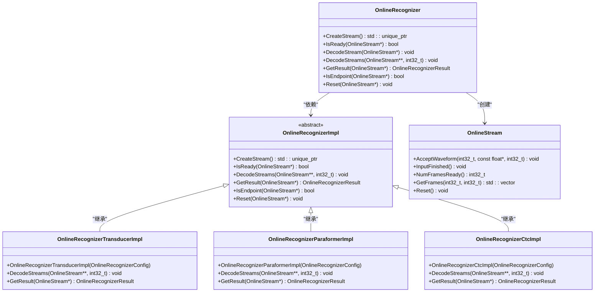
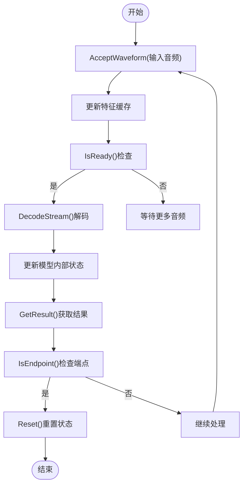
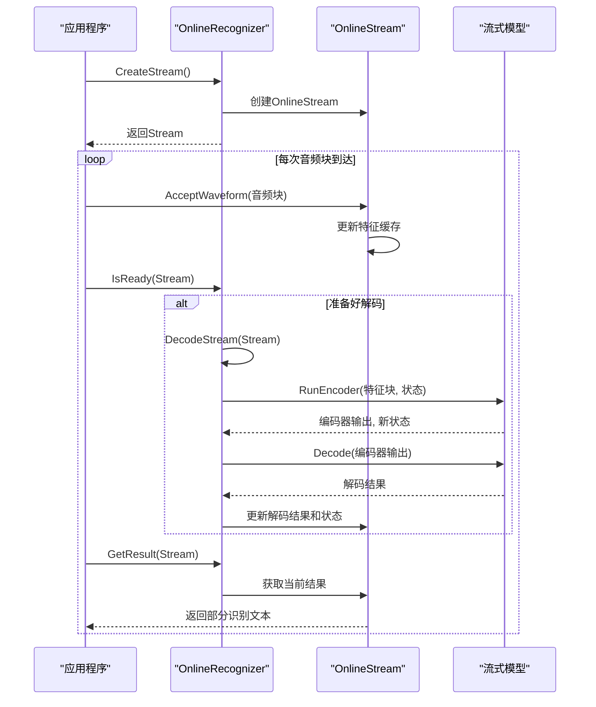
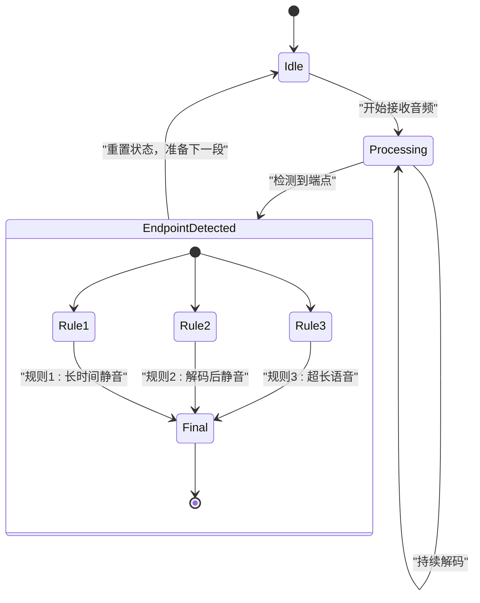
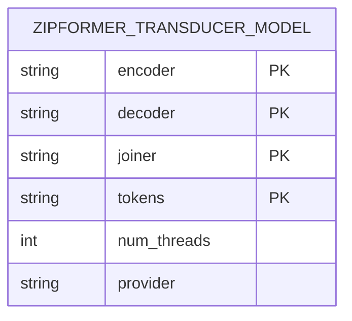
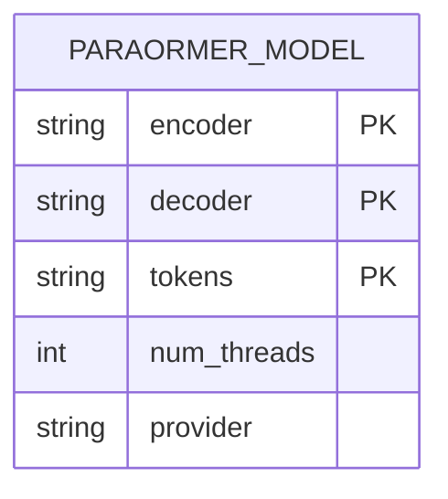
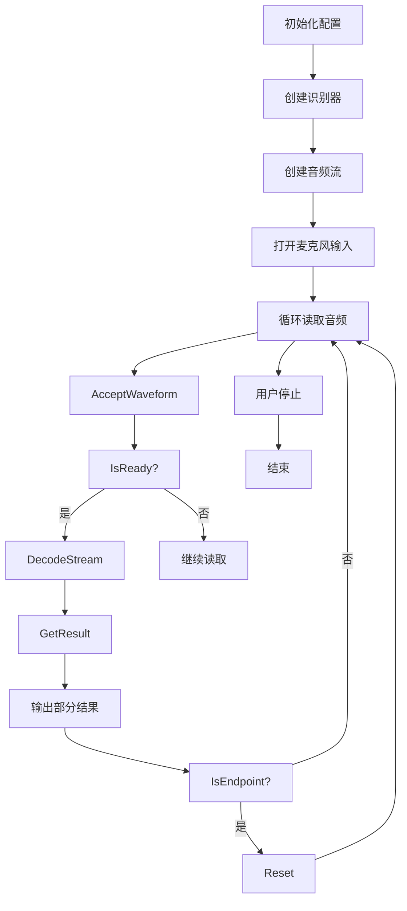
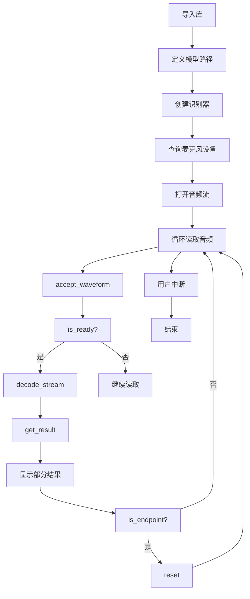
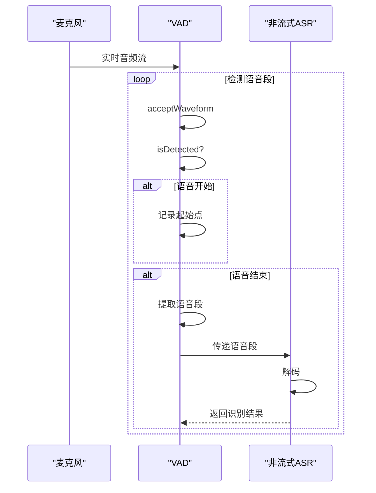
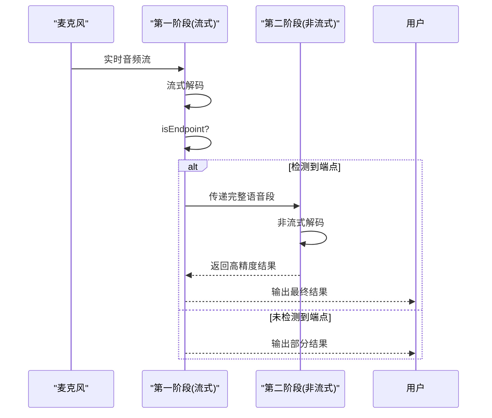

# 流式语音识别

<cite>
**本文档引用的文件**   
- [online-recognizer.h](file://sherpa-onnx/csrc/online-recognizer.h)
- [online-recognizer.cc](file://sherpa-onnx/csrc/online-recognizer.cc)
- [online-recognizer-transducer-impl.h](file://sherpa-onnx/csrc/online-recognizer-transducer-impl.h)
- [online-recognizer-paraformer-impl.h](file://sherpa-onnx/csrc/online-recognizer-paraformer-impl.h)
- [online-recognizer-ctc-impl.h](file://sherpa-onnx/csrc/online-recognizer-ctc-impl.h)
- [online-stream.h](file://sherpa-onnx/csrc/online-stream.h)
- [endpoint.h](file://sherpa-onnx/csrc/endpoint.h)
- [voice-activity-detector.h](file://sherpa-onnx/csrc/voice-activity-detector.h)
- [streaming-zipformer-cxx-api.cc](file://cxx-api-examples/streaming-zipformer-cxx-api.cc)
- [streaming-paraformer-asr-microphone.py](file://python-api-examples/streaming-paraformer-asr-microphone.py)
- [OnlineRecognizer.kt](file://sherpa-onnx/kotlin-api/OnlineRecognizer.kt)
- [online_recognizer.dart](file://flutter/sherpa_onnx/lib/src/online_recognizer.dart)
</cite>

## 目录
1. [引言](#引言)
2. [核心架构设计](#核心架构设计)
3. [流式模型支持](#流式模型支持)
4. [实时麦克风识别示例](#实时麦克风识别示例)
5. [性能特性与优化](#性能特性与优化)
6. [高级用例：VAD结合使用](#高级用例：vad结合使用)
7. [性能调优建议](#性能调优建议)
8. [结论](#结论)

## 引言
sherpa-onnx是一个高性能的语音识别框架，专注于提供低延迟、高准确率的流式语音识别能力。本文档深入解析其流式语音识别的核心组件OnlineRecognizer类，涵盖其架构设计、支持的流式模型、实时性保障机制以及与VAD（语音活动检测）的高级集成。通过详细的代码示例和性能分析，为开发者提供全面的技术指导。

## 核心架构设计

### OnlineRecognizer类架构
OnlineRecognizer类是sherpa-onnx流式语音识别的核心，采用面向对象的设计模式，通过抽象接口和具体实现分离，支持多种流式模型。其核心设计包括状态管理、增量解码和实时性保障。

**图表来源**
- [online-recognizer.h](file://sherpa-onnx/csrc/online-recognizer.h#L161-L225)
- [online-recognizer-transducer-impl.h](file://sherpa-onnx/csrc/online-recognizer-transducer-impl.h#L86-L354)
- [online-recognizer-paraformer-impl.h](file://sherpa-onnx/csrc/online-recognizer-paraformer-impl.h#L96-L121)
- [online-recognizer-ctc-impl.h](file://sherpa-onnx/csrc/online-recognizer-ctc-impl.h)

### 流式处理状态管理
流式处理的核心在于状态管理。OnlineStream类负责维护音频流的处理状态，包括已处理的帧数、特征缓存和模型内部状态。OnlineRecognizer通过IsReady()方法判断流是否准备好进行解码，确保每次解码都有足够的音频帧。

**图表来源**
- [online-stream.h](file://sherpa-onnx/csrc/online-stream.h#L22-L117)
- [online-recognizer.h](file://sherpa-onnx/csrc/online-recognizer.h#L188-L212)

### 增量解码算法
增量解码是流式识别的关键。OnlineRecognizerImpl的子类（如OnlineRecognizerTransducerImpl）实现了具体的解码算法。解码过程以固定大小的块（chunk）为单位进行，每次处理一个块的音频特征，并更新解码结果。

**图表来源**
- [online-recognizer-transducer-impl.h](file://sherpa-onnx/csrc/online-recognizer-transducer-impl.h#L243-L354)
- [online-recognizer-ctc-impl.h](file://sherpa-onnx/csrc/online-recognizer-ctc-impl.h#L165-L181)

### 实时性保障机制
实时性通过端点检测（Endpoint Detection）机制保障。Endpoint类根据配置的规则判断语音段的结束，触发结果生成和状态重置，确保系统能够及时响应用户输入。

**图表来源**
- [endpoint.h](file://sherpa-onnx/csrc/endpoint.h#L61-L68)
- [online-recognizer.h](file://sherpa-onnx/csrc/online-recognizer.h#L214-L221)

**核心组件来源**
- [online-recognizer.h](file://sherpa-onnx/csrc/online-recognizer.h#L24-L225)
- [online-recognizer.cc](file://sherpa-onnx/csrc/online-recognizer.cc#L227-L261)
- [online-recognizer-transducer-impl.h](file://sherpa-onnx/csrc/online-recognizer-transducer-impl.h#L86-L378)
- [online-recognizer-paraformer-impl.h](file://sherpa-onnx/csrc/online-recognizer-paraformer-impl.h#L96-L121)
- [online-recognizer-ctc-impl.h](file://sherpa-onnx/csrc/online-recognizer-ctc-impl.h#L165-L203)
- [online-stream.h](file://sherpa-onnx/csrc/online-stream.h#L22-L117)

## 流式模型支持

### 支持的流式模型
sherpa-onnx支持多种先进的流式语音识别模型，每种模型都有其独特的架构和配置选项。

#### Zipformer-Transducer模型
Zipformer-Transducer是一种基于Zipformer架构的流式模型，采用Transducer解码方式，具有高准确率和低延迟的特点。

**配置选项**
- **encoder**: 编码器ONNX模型文件路径
- **decoder**: 解码器ONNX模型文件路径
- **joiner**: 连接器ONNX模型文件路径
- **tokens**: 词元文件路径
- **num_threads**: 推理线程数
- **provider**: 推理后端（如cpu、cuda）

#### Paraformer模型
Paraformer是一种非自回归的流式模型，通过预测器（Predictor）和解码器（Decoder）实现并行解码，显著提高推理速度。

**配置选项**
- **encoder**: 编码器ONNX模型文件路径
- **decoder**: 解码器ONNX模型文件路径
- **tokens**: 词元文件路径
- **num_threads**: 推理线程数
- **provider**: 推理后端

**流式模型来源**
- [OnlineRecognizer.kt](file://sherpa-onnx/kotlin-api/OnlineRecognizer.kt#L197-L360)
- [online_recognizer.dart](file://flutter/sherpa_onnx/lib/src/online_recognizer.dart#L147-L172)
- [online-recognizer.h](file://sherpa-onnx/csrc/online-recognizer.h#L83-L118)

## 实时麦克风识别示例

### C++ API 示例
使用C++ API进行实时麦克风识别的完整流程。

**代码路径**
- [streaming-zipformer-cxx-api.cc](file://cxx-api-examples/streaming-zipformer-cxx-api.cc#L22-L93)

### Python API 示例
使用Python API进行实时麦克风识别的完整流程。

**代码路径**
- [streaming-paraformer-asr-microphone.py](file://python-api-examples/streaming-paraformer-asr-microphone.py#L26-L106)

**实时识别示例来源**
- [streaming-zipformer-cxx-api.cc](file://cxx-api-examples/streaming-zipformer-cxx-api.cc#L22-L93)
- [streaming-paraformer-asr-microphone.py](file://python-api-examples/streaming-paraformer-asr-microphone.py#L26-L106)

## 性能特性与优化

### 延迟特性
流式识别的延迟主要由以下几个因素决定：
- **音频块大小 (chunk size)**: 决定每次处理的音频时长，直接影响延迟。
- **帧移 (frame shift)**: 特征提取的步长，通常为10ms。
- **模型推理时间**: ONNX模型在特定硬件上的推理速度。

**实时因子 (RTF)**
实时因子是衡量系统性能的关键指标，计算公式为：
RTF = 处理耗时 / 音频时长
RTF < 1 表示系统能够实时处理。

### 计算资源消耗
计算资源消耗与模型复杂度和硬件平台密切相关。优化策略包括：
- **模型量化**: 使用int8量化模型减少内存占用和计算量。
- **线程优化**: 调整num_threads参数以充分利用多核CPU。
- **推理后端**: 选择合适的推理后端（如CUDA、CoreML）以利用GPU或NPU。

### 网络传输优化
在网络传输场景下，优化策略包括：
- **批量处理 (Batching)**: 将多个音频流合并处理，提高吞吐量。
- **等待时间 (Max Wait Time)**: 设置最大等待时间，平衡延迟和吞吐量。
- **消息大小限制**: 控制WebSocket消息大小，避免网络拥塞。

**性能优化来源**
- [streaming-zipformer-rtf-cxx-api.cc](file://cxx-api-examples/streaming-zipformer-rtf-cxx-api.cc#L83-L119)
- [streaming_server.py](file://python-api-examples/streaming_server.py#L845-L885)

## 高级用例：VAD结合使用

### VAD与非流式ASR结合
VAD（语音活动检测）可用于预处理音频流，检测语音段并将其传递给非流式ASR模型进行识别。

**代码路径**
- [wasm/vad-asr/app-vad-asr.js](file://wasm/vad-asr/app-vad-asr.js#L205-L245)
- [sherpa-onnx-vad-with-online-asr.cc](file://sherpa-onnx/csrc/sherpa-onnx-vad-with-online-asr.cc#L146-L167)

### 两阶段识别
结合流式和非流式ASR，实现低延迟和高准确率的平衡。

**代码路径**
- [two-pass-wss.py](file://python-api-examples/two-pass-wss.py#L679-L729)

**VAD结合使用来源**
- [voice-activity-detector.h](file://sherpa-onnx/csrc/voice-activity-detector.h#L19-L63)
- [wasm/vad-asr/app-vad-asr.js](file://wasm/vad-asr/app-vad-asr.js#L205-L245)
- [sherpa-onnx-vad-with-online-asr.cc](file://sherpa-onnx/csrc/sherpa-onnx-vad-with-online-asr.cc#L146-L167)
- [two-pass-wss.py](file://python-api-examples/two-pass-wss.py#L679-L729)

## 性能调优建议

### 模型选择
- **低延迟要求**: 优先选择Paraformer模型，其非自回归特性提供更快的推理速度。
- **高准确率要求**: 优先选择Zipformer-Transducer模型，其复杂的架构提供更高的识别准确率。

### 参数配置
- **num_threads**: 根据CPU核心数设置，通常设置为物理核心数。
- **max_active_paths**: 仅在modified_beam_search解码方法下有效，增加路径数可提高准确率但增加计算量。
- **endpoint规则**: 根据应用场景调整静音时长阈值，平衡响应速度和误触发。

### 硬件优化
- **GPU加速**: 在支持CUDA的平台上使用GPU后端，显著提升推理速度。
- **模型量化**: 使用int8量化模型，在保持准确率的同时减少资源消耗。

### 网络服务优化
- **批量大小 (max_batch_size)**: 在高并发场景下，适当增加批量大小以提高吞吐量。
- **最大等待时间 (max_wait_ms)**: 平衡延迟和吞吐量，通常设置为10-100ms。

**性能调优来源**
- [streaming_server.py](file://python-api-examples/streaming_server.py#L850-L878)
- [OnlineRecognizer.kt](file://sherpa-onnx/kotlin-api/OnlineRecognizer.kt#L197-L360)

## 结论
sherpa-onnx提供了一套完整且高效的流式语音识别解决方案。其核心的OnlineRecognizer类通过精心设计的架构，实现了对多种流式模型的支持，并通过状态管理、增量解码和端点检测机制保障了实时性。结合VAD的高级用例进一步扩展了其应用场景。通过合理的模型选择和参数调优，可以在不同硬件平台上实现低延迟、高准确率的语音识别服务。