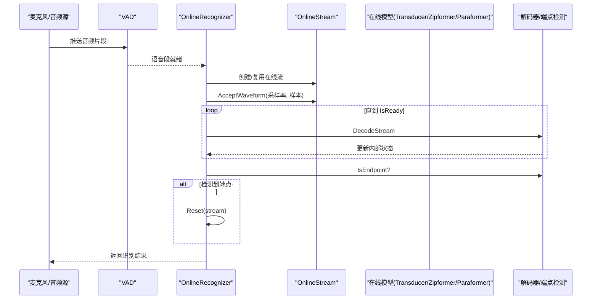
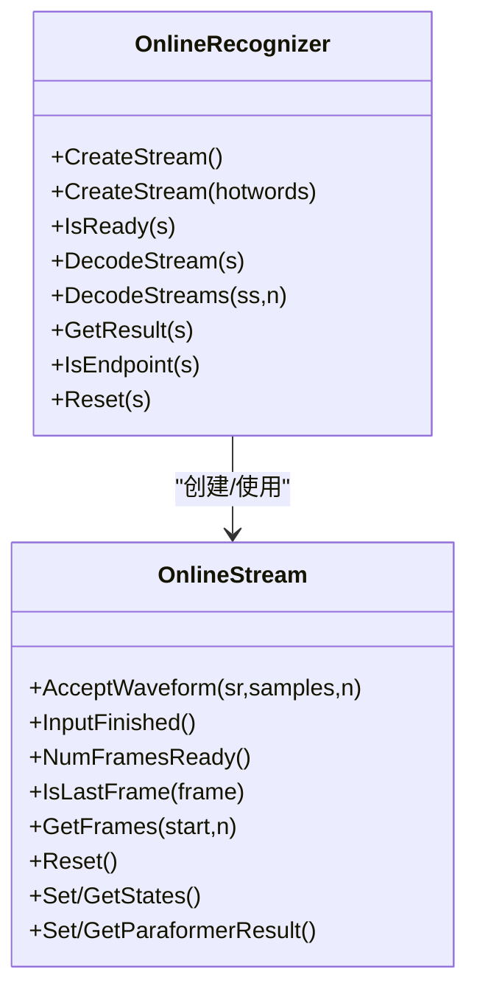
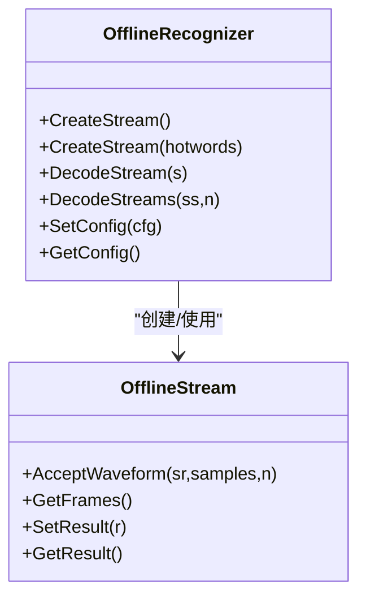
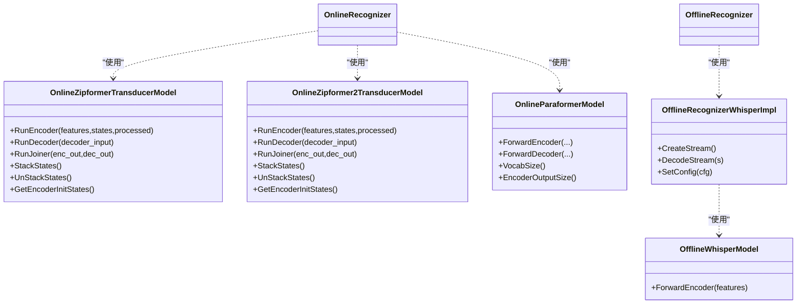
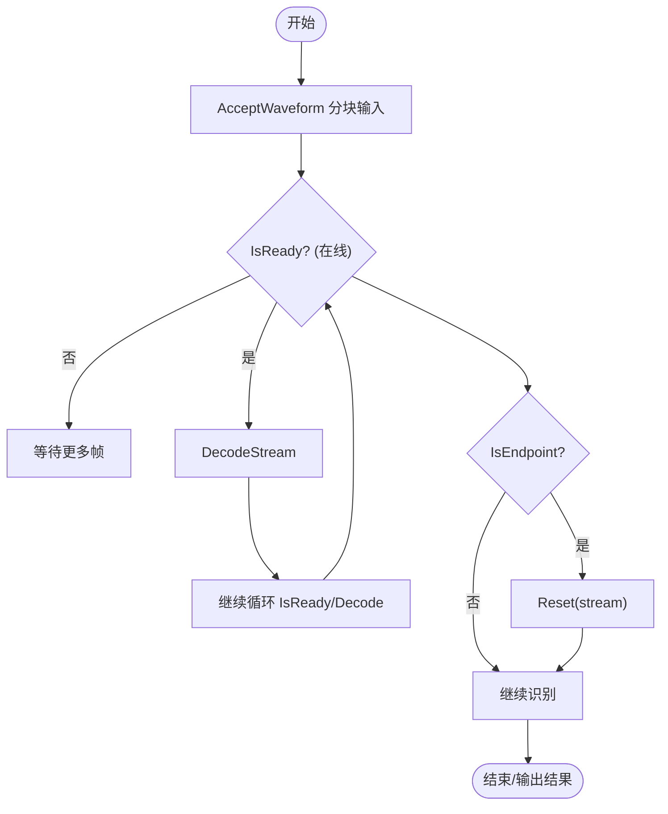
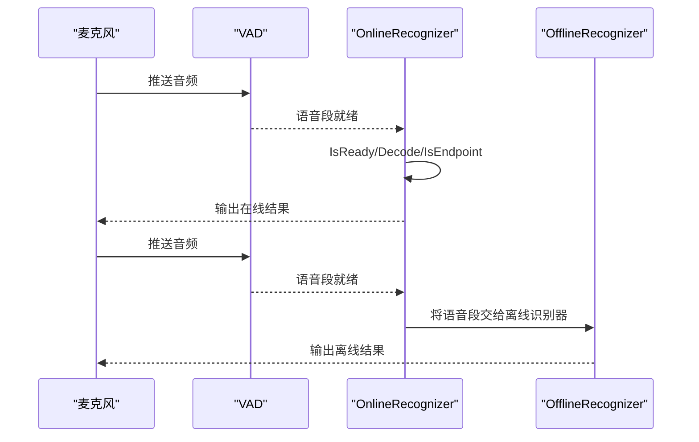
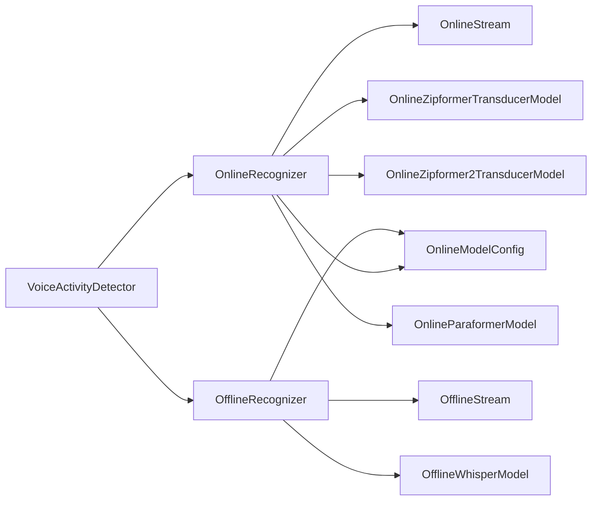

# 语音识别

<cite>
**本文引用的文件列表**
- [sherpa-onnx/csrc/online-recognizer.h](file://sherpa-onnx/csrc/online-recognizer.h)
- [sherpa-onnx/csrc/offline-recognizer.h](file://sherpa-onnx/csrc/offline-recognizer.h)
- [sherpa-onnx/csrc/online-stream.h](file://sherpa-onnx/csrc/online-stream.h)
- [sherpa-onnx/csrc/offline-stream.h](file://sherpa-onnx/csrc/offline-stream.h)
- [sherpa-onnx/csrc/online-model-config.h](file://sherpa-onnx/csrc/online-model-config.h)
- [sherpa-onnx/csrc/offline-model-config.h](file://sherpa-onnx/csrc/offline-model-config.h)
- [sherpa-onnx/csrc/online-recognizer-paraformer-impl.h](file://sherpa-onnx/csrc/online-recognizer-paraformer-impl.h)
- [sherpa-onnx/csrc/online-zipformer-transducer-model.h](file://sherpa-onnx/csrc/online-zipformer-transducer-model.h)
- [sherpa-onnx/csrc/online-zipformer2-transducer-model.h](file://sherpa-onnx/csrc/online-zipformer2-transducer-model.h)
- [sherpa-onnx/csrc/online-paraformer-model.cc](file://sherpa-onnx/csrc/online-paraformer-model.cc)
- [sherpa-onnx/csrc/offline-recognizer-whisper-impl.h](file://sherpa-onnx/csrc/offline-recognizer-whisper-impl.h)
- [sherpa-onnx/csrc/offline-whisper-model.cc](file://sherpa-onnx/csrc/offline-whisper-model.cc)
- [sherpa-onnx/csrc/voice-activity-detector.h](file://sherpa-onnx/csrc/voice-activity-detector.h)
- [sherpa-onnx/csrc/voice-activity-detector.cc](file://sherpa-onnx/csrc/voice-activity-detector.cc)
- [sherpa-onnx/csrc/online-lm-config.h](file://sherpa-onnx/csrc/online-lm-config.h)
- [sherpa-onnx/csrc/online-lm-config.cc](file://sherpa-onnx/csrc/online-lm-config.cc)
- [sherpa-onnx/c-api/cxx-api.cc](file://sherpa-onnx/c-api/cxx-api.cc)
- [sherpa-onnx/c-api/c-api.cc](file://sherpa-onnx/c-api/c-api.cc)
- [python-api-examples/speech-recognition-from-microphone.py](file://python-api-examples/speech-recognition-from-microphone.py)
- [python-api-examples/offline-decode-files.py](file://python-api-examples/offline-decode-files.py)
- [python-api-examples/online-decode-files.py](file://python-api-examples/online-decode-files.py)
- [python-api-examples/streaming_server.py](file://python-api-examples/streaming_server.py)
- [cxx-api-examples/streaming-zipformer-rtf-cxx-api.cc](file://cxx-api-examples/streaming-zipformer-rtf-cxx-api.cc)
- [cxx-api-examples/streaming-t-one-ctc-cxx-api.cc](file://cxx-api-examples/streaming-t-one-ctc-cxx-api.cc)
- [nodejs-addon-examples/test_asr_streaming_transducer.js](file://nodejs-addon-examples/test_asr_streaming_transducer.js)
- [wasm/vad-asr/app-vad-asr.js](file://wasm/vad-asr/app-vad-asr.js)
- [java-api-examples/VadFromMic.java](file://java-api-examples/VadFromMic.java)
- [dotnet-examples/vad-non-streaming-asr-paraformer/Program.cs](file://dotnet-examples/vad-non-streaming-asr-paraformer/Program.cs)
- [flutter-examples/non_streaming_vad_asr/README.md](file://flutter-examples/non_streaming_vad_asr/README.md)
</cite>

## 目录
1. [简介](#简介)
2. [项目结构](#项目结构)
3. [核心组件](#核心组件)
4. [架构总览](#架构总览)
5. [详细组件分析](#详细组件分析)
6. [依赖关系分析](#依赖关系分析)
7. [性能考虑](#性能考虑)
8. [故障排查指南](#故障排查指南)
9. [结论](#结论)
10. [附录](#附录)

## 简介
本文件系统性阐述 sherpa-onnx 的语音识别能力，覆盖非流式 ASR 与流式 ASR 的技术实现，重点介绍 Zipformer、Paraformer、Whisper 等模型的集成方式；深入解析离线识别器（OfflineRecognizer）与在线识别器（OnlineRecognizer）的架构设计、状态管理与性能特征；提供配置参数说明、模型选择建议与实时识别延迟优化策略；并给出从文件解码与麦克风实时识别的实际示例路径，以及 VAD 与 ASR 结合的最佳实践。

## 项目结构
sherpa-onnx 提供多语言绑定与跨平台支持，核心逻辑集中在 C++ 实现，同时提供 Python、C++、Go、DotNet、Flutter、WASM 等示例与封装。语音识别相关的关键目录与文件如下：
- 在线识别器与流式接口：csrc/online-recognizer.h、csrc/online-stream.h、csrc/online-model-config.h
- 离线识别器与流式接口：csrc/offline-recognizer.h、csrc/offline-stream.h、csrc/offline-model-config.h
- 模型实现：csrc/online-zipformer-transducer-model.h、csrc/online-zipformer2-transducer-model.h、csrc/online-paraformer-model.cc、csrc/offline-recognizer-whisper-impl.h、csrc/offline-whisper-model.cc
- VAD：csrc/voice-activity-detector.h、csrc/voice-activity-detector.cc
- 语言模型与端点检测配置：csrc/online-lm-config.h、csrc/online-lm-config.cc
- C/C++ API 封装：c-api/cxx-api.cc、c-api/c-api.cc
- 示例脚本：python-api-examples/*.py、cxx-api-examples/*.cc、nodejs-addon-examples/*.js、wasm/vad-asr/app-vad-asr.js 等

```mermaid
graph TB
subgraph "识别器层"
OR["OnlineRecognizer<br/>在线识别器"]
ORec["OfflineRecognizer<br/>离线识别器"]
end
subgraph "流式接口"
OS["OnlineStream<br/>在线流"]
OFS["OfflineStream<br/>离线流"]
end
subgraph "模型层"
ZT["Zipformer Transducer 模型"]
Z2T["Zipformer2 Transducer 模型"]
PM["Paraformer 模型"]
WM["Whisper 模型"]
end
subgraph "VAD"
VAD["VoiceActivityDetector<br/>语音活动检测"]
end
OR --> OS
ORec --> OFS
OS --> ZT
OS --> Z2T
OS --> PM
OFS --> WM
VAD --> OR
VAD --> ORec
```

图表来源
- [sherpa-onnx/csrc/online-recognizer.h](file://sherpa-onnx/csrc/online-recognizer.h#L161-L229)
- [sherpa-onnx/csrc/offline-recognizer.h](file://sherpa-onnx/csrc/offline-recognizer.h#L79-L131)
- [sherpa-onnx/csrc/online-stream.h](file://sherpa-onnx/csrc/online-stream.h#L21-L118)
- [sherpa-onnx/csrc/offline-stream.h](file://sherpa-onnx/csrc/offline-stream.h#L66-L116)
- [sherpa-onnx/csrc/online-zipformer-transducer-model.h](file://sherpa-onnx/csrc/online-zipformer-transducer-model.h#L1-L99)
- [sherpa-onnx/csrc/online-zipformer2-transducer-model.h](file://sherpa-onnx/csrc/online-zipformer2-transducer-model.h#L1-L116)
- [sherpa-onnx/csrc/online-paraformer-model.cc](file://sherpa-onnx/csrc/online-paraformer-model.cc#L202-L238)
- [sherpa-onnx/csrc/offline-recognizer-whisper-impl.h](file://sherpa-onnx/csrc/offline-recognizer-whisper-impl.h#L36-L117)
- [sherpa-onnx/csrc/voice-activity-detector.h](file://sherpa-onnx/csrc/voice-activity-detector.h#L1-L63)

章节来源
- [sherpa-onnx/csrc/online-recognizer.h](file://sherpa-onnx/csrc/online-recognizer.h#L161-L229)
- [sherpa-onnx/csrc/offline-recognizer.h](file://sherpa-onnx/csrc/offline-recognizer.h#L79-L131)

## 核心组件
- 在线识别器（OnlineRecognizer）
  - 负责创建在线流、判断是否可解码、批量解码、获取结果、端点检测与重置。
  - 支持多种解码方法（如贪心搜索、修改束搜索），并可配置热词、空白惩罚、温度缩放等。
  - 关键接口：CreateStream、IsReady、DecodeStream(s)、GetResult、IsEndpoint、Reset。
- 离线识别器（OfflineRecognizer）
  - 负责一次性读取完整音频并进行离线识别，支持多种模型类型（Transducer、Paraformer、Whisper、CTC 等）。
  - 支持设置/获取配置、批量离线解码。
- 在线流（OnlineStream）
  - 接收音频片段、缓存特征、维护已处理帧数、保存解码器中间状态（如 Transducer 编码器状态、Paraformer 预测器缓存等）。
- 离线流（OfflineStream）
  - 接收整段音频，生成特征，保存识别结果。
- 模型配置（OnlineModelConfig、OfflineModelConfig）
  - 统一承载各模型的路径、provider、线程数、建模单元（BPE、CJKChar）、分词词表等。
- 语言模型与端点配置（OnlineLMConfig）
  - 支持外部语言模型（ONNX）与 LODR FST，以及浅融合开关、线程与执行提供者等。
- VAD（VoiceActivityDetector）
  - 提供静音/语音段检测，支持 Silero VAD 与 Ten VAD，输出语音片段队列，便于与 ASR 结合。

章节来源
- [sherpa-onnx/csrc/online-recognizer.h](file://sherpa-onnx/csrc/online-recognizer.h#L161-L229)
- [sherpa-onnx/csrc/offline-recognizer.h](file://sherpa-onnx/csrc/offline-recognizer.h#L79-L131)
- [sherpa-onnx/csrc/online-stream.h](file://sherpa-onnx/csrc/online-stream.h#L21-L118)
- [sherpa-onnx/csrc/offline-stream.h](file://sherpa-onnx/csrc/offline-stream.h#L66-L116)
- [sherpa-onnx/csrc/online-model-config.h](file://sherpa-onnx/csrc/online-model-config.h#L19-L91)
- [sherpa-onnx/csrc/offline-model-config.h](file://sherpa-onnx/csrc/offline-model-config.h#L25-L110)
- [sherpa-onnx/csrc/online-lm-config.h](file://sherpa-onnx/csrc/online-lm-config.h#L1-L50)
- [sherpa-onnx/csrc/voice-activity-detector.h](file://sherpa-onnx/csrc/voice-activity-detector.h#L1-L63)

## 架构总览
sherpa-onnx 的识别架构分为“识别器-流-模型-特征/解码器”的层次化设计。在线识别器通过在线流按块接收音频，驱动模型进行增量解码；离线识别器一次性处理整段音频；VAD 可在实时场景中切分语音段后交给离线识别器或在线识别器。



图表来源
- [sherpa-onnx/csrc/voice-activity-detector.h](file://sherpa-onnx/csrc/voice-activity-detector.h#L1-L63)
- [sherpa-onnx/csrc/online-recognizer.h](file://sherpa-onnx/csrc/online-recognizer.h#L161-L229)
- [sherpa-onnx/csrc/online-stream.h](file://sherpa-onnx/csrc/online-stream.h#L21-L118)

## 详细组件分析

### 在线识别器（OnlineRecognizer）与在线流（OnlineStream）
- 在线识别器负责：
  - 创建在线流（支持带热词的流创建）
  - 判断是否满足一次解码条件（IsReady）
  - 批量解码（DecodeStreams）
  - 获取识别结果（GetResult）
  - 端点检测（IsEndpoint）与重置（Reset）
- 在线流负责：
  - 接收音频片段（AcceptWaveform）
  - 输入结束标记（InputFinished）
  - 获取可用帧数（NumFramesReady）、最后帧判断（IsLastFrame）
  - 状态管理：编码器状态、解码器状态、Paraformer 特征与预测缓存等
  - 上下文图（热词）支持



图表来源
- [sherpa-onnx/csrc/online-recognizer.h](file://sherpa-onnx/csrc/online-recognizer.h#L161-L229)
- [sherpa-onnx/csrc/online-stream.h](file://sherpa-onnx/csrc/online-stream.h#L21-L118)

章节来源
- [sherpa-onnx/csrc/online-recognizer.h](file://sherpa-onnx/csrc/online-recognizer.h#L161-L229)
- [sherpa-onnx/csrc/online-stream.h](file://sherpa-onnx/csrc/online-stream.h#L21-L118)

### 离线识别器（OfflineRecognizer）与离线流（OfflineStream）
- 离线识别器负责：
  - 创建离线流（支持带热词的流创建）
  - 单/批量解码（DecodeStream(s)）
  - 设置/获取配置（SetConfig/GetConfig）
- 离线流负责：
  - 接收整段音频（AcceptWaveform）
  - 获取特征矩阵（GetFrames）
  - 保存识别结果（SetResult/GetResult）



图表来源
- [sherpa-onnx/csrc/offline-recognizer.h](file://sherpa-onnx/csrc/offline-recognizer.h#L79-L131)
- [sherpa-onnx/csrc/offline-stream.h](file://sherpa-onnx/csrc/offline-stream.h#L66-L116)

章节来源
- [sherpa-onnx/csrc/offline-recognizer.h](file://sherpa-onnx/csrc/offline-recognizer.h#L79-L131)
- [sherpa-onnx/csrc/offline-stream.h](file://sherpa-onnx/csrc/offline-stream.h#L66-L116)

### 模型集成：Zipformer、Paraformer、Whisper
- Zipformer Transducer（在线）
  - 在线识别器实现中包含针对 Zipformer 的 Transducer 解码流程，支持编码器/解码器/连接器的 ONNX 推理，以及状态堆叠/拆分、初始状态生成等。
  - 关键头文件：online-zipformer-transducer-model.h
- Zipformer2 Transducer（在线）
  - 在线识别器实现中包含针对 Zipformer2 的 Transducer 解码流程，支持特征维度、上下文长度、头数等配置项。
  - 关键头文件：online-zipformer2-transducer-model.h
- Paraformer（在线/离线）
  - 在线实现：OnlineRecognizerParaformerImpl，支持贪心解码、Paraformer 特征缓存与预测器状态管理。
  - 离线实现：OfflineRecognizerParaformerImpl，支持离线解码流程。
  - 关键文件：online-recognizer-paraformer-impl.h、online-paraformer-model.cc
- Whisper（离线）
  - 离线 Whisper 实现支持贪婪搜索解码，对特征进行归一化、尾部填充以辅助 EOT 检测，限制最大帧数。
  - 关键文件：offline-recognizer-whisper-impl.h、offline-whisper-model.cc



图表来源
- [sherpa-onnx/csrc/online-zipformer-transducer-model.h](file://sherpa-onnx/csrc/online-zipformer-transducer-model.h#L1-L99)
- [sherpa-onnx/csrc/online-zipformer2-transducer-model.h](file://sherpa-onnx/csrc/online-zipformer2-transducer-model.h#L1-L116)
- [sherpa-onnx/csrc/online-paraformer-model.cc](file://sherpa-onnx/csrc/online-paraformer-model.cc#L202-L238)
- [sherpa-onnx/csrc/online-recognizer-paraformer-impl.h](file://sherpa-onnx/csrc/online-recognizer-paraformer-impl.h#L89-L166)
- [sherpa-onnx/csrc/offline-recognizer-whisper-impl.h](file://sherpa-onnx/csrc/offline-recognizer-whisper-impl.h#L36-L117)
- [sherpa-onnx/csrc/offline-whisper-model.cc](file://sherpa-onnx/csrc/offline-whisper-model.cc#L361-L383)

章节来源
- [sherpa-onnx/csrc/online-zipformer-transducer-model.h](file://sherpa-onnx/csrc/online-zipformer-transducer-model.h#L1-L99)
- [sherpa-onnx/csrc/online-zipformer2-transducer-model.h](file://sherpa-onnx/csrc/online-zipformer2-transducer-model.h#L1-L116)
- [sherpa-onnx/csrc/online-paraformer-model.cc](file://sherpa-onnx/csrc/online-paraformer-model.cc#L202-L238)
- [sherpa-onnx/csrc/online-recognizer-paraformer-impl.h](file://sherpa-onnx/csrc/online-recognizer-paraformer-impl.h#L89-L166)
- [sherpa-onnx/csrc/offline-recognizer-whisper-impl.h](file://sherpa-onnx/csrc/offline-recognizer-whisper-impl.h#L36-L117)
- [sherpa-onnx/csrc/offline-whisper-model.cc](file://sherpa-onnx/csrc/offline-whisper-model.cc#L361-L383)

### 配置参数说明与模型选择建议
- OnlineModelConfig（在线）
  - 支持 transducer、paraformer、wenet_ctc、zipformer2_ctc、nemo_ctc、t_one_ctc 等模型配置字段，以及 tokens、num_threads、warm_up、debug、model_type、modeling_unit、bpe_vocab 等通用字段。
  - 建议：根据硬件选择 provider（cpu/cuda/coreml），合理设置 num_threads；对于 BPE 或 CJK+ BPE 的建模单元，需提供对应的 bpe_vocab。
- OfflineModelConfig（离线）
  - 支持 transducer、paraformer、nemo_ctc、whisper、fire_red_asr、tdnn、zipformer_ctc、wenet_ctc、sense_voice、moonshine、dolphin、canary、omnilingual 等模型配置字段，以及 tokens、num_threads、debug、provider、model_type、modeling_unit、bpe_vocab。
  - 建议：Whisper 使用时注意 language、task、tail_paddings 参数；CTC 模型建议使用贪心解码；Transducer 可配合 RNN LM 与 LODR 进行重评分。
- OnlineLMConfig（在线语言模型）
  - 支持 model、scale、lm_num_threads、lm_provider、lodr_fst、lodr_scale、lodr_backoff_id、shallow_fusion 等。
  - 建议：开启 shallow_fusion 通常能提升效果；合理设置 scale 与 lodr_scale。
- EndpointConfig（端点检测）
  - 支持多条规则（Rule1/2/3），控制最小静音时长、最小语音时长、是否必须包含非静音等。
  - 建议：根据实际场景调整最小静音时长与最小语音时长，避免过早/过晚断句。

章节来源
- [sherpa-onnx/csrc/online-model-config.h](file://sherpa-onnx/csrc/online-model-config.h#L19-L91)
- [sherpa-onnx/csrc/offline-model-config.h](file://sherpa-onnx/csrc/offline-model-config.h#L25-L110)
- [sherpa-onnx/csrc/online-lm-config.h](file://sherpa-onnx/csrc/online-lm-config.h#L1-L50)
- [sherpa-onnx/csrc/online-lm-config.cc](file://sherpa-onnx/csrc/online-lm-config.cc#L40-L57)

### 实时识别与延迟优化策略
- 流式解码流程要点
  - 使用 AcceptWaveform 分块输入，循环调用 IsReady 判断是否可解码，再调用 DecodeStream。
  - 对于 Transducer/Zipformer2，建议在输入结束时调用 InputFinished，以便模型正确处理尾帧。
  - 合理设置样本块大小（例如 0.1 秒）以平衡延迟与吞吐。
- 性能优化建议
  - 线程数：num_threads 根据 CPU 核心数与模型复杂度调整。
  - Provider：优先使用 CUDA（若可用），其次 CoreML（移动端）。
  - Warmup：使用 WarmpUpRecognizer 提前初始化会话，减少首帧延迟。
  - 批量：在线场景中尽量减少不必要的批处理，保持低延迟；离线场景可适当增大批大小。
  - RTF 计算：参考示例程序中的 RTF 计算方式评估性能。
- 示例参考
  - Python 实时麦克风识别：speech-recognition-from-microphone.py
  - C++ 实时 RTF 测试：streaming-zipformer-rtf-cxx-api.cc、streaming-t-one-ctc-cxx-api.cc
  - Node.js 流式 Transducer：test_asr_streaming_transducer.js
  - WebAssembly VAD+ASR：app-vad-asr.js



图表来源
- [sherpa-onnx/csrc/online-recognizer.h](file://sherpa-onnx/csrc/online-recognizer.h#L161-L229)
- [sherpa-onnx/csrc/online-stream.h](file://sherpa-onnx/csrc/online-stream.h#L21-L118)

章节来源
- [python-api-examples/speech-recognition-from-microphone.py](file://python-api-examples/speech-recognition-from-microphone.py#L1-L200)
- [cxx-api-examples/streaming-zipformer-rtf-cxx-api.cc](file://cxx-api-examples/streaming-zipformer-rtf-cxx-api.cc#L83-L119)
- [cxx-api-examples/streaming-t-one-ctc-cxx-api.cc](file://cxx-api-examples/streaming-t-one-ctc-cxx-api.cc#L52-L89)
- [nodejs-addon-examples/test_asr_streaming_transducer.js](file://nodejs-addon-examples/test_asr_streaming_transducer.js#L38-L57)
- [wasm/vad-asr/app-vad-asr.js](file://wasm/vad-asr/app-vad-asr.js#L205-L245)

### VAD 与 ASR 结合的最佳实践
- VAD 作用
  - 识别语音段边界，减少无效音频处理，降低 ASR 压力，提高实时性。
- 静态/动态结合
  - 静态：先用 VAD 切分音频，再交给离线识别器。
  - 动态：实时流中使用 VAD 检测语音段，触发在线识别器，端点检测用于重置状态。
- 参数调优
  - Silero VAD/Ten VAD 的阈值、最小静音/语音时长、窗口大小等参数需根据设备与环境调整。
- 多语言/多模型
  - Whisper 离线识别常与 VAD 结合，先切分语音段，再进行 Whisper 识别。
- 示例参考
  - C++ VAD 示例：vad-cxx-api.cc
  - Java VAD 示例：VadFromMic.java
  - DotNet VAD+Paraformer 示例：Program.cs
  - Flutter VAD+ASR 文档：non_streaming_vad_asr/README.md
  - WASM VAD+ASR 示例：app-vad-asr.js



图表来源
- [sherpa-onnx/csrc/voice-activity-detector.h](file://sherpa-onnx/csrc/voice-activity-detector.h#L1-L63)
- [sherpa-onnx/c-api/cxx-api.cc](file://sherpa-onnx/c-api/cxx-api.cc#L714-L763)
- [wasm/vad-asr/app-vad-asr.js](file://wasm/vad-asr/app-vad-asr.js#L205-L245)

章节来源
- [sherpa-onnx/csrc/voice-activity-detector.cc](file://sherpa-onnx/csrc/voice-activity-detector.cc#L185-L231)
- [sherpa-onnx/c-api/cxx-api.cc](file://sherpa-onnx/c-api/cxx-api.cc#L714-L763)
- [java-api-examples/VadFromMic.java](file://java-api-examples/VadFromMic.java)
- [dotnet-examples/vad-non-streaming-asr-paraformer/Program.cs](file://dotnet-examples/vad-non-streaming-asr-paraformer/Program.cs#L21-L63)
- [flutter-examples/non_streaming_vad_asr/README.md](file://flutter-examples/non_streaming_vad_asr/README.md#L121-L126)
- [wasm/vad-asr/app-vad-asr.js](file://wasm/vad-asr/app-vad-asr.js#L205-L245)

### 从文件解码与麦克风实时识别的实际示例
- 文件解码（离线）
  - Python 示例：offline-decode-files.py（支持 Paraformer、Transducer、NeMo CTC、Whisper、WeNet CTC、TDNN 等）
  - 参考路径：[python-api-examples/offline-decode-files.py](file://python-api-examples/offline-decode-files.py#L1-L200)
- 麦克风实时识别（在线）
  - Python 示例：speech-recognition-from-microphone.py（Transducer）
  - 参考路径：[python-api-examples/speech-recognition-from-microphone.py](file://python-api-examples/speech-recognition-from-microphone.py#L1-L200)
- 在线文件解码（在线）
  - Python 示例：online-decode-files.py（支持 Transducer、Zipformer2 CTC、Paraformer 等）
  - 参考路径：[python-api-examples/online-decode-files.py](file://python-api-examples/online-decode-files.py#L342-L377)
- 流式服务器
  - Python 示例：streaming_server.py（支持 WebSocket 流式服务）
  - 参考路径：[python-api-examples/streaming_server.py](file://python-api-examples/streaming_server.py#L841-L885)

章节来源
- [python-api-examples/offline-decode-files.py](file://python-api-examples/offline-decode-files.py#L1-L200)
- [python-api-examples/speech-recognition-from-microphone.py](file://python-api-examples/speech-recognition-from-microphone.py#L1-L200)
- [python-api-examples/online-decode-files.py](file://python-api-examples/online-decode-files.py#L342-L377)
- [python-api-examples/streaming_server.py](file://python-api-examples/streaming_server.py#L841-L885)

## 依赖关系分析
- 在线识别器依赖在线流与模型实现；离线识别器依赖离线流与模型实现。
- 在线模型实现依赖 ONNXRuntime 会话与输入/输出名称管理，支持状态堆叠/拆分与初始状态生成。
- VAD 与识别器通过流式接口耦合，形成“VAD 切分 + ASR 识别”的流水线。
- 语言模型与端点检测配置为可选增强模块，分别影响解码质量与断句时机。



图表来源
- [sherpa-onnx/csrc/online-recognizer.h](file://sherpa-onnx/csrc/online-recognizer.h#L161-L229)
- [sherpa-onnx/csrc/offline-recognizer.h](file://sherpa-onnx/csrc/offline-recognizer.h#L79-L131)
- [sherpa-onnx/csrc/online-model-config.h](file://sherpa-onnx/csrc/online-model-config.h#L19-L91)
- [sherpa-onnx/csrc/offline-model-config.h](file://sherpa-onnx/csrc/offline-model-config.h#L25-L110)
- [sherpa-onnx/csrc/online-zipformer-transducer-model.h](file://sherpa-onnx/csrc/online-zipformer-transducer-model.h#L1-L99)
- [sherpa-onnx/csrc/online-zipformer2-transducer-model.h](file://sherpa-onnx/csrc/online-zipformer2-transducer-model.h#L1-L116)
- [sherpa-onnx/csrc/online-paraformer-model.cc](file://sherpa-onnx/csrc/online-paraformer-model.cc#L202-L238)
- [sherpa-onnx/csrc/offline-recognizer-whisper-impl.h](file://sherpa-onnx/csrc/offline-recognizer-whisper-impl.h#L36-L117)
- [sherpa-onnx/csrc/offline-whisper-model.cc](file://sherpa-onnx/csrc/offline-whisper-model.cc#L361-L383)
- [sherpa-onnx/csrc/voice-activity-detector.h](file://sherpa-onnx/csrc/voice-activity-detector.h#L1-L63)

章节来源
- [sherpa-onnx/csrc/online-recognizer.h](file://sherpa-onnx/csrc/online-recognizer.h#L161-L229)
- [sherpa-onnx/csrc/offline-recognizer.h](file://sherpa-onnx/csrc/offline-recognizer.h#L79-L131)

## 性能考虑
- 线程与 Provider：合理设置 num_threads 与 provider，优先 CUDA；CoreML 适合移动端。
- Warmup：使用 WarmpUpRecognizer 提前初始化会话，降低首帧延迟。
- 批处理：在线场景尽量保持单流低延迟；离线场景可适度增大批大小。
- RTF 计算：参考 streaming-zipformer-rtf-cxx-api.cc 与 streaming-t-one-ctc-cxx-api.cc 中的 RTF 计算方式。
- VAD 参数：根据设备采样率与环境噪声调整阈值、最小静音/语音时长与窗口大小，减少无效处理。

章节来源
- [cxx-api-examples/streaming-zipformer-rtf-cxx-api.cc](file://cxx-api-examples/streaming-zipformer-rtf-cxx-api.cc#L83-L119)
- [cxx-api-examples/streaming-t-one-ctc-cxx-api.cc](file://cxx-api-examples/streaming-t-one-ctc-cxx-api.cc#L52-L89)

## 故障排查指南
- 常见问题
  - 模型加载失败：检查 tokens、模型路径、provider 是否匹配。
  - 解码异常：确认 decoding_method 与模型兼容（如 Paraformer 当前仅支持贪心解码）。
  - VAD 不工作：检查 vad 模型文件是否存在、阈值与窗口大小是否合理。
  - 端点误判：调整 EndpointConfig 的最小静音/语音时长与规则。
- 定位手段
  - 开启 debug 日志，查看错误日志与警告。
  - 使用 C API 包装类（c-api/cxx-api.cc、c-api/c-api.cc）进行底层调试。
  - 参考示例程序的参数与调用顺序，逐步比对。

章节来源
- [sherpa-onnx/c-api/cxx-api.cc](file://sherpa-onnx/c-api/cxx-api.cc#L714-L763)
- [sherpa-onnx/c-api/c-api.cc](file://sherpa-onnx/c-api/c-api.cc#L1102-L1146)
- [sherpa-onnx/csrc/online-recognizer-paraformer-impl.h](file://sherpa-onnx/csrc/online-recognizer-paraformer-impl.h#L89-L166)

## 结论
sherpa-onnx 提供了完善的非流式与流式语音识别能力，覆盖 Zipformer、Paraformer、Whisper 等主流模型，并通过清晰的识别器-流-模型分层架构实现了良好的扩展性与性能。结合 VAD 的实时语音段切分，可在低延迟与高准确率之间取得良好平衡。建议根据硬件条件选择合适的 provider 与线程数，合理配置端点检测与语言模型，以获得更佳的用户体验。

## 附录
- 示例脚本与路径
  - Python 实时麦克风：[speech-recognition-from-microphone.py](file://python-api-examples/speech-recognition-from-microphone.py#L1-L200)
  - Python 离线文件解码：[offline-decode-files.py](file://python-api-examples/offline-decode-files.py#L1-L200)
  - Python 在线文件解码：[online-decode-files.py](file://python-api-examples/online-decode-files.py#L342-L377)
  - Python 流式服务器：[streaming_server.py](file://python-api-examples/streaming_server.py#L841-L885)
  - C++ 实时 RTF 测试：[streaming-zipformer-rtf-cxx-api.cc](file://cxx-api-examples/streaming-zipformer-rtf-cxx-api.cc#L83-L119)、[streaming-t-one-ctc-cxx-api.cc](file://cxx-api-examples/streaming-t-one-ctc-cxx-api.cc#L52-L89)
  - Node.js 流式 Transducer：[test_asr_streaming_transducer.js](file://nodejs-addon-examples/test_asr_streaming_transducer.js#L38-L57)
  - WASM VAD+ASR：[app-vad-asr.js](file://wasm/vad-asr/app-vad-asr.js#L205-L245)
  - Java VAD 示例：[VadFromMic.java](file://java-api-examples/VadFromMic.java)
  - DotNet VAD+ASR 示例：[Program.cs](file://dotnet-examples/vad-non-streaming-asr-paraformer/Program.cs#L21-L63)
  - Flutter VAD+ASR 文档：[README.md](file://flutter-examples/non_streaming_vad_asr/README.md#L121-L126)