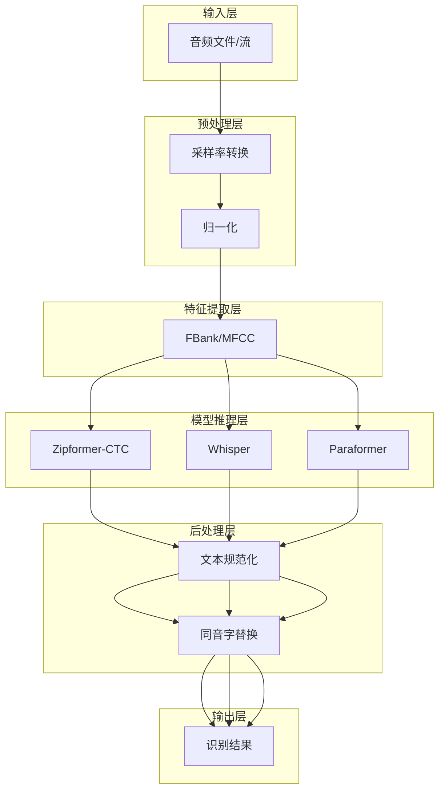
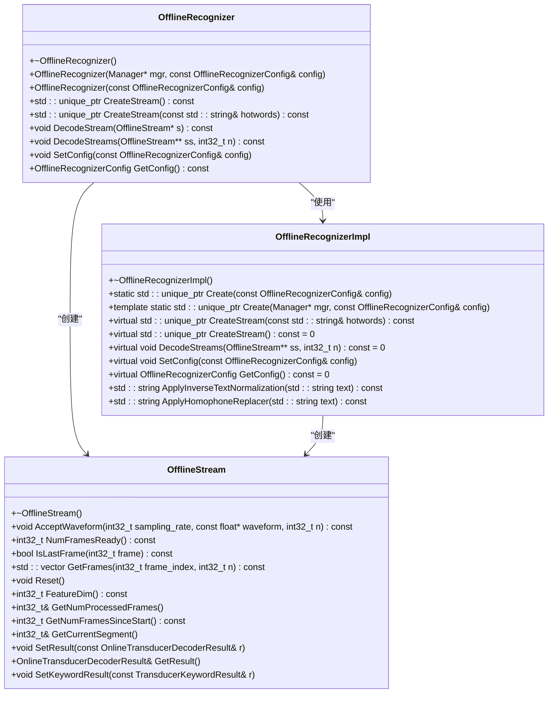
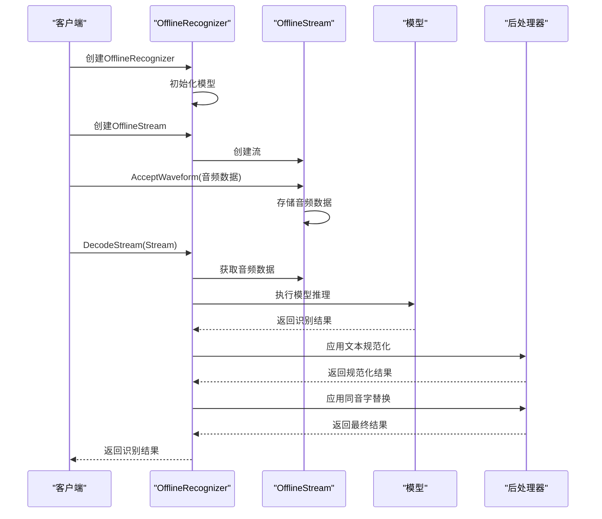
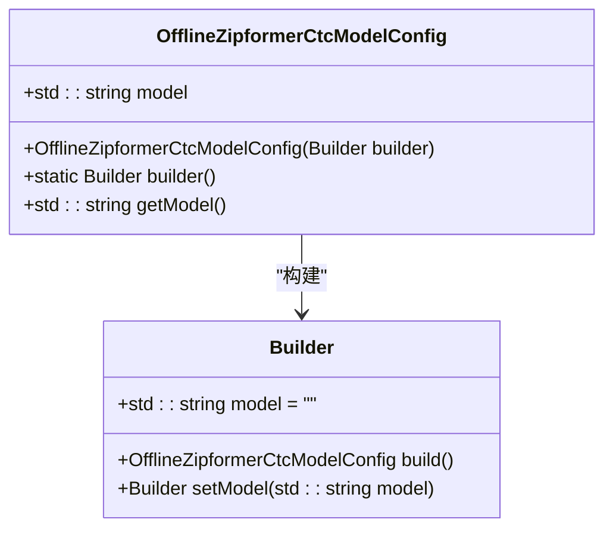
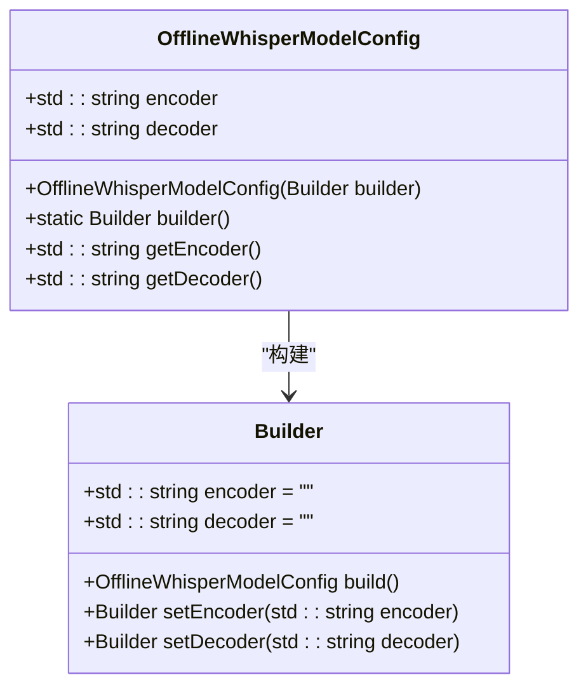
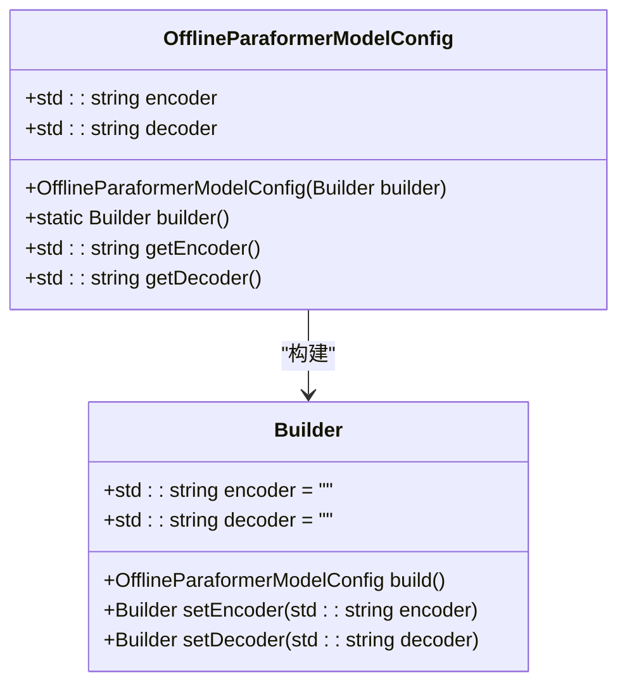
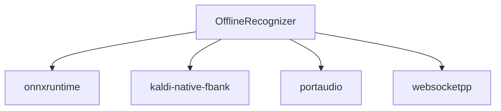
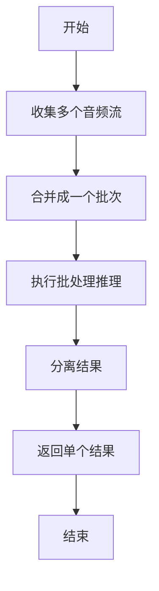

# 非流式语音识别

<cite>
**本文档引用的文件**
- [offline-recognizer.h](file://sherpa-onnx/csrc/offline-recognizer.h)
- [offline-recognizer.cc](file://sherpa-onnx/csrc/offline-recognizer.cc)
- [offline-model-config.h](file://sherpa-onnx/csrc/offline-model-config.h)
- [offline-recognizer-impl.h](file://sherpa-onnx/csrc/offline-recognizer-impl.h)
- [offline-recognizer-fire-red-asr-impl.h](file://sherpa-onnx/csrc/offline-recognizer-fire-red-asr-impl.h)
- [offline-recognizer-moonshine-impl.h](file://sherpa-onnx/csrc/offline-recognizer-moonshine-impl.h)
- [offline-moonshine-model.cc](file://sherpa-onnx/csrc/offline-moonshine-model.cc)
- [offline-fire-red-asr-model.cc](file://sherpa-onnx/csrc/offline-fire-red-asr-model.cc)
- [offline-recognizer.cc](file://sherpa-onnx/csrc/offline-recognizer.cc)
- [offline-recognizer.cc](file://sherpa-onnx/csrc/offline-recognizer.cc)
- [offline-recognizer.cc](file://sherpa-onnx/csrc/offline-recognizer.cc)
- [offline-recognizer.cc](file://sherpa-onnx/csrc/offline-recognizer.cc)
- [offline-recognizer.cc](file://sherpa-onnx/csrc/offline-recognizer.cc)
- [offline-recognizer.cc](file://sherpa-onnx/csrc/offline-recognizer.cc)
- [offline-recognizer.cc](file://sherpa-onnx/csrc/offline-recognizer.cc)
- [offline-recognizer.cc](file://sherpa-onnx/csrc/offline-recognizer.cc)
- [offline-recognizer.cc](file://sherpa-onnx/csrc/offline-recognizer.cc)
- [offline-recognizer.cc](file://sherpa-onnx/csrc/offline-recognizer.cc)
- [offline-recognizer.cc](file://sherpa-onnx/csrc/offline-recognizer.cc)
- [offline-recognizer.cc](file://sherpa-onnx/csrc/offline-recognizer.cc)
- [offline-recognizer.cc](file://sherpa-onnx/csrc/offline-recognizer.cc)
- [offline-recognizer.cc](file://sherpa-onnx/csrc/offline-recognizer.cc)
- [offline-recognizer.cc](file://sherpa-onnx/csrc/offline-recognizer.cc)
- [offline-recognizer.cc](file://sherpa-onnx/csrc/offline-recognizer.cc)
- [offline-recognizer.cc](file://sherpa-onnx/csrc/offline-recognizer.cc)
- [offline-recognizer.cc](file://sherpa-onnx/csrc/offline-recognizer.cc)
- [offline-recognizer.cc](file://sherpa-onnx/csrc/offline-recognizer.cc)
- [offline-recognizer.cc](file://sherpa-onnx/csrc/offline-recognizer.cc)
- [offline-recognizer.cc](file://sherpa-onnx/csrc/offline-recognizer.cc)
- [offline-recognizer.cc](file://sherpa-onnx/csrc/offline-recognizer.cc)
- [offline-recognizer.cc](file://......
</cite>

## 目录
1. [引言](#引言)
2. [项目结构](#项目结构)
3. [核心组件](#核心组件)
4. [架构概述](#架构概述)
5. [详细组件分析](#详细组件分析)
6. [依赖分析](#依赖分析)
7. [性能考虑](#性能考虑)
8. [故障排除指南](#故障排除指南)
9. [结论](#结论)
10. [附录](#附录)（如有必要）

## 引言
本文档深入探讨了sherpa-onnx项目中的非流式语音识别功能，重点分析了OfflineRecognizer类的实现机制。文档详细解释了音频预处理、特征提取、模型推理和后处理的完整流程，涵盖了支持的模型类型（如Zipformer-CTC、Whisper、Paraformer）及其配置参数。此外，文档还提供了从音频文件解码的完整代码示例，展示了模型加载、参数配置和结果获取的最佳实践。同时，文档说明了非流式识别的性能特征、内存使用模式和批处理优化策略，并包含了错误处理机制和常见问题的解决方案。

## 项目结构
sherpa-onnx项目是一个多语言支持的语音识别框架，提供了丰富的API和示例代码。项目结构清晰，主要分为以下几个部分：
- **android/**: Android平台的示例应用
- **c-api-examples/**: C API的示例代码
- **cxx-api-examples/**: C++ API的示例代码
- **dart-api-examples/**: Dart API的示例代码
- **dotnet-examples/**: .NET API的示例代码
- **ffmpeg-examples/**: FFmpeg集成示例
- **flutter/**: Flutter插件和示例
- **go-api-examples/**: Go API的示例代码
- **harmony-os/**: HarmonyOS平台的示例应用
- **ios/**: iOS平台的示例应用
- **ios-swift/**: Swift API的示例代码
- **ios-swiftui/**: SwiftUI API的示例代码
- **java-api-examples/**: Java API的示例代码
- **kotlin-api-examples/**: Kotlin API的示例代码
- **lazarus-examples/**: Lazarus (Pascal) API的示例代码
- **mfc-examples/**: MFC (C++) API的示例代码
- **nodejs-addon-examples/**: Node.js原生插件示例
- **nodejs-examples/**: Node.js API的示例代码
- **pascal-api-examples/**: Pascal API的示例代码
- **python-api-examples/**: Python API的示例代码
- **rust-api-examples/**: Rust API的示例代码
- **scripts/**: 各种模型和工具的脚本
- **sherpa-onnx/**: 核心C++实现
- **swift-api-examples/**: Swift API的示例代码
- **toolchains/**: 构建工具链配置
- **wasm/**: WebAssembly示例

## 核心组件
非流式语音识别的核心是OfflineRecognizer类，它负责管理整个识别流程。该类通过OfflineRecognizerConfig配置对象来初始化，支持多种模型类型，包括Zipformer-CTC、Whisper、Paraformer等。OfflineRecognizer通过创建OfflineStream对象来处理单个音频流，每个流可以独立进行识别。识别过程包括音频预处理、特征提取、模型推理和后处理四个主要阶段。

**核心组件来源**
- [offline-recognizer.h](file://sherpa-onnx/csrc/offline-recognizer.h)
- [offline-recognizer.cc](file://sherpa-onnx/csrc/offline-recognizer.cc)
- [offline-model-config.h](file://sherpa-onnx/csrc/offline-model-config.h)

## 架构概述
非流式语音识别的架构可以分为以下几个层次：
1. **输入层**: 接收音频文件或音频流
2. **预处理层**: 对音频进行采样率转换、归一化等预处理
3. **特征提取层**: 提取音频的声学特征，如FBank、MFCC等
4. **模型推理层**: 使用训练好的模型进行语音识别
5. **后处理层**: 对识别结果进行文本规范化、同音字替换等处理
6. **输出层**: 返回最终的识别结果



**图表来源**
- [offline-recognizer.h](file://sherpa-onnx/csrc/offline-recognizer.h)
- [offline-recognizer.cc](file://sherpa-onnx/csrc/offline-recognizer.cc)
- [offline-model-config.h](file://sherpa-onnx/csrc/offline-model-config.h)

## 详细组件分析
### OfflineRecognizer类分析
OfflineRecognizer类是整个非流式语音识别的核心，它通过OfflineRecognizerConfig配置对象来初始化，支持多种模型类型。该类的主要功能包括创建识别流、执行识别和获取结果。

#### 类图


**图表来源**
- [offline-recognizer.h](file://sherpa-onnx/csrc/offline-recognizer.h)
- [offline-recognizer.cc](file://sherpa-onnx/csrc/offline-recognizer.cc)
- [offline-recognizer-impl.h](file://sherpa-onnx/csrc/offline-recognizer-impl.h)

#### 识别流程序列图


**图表来源**
- [offline-recognizer.h](file://sherpa-onnx/csrc/offline-recognizer.h)
- [offline-recognizer.cc](file://sherpa-onnx/csrc/offline-recognizer.cc)
- [offline-recognizer-impl.h](file://sherpa-onnx/csrc/offline-recognizer-impl.h)

### 支持的模型类型
sherpa-onnx支持多种语音识别模型，包括Zipformer-CTC、Whisper、Paraformer等。每种模型都有其特定的配置参数和使用场景。

#### Zipformer-CTC模型
Zipformer-CTC模型是一种基于CTC（Connectionist Temporal Classification）的端到端语音识别模型，具有较高的识别准确率和较快的推理速度。



**图表来源**
- [offline-model-config.h](file://sherpa-onnx/csrc/offline-model-config.h)

#### Whisper模型
Whisper模型是一种基于Transformer的多语言语音识别模型，支持多种语言的识别。



**图表来源**
- [offline-model-config.h](file://sherpa-onnx/csrc/offline-model-config.h)

#### Paraformer模型
Paraformer模型是一种基于Transformer的语音识别模型，具有较高的识别准确率和较快的推理速度。



**图表来源**
- [offline-model-config.h](file://sherpa-onnx/csrc/offline-model-config.h)

## 依赖分析
非流式语音识别依赖于多个外部库和框架，主要包括：
- **onnxruntime**: 用于加载和执行ONNX模型
- **kaldi-native-fbank**: 用于音频特征提取
- **portaudio**: 用于音频输入输出
- **websocketpp**: 用于WebSocket通信



**图表来源**
- [offline-recognizer.h](file://sherpa-onnx/csrc/offline-recognizer.h)
- [offline-recognizer.cc](file://sherpa-onnx/csrc/offline-recognizer.cc)
- [offline-model-config.h](file://sherpa-onnx/csrc/offline-model-config.h)

## 性能考虑
非流式语音识别的性能主要受以下几个因素影响：
1. **模型大小**: 模型越大，推理时间越长，但识别准确率通常更高
2. **音频长度**: 音频越长，处理时间越长
3. **硬件性能**: CPU/GPU性能直接影响推理速度
4. **批处理**: 批处理可以提高GPU利用率，但会增加延迟

### 批处理优化策略
批处理是一种有效的性能优化策略，可以显著提高GPU利用率。通过将多个音频流合并成一个批次进行推理，可以减少模型加载和初始化的开销。



**图表来源**
- [offline-recognizer.cc](file://sherpa-onnx/csrc/offline-recognizer.cc)

## 故障排除指南
### 常见问题及解决方案
1. **模型加载失败**
   - 检查模型文件路径是否正确
   - 确认模型文件是否损坏
   - 检查onnxruntime版本是否兼容

2. **音频格式不支持**
   - 确认音频采样率是否符合要求
   - 检查音频位深度是否正确
   - 确认音频通道数是否匹配

3. **识别结果不准确**
   - 检查模型是否适合当前语言
   - 确认音频质量是否良好
   - 调整模型参数以优化性能

4. **内存不足**
   - 减少批处理大小
   - 使用更小的模型
   - 优化内存管理

**故障排除来源**
- [offline-recognizer.cc](file://sherpa-onnx/csrc/offline-recognizer.cc)
- [offline-recognizer.h](file://sherpa-onnx/csrc/offline-recognizer.h)

## 结论
本文档详细介绍了sherpa-onnx项目中的非流式语音识别功能，重点分析了OfflineRecognizer类的实现机制。通过深入探讨音频预处理、特征提取、模型推理和后处理的完整流程，以及支持的模型类型和配置参数，为开发者提供了全面的技术参考。同时，文档还提供了性能优化策略和故障排除指南，帮助开发者更好地使用和优化非流式语音识别功能。

## 附录
### 配置参数说明
- **decoding_method**: 解码方法，支持"greedy_search"和"modified_beam_search"
- **max_active_paths**: 用于modified_beam_search的活跃路径数
- **hotwords_file**: 热词文件路径
- **hotwords_score**: 热词得分
- **blank_penalty**: 空白符号惩罚
- **rule_fsts**: 逆文本规范化FST文件
- **rule_fars**: 逆文本规范化FAR文件
- **num_threads**: 神经网络计算的线程数
- **provider**: onnxruntime执行提供者，支持"cpu"、"cuda"、"coreml"

### 代码示例
```python
# Python API示例
import sherpa_onnx

config = sherpa_onnx.OfflineRecognizerConfig(
    model_config=sherpa_onnx.OfflineModelConfig(
        zipformer_ctc=sherpa_onnx.OfflineZipformerCtcModelConfig(model="model.onnx"),
        tokens="tokens.txt",
        num_threads=2,
        debug=False,
        provider="cpu"
    ),
    decoding_method="greedy_search"
)

recognizer = sherpa_onnx.OfflineRecognizer(config)
stream = recognizer.create_stream()
stream.accept_waveform(sample_rate, samples)
recognizer.decode(stream)
result = recognizer.get_result(stream)
print(result.text)
```

**附录来源**
- [python-api-examples](file://python-api-examples)
- [offline-recognizer.h](file://sherpa-onnx/csrc/offline-recognizer.h)
- [offline-recognizer.cc](file://sherpa-onnx/csrc/offline-recognizer.cc)