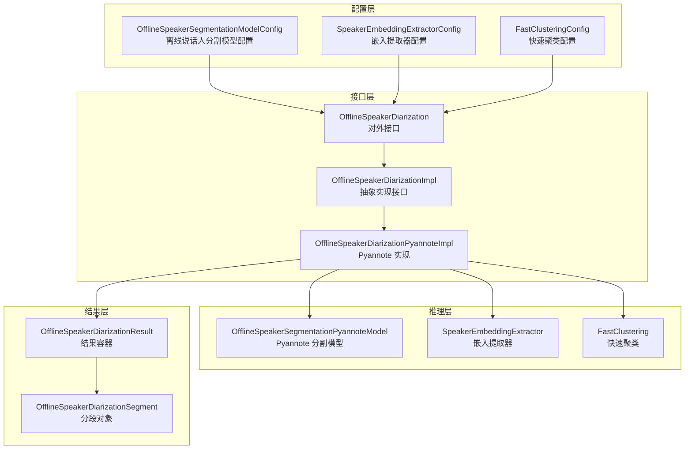
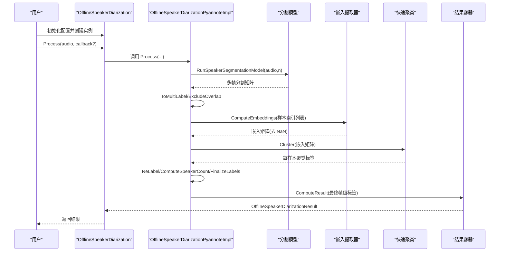
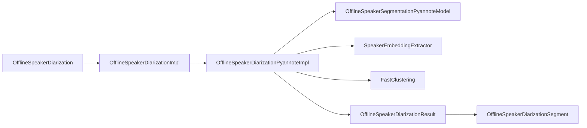

# 说话人分离

<cite>
**本文引用的文件**
- [sherpa-onnx/csrc/offline-speaker-diarization.h](file://sherpa-onnx/csrc/offline-speaker-diarization.h)
- [sherpa-onnx/csrc/offline-speaker-diarization.cc](file://sherpa-onnx/csrc/offline-speaker-diarization.cc)
- [sherpa-onnx/csrc/offline-speaker-diarization-impl.h](file://sherpa-onnx/csrc/offline-speaker-diarization-impl.h)
- [sherpa-onnx/csrc/offline-speaker-diarization-pyannote-impl.h](file://sherpa-onnx/csrc/offline-speaker-diarization-pyannote-impl.h)
- [sherpa-onnx/csrc/offline-speaker-diarization-result.h](file://sherpa-onnx/csrc/offline-speaker-diarization-result.h)
- [sherpa-onnx/csrc/offline-speaker-diarization-result.cc](file://sherpa-onnx/csrc/offline-speaker-diarization-result.cc)
- [sherpa-onnx/csrc/offline-speaker-segmentation-model-config.h](file://sherpa-onnx/csrc/offline-speaker-segmentation-model-config.h)
- [sherpa-onnx/csrc/fast-clustering-config.h](file://sherpa-onnx/csrc/fast-clustering-config.h)
- [sherpa-onnx/csrc/fast-clustering-config.cc](file://sherpa-onnx/csrc/fast-clustering-config.cc)
- [sherpa-onnx/csrc/fast-clustering.h](file://sherpa-onnx/csrc/fast-clustering.h)
- [sherpa-onnx/csrc/fast-clustering.cc](file://sherpa-onnx/csrc/fast-clustering.cc)
- [python-api-examples/offline-speaker-diarization.py](file://python-api-examples/offline-speaker-diarization.py)
- [java-api-examples/OfflineSpeakerDiarizationDemo.java](file://java-api-examples/OfflineSpeakerDiarizationDemo.java)
- [scripts/pyannote/segmentation/export-onnx.py](file://scripts/pyannote/segmentation/export-onnx.py)
- [scripts/pyannote/segmentation/speaker-diarization-onnx.py](file://scripts/pyannote/segmentation/speaker-diarization-onnx.py)
- [wasm/speaker-diarization/sherpa-onnx-wasm-main-speaker-diarization.cc](file://wasm/speaker-diarization/sherpa-onnx-wasm-main-speaker-diarization.cc)
- [wasm/speaker-diarization/sherpa-onnx-speaker-diarization.js](file://wasm/speaker-diarization/sherpa-onnx-speaker-diarization.js)
- [generate-subtitles.py](file://python-api-examples/generate-subtitles.py)
</cite>

## 目录
1. [简介](#简介)
2. [项目结构](#项目结构)
3. [核心组件](#核心组件)
4. [架构总览](#架构总览)
5. [详细组件分析](#详细组件分析)
6. [依赖关系分析](#依赖关系分析)
7. [性能与优化](#性能与优化)
8. [故障排查指南](#故障排查指南)
9. [结论](#结论)
10. [附录：配置与使用示例](#附录配置与使用示例)

## 简介
本文件系统性介绍 sherpa-onnx 的离线说话人分离（Offline Speaker Diarization）能力，重点围绕基于 Pyannote 的说话人分割模型、嵌入向量提取与快速聚类的端到端流程，解释 OfflineSpeakerDiarization 的架构设计、输入输出格式、配置参数、说话人数量估计策略以及与 ASR 集成的典型用法。文档同时提供多语言示例（Python、Java、WASM）与优化建议，帮助开发者在实际多说话人对话场景中获得更稳定、准确的分离结果。

## 项目结构
离线说话人分离功能主要由以下层次构成：
- 配置层：离线说话人分割模型配置、嵌入提取器配置、快速聚类配置
- 核心接口层：OfflineSpeakerDiarization 及其内部实现 OfflineSpeakerDiarizationImpl
- 具体实现层：基于 Pyannote 的分割模型推理、嵌入提取、聚类与后处理
- 结果层：分段对象与结果容器，支持按起始时间或说话人排序
- 示例与脚本：Python/Java/WASM 示例，以及 Pyannote 模型导出与 ONNX 聚合脚本

图表来源
- [sherpa-onnx/csrc/offline-speaker-diarization.h](file://sherpa-onnx/csrc/offline-speaker-diarization.h#L1-L85)
- [sherpa-onnx/csrc/offline-speaker-diarization-impl.h](file://sherpa-onnx/csrc/offline-speaker-diarization-impl.h#L1-L40)
- [sherpa-onnx/csrc/offline-speaker-diarization-pyannote-impl.h](file://sherpa-onnx/csrc/offline-speaker-diarization-pyannote-impl.h#L55-L120)
- [sherpa-onnx/csrc/offline-speaker-diarization-result.h](file://sherpa-onnx/csrc/offline-speaker-diarization-result.h#L1-L68)
- [sherpa-onnx/csrc/offline-speaker-segmentation-model-config.h](file://sherpa-onnx/csrc/offline-speaker-segmentation-model-config.h#L1-L41)
- [sherpa-onnx/csrc/fast-clustering-config.h](file://sherpa-onnx/csrc/fast-clustering-config.h#L1-L39)
- [sherpa-onnx/csrc/fast-clustering.h](file://sherpa-onnx/csrc/fast-clustering.h#L1-L43)

章节来源
- [sherpa-onnx/csrc/offline-speaker-diarization.h](file://sherpa-onnx/csrc/offline-speaker-diarization.h#L1-L85)
- [sherpa-onnx/csrc/offline-speaker-diarization-impl.h](file://sherpa-onnx/csrc/offline-speaker-diarization-impl.h#L1-L40)
- [sherpa-onnx/csrc/offline-speaker-diarization-pyannote-impl.h](file://sherpa-onnx/csrc/offline-speaker-diarization-pyannote-impl.h#L55-L120)

## 核心组件
- OfflineSpeakerDiarizationConfig：组合分割模型、嵌入提取器与聚类配置，并提供最小片段时长与最小静音间隔等后处理参数。
- OfflineSpeakerDiarization：对外暴露的高层接口，负责采样率检查、配置更新与调用具体实现。
- OfflineSpeakerDiarizationImpl：抽象实现接口，定义 SampleRate、SetConfig、Process 等方法。
- OfflineSpeakerDiarizationPyannoteImpl：基于 Pyannote 分割模型的完整实现，包含音频分块、分割矩阵转多标签、排除重叠、嵌入提取、聚类、计数与最终标签生成、合并短片段与过滤短片段等步骤。
- OfflineSpeakerDiarizationResult/Segment：结果容器与分段对象，支持按起始时间或按说话人排序，以及文本字段扩展（可用于后续 ASR 识别结果填充）。
- FastClustering/FastClusteringConfig：快速聚类模块，支持指定聚类数或阈值两种方式；内部使用余弦距离与层次聚类完成聚类并返回每帧/样本的说话人标签。

章节来源
- [sherpa-onnx/csrc/offline-speaker-diarization.h](file://sherpa-onnx/csrc/offline-speaker-diarization.h#L19-L81)
- [sherpa-onnx/csrc/offline-speaker-diarization.cc](file://sherpa-onnx/csrc/offline-speaker-diarization.cc#L82-L108)
- [sherpa-onnx/csrc/offline-speaker-diarization-impl.h](file://sherpa-onnx/csrc/offline-speaker-diarization-impl.h#L14-L35)
- [sherpa-onnx/csrc/offline-speaker-diarization-pyannote-impl.h](file://sherpa-onnx/csrc/offline-speaker-diarization-pyannote-impl.h#L55-L120)
- [sherpa-onnx/csrc/offline-speaker-diarization-result.h](file://sherpa-onnx/csrc/offline-speaker-diarization-result.h#L15-L68)
- [sherpa-onnx/csrc/fast-clustering-config.h](file://sherpa-onnx/csrc/fast-clustering-config.h#L14-L39)
- [sherpa-onnx/csrc/fast-clustering.h](file://sherpa-onnx/csrc/fast-clustering.h#L15-L41)

## 架构总览
离线说话人分离的整体流程如下：
1. 输入音频按分割模型的窗口大小与步长进行分块推理，得到每帧的分割概率矩阵；
2. 将分割概率矩阵映射为多标签矩阵（考虑幂集映射），并排除重叠帧；
3. 基于有效帧序列提取嵌入向量，过滤 NaN 向量；
4. 使用快速聚类对嵌入向量进行层次聚类，得到每个样本所属的说话人标签；
5. 将样本级标签映射回帧级标签，统计每帧说话人数，选择前 K 名说话人作为当前帧的活跃说话人；
6. 对最终标签进行片段合并与短片段过滤，输出按起始时间排序的结果。

图表来源
- [sherpa-onnx/csrc/offline-speaker-diarization.cc](file://sherpa-onnx/csrc/offline-speaker-diarization.cc#L102-L107)
- [sherpa-onnx/csrc/offline-speaker-diarization-pyannote-impl.h](file://sherpa-onnx/csrc/offline-speaker-diarization-pyannote-impl.h#L94-L185)
- [sherpa-onnx/csrc/fast-clustering.cc](file://sherpa-onnx/csrc/fast-clustering.cc#L18-L83)

## 详细组件分析

### OfflineSpeakerDiarization 与实现接口
- 接口职责：封装配置、采样率查询、配置更新与处理入口；将调用转发至具体实现。
- 实现接口：定义 Create 工厂方法（支持不同资源管理器）、SampleRate、SetConfig、Process 抽象方法，确保平台适配。

章节来源
- [sherpa-onnx/csrc/offline-speaker-diarization.h](file://sherpa-onnx/csrc/offline-speaker-diarization.h#L55-L81)
- [sherpa-onnx/csrc/offline-speaker-diarization.cc](file://sherpa-onnx/csrc/offline-speaker-diarization.cc#L82-L108)
- [sherpa-onnx/csrc/offline-speaker-diarization-impl.h](file://sherpa-onnx/csrc/offline-speaker-diarization-impl.h#L14-L35)

### Pyannote 分割模型与分块推理
- 分块策略：根据模型元数据中的 window_size 与 window_shift 对音频进行滑动分块；最后一块可能不足 window_size，会被补零后处理。
- 分割矩阵到多标签：通过幂集映射将分割模型输出的类别索引映射为多标签矩阵，表示每帧各说话人的存在与否。
- 重叠排除：当某帧同时属于多个说话人时，该帧被排除，以减少跨说话人干扰。

章节来源
- [sherpa-onnx/csrc/offline-speaker-diarization-pyannote-impl.h](file://sherpa-onnx/csrc/offline-speaker-diarization-pyannote-impl.h#L227-L332)
- [sherpa-onnx/csrc/offline-speaker-diarization-pyannote-impl.h](file://sherpa-onnx/csrc/offline-speaker-diarization-pyannote-impl.h#L323-L355)
- [sherpa-onnx/csrc/offline-speaker-diarization-pyannote-impl.h](file://sherpa-onnx/csrc/offline-speaker-diarization-pyannote-impl.h#L435-L457)

### 嵌入提取与样本索引生成
- 样本索引：遍历每块每说话人的激活帧区间，将其转换为样本级的起止索引列表；
- 嵌入计算：对每个样本序列创建流，拼接后输入嵌入提取器，过滤 NaN 向量；
- 进度回调：在嵌入提取过程中可选地报告进度。

章节来源
- [sherpa-onnx/csrc/offline-speaker-diarization-pyannote-impl.h](file://sherpa-onnx/csrc/offline-speaker-diarization-pyannote-impl.h#L357-L434)
- [sherpa-onnx/csrc/offline-speaker-diarization-pyannote-impl.h](file://sherpa-onnx/csrc/offline-speaker-diarization-pyannote-impl.h#L459-L521)

### 聚类与标签重映射
- 聚类：对有效嵌入向量进行 L2 归一化，计算余弦距离，使用层次聚类并在阈值或指定聚类数下切分树得到标签；
- 标签重映射：将样本级标签映射回帧级标签，统计每帧说话人数并选择前 K 名作为活跃说话人。

章节来源
- [sherpa-onnx/csrc/fast-clustering.h](file://sherpa-onnx/csrc/fast-clustering.h#L15-L41)
- [sherpa-onnx/csrc/fast-clustering.cc](file://sherpa-onnx/csrc/fast-clustering.cc#L18-L83)
- [sherpa-onnx/csrc/offline-speaker-diarization-pyannote-impl.h](file://sherpa-onnx/csrc/offline-speaker-diarization-pyannote-impl.h#L523-L610)

### 最终标签生成与片段后处理
- 帧级标签：对每帧统计活跃说话人集合；
- 片段生成：遍历帧级标签，按说话人生成连续片段；
- 合并与过滤：合并相邻且间隔小于 min_duration_off 的片段；过滤长度小于 min_duration_on 的片段。

章节来源
- [sherpa-onnx/csrc/offline-speaker-diarization-pyannote-impl.h](file://sherpa-onnx/csrc/offline-speaker-diarization-pyannote-impl.h#L611-L718)
- [sherpa-onnx/csrc/offline-speaker-diarization-pyannote-impl.h](file://sherpa-onnx/csrc/offline-speaker-diarization-pyannote-impl.h#L720-L745)

### 结果容器与输出格式
- OfflineSpeakerDiarizationSegment：包含起始时间、结束时间、说话人编号与可选文本字段；
- OfflineSpeakerDiarizationResult：提供添加分段、统计说话人数、按起始时间排序、按说话人分组排序等能力；
- 输出格式：默认按起始时间排序；也可按说话人分组获取各自片段列表；文本字段可用于后续填充 ASR 识别结果。

章节来源
- [sherpa-onnx/csrc/offline-speaker-diarization-result.h](file://sherpa-onnx/csrc/offline-speaker-diarization-result.h#L15-L68)
- [sherpa-onnx/csrc/offline-speaker-diarization-result.cc](file://sherpa-onnx/csrc/offline-speaker-diarization-result.cc#L20-L116)

### 配置参数说明
- OfflineSpeakerSegmentationModelConfig
  - pyannote：Pyannote 分割模型路径、线程数、Provider、调试开关
  - 示例字段：model、num_threads、provider、debug
- SpeakerEmbeddingExtractorConfig
  - 嵌入模型路径、线程数、调试开关
- FastClusteringConfig
  - num_clusters：若大于 0，则忽略阈值；推荐已知说话人数时设置
  - threshold：聚类阈值；越小产生越多聚类（更多说话人）
- OfflineSpeakerDiarizationConfig
  - min_duration_on：短片段过滤阈值（秒）
  - min_duration_off：相邻片段合并阈值（秒）

章节来源
- [sherpa-onnx/csrc/offline-speaker-segmentation-model-config.h](file://sherpa-onnx/csrc/offline-speaker-segmentation-model-config.h#L14-L36)
- [sherpa-onnx/csrc/fast-clustering-config.h](file://sherpa-onnx/csrc/fast-clustering-config.h#L14-L39)
- [sherpa-onnx/csrc/offline-speaker-diarization.cc](file://sherpa-onnx/csrc/offline-speaker-diarization.cc#L23-L41)

### 说话人数量估计与聚类策略
- 已知说话人数：优先设置 num_clusters，避免阈值不确定性带来的波动；
- 不确定说话人数：设置合理的 threshold，结合 min_duration_on/min_duration_off 后处理；
- Pyannote 导出脚本：通过添加元数据（如 num_speakers、powerset_max_classes 等）指导分割模型行为，便于与实现层幂集映射一致。

章节来源
- [scripts/pyannote/segmentation/export-onnx.py](file://scripts/pyannote/segmentation/export-onnx.py#L117-L133)
- [sherpa-onnx/csrc/offline-speaker-diarization-pyannote-impl.h](file://sherpa-onnx/csrc/offline-speaker-diarization-pyannote-impl.h#L190-L225)

### 与 ASR 集成的使用模式
- 思路：先用离线说话人分离得到每段的起止时间与说话人编号，再对每段调用 ASR 获取文本，将文本写入分段对象的文本字段，最后输出字幕或带说话人标注的转写。
- 示例脚本：generate-subtitles.py 展示了 VAD + ASR 的流水线，可参考其思路将离线说话人分离加入该流程，先对音频做 VAD 分段，再对每个语音段执行离线说话人分离，最后对每段执行 ASR 并写入文本字段。

章节来源
- [generate-subtitles.py](file://python-api-examples/generate-subtitles.py#L529-L689)

## 依赖关系分析
- 组件耦合
  - OfflineSpeakerDiarization 仅依赖 OfflineSpeakerDiarizationImpl 抽象接口，便于替换实现（如未来支持其他分割模型）；
  - OfflineSpeakerDiarizationPyannoteImpl 内部依赖分割模型、嵌入提取器与快速聚类三者，形成强内聚的数据流；
  - 结果容器与分段对象低耦合，便于扩展（例如增加置信度、说话人名称映射等）。
- 外部依赖
  - ONNXRuntime：用于分割模型推理；
  - Eigen：用于矩阵运算（嵌入与距离计算）；
  - fastcluster：用于层次聚类；
  - Pyannote 模型导出脚本：生成带有元数据的 ONNX 模型，供推理使用。

图表来源
- [sherpa-onnx/csrc/offline-speaker-diarization.h](file://sherpa-onnx/csrc/offline-speaker-diarization.h#L55-L81)
- [sherpa-onnx/csrc/offline-speaker-diarization-pyannote-impl.h](file://sherpa-onnx/csrc/offline-speaker-diarization-pyannote-impl.h#L55-L120)
- [sherpa-onnx/csrc/fast-clustering.h](file://sherpa-onnx/csrc/fast-clustering.h#L15-L41)

## 性能与优化
- 分块大小与步长：合理设置 window_size 与 window_shift，平衡精度与速度；过小会增加计算开销，过大可能丢失边界细节。
- 嵌入提取：尽量复用流对象，避免频繁创建销毁；对短片段进行过滤可减少无效嵌入计算。
- 聚类阈值：较小阈值带来更多细粒度区分但易过拟合，较大阈值更稳健但可能合并真实说话人；建议先在验证集上搜索最优阈值。
- 后处理参数：min_duration_on 与 min_duration_off 需结合场景调整；会议场景可适当增大，口语对话可减小。
- Provider 与线程：ONNXRuntime Provider 与 num_threads 可根据硬件特性调优；CPU 上可尝试 OpenMP 或 TensorRT（如可用）。

## 故障排查指南
- 输入采样率不匹配：调用前需确保音频采样率与分割模型期望采样率一致，否则会报错或产生异常结果。
- 无说话人检测：当分割模型输出全零或 speakers_per_frame 全零时，实现层会记录日志并返回空结果；请检查模型与音频质量。
- NaN 嵌入：嵌入提取器可能输出 NaN，实现层会过滤这些样本并记录日志；请检查音频片段长度与预处理。
- 阈值设置不当：阈值过大可能导致聚类数过少，阈值过小可能导致噪声片段过多；建议逐步调整并观察结果。

章节来源
- [sherpa-onnx/csrc/offline-speaker-diarization-pyannote-impl.h](file://sherpa-onnx/csrc/offline-speaker-diarization-pyannote-impl.h#L127-L131)
- [sherpa-onnx/csrc/offline-speaker-diarization-pyannote-impl.h](file://sherpa-onnx/csrc/offline-speaker-diarization-pyannote-impl.h#L134-L158)
- [sherpa-onnx/csrc/offline-speaker-diarization-pyannote-impl.h](file://sherpa-onnx/csrc/offline-speaker-diarization-pyannote-impl.h#L163-L166)

## 结论
sherpa-onnx 的离线说话人分离以 Pyannote 分割模型为核心，结合嵌入提取与快速聚类，形成从音频到说话人片段的完整管线。通过合理的配置与后处理参数，可在多说话人对话场景中取得稳定、可解释的结果。配合 ASR 流水线，可进一步生成带说话人标注的字幕或转写，满足会议记录、播客拆条、视频字幕等多种应用需求。

## 附录：配置与使用示例

### Python 示例（离线说话人分离）
- 步骤要点
  - 准备分割模型与嵌入模型（ONNX）
  - 构造 OfflineSpeakerDiarizationConfig，设置 num_clusters 或 threshold
  - 加载音频并确保采样率匹配
  - 调用 process 并按起始时间排序输出
- 关键路径
  - [python-api-examples/offline-speaker-diarization.py](file://python-api-examples/offline-speaker-diarization.py#L57-L136)

章节来源
- [python-api-examples/offline-speaker-diarization.py](file://python-api-examples/offline-speaker-diarization.py#L57-L136)

### Java 示例（离线说话人分离）
- 步骤要点
  - 构造分割、嵌入与聚类配置（builder 模式）
  - 创建 OfflineSpeakerDiarization 实例，检查采样率
  - 调用 processWithCallback 获取进度并输出分段
- 关键路径
  - [java-api-examples/OfflineSpeakerDiarizationDemo.java](file://java-api-examples/OfflineSpeakerDiarizationDemo.java#L30-L99)

章节来源
- [java-api-examples/OfflineSpeakerDiarizationDemo.java](file://java-api-examples/OfflineSpeakerDiarizationDemo.java#L30-L99)

### WASM 示例（浏览器/Node 环境）
- 关键点
  - 在浏览器/Node 中创建 OfflineSpeakerDiarization 实例
  - 传入配置（包含 segmentation.embedding.clustering 等）
  - 调用 process 返回分段数组
- 关键路径
  - [wasm/speaker-diarization/sherpa-onnx-wasm-main-speaker-diarization.cc](file://wasm/speaker-diarization/sherpa-onnx-wasm-main-speaker-diarization.cc#L40-L63)
  - [wasm/speaker-diarization/sherpa-onnx-speaker-diarization.js](file://wasm/speaker-diarization/sherpa-onnx-speaker-diarization.js#L268-L299)

章节来源
- [wasm/speaker-diarization/sherpa-onnx-wasm-main-speaker-diarization.cc](file://wasm/speaker-diarization/sherpa-onnx-wasm-main-speaker-diarization.cc#L40-L63)
- [wasm/speaker-diarization/sherpa-onnx-speaker-diarization.js](file://wasm/speaker-diarization/sherpa-onnx-speaker-diarization.js#L268-L299)

### Pyannote 模型导出与 ONNX 聚合
- 导出脚本：将 Pyannote 模型导出为 ONNX，并添加元数据（num_speakers、powerset_max_classes、sample_rate 等），供推理使用
- ONNX 聚合脚本：加载分割与嵌入模型，生成多标签矩阵，提取嵌入并进行聚类
- 关键路径
  - [scripts/pyannote/segmentation/export-onnx.py](file://scripts/pyannote/segmentation/export-onnx.py#L117-L133)
  - [scripts/pyannote/segmentation/speaker-diarization-onnx.py](file://scripts/pyannote/segmentation/speaker-diarization-onnx.py#L201-L389)

章节来源
- [scripts/pyannote/segmentation/export-onnx.py](file://scripts/pyannote/segmentation/export-onnx.py#L117-L133)
- [scripts/pyannote/segmentation/speaker-diarization-onnx.py](file://scripts/pyannote/segmentation/speaker-diarization-onnx.py#L201-L389)