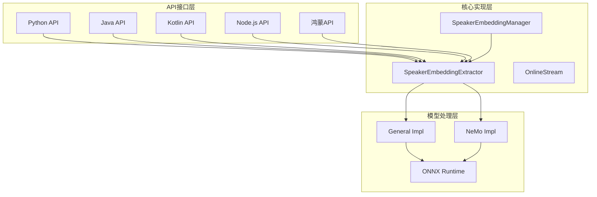
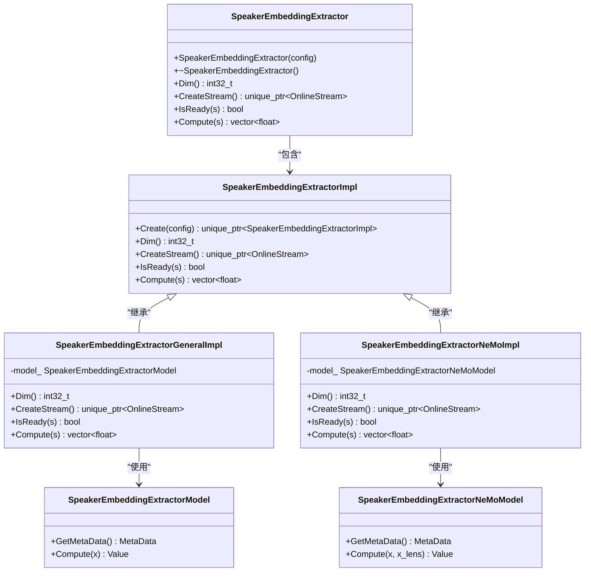
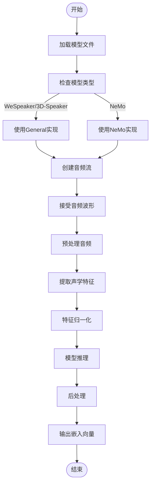
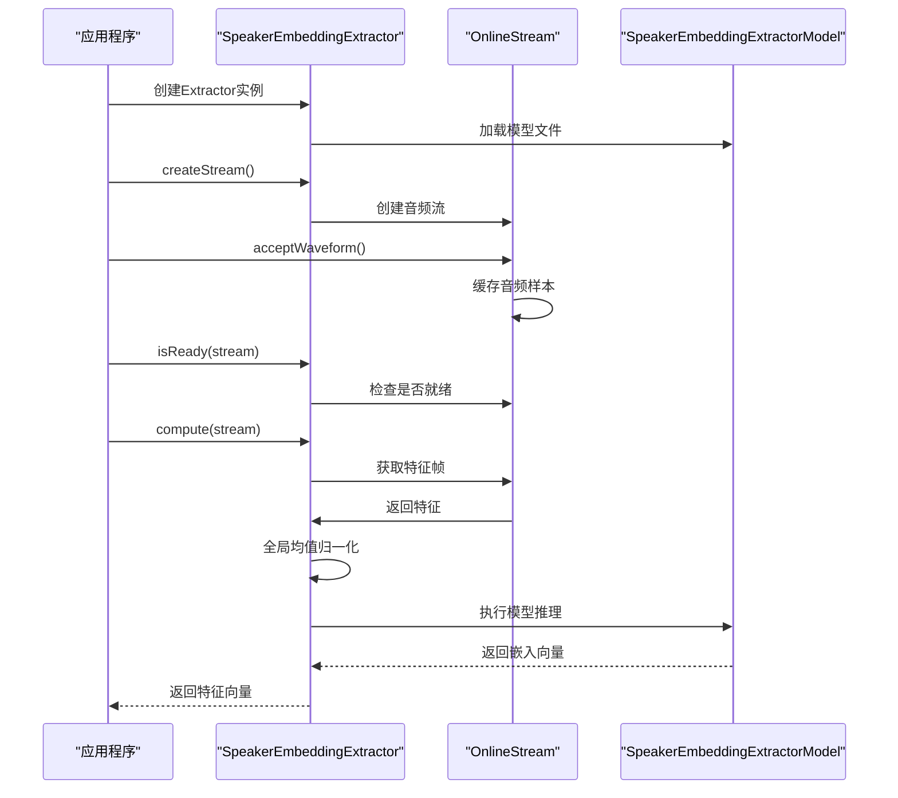
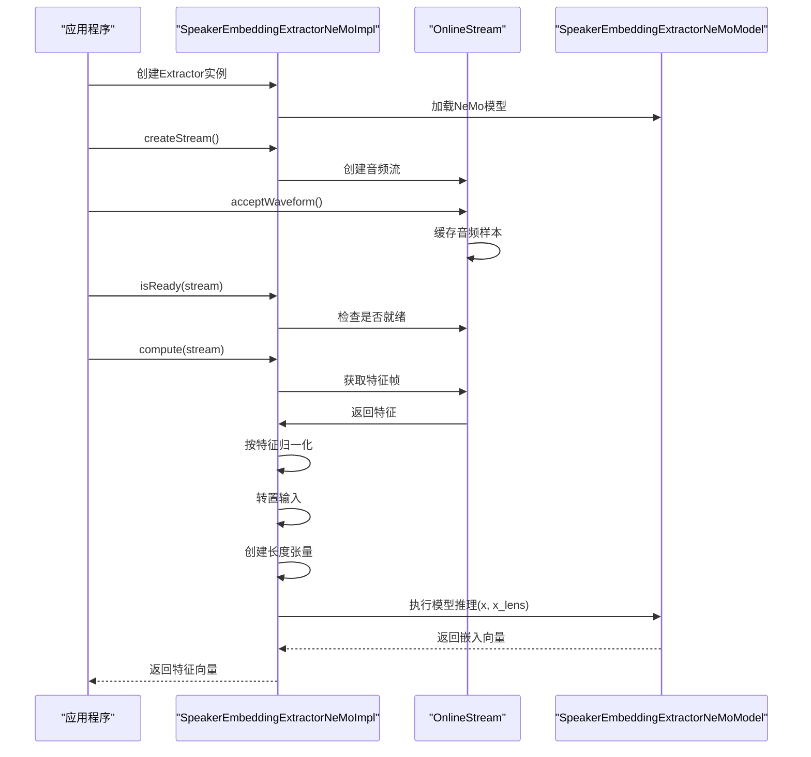
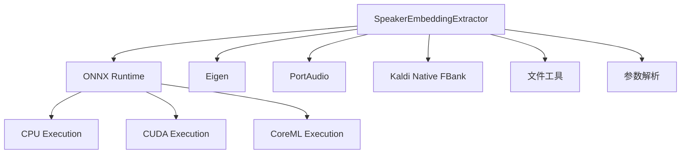

# 说话人嵌入提取

<cite>
**本文档引用的文件**
- [speaker-embedding-extractor.h](file://sherpa-onnx/csrc/speaker-embedding-extractor.h)
- [speaker-embedding-extractor.cc](file://sherpa-onnx/csrc/speaker-embedding-extractor.cc)
- [speaker-embedding-extractor-impl.h](file://sherpa-onnx/csrc/speaker-embedding-extractor-impl.h)
- [speaker-embedding-extractor-impl.cc](file://sherpa-onnx/csrc/speaker-embedding-extractor-impl.cc)
- [speaker-embedding-extractor-general-impl.h](file://sherpa-onnx/csrc/speaker-embedding-extractor-general-impl.h)
- [speaker-embedding-extractor-nemo-impl.h](file://sherpa-onnx/csrc/speaker-embedding-extractor-nemo-impl.h)
- [speaker-embedding-extractor-model.cc](file://sherpa-onnx/csrc/speaker-embedding-extractor-model.cc)
- [speaker-embedding-extractor-nemo-model.cc](file://sherpa-onnx/csrc/speaker-embedding-extractor-nemo-model.cc)
- [speaker-embedding-manager.cc](file://sherpa-onnx/csrc/speaker-embedding-manager.cc)
- [test_speaker_id.kt](file://kotlin-api-examples/test_speaker_id.kt)
- [speaker-identification.js](file://scripts/node-addon-api/lib/speaker-identification.js)
- [SpeakerIdentification.ets](file://harmony-os/SherpaOnnxHar/sherpa_onnx/src/main/ets/components/SpeakerIdentification.ets)
- [speaker-identification.cc](file://sherpa-onnx/csrc/speaker-identification.cc)
- [speaker-identification.py](file://python-api-examples/speaker-identification.py)
- [speaker-identification-with-vad.py](file://python-api-examples/speaker-identification-with-vad.py)
</cite>

## 目录
1. [简介](#简介)
2. [核心组件](#核心组件)
3. [架构概述](#架构概述)
4. [详细组件分析](#详细组件分析)
5. [依赖分析](#依赖分析)
6. [性能考虑](#性能考虑)
7. [故障排除指南](#故障排除指南)
8. [结论](#结论)

## 简介
本文档详细介绍了sherpa-onnx项目中的说话人嵌入提取功能。该功能允许从音频输入中提取说话人的特征向量，用于说话人识别和验证。系统支持多种模型类型，包括WeSpeaker、3D-Speaker和NeMo，并提供了跨平台的API接口。

## 核心组件
说话人嵌入提取系统由几个核心组件构成：SpeakerEmbeddingExtractor用于从音频流中提取特征向量，SpeakerEmbeddingManager用于管理已知说话人的特征库，以及各种模型实现处理特定类型的嵌入模型。

**本节来源**
- [speaker-embedding-extractor.h](file://sherpa-onnx/csrc/speaker-embedding-extractor.h#L1-L72)
- [speaker-embedding-manager.cc](file://sherpa-onnx/csrc/speaker-embedding-manager.cc#L1-L100)

## 架构概述
说话人嵌入提取系统采用分层架构，顶层是跨语言API接口，中间层是C++核心实现，底层是ONNX运行时。系统通过SpeakerEmbeddingExtractor类加载模型并处理音频输入，生成固定维度的特征向量。

**图表来源**
- [speaker-embedding-extractor.h](file://sherpa-onnx/csrc/speaker-embedding-extractor.h#L1-L72)
- [speaker-embedding-extractor-impl.h](file://sherpa-onnx/csrc/speaker-embedding-extractor-impl.h#L1-L39)

## 详细组件分析

### SpeakerEmbeddingExtractor分析
SpeakerEmbeddingExtractor是说话人嵌入提取的核心类，负责加载模型、处理音频输入并生成特征向量。该类根据模型元数据自动选择适当的实现。

#### 类图

**图表来源**
- [speaker-embedding-extractor.h](file://sherpa-onnx/csrc/speaker-embedding-extractor.h#L1-L72)
- [speaker-embedding-extractor-impl.h](file://sherpa-onnx/csrc/speaker-embedding-extractor-impl.h#L1-L39)
- [speaker-embedding-extractor-general-impl.h](file://sherpa-onnx/csrc/speaker-embedding-extractor-general-impl.h#L1-L118)
- [speaker-embedding-extractor-nemo-impl.h](file://sherpa-onnx/csrc/speaker-embedding-extractor-nemo-impl.h#L1-L147)

### 特征提取流程分析
说话人嵌入提取过程涉及多个步骤，包括音频预处理、特征计算和模型推理。

#### 流程图

**图表来源**
- [speaker-embedding-extractor-impl.cc](file://sherpa-onnx/csrc/speaker-embedding-extractor-impl.cc#L1-L157)
- [speaker-embedding-extractor-general-impl.h](file://sherpa-onnx/csrc/speaker-embedding-extractor-general-impl.h#L1-L118)
- [speaker-embedding-extractor-nemo-impl.h](file://sherpa-onnx/csrc/speaker-embedding-extractor-nemo-impl.h#L1-L147)

### 模型特定实现分析

#### WeSpeaker/3D-Speaker实现
WeSpeaker和3D-Speaker模型使用通用实现，其特征处理流程包括全局均值归一化。

**图表来源**
- [speaker-embedding-extractor-general-impl.h](file://sherpa-onnx/csrc/speaker-embedding-extractor-general-impl.h#L1-L118)
- [speaker-embedding-extractor-model.cc](file://sherpa-onnx/csrc/speaker-embedding-extractor-model.cc#L1-L100)

#### NeMo实现
NeMo模型有特定的实现，其特征处理包括按特征归一化和输入长度处理。

**图表来源**
- [speaker-embedding-extractor-nemo-impl.h](file://sherpa-onnx/csrc/speaker-embedding-extractor-nemo-impl.h#L1-L147)
- [speaker-embedding-extractor-nemo-model.cc](file://sherpa-onnx/csrc/speaker-embedding-extractor-nemo-model.cc#L1-L100)

## 依赖分析
说话人嵌入提取系统依赖于多个外部组件和库，包括ONNX运行时、Eigen线性代数库和音频处理工具。

**图表来源**
- [speaker-embedding-extractor-impl.cc](file://sherpa-onnx/csrc/speaker-embedding-extractor-impl.cc#L1-L157)
- [speaker-embedding-extractor.cc](file://sherpa-onnx/csrc/speaker-embedding-extractor.cc#L1-L101)

## 性能考虑
说话人嵌入提取的性能受多个因素影响，包括模型大小、线程数和硬件加速。系统支持CPU、CUDA和CoreML等多种执行提供程序，允许在不同硬件平台上优化性能。对于实时应用，建议使用CUDA或CoreML提供程序以获得最佳性能。

## 故障排除指南
常见问题包括模型文件路径错误、不支持的模型类型和音频格式问题。确保模型文件包含正确的元数据，特别是"framework"字段，以识别模型类型。对于性能问题，检查执行提供程序设置和线程数配置。

**本节来源**
- [speaker-embedding-extractor.cc](file://sherpa-onnx/csrc/speaker-embedding-extractor.cc#L1-L101)
- [speaker-identification.py](file://python-api-examples/speaker-identification.py#L1-L200)
- [speaker-identification-with-vad.py](file://python-api-examples/speaker-identification-with-vad.py#L1-L150)

## 结论
sherpa-onnx的说话人嵌入提取系统提供了一个灵活且高效的框架，用于从音频中提取说话人特征。通过支持多种模型类型和跨平台API，该系统适用于各种说话人识别和验证应用场景。正确的配置和优化可以实现高精度的说话人识别性能。