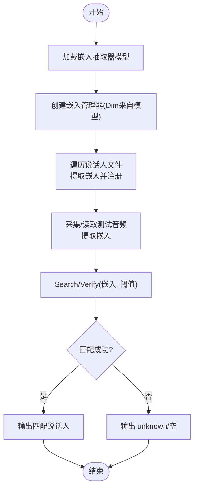

# 说话人比对与识别

<cite>
**本文引用的文件**
- [sherpa-onnx/csrc/speaker-embedding-manager.h](file://sherpa-onnx/csrc/speaker-embedding-manager.h)
- [sherpa-onnx/csrc/speaker-embedding-manager.cc](file://sherpa-onnx/csrc/speaker-embedding-manager.cc)
- [sherpa-onnx/csrc/speaker-embedding-extractor.h](file://sherpa-onnx/csrc/speaker-embedding-extractor.h)
- [sherpa-onnx/csrc/speaker-embedding-extractor.cc](file://sherpa-onnx/csrc/speaker-embedding-extractor.cc)
- [sherpa-onnx/csrc/speaker-embedding-extractor-model.cc](file://sherpa-onnx/csrc/speaker-embedding-extractor-model.cc)
- [python-api-examples/speaker-identification.py](file://python-api-examples/speaker-identification.py)
- [java-api-examples/SpeakerIdentification.java](file://java-api-examples/SpeakerIdentification.java)
- [nodejs-addon-examples/test_speaker_identification.js](file://nodejs-addon-examples/test_speaker_identification.js)
- [dart-api-examples/speaker-identification/bin/speaker_id.dart](file://dart-api-examples/speaker-identification/bin/speaker_id.dart)
- [harmony-os/SherpaOnnxHar/sherpa_onnx/src/main/ets/components/SpeakerIdentification.ets](file://harmony-os/SherpaOnnxHar/sherpa_onnx/src/main/ets/components/SpeakerIdentification.ets)
- [sherpa-onnx/csrc/speaker-embedding-manager-test.cc](file://sherpa-onnx/csrc/speaker-embedding-manager-test.cc)
</cite>

## 目录
1. [简介](#简介)
2. [项目结构](#项目结构)
3. [核心组件](#核心组件)
4. [架构总览](#架构总览)
5. [详细组件分析](#详细组件分析)
6. [依赖关系分析](#依赖关系分析)
7. [性能考量](#性能考量)
8. [故障排查指南](#故障排查指南)
9. [结论](#结论)
10. [附录](#附录)

## 简介
本文件围绕“说话人比对与识别”主题，系统性梳理 sherpa-onnx 中的说话人嵌入抽取与管理能力，重点说明以下内容：
- SpeakerEmbeddingManager 的职责与接口：注册说话人、存储与管理已注册说话人的嵌入库、基于余弦相似度进行比对与验证。
- 比对算法与阈值策略：如何通过阈值控制识别结果的可信度；支持单匹配与多匹配查询。
- 完整 API 使用流程：从准备模型与数据、提取嵌入、注册说话人、到执行比对与验证。
- 实际应用挑战与优化建议：环境噪声、短语音、跨设备录音等带来的影响及应对策略。

## 项目结构
围绕说话人识别的关键代码主要位于 C++ 核心实现与多语言示例之间：
- C++ 层：嵌入抽取器与管理器的定义与实现，负责模型加载、特征计算、嵌入归一化、相似度计算与阈值判定。
- 多语言示例：Python、Java、Node.js、Dart、HarmonyOS 等平台的完整使用流程示例，展示如何注册说话人、提取嵌入、执行比对与验证。

图表来源
- [sherpa-onnx/csrc/speaker-embedding-extractor.h](file://sherpa-onnx/csrc/speaker-embedding-extractor.h#L1-L72)
- [sherpa-onnx/csrc/speaker-embedding-extractor.cc](file://sherpa-onnx/csrc/speaker-embedding-extractor.cc#L1-L101)
- [sherpa-onnx/csrc/speaker-embedding-extractor-model.cc](file://sherpa-onnx/csrc/speaker-embedding-extractor-model.cc#L1-L161)
- [sherpa-onnx/csrc/speaker-embedding-manager.h](file://sherpa-onnx/csrc/speaker-embedding-manager.h#L1-L121)
- [sherpa-onnx/csrc/speaker-embedding-manager.cc](file://sherpa-onnx/csrc/speaker-embedding-manager.cc#L1-L289)
- [python-api-examples/speaker-identification.py](file://python-api-examples/speaker-identification.py#L1-L261)
- [java-api-examples/SpeakerIdentification.java](file://java-api-examples/SpeakerIdentification.java#L1-L133)
- [nodejs-addon-examples/test_speaker_identification.js](file://nodejs-addon-examples/test_speaker_identification.js#L1-L103)
- [dart-api-examples/speaker-identification/bin/speaker_id.dart](file://dart-api-examples/speaker-identification/bin/speaker_id.dart#L1-L161)
- [harmony-os/SherpaOnnxHar/sherpa_onnx/src/main/ets/components/SpeakerIdentification.ets](file://harmony-os/SherpaOnnxHar/sherpa_onnx/src/main/ets/components/SpeakerIdentification.ets#L41-L135)

章节来源
- [sherpa-onnx/csrc/speaker-embedding-extractor.h](file://sherpa-onnx/csrc/speaker-embedding-extractor.h#L1-L72)
- [sherpa-onnx/csrc/speaker-embedding-extractor.cc](file://sherpa-onnx/csrc/speaker-embedding-extractor.cc#L1-L101)
- [sherpa-onnx/csrc/speaker-embedding-extractor-model.cc](file://sherpa-onnx/csrc/speaker-embedding-extractor-model.cc#L1-L161)
- [sherpa-onnx/csrc/speaker-embedding-manager.h](file://sherpa-onnx/csrc/speaker-embedding-manager.h#L1-L121)
- [sherpa-onnx/csrc/speaker-embedding-manager.cc](file://sherpa-onnx/csrc/speaker-embedding-manager.cc#L1-L289)
- [python-api-examples/speaker-identification.py](file://python-api-examples/speaker-identification.py#L1-L261)
- [java-api-examples/SpeakerIdentification.java](file://java-api-examples/SpeakerIdentification.java#L1-L133)
- [nodejs-addon-examples/test_speaker_identification.js](file://nodejs-addon-examples/test_speaker_identification.js#L1-L103)
- [dart-api-examples/speaker-identification/bin/speaker_id.dart](file://dart-api-examples/speaker-identification/bin/speaker_id.dart#L1-L161)
- [harmony-os/SherpaOnnxHar/sherpa_onnx/src/main/ets/components/SpeakerIdentification.ets](file://harmony-os/SherpaOnnxHar/sherpa_onnx/src/main/ets/components/SpeakerIdentification.ets#L41-L135)

## 核心组件
- 说话人嵌入抽取器（SpeakerEmbeddingExtractor）
  - 负责加载 ONNX 模型、创建在线流、判断是否可计算嵌入、计算嵌入向量。
  - 提供维度信息（Dim）用于初始化管理器。
- 说话人嵌入管理器（SpeakerEmbeddingManager）
  - 维护一个说话人名称到嵌入向量的映射，内部以归一化的嵌入矩阵存储。
  - 支持添加/删除说话人、按阈值搜索最佳匹配、验证指定说话人、查询所有说话人、统计数量与维度等。
- 示例脚本与 SDK
  - 多语言示例展示了从准备模型、提取嵌入、注册说话人、到比对与验证的完整流程。

章节来源
- [sherpa-onnx/csrc/speaker-embedding-extractor.h](file://sherpa-onnx/csrc/speaker-embedding-extractor.h#L1-L72)
- [sherpa-onnx/csrc/speaker-embedding-extractor.cc](file://sherpa-onnx/csrc/speaker-embedding-extractor.cc#L1-L101)
- [sherpa-onnx/csrc/speaker-embedding-manager.h](file://sherpa-onnx/csrc/speaker-embedding-manager.h#L1-L121)
- [sherpa-onnx/csrc/speaker-embedding-manager.cc](file://sherpa-onnx/csrc/speaker-embedding-manager.cc#L1-L289)
- [python-api-examples/speaker-identification.py](file://python-api-examples/speaker-identification.py#L1-L261)
- [java-api-examples/SpeakerIdentification.java](file://java-api-examples/SpeakerIdentification.java#L1-L133)
- [nodejs-addon-examples/test_speaker_identification.js](file://nodejs-addon-examples/test_speaker_identification.js#L1-L103)
- [dart-api-examples/speaker-identification/bin/speaker_id.dart](file://dart-api-examples/speaker-identification/bin/speaker_id.dart#L1-L161)
- [harmony-os/SherpaOnnxHar/sherpa_onnx/src/main/ets/components/SpeakerIdentification.ets](file://harmony-os/SherpaOnnxHar/sherpa_onnx/src/main/ets/components/SpeakerIdentification.ets#L41-L135)

## 架构总览
下图展示了从音频输入到说话人识别的整体流程：先用嵌入抽取器生成归一化嵌入，再由管理器进行阈值比对与匹配。

图表来源
- [sherpa-onnx/csrc/speaker-embedding-extractor.h](file://sherpa-onnx/csrc/speaker-embedding-extractor.h#L1-L72)
- [sherpa-onnx/csrc/speaker-embedding-extractor.cc](file://sherpa-onnx/csrc/speaker-embedding-extractor.cc#L1-L101)
- [sherpa-onnx/csrc/speaker-embedding-manager.h](file://sherpa-onnx/csrc/speaker-embedding-manager.h#L1-L121)
- [sherpa-onnx/csrc/speaker-embedding-manager.cc](file://sherpa-onnx/csrc/speaker-embedding-manager.cc#L117-L169)

## 详细组件分析

### 组件A：SpeakerEmbeddingManager 类
- 主要职责
  - 注册说话人：支持单嵌入注册与多嵌入平均后注册两种方式。
  - 存储与管理：内部以归一化嵌入矩阵存储，维护名称到行索引的映射。
  - 比对与验证：Search 返回最高分且不低于阈值的说话人；Verify 对指定说话人进行阈值验证；GetBestMatches 返回前 n 名匹配。
  - 查询与维护：Contains、NumSpeakers、Dim、GetAllSpeakers、Remove。
- 关键实现要点
  - 嵌入归一化：输入与库内向量均进行 L2 归一化，相似度为余弦相似度。
  - 余弦相似度计算：通过矩阵乘法批量计算得分，随后筛选阈值以上项。
  - 多嵌入注册：对多个嵌入求和（不除以样本数），再统一归一化，避免平均后再归一化导致的偏差。
  - 删除操作：通过行位移与映射更新，保持名称与行索引一致。

图表来源
- [sherpa-onnx/csrc/speaker-embedding-manager.h](file://sherpa-onnx/csrc/speaker-embedding-manager.h#L1-L121)
- [sherpa-onnx/csrc/speaker-embedding-manager.cc](file://sherpa-onnx/csrc/speaker-embedding-manager.cc#L1-L289)

章节来源
- [sherpa-onnx/csrc/speaker-embedding-manager.h](file://sherpa-onnx/csrc/speaker-embedding-manager.h#L1-L121)
- [sherpa-onnx/csrc/speaker-embedding-manager.cc](file://sherpa-onnx/csrc/speaker-embedding-manager.cc#L1-L289)

### 组件B：SpeakerEmbeddingExtractor 与模型元数据
- 功能概述
  - 加载 ONNX 模型，提供 Dim、CreateStream、IsReady、Compute 接口。
  - 通过模型元数据读取输出维度、采样率、是否归一化样本、特征归一化类型、框架类型等信息。
- 重要点
  - 输出维度（Dim）用于初始化 SpeakerEmbeddingManager。
  - 模型元数据包含框架类型（wespeaker 或 3d-speaker），确保兼容性。
  - Compute 返回的嵌入在管理器侧会被再次归一化，保证一致性。

图表来源
- [sherpa-onnx/csrc/speaker-embedding-extractor.h](file://sherpa-onnx/csrc/speaker-embedding-extractor.h#L1-L72)
- [sherpa-onnx/csrc/speaker-embedding-extractor.cc](file://sherpa-onnx/csrc/speaker-embedding-extractor.cc#L1-L101)
- [sherpa-onnx/csrc/speaker-embedding-extractor-model.cc](file://sherpa-onnx/csrc/speaker-embedding-extractor-model.cc#L1-L161)

章节来源
- [sherpa-onnx/csrc/speaker-embedding-extractor.h](file://sherpa-onnx/csrc/speaker-embedding-extractor.h#L1-L72)
- [sherpa-onnx/csrc/speaker-embedding-extractor.cc](file://sherpa-onnx/csrc/speaker-embedding-extractor.cc#L1-L101)
- [sherpa-onnx/csrc/speaker-embedding-extractor-model.cc](file://sherpa-onnx/csrc/speaker-embedding-extractor-model.cc#L1-L161)

### 组件C：API 使用流程（多语言示例）
- Python 示例
  - 准备说话人文件列表（同一说话人可有多个音频），逐个提取嵌入并求平均，注册到管理器。
  - 从麦克风采集音频，提取嵌入后调用 Search 进行识别，未命中则标记为 unknown。
- Java 示例
  - 从多个 enroll 文件提取嵌入，使用 addMulti 注册；随后对 test 文件逐一比对，支持 verify 与 remove。
- Node.js/Dart/HarmonyOS 示例
  - 同样遵循“提取嵌入 -> 注册 -> 搜索/验证”的流程，参数包含阈值与嵌入向量。

图表来源
- [python-api-examples/speaker-identification.py](file://python-api-examples/speaker-identification.py#L1-L261)
- [java-api-examples/SpeakerIdentification.java](file://java-api-examples/SpeakerIdentification.java#L1-L133)
- [nodejs-addon-examples/test_speaker_identification.js](file://nodejs-addon-examples/test_speaker_identification.js#L1-L103)
- [dart-api-examples/speaker-identification/bin/speaker_id.dart](file://dart-api-examples/speaker-identification/bin/speaker_id.dart#L1-L161)
- [harmony-os/SherpaOnnxHar/sherpa_onnx/src/main/ets/components/SpeakerIdentification.ets](file://harmony-os/SherpaOnnxHar/sherpa_onnx/src/main/ets/components/SpeakerIdentification.ets#L41-L135)

章节来源
- [python-api-examples/speaker-identification.py](file://python-api-examples/speaker-identification.py#L1-L261)
- [java-api-examples/SpeakerIdentification.java](file://java-api-examples/SpeakerIdentification.java#L1-L133)
- [nodejs-addon-examples/test_speaker_identification.js](file://nodejs-addon-examples/test_speaker_identification.js#L1-L103)
- [dart-api-examples/speaker-identification/bin/speaker_id.dart](file://dart-api-examples/speaker-identification/bin/speaker_id.dart#L1-L161)
- [harmony-os/SherpaOnnxHar/sherpa_onnx/src/main/ets/components/SpeakerIdentification.ets](file://harmony-os/SherpaOnnxHar/sherpa_onnx/src/main/ets/components/SpeakerIdentification.ets#L41-L135)

## 依赖关系分析
- 抽取器依赖 ONNX 会话与模型元数据解析，确保输出维度与模型属性正确。
- 管理器依赖 Eigen 矩阵运算进行批量相似度计算与阈值筛选。
- 多语言示例通过各自 SDK 封装调用上述 C++ 接口，形成端到端的识别链路。

图表来源
- [sherpa-onnx/csrc/speaker-embedding-extractor.cc](file://sherpa-onnx/csrc/speaker-embedding-extractor.cc#L1-L101)
- [sherpa-onnx/csrc/speaker-embedding-extractor-model.cc](file://sherpa-onnx/csrc/speaker-embedding-extractor-model.cc#L1-L161)
- [sherpa-onnx/csrc/speaker-embedding-manager.cc](file://sherpa-onnx/csrc/speaker-embedding-manager.cc#L1-L289)
- [python-api-examples/speaker-identification.py](file://python-api-examples/speaker-identification.py#L1-L261)
- [java-api-examples/SpeakerIdentification.java](file://java-api-examples/SpeakerIdentification.java#L1-L133)
- [nodejs-addon-examples/test_speaker_identification.js](file://nodejs-addon-examples/test_speaker_identification.js#L1-L103)
- [dart-api-examples/speaker-identification/bin/speaker_id.dart](file://dart-api-examples/speaker-identification/bin/speaker_id.dart#L1-L161)
- [harmony-os/SherpaOnnxHar/sherpa_onnx/src/main/ets/components/SpeakerIdentification.ets](file://harmony-os/SherpaOnnxHar/sherpa_onnx/src/main/ets/components/SpeakerIdentification.ets#L41-L135)

章节来源
- [sherpa-onnx/csrc/speaker-embedding-extractor.cc](file://sherpa-onnx/csrc/speaker-embedding-extractor.cc#L1-L101)
- [sherpa-onnx/csrc/speaker-embedding-extractor-model.cc](file://sherpa-onnx/csrc/speaker-embedding-extractor-model.cc#L1-L161)
- [sherpa-onnx/csrc/speaker-embedding-manager.cc](file://sherpa-onnx/csrc/speaker-embedding-manager.cc#L1-L289)
- [python-api-examples/speaker-identification.py](file://python-api-examples/speaker-identification.py#L1-L261)
- [java-api-examples/SpeakerIdentification.java](file://java-api-examples/SpeakerIdentification.java#L1-L133)
- [nodejs-addon-examples/test_speaker_identification.js](file://nodejs-addon-examples/test_speaker_identification.js#L1-L103)
- [dart-api-examples/speaker-identification/bin/speaker_id.dart](file://dart-api-examples/speaker-identification/bin/speaker_id.dart#L1-L161)
- [harmony-os/SherpaOnnxHar/sherpa_onnx/src/main/ets/components/SpeakerIdentification.ets](file://harmony-os/SherpaOnnxHar/sherpa_onnx/src/main/ets/components/SpeakerIdentification.ets#L41-L135)

## 性能考量
- 嵌入归一化
  - 输入与库内向量均进行 L2 归一化，确保余弦相似度稳定，减少尺度差异影响。
- 批量相似度计算
  - 使用矩阵乘法一次性计算所有候选的相似度，时间复杂度近似 O(N×D)，其中 N 为注册人数，D 为嵌入维度。
- 多嵌入平均策略
  - 对同一说话人的多个嵌入求和后统一归一化，避免多次平均引入的数值误差。
- 阈值选择
  - 阈值越高，误识率越低但漏识率上升；阈值过低则误识率上升。需结合具体场景与数据集进行调优。
- 线程与算力
  - 可通过配置 num_threads 与 provider（CPU/CUDA/CoreML）提升推理速度，注意不同平台支持情况。

章节来源
- [sherpa-onnx/csrc/speaker-embedding-manager.cc](file://sherpa-onnx/csrc/speaker-embedding-manager.cc#L117-L169)
- [sherpa-onnx/csrc/speaker-embedding-extractor.cc](file://sherpa-onnx/csrc/speaker-embedding-extractor.cc#L1-L101)
- [python-api-examples/speaker-identification.py](file://python-api-examples/speaker-identification.py#L1-L261)

## 故障排查指南
- 常见问题与定位
  - 注册失败：当同名说话人已存在时，Add 返回失败。请检查名称唯一性或先 Remove 再 Add。
  - 比对无结果：阈值过高或测试音频质量差（短、静音、噪声大）。尝试降低阈值或优化音频。
  - 维度不匹配：注册嵌入维度与模型 Dim 不一致会导致失败。请确认模型与音频预处理一致。
  - 未就绪：Compute 前需确保 IsReady 返回 true，否则应继续喂入音频帧。
- 单元测试参考
  - Search/Verify 行为可通过单元测试验证，便于快速定位阈值与匹配逻辑问题。

章节来源
- [sherpa-onnx/csrc/speaker-embedding-manager.cc](file://sherpa-onnx/csrc/speaker-embedding-manager.cc#L25-L115)
- [sherpa-onnx/csrc/speaker-embedding-manager-test.cc](file://sherpa-onnx/csrc/speaker-embedding-manager-test.cc#L50-L150)
- [sherpa-onnx/csrc/speaker-embedding-extractor.cc](file://sherpa-onnx/csrc/speaker-embedding-extractor.cc#L1-L101)

## 结论
- SpeakerEmbeddingManager 提供了简洁高效的说话人注册、存储与比对能力，底层以余弦相似度与阈值策略为核心，适合在多语言 SDK 中快速集成。
- 通过多嵌入平均与嵌入归一化，系统在鲁棒性方面具备一定优势；结合合适的阈值与预处理，可在真实场景中取得良好效果。
- 建议在部署前完成阈值校准与数据清洗，针对短语音与跨设备录音场景进行针对性优化。

## 附录

### API 使用流程清单（路径指引）
- 准备模型与抽取器
  - 创建抽取器配置并实例化抽取器，获取 Dim。
  - 参考路径：[speaker-embedding-extractor.h](file://sherpa-onnx/csrc/speaker-embedding-extractor.h#L1-L72)、[speaker-embedding-extractor.cc](file://sherpa-onnx/csrc/speaker-embedding-extractor.cc#L1-L101)
- 注册说话人
  - 单嵌入注册：Add(name, embedding)
  - 多嵌入平均注册：Add(name, embedding_list)
  - 参考路径：[speaker-embedding-manager.h](file://sherpa-onnx/csrc/speaker-embedding-manager.h#L1-L121)、[speaker-embedding-manager.cc](file://sherpa-onnx/csrc/speaker-embedding-manager.cc#L25-L115)
- 执行比对与验证
  - 识别：Search(embedding, threshold)
  - 验证：Verify(name, embedding, threshold)
  - 获取前 n 名：GetBestMatches(embedding, threshold, n)
  - 参考路径：[speaker-embedding-manager.h](file://sherpa-onnx/csrc/speaker-embedding-manager.h#L1-L121)、[speaker-embedding-manager.cc](file://sherpa-onnx/csrc/speaker-embedding-manager.cc#L117-L169)
- 多语言示例
  - Python：[speaker-identification.py](file://python-api-examples/speaker-identification.py#L1-L261)
  - Java：[SpeakerIdentification.java](file://java-api-examples/SpeakerIdentification.java#L1-L133)
  - Node.js：[test_speaker_identification.js](file://nodejs-addon-examples/test_speaker_identification.js#L1-L103)
  - Dart：[speaker_id.dart](file://dart-api-examples/speaker-identification/bin/speaker_id.dart#L1-L161)
  - HarmonyOS：[SpeakerIdentification.ets](file://harmony-os/SherpaOnnxHar/sherpa_onnx/src/main/ets/components/SpeakerIdentification.ets#L41-L135)