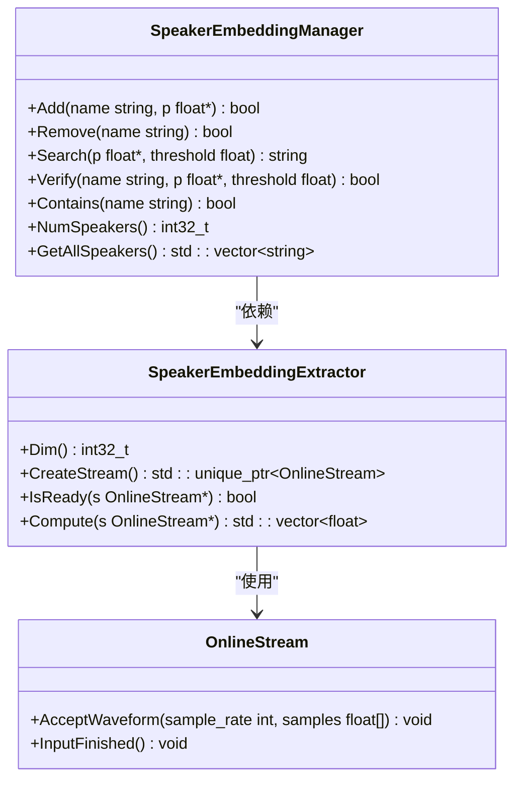
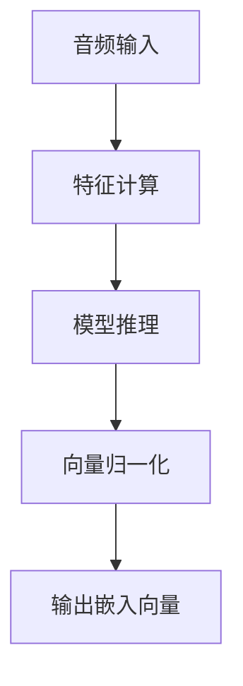
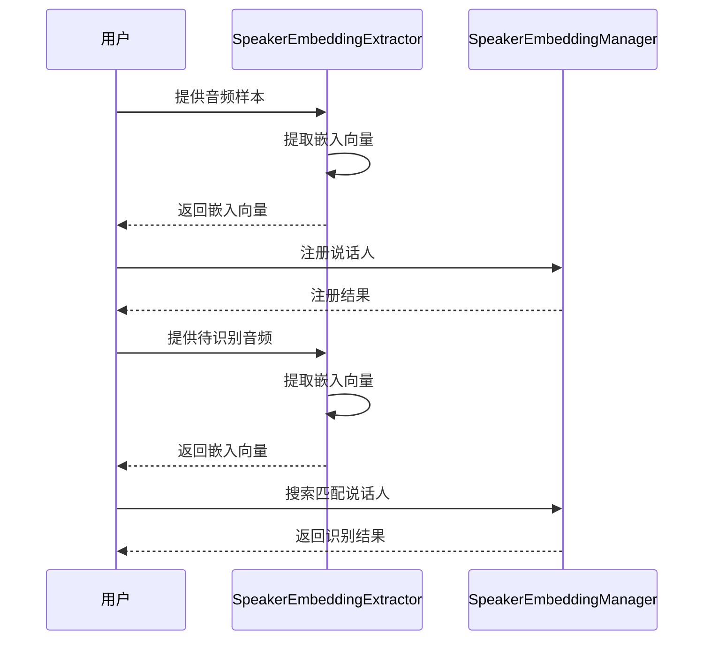
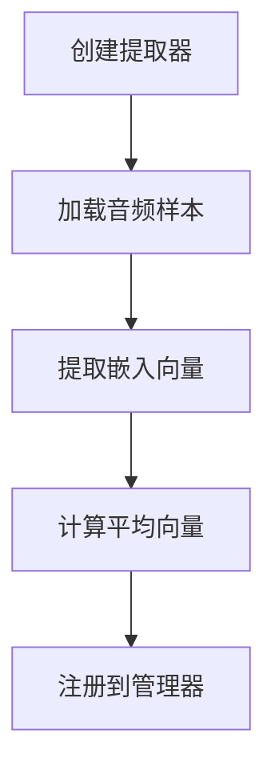
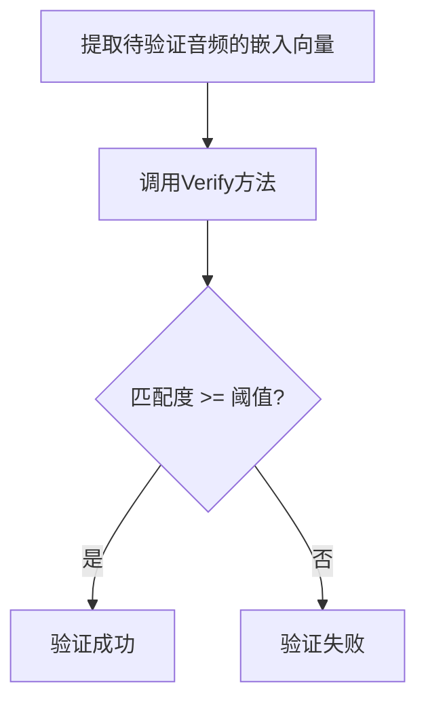
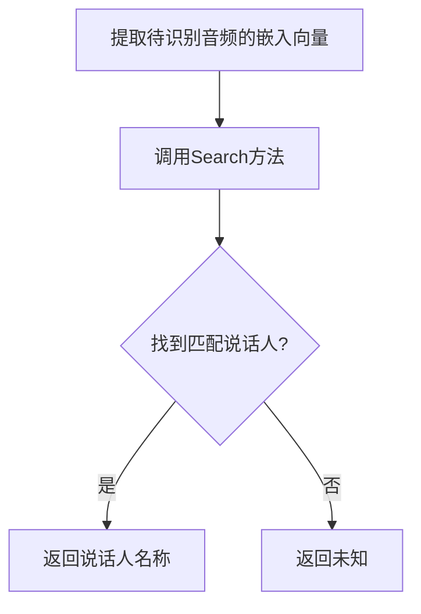
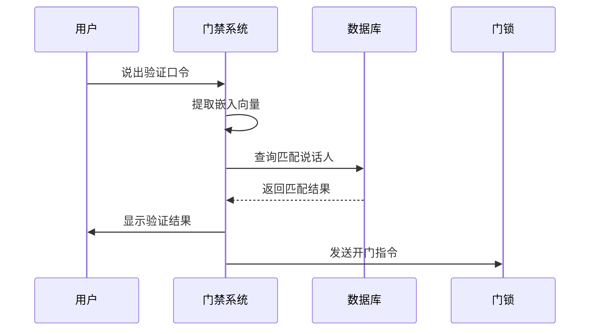
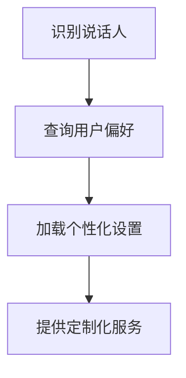

# 说话人识别

<cite>
**本文档引用的文件**
- [speaker-embedding-extractor.h](file://sherpa-onnx/csrc/speaker-embedding-extractor.h)
- [speaker-embedding-extractor.cc](file://sherpa-onnx/csrc/speaker-embedding-extractor.cc)
- [speaker-embedding-manager.h](file://sherpa-onnx/csrc/speaker-embedding-manager.h)
- [speaker-embedding-manager.cc](file://sherpa-onnx/csrc/speaker-embedding-manager.cc)
- [speaker-identification.py](file://python-api-examples/speaker-identification.py)
- [speaker-identification-with-vad.py](file://python-api-examples/speaker-identification-with-vad.py)
- [speaker-embedding-extractor-impl.h](file://sherpa-onnx/csrc/speaker-embedding-extractor-impl.h)
- [speaker-embedding-extractor-impl.cc](file://sherpa-onnx/csrc/speaker-embedding-extractor-impl.cc)
- [speaker-embedding-extractor-model.h](file://sherpa-onnx/csrc/speaker-embedding-extractor-model.h)
- [speaker-embedding-extractor-model.cc](file://sherpa-onnx/csrc/speaker-embedding-extractor-model.cc)
</cite>

## 目录
1. [引言](#引言)
2. [核心组件](#核心组件)
3. [技术流程](#技术流程)
4. [配置参数说明](#配置参数说明)
5. [API使用方法](#api使用方法)
6. [实际应用场景](#实际应用场景)
7. [结论](#结论)

## 引言
sherpa-onnx项目提供了强大的说话人识别功能，通过深度学习模型从音频中提取说话人特征向量，实现说话人比对和识别。该功能主要由说话人嵌入提取器（SpeakerEmbeddingExtractor）和说话人嵌入管理器（SpeakerEmbeddingManager）两个核心组件构成。本文档将深入探讨这两个组件的实现机制，详细描述从音频中提取说话人特征向量的技术流程，以及如何进行说话人比对和识别。

## 核心组件

### 说话人嵌入提取器（SpeakerEmbeddingExtractor）
说话人嵌入提取器是sherpa-onnx中用于从音频流中提取说话人特征向量的核心组件。它通过深度神经网络模型将音频信号转换为固定维度的向量表示，这些向量能够捕捉说话人的声学特征。

**主要功能：**
- **特征提取**：从音频流中提取说话人特征
- **模型加载**：支持多种说话人识别模型，如WeSpeaker、3D-Speaker和NeMo
- **多平台支持**：支持在CPU、CUDA和CoreML等不同硬件平台上运行

**关键方法：**
- `CreateStream()`：创建用于处理音频流的流对象
- `IsReady()`：检查流中是否有足够的特征帧用于计算嵌入
- `Compute()`：计算说话人嵌入向量

**Section sources**
- [speaker-embedding-extractor.h](file://sherpa-onnx/csrc/speaker-embedding-extractor.h#L38-L67)
- [speaker-embedding-extractor.cc](file://sherpa-onnx/csrc/speaker-embedding-extractor.cc#L65-L88)

### 说话人嵌入管理器（SpeakerEmbeddingManager）
说话人嵌入管理器负责管理和维护注册的说话人信息，提供说话人识别和验证功能。它将提取的说话人嵌入向量与已注册的说话人进行比对，实现说话人识别。

**主要功能：**
- **说话人注册**：添加新的说话人及其嵌入向量
- **说话人识别**：通过比对嵌入向量识别说话人
- **说话人验证**：验证给定音频是否属于特定说话人
- **说话人管理**：支持添加、删除和查询说话人信息

**关键方法：**
- `Add()`：添加说话人及其嵌入向量
- `Remove()`：删除指定说话人
- `Search()`：搜索与给定嵌入向量最匹配的说话人
- `Verify()`：验证给定嵌入向量是否属于特定说话人

**Diagram sources**
- [speaker-embedding-extractor.h](file://sherpa-onnx/csrc/speaker-embedding-extractor.h#L38-L67)
- [speaker-embedding-manager.h](file://sherpa-onnx/csrc/speaker-embedding-manager.h#L19-L116)

**Section sources**
- [speaker-embedding-manager.h](file://sherpa-onnx/csrc/speaker-embedding-manager.h#L19-L116)
- [speaker-embedding-manager.cc](file://sherpa-onnx/csrc/speaker-embedding-manager.cc#L214-L286)

## 技术流程

### 说话人特征提取流程
说话人特征提取流程主要包括以下几个步骤：

1. **音频输入**：接收原始音频数据
2. **特征计算**：将音频转换为声学特征
3. **模型推理**：通过深度神经网络模型计算嵌入向量
4. **向量归一化**：对提取的嵌入向量进行归一化处理

**Diagram sources**
- [speaker-embedding-extractor-impl.cc](file://sherpa-onnx/csrc/speaker-embedding-extractor-impl.cc#L87-L111)
- [speaker-embedding-extractor-model.cc](file://sherpa-onnx/csrc/speaker-embedding-extractor-model.cc#L146-L148)

### 说话人识别流程
说话人识别流程主要包括注册和识别两个阶段：

1. **注册阶段**：
   - 收集说话人的多个音频样本
   - 提取每个样本的嵌入向量
   - 计算平均嵌入向量并注册到管理器

2. **识别阶段**：
   - 提取待识别音频的嵌入向量
   - 与注册库中的所有说话人进行比对
   - 返回匹配度最高的说话人

**Diagram sources**
- [speaker-identification.py](file://python-api-examples/speaker-identification.py#L204-L213)
- [speaker-embedding-manager.cc](file://sherpa-onnx/csrc/speaker-embedding-manager.cc#L254-L257)

## 配置参数说明

### 说话人嵌入提取器配置
说话人嵌入提取器的配置参数定义在`SpeakerEmbeddingExtractorConfig`结构体中：

| 参数 | 类型 | 默认值 | 说明 |
|------|------|--------|------|
| model | string | 无 | 说话人嵌入模型文件路径 |
| num_threads | int32_t | 1 | 神经网络计算线程数 |
| debug | bool | false | 是否打印调试信息 |
| provider | string | "cpu" | 指定运行设备：cpu、cuda、coreml |

**Section sources**
- [speaker-embedding-extractor.h](file://sherpa-onnx/csrc/speaker-embedding-extractor.h#L17-L34)

### 模型元数据
模型文件中包含重要的元数据信息，这些信息在加载模型时被读取：

| 元数据 | 说明 |
|--------|------|
| output_dim | 输出嵌入向量的维度 |
| sample_rate | 模型期望的采样率 |
| normalize_samples | 是否需要对输入样本进行归一化 |
| language | 模型支持的语言（zh表示中文，en表示英文） |
| framework | 模型框架（wespeaker、3d-speaker、nemo） |

**Section sources**
- [speaker-embedding-extractor-model.cc](file://sherpa-onnx/csrc/speaker-embedding-extractor-model.cc#L89-L100)

## API使用方法

### 注册新说话人
注册新说话人需要以下步骤：

1. 创建说话人嵌入提取器
2. 加载说话人的音频样本
3. 提取每个样本的嵌入向量
4. 将嵌入向量添加到管理器

**Section sources**
- [speaker-identification.py](file://python-api-examples/speaker-identification.py#L204-L213)

### 验证说话人
验证说话人身份的流程如下：

1. 提取待验证音频的嵌入向量
2. 调用管理器的Verify方法
3. 根据返回结果判断是否匹配

**Section sources**
- [speaker-embedding-manager.h](file://sherpa-onnx/csrc/speaker-embedding-manager.h#L99-L100)

### 识别说话人
说话人识别的主要步骤：

1. 提取待识别音频的嵌入向量
2. 调用管理器的Search方法
3. 根据返回的说话人名称进行识别

**Section sources**
- [speaker-embedding-manager.h](file://sherpa-onnx/csrc/speaker-embedding-manager.h#L68-L69)

## 实际应用场景

### 门禁系统
在门禁系统中，说话人识别可以用于身份验证：

1. **注册阶段**：用户录入自己的语音样本
2. **验证阶段**：用户说出预设口令，系统验证身份
3. **控制阶段**：根据验证结果决定是否开门

**Diagram sources**
- [speaker-identification.py](file://python-api-examples/speaker-identification.py#L247-L250)

### 个性化服务
在个性化服务场景中，系统可以根据识别的说话人提供定制化服务：

1. **识别阶段**：系统识别当前说话人
2. **查询阶段**：根据说话人身份查询个性化设置
3. **服务阶段**：提供定制化的服务内容

**Section sources**
- [speaker-identification-with-vad.py](file://python-api-examples/speaker-identification-with-vad.py#L265-L268)

## 结论
sherpa-onnx的说话人识别功能通过说话人嵌入提取器和管理器的协同工作，实现了高效的说话人识别。系统支持多种模型框架，具有良好的跨平台兼容性。通过合理的配置和使用，可以在门禁系统、个性化服务等多种场景中发挥重要作用。未来可以进一步优化模型性能，提高识别准确率，并支持更多应用场景。