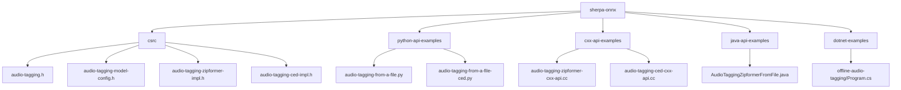
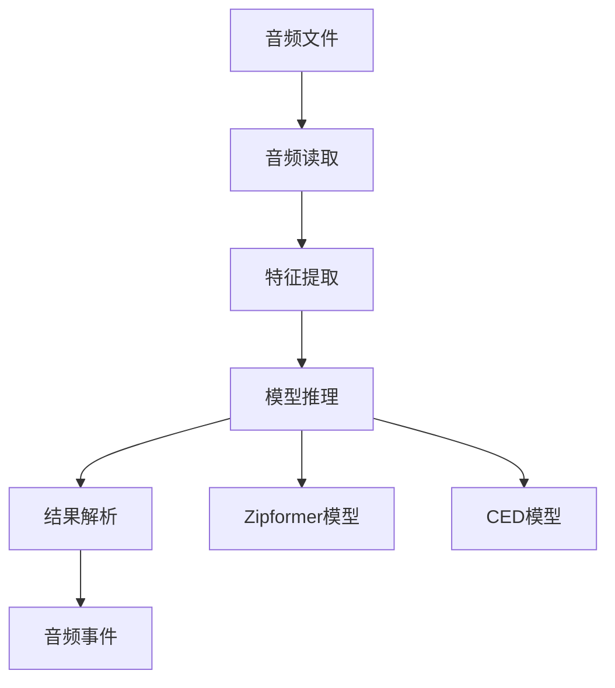
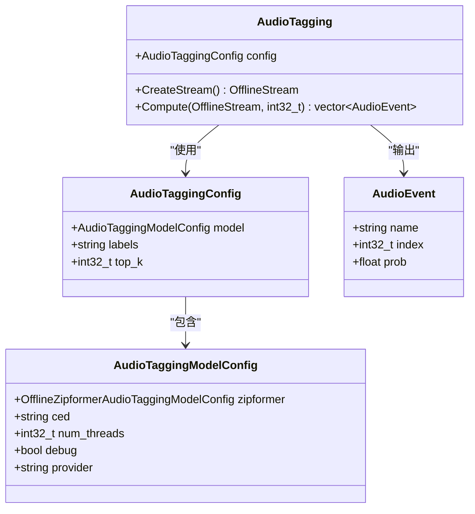
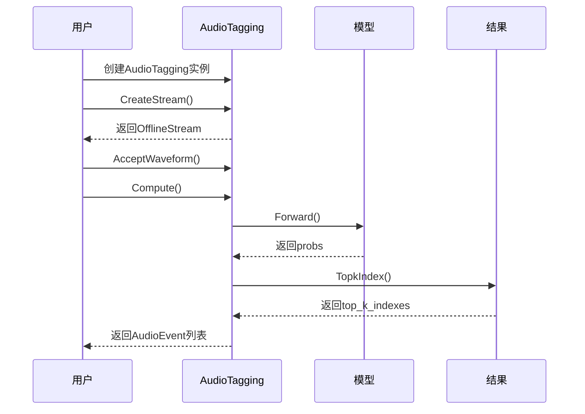
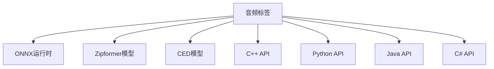

# 音频标签

<cite>
**本文档中引用的文件**  
- [audio-tagging.h](file://sherpa-onnx/csrc/audio-tagging.h)
- [audio-tagging-model-config.h](file://sherpa-onnx/csrc/audio-tagging-model-config.h)
- [audio-tagging-zipformer-impl.h](file://sherpa-onnx/csrc/audio-tagging-zipformer-impl.h)
- [audio-tagging-ced-impl.h](file://sherpa-onnx/csrc/audio-tagging-ced-impl.h)
- [offline-zipformer-audio-tagging-model.h](file://sherpa-onnx/csrc/offline-zipformer-audio-tagging-model.h)
- [audio-tagging-from-a-file.py](file://python-api-examples/audio-tagging-from-a-file.py)
- [audio-tagging-from-a-file-ced.py](file://python-api-examples/audio-tagging-from-a-file-ced.py)
- [audio-tagging-zipformer-cxx-api.cc](file://cxx-api-examples/audio-tagging-zipformer-cxx-api.cc)
- [audio-tagging-ced-cxx-api.cc](file://cxx-api-examples/audio-tagging-ced-cxx-api.cc)
- [audio-tagging-c-api.c](file://c-api-examples/audio-tagging-c-api.c)
- [AudioTaggingConfig.java](file://java-api-examples/AudioTaggingZipformerFromFile.java)
- [audio_tagging.dart](file://flutter/sherpa_onnx/lib/src/audio_tagging.dart)
</cite>

## 目录
1. [简介](#简介)
2. [项目结构](#项目结构)
3. [核心组件](#核心组件)
4. [架构概述](#架构概述)
5. [详细组件分析](#详细组件分析)
6. [依赖分析](#依赖分析)
7. [性能考虑](#性能考虑)
8. [故障排除指南](#故障排除指南)
9. [结论](#结论)

## 简介
音频标签功能是sherpa-onnx项目中的一个重要特性，它利用先进的深度学习模型如CED（Convolutional Encoder-Decoder）和Zipformer来实现音频事件分类。该功能能够识别环境声音并进行音频场景分析，广泛应用于智能家居和安防监控等领域。通过加载预训练的ONNX模型，音频标签器可以对输入的音频文件进行处理，输出包含标签名称、索引和置信度的概率列表。用户可以根据需要选择不同的模型，并自定义标签集以适应特定的应用场景。

## 项目结构
音频标签功能在sherpa-onnx项目中具有清晰的目录结构，主要分布在`csrc`、`python-api-examples`、`cxx-api-examples`等目录下。`csrc`目录包含了核心的C++实现代码，而`python-api-examples`和`cxx-api-examples`则提供了不同编程语言的使用示例。

**图源**  
- [audio-tagging.h](file://sherpa-onnx/csrc/audio-tagging.h)
- [audio-tagging-model-config.h](file://sherpa-onnx/csrc/audio-tagging-model-config.h)
- [audio-tagging-zipformer-impl.h](file://sherpa-onnx/csrc/audio-tagging-zipformer-impl.h)
- [audio-tagging-ced-impl.h](file://sherpa-onnx/csrc/audio-tagging-ced-impl.h)
- [audio-tagging-from-a-file.py](file://python-api-examples/audio-tagging-from-a-file.py)
- [audio-tagging-from-a-file-ced.py](file://python-api-examples/audio-tagging-from-a-file-ced.py)
- [audio-tagging-zipformer-cxx-api.cc](file://cxx-api-examples/audio-tagging-zipformer-cxx-api.cc)
- [audio-tagging-ced-cxx-api.cc](file://cxx-api-examples/audio-tagging-ced-cxx-api.cc)
- [AudioTaggingZipformerFromFile.java](file://java-api-examples/AudioTaggingZipformerFromFile.java)
- [Program.cs](file://dotnet-examples/offline-audio-tagging/Program.cs)

**节源**  
- [audio-tagging.h](file://sherpa-onnx/csrc/audio-tagging.h)
- [audio-tagging-model-config.h](file://sherpa-onnx/csrc/audio-tagging-model-config.h)
- [audio-tagging-zipformer-impl.h](file://sherpa-onnx/csrc/audio-tagging-zipformer-impl.h)
- [audio-tagging-ced-impl.h](file://sherpa-onnx/csrc/audio-tagging-ced-impl.h)
- [audio-tagging-from-a-file.py](file://python-api-examples/audio-tagging-from-a-file.py)
- [audio-tagging-from-a-file-ced.py](file://python-api-examples/audio-tagging-from-a-file-ced.py)
- [audio-tagging-zipformer-cxx-api.cc](file://cxx-api-examples/audio-tagging-zipformer-cxx-api.cc)
- [audio-tagging-ced-cxx-api.cc](file://cxx-api-examples/audio-tagging-ced-cxx-api.cc)
- [AudioTaggingZipformerFromFile.java](file://java-api-examples/AudioTaggingZipformerFromFile.java)
- [Program.cs](file://dotnet-examples/offline-audio-tagging/Program.cs)

## 核心组件
音频标签功能的核心组件包括`AudioTagging`类、`AudioTaggingModelConfig`结构体以及`AudioEvent`结构体。`AudioTagging`类负责创建音频流并计算音频事件，`AudioTaggingModelConfig`用于配置模型参数，而`AudioEvent`则表示识别出的音频事件，包含事件名称、索引和置信度。

**节源**  
- [audio-tagging.h](file://sherpa-onnx/csrc/audio-tagging.h)
- [audio-tagging-model-config.h](file://sherpa-onnx/csrc/audio-tagging-model-config.h)

## 架构概述
音频标签功能的架构设计基于ONNX运行时，支持多种深度学习模型，如CED和Zipformer。系统通过加载预训练的ONNX模型，将音频文件转换为特征向量，然后输入模型进行推理，最终输出音频事件的分类结果。整个过程包括音频读取、特征提取、模型推理和结果解析。

**图源**  
- [audio-tagging.h](file://sherpa-onnx/csrc/audio-tagging.h)
- [audio-tagging-zipformer-impl.h](file://sherpa-onnx/csrc/audio-tagging-zipformer-impl.h)
- [audio-tagging-ced-impl.h](file://sherpa-onnx/csrc/audio-tagging-ced-impl.h)

## 详细组件分析
### AudioTagging类分析
`AudioTagging`类是音频标签功能的核心，提供了创建音频流和计算音频事件的方法。用户可以通过配置`AudioTaggingConfig`来指定使用的模型和标签文件。

#### 类图

**图源**  
- [audio-tagging.h](file://sherpa-onnx/csrc/audio-tagging.h)
- [audio-tagging-model-config.h](file://sherpa-onnx/csrc/audio-tagging-model-config.h)

#### 序列图

**图源**  
- [audio-tagging.h](file://sherpa-onnx/csrc/audio-tagging.h)
- [audio-tagging-zipformer-impl.h](file://sherpa-onnx/csrc/audio-tagging-zipformer-impl.h)
- [audio-tagging-ced-impl.h](file://sherpa-onnx/csrc/audio-tagging-ced-impl.h)

### 配置参数说明
音频标签功能支持多种配置参数，包括模型路径、标签文件路径、线程数、调试模式和提供者。用户可以通过设置这些参数来优化模型的性能和准确性。

**节源**  
- [audio-tagging-model-config.h](file://sherpa-onnx/csrc/audio-tagging-model-config.h)
- [audio-tagging.h](file://sherpa-onnx/csrc/audio-tagging.h)

### 自定义标签集和多标签识别
用户可以通过提供自定义的标签文件来自定义标签集。标签文件通常是一个CSV文件，包含事件名称和对应的索引。音频标签功能支持多标签识别，可以同时识别多个音频事件，并返回每个事件的置信度。

**节源**  
- [audio-tagging-label-file.h](file://sherpa-onnx/csrc/audio-tagging-label-file.h)
- [audio-tagging.h](file://sherpa-onnx/csrc/audio-tagging.h)

## 依赖分析
音频标签功能依赖于ONNX运行时和相关的深度学习模型。项目中使用了多种编程语言的API，包括C++、Python、Java、C#等，确保了跨平台的兼容性。

**图源**  
- [audio-tagging.h](file://sherpa-onnx/csrc/audio-tagging.h)
- [audio-tagging-model-config.h](file://sherpa-onnx/csrc/audio-tagging-model-config.h)
- [audio-tagging-zipformer-impl.h](file://sherpa-onnx/csrc/audio-tagging-zipformer-impl.h)
- [audio-tagging-ced-impl.h](file://sherpa-onnx/csrc/audio-tagging-ced-impl.h)

**节源**  
- [audio-tagging.h](file://sherpa-onnx/csrc/audio-tagging.h)
- [audio-tagging-model-config.h](file://sherpa-onnx/csrc/audio-tagging-model-config.h)
- [audio-tagging-zipformer-impl.h](file://sherpa-onnx/csrc/audio-tagging-zipformer-impl.h)
- [audio-tagging-ced-impl.h](file://sherpa-onnx/csrc/audio-tagging-ced-impl.h)

## 性能考虑
音频标签功能在设计时考虑了性能优化，支持多线程处理和GPU加速。用户可以通过设置`num_threads`和`provider`参数来调整模型的运行性能。此外，模型的推理速度和内存占用也是影响性能的重要因素。

## 故障排除指南
在使用音频标签功能时，可能会遇到模型加载失败、音频文件读取错误等问题。建议检查模型文件路径是否正确，音频文件格式是否支持，以及系统环境是否满足要求。

**节源**  
- [audio-tagging.h](file://sherpa-onnx/csrc/audio-tagging.h)
- [audio-tagging-model-config.h](file://sherpa-onnx/csrc/audio-tagging-model-config.h)

## 结论
音频标签功能通过集成CED和Zipformer等先进模型，实现了高效的音频事件分类。其灵活的配置选项和多语言API支持使其适用于各种应用场景，如智能家居和安防监控。通过合理配置参数和优化模型性能，用户可以获得准确的音频标签结果。