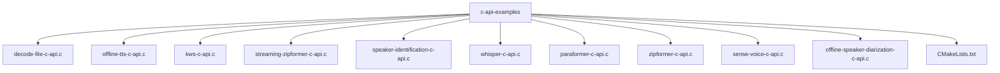

# C API 示例

<cite>
**本文档中引用的文件**  
- [decode-file-c-api.c](file://c-api-examples/decode-file-c-api.c)
- [offline-tts-c-api.c](file://c-api-examples/offline-tts-c-api.c)
- [kws-c-api.c](file://c-api-examples/kws-c-api.c)
- [streaming-zipformer-c-api.c](file://c-api-examples/streaming-zipformer-c-api.c)
- [speaker-identification-c-api.c](file://c-api-examples/speaker-identification-c-api.c)
- [whisper-c-api.c](file://c-api-examples/whisper-c-api.c)
- [paraformer-c-api.c](file://c-api-examples/paraformer-c-api.c)
- [zipformer-c-api.c](file://c-api-examples/zipformer-c-api.c)
- [sense-voice-c-api.c](file://c-api-examples/sense-voice-c-api.c)
- [offline-speaker-diarization-c-api.c](file://c-api-examples/offline-speaker-diarization-c-api.c)
- [CMakeLists.txt](file://c-api-examples/CMakeLists.txt)
- [c-api.h](file://sherpa-onnx/c-api/c-api.h)
</cite>

## 目录
1. [简介](#简介)
2. [项目结构](#项目结构)
3. [核心功能示例](#核心功能示例)
4. [C API 设计理念](#c-api-设计理念)
5. [编译与构建](#编译与构建)
6. [常见问题与性能优化](#常见问题与性能优化)

## 简介

sherpa-onnx 是一个用于语音处理的开源工具包，提供了丰富的 C API 示例代码，涵盖了语音识别、关键词检测、语音合成、说话人识别等多种功能。这些示例代码展示了如何使用 C API 进行非流式和流式语音识别、关键词检测、语音合成、说话人识别等任务。通过这些示例，开发者可以快速上手并集成到自己的项目中。

**Section sources**
- [README.md](file://c-api-examples/README.md)

## 项目结构

sherpa-onnx 项目的 C API 示例代码位于 `c-api-examples` 目录下，包含了多个示例文件，每个文件对应不同的功能。这些示例文件包括非流式语音识别、流式语音识别、关键词检测、语音合成、说话人识别等。此外，还包括了 CMake 构建脚本，用于编译和运行这些示例。



**Diagram sources**
- [c-api-examples](file://c-api-examples)

**Section sources**
- [c-api-examples](file://c-api-examples)

## 核心功能示例

### 非流式语音识别

非流式语音识别示例展示了如何使用 C API 对整个音频文件进行语音识别。以 `decode-file-c-api.c` 为例，该示例使用了流式转换器模型，通过分块处理音频数据，逐步解码并输出识别结果。关键函数包括 `SherpaOnnxCreateOnlineRecognizer` 用于创建识别器，`SherpaOnnxCreateOnlineStream` 用于创建流，以及 `SherpaOnnxDecodeOnlineStream` 用于解码流。

**Section sources**
- [decode-file-c-api.c](file://c-api-examples/decode-file-c-api.c)

### 流式语音识别

流式语音识别示例展示了如何实时处理音频流。以 `streaming-zipformer-c-api.c` 为例，该示例使用了 Zipformer 模型，通过不断接收新的音频数据块，实时更新识别结果。关键函数包括 `SherpaOnnxOnlineStreamAcceptWaveform` 用于接受新的音频数据，`SherpaOnnxIsOnlineStreamReady` 用于检查流是否准备好解码，以及 `SherpaOnnxGetOnlineStreamResult` 用于获取当前的识别结果。

**Section sources**
- [streaming-zipformer-c-api.c](file://c-api-examples/streaming-zipformer-c-api.c)

### 关键词检测

关键词检测示例展示了如何在音频流中检测特定的关键词。以 `kws-c-api.c` 为例，该示例使用了 Zipformer 模型，通过预定义的关键词文件，实时检测音频中的关键词。关键函数包括 `SherpaOnnxCreateKeywordSpotter` 用于创建关键词检测器，`SherpaOnnxCreateKeywordStream` 用于创建关键词流，以及 `SherpaOnnxGetKeywordResult` 用于获取检测到的关键词。

**Section sources**
- [kws-c-api.c](file://c-api-examples/kws-c-api.c)

### 语音合成

语音合成示例展示了如何将文本转换为语音。以 `offline-tts-c-api.c` 为例，该示例使用了 VITS 模型，通过输入文本生成对应的语音文件。关键函数包括 `SherpaOnnxCreateOfflineTts` 用于创建语音合成器，`SherpaOnnxOfflineTtsGenerate` 用于生成语音，以及 `SherpaOnnxWriteWave` 用于将生成的音频写入文件。

**Section sources**
- [offline-tts-c-api.c](file://c-api-examples/offline-tts-c-api.c)

### 说话人识别

说话人识别示例展示了如何识别音频中的说话人。以 `speaker-identification-c-api.c` 为例，该示例使用了 3D Speaker 模型，通过提取音频的嵌入特征，与已知说话人的嵌入特征进行比较，从而识别出说话人。关键函数包括 `SherpaOnnxCreateSpeakerEmbeddingExtractor` 用于创建嵌入提取器，`SherpaOnnxSpeakerEmbeddingExtractorComputeEmbedding` 用于计算嵌入特征，以及 `SherpaOnnxSpeakerEmbeddingManagerSearch` 用于搜索匹配的说话人。

**Section sources**
- [speaker-identification-c-api.c](file://c-api-examples/speaker-identification-c-api.c)

## C API 设计理念

sherpa-onnx 的 C API 设计旨在提供简洁、高效且易于使用的接口，以便开发者能够快速集成语音处理功能。C API 与 C++ API 之间存在紧密的关系，C API 实际上是对 C++ API 的封装，提供了更底层的访问方式。这种设计使得 C API 能够充分利用 C++ 的高性能特性，同时保持接口的简洁性和易用性。

**Section sources**
- [c-api.h](file://sherpa-onnx/c-api/c-api.h)

## 编译与构建

### CMakeLists.txt 配置

C API 示例的构建依赖于 CMake，`CMakeLists.txt` 文件中定义了各个示例的编译规则。例如，`decode-file-c-api` 示例的编译规则如下：

```cmake
add_executable(decode-file-c-api decode-file-c-api.c)
target_link_libraries(decode-file-c-api sherpa-onnx-c-api cargs)
```

这里，`add_executable` 用于定义可执行文件，`target_link_libraries` 用于指定链接的库。

### 构建步骤

1. 确保已安装必要的依赖项，如 CMake 和编译器。
2. 在项目根目录下创建构建目录并进入该目录：
   ```bash
   mkdir build
   cd build
   ```
3. 运行 CMake 配置命令：
   ```bash
   cmake ..
   ```
4. 编译项目：
   ```bash
   make
   ```

完成上述步骤后，即可在构建目录中找到编译好的可执行文件。

**Section sources**
- [CMakeLists.txt](file://c-api-examples/CMakeLists.txt)

## 常见问题与性能优化

### 常见问题

1. **模型文件路径错误**：确保模型文件路径正确无误，特别是在使用相对路径时。
2. **音频格式不支持**：确保输入的音频文件格式被支持，通常支持 WAV 格式。
3. **内存不足**：对于大型模型或长时间音频，可能会遇到内存不足的问题，建议优化模型或减少音频长度。

### 性能优化建议

1. **多线程处理**：利用多线程提高处理速度，特别是在处理长音频时。
2. **模型优化**：选择合适的模型大小和精度，平衡性能和资源消耗。
3. **缓存机制**：对于重复使用的数据，可以考虑使用缓存机制，减少重复计算。

**Section sources**
- [decode-file-c-api.c](file://c-api-examples/decode-file-c-api.c)
- [offline-tts-c-api.c](file://c-api-examples/offline-tts-c-api.c)
- [kws-c-api.c](file://c-api-examples/kws-c-api.c)