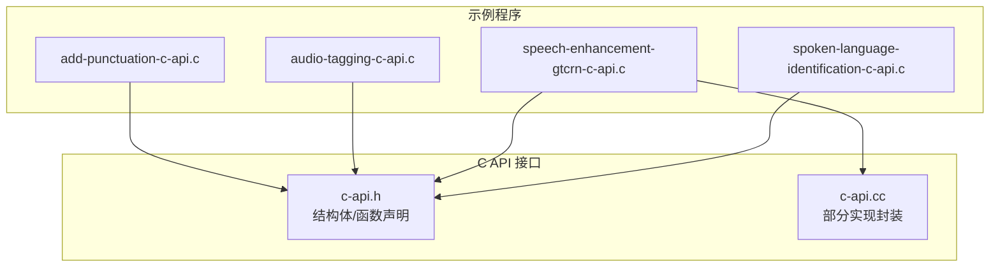
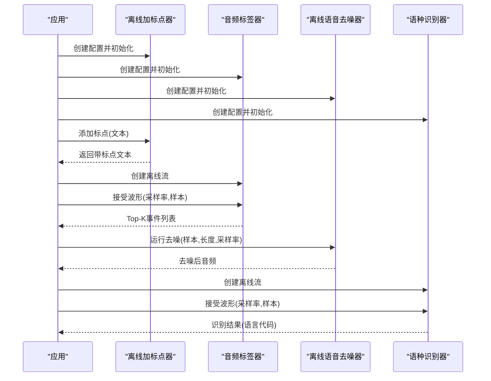
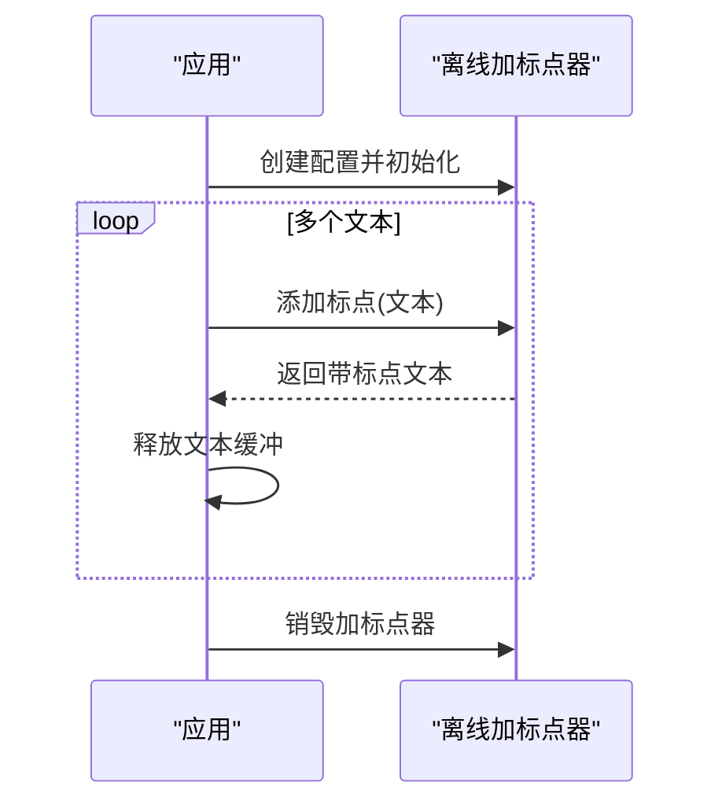
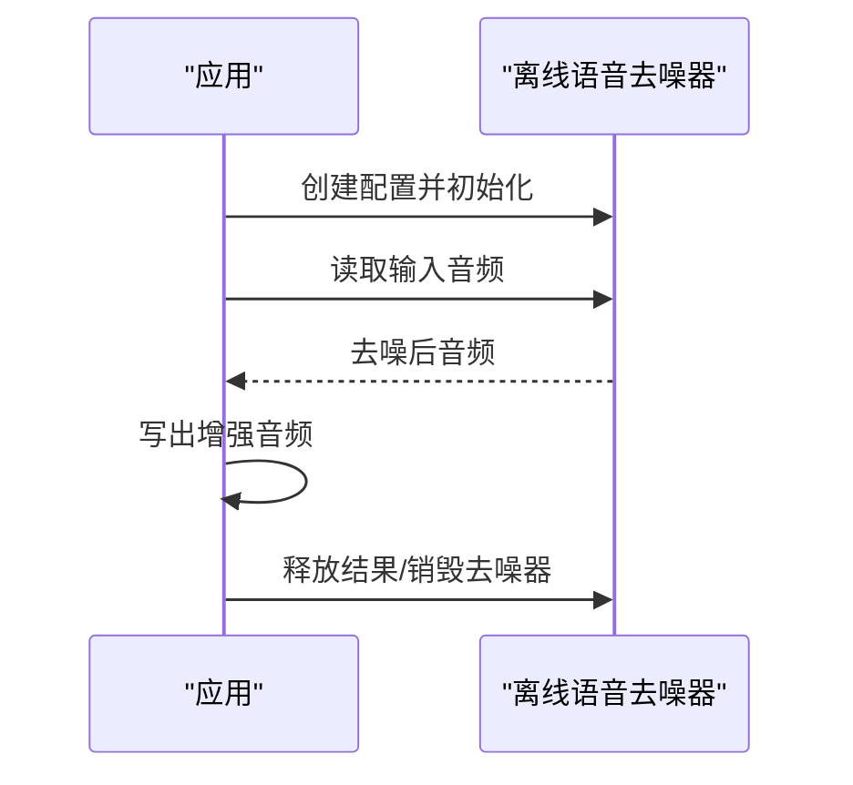
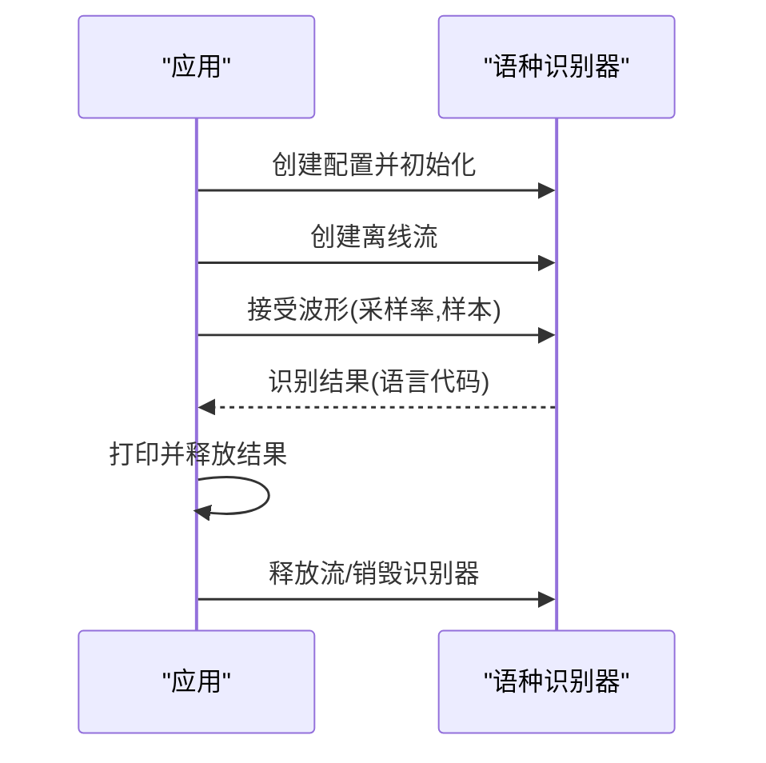
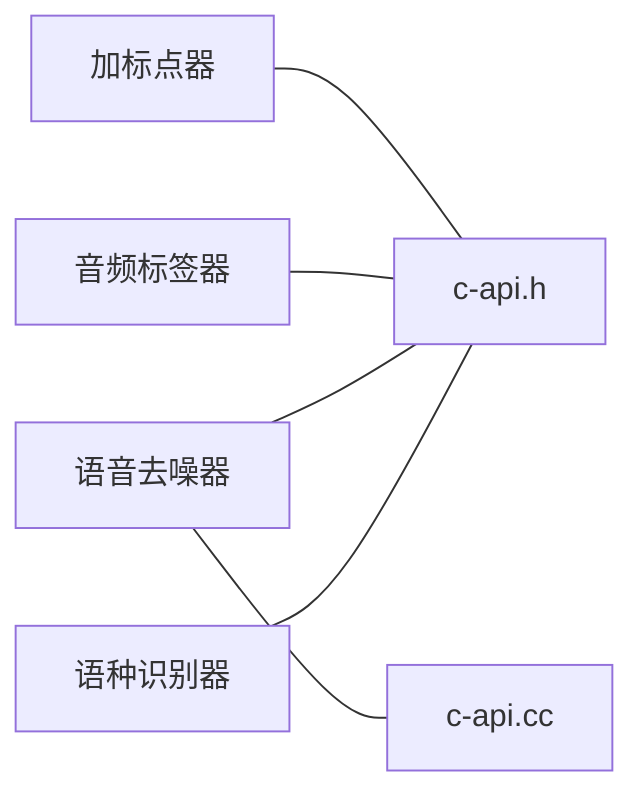

# 其他功能示例

<cite>
**本文引用的文件**
- [add-punctuation-c-api.c](file://c-api-examples/add-punctuation-c-api.c)
- [audio-tagging-c-api.c](file://c-api-examples/audio-tagging-c-api.c)
- [speech-enhancement-gtcrn-c-api.c](file://c-api-examples/speech-enhancement-gtcrn-c-api.c)
- [spoken-language-identification-c-api.c](file://c-api-examples/spoken-language-identification-c-api.c)
- [c-api.h](file://sherpa-onnx/c-api/c-api.h)
- [c-api.cc](file://sherpa-onnx/c-api/c-api.cc)
</cite>

## 目录
1. [简介](#简介)
2. [项目结构](#项目结构)
3. [核心组件](#核心组件)
4. [架构总览](#架构总览)
5. [详细组件分析](#详细组件分析)
6. [依赖关系分析](#依赖关系分析)
7. [性能与资源特性](#性能与资源特性)
8. [故障排查指南](#故障排查指南)
9. [结论](#结论)
10. [附录：输入输出与应用场景](#附录输入输出与应用场景)

## 简介
本文件面向使用 C API 的开发者，系统性解析 sherpa-onnx 提供的“其他功能示例”，包括：
- 文本加标点（离线）
- 音频标签（离线）
- 语音增强（离线，GTCRN 模型）
- 语种识别（离线，Whisper 多语言）

文档从代码结构、调用流程、数据类型、内存管理、错误处理等方面进行深入剖析，并给出输入输出格式说明与典型应用场景，帮助快速集成到内容审核、语音预处理与多语言支持等业务中。

## 项目结构
围绕本次目标，涉及的关键文件与模块如下：
- 示例程序：add-punctuation-c-api.c、audio-tagging-c-api.c、speech-enhancement-gtcrn-c-api.c、spoken-language-identification-c-api.c
- C API 头文件：sherpa-onnx/c-api/c-api.h（定义配置结构体、函数接口、返回数据结构）
- C API 实现：sherpa-onnx/c-api/c-api.cc（部分实现逻辑，如语音增强的运行封装）

图表来源
- [add-punctuation-c-api.c](file://c-api-examples/add-punctuation-c-api.c#L1-L68)
- [audio-tagging-c-api.c](file://c-api-examples/audio-tagging-c-api.c#L1-L80)
- [speech-enhancement-gtcrn-c-api.c](file://c-api-examples/speech-enhancement-gtcrn-c-api.c#L1-L56)
- [spoken-language-identification-c-api.c](file://c-api-examples/spoken-language-identification-c-api.c#L1-L69)
- [c-api.h](file://sherpa-onnx/c-api/c-api.h#L1200-L1400)
- [c-api.h](file://sherpa-onnx/c-api/c-api.h#L1500-L1700)
- [c-api.h](file://sherpa-onnx/c-api/c-api.h#L1783-L1840)
- [c-api.cc](file://sherpa-onnx/c-api/c-api.cc#L2153-L2204)

章节来源
- [add-punctuation-c-api.c](file://c-api-examples/add-punctuation-c-api.c#L1-L68)
- [audio-tagging-c-api.c](file://c-api-examples/audio-tagging-c-api.c#L1-L80)
- [speech-enhancement-gtcrn-c-api.c](file://c-api-examples/speech-enhancement-gtcrn-c-api.c#L1-L56)
- [spoken-language-identification-c-api.c](file://c-api-examples/spoken-language-identification-c-api.c#L1-L69)
- [c-api.h](file://sherpa-onnx/c-api/c-api.h#L1200-L1400)
- [c-api.h](file://sherpa-onnx/c-api/c-api.h#L1500-L1700)
- [c-api.h](file://sherpa-onnx/c-api/c-api.h#L1783-L1840)
- [c-api.cc](file://sherpa-onnx/c-api/c-api.cc#L2153-L2204)

## 核心组件
- 文本加标点（离线）
  - 关键接口：创建离线加标点器、添加标点、释放文本缓冲
  - 关键结构体：离线加标点配置、模型配置
- 音频标签（离线）
  - 关键接口：创建音频标签器、创建离线流、接受波形、计算Top-K事件、释放结果
  - 关键结构体：音频标签配置、事件结果
- 语音增强（离线，GTCRN）
  - 关键接口：创建离线语音去噪器、运行去噪、写入结果波形、释放结果
  - 关键结构体：GTCRN模型配置、离线语音去噪配置、去噪后音频
- 语种识别（离线，Whisper）
  - 关键接口：创建语种识别器、创建离线流、接受波形、计算结果、释放结果
  - 关键结构体：Whisper配置、语种识别配置、结果

章节来源
- [c-api.h](file://sherpa-onnx/c-api/c-api.h#L1500-L1700)
- [c-api.h](file://sherpa-onnx/c-api/c-api.h#L1783-L1840)
- [c-api.h](file://sherpa-onnx/c-api/c-api.h#L1232-L1286)
- [c-api.cc](file://sherpa-onnx/c-api/c-api.cc#L2153-L2204)

## 架构总览
下图展示四大功能在 C API 层的调用关系与数据流向：

图表来源
- [add-punctuation-c-api.c](file://c-api-examples/add-punctuation-c-api.c#L24-L68)
- [audio-tagging-c-api.c](file://c-api-examples/audio-tagging-c-api.c#L24-L79)
- [speech-enhancement-gtcrn-c-api.c](file://c-api-examples/speech-enhancement-gtcrn-c-api.c#L22-L56)
- [spoken-language-identification-c-api.c](file://c-api-examples/spoken-language-identification-c-api.c#L23-L69)
- [c-api.h](file://sherpa-onnx/c-api/c-api.h#L1500-L1700)
- [c-api.h](file://sherpa-onnx/c-api/c-api.h#L1783-L1840)
- [c-api.h](file://sherpa-onnx/c-api/c-api.h#L1232-L1286)

## 详细组件分析

### 文本加标点（离线）
- 功能概述
  - 使用离线加标点器对输入文本添加标点符号，支持中英混合文本。
- 关键流程
  - 初始化配置（模型路径、线程数、调试、执行提供者）
  - 创建离线加标点器实例
  - 对多个文本调用添加标点接口
  - 释放返回的文本缓冲
  - 销毁加标点器
- 输入输出
  - 输入：配置结构体（包含CT-Transformer模型路径等）、原始文本数组
  - 输出：带标点的文本字符串（需释放）
- 典型场景
  - 内容审核前的文本规范化
  - 生成更易读的转写文本
  - 与ASR流水线结合提升下游任务质量

图表来源
- [add-punctuation-c-api.c](file://c-api-examples/add-punctuation-c-api.c#L24-L68)
- [c-api.h](file://sherpa-onnx/c-api/c-api.h#L1547-L1577)

章节来源
- [add-punctuation-c-api.c](file://c-api-examples/add-punctuation-c-api.c#L24-L68)
- [c-api.h](file://sherpa-onnx/c-api/c-api.h#L1547-L1577)

### 音频标签（离线）
- 功能概述
  - 对音频片段进行分类打标，输出Top-K候选事件及其概率。
- 关键流程
  - 初始化音频标签配置（模型路径、线程数、调试、执行提供者、标签文件）
  - 创建音频标签器
  - 读取测试音频
  - 创建离线流并接受波形
  - 计算Top-K事件
  - 打印并释放结果
  - 释放资源
- 输入输出
  - 输入：配置结构体（模型、标签文件、Top-K）、音频文件路径
  - 输出：事件数组（名称、索引、概率）（需释放）
- 典型场景
  - 音频内容审核（音乐/语音/噪音/环境声）
  - 自动化媒体资产管理
  - 智能推荐与内容分类

图表来源
- [audio-tagging-c-api.c](file://c-api-examples/audio-tagging-c-api.c#L24-L79)
- [c-api.h](file://sherpa-onnx/c-api/c-api.h#L1500-L1541)

章节来源
- [audio-tagging-c-api.c](file://c-api-examples/audio-tagging-c-api.c#L24-L79)
- [c-api.h](file://sherpa-onnx/c-api/c-api.h#L1500-L1541)

### 语音增强（离线，GTCRN）
- 功能概述
  - 使用 GTCRN 模型对输入音频进行降噪增强，输出去噪后的音频。
- 关键流程
  - 初始化离线语音去噪配置（模型路径、线程数、调试、执行提供者）
  - 创建离线语音去噪器
  - 读取输入音频
  - 运行去噪
  - 写出增强后的音频
  - 释放结果与资源
- 输入输出
  - 输入：配置结构体（GTCRN模型）、音频文件路径
  - 输出：去噪后音频（样本、长度、采样率）（需释放）
- 典型场景
  - 语音预处理（提高ASR准确率）
  - 通话质量优化
  - 语音合成前的音频清洗

图表来源
- [speech-enhancement-gtcrn-c-api.c](file://c-api-examples/speech-enhancement-gtcrn-c-api.c#L22-L56)
- [c-api.h](file://sherpa-onnx/c-api/c-api.h#L1783-L1840)
- [c-api.cc](file://sherpa-onnx/c-api/c-api.cc#L2153-L2204)

章节来源
- [speech-enhancement-gtcrn-c-api.c](file://c-api-examples/speech-enhancement-gtcrn-c-api.c#L22-L56)
- [c-api.h](file://sherpa-onnx/c-api/c-api.h#L1783-L1840)
- [c-api.cc](file://sherpa-onnx/c-api/c-api.cc#L2153-L2204)

### 语种识别（离线，Whisper）
- 功能概述
  - 对音频流进行语种识别，输出主要语言代码。
- 关键流程
  - 初始化语种识别配置（Whisper编码器/解码器、线程数、调试、执行提供者）
  - 创建语种识别器
  - 读取测试音频
  - 创建离线流并接受波形
  - 计算识别结果
  - 打印并释放结果
  - 释放资源
- 输入输出
  - 输入：配置结构体（Whisper模型路径）、音频文件路径
  - 输出：语言代码字符串（需释放）
- 典型场景
  - 多语言内容分发与字幕生成
  - 语音助手的语言切换
  - 跨语言媒体内容的自动标注

图表来源
- [spoken-language-identification-c-api.c](file://c-api-examples/spoken-language-identification-c-api.c#L23-L69)
- [c-api.h](file://sherpa-onnx/c-api/c-api.h#L1232-L1286)

章节来源
- [spoken-language-identification-c-api.c](file://c-api-examples/spoken-language-identification-c-api.c#L23-L69)
- [c-api.h](file://sherpa-onnx/c-api/c-api.h#L1232-L1286)

## 依赖关系分析
- 组件耦合
  - 各功能均通过独立的配置结构体与工厂函数创建实例，彼此低耦合
  - 音频处理链路共享通用的波形读取与写入接口
- 外部依赖
  - Whisper 多语言模型用于语种识别
  - Zipformer 模型用于音频标签
  - GTCRN 模型用于语音增强
  - ONNX Runtime 作为执行提供者（可选CPU/CUDA等）
- 内存管理
  - 所有返回的指针型对象均需显式释放，避免内存泄漏
  - 文本/音频缓冲与结果数组均有对应的释放函数

图表来源
- [c-api.h](file://sherpa-onnx/c-api/c-api.h#L1200-L1400)
- [c-api.h](file://sherpa-onnx/c-api/c-api.h#L1500-L1700)
- [c-api.h](file://sherpa-onnx/c-api/c-api.h#L1783-L1840)
- [c-api.cc](file://sherpa-onnx/c-api/c-api.cc#L2153-L2204)

章节来源
- [c-api.h](file://sherpa-onnx/c-api/c-api.h#L1200-L1400)
- [c-api.h](file://sherpa-onnx/c-api/c-api.h#L1500-L1700)
- [c-api.h](file://sherpa-onnx/c-api/c-api.h#L1783-L1840)
- [c-api.cc](file://sherpa-onnx/c-api/c-api.cc#L2153-L2204)

## 性能与资源特性
- 线程与提供者
  - 可通过配置设置线程数与执行提供者，以平衡吞吐与延迟
- 采样率与缓冲
  - 语音增强与语种识别均要求输入音频具备正确的采样率；示例中使用标准采样率
- 内存占用
  - 结果数组与音频缓冲均为动态分配，务必及时释放
- I/O 开销
  - 音频文件读写与模型加载会带来额外开销，建议批量处理或复用实例

[本节为通用指导，不直接分析具体文件]

## 故障排查指南
- 常见问题
  - 配置字段缺失或路径错误：检查模型路径、标签文件路径、提供者名称
  - 未释放返回指针：导致内存泄漏；确保调用对应释放函数
  - 音频采样率不匹配：导致增强/识别失败；确认输入音频采样率
- 定位方法
  - 开启调试日志（配置中开启 debug）查看内部状态
  - 分步验证：先单独验证读取音频、再验证创建实例、最后验证推理
- 相关接口
  - 释放函数：释放文本、释放结果、释放波形、销毁实例等

章节来源
- [c-api.h](file://sherpa-onnx/c-api/c-api.h#L1200-L1400)
- [c-api.h](file://sherpa-onnx/c-api/c-api.h#L1500-L1700)
- [c-api.h](file://sherpa-onnx/c-api/c-api.h#L1783-L1840)

## 结论
本文基于 sherpa-onnx 的 C API，系统梳理了文本加标点、音频标签、语音增强与语种识别四类“其他功能示例”的实现要点与调用流程。通过统一的配置结构体、清晰的生命周期管理与稳定的接口契约，开发者可以快速将其集成到内容审核、语音预处理与多语言支持等实际场景中。建议在生产环境中关注内存释放、采样率一致性与提供者选择，以获得稳定且高性能的表现。

[本节为总结性内容，不直接分析具体文件]

## 附录：输入输出与应用场景

- 文本加标点（离线）
  - 输入：配置结构体（模型路径、线程数、调试、提供者）、原始文本数组
  - 输出：带标点文本（需释放）
  - 应用场景：内容审核、转写文本规范化、多语言文本处理

- 音频标签（离线）
  - 输入：配置结构体（模型、标签文件、Top-K）、音频文件路径
  - 输出：事件数组（名称、索引、概率，需释放）
  - 应用场景：音频内容审核、媒体资产管理、智能推荐

- 语音增强（离线，GTCRN）
  - 输入：配置结构体（GTCRN模型）、音频文件路径
  - 输出：去噪后音频（样本、长度、采样率，需释放）
  - 应用场景：ASR预处理、通话质量优化、语音合成前清洗

- 语种识别（离线，Whisper）
  - 输入：配置结构体（Whisper编码器/解码器、线程数、调试、提供者）、音频文件路径
  - 输出：语言代码字符串（需释放）
  - 应用场景：多语言内容分发、语音助手语言切换、跨语言媒体标注

章节来源
- [add-punctuation-c-api.c](file://c-api-examples/add-punctuation-c-api.c#L24-L68)
- [audio-tagging-c-api.c](file://c-api-examples/audio-tagging-c-api.c#L24-L79)
- [speech-enhancement-gtcrn-c-api.c](file://c-api-examples/speech-enhancement-gtcrn-c-api.c#L22-L56)
- [spoken-language-identification-c-api.c](file://c-api-examples/spoken-language-identification-c-api.c#L23-L69)
- [c-api.h](file://sherpa-onnx/c-api/c-api.h#L1232-L1286)
- [c-api.h](file://sherpa-onnx/c-api/c-api.h#L1500-L1541)
- [c-api.h](file://sherpa-onnx/c-api/c-api.h#L1783-L1840)