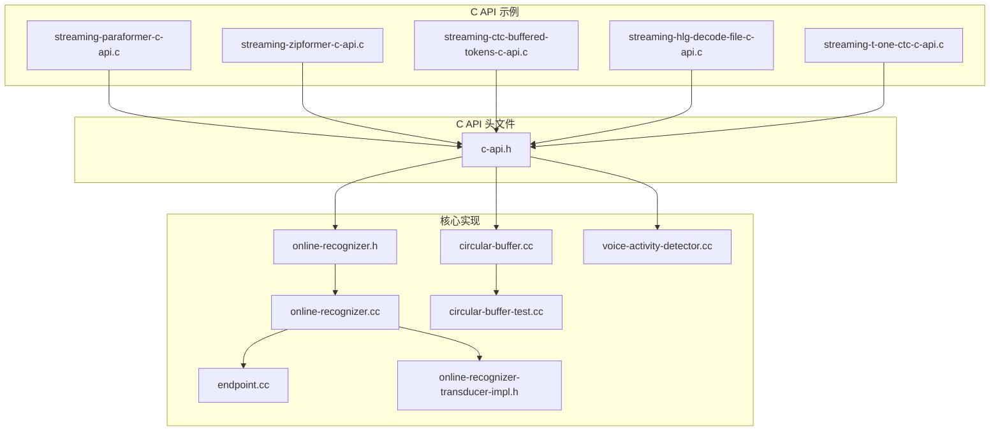
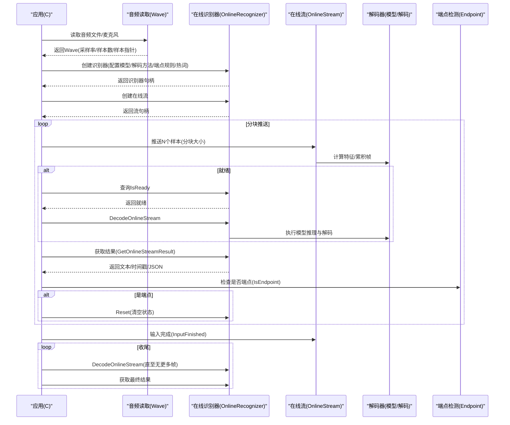
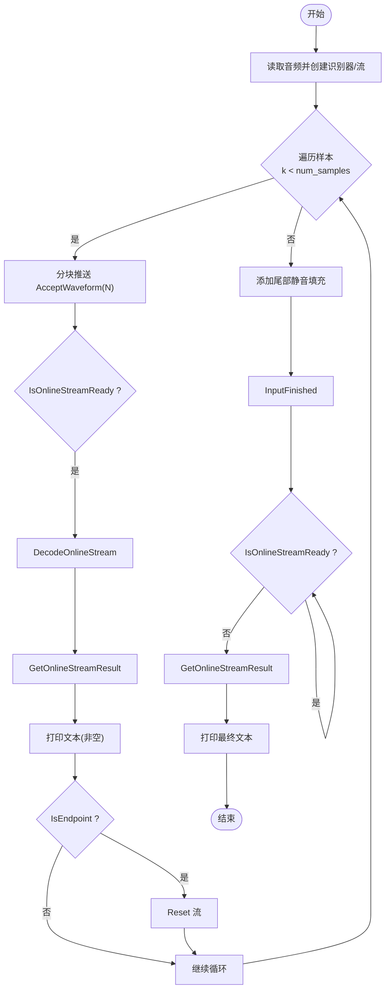
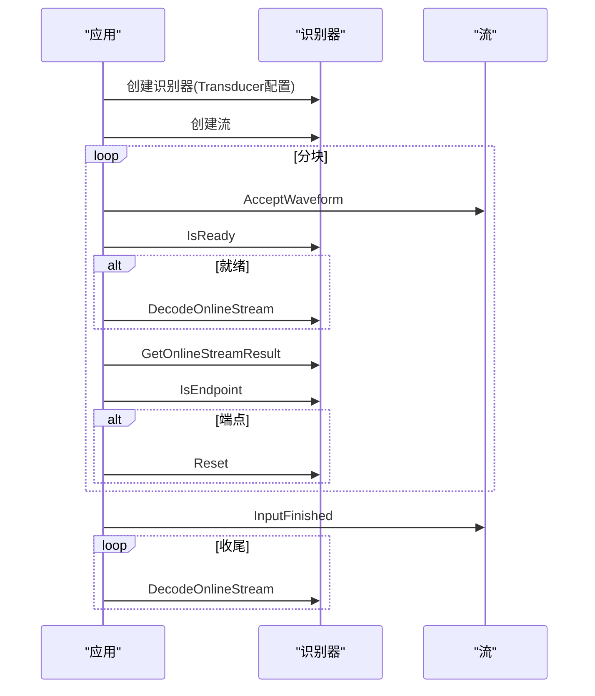
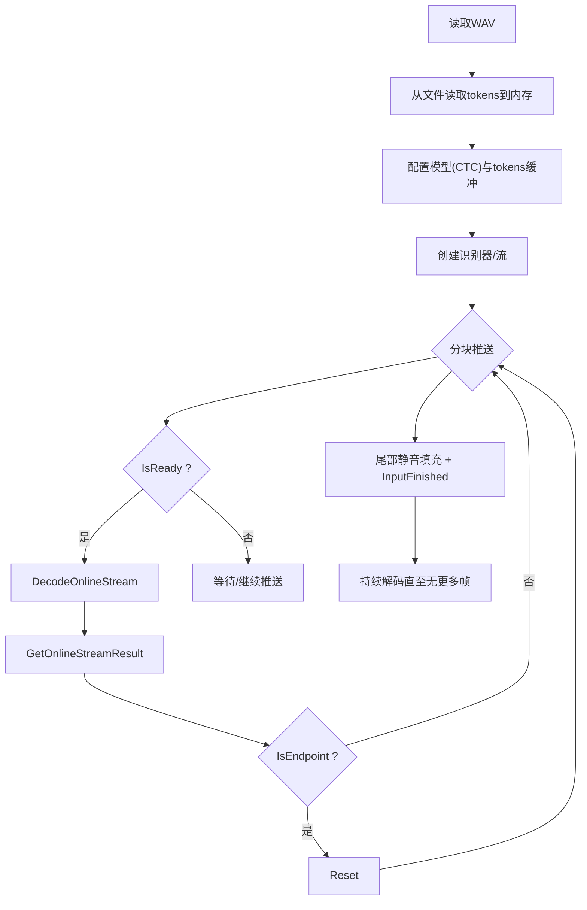
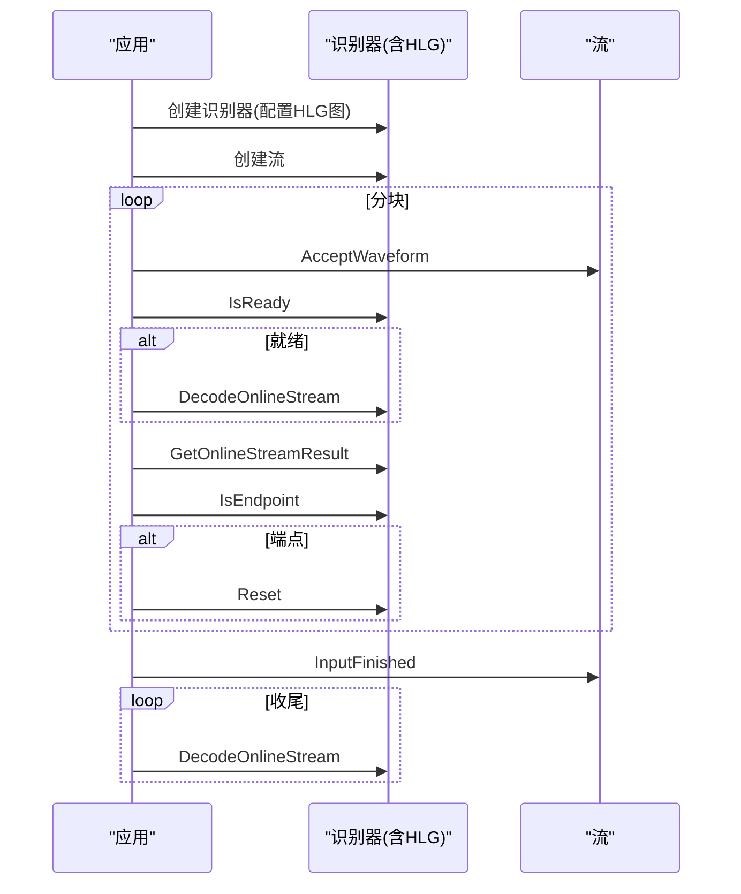
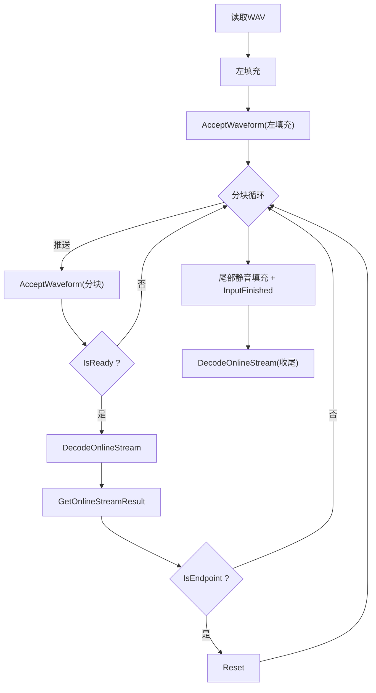
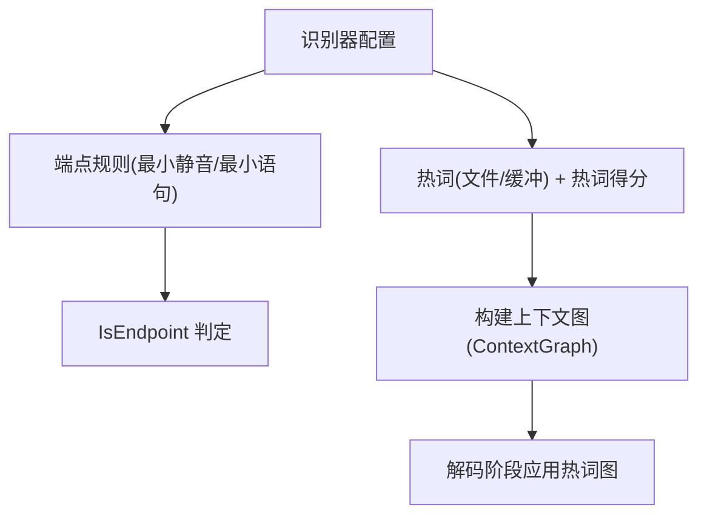
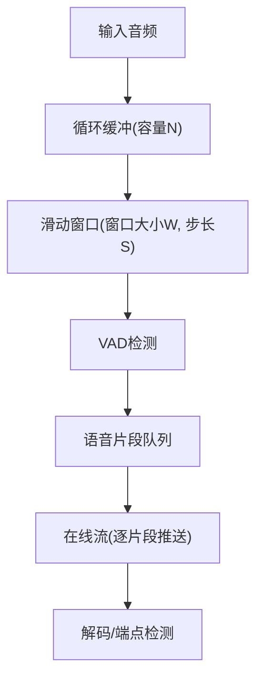
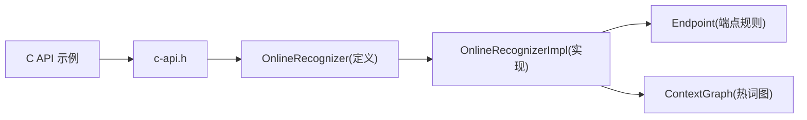

# 流式语音识别示例

<cite>
**本文引用的文件**
- [streaming-paraformer-c-api.c](file://c-api-examples/streaming-paraformer-c-api.c)
- [streaming-zipformer-c-api.c](file://c-api-examples/streaming-zipformer-c-api.c)
- [streaming-ctc-buffered-tokens-c-api.c](file://c-api-examples/streaming-ctc-buffered-tokens-c-api.c)
- [streaming-hlg-decode-file-c-api.c](file://c-api-examples/streaming-hlg-decode-file-c-api.c)
- [streaming-t-one-ctc-c-api.c](file://c-api-examples/streaming-t-one-ctc-c-api.c)
- [c-api.h](file://sherpa-onnx/c-api/c-api.h)
- [endpoint.cc](file://sherpa-onnx/csrc/endpoint.cc)
- [online-recognizer.h](file://sherpa-onnx/csrc/online-recognizer.h)
- [online-recognizer.cc](file://sherpa-onnx/csrc/online-recognizer.cc)
- [online-recognizer-transducer-impl.h](file://sherpa-onnx/csrc/online-recognizer-transducer-impl.h)
- [circular-buffer.cc](file://sherpa-onnx/csrc/circular-buffer.cc)
- [circular-buffer-test.cc](file://sherpa-onnx/csrc/circular-buffer-test.cc)
- [voice-activity-detector.cc](file://sherpa-onnx/csrc/voice-activity-detector.cc)
</cite>

## 目录
1. [简介](#简介)
2. [项目结构](#项目结构)
3. [核心组件](#核心组件)
4. [架构总览](#架构总览)
5. [详细组件分析](#详细组件分析)
6. [依赖关系分析](#依赖关系分析)
7. [性能与延迟优化](#性能与延迟优化)
8. [故障排查指南](#故障排查指南)
9. [结论](#结论)
10. [附录](#附录)

## 简介
本文件围绕 sherpa-onnx 的 C API 流式语音识别示例进行系统化解读，重点覆盖以下主题：
- 流式 ASR 的工作原理与实时性优势：以“分块输入、按帧就绪即解码”的方式实现低延迟、高吞吐。
- 多种流式模型的实现差异：CTC（含 Zipformer2 CTC、T-One CTC）、Paraformer、Transducer（Zipformer）等。
- 关键流程：初始化识别器、创建在线流、分块送入音频、判断就绪、解码、获取结果、端点检测与重置、尾部填充与收尾。
- 缓冲区管理、延迟优化与内存使用最佳实践：循环缓冲、窗口滑动、最小静音时长、最小语句长度等。
- 热词增强与 HLG 解码器在流式场景中的作用：热词提升准确度；HLG 图解码提升词法约束下的识别质量。

## 项目结构
本节聚焦与流式 ASR 示例直接相关的文件与模块，帮助读者快速定位关键实现。

图表来源
- [streaming-paraformer-c-api.c](file://c-api-examples/streaming-paraformer-c-api.c#L1-L140)
- [streaming-zipformer-c-api.c](file://c-api-examples/streaming-zipformer-c-api.c#L1-L146)
- [streaming-ctc-buffered-tokens-c-api.c](file://c-api-examples/streaming-ctc-buffered-tokens-c-api.c#L1-L181)
- [streaming-hlg-decode-file-c-api.c](file://c-api-examples/streaming-hlg-decode-file-c-api.c#L1-L131)
- [streaming-t-one-ctc-c-api.c](file://c-api-examples/streaming-t-one-ctc-c-api.c#L1-L141)
- [c-api.h](file://sherpa-onnx/c-api/c-api.h#L80-L204)
- [online-recognizer.h](file://sherpa-onnx/csrc/online-recognizer.h#L159-L203)
- [online-recognizer.cc](file://sherpa-onnx/csrc/online-recognizer.cc#L192-L272)
- [endpoint.cc](file://sherpa-onnx/csrc/endpoint.cc#L65-L96)
- [online-recognizer-transducer-impl.h](file://sherpa-onnx/csrc/online-recognizer-transducer-impl.h#L191-L241)
- [circular-buffer.cc](file://sherpa-onnx/csrc/circular-buffer.cc#L54-L79)
- [circular-buffer-test.cc](file://sherpa-onnx/csrc/circular-buffer-test.cc#L58-L150)
- [voice-activity-detector.cc](file://sherpa-onnx/csrc/voice-activity-detector.cc#L84-L187)

章节来源
- [streaming-paraformer-c-api.c](file://c-api-examples/streaming-paraformer-c-api.c#L1-L140)
- [streaming-zipformer-c-api.c](file://c-api-examples/streaming-zipformer-c-api.c#L1-L146)
- [streaming-ctc-buffered-tokens-c-api.c](file://c-api-examples/streaming-ctc-buffered-tokens-c-api.c#L1-L181)
- [streaming-hlg-decode-file-c-api.c](file://c-api-examples/streaming-hlg-decode-file-c-api.c#L1-L131)
- [streaming-t-one-ctc-c-api.c](file://c-api-examples/streaming-t-one-ctc-c-api.c#L1-L141)
- [c-api.h](file://sherpa-onnx/c-api/c-api.h#L80-L204)

## 核心组件
- 在线识别器与在线流
  - 识别器负责加载模型、配置解码策略、管理热词图与端点规则；流负责接收音频分块、累积特征帧、触发解码与端点检测。
- 端点检测
  - 基于三类规则：最小静音时长、最小语句长度、最小静音时长（已解码后），用于判定一句话结束。
- 循环缓冲
  - 提供固定容量的环形缓冲，支持推入、取段、弹出、复位等操作，便于滑动窗口与VAD配合。
- VAD
  - 将连续音频切分为语音片段，结合流式识别实现“检测到语音再开始识别”。

章节来源
- [c-api.h](file://sherpa-onnx/c-api/c-api.h#L242-L405)
- [endpoint.cc](file://sherpa-onnx/csrc/endpoint.cc#L65-L96)
- [circular-buffer.cc](file://sherpa-onnx/csrc/circular-buffer.cc#L54-L79)
- [voice-activity-detector.cc](file://sherpa-onnx/csrc/voice-activity-detector.cc#L84-L187)

## 架构总览
下图展示了从音频输入到识别结果输出的端到端流程，以及各组件之间的交互关系。

图表来源
- [streaming-paraformer-c-api.c](file://c-api-examples/streaming-paraformer-c-api.c#L60-L139)
- [streaming-zipformer-c-api.c](file://c-api-examples/streaming-zipformer-c-api.c#L66-L145)
- [streaming-ctc-buffered-tokens-c-api.c](file://c-api-examples/streaming-ctc-buffered-tokens-c-api.c#L98-L180)
- [streaming-hlg-decode-file-c-api.c](file://c-api-examples/streaming-hlg-decode-file-c-api.c#L48-L129)
- [streaming-t-one-ctc-c-api.c](file://c-api-examples/streaming-t-one-ctc-c-api.c#L57-L140)
- [c-api.h](file://sherpa-onnx/c-api/c-api.h#L242-L405)

## 详细组件分析

### 流式 Paraformer（CTC-like）示例
- 初始化
  - 配置模型：设置 encoder/decoder 路径与 tokens 文件，选择解码方法为贪心搜索。
  - 创建识别器与在线流，准备显示对象。
- 分块推送与解码
  - 使用固定步长 N 对音频进行分块推送；当流达到“就绪”条件时执行解码。
- 实时结果与端点
  - 不断获取结果并在有文本时打印；当检测到端点时重置流，继续下一说话人/片段。
- 收尾
  - 添加尾部静音填充，标记输入完成，继续解码直至无更多帧，输出最终文本。

图表来源
- [streaming-paraformer-c-api.c](file://c-api-examples/streaming-paraformer-c-api.c#L60-L139)

章节来源
- [streaming-paraformer-c-api.c](file://c-api-examples/streaming-paraformer-c-api.c#L1-L140)
- [c-api.h](file://sherpa-onnx/c-api/c-api.h#L242-L405)

### 流式 Transducer（Zipformer）示例
- 模型配置差异
  - 使用 Transducer 结构（encoder/decoder/joiner），其余流程与 Paraformer 类似。
- 端点检测与收尾
  - 同样通过端点检测重置流，最后输入完成并持续解码至无更多帧。

图表来源
- [streaming-zipformer-c-api.c](file://c-api-examples/streaming-zipformer-c-api.c#L66-L145)
- [c-api.h](file://sherpa-onnx/c-api/c-api.h#L242-L405)

章节来源
- [streaming-zipformer-c-api.c](file://c-api-examples/streaming-zipformer-c-api.c#L1-L146)
- [c-api.h](file://sherpa-onnx/c-api/c-api.h#L80-L133)

### 流式 CTC（Zipformer2 CTC）与热词/缓冲 tokens
- tokens 加载方式
  - 该示例演示从内存缓冲加载 tokens，而非外部文件，适合嵌入式或资源受限环境。
- 端点与收尾
  - 同样采用端点检测与尾部静音填充，确保完整识别。

图表来源
- [streaming-ctc-buffered-tokens-c-api.c](file://c-api-examples/streaming-ctc-buffered-tokens-c-api.c#L51-L180)
- [c-api.h](file://sherpa-onnx/c-api/c-api.h#L111-L133)

章节来源
- [streaming-ctc-buffered-tokens-c-api.c](file://c-api-examples/streaming-ctc-buffered-tokens-c-api.c#L1-L181)
- [c-api.h](file://sherpa-onnx/c-api/c-api.h#L111-L133)

### 流式 HLG 解码（Zipformer2 CTC + HLG）
- HLG（HMM-lexicon-graph）解码器
  - 在 CTC 流式场景中引入 HLG 图，可显著提升词法约束下的识别稳定性与准确性。
- 配置要点
  - 通过识别器配置中的 HLG 图路径启用解码器；其余流程与常规流式 CTC 一致。

图表来源
- [streaming-hlg-decode-file-c-api.c](file://c-api-examples/streaming-hlg-decode-file-c-api.c#L36-L129)
- [c-api.h](file://sherpa-onnx/c-api/c-api.h#L147-L151)

章节来源
- [streaming-hlg-decode-file-c-api.c](file://c-api-examples/streaming-hlg-decode-file-c-api.c#L1-L131)
- [c-api.h](file://sherpa-onnx/c-api/c-api.h#L147-L151)

### 流式 T-One CTC 示例
- 特点
  - 使用 T-One CTC 模型，示例中包含左右填充以满足模型窗口需求。
- 流程
  - 先推送左填充，再分块推送，端点检测与收尾逻辑同上。

图表来源
- [streaming-t-one-ctc-c-api.c](file://c-api-examples/streaming-t-one-ctc-c-api.c#L72-L140)

章节来源
- [streaming-t-one-ctc-c-api.c](file://c-api-examples/streaming-t-one-ctc-c-api.c#L1-L141)

### 端点检测与热词增强
- 端点检测规则
  - 三类规则：最小静音时长（未解码/已解码后）、最小语句长度，用于判定一句话结束。
- 热词增强
  - 通过热词文件或热词缓冲注入额外得分，提升特定关键词的识别概率；支持从文件或内存缓冲加载。

图表来源
- [c-api.h](file://sherpa-onnx/c-api/c-api.h#L158-L204)
- [online-recognizer-transducer-impl.h](file://sherpa-onnx/csrc/online-recognizer-transducer-impl.h#L191-L241)
- [online-recognizer-transducer-impl.h](file://sherpa-onnx/csrc/online-recognizer-transducer-impl.h#L458-L494)
- [endpoint.cc](file://sherpa-onnx/csrc/endpoint.cc#L65-L96)

章节来源
- [c-api.h](file://sherpa-onnx/c-api/c-api.h#L158-L204)
- [online-recognizer-transducer-impl.h](file://sherpa-onnx/csrc/online-recognizer-transducer-impl.h#L191-L241)
- [online-recognizer-transducer-impl.h](file://sherpa-onnx/csrc/online-recognizer-transducer-impl.h#L458-L494)
- [endpoint.cc](file://sherpa-onnx/csrc/endpoint.cc#L65-L96)

### 缓冲区管理与滑动窗口
- 循环缓冲
  - 支持固定容量、推入、取段、弹出、复位等操作，适用于滑动窗口与VAD输出的拼接。
- VAD 集成
  - VAD 将连续音频切分为语音片段，结合循环缓冲与流式识别，实现“检测到语音再开始识别”的效果。

图表来源
- [circular-buffer.cc](file://sherpa-onnx/csrc/circular-buffer.cc#L54-L79)
- [circular-buffer-test.cc](file://sherpa-onnx/csrc/circular-buffer-test.cc#L58-L150)
- [voice-activity-detector.cc](file://sherpa-onnx/csrc/voice-activity-detector.cc#L84-L187)

章节来源
- [circular-buffer.cc](file://sherpa-onnx/csrc/circular-buffer.cc#L54-L79)
- [circular-buffer-test.cc](file://sherpa-onnx/csrc/circular-buffer-test.cc#L58-L150)
- [voice-activity-detector.cc](file://sherpa-onnx/csrc/voice-activity-detector.cc#L84-L187)

## 依赖关系分析
- 示例文件依赖 C API 头文件提供的识别器、流、解码、端点、VAD 等接口。
- 核心实现位于 C++ 层，C API 作为对外封装，内部调用 OnlineRecognizer/OnlineStream 等类。
- 端点检测与热词增强由识别器配置驱动，Transducer 实现中对热词图进行编码与融合。

图表来源
- [c-api.h](file://sherpa-onnx/c-api/c-api.h#L242-L405)
- [online-recognizer.h](file://sherpa-onnx/csrc/online-recognizer.h#L159-L203)
- [online-recognizer.cc](file://sherpa-onnx/csrc/online-recognizer.cc#L192-L272)
- [endpoint.cc](file://sherpa-onnx/csrc/endpoint.cc#L65-L96)
- [online-recognizer-transducer-impl.h](file://sherpa-onnx/csrc/online-recognizer-transducer-impl.h#L191-L241)

章节来源
- [c-api.h](file://sherpa-onnx/c-api/c-api.h#L242-L405)
- [online-recognizer.h](file://sherpa-onnx/csrc/online-recognizer.h#L159-L203)
- [online-recognizer.cc](file://sherpa-onnx/csrc/online-recognizer.cc#L192-L272)
- [endpoint.cc](file://sherpa-onnx/csrc/endpoint.cc#L65-L96)
- [online-recognizer-transducer-impl.h](file://sherpa-onnx/csrc/online-recognizer-transducer-impl.h#L191-L241)

## 性能与延迟优化
- 分块大小与就绪阈值
  - 合理设置分块大小（如示例中的 N），使其与模型的 chunk/shift 参数匹配，避免频繁解码或过度等待。
- 端点规则
  - 通过最小静音时长与最小语句长度平衡“早停”与“漏检”，减少无效解码轮次。
- 热词得分
  - 适度提升热词得分可提高召回，但需避免过度偏向导致误识别。
- 并发与批处理
  - 当需要多路并发时，使用批量解码接口，但需保证每条流均处于就绪状态。
- 缓冲与滑窗
  - 使用循环缓冲与 VAD 滑窗，减少重复拷贝与内存碎片，提升吞吐。

[本节为通用指导，不直接分析具体文件]

## 故障排查指南
- 常见问题
  - 无法创建识别器/流：检查模型路径、tokens 路径、provider 与线程数配置。
  - 一直不就绪：确认分块大小与模型期望的 chunk/shift 匹配；检查样本归一化范围。
  - 端点不触发：调整最小静音时长与最小语句长度；确保尾部静音填充足够。
  - 热词无效：确认热词文件/缓冲格式正确，且建模单元与模型一致。
- 定位手段
  - 开启调试日志（debug 标志）查看内部状态。
  - 使用 JSON 结果字段（文本、tokens、timestamps、segment、is_final）辅助定位。
  - 逐步注释分块推送与解码逻辑，缩小问题范围。

章节来源
- [c-api.h](file://sherpa-onnx/c-api/c-api.h#L242-L405)
- [streaming-paraformer-c-api.c](file://c-api-examples/streaming-paraformer-c-api.c#L60-L139)
- [streaming-zipformer-c-api.c](file://c-api-examples/streaming-zipformer-c-api.c#L66-L145)

## 结论
- 流式 ASR 通过“分块输入 + 就绪即解”的机制，在保证低延迟的同时兼顾稳定性。
- 不同模型（CTC/Transducer/Paraformer/T-One）在配置与端到端流程上略有差异，但核心 API 保持一致。
- 端点检测与热词增强是提升用户体验的关键；HLG 解码器在词法约束场景尤为有效。
- 合理的缓冲区管理与参数调优（分块大小、端点规则、热词得分）是获得良好性能与准确性的保障。

[本节为总结性内容，不直接分析具体文件]

## 附录
- 关键 API 一览（路径参考）
  - 创建/销毁识别器与流：[c-api.h](file://sherpa-onnx/c-api/c-api.h#L252-L382)
  - 分块推送与就绪查询：[c-api.h](file://sherpa-onnx/c-api/c-api.h#L286-L324)
  - 解码与结果获取：[c-api.h](file://sherpa-onnx/c-api/c-api.h#L339-L365)
  - 端点检测与重置：[c-api.h](file://sherpa-onnx/c-api/c-api.h#L366-L391)
  - 循环缓冲与 VAD：[c-api.h](file://sherpa-onnx/c-api/c-api.h#L915-L1020)