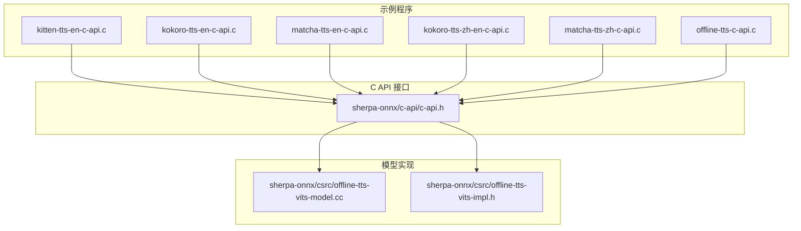
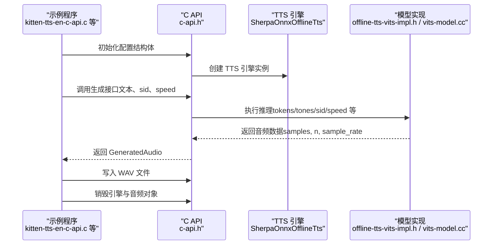
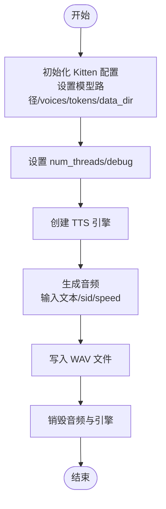
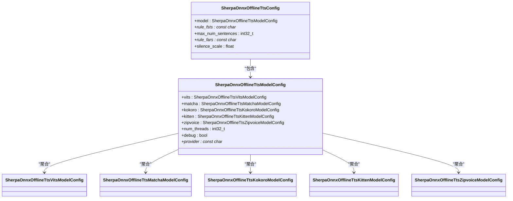

# 语音合成示例

<cite>
**本文引用的文件列表**
- [kitten-tts-en-c-api.c](file://c-api-examples/kitten-tts-en-c-api.c)
- [kokoro-tts-en-c-api.c](file://c-api-examples/kokoro-tts-en-c-api.c)
- [matcha-tts-en-c-api.c](file://c-api-examples/matcha-tts-en-c-api.c)
- [kokoro-tts-zh-en-c-api.c](file://c-api-examples/kokoro-tts-zh-en-c-api.c)
- [matcha-tts-zh-c-api.c](file://c-api-examples/matcha-tts-zh-c-api.c)
- [offline-tts-c-api.c](file://c-api-examples/offline-tts-c-api.c)
- [c-api.h](file://sherpa-onnx/c-api/c-api.h)
- [offline-tts-vits-model.cc](file://sherpa-onnx/csrc/offline-tts-vits-model.cc)
- [offline-tts-vits-impl.h](file://sherpa-onnx/csrc/offline-tts-vits-impl.h)
- [README.md](file://README.md)
</cite>

## 目录
1. [简介](#简介)
2. [项目结构](#项目结构)
3. [核心组件](#核心组件)
4. [架构总览](#架构总览)
5. [详细组件分析](#详细组件分析)
6. [依赖关系分析](#依赖关系分析)
7. [性能考量](#性能考量)
8. [故障排查指南](#故障排查指南)
9. [结论](#结论)
10. [附录](#附录)

## 简介
本文件面向使用 sherpa-onnx 的 C API 进行离线语音合成（TTS）的开发者，系统性讲解如何使用 Kitten、Kokoro、Matcha 等模型进行英文、中文以及中英混合的语音合成。文档以示例代码为依据，逐步解析初始化 TTS 引擎、输入文本、生成音频波形并保存为文件的流程；同时说明音色（sid）、语速（speed）、音高（length_scale）等参数的配置方法，并对不同模型的音质特点与资源消耗进行对比，最后给出在嵌入式设备上的部署优化建议。

## 项目结构
本节聚焦与 TTS 示例直接相关的目录与文件：
- c-api-examples：包含多种 TTS 模型的 C API 示例，涵盖英文、中文与中英混合场景。
- sherpa-onnx/c-api/c-api.h：C API 头文件，定义了 TTS 配置结构体、生成接口与音频写入接口等。
- sherpa-onnx/csrc：C++ 实现层，包含各模型的推理实现细节（如 VITS 的实现）。

图表来源
- [kitten-tts-en-c-api.c](file://c-api-examples/kitten-tts-en-c-api.c#L1-L85)
- [kokoro-tts-en-c-api.c](file://c-api-examples/kokoro-tts-en-c-api.c#L1-L85)
- [matcha-tts-en-c-api.c](file://c-api-examples/matcha-tts-en-c-api.c#L1-L88)
- [kokoro-tts-zh-en-c-api.c](file://c-api-examples/kokoro-tts-zh-en-c-api.c#L1-L83)
- [matcha-tts-zh-c-api.c](file://c-api-examples/matcha-tts-zh-c-api.c#L1-L88)
- [offline-tts-c-api.c](file://c-api-examples/offline-tts-c-api.c#L1-L250)
- [c-api.h](file://sherpa-onnx/c-api/c-api.h#L1000-L1199)

章节来源
- [kitten-tts-en-c-api.c](file://c-api-examples/kitten-tts-en-c-api.c#L1-L85)
- [kokoro-tts-en-c-api.c](file://c-api-examples/kokoro-tts-en-c-api.c#L1-L85)
- [matcha-tts-en-c-api.c](file://c-api-examples/matcha-tts-en-c-api.c#L1-L88)
- [kokoro-tts-zh-en-c-api.c](file://c-api-examples/kokoro-tts-zh-en-c-api.c#L1-L83)
- [matcha-tts-zh-c-api.c](file://c-api-examples/matcha-tts-zh-c-api.c#L1-L88)
- [offline-tts-c-api.c](file://c-api-examples/offline-tts-c-api.c#L1-L250)
- [c-api.h](file://sherpa-onnx/c-api/c-api.h#L1000-L1199)

## 核心组件
- TTS 配置结构体
  - SherpaOnnxOfflineTtsConfig：顶层配置，包含模型配置、规则 FST/FAR、最大句子数、静音比例等。
  - SherpaOnnxOfflineTtsModelConfig：聚合各模型配置，含 num_threads、debug、provider 等通用项。
  - 各模型子配置：
    - SherpaOnnxOfflineTtsKittenModelConfig：Kitten 模型配置（模型路径、voices、tokens、data_dir、length_scale）。
    - SherpaOnnxOfflineTtsKokoroModelConfig：Kokoro 模型配置（模型路径、voices、tokens、data_dir、lexicon、lang、length_scale）。
    - SherpaOnnxOfflineTtsMatchaModelConfig：Matcha 模型配置（声学模型、声码器、lexicon、tokens、data_dir、noise_scale、length_scale）。
- TTS 引擎与音频
  - SherpaOnnxOfflineTts：TTS 引擎句柄类型。
  - SherpaOnnxGeneratedAudio：生成的音频数据结构（samples、n、sample_rate）。
  - 生成接口：SherpaOnnxOfflineTtsGenerate、带进度回调的生成接口等。
  - 写入接口：SherpaOnnxWriteWave 将生成的浮点样本写入 WAV 文件。

章节来源
- [c-api.h](file://sherpa-onnx/c-api/c-api.h#L1000-L1199)
- [c-api.h](file://sherpa-onnx/c-api/c-api.h#L1120-L1206)

## 架构总览
下图展示了从示例程序到 C API 再到模型实现的整体调用链路。

图表来源
- [kitten-tts-en-c-api.c](file://c-api-examples/kitten-tts-en-c-api.c#L35-L84)
- [c-api.h](file://sherpa-onnx/c-api/c-api.h#L1120-L1206)
- [offline-tts-vits-impl.h](file://sherpa-onnx/csrc/offline-tts-vits-impl.h#L414-L456)
- [offline-tts-vits-model.cc](file://sherpa-onnx/csrc/offline-tts-vits-model.cc#L297-L339)

## 详细组件分析

### Kitten 英文 TTS（kitten-tts-en-c-api.c）
- 功能概述
  - 使用 Kitten 模型进行英文离线 TTS。
  - 支持通过进度回调观察生成过程。
  - 将生成的浮点样本写入 WAV 文件。
- 关键步骤
  - 配置模型路径：模型文件、voices、tokens、espeak-ng 数据目录。
  - 设置线程数与调试开关。
  - 创建 TTS 引擎并生成音频。
  - 写入 WAV 并释放资源。
- 参数说明
  - sid：音色 ID（示例中固定为 0）。
  - speed：语速系数（越大越快）。
  - length_scale：长度缩放（与 speed 的关系由实现决定）。
- 适用场景
  - 英文单语种 TTS，适合对资源占用敏感或需要快速生成的场景。

图表来源
- [kitten-tts-en-c-api.c](file://c-api-examples/kitten-tts-en-c-api.c#L35-L84)
- [c-api.h](file://sherpa-onnx/c-api/c-api.h#L1000-L1199)

章节来源
- [kitten-tts-en-c-api.c](file://c-api-examples/kitten-tts-en-c-api.c#L1-L85)
- [c-api.h](file://sherpa-onnx/c-api/c-api.h#L1000-L1199)

### Kokoro 英文 TTS（kokoro-tts-en-c-api.c）
- 功能概述
  - 使用 Kokoro 模型进行英文离线 TTS。
  - 提供更丰富的音色选择（示例注释列出多个音色映射）。
- 关键步骤
  - 配置模型路径、voices、tokens、espeak-ng 数据目录。
  - 创建引擎、生成音频、写入 WAV。
- 参数说明
  - sid：音色 ID（示例中固定为 0）。
  - speed：语速系数。
  - length_scale：长度缩放。

章节来源
- [kokoro-tts-en-c-api.c](file://c-api-examples/kokoro-tts-en-c-api.c#L1-L85)
- [c-api.h](file://sherpa-onnx/c-api/c-api.h#L1000-L1199)

### Matcha 英文 TTS（matcha-tts-en-c-api.c）
- 功能概述
  - 使用 Matcha 声学模型与 vocos 声码器进行英文离线 TTS。
  - 需要下载 vocos 声码器模型。
- 关键步骤
  - 配置声学模型与 vocos 声码器路径、tokens、espeak-ng 数据目录。
  - 创建引擎、生成音频、写入 WAV。
- 参数说明
  - speed：语速系数。
  - length_scale：长度缩放。

章节来源
- [matcha-tts-en-c-api.c](file://c-api-examples/matcha-tts-en-c-api.c#L1-L88)
- [c-api.h](file://sherpa-onnx/c-api/c-api.h#L1000-L1199)

### Kokoro 中英混合 TTS（kokoro-tts-zh-en-c-api.c）
- 功能概述
  - 使用 Kokoro 多语言模型进行中英混合 TTS。
  - 配置 lexicon 列表与字典目录。
- 关键步骤
  - 配置模型、voices、tokens、espeak-ng 数据目录、lexicon 列表与 dict 目录。
  - 创建引擎、生成音频、写入 WAV。
- 参数说明
  - sid：音色 ID（示例中固定为 0）。
  - speed：语速系数。
  - length_scale：长度缩放。

章节来源
- [kokoro-tts-zh-en-c-api.c](file://c-api-examples/kokoro-tts-zh-en-c-api.c#L1-L83)
- [c-api.h](file://sherpa-onnx/c-api/c-api.h#L1000-L1199)

### Matcha 中文 TTS（matcha-tts-zh-c-api.c）
- 功能概述
  - 使用 Matcha 声学模型与 vocos 声码器进行中文离线 TTS。
  - 支持 phone、date、number 等规则 FST。
- 关键步骤
  - 配置声学模型、vocoder、lexicon、tokens、dict 目录与 rule_fsts。
  - 创建引擎、生成音频、写入 WAV。
- 参数说明
  - speed：语速系数。
  - length_scale：长度缩放。

章节来源
- [matcha-tts-zh-c-api.c](file://c-api-examples/matcha-tts-zh-c-api.c#L1-L88)
- [c-api.h](file://sherpa-onnx/c-api/c-api.h#L1000-L1199)

### 通用离线 TTS 示例（offline-tts-c-api.c）
- 功能概述
  - 通用的离线 TTS 示例，支持通过命令行参数配置 VITS 模型。
  - 包含参数解析、校验与生成流程。
- 关键步骤
  - 解析命令行参数，填充 SherpaOnnxOfflineTtsConfig。
  - 校验必要参数（模型、tokens、lexicon 或 data_dir）。
  - 创建引擎、生成音频、写入 WAV。
- 参数说明
  - vits-*：VITS 模型相关参数。
  - num_threads/provider/debug：运行时配置。
  - sid：音色 ID。
  - output-filename：输出文件名。
  - tts-rule-fsts：规则 FST 文件列表。
  - max-num-sentences：批量处理的最大句子数，避免内存溢出。

章节来源
- [offline-tts-c-api.c](file://c-api-examples/offline-tts-c-api.c#L1-L250)
- [c-api.h](file://sherpa-onnx/c-api/c-api.h#L1000-L1199)

## 依赖关系分析
- 示例程序依赖 C API 头文件提供的结构体与函数声明。
- C API 在内部调用模型实现（如 VITS）完成推理。
- 不同模型的配置字段存在差异，但统一在 SherpaOnnxOfflineTtsModelConfig 下聚合。

图表来源
- [c-api.h](file://sherpa-onnx/c-api/c-api.h#L1000-L1199)

章节来源
- [c-api.h](file://sherpa-onnx/c-api/c-api.h#L1000-L1199)

## 性能考量
- 线程与执行提供者
  - num_threads：控制推理线程数量，可按硬件能力调整。
  - provider：可选 CPU/CUDA/CoreML 等，影响推理性能与能耗。
- 语速与长度缩放
  - speed 与 length_scale 的关系在实现中会转换为 length_scale 传入模型，从而影响生成速度与节奏。
- 规则 FST 与分句策略
  - rule_fsts 与 max_num_sentences 可用于控制文本预处理与批处理大小，避免长文本导致的内存压力。
- 模型选择与资源消耗
  - Kitten：轻量模型，适合资源受限设备；音色较少但生成速度快。
  - Kokoro：多音色、多语言支持较好，资源占用适中；适合需要多样化音色与中英混合场景。
  - Matcha：声学模型+声码器组合，音质通常更佳，但计算量较大，需更强硬件支持。
- 嵌入式部署建议
  - 优先选择 Kitten 或 Kokoro，降低算力与内存占用。
  - 合理设置 num_threads 与 provider，结合设备 NPU/加速器提升吞吐。
  - 对长文本启用 max_num_sentences 分批处理，避免 OOM。
  - 使用进度回调进行流式播放或中断控制，改善用户体验。

章节来源
- [offline-tts-c-api.c](file://c-api-examples/offline-tts-c-api.c#L137-L249)
- [offline-tts-vits-model.cc](file://sherpa-onnx/csrc/offline-tts-vits-model.cc#L297-L339)
- [offline-tts-vits-impl.h](file://sherpa-onnx/csrc/offline-tts-vits-impl.h#L414-L456)
- [README.md](file://README.md#L1-L200)

## 故障排查指南
- 常见问题
  - 未提供必要参数：如未提供模型路径、tokens、lexicon 或 data_dir，示例会打印帮助信息并退出。
  - 文本为空：最后一项参数必须是待合成的文本，否则会提示输入文本。
  - 路径错误：模型文件、voices、tokens、espeak-ng 数据目录或 vocos 声码器路径需正确。
- 定位方法
  - 开启 debug 输出，查看模型加载与推理阶段的日志。
  - 使用进度回调观察生成进度，判断是否卡在某一步骤。
  - 检查 num_threads 与 provider 是否与设备能力匹配。
- 建议
  - 对于长文本，适当减小 max_num_sentences，避免一次性处理过多句子导致内存不足。
  - 若设备支持 GPU/NPU，切换 provider 以获得更好性能。

章节来源
- [offline-tts-c-api.c](file://c-api-examples/offline-tts-c-api.c#L137-L249)
- [kitten-tts-en-c-api.c](file://c-api-examples/kitten-tts-en-c-api.c#L35-L84)
- [kokoro-tts-en-c-api.c](file://c-api-examples/kokoro-tts-en-c-api.c#L35-L84)
- [matcha-tts-en-c-api.c](file://c-api-examples/matcha-tts-en-c-api.c#L35-L87)

## 结论
sherpa-onnx 的 C API 为 TTS 场景提供了清晰、可移植的接口。通过 Kitten、Kokoro、Matcha 等模型，开发者可以在英文、中文以及中英混合场景中灵活选择。示例程序展示了从配置到生成再到保存的完整流程；配合进度回调与分句策略，可在资源受限的嵌入式设备上实现稳定高效的语音合成。

## 附录
- 示例程序清单
  - 英文 Kitten：kitten-tts-en-c-api.c
  - 英文 Kokoro：kokoro-tts-en-c-api.c
  - 英文 Matcha：matcha-tts-en-c-api.c
  - 中英混合 Kokoro：kokoro-tts-zh-en-c-api.c
  - 中文 Matcha：matcha-tts-zh-c-api.c
  - 通用离线 TTS：offline-tts-c-api.c
- 相关头文件与实现
  - C API 头文件：sherpa-onnx/c-api/c-api.h
  - VITS 实现：sherpa-onnx/csrc/offline-tts-vits-model.cc、offline-tts-vits-impl.h
- 平台与生态
  - README 展示了平台与语言支持情况，便于评估部署环境。