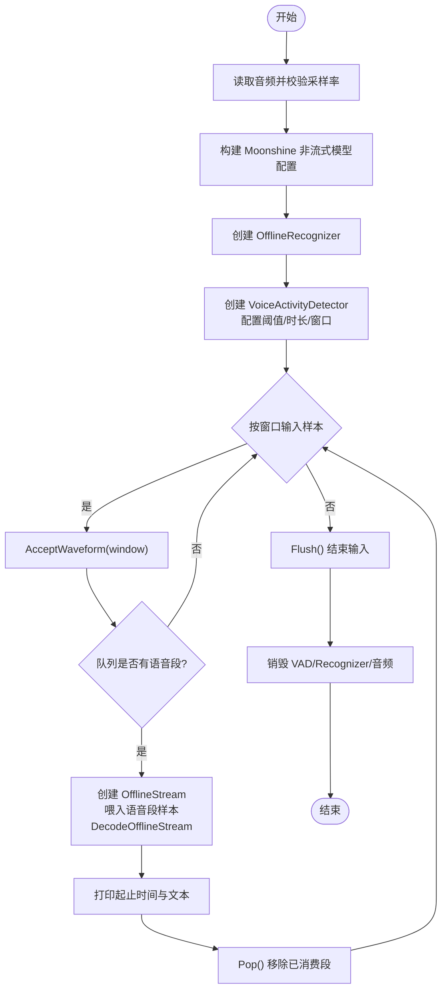

# 语音活动检测示例

<cite>
**本文引用的文件列表**
- [vad-moonshine-c-api.c](file://c-api-examples/vad-moonshine-c-api.c)
- [vad-sense-voice-c-api.c](file://c-api-examples/vad-sense-voice-c-api.c)
- [vad-whisper-c-api.c](file://c-api-examples/vad-whisper-c-api.c)
- [c-api.h](file://sherpa-onnx/c-api/c-api.h)
- [c-api.cc](file://sherpa-onnx/c-api/c-api.cc)
- [vad-model-config.h](file://sherpa-onnx/csrc/vad-model-config.h)
- [vad-model-config.cc](file://sherpa-onnx/csrc/vad-model-config.cc)
- [ten-vad-model-config.cc](file://sherpa-onnx/csrc/ten-vad-model-config.cc)
- [moonshine-c-api.c](file://c-api-examples/moonshine-c-api.c)
- [sense-voice-c-api.c](file://c-api-examples/sense-voice-c-api.c)
</cite>

## 目录
1. [简介](#简介)
2. [项目结构](#项目结构)
3. [核心组件](#核心组件)
4. [架构总览](#架构总览)
5. [详细组件分析](#详细组件分析)
6. [依赖关系分析](#依赖关系分析)
7. [性能考量](#性能考量)
8. [故障排查指南](#故障排查指南)
9. [结论](#结论)
10. [附录](#附录)

## 简介
本文件围绕 sherpa-onnx 的 C API 示例，系统讲解“语音活动检测（VAD）+ 非流式 ASR”的工作流程与最佳实践。重点覆盖：
- VAD 在语音处理流水线中的作用：静音切除、语音分段、端点检测辅助
- 使用不同 ASR 模型（Moonshine、SenseVoice、Whisper）的 VAD 能力
- 如何配置 VAD 参数（阈值、最小静音/语音时长、窗口大小、最大语音时长）
- 连续音频流的处理策略与语音段提取
- 与非流式 ASR 的集成方案，实现“VAD + 非流式 ASR”的高效模式

## 项目结构
与本主题直接相关的文件主要集中在以下位置：
- C API 示例：c-api-examples 下的 vad-*.c 与 moonshine、sense-voice 等非流式 ASR 示例
- C API 头文件与实现：sherpa-onnx/c-api/c-api.h 与 c-api.cc
- VAD 配置与校验：sherpa-onnx/csrc 下的 vad-model-config.* 与 ten-vad-model-config.*

图表来源
- [vad-moonshine-c-api.c](file://c-api-examples/vad-moonshine-c-api.c#L1-L184)
- [vad-sense-voice-c-api.c](file://c-api-examples/vad-sense-voice-c-api.c#L1-L187)
- [vad-whisper-c-api.c](file://c-api-examples/vad-whisper-c-api.c#L1-L183)
- [c-api.h](file://sherpa-onnx/c-api/c-api.h#L900-L1020)
- [c-api.cc](file://sherpa-onnx/c-api/c-api.cc#L1102-L1146)
- [vad-model-config.h](file://sherpa-onnx/csrc/vad-model-config.h#L1-L46)
- [vad-model-config.cc](file://sherpa-onnx/csrc/vad-model-config.cc#L52-L79)
- [ten-vad-model-config.cc](file://sherpa-onnx/csrc/ten-vad-model-config.cc#L1-L113)

章节来源
- [vad-moonshine-c-api.c](file://c-api-examples/vad-moonshine-c-api.c#L1-L184)
- [vad-sense-voice-c-api.c](file://c-api-examples/vad-sense-voice-c-api.c#L1-L187)
- [vad-whisper-c-api.c](file://c-api-examples/vad-whisper-c-api.c#L1-L183)
- [c-api.h](file://sherpa-onnx/c-api/c-api.h#L900-L1020)

## 核心组件
- VAD 模型配置结构体
  - VadModelConfig：包含 SileroVadModelConfig 与 TenVadModelConfig，以及 sample_rate、num_threads、provider、debug 等通用字段
  - TenVadModelConfig：提供模型路径、阈值、最小静音/语音时长、最大语音时长、窗口大小等参数
- VAD 实例与操作接口
  - 创建/销毁：CreateVoiceActivityDetector、DestroyVoiceActivityDetector
  - 数据输入：AcceptWaveform
  - 结果队列：Empty、Front、Pop、Clear、Flush、Reset
  - 语音段类型：SpeechSegment（start、samples、n）

章节来源
- [c-api.h](file://sherpa-onnx/c-api/c-api.h#L900-L1020)
- [vad-model-config.h](file://sherpa-onnx/csrc/vad-model-config.h#L1-L46)
- [ten-vad-model-config.cc](file://sherpa-onnx/csrc/ten-vad-model-config.cc#L1-L113)

## 架构总览
下图展示了“VAD + 非流式 ASR”的典型流水线：先用 VAD 对连续音频进行分段，再对每个语音段调用非流式 ASR 解码得到文本。

图表来源
- [vad-moonshine-c-api.c](file://c-api-examples/vad-moonshine-c-api.c#L120-L176)
- [vad-sense-voice-c-api.c](file://c-api-examples/vad-sense-voice-c-api.c#L120-L178)
- [vad-whisper-c-api.c](file://c-api-examples/vad-whisper-c-api.c#L118-L174)
- [c-api.h](file://sherpa-onnx/c-api/c-api.h#L970-L1020)

## 详细组件分析

### VAD + Moonshine 示例分析
- 功能要点
  - 自动选择 silero-vad 或 ten-vad 模型
  - 配置 Moonshine 非流式模型（preprocessor、encoder、uncached/cached decoder、tokens）
  - 使用 VAD 将整段音频切分为多个语音段，逐段喂给非流式 ASR
- 关键流程
  - 读取音频并校验采样率
  - 构造 OfflineModelConfig 与 OfflineRecognizerConfig
  - 创建 VAD（设置 sample_rate、num_threads、debug、阈值、最小静音/语音时长、窗口大小、最大语音时长）
  - 按窗口向 VAD 输入样本，循环从队列取出语音段，创建 OfflineStream 并解码
  - 打印每段起止时间与识别结果

图表来源
- [vad-moonshine-c-api.c](file://c-api-examples/vad-moonshine-c-api.c#L60-L176)

章节来源
- [vad-moonshine-c-api.c](file://c-api-examples/vad-moonshine-c-api.c#L1-L184)
- [moonshine-c-api.c](file://c-api-examples/moonshine-c-api.c#L1-L84)

### VAD + SenseVoice 示例分析
- 功能要点
  - 支持多语言（language="auto"），可选 ITN（逆文本正则化）
  - 其余流程与 Moonshine 示例一致
- 关键差异
  - SenseVoice 模型配置通过 offline_model_config.sense_voice 字段注入
  - 其他步骤完全复用 VAD 分段 + 非流式 ASR 的模式

章节来源
- [vad-sense-voice-c-api.c](file://c-api-examples/vad-sense-voice-c-api.c#L1-L187)
- [sense-voice-c-api.c](file://c-api-examples/sense-voice-c-api.c#L1-L86)

### VAD + Whisper 示例分析
- 功能要点
  - Whisper tiny.en 模型（encoder、decoder、tokens）
  - 其余流程与上述示例一致
- 注意事项
  - Whisper 需要指定 language、task、tail_paddings 等参数

章节来源
- [vad-whisper-c-api.c](file://c-api-examples/vad-whisper-c-api.c#L1-L183)

### VAD 配置与参数详解
- VadModelConfig 字段
  - silero_vad / ten_vad：二选一或同时配置（取决于具体实现）
  - sample_rate、num_threads、provider、debug
- TenVadModelConfig 关键参数
  - threshold：语音概率阈值
  - min_silence_duration / min_speech_duration：静音/语音最小持续时间（秒）
  - max_speech_duration：超过该时长后提高阈值，防止误判长语音
  - window_size：每次输入的样本数（采样率为 16kHz 时对应窗口长度）
- 参数建议
  - 阈值与最小持续时间需根据数据集微调；默认值通常适用于大多数场景
  - window_size 与模型要求匹配（Silero 通常为 512，Ten-VAD 为 256）

章节来源
- [c-api.h](file://sherpa-onnx/c-api/c-api.h#L900-L913)
- [vad-model-config.cc](file://sherpa-onnx/csrc/vad-model-config.cc#L52-L79)
- [ten-vad-model-config.cc](file://sherpa-onnx/csrc/ten-vad-model-config.cc#L1-L113)

### VAD API 使用要点
- 创建与销毁
  - CreateVoiceActivityDetector(config, buffer_size_in_seconds)
  - DestroyVoiceActivityDetector(p)
- 输入与状态
  - AcceptWaveform(p, samples, n)
  - Empty(p)、Detected(p)、Front(p)、Pop(p)、Clear(p)、Flush(p)、Reset(p)
- 语音段结构
  - SpeechSegment：start（起始样本索引）、samples（片段样本指针）、n（样本数）

章节来源
- [c-api.h](file://sherpa-onnx/c-api/c-api.h#L970-L1020)
- [c-api.cc](file://sherpa-onnx/c-api/c-api.cc#L1102-L1146)

## 依赖关系分析
- 示例到接口
  - vad-*.c 依赖 c-api.h 中的 VAD 类型与函数声明
- 接口到实现
  - c-api.cc 提供 VAD 函数的具体实现，并委托到内部实现类
- 配置到校验
  - vad-model-config.cc 统一校验 Silero/Ten-VAD 配置是否满足条件
  - ten-vad-model-config.cc 对 Ten-VAD 参数进行范围检查与字符串描述

图表来源
- [vad-moonshine-c-api.c](file://c-api-examples/vad-moonshine-c-api.c#L1-L184)
- [c-api.h](file://sherpa-onnx/c-api/c-api.h#L900-L1020)
- [c-api.cc](file://sherpa-onnx/c-api/c-api.cc#L1102-L1146)
- [vad-model-config.cc](file://sherpa-onnx/csrc/vad-model-config.cc#L52-L79)
- [ten-vad-model-config.cc](file://sherpa-onnx/csrc/ten-vad-model-config.cc#L1-L113)

章节来源
- [c-api.cc](file://sherpa-onnx/c-api/c-api.cc#L1102-L1146)
- [vad-model-config.cc](file://sherpa-onnx/csrc/vad-model-config.cc#L52-L79)
- [ten-vad-model-config.cc](file://sherpa-onnx/csrc/ten-vad-model-config.cc#L1-L113)

## 性能考量
- 窗口大小与吞吐
  - 较大的 window_size 可减少调用次数但增加延迟；较小窗口更实时但调用频繁
  - Silero 默认 512，Ten-VAD 默认 256（采样率 16kHz）
- 线程与 Provider
  - num_threads 增加可提升 CPU 利用率，但受模型与硬件限制
  - provider 选择（如 "cpu"）影响推理速度与资源占用
- 缓冲区大小
  - buffer_size_in_seconds 决定内部缓冲容量，影响端点检测与内存占用
- I/O 与解码
  - 每个语音段都会创建一次 OfflineStream 并执行解码，注意避免重复初始化开销

[本节为通用指导，不直接分析具体文件]

## 故障排查指南
- 常见错误与定位
  - VAD 配置无效：检查 VadModelConfig 是否包含有效模型路径，阈值与最小持续时间是否在合理范围
  - 音频采样率不匹配：示例均要求 16kHz，若不匹配会报错并退出
  - 文件缺失：示例会检查音频与模型文件是否存在，缺失时给出提示
  - VAD 创建失败：确认配置 Validate() 成功，且 provider、num_threads 设置合理
- 定位方法
  - 启用 debug 输出（VadModelConfig.debug）查看加载与推理日志
  - 使用 Empty()/Detected() 检查队列状态，避免在空队列上 Front()/Pop()

章节来源
- [vad-model-config.cc](file://sherpa-onnx/csrc/vad-model-config.cc#L52-L79)
- [ten-vad-model-config.cc](file://sherpa-onnx/csrc/ten-vad-model-config.cc#L1-L113)
- [vad-moonshine-c-api.c](file://c-api-examples/vad-moonshine-c-api.c#L30-L73)
- [vad-sense-voice-c-api.c](file://c-api-examples/vad-sense-voice-c-api.c#L30-L72)
- [vad-whisper-c-api.c](file://c-api-examples/vad-whisper-c-api.c#L30-L71)

## 结论
- VAD 是“非流式 ASR + 语音分段”的关键前置模块，能显著降低 ASR 解码负担并提升整体鲁棒性
- 三种示例展示了同一模式在不同 ASR 模型上的落地：Moonshine、SenseVoice、Whisper
- 通过合理配置 VAD 参数（阈值、最小静音/语音时长、窗口大小、最大语音时长）可在准确性和实时性之间取得平衡
- 建议在实际部署中结合业务场景对阈值与最小持续时间进行数据集微调，并评估不同窗口大小对延迟与吞吐的影响

[本节为总结性内容，不直接分析具体文件]

## 附录

### “VAD + 非流式 ASR”集成清单
- 步骤
  - 选择并准备 VAD 模型（silero-vad 或 ten-vad）
  - 选择并准备目标 ASR 模型（Moonshine、SenseVoice、Whisper）
  - 构建 OfflineModelConfig 与 OfflineRecognizerConfig
  - 创建 VAD（设置 sample_rate、num_threads、debug、阈值、最小静音/语音时长、窗口大小、最大语音时长）
  - 按窗口输入音频，循环处理语音段：Front → CreateOfflineStream → AcceptWaveformOffline → DecodeOfflineStream → 获取结果 → Pop
  - Flush 结束输入，销毁 VAD 与 ASR
- 参考示例
  - [vad-moonshine-c-api.c](file://c-api-examples/vad-moonshine-c-api.c#L1-L184)
  - [vad-sense-voice-c-api.c](file://c-api-examples/vad-sense-voice-c-api.c#L1-L187)
  - [vad-whisper-c-api.c](file://c-api-examples/vad-whisper-c-api.c#L1-L183)

章节来源
- [vad-moonshine-c-api.c](file://c-api-examples/vad-moonshine-c-api.c#L120-L176)
- [vad-sense-voice-c-api.c](file://c-api-examples/vad-sense-voice-c-api.c#L120-L178)
- [vad-whisper-c-api.c](file://c-api-examples/vad-whisper-c-api.c#L118-L174)