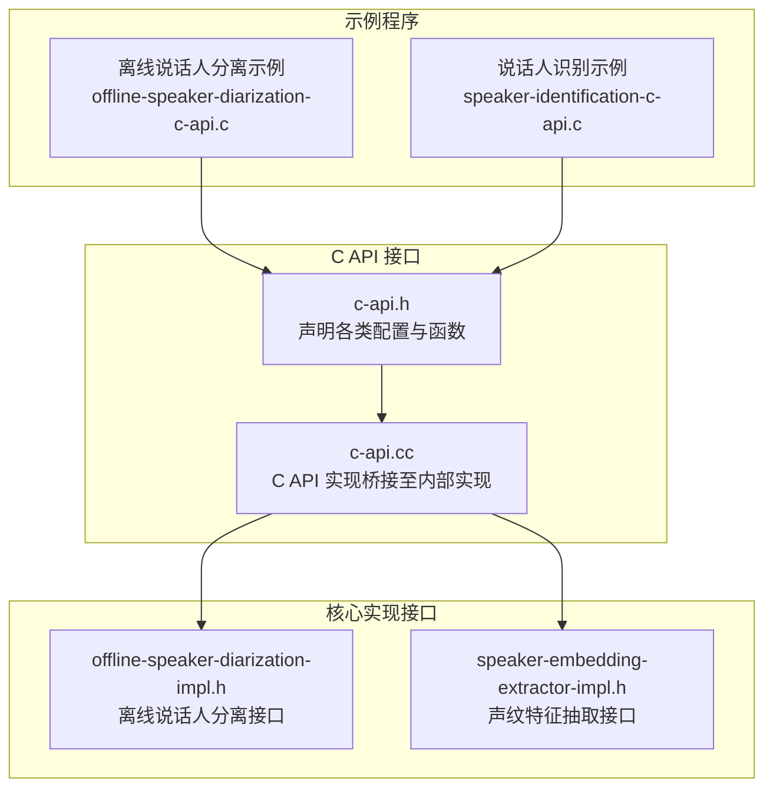
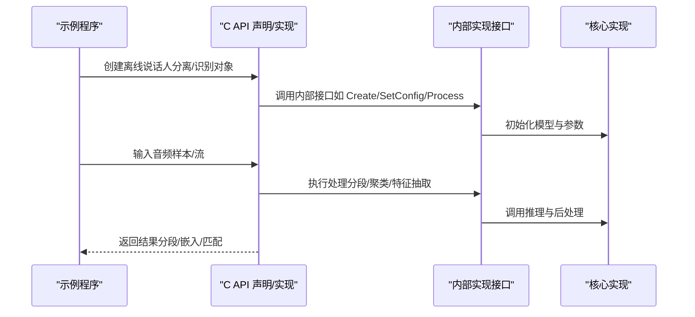
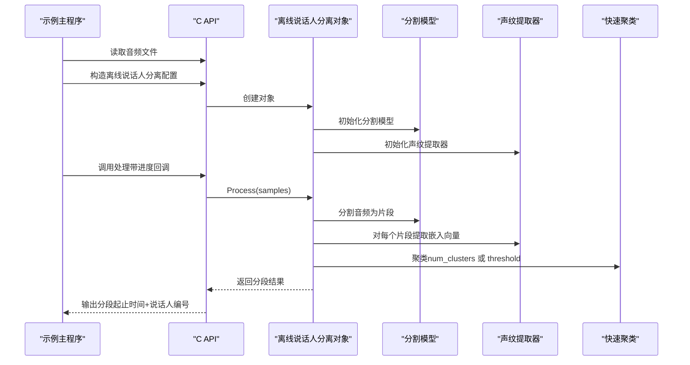
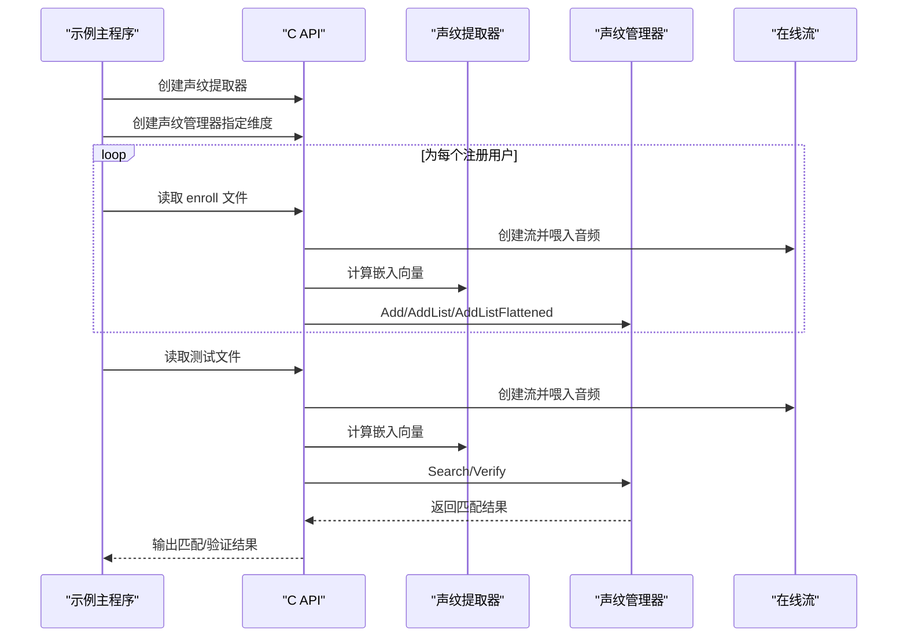
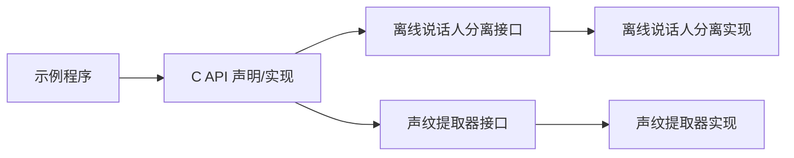

# 说话人相关功能示例

<cite>
**本文引用的文件**
- [offline-speaker-diarization-c-api.c](file://c-api-examples/offline-speaker-diarization-c-api.c)
- [speaker-identification-c-api.c](file://c-api-examples/speaker-identification-c-api.c)
- [c-api.h](file://sherpa-onnx/c-api/c-api.h)
- [c-api.cc](file://sherpa-onnx/c-api/c-api.cc)
- [offline-speaker-diarization-impl.h](file://sherpa-onnx/csrc/offline-speaker-diarization-impl.h)
- [speaker-embedding-extractor-impl.h](file://sherpa-onnx/csrc/speaker-embedding-extractor-impl.h)
- [sherpa-onnx-microphone-offline-speaker-identification.cc](file://sherpa-onnx/csrc/sherpa-onnx-microphone-offline-speaker-identification.cc)
</cite>

## 目录
1. [简介](#简介)
2. [项目结构](#项目结构)
3. [核心组件](#核心组件)
4. [架构总览](#架构总览)
5. [详细组件分析](#详细组件分析)
6. [依赖关系分析](#依赖关系分析)
7. [性能与资源特性](#性能与资源特性)
8. [故障排查指南](#故障排查指南)
9. [结论](#结论)
10. [附录：最佳实践与阈值建议](#附录最佳实践与阈值建议)

## 简介
本文件面向使用 sherpa-onnx 的 C API 开发者，系统性解析两类说话人相关能力：
- 说话人分离（离线说话人分段与聚类）
- 说话人识别（声纹特征抽取与匹配）

文档基于仓库中的 C 示例代码与 C API 头文件，解释如何加载模型、提取声纹特征、进行聚类分析以区分不同说话人，以及如何通过声纹比对识别特定说话人；并提供声纹数据库管理与匹配阈值设置的实践指导。

## 项目结构
围绕说话人功能的相关文件主要分布在以下位置：
- C 示例入口：c-api-examples 下的 offline-speaker-diarization-c-api.c 与 speaker-identification-c-api.c
- C API 声明与实现：sherpa-onnx/c-api/c-api.h 与 sherpa-onnx/c-api/c-api.cc
- 核心实现接口：sherpa-onnx/csrc 下的 offline-speaker-diarization-impl.h 与 speaker-embedding-extractor-impl.h
- 参考实现（含麦克风交互流程）：sherpa-onnx/csrc/sherpa-onnx-microphone-offline-speaker-identification.cc

图表来源
- [offline-speaker-diarization-c-api.c](file://c-api-examples/offline-speaker-diarization-c-api.c#L1-L132)
- [speaker-identification-c-api.c](file://c-api-examples/speaker-identification-c-api.c#L1-L258)
- [c-api.h](file://sherpa-onnx/c-api/c-api.h#L1289-L1866)
- [c-api.cc](file://sherpa-onnx/c-api/c-api.cc#L2285-L2328)
- [offline-speaker-diarization-impl.h](file://sherpa-onnx/csrc/offline-speaker-diarization-impl.h#L1-L39)
- [speaker-embedding-extractor-impl.h](file://sherpa-onnx/csrc/speaker-embedding-extractor-impl.h#L1-L38)

章节来源
- [offline-speaker-diarization-c-api.c](file://c-api-examples/offline-speaker-diarization-c-api.c#L1-L132)
- [speaker-identification-c-api.c](file://c-api-examples/speaker-identification-c-api.c#L1-L258)
- [c-api.h](file://sherpa-onnx/c-api/c-api.h#L1289-L1866)

## 核心组件
- 离线说话人分离（Speaker Diarization）
  - 配置结构：SherpaOnnxOfflineSpeakerDiarizationConfig
  - 关键字段：segmentation（分割模型）、embedding（声纹提取器）、clustering（聚类参数）
  - 运行接口：创建、处理、销毁结果与对象
- 说话人识别（Speaker Identification）
  - 声纹提取器：SherpaOnnxSpeakerEmbeddingExtractorConfig 与相关 API
  - 声纹管理器：SherpaOnnxSpeakerEmbeddingManager（注册、查询、验证、删除、枚举）
  - 流式接口：OnlineStream 用于接受音频并生成嵌入向量

章节来源
- [c-api.h](file://sherpa-onnx/c-api/c-api.h#L1289-L1866)
- [c-api.cc](file://sherpa-onnx/c-api/c-api.cc#L2285-L2328)

## 架构总览
下图展示了从示例到 C API 再到内部实现的整体调用链路。

图表来源
- [c-api.h](file://sherpa-onnx/c-api/c-api.h#L1289-L1866)
- [c-api.cc](file://sherpa-onnx/c-api/c-api.cc#L2285-L2328)
- [offline-speaker-diarization-impl.h](file://sherpa-onnx/csrc/offline-speaker-diarization-impl.h#L1-L39)
- [speaker-embedding-extractor-impl.h](file://sherpa-onnx/csrc/speaker-embedding-extractor-impl.h#L1-L38)

## 详细组件分析

### 组件A：离线说话人分离（Speaker Diarization）
离线说话人分离包含两个阶段：
- 语音分割（Segmentation）：检测语音活动边界，得到候选片段
- 声纹聚类（Clustering）：对每个片段提取声纹向量并进行聚类，标注说话人标签

示例要点
- 加载分割模型与声纹提取器模型
- 设置聚类参数：已知说话人数时使用 num_clusters；未知时使用 threshold
- 读取音频并执行处理，输出按起始时间排序的分段结果

图表来源
- [offline-speaker-diarization-c-api.c](file://c-api-examples/offline-speaker-diarization-c-api.c#L55-L131)
- [c-api.h](file://sherpa-onnx/c-api/c-api.h#L1667-L1781)
- [c-api.cc](file://sherpa-onnx/c-api/c-api.cc#L2285-L2328)

章节来源
- [offline-speaker-diarization-c-api.c](file://c-api-examples/offline-speaker-diarization-c-api.c#L55-L131)
- [c-api.h](file://sherpa-onnx/c-api/c-api.h#L1667-L1781)
- [c-api.cc](file://sherpa-onnx/c-api/c-api.cc#L2285-L2328)

### 组件B：说话人识别（Speaker Identification）
说话人识别的核心流程是“提取嵌入向量 → 注册用户 → 匹配查询/验证”。示例展示了：
- 创建声纹提取器
- 为注册用户计算嵌入向量并加入管理器
- 对测试音频进行匹配查询与验证
- 支持移除用户、列举所有用户等管理操作

图表来源
- [speaker-identification-c-api.c](file://c-api-examples/speaker-identification-c-api.c#L60-L257)
- [c-api.h](file://sherpa-onnx/c-api/c-api.h#L1289-L1481)

章节来源
- [speaker-identification-c-api.c](file://c-api-examples/speaker-identification-c-api.c#L60-L257)
- [c-api.h](file://sherpa-onnx/c-api/c-api.h#L1289-L1481)

### 概念对比：说话人分离 vs 说话人识别
- 说话人分离（Speaker Diarization）
  - 输入：整段音频
  - 输出：按时间切分的片段及其说话人标签
  - 关注点：自动发现说话人数、连续性合并、噪声/静音处理
- 说话人识别（Speaker Identification）
  - 输入：单个片段或短语
  - 输出：是否匹配某注册用户、相似度分数
  - 关注点：嵌入质量、阈值选择、数据库规模与稳定性

[本节为概念性说明，不直接分析具体文件]

## 依赖关系分析
- 示例程序依赖 C API 声明与实现
- C API 将调用转发至内部实现接口（离线说话人分离、声纹提取器）
- 内部实现接口进一步封装模型初始化、推理与后处理逻辑

图表来源
- [offline-speaker-diarization-impl.h](file://sherpa-onnx/csrc/offline-speaker-diarization-impl.h#L1-L39)
- [speaker-embedding-extractor-impl.h](file://sherpa-onnx/csrc/speaker-embedding-extractor-impl.h#L1-L38)
- [c-api.h](file://sherpa-onnx/c-api/c-api.h#L1289-L1866)
- [c-api.cc](file://sherpa-onnx/c-api/c-api.cc#L2285-L2328)

章节来源
- [offline-speaker-diarization-impl.h](file://sherpa-onnx/csrc/offline-speaker-diarization-impl.h#L1-L39)
- [speaker-embedding-extractor-impl.h](file://sherpa-onnx/csrc/speaker-embedding-extractor-impl.h#L1-L38)
- [c-api.h](file://sherpa-onnx/c-api/c-api.h#L1289-L1866)
- [c-api.cc](file://sherpa-onnx/c-api/c-api.cc#L2285-L2328)

## 性能与资源特性
- 线程与 Provider：示例与 API 均支持设置 num_threads 与 provider（如 CPU），可按硬件能力调整
- 输入采样率：离线说话人分离与识别均要求输入音频满足模型期望采样率，示例中会进行一致性检查
- 内存管理：返回的指针需按 API 注释调用对应销毁函数，避免内存泄漏
- 处理回调：离线说话人分离支持进度回调，便于长音频任务的可视化与监控

章节来源
- [speaker-identification-c-api.c](file://c-api-examples/speaker-identification-c-api.c#L60-L120)
- [offline-speaker-diarization-c-api.c](file://c-api-examples/offline-speaker-diarization-c-api.c#L94-L110)
- [c-api.h](file://sherpa-onnx/c-api/c-api.h#L1289-L1866)

## 故障排查指南
常见问题与定位思路
- 音频采样率不匹配
  - 现象：运行时报错或结果异常
  - 处理：确认输入音频采样率与模型期望一致；示例中包含采样率校验逻辑
- 嵌入向量过短导致无法计算
  - 现象：提示输入音频太短
  - 处理：确保每条 enroll/test 音频包含足够有效语音
- 阈值设置不当
  - 现象：误匹配或漏匹配
  - 处理：结合业务场景与数据集评估，逐步调整阈值
- 内存泄漏
  - 现象：长时间运行后内存占用持续增长
  - 处理：确保调用对应的销毁函数释放返回的指针

章节来源
- [offline-speaker-diarization-c-api.c](file://c-api-examples/offline-speaker-diarization-c-api.c#L94-L110)
- [speaker-identification-c-api.c](file://c-api-examples/speaker-identification-c-api.c#L29-L58)
- [c-api.h](file://sherpa-onnx/c-api/c-api.h#L1289-L1481)

## 结论
- 离线说话人分离适合在已知或未知说话人数场景下对整段音频进行说话人分段与聚类
- 说话人识别适合对单次语音片段进行身份匹配与验证
- 通过统一的 C API，开发者可以灵活组合分割、嵌入与聚类模块，构建端到端的说话人应用

[本节为总结性内容，不直接分析具体文件]

## 附录：最佳实践与阈值建议
- 声纹提取器与分割模型的选择
  - 建议优先选用官方发布的预训练模型，确保兼容性与稳定性
- 嵌入维度与管理器
  - 创建管理器时需传入正确的嵌入维度；注册多个 enroll 片段时可使用 AddList/AddListFlattened
- 阈值设置
  - 初期可采用默认阈值，结合验证集评估准确率与召回率，再微调阈值
- 数据库管理
  - 定期清理无效或重复注册项；支持按名称删除与枚举当前注册用户
- 流式处理
  - 使用 OnlineStream 接收音频并等待就绪后再计算嵌入，避免短音频导致的失败

章节来源
- [speaker-identification-c-api.c](file://c-api-examples/speaker-identification-c-api.c#L80-L176)
- [c-api.h](file://sherpa-onnx/c-api/c-api.h#L1289-L1481)