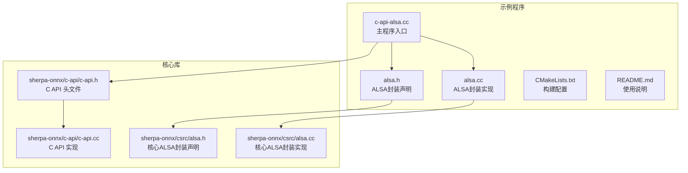
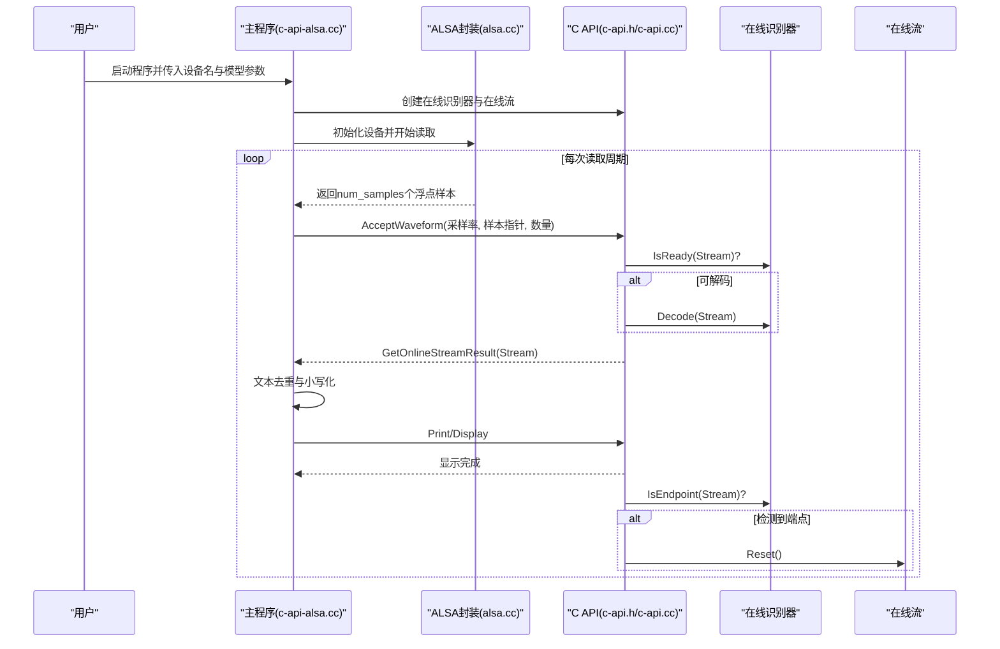
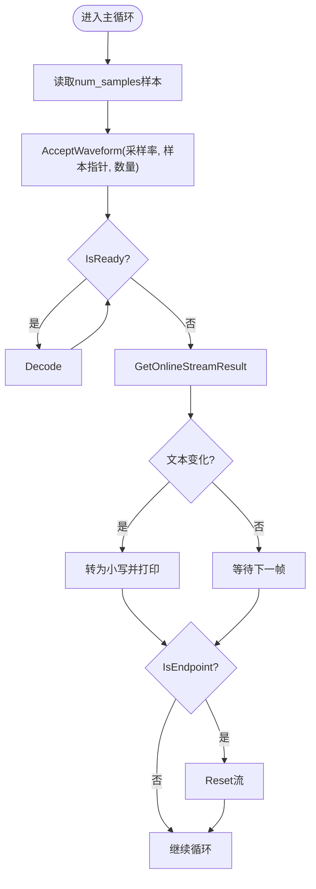
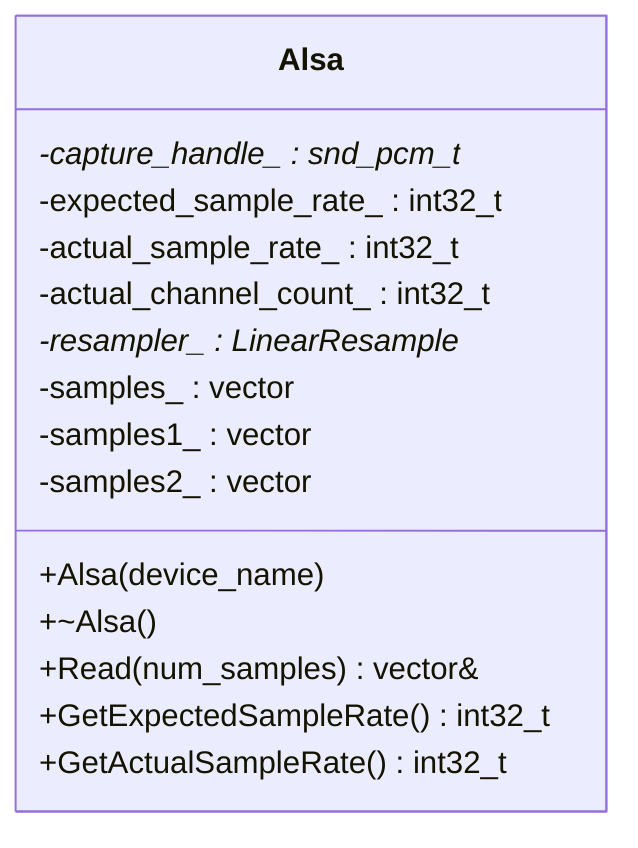
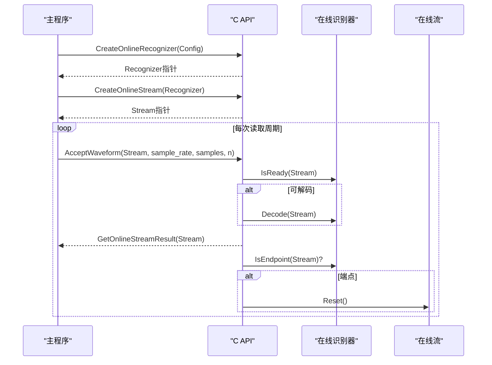
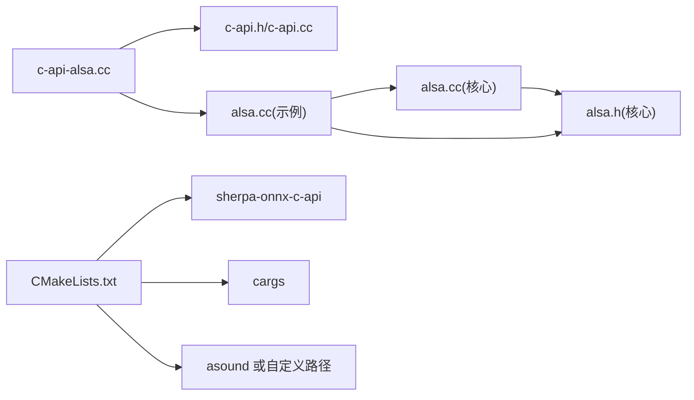

# 麦克风实时处理示例

<cite>
**本文引用的文件列表**
- [c-api-alsa.cc](file://c-api-examples/asr-microphone-example/c-api-alsa.cc)
- [alsa.h](file://c-api-examples/asr-microphone-example/alsa.h)
- [alsa.cc](file://c-api-examples/asr-microphone-example/alsa.cc)
- [CMakeLists.txt](file://c-api-examples/asr-microphone-example/CMakeLists.txt)
- [README.md](file://c-api-examples/asr-microphone-example/README.md)
- [c-api.h](file://sherpa-onnx/c-api/c-api.h)
- [alsa.h（核心实现）](file://sherpa-onnx/csrc/alsa.h)
- [alsa.cc（核心实现）](file://sherpa-onnx/csrc/alsa.cc)
- [c-api.cc（C API实现）](file://sherpa-onnx/c-api/c-api.cc)
</cite>

## 目录
1. [简介](#简介)
2. [项目结构](#项目结构)
3. [核心组件](#核心组件)
4. [架构总览](#架构总览)
5. [详细组件分析](#详细组件分析)
6. [依赖关系分析](#依赖关系分析)
7. [性能考量](#性能考量)
8. [故障排查指南](#故障排查指南)
9. [结论](#结论)
10. [附录：ALSA配置与兼容性](#附录alssa配置与兼容性)

## 简介
本文件围绕 sherpa-onnx 的“麦克风实时处理 C API 示例”展开，以 asr-microphone-example 为例，系统讲解如何通过 ALSA 接口实时采集麦克风音频，并结合 C API 进行流式语音识别。文档重点解析以下方面：
- 音频采集线程与识别线程的同步机制
- 缓冲区管理策略
- 实时结果显示的实现方法
- Linux 上 ALSA 的配置与设备选择
- 不同采样率与声道数的兼容性方案
- 将该示例扩展到其他实时语音处理任务的实践建议

## 项目结构
该示例位于 c-api-examples/asr-microphone-example 目录，包含一个可执行程序入口、ALSA 封装类及其源码、构建脚本与使用说明。

图表来源
- [c-api-alsa.cc](file://c-api-examples/asr-microphone-example/c-api-alsa.cc#L1-L260)
- [alsa.h](file://c-api-examples/asr-microphone-example/alsa.h#L1-L47)
- [alsa.cc](file://c-api-examples/asr-microphone-example/alsa.cc#L1-L184)
- [CMakeLists.txt](file://c-api-examples/asr-microphone-example/CMakeLists.txt#L1-L10)
- [README.md](file://c-api-examples/asr-microphone-example/README.md#L1-L13)
- [c-api.h](file://sherpa-onnx/c-api/c-api.h#L1-L200)
- [c-api.cc](file://sherpa-onnx/c-api/c-api.cc#L611-L653)
- [alsa.h（核心实现）](file://sherpa-onnx/csrc/alsa.h#L1-L47)
- [alsa.cc（核心实现）](file://sherpa-onnx/csrc/alsa.cc#L1-L184)

章节来源
- [README.md](file://c-api-examples/asr-microphone-example/README.md#L1-L13)
- [CMakeLists.txt](file://c-api-examples/asr-microphone-example/CMakeLists.txt#L1-L10)

## 核心组件
- 主程序入口：负责解析命令行参数、初始化在线识别器与流、启动 ALSA 读取循环、调用识别 API 并输出结果。
- ALSA 封装：提供阻塞式读取、采样率与声道适配、必要时进行重采样。
- C API：提供在线识别器、在线流、结果获取、端点检测等接口。

章节来源
- [c-api-alsa.cc](file://c-api-examples/asr-microphone-example/c-api-alsa.cc#L116-L259)
- [alsa.h](file://c-api-examples/asr-microphone-example/alsa.h#L1-L47)
- [alsa.cc](file://c-api-examples/asr-microphone-example/alsa.cc#L1-L184)
- [c-api.h](file://sherpa-onnx/c-api/c-api.h#L158-L200)

## 架构总览
下图展示了从麦克风采集到识别结果输出的整体流程，以及各模块之间的交互关系。

图表来源
- [c-api-alsa.cc](file://c-api-examples/asr-microphone-example/c-api-alsa.cc#L191-L250)
- [c-api.h](file://sherpa-onnx/c-api/c-api.h#L250-L393)
- [c-api.cc](file://sherpa-onnx/c-api/c-api.cc#L611-L653)
- [alsa.cc](file://c-api-examples/asr-microphone-example/alsa.cc#L145-L179)

## 详细组件分析

### 组件A：主程序与识别循环
- 参数解析与配置：支持 tokens、encoder、decoder、joiner、线程数、provider、解码方式、热词文件与热词分数等参数；默认使用贪心搜索与端点检测规则。
- 设备选择与采样率校验：要求麦克风采样率与模型期望一致；否则直接退出。
- 读取与解码：按固定时间窗口（如0.1秒）读取样本，调用 AcceptWaveform，随后轮询 IsReady 并 Decode，最后获取结果文本并打印。
- 端点检测与状态重置：当识别器报告端点后，重置当前流，准备下一段语音。

图表来源
- [c-api-alsa.cc](file://c-api-examples/asr-microphone-example/c-api-alsa.cc#L206-L250)

章节来源
- [c-api-alsa.cc](file://c-api-examples/asr-microphone-example/c-api-alsa.cc#L116-L259)

### 组件B：ALSA 封装类
- 设备打开与硬件参数设置：支持访问类型、格式、声道数、采样率；若无法设置为单声道，则尝试双声道并仅使用一通道；若无法设置目标采样率，则创建重采样器。
- 读取与归一化：阻塞式读取固定数量的帧，转换为浮点数组；若发生 XRUN（欠载），进行有限次数的恢复并返回空缓冲。
- 重采样：当实际采样率与期望不一致时，使用线性重采样器进行重采样，确保输入到模型的数据速率一致。

图表来源
- [alsa.h](file://c-api-examples/asr-microphone-example/alsa.h#L1-L47)
- [alsa.cc](file://c-api-examples/asr-microphone-example/alsa.cc#L1-L184)
- [alsa.h（核心实现）](file://sherpa-onnx/csrc/alsa.h#L1-L47)
- [alsa.cc（核心实现）](file://sherpa-onnx/csrc/alsa.cc#L1-L184)

章节来源
- [alsa.h](file://c-api-examples/asr-microphone-example/alsa.h#L1-L47)
- [alsa.cc](file://c-api-examples/asr-microphone-example/alsa.cc#L1-L184)
- [alsa.h（核心实现）](file://sherpa-onnx/csrc/alsa.h#L1-L47)
- [alsa.cc（核心实现）](file://sherpa-onnx/csrc/alsa.cc#L1-L184)

### 组件C：C API 与在线识别器
- 在线识别器与流：提供创建、解码、结果获取、端点检测、输入结束、重置等接口。
- 在线流接受波形：按采样率与样本数量向流注入音频数据。
- 结果结构：包含文本、tokens、可选的时间戳、JSON 字符串等字段。

图表来源
- [c-api.h](file://sherpa-onnx/c-api/c-api.h#L250-L393)
- [c-api.cc](file://sherpa-onnx/c-api/c-api.cc#L611-L653)
- [c-api-alsa.cc](file://c-api-examples/asr-microphone-example/c-api-alsa.cc#L191-L250)

章节来源
- [c-api.h](file://sherpa-onnx/c-api/c-api.h#L158-L200)
- [c-api.h](file://sherpa-onnx/c-api/c-api.h#L214-L241)
- [c-api.h](file://sherpa-onnx/c-api/c-api.h#L250-L393)
- [c-api.cc](file://sherpa-onnx/c-api/c-api.cc#L611-L653)

## 依赖关系分析
- 构建依赖：示例程序链接 sherpa-onnx-c-api、cargs，并根据环境变量选择 ALSA 库路径。
- 运行时依赖：示例程序依赖 ALSA 库；ALSA 封装依赖 ALSA 头文件与内部重采样器。
- API 依赖：主程序通过 C API 调用在线识别器与在线流接口。

图表来源
- [CMakeLists.txt](file://c-api-examples/asr-microphone-example/CMakeLists.txt#L1-L10)
- [c-api-alsa.cc](file://c-api-examples/asr-microphone-example/c-api-alsa.cc#L1-L260)
- [alsa.cc](file://c-api-examples/asr-microphone-example/alsa.cc#L1-L184)
- [alsa.cc（核心实现）](file://sherpa-onnx/csrc/alsa.cc#L1-L184)
- [c-api.h](file://sherpa-onnx/c-api/c-api.h#L1-L200)

章节来源
- [CMakeLists.txt](file://c-api-examples/asr-microphone-example/CMakeLists.txt#L1-L10)

## 性能考量
- 采样率与声道：示例默认期望 16kHz 单声道；若设备不满足，会尝试双声道并仅使用一通道，同时可能启用重采样。重采样会引入额外计算开销，应根据硬件能力调整 num_threads 与 provider。
- 端点检测：启用端点检测有助于减少无效片段的处理，降低识别器负担；但需合理设置规则阈值，避免误判。
- 流式解码：每次读取固定时间窗口的样本，频繁调用 IsReady/Decode，适合低延迟场景；若 RTF 较高，可能出现 XRUN，需优化模型或硬件配置。
- 线程与并行：可通过增加 num_threads 提升解码速度，但需注意 CPU/内存资源限制。

## 故障排查指南
- 设备打开失败：检查设备名称是否正确，使用 arecord -l 查看可用设备；示例会在错误时打印帮助信息。
- 采样率不匹配：示例会比较期望与实际采样率，不一致则直接退出；请确认模型期望采样率与设备设置一致。
- XRUN 欠载：当 ALSA 缓冲区欠载时会触发 XRUN，示例允许最多有限次自动恢复；若频繁出现，建议提高 RTF 或降低采样率/通道数。
- 端点检测导致提前结束：若规则过于敏感，可能导致短句被截断；可适当增大最小静音时长或最小语句长度。
- 线程与 Provider：在多核环境下适当提升 num_threads，或切换到 CUDA/CoreML 等加速 Provider（取决于编译选项）。

章节来源
- [c-api-alsa.cc](file://c-api-examples/asr-microphone-example/c-api-alsa.cc#L206-L213)
- [alsa.cc](file://c-api-examples/asr-microphone-example/alsa.cc#L145-L179)
- [c-api.h](file://sherpa-onnx/c-api/c-api.h#L158-L200)

## 结论
该示例以简洁的方式展示了如何在 Linux 上通过 ALSA 实时采集音频并进行流式语音识别。其关键在于：
- 使用固定时间窗口的阻塞读取与在线流的配合
- 通过端点检测实现自然的分段识别
- 对采样率与声道的兼容性处理与必要的重采样
- 通过 C API 的在线识别器与流接口实现低延迟的实时结果输出

对于更复杂的实时语音处理任务（如关键词检索、说话人识别、VAD+ASR 管道等），可在该示例基础上扩展：将 ALSA 读取与识别解耦为独立线程，使用条件变量或队列进行同步；在识别前加入 VAD 或降噪模块；在识别后接入下游任务（如意图识别、TTS 等）。

## 附录：ALSA配置与兼容性
- 设备选择：使用 arecord -l 列出设备，选择合适的卡与设备号，例如 plughw:3,0。
- 采样率与声道：示例默认 16kHz 单声道；若设备不支持，会尝试双声道并仅使用一通道；若采样率不一致，会创建重采样器。
- 构建与链接：示例通过 CMake 自动链接 asound；也可通过环境变量指定 ALSA 库路径。
- 兼容性建议：
  - 若设备采样率与模型期望不一致，优先调整设备参数而非修改模型。
  - 若硬件性能不足，考虑降低 num_threads 或切换到 CPU 加速 Provider。
  - 对于多声道设备，保留单声道处理逻辑以简化后续模型输入。

章节来源
- [README.md](file://c-api-examples/asr-microphone-example/README.md#L1-L13)
- [CMakeLists.txt](file://c-api-examples/asr-microphone-example/CMakeLists.txt#L1-L10)
- [c-api-alsa.cc](file://c-api-examples/asr-microphone-example/c-api-alsa.cc#L206-L213)
- [alsa.cc](file://c-api-examples/asr-microphone-example/alsa.cc#L78-L126)