# C++ API 示例

<cite>
**本文档中引用的文件**  
- [streaming-zipformer-cxx-api.cc](file://cxx-api-examples/streaming-zipformer-cxx-api.cc)
- [whisper-cxx-api.cc](file://cxx-api-examples/whisper-cxx-api.cc)
- [audio-tagging-zipformer-cxx-api.cc](file://cxx-api-examples/audio-tagging-zipformer-cxx-api.cc)
- [kws-cxx-api.cc](file://cxx-api-examples/kws-cxx-api.cc)
- [speech-enhancement-gtcrn-cxx-api.cc](file://cxx-api-examples/speech-enhancement-gtcrn-cxx-api.cc)
- [matcha-tts-en-cxx-api.cc](file://cxx-api-examples/matcha-tts-en-cxx-api.cc)
- [vad-cxx-api.cc](file://cxx-api-examples/vad-cxx-api.cc)
- [offline-punctuation-cxx-api.cc](file://cxx-api-examples/offline-punctuation-cxx-api.cc)
- [online-punctuation-cxx-api.cc](file://cxx-api-examples/online-punctuation-cxx-api.cc)
- [parakeet-tdt-simulate-streaming-microphone-cxx-api.cc](file://cxx-api-examples/parakeet-tdt-simulate-streaming-microphone-cxx-api.cc)
- [CMakeLists.txt](file://cxx-api-examples/CMakeLists.txt)
</cite>

## 目录
1. [项目结构](#项目结构)
2. [非流式语音识别](#非流式语音识别)
3. [流式语音识别](#流式语音识别)
4. [音频标签](#音频标签)
5. [语音合成](#语音合成)
6. [语音增强](#语音增强)
7. [标点符号添加](#标点符号添加)
8. [关键词检测](#关键词检测)
9. [语音活动检测](#语音活动检测)
10. [CMake构建系统](#cmake构建系统)
11. [运行示例的完整步骤](#运行示例的完整步骤)
12. [常见错误及解决方案](#常见错误及解决方案)

## 项目结构

C++ API示例代码位于`cxx-api-examples`目录中，包含了各种语音处理功能的示例实现。这些示例展示了如何使用sherpa-onnx的C++ API进行语音识别、语音合成、音频标签等任务。

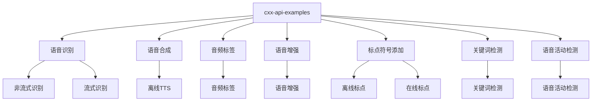

**Diagram sources**
- [streaming-zipformer-cxx-api.cc](file://cxx-api-examples/streaming-zipformer-cxx-api.cc)
- [whisper-cxx-api.cc](file://cxx-api-examples/whisper-cxx-api.cc)
- [audio-tagging-zipformer-cxx-api.cc](file://cxx-api-examples/audio-tagging-zipformer-cxx-api.cc)

**Section sources**
- [cxx-api-examples](file://cxx-api-examples)

## 非流式语音识别

非流式语音识别示例展示了如何使用完整的音频文件进行语音识别。以Whisper模型为例，通过`OfflineRecognizer`类实现非流式识别。

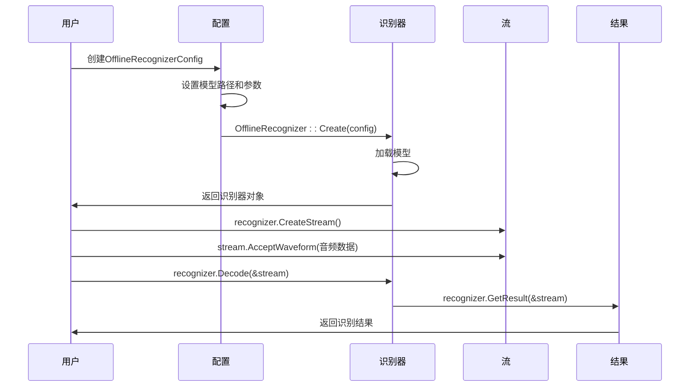

**Diagram sources**
- [whisper-cxx-api.cc](file://cxx-api-examples/whisper-cxx-api.cc)

**Section sources**
- [whisper-cxx-api.cc](file://cxx-api-examples/whisper-cxx-api.cc)

## 流式语音识别

流式语音识别示例展示了如何处理实时音频流。以Zipformer模型为例，通过`OnlineRecognizer`类实现流式识别，支持实时语音识别。

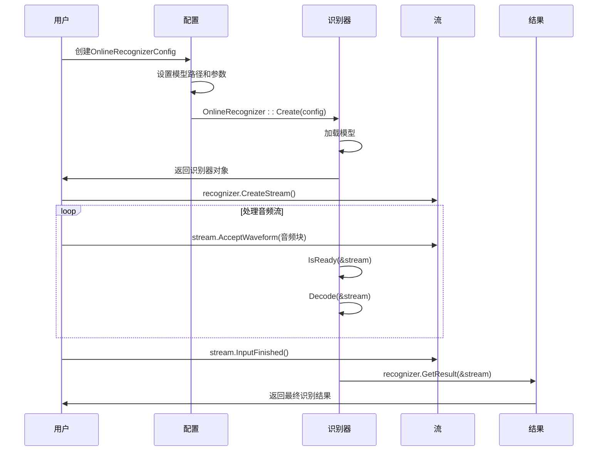

**Diagram sources**
- [streaming-zipformer-cxx-api.cc](file://cxx-api-examples/streaming-zipformer-cxx-api.cc)

**Section sources**
- [streaming-zipformer-cxx-api.cc](file://cxx-api-examples/streaming-zipformer-cxx-api.cc)

## 音频标签

音频标签示例展示了如何使用Zipformer模型进行音频分类和标签识别。通过`AudioTagging`类实现音频事件检测。

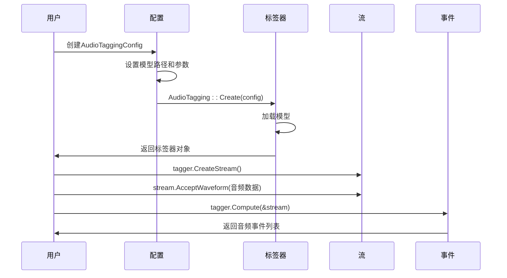

**Diagram sources**
- [audio-tagging-zipformer-cxx-api.cc](file://cxx-api-examples/audio-tagging-zipformer-cxx-api.cc)

**Section sources**
- [audio-tagging-zipformer-cxx-api.cc](file://cxx-api-examples/audio-tagging-zipformer-cxx-api.cc)

## 语音合成

语音合成示例展示了如何使用MatchaTTS模型将文本转换为语音。通过`OfflineTts`类实现离线语音合成。

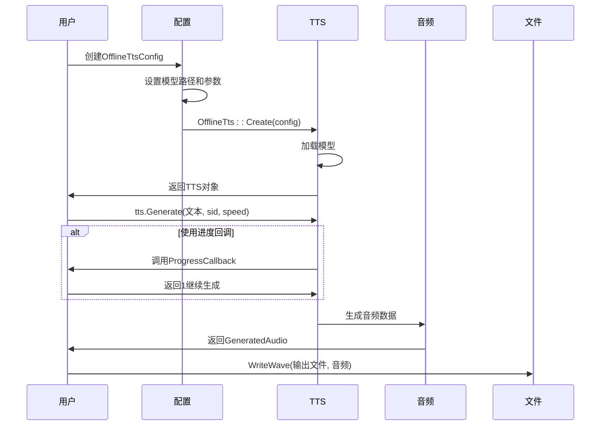

**Diagram sources**
- [matcha-tts-en-cxx-api.cc](file://cxx-api-examples/matcha-tts-en-cxx-api.cc)

**Section sources**
- [matcha-tts-en-cxx-api.cc](file://cxx-api-examples/matcha-tts-en-cxx-api.cc)

## 语音增强

语音增强示例展示了如何使用GTCRN模型去除音频中的噪声。通过`OfflineSpeechDenoiser`类实现语音去噪。

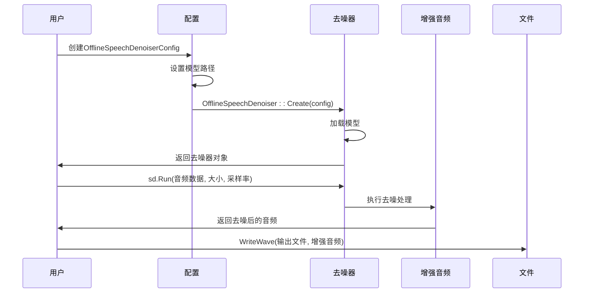

**Diagram sources**
- [speech-enhancement-gtcrn-cxx-api.cc](file://cxx-api-examples/speech-enhancement-gtcrn-cxx-api.cc)

**Section sources**
- [speech-enhancement-gtcrn-cxx-api.cc](file://cxx-api-examples/speech-enhancement-gtcrn-cxx-api.cc)

## 标点符号添加

标点符号添加示例展示了如何为无标点的文本添加适当的标点符号。包含离线和在线两种模式。

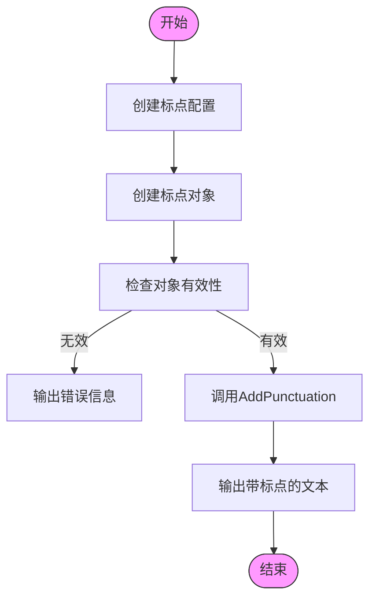

**Diagram sources**
- [offline-punctuation-cxx-api.cc](file://cxx-api-examples/offline-punctuation-cxx-api.cc)
- [online-punctuation-cxx-api.cc](file://cxx-api-examples/online-punctuation-cxx-api.cc)

**Section sources**
- [offline-punctuation-cxx-api.cc](file://cxx-api-examples/offline-punctuation-cxx-api.cc)
- [online-punctuation-cxx-api.cc](file://cxx-api-examples/online-punctuation-cxx-api.cc)

## 关键词检测

关键词检测示例展示了如何在音频流中检测预定义的关键词。通过`KeywordSpotter`类实现关键词检测功能。

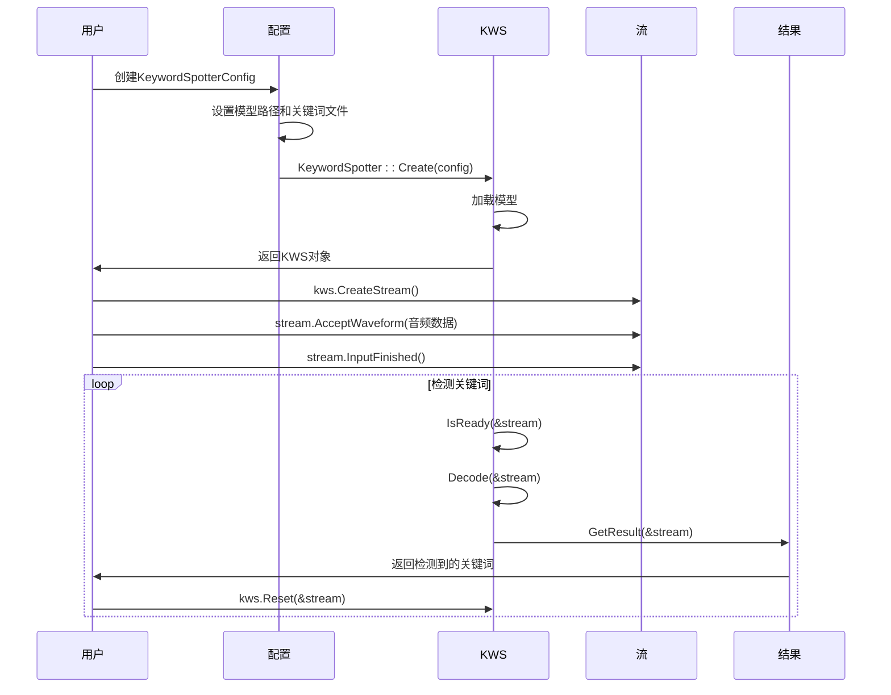

**Diagram sources**
- [kws-cxx-api.cc](file://cxx-api-examples/kws-cxx-api.cc)

**Section sources**
- [kws-cxx-api.cc](file://cxx-api-examples/kws-cxx-api.cc)

## 语音活动检测

语音活动检测示例展示了如何检测音频中的语音活动并去除静音部分。支持Silero-VAD和Ten-VAD两种模型。

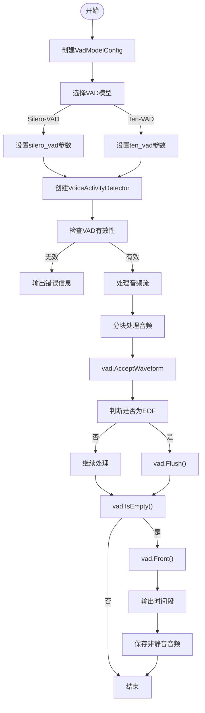

**Diagram sources**
- [vad-cxx-api.cc](file://cxx-api-examples/vad-cxx-api.cc)

**Section sources**
- [vad-cxx-api.cc](file://cxx-api-examples/vad-cxx-api.cc)

## CMake构建系统

C++ API示例使用CMake作为构建系统，`cxx-api-examples/CMakeLists.txt`文件定义了所有示例的构建规则。

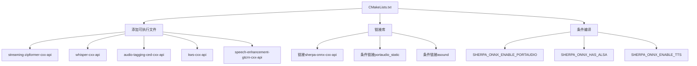

**Diagram sources**
- [CMakeLists.txt](file://cxx-api-examples/CMakeLists.txt)

**Section sources**
- [CMakeLists.txt](file://cxx-api-examples/CMakeLists.txt)

## 运行示例的完整步骤

运行C++ API示例的完整步骤包括环境准备、模型下载、构建和执行。

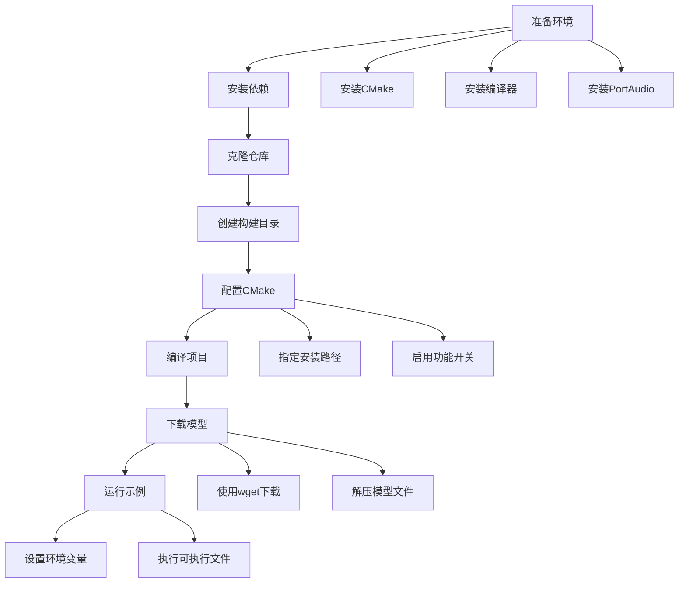

**Section sources**
- [CMakeLists.txt](file://cxx-api-examples/CMakeLists.txt)
- [streaming-zipformer-cxx-api.cc](file://cxx-api-examples/streaming-zipformer-cxx-api.cc)

## 常见错误及解决方案

以下是运行C++ API示例时可能遇到的常见错误及其解决方案。

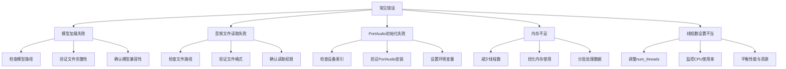

**Section sources**
- [streaming-zipformer-cxx-api.cc](file://cxx-api-examples/streaming-zipformer-cxx-api.cc)
- [whisper-cxx-api.cc](file://cxx-api-examples/whisper-cxx-api.cc)
- [parakeet-tdt-simulate-streaming-microphone-cxx-api.cc](file://cxx-api-examples/parakeet-tdt-simulate-streaming-microphone-cxx-api.cc)