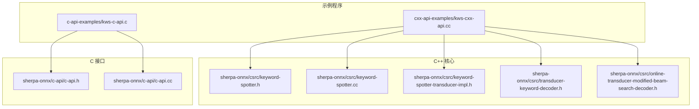
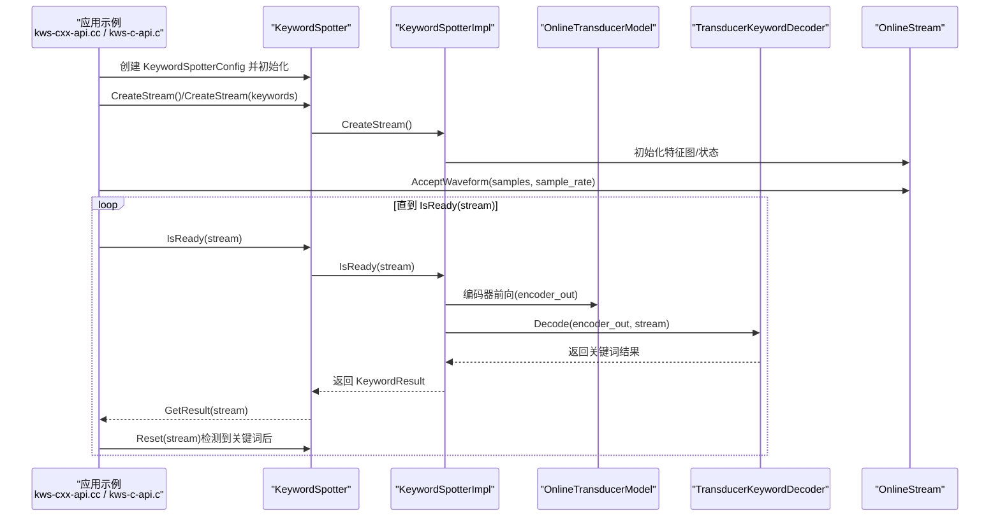
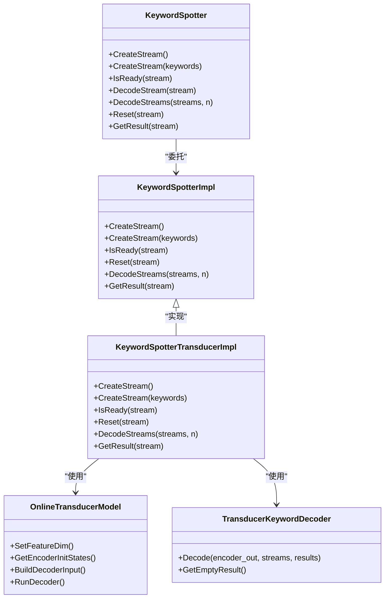
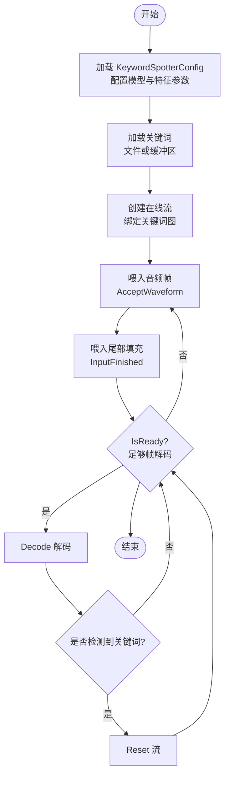

# 关键词检测示例

<cite>
**本文引用的文件**
- [kws-cxx-api.cc](file://cxx-api-examples/kws-cxx-api.cc)
- [kws-c-api.c](file://c-api-examples/kws-c-api.c)
- [keyword-spotter.h](file://sherpa-onnx/csrc/keyword-spotter.h)
- [keyword-spotter.cc](file://sherpa-onnx/csrc/keyword-spotter.cc)
- [keyword-spotter-transducer-impl.h](file://sherpa-onnx/csrc/keyword-spotter-transducer-impl.h)
- [transducer-keyword-decoder.h](file://sherpa-onnx/csrc/transducer-keyword-decoder.h)
- [online-transducer-modified-beam-search-decoder.h](file://sherpa-onnx/csrc/online-transducer-modified-beam-search-decoder.h)
- [c-api.h](file://sherpa-onnx/c-api/c-api.h)
- [c-api.cc](file://sherpa-onnx/c-api/c-api.cc)
- [CMakeLists.txt](file://CMakeLists.txt)
- [README.md](file://README.md)
</cite>

## 目录
1. [简介](#简介)
2. [项目结构](#项目结构)
3. [核心组件](#核心组件)
4. [架构总览](#架构总览)
5. [详细组件分析](#详细组件分析)
6. [依赖关系分析](#依赖关系分析)
7. [性能考量](#性能考量)
8. [故障排查指南](#故障排查指南)
9. [结论](#结论)
10. [附录](#附录)

## 简介
本文件面向使用 sherpa-onnx 的 C++/C 示例，系统性解析关键词检测（Keyword Spotter，简称 KWS）示例的实现与用法，帮助开发者理解如何通过 KeywordSpotter 类完成关键词检测任务，包括：
- 如何配置 KeywordSpotterConfig 参数（如模型路径、特征参数、解码器参数、关键词文件或缓冲区）
- 如何加载关键词检测模型并创建在线音频流
- 如何在音频流中实时检测预设关键词
- 如何定义关键词列表、设置检测灵敏度阈值
- 如何接收和处理检测到的关键词事件
- 如何进行构建与运行

KWS 技术广泛应用于唤醒词检测与语音命令识别场景，例如“小爱同学”“天猫精灵”等智能音箱的唤醒词触发，以及设备端的低功耗关键词监听。

## 项目结构
围绕 KWS 示例的关键文件与模块如下所示：

图表来源
- [kws-cxx-api.cc](file://cxx-api-examples/kws-cxx-api.cc#L1-L143)
- [kws-c-api.c](file://c-api-examples/kws-c-api.c#L1-L153)
- [keyword-spotter.h](file://sherpa-onnx/csrc/keyword-spotter.h#L1-L151)
- [keyword-spotter.cc](file://sherpa-onnx/csrc/keyword-spotter.cc#L1-L189)
- [keyword-spotter-transducer-impl.h](file://sherpa-onnx/csrc/keyword-spotter-transducer-impl.h#L1-L371)
- [transducer-keyword-decoder.h](file://sherpa-onnx/csrc/transducer-keyword-decoder.h#L1-L62)
- [online-transducer-modified-beam-search-decoder.h](file://sherpa-onnx/csrc/online-transducer-modified-beam-search-decoder.h#L1-L64)
- [c-api.h](file://sherpa-onnx/c-api/c-api.h#L1-L200)
- [c-api.cc](file://sherpa-onnx/c-api/c-api.cc#L784-L818)

章节来源
- [kws-cxx-api.cc](file://cxx-api-examples/kws-cxx-api.cc#L1-L143)
- [kws-c-api.c](file://c-api-examples/kws-c-api.c#L1-L153)
- [keyword-spotter.h](file://sherpa-onnx/csrc/keyword-spotter.h#L1-L151)
- [keyword-spotter.cc](file://sherpa-onnx/csrc/keyword-spotter.cc#L1-L189)
- [keyword-spotter-transducer-impl.h](file://sherpa-onnx/csrc/keyword-spotter-transducer-impl.h#L1-L371)
- [transducer-keyword-decoder.h](file://sherpa-onnx/csrc/transducer-keyword-decoder.h#L1-L62)
- [online-transducer-modified-beam-search-decoder.h](file://sherpa-onnx/csrc/online-transducer-modified-beam-search-decoder.h#L1-L64)
- [c-api.h](file://sherpa-onnx/c-api/c-api.h#L1-L200)
- [c-api.cc](file://sherpa-onnx/c-api/c-api.cc#L784-L818)

## 核心组件
- KeywordSpotterConfig：用于配置关键词检测的整体参数，包括特征抽取参数、在线模型配置、解码器相关参数（最大活跃路径、尾随空白数、关键词得分、关键词阈值）、关键词来源（文件或缓冲区）。
- KeywordSpotter：对外暴露的高层接口，负责创建在线音频流、判断是否可解码、执行解码、重置流、获取结果。
- KeywordSpotterTransducerImpl：基于 Transducer 模型的关键词检测实现，负责加载模型、符号表、构建关键词图、初始化解码器、编码器输出后执行关键词解码。
- TransducerKeywordDecoder：针对关键词检测的在线解码器，支持多路流并行解码，维护每个流的状态与帧偏移。
- 在线模型与解码器：使用 Modified Beam Search 解码器，支持上下文图与关键词图，以实现关键词触发。

章节来源
- [keyword-spotter.h](file://sherpa-onnx/csrc/keyword-spotter.h#L20-L151)
- [keyword-spotter.cc](file://sherpa-onnx/csrc/keyword-spotter.cc#L81-L189)
- [keyword-spotter-transducer-impl.h](file://sherpa-onnx/csrc/keyword-spotter-transducer-impl.h#L1-L371)
- [transducer-keyword-decoder.h](file://sherpa-onnx/csrc/transducer-keyword-decoder.h#L1-L62)
- [online-transducer-modified-beam-search-decoder.h](file://sherpa-onnx/csrc/online-transducer-modified-beam-search-decoder.h#L1-L64)

## 架构总览
下图展示了从音频输入到关键词检测结果返回的端到端流程，涵盖特征提取、模型推理、关键词解码与结果封装。

图表来源
- [kws-cxx-api.cc](file://cxx-api-examples/kws-cxx-api.cc#L56-L142)
- [kws-c-api.c](file://c-api-examples/kws-c-api.c#L57-L149)
- [keyword-spotter.h](file://sherpa-onnx/csrc/keyword-spotter.h#L104-L146)
- [keyword-spotter-transducer-impl.h](file://sherpa-onnx/csrc/keyword-spotter-transducer-impl.h#L105-L140)
- [transducer-keyword-decoder.h](file://sherpa-onnx/csrc/transducer-keyword-decoder.h#L37-L58)

## 详细组件分析

### KeywordSpotterConfig 配置详解
- 关键字段
  - feat_config：特征抽取配置（采样率、特征维度等）
  - model_config：在线模型配置（包含 Transducer 的 encoder、decoder、joiner 路径、tokens 文件或缓冲区、provider、线程数、调试开关等）
  - max_active_paths：修改版束搜索的最大活跃路径数
  - num_trailing_blanks：关键词触发后允许的尾随空白帧数
  - keywords_score：关键词词内 token 的额外得分加成
  - keywords_threshold：关键词触发的声学阈值（概率）
  - keywords_file / keywords_buf：关键词来源（二选一），文件逐行存放关键词，或直接从缓冲区字符串解析
- 参数注册与校验
  - Register：为命令行参数注册上述字段
  - Validate：确保只提供 keywords_file 或 keywords_buf 其中之一；若非 WASM 环境，keywords_file 必须存在；同时校验模型配置有效

章节来源
- [keyword-spotter.h](file://sherpa-onnx/csrc/keyword-spotter.h#L53-L91)
- [keyword-spotter.cc](file://sherpa-onnx/csrc/keyword-spotter.cc#L81-L132)

### 关键词加载与解析
- 支持两种方式加载关键词：
  - 从文件 keywords_file：每行一个关键词，英文以空格分隔 token，中文按字符或 BPE 分词
  - 从缓冲区 keywords_buf：直接传入字符串形式的关键词集合
- 实现要点
  - Transducer 实现中会读取关键词并映射到符号表 ID，构建关键词图，以便在解码时对目标词施加额外得分与阈值控制
  - 支持在运行时动态指定关键词（CreateStream(keywords)），多个关键词以“/”分隔

章节来源
- [keyword-spotter-transducer-impl.h](file://sherpa-onnx/csrc/keyword-spotter-transducer-impl.h#L112-L140)
- [keyword-spotter-transducer-impl.h](file://sherpa-onnx/csrc/keyword-spotter-transducer-impl.h#L294-L343)
- [keyword-spotter-transducer-impl.h](file://sherpa-onnx/csrc/keyword-spotter-transducer-impl.h#L345-L367)

### 在线流与解码流程
- 流创建
  - CreateStream()：创建带关键词图的在线流，初始化解码状态与初始上下文
  - CreateStream(keywords)：在流上注入临时关键词，适合一次性测试或动态添加
- 解码循环
  - IsReady(stream)：判断当前帧是否足够进行解码
  - DecodeStreams(stream)：对单个或多个流执行解码
  - GetResult(stream)：返回 KeywordResult，包含 keyword、tokens、timestamps、start_time
  - Reset(stream)：检测到关键词后必须调用，清空内部状态，准备下一次检测
- 结果封装
  - KeywordResult 提供 JSON 字符串序列化，便于跨语言传递

章节来源
- [keyword-spotter.h](file://sherpa-onnx/csrc/keyword-spotter.h#L104-L146)
- [keyword-spotter.cc](file://sherpa-onnx/csrc/keyword-spotter.cc#L146-L189)
- [keyword-spotter.cc](file://sherpa-onnx/csrc/keyword-spotter.cc#L30-L79)

### C/C++ API 映射
- C++ 示例
  - kws-cxx-api.cc：演示如何配置 KeywordSpotterConfig（模型路径、tokens、provider、线程数、调试开关），加载关键词文件，创建流，喂入音频与尾部填充，循环解码并打印 JSON 结果，检测到关键词后 Reset
- C 示例
  - kws-c-api.c：与 C++ 示例等价的流程，使用 C API 的结构体与函数名，最终同样输出 JSON 并 Reset

章节来源
- [kws-cxx-api.cc](file://cxx-api-examples/kws-cxx-api.cc#L22-L142)
- [kws-c-api.c](file://c-api-examples/kws-c-api.c#L23-L149)
- [c-api.h](file://sherpa-onnx/c-api/c-api.h#L82-L133)
- [c-api.cc](file://sherpa-onnx/c-api/c-api.cc#L784-L818)

### 关键词检测算法与解码器
- Modified Beam Search 解码器
  - 维护每个流的假设集，支持浅融合与 LM（可选），控制最大活跃路径数
  - 支持对尾随空白的处理，满足关键词触发后的静默要求
- TransducerKeywordDecoder
  - 针对关键词检测的专用解码器，结合关键词图与符号表，计算 token 级别的时间戳与触发词
  - 支持多流并行解码，提高吞吐

章节来源
- [online-transducer-modified-beam-search-decoder.h](file://sherpa-onnx/csrc/online-transducer-modified-beam-search-decoder.h#L1-L64)
- [transducer-keyword-decoder.h](file://sherpa-onnx/csrc/transducer-keyword-decoder.h#L1-L62)

### 关键词列表定义与阈值设置
- 关键词列表
  - 通过 keywords_file 指定文本文件，每行一个关键词；或通过 keywords_buf 直接传入字符串
  - 英文关键词以空格分隔 token，中文关键词按字符或 BPE 分词
- 灵敏度阈值
  - keywords_threshold：触发阈值，越小越敏感，越容易误检；越大越严格，越不容易触发
  - keywords_score：关键词词内 token 的额外得分加成，提升关键词路径的概率优势
  - num_trailing_blanks：触发后允许的尾随空白帧数，避免过早结束
  - max_active_paths：束搜索宽度，影响速度与召回

章节来源
- [keyword-spotter.h](file://sherpa-onnx/csrc/keyword-spotter.h#L53-L91)
- [keyword-spotter.cc](file://sherpa-onnx/csrc/keyword-spotter.cc#L81-L99)

### 事件接收与处理
- 循环检测
  - 使用 IsReady 判断是否有足够帧解码
  - Decode 执行解码，GetResult 获取 keyword、tokens、timestamps、start_time
  - 检测到 keyword 后立即 Reset，避免重复触发
- JSON 输出
  - KeywordResult.AsJsonString 提供统一的 JSON 格式，便于日志记录与跨语言交互

章节来源
- [kws-cxx-api.cc](file://cxx-api-examples/kws-cxx-api.cc#L84-L93)
- [kws-c-api.c](file://c-api-examples/kws-c-api.c#L84-L94)
- [keyword-spotter.cc](file://sherpa-onnx/csrc/keyword-spotter.cc#L30-L79)

### 构建与运行指导
- 构建选项
  - 开启 C API 示例构建：SHERPA_ONNX_BUILD_C_API_EXAMPLES
  - 可选开启 WASM KWS：SHERPA_ONNX_ENABLE_WASM_KWS
  - 其他通用选项：SHERPA_ONNX_ENABLE_GPU、SHERPA_ONNX_ENABLE_PORTAUDIO 等
- 示例模型与资源
  - 示例下载与解压路径见示例注释，需准备 encoder、decoder、joiner、tokens 与关键词文件
- 运行步骤
  - 下载示例模型与关键词文件
  - 修改示例代码中的模型路径与关键词文件路径
  - 使用 CMake 配置并编译，生成示例可执行文件
  - 运行示例，观察控制台输出的 JSON 结果

章节来源
- [CMakeLists.txt](file://CMakeLists.txt#L1-L200)
- [kws-cxx-api.cc](file://cxx-api-examples/kws-cxx-api.cc#L8-L16)
- [kws-c-api.c](file://c-api-examples/kws-c-api.c#L8-L16)
- [README.md](file://README.md#L1-L200)

## 依赖关系分析
- 组件耦合
  - KeywordSpotter 对外仅暴露 CreateStream、IsReady、Decode、Reset、GetResult 等方法，内部委托给 KeywordSpotterImpl
  - KeywordSpotterImpl 依赖 OnlineTransducerModel、SymbolTable、TransducerKeywordDecoder、ContextGraph 等
  - TransducerKeywordDecoder 依赖 OnlineTransducerModel 与 Modified Beam Search 解码器
- 外部依赖
  - ONNX Runtime（provider 可选 CPU/GPU/DirectML 等）
  - PortAudio（可选，用于麦克风采集）

图表来源
- [keyword-spotter.h](file://sherpa-onnx/csrc/keyword-spotter.h#L93-L146)
- [keyword-spotter-transducer-impl.h](file://sherpa-onnx/csrc/keyword-spotter-transducer-impl.h#L58-L140)
- [transducer-keyword-decoder.h](file://sherpa-onnx/csrc/transducer-keyword-decoder.h#L37-L58)

## 性能考量
- 束搜索宽度（max_active_paths）
  - 宽度越大，召回越高但延迟与计算量增加；可根据设备性能与实时性需求权衡
- 尾随空白（num_trailing_blanks）
  - 适当增大可减少误触发，但可能延长检测到关键词后的稳定时间
- 关键词得分与阈值（keywords_score / keywords_threshold）
  - 适度提高 keywords_score 可增强关键词路径优势；提高 keywords_threshold 可降低误检，但可能漏检
- 线程数与 Provider
  - model_config.num_threads 控制解码线程；provider 选择 CPU/GPU/DirectML 影响吞吐与延迟
- 输入填充
  - 在音频末尾追加零样本（tail padding）有助于模型收敛，避免截断导致的不完整解码

[本节为通用建议，无需列出具体文件来源]

## 故障排查指南
- 关键词文件不存在或格式错误
  - Validate 会检查 keywords_file 是否存在且与 keywords_buf 互斥；请确认路径正确、编码无误
- 模型路径或 tokens 不匹配
  - 确认 encoder/decoder/joiner 与 tokens 路径一致，且与模型版本匹配
- 未调用 Reset 导致重复触发
  - 检查检测到 keyword 后是否调用 Reset；否则同一流会持续触发
- IsReady 永远为假
  - 确保已调用 AcceptWaveform 并在输入结束后调用 InputFinished；同时确保 tail padding 足够
- JSON 输出为空
  - 检查 keywords_threshold 是否过高；或关键词不在关键词图中（确认 token 匹配）

章节来源
- [keyword-spotter.cc](file://sherpa-onnx/csrc/keyword-spotter.cc#L101-L132)
- [kws-cxx-api.cc](file://cxx-api-examples/kws-cxx-api.cc#L84-L93)
- [kws-c-api.c](file://c-api-examples/kws-c-api.c#L84-L94)

## 结论
本示例通过 KeywordSpotter 提供了简洁而强大的关键词检测能力。其核心在于：
- 清晰的配置接口（KeywordSpotterConfig）
- 可扩展的实现（KeywordSpotterImpl 及其 Transducer 实现）
- 面向实时的在线流与解码器（Modified Beam Search + 关键词图）
- 易于集成的 C/C++ API

对于唤醒词与语音命令识别场景，建议根据设备性能与业务需求调整 max_active_paths、keywords_threshold、keywords_score 与 num_trailing_blanks，并在检测到关键词后及时 Reset 流，确保稳定可靠的用户体验。

[本节为总结性内容，无需列出具体文件来源]

## 附录

### 关键词检测流程图（概念）

[本图为概念流程，不对应具体源码文件，故无图表来源]