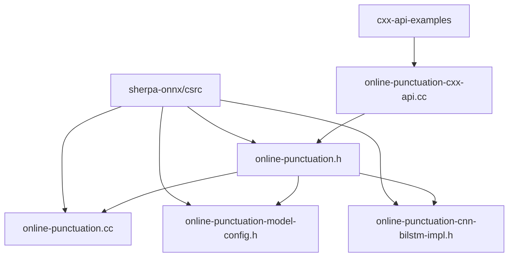
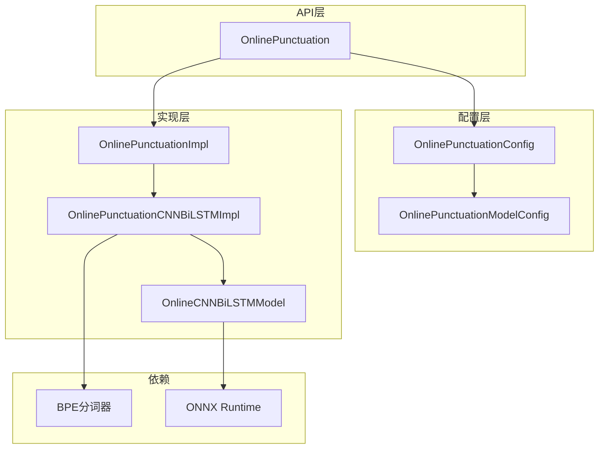
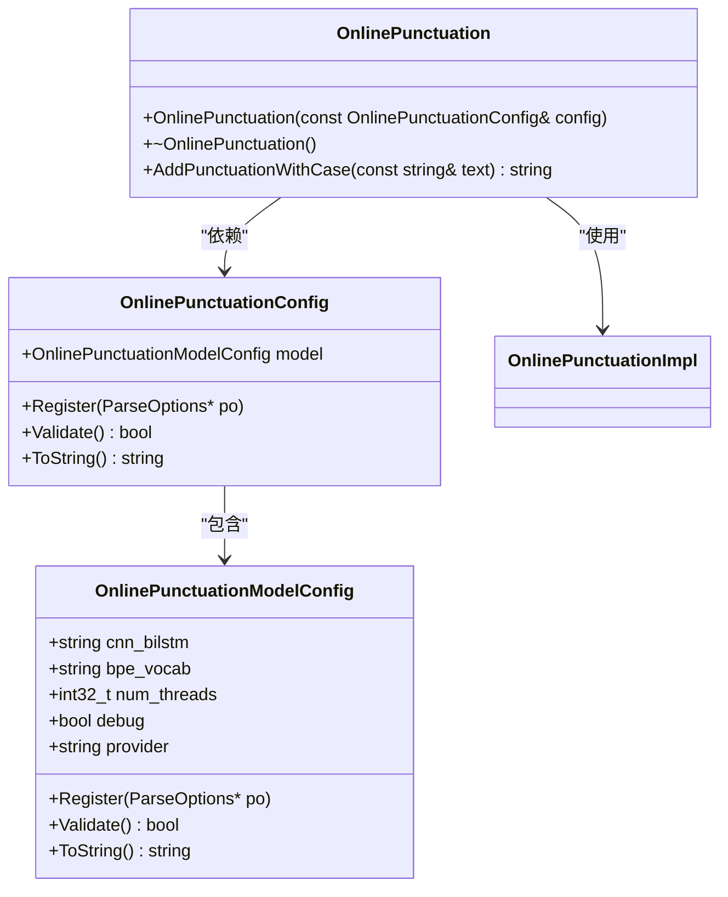
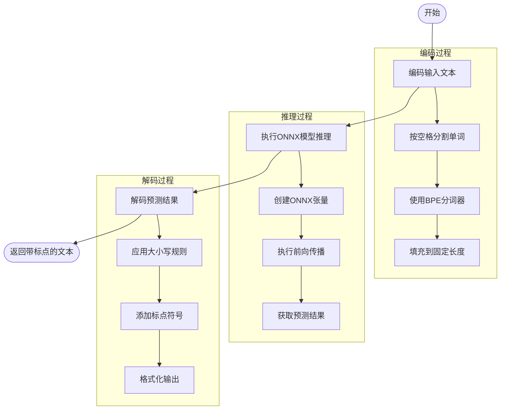
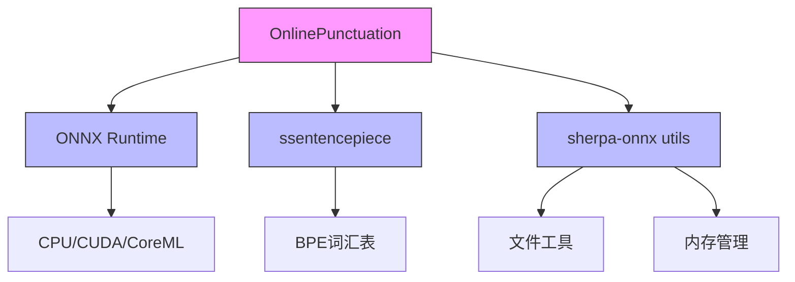

# 在线标点符号添加示例

<cite>
**本文档引用的文件**
- [online-punctuation-cxx-api.cc](file://cxx-api-examples/online-punctuation-cxx-api.cc)
- [online-punctuation.h](file://sherpa-onnx/csrc/online-punctuation.h)
- [online-punctuation.cc](file://sherpa-onnx/csrc/online-punctuation.cc)
- [online-punctuation-model-config.h](file://sherpa-onnx/csrc/online-punctuation-model-config.h)
- [online-punctuation-model-config.cc](file://sherpa-onnx/csrc/online-punctuation-model-config.cc)
- [online-punctuation-cnn-bilstm-impl.h](file://sherpa-onnx/csrc/online-punctuation-cnn-bilstm-impl.h)
- [online-cnn-bilstm-model.h](file://sherpa-onnx/csrc/online-cnn-bilstm-model.h)
</cite>

## 目录
1. [简介](#简介)
2. [项目结构](#项目结构)
3. [核心组件](#核心组件)
4. [架构概述](#架构概述)
5. [详细组件分析](#详细组件分析)
6. [依赖分析](#依赖分析)
7. [性能考虑](#性能考虑)
8. [故障排除指南](#故障排除指南)
9. [结论](#结论)

## 简介
本文档详细介绍了sherpa-onnx项目中的在线标点符号添加C++ API示例。该功能允许对流式输入的文本进行实时标点符号预测和大小写调整，特别适用于实时字幕生成、即时转录等需要低延迟响应的场景。文档将系统性地分析`online-punctuation-cxx-api.cc`示例代码，介绍如何使用`OnlinePunctuation`类进行流式标点符号预测。

## 项目结构
在线标点符号功能的C++ API示例位于`cxx-api-examples`目录下，主要文件为`online-punctuation-cxx-api.cc`。该示例展示了如何配置和使用在线标点符号模型。核心实现位于`sherpa-onnx/csrc`目录下，包含配置类、模型实现和接口定义。



**图表来源**
- [online-punctuation-cxx-api.cc](file://cxx-api-examples/online-punctuation-cxx-api.cc)
- [online-punctuation.h](file://sherpa-onnx/csrc/online-punctuation.h)

**章节来源**
- [online-punctuation-cxx-api.cc](file://cxx-api-examples/online-punctuation-cxx-api.cc)
- [online-punctuation.h](file://sherpa-onnx/csrc/online-punctuation.h)

## 核心组件
本示例的核心是`OnlinePunctuation`类，它提供了对在线标点符号模型的封装。该类通过`OnlinePunctuationConfig`配置对象进行初始化，该配置对象包含模型路径、线程数、运行提供者等参数。`OnlinePunctuation`类的主要功能是通过`AddPunctuationWithCase`方法对输入文本添加标点符号和调整大小写。

**章节来源**
- [online-punctuation.h](file://sherpa-onnx/csrc/online-punctuation.h)
- [online-punctuation.cc](file://sherpa-onnx/csrc/online-punctuation.cc)

## 架构概述
在线标点符号系统的架构采用分层设计，上层为C++ API接口，中层为配置和管理逻辑，底层为具体的模型实现。系统通过ONNX Runtime执行轻量级的CNN-BiLSTM模型进行标点预测。输入文本首先通过BPE分词器进行编码，然后送入模型进行推理，最后将预测结果解码为带标点的文本。



**图表来源**
- [online-punctuation.h](file://sherpa-onnx/csrc/online-punctuation.h)
- [online-punctuation-impl.h](file://sherpa-onnx/csrc/online-punctuation-impl.h)
- [online-punctuation-cnn-bilstm-impl.h](file://sherpa-onnx/csrc/online-punctuation-cnn-bilstm-impl.h)

## 详细组件分析

### OnlinePunctuation类分析
`OnlinePunctuation`类是在线标点符号功能的主要接口。它通过工厂模式创建，接受`OnlinePunctuationConfig`配置对象。该类的实现采用了Pimpl模式（指针到实现），将接口与实现细节分离，提高了代码的封装性和编译防火墙效果。



**图表来源**
- [online-punctuation.h](file://sherpa-onnx/csrc/online-punctuation.h)
- [online-punctuation-model-config.h](file://sherpa-onnx/csrc/online-punctuation-model-config.h)

**章节来源**
- [online-punctuation.h](file://sherpa-onnx/csrc/online-punctuation.h)
- [online-punctuation.cc](file://sherpa-onnx/csrc/online-punctuation.cc)

### 在线处理机制分析
在线标点符号处理机制的核心是`OnlinePunctuationCNNBiLSTMImpl`类。该类实现了`AddPunctuationWithCase`方法，该方法首先对输入文本进行编码，然后通过ONNX模型进行推理，最后将结果解码为带标点的文本。处理流程包括文本分词、模型推理和结果解码三个主要步骤。



**图表来源**
- [online-punctuation-cnn-bilstm-impl.h](file://sherpa-onnx/csrc/online-punctuation-cnn-bilstm-impl.h)
- [online-cnn-bilstm-model.h](file://sherpa-onnx/csrc/online-cnn-bilstm-model.h)

**章节来源**
- [online-punctuation-cnn-bilstm-impl.h](file://sherpa-onnx/csrc/online-punctuation-cnn-bilstm-impl.h)
- [online-cnn-bilstm-model.cc](file://sherpa-onnx/csrc/online-cnn-bilstm-model.cc)

### 配置系统分析
在线标点符号的配置系统由`OnlinePunctuationConfig`和`OnlinePunctuationModelConfig`两个结构体组成。前者是高层配置，后者是模型特定的配置。这种分层配置设计使得系统既灵活又易于扩展。配置参数包括模型文件路径、BPE词汇表路径、线程数、调试模式和执行提供者。

```mermaid
classDiagram
class OnlinePunctuationConfig {
+model OnlinePunctuationModelConfig
+Register(ParseOptions* po)
+Validate() bool
+ToString() string
}
class OnlinePunctuationModelConfig {
+cnn_bilstm string
+bpe_vocab string
+num_threads int32_t
+debug bool
+provider string
+Register(ParseOptions* po)
+Validate() bool
+ToString() string
}
OnlinePunctuationConfig --> OnlinePunctuationModelConfig : "包含"
note right of OnlinePunctuationModelConfig
cnn_bilstm : CNN-BiLSTM模型路径
bpe_vocab : BPE词汇表路径
num_threads : 推理线程数
debug : 调试模式
provider : 执行提供者(cpu/cuda/coreml)
end
```

**图表来源**
- [online-punctuation-model-config.h](file://sherpa-onnx/csrc/online-punctuation-model-config.h)
- [online-punctuation-model-config.cc](file://sherpa-onnx/csrc/online-punctuation-model-config.cc)

**章节来源**
- [online-punctuation-model-config.h](file://sherpa-onnx/csrc/online-punctuation-model-config.h)
- [online-punctuation-model-config.cc](file://sherpa-onnx/csrc/online-punctuation-model-config.cc)

## 依赖分析
在线标点符号功能依赖于多个外部组件和库。主要依赖包括ONNX Runtime用于模型推理，ssentencepiece用于BPE分词，以及sherpa-onnx内部的通用工具类。这些依赖通过清晰的接口进行交互，确保了系统的模块化和可维护性。



**图表来源**
- [online-punctuation-cnn-bilstm-impl.h](file://sherpa-onnx/csrc/online-punctuation-cnn-bilstm-impl.h)
- [online-cnn-bilstm-model.h](file://sherpa-onnx/csrc/online-cnn-bilstm-model.h)

**章节来源**
- [online-punctuation-cnn-bilstm-impl.h](file://sherpa-onnx/csrc/online-punctuation-cnn-bilstm-impl.h)
- [online-cnn-bilstm-model.cc](file://sherpa-onnx/csrc/online-cnn-bilstm-model.cc)

## 性能考虑
在线标点符号系统的性能主要受模型推理速度和文本处理效率的影响。系统通过使用轻量级的CNN-BiLSTM模型和优化的BPE分词器来确保低延迟。配置中的`num_threads`参数允许用户根据硬件能力调整并行度，而`provider`参数则允许选择最适合的执行后端（CPU、CUDA或CoreML）。

**章节来源**
- [online-punctuation-model-config.h](file://sherpa-onnx/csrc/online-punctuation-model-config.h)
- [online-punctuation-cnn-bilstm-impl.h](file://sherpa-onnx/csrc/online-punctuation-cnn-bilstm-impl.h)

## 故障排除指南
在使用在线标点符号功能时，常见的问题包括模型文件路径错误、BPE词汇表缺失和ONNX Runtime初始化失败。系统提供了详细的错误日志，通过设置`debug=true`可以获取更详细的调试信息。确保模型文件和词汇表文件路径正确，并且文件具有适当的读取权限是解决大多数问题的关键。

**章节来源**
- [online-punctuation-model-config.cc](file://sherpa-onnx/csrc/online-punctuation-model-config.cc)
- [online-punctuation-cnn-bilstm-impl.h](file://sherpa-onnx/csrc/online-punctuation-cnn-bilstm-impl.h)

## 结论
sherpa-onnx的在线标点符号C++ API提供了一个高效、灵活的解决方案，用于实时文本流的标点符号预测和大小写调整。通过清晰的分层架构和模块化设计，该系统易于集成到各种实时语音识别和文本处理应用中。其低延迟特性和准确的预测能力使其成为实时字幕生成、即时转录等场景的理想选择。