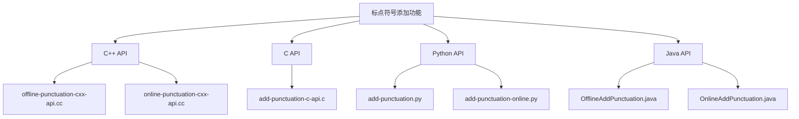
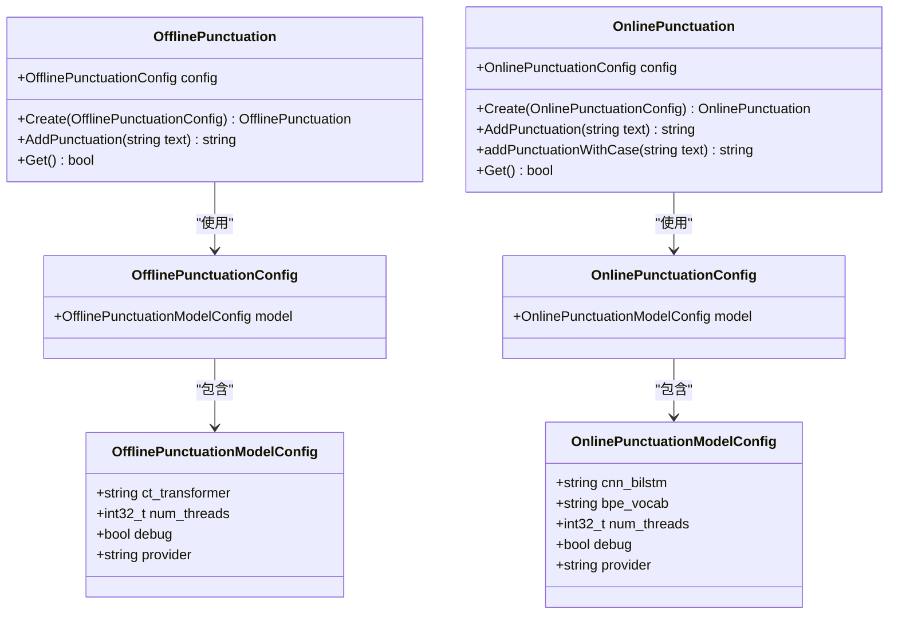
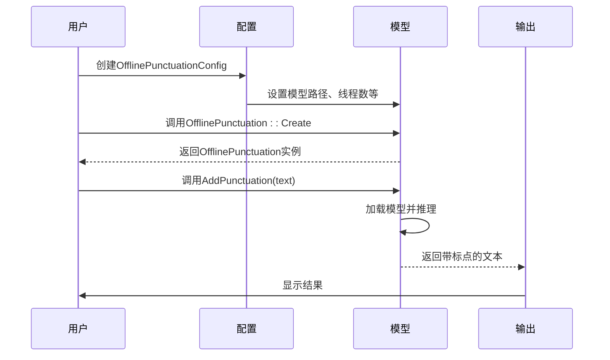
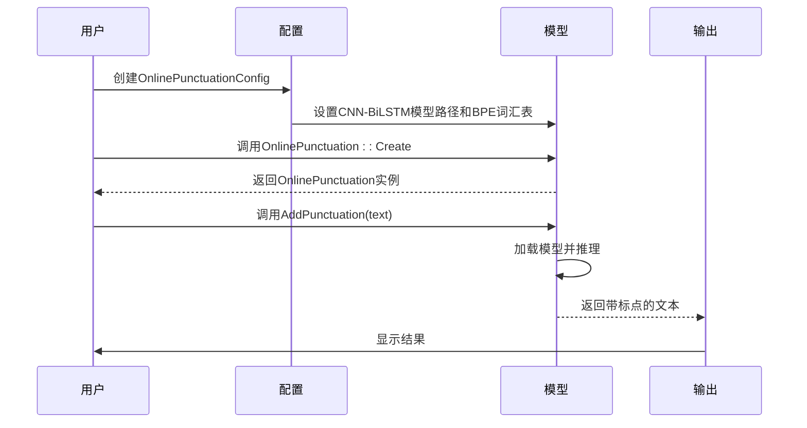
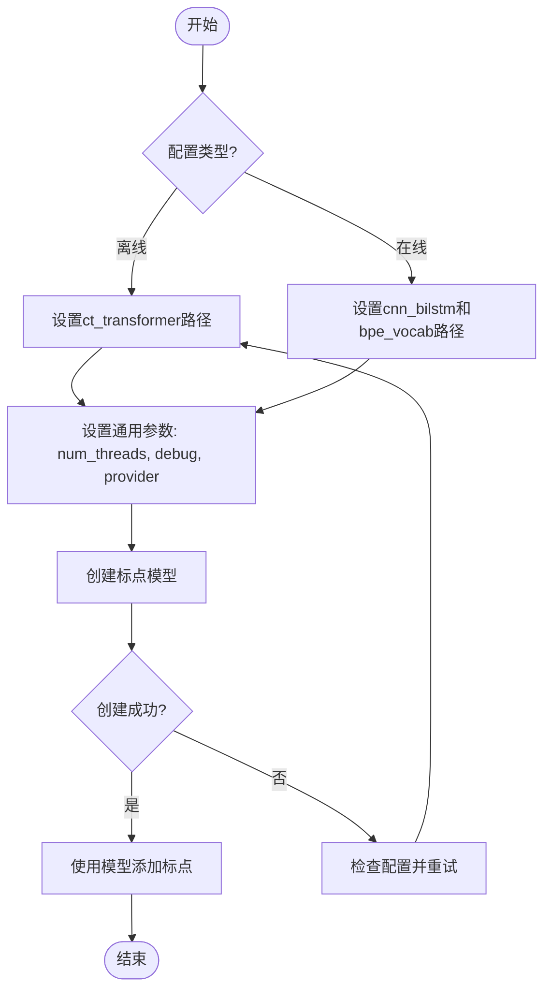
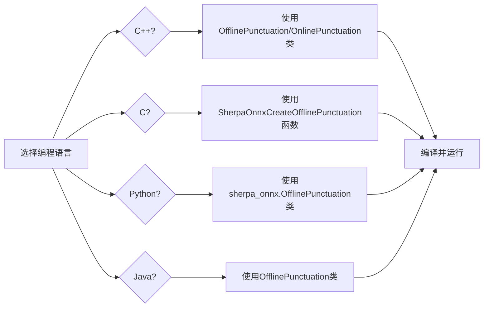

# 标点符号添加示例

<cite>
**本文档中引用的文件**  
- [offline-punctuation-cxx-api.cc](file://cxx-api-examples/offline-punctuation-cxx-api.cc)
- [online-punctuation-cxx-api.cc](file://cxx-api-examples/online-punctuation-cxx-api.cc)
- [add-punctuation-c-api.c](file://c-api-examples/add-punctuation-c-api.c)
- [add-punctuation.py](file://python-api-examples/add-punctuation.py)
- [add-punctuation-online.py](file://python-api-examples/add-punctuation-online.py)
- [OfflineAddPunctuation.java](file://java-api-examples/OfflineAddPunctuation.java)
- [OnlineAddPunctuation.java](file://java-api-examples/OnlineAddPunctuation.java)
- [offline-punctuation-model-config.h](file://sherpa-onnx/csrc/offline-punctuation-model-config.h)
- [online-punctuation-model-config.h](file://sherpa-onnx/csrc/online-punctuation-model-config.h)
</cite>

## 目录
1. [项目结构](#项目结构)
2. [核心组件](#核心组件)
3. [离线标点添加](#离线标点添加)
4. [在线标点添加](#在线标点添加)
5. [模型配置详解](#模型配置详解)
6. [构建与运行](#构建与运行)

## 项目结构

sherpa-onnx项目提供了多种编程语言的API示例，其中标点符号添加功能在多个目录中都有实现。C++ API示例位于`cxx-api-examples/`目录下，包含离线和在线标点添加的完整示例。



**图示来源**
- [cxx-api-examples](file://cxx-api-examples)
- [c-api-examples](file://c-api-examples)
- [python-api-examples](file://python-api-examples)
- [java-api-examples](file://java-api-examples)

**本节来源**
- [project_structure](file://project_structure)

## 核心组件

sherpa-onnx的标点符号添加功能主要由两个核心类组成：`OfflinePunctuation`和`OnlinePunctuation`。这两个类分别处理完整文本的标点添加和流式文本的标点添加。



**图示来源**
- [offline-punctuation-cxx-api.cc](file://cxx-api-examples/offline-punctuation-cxx-api.cc)
- [online-punctuation-cxx-api.cc](file://cxx-api-examples/online-punctuation-cxx-api.cc)
- [offline-punctuation-model-config.h](file://sherpa-onnx/csrc/offline-punctuation-model-config.h)
- [online-punctuation-model-config.h](file://sherpa-onnx/csrc/online-punctuation-model-config.h)

**本节来源**
- [offline-punctuation-cxx-api.cc](file://cxx-api-examples/offline-punctuation-cxx-api.cc#L1-L41)
- [online-punctuation-cxx-api.cc](file://cxx-api-examples/online-punctuation-cxx-api.cc#L1-L42)

## 离线标点添加

离线标点添加功能适用于处理完整的文本，将无标点的识别文本转换为带有合适标点符号的可读文本。`OfflinePunctuation`类使用CT-Transformer模型来实现这一功能。

### 配置与初始化

离线标点添加需要配置`OfflinePunctuationConfig`，其中包含模型路径、线程数、调试模式和执行提供者等参数。模型路径指向CT-Transformer模型文件。



**图示来源**
- [offline-punctuation-cxx-api.cc](file://cxx-api-examples/offline-punctuation-cxx-api.cc#L19-L27)
- [offline-punctuation-model-config.h](file://sherpa-onnx/csrc/offline-punctuation-model-config.h#L13-L38)

**本节来源**
- [offline-punctuation-cxx-api.cc](file://cxx-api-examples/offline-punctuation-cxx-api.cc#L16-L40)
- [add-punctuation.py](file://python-api-examples/add-punctuation.py#L20-L30)
- [OfflineAddPunctuation.java](file://java-api-examples/OfflineAddPunctuation.java#L13-L22)

## 在线标点添加

在线标点添加功能适用于流式文本处理，能够实时为输入的文本添加标点符号。`OnlinePunctuation`类使用CNN-BiLSTM模型来实现这一功能。

### 配置与初始化

在线标点添加需要配置`OnlinePunctuationConfig`，除了基本的模型参数外，还需要指定BPE词汇表文件。这使得模型能够更好地处理英文文本的子词单元。



**图示来源**
- [online-punctuation-cxx-api.cc](file://cxx-api-examples/online-punctuation-cxx-api.cc#L19-L28)
- [online-punctuation-model-config.h](file://sherpa-onnx/csrc/online-punctuation-model-config.h#L14-L43)

**本节来源**
- [online-punctuation-cxx-api.cc](file://cxx-api-examples/online-punctuation-cxx-api.cc#L16-L40)
- [add-punctuation-online.py](file://python-api-examples/add-punctuation-online.py#L21-L33)
- [OnlineAddPunctuation.java](file://java-api-examples/OnlineAddPunctuation.java#L14-L24)

## 模型配置详解

标点符号添加功能的配置分为离线和在线两种模式，每种模式都有其特定的配置参数。

### 离线配置参数

离线标点添加的配置参数包括：

| 参数 | 类型 | 描述 |
|------|------|------|
| ct_transformer | string | CT-Transformer模型文件路径 |
| num_threads | int32_t | 运行神经网络的线程数 |
| debug | bool | 是否在加载模型时打印模型信息 |
| provider | string | 指定使用的执行提供者（cpu, cuda, coreml） |

### 在线配置参数

在线标点添加的配置参数包括：

| 参数 | 类型 | 描述 |
|------|------|------|
| cnn_bilstm | string | CNN-BiLSTM模型文件路径 |
| bpe_vocab | string | BPE词汇表文件路径 |
| num_threads | int32_t | 运行神经网络的线程数 |
| debug | bool | 是否在加载模型时打印模型信息 |
| provider | string | 指定使用的执行提供者（cpu, cuda, coreml） |



**图示来源**
- [offline-punctuation-model-config.h](file://sherpa-onnx/csrc/offline-punctuation-model-config.h#L13-L38)
- [online-punctuation-model-config.h](file://sherpa-onnx/csrc/online-punctuation-model-config.h#L14-L43)

**本节来源**
- [offline-punctuation-model-config.h](file://sherpa-onnx/csrc/offline-punctuation-model-config.h#L1-L55)
- [online-punctuation-model-config.h](file://sherpa-onnx/csrc/online-punctuation-model-config.h#L1-L43)

## 构建与运行

标点符号添加示例的构建和运行需要遵循特定的步骤，包括模型下载、编译和执行。

### 模型下载

在运行示例之前，需要下载相应的标点符号模型：

```bash
# 下载离线标点模型
wget https://github.com/k2-fsa/sherpa-onnx/releases/download/punctuation-models/sherpa-onnx-punct-ct-transformer-zh-en-vocab272727-2024-04-12-int8.tar.bz2
tar xvf sherpa-onnx-punct-ct-transformer-zh-en-vocab272727-2024-04-12-int8.tar.bz2

# 下载在线标点模型
wget https://github.com/k2-fsa/sherpa-onnx/releases/download/punctuation-models/sherpa-onnx-online-punct-en-2024-08-06.tar.bz2
tar xvf sherpa-onnx-online-punct-en-2024-08-06.tar.bz2
```

### 编译与运行

C++示例的编译和运行步骤如下：

```bash
# 编译离线标点示例
g++ -o offline-punctuation offline-punctuation-cxx-api.cc -lsherpa-onnx-cxx-api

# 运行离线标点示例
./offline-punctuation

# 编译在线标点示例
g++ -o online-punctuation online-punctuation-cxx-api.cc -lsherpa-onnx-cxx-api

# 运行在线标点示例
./online-punctuation
```

### 多语言支持

sherpa-onnx提供了多种编程语言的API示例，包括C++、C、Python、Java等。每种语言的使用方式类似，都是通过创建相应的标点类实例，然后调用添加标点的方法。



**图示来源**
- [offline-punctuation-cxx-api.cc](file://cxx-api-examples/offline-punctuation-cxx-api.cc)
- [add-punctuation-c-api.c](file://c-api-examples/add-punctuation-c-api.c)
- [add-punctuation.py](file://python-api-examples/add-punctuation.py)
- [OfflineAddPunctuation.java](file://java-api-examples/OfflineAddPunctuation.java)

**本节来源**
- [offline-punctuation-cxx-api.cc](file://cxx-api-examples/offline-punctuation-cxx-api.cc#L6-L8)
- [online-punctuation-cxx-api.cc](file://cxx-api-examples/online-punctuation-cxx-api.cc#L6-L8)
- [add-punctuation-c-api.c](file://c-api-examples/add-punctuation-c-api.c#L12-L14)
- [README.md](file://README.md#L1-L200)