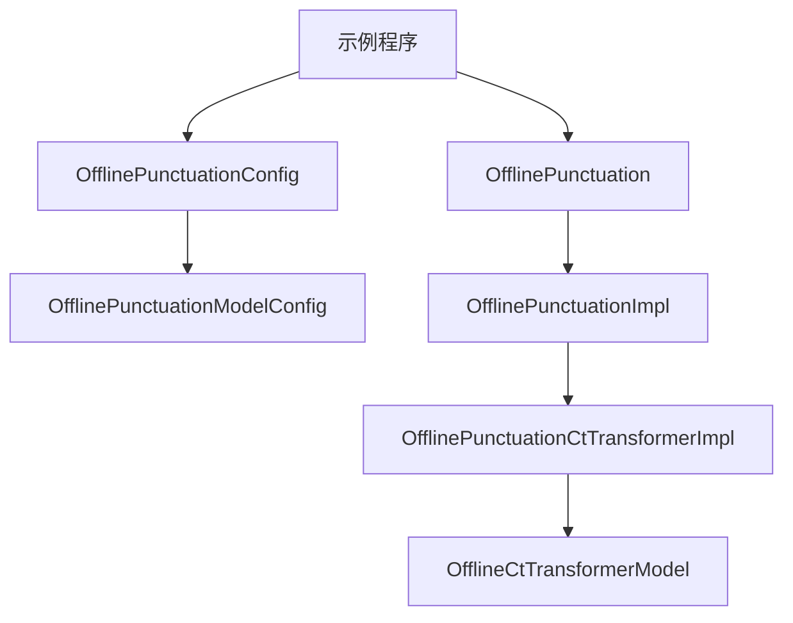
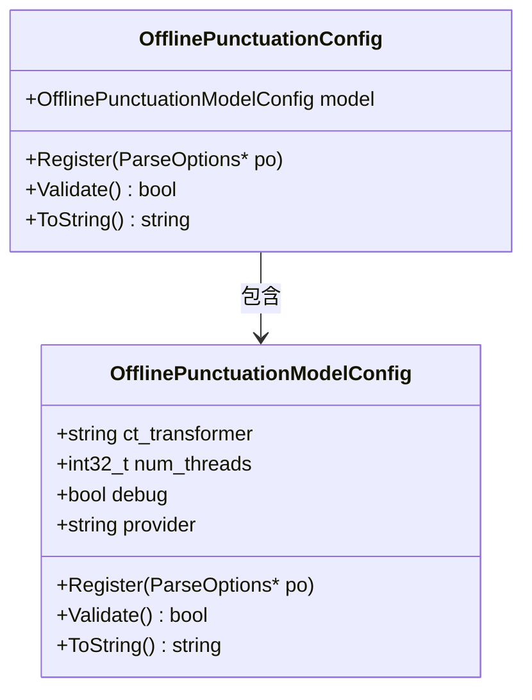
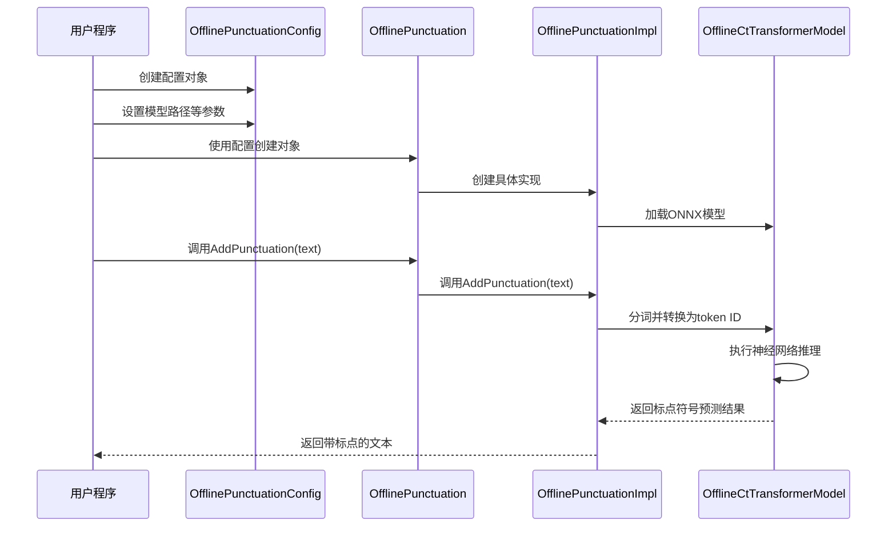
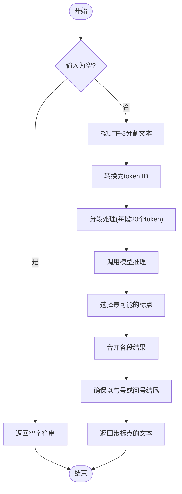

# 离线标点符号添加示例

<cite>
**本文档中引用的文件**  
- [offline-punctuation-cxx-api.cc](file://cxx-api-examples/offline-punctuation-cxx-api.cc)
- [offline-punctuation.h](file://sherpa-onnx/csrc/offline-punctuation.h)
- [offline-punctuation.cc](file://sherpa-onnx/csrc/offline-punctuation.cc)
- [offline-punctuation-model-config.h](file://sherpa-onnx/csrc/offline-punctuation-model-config.h)
- [offline-punctuation-model-config.cc](file://sherpa-onnx/csrc/offline-punctuation-model-config.cc)
- [offline-punctuation-impl.h](file://sherpa-onnx/csrc/offline-punctuation-impl.h)
- [offline-punctuation-impl.cc](file://sherpa-onnx/csrc/offline-punctuation-impl.cc)
- [offline-punctuation-ct-transformer-impl.h](file://sherpa-onnx/csrc/offline-punctuation-ct-transformer-impl.h)
- [offline-ct-transformer-model.h](file://sherpa-onnx/csrc/offline-ct-transformer-model.h)
</cite>

## 目录
1. [项目结构](#项目结构)
2. [核心组件](#核心组件)
3. [配置详解](#配置详解)
4. [工作流程](#工作流程)
5. [代码实现分析](#代码实现分析)
6. [应用场景](#应用场景)

## 项目结构

离线标点符号添加功能位于 `cxx-api-examples` 目录下的 `offline-punctuation-cxx-api.cc` 文件中，该文件提供了使用 C++ API 的完整示例。核心实现位于 `sherpa-onnx/csrc` 目录下，包含离线标点符号处理的类定义和实现。

**图示来源**
- [offline-punctuation-cxx-api.cc](file://cxx-api-examples/offline-punctuation-cxx-api.cc)
- [offline-punctuation.h](file://sherpa-onnx/csrc/offline-punctuation.h)
- [offline-punctuation-impl.h](file://sherpa-onnx/csrc/offline-punctuation-impl.h)
- [offline-punctuation-ct-transformer-impl.h](file://sherpa-onnx/csrc/offline-punctuation-ct-transformer-impl.h)

**本节来源**
- [offline-punctuation-cxx-api.cc](file://cxx-api-examples/offline-punctuation-cxx-api.cc)

## 核心组件

离线标点符号添加功能的核心组件包括 `OfflinePunctuation` 类和 `OfflinePunctuationConfig` 配置结构。`OfflinePunctuation` 类负责加载模型并执行标点符号添加操作，而 `OfflinePunctuationConfig` 结构则用于配置模型参数。

**本节来源**
- [offline-punctuation.h](file://sherpa-onnx/csrc/offline-punctuation.h)
- [offline-punctuation.cc](file://sherpa-onnx/csrc/offline-punctuation.cc)

## 配置详解

`OfflinePunctuationConfig` 结构包含一个 `OfflinePunctuationModelConfig` 成员，用于配置标点符号模型。`OfflinePunctuationModelConfig` 包含以下关键参数：

- **ct_transformer**: CT-Transformer 模型文件路径
- **num_threads**: 运行神经网络的线程数
- **debug**: 是否在加载模型时打印模型信息
- **provider**: 指定使用的计算提供者（cpu, cuda, coreml）

**图示来源**
- [offline-punctuation-model-config.h](file://sherpa-onnx/csrc/offline-punctuation-model-config.h)
- [offline-punctuation-model-config.cc](file://sherpa-onnx/csrc/offline-punctuation-model-config.cc)

**本节来源**
- [offline-punctuation-model-config.h](file://sherpa-onnx/csrc/offline-punctuation-model-config.h)

## 工作流程

离线标点符号添加的工作流程包括以下步骤：
1. 创建 `OfflinePunctuationConfig` 配置对象
2. 设置模型文件路径和其他参数
3. 创建 `OfflinePunctuation` 对象
4. 调用 `AddPunctuation` 方法处理文本
5. 获取带标点符号的输出文本

**图示来源**
- [offline-punctuation-cxx-api.cc](file://cxx-api-examples/offline-punctuation-cxx-api.cc)
- [offline-punctuation.cc](file://sherpa-onnx/csrc/offline-punctuation.cc)
- [offline-punctuation-impl.cc](file://sherpa-onnx/csrc/offline-punctuation-impl.cc)
- [offline-punctuation-ct-transformer-impl.h](file://sherpa-onnx/csrc/offline-punctuation-ct-transformer-impl.h)

**本节来源**
- [offline-punctuation-cxx-api.cc](file://cxx-api-examples/offline-punctuation-cxx-api.cc)

## 代码实现分析

`OfflinePunctuation` 类的实现采用了工厂模式和策略模式。`OfflinePunctuation` 类通过 `OfflinePunctuationImpl` 接口与具体的实现解耦，当前实现为 `OfflinePunctuationCtTransformerImpl`，使用 CT-Transformer 模型进行标点符号预测。

`OfflinePunctuationCtTransformerImpl::AddPunctuation` 方法的处理流程如下：
1. 将输入文本按 UTF-8 编码分割为 token
2. 将 token 转换为对应的 ID
3. 将文本分段处理，每段最多 20 个 token
4. 对每段文本调用模型进行推理
5. 根据模型输出选择最可能的标点符号
6. 合并各段结果并添加最终标点

**图示来源**
- [offline-punctuation-ct-transformer-impl.h](file://sherpa-onnx/csrc/offline-punctuation-ct-transformer-impl.h)
- [offline-punctuation-impl.cc](file://sherpa-onnx/csrc/offline-punctuation-impl.cc)

**本节来源**
- [offline-punctuation-ct-transformer-impl.h](file://sherpa-onnx/csrc/offline-punctuation-ct-transformer-impl.h)

## 应用场景

离线标点符号添加功能主要用于后处理语音识别结果，将无标点的文本转换为带标点的可读文本。该功能特别适用于以下场景：

- 语音识别结果的后处理
- 会议记录的自动标点
- 语音转写文本的格式化
- 多语言混合文本的标点添加

通过此功能，可以显著提升文本的可读性和语义清晰度，使语音识别结果更接近人工转录的质量。

**本节来源**
- [offline-punctuation-cxx-api.cc](file://cxx-api-examples/offline-punctuation-cxx-api.cc)
- [offline-punctuation-ct-transformer-impl.h](file://sherpa-onnx/csrc/offline-punctuation-ct-transformer-impl.h)