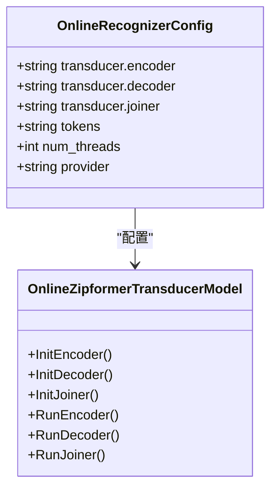
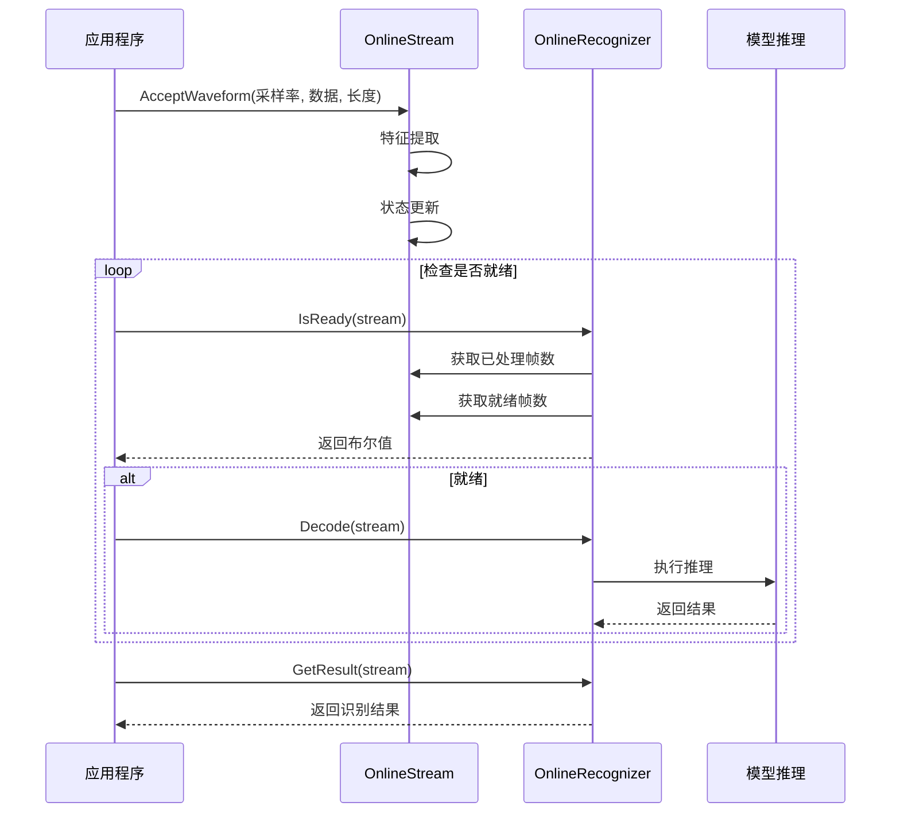
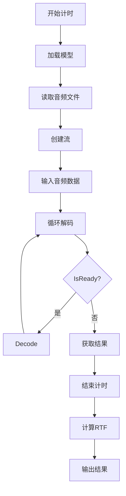
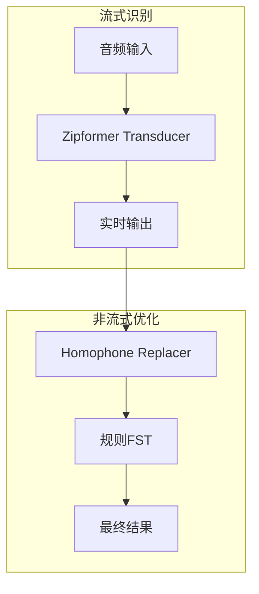
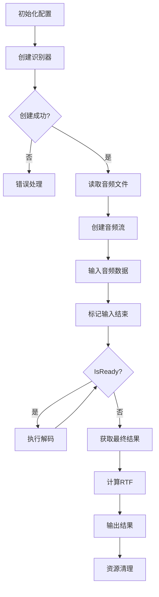

# Zipformer流式语音识别示例

<cite>
**本文档引用文件**  
- [streaming-zipformer-cxx-api.cc](file://cxx-api-examples/streaming-zipformer-cxx-api.cc)
- [streaming-zipformer-with-hr-cxx-api.cc](file://cxx-api-examples/streaming-zipformer-with-hr-cxx-api.cc)
- [streaming-zipformer-rtf-cxx-api.cc](file://cxx-api-examples/streaming-zipformer-rtf-cxx-api.cc)
- [online-zipformer-transducer-model.h](file://sherpa-onnx/csrc/online-zipformer-transducer-model.h)
- [online-zipformer2-ctc-model.h](file://sherpa-onnx/csrc/online-zipformer2-ctc-model.h)
- [online-zipformer2-transducer-model.cc](file://sherpa-onnx/csrc/online-zipformer2-transducer-model.cc)
- [online-recognizer-paraformer-impl.h](file://sherpa-onnx/csrc/online-recognizer-paraformer-impl.h)
- [sherpa-onnx-offline.cc](file://sherpa-onnx/csrc/sherpa-onnx-offline.cc)
</cite>

## 目录
1. [引言](#引言)
2. [Zipformer模型架构差异](#zipformer模型架构差异)
3. [OnlineRecognizer配置与模型加载](#onlinerecognizer配置与模型加载)
4. [OnlineStream音频流处理机制](#onlinestream音频流处理机制)
5. [实时因子(RTF)计算与性能评估](#实时因子rtf计算与性能评估)
6. [混合推理(with-hr)模式分析](#混合推理with-hr模式分析)
7. [完整代码执行流程示例](#完整代码执行流程示例)
8. [结论](#结论)

## 引言
本文件详细解析sherpa-onnx项目中基于Zipformer模型的流式语音识别C++ API实现。重点分析Zipformer CTC与Zipformer Transducer两种模型架构在流式自动语音识别（ASR）中的技术差异，深入探讨OnlineRecognizer配置中encoder、decoder、joiner等组件的加载机制，以及OnlineStream对音频流的实时处理流程。同时，解释实时因子（RTF）的计算方法及其在性能评估中的意义，并分析with-hr（混合推理）模式如何结合非流式模型提升识别准确率。

## Zipformer模型架构差异

Zipformer CTC和Zipformer Transducer是两种不同的流式语音识别模型架构，其核心差异体现在模型结构和解码机制上。

Zipformer CTC模型采用连接时序分类（Connectionist Temporal Classification）架构，模型仅包含编码器（encoder），通过CTC损失函数直接输出字符序列，无需对齐标注。该架构适用于端到端的流式识别，具有较低的延迟和较高的实时性。

Zipformer Transducer模型则采用神经网络转换器（Neural Transducer）架构，包含编码器（encoder）、解码器（decoder）和连接器（joiner）三个组件。编码器处理声学特征，解码器处理语言模型信息，连接器融合两者输出并生成最终的token概率。这种架构能够更好地建模声学和语言信息的交互，通常具有更高的识别准确率。

**Section sources**
- [online-zipformer2-ctc-model.h](file://sherpa-onnx/csrc/online-zipformer2-ctc-model.h)
- [online-zipformer-transducer-model.h](file://sherpa-onnx/csrc/online-zipformer-transducer-model.h)

## OnlineRecognizer配置与模型加载

OnlineRecognizer是流式语音识别的核心配置类，负责管理模型组件的加载与初始化。在Zipformer Transducer模型中，需要分别指定encoder、decoder和joiner三个ONNX模型文件的路径。



**Diagram sources**
- [streaming-zipformer-cxx-api.cc](file://cxx-api-examples/streaming-zipformer-cxx-api.cc)
- [online-zipformer-transducer-model.h](file://sherpa-onnx/csrc/online-zipformer-transducer-model.h)
- [online-zipformer2-transducer-model.cc](file://sherpa-onnx/csrc/online-zipformer2-transducer-model.cc)

模型加载过程通过调用`ReadFile`函数读取模型文件的二进制数据，然后分别初始化encoder、decoder和joiner的ONNX Runtime会话（Session）。每个模型的元数据（如维度、头数、层数等）在初始化时从模型文件中读取，用于后续的推理计算。

**Section sources**
- [streaming-zipformer-cxx-api.cc](file://cxx-api-examples/streaming-zipformer-cxx-api.cc)
- [online-zipformer2-transducer-model.cc](file://sherpa-onnx/csrc/online-zipformer2-transducer-model.cc)

## OnlineStream音频流处理机制

OnlineStream是处理音频流的核心类，负责管理音频数据的输入、特征提取和状态维护。通过`AcceptWaveform`方法将原始音频波形数据输入到流中，该方法接收采样率、音频数据指针和数据长度作为参数。



**Diagram sources**
- [streaming-zipformer-cxx-api.cc](file://cxx-api-examples/streaming-zipformer-cxx-api.cc)
- [online-recognizer-paraformer-impl.h](file://sherpa-onnx/csrc/online-recognizer-paraformer-impl.h)

`IsReady`判断机制基于已处理帧数和就绪帧数的比较，当就绪帧数超过已处理帧数加上块大小时，表示有足够的数据进行下一次推理。`GetResult`方法用于获取当前流的部分识别结果，可以在推理过程中多次调用以实现渐进式输出。

**Section sources**
- [streaming-zipformer-cxx-api.cc](file://cxx-api-examples/streaming-zipformer-cxx-api.cc)
- [online-recognizer-paraformer-impl.h](file://sherpa-onnx/csrc/online-recognizer-paraformer-impl.h)

## 实时因子(RTF)计算与性能评估

实时因子（Real Time Factor, RTF）是评估语音识别系统性能的重要指标，表示处理音频所需的时间与音频时长的比值。RTF计算公式为：

```
RTF = 处理耗时 / 音频时长
```

当RTF小于1时，表示系统能够实时处理音频流；当RTF大于1时，表示处理速度跟不上音频输入速度。



**Diagram sources**
- [streaming-zipformer-rtf-cxx-api.cc](file://cxx-api-examples/streaming-zipformer-rtf-cxx-api.cc)
- [sherpa-onnx-offline.cc](file://sherpa-onnx/csrc/sherpa-onnx-offline.cc)

在性能评估中，可以通过多次运行识别任务来计算平均RTF，从而更准确地评估系统的稳定性和性能表现。

**Section sources**
- [streaming-zipformer-rtf-cxx-api.cc](file://cxx-api-examples/streaming-zipformer-rtf-cxx-api.cc)
- [sherpa-onnx-offline.cc](file://sherpa-onnx/csrc/sherpa-onnx-offline.cc)

## 混合推理(with-hr)模式分析

混合推理（Hybrid Reasoning, with-hr）模式通过结合流式模型和非流式模型的优势，提升语音识别的准确率。在with-hr模式下，系统首先使用流式模型进行实时识别，然后利用非流式模型对识别结果进行后处理和优化。



**Diagram sources**
- [streaming-zipformer-with-hr-cxx-api.cc](file://cxx-api-examples/streaming-zipformer-with-hr-cxx-api.cc)

该模式通过配置`hr.dict_dir`、`hr.lexicon`和`hr.rule_fsts`等参数，加载同音词替换字典和规则有限状态转换器（FST），在识别过程中动态修正可能的错误，特别适用于中文等存在大量同音字的语言。

**Section sources**
- [streaming-zipformer-with-hr-cxx-api.cc](file://cxx-api-examples/streaming-zipformer-with-hr-cxx-api.cc)

## 完整代码执行流程示例

以下是一个完整的Zipformer流式识别代码执行流程示例，涵盖了模型初始化、音频流分块输入、实时结果输出及资源清理等关键步骤。



**Diagram sources**
- [streaming-zipformer-cxx-api.cc](file://cxx-api-examples/streaming-zipformer-cxx-api.cc)

该流程展示了从配置加载到结果输出的完整生命周期，开发者可以基于此模板构建自己的流式语音识别应用。

**Section sources**
- [streaming-zipformer-cxx-api.cc](file://cxx-api-examples/streaming-zipformer-cxx-api.cc)

## 结论
本文详细解析了sherpa-onnx项目中基于Zipformer模型的流式语音识别C++ API实现。通过分析Zipformer CTC和Zipformer Transducer两种模型架构的差异，深入探讨了OnlineRecognizer配置中各模型组件的加载方式，以及OnlineStream对音频流的实时处理机制。同时，解释了实时因子（RTF）的计算方法及其在性能评估中的意义，并分析了with-hr（混合推理）模式如何结合非流式模型提升识别准确率。提供的完整代码执行流程示例为开发者掌握Zipformer流式识别的核心技术要点提供了实用的参考。