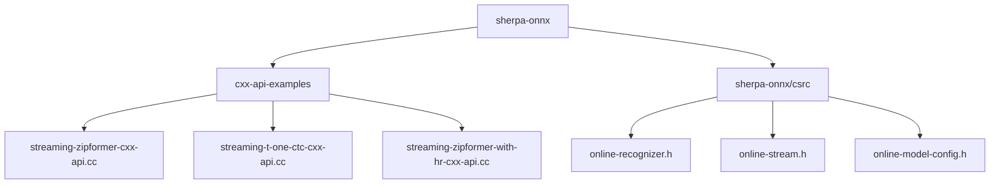
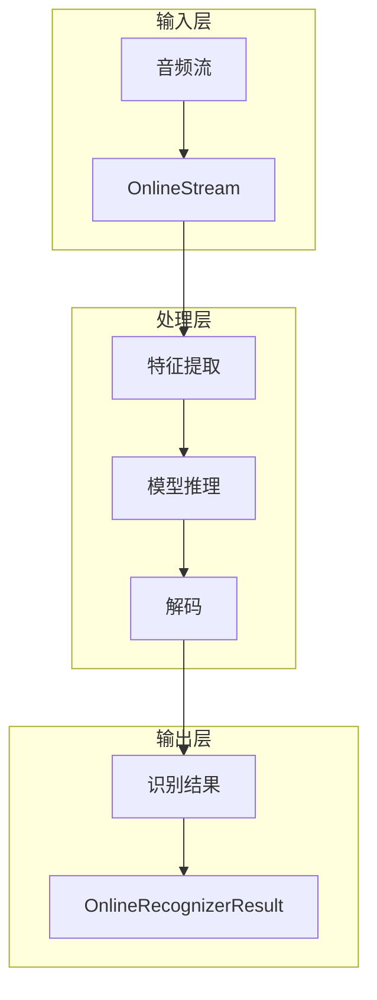
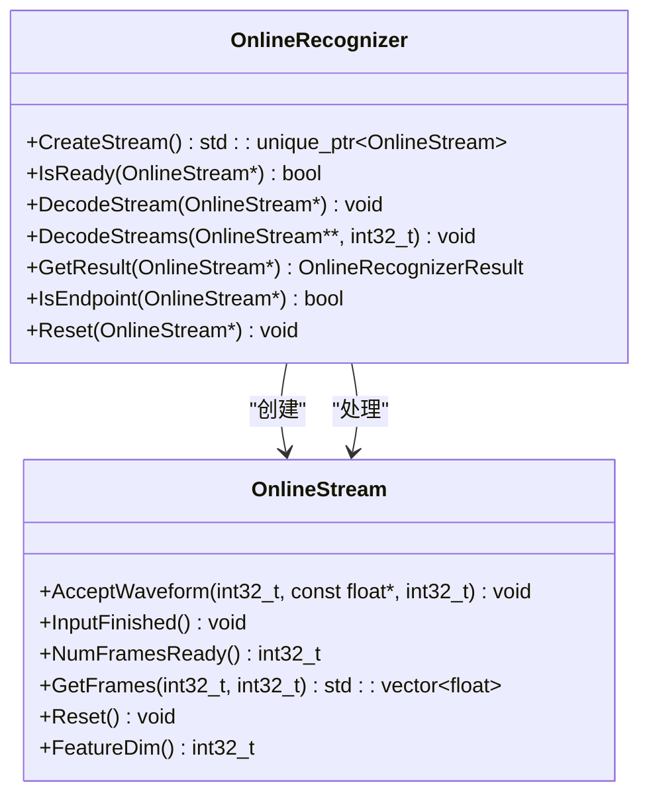
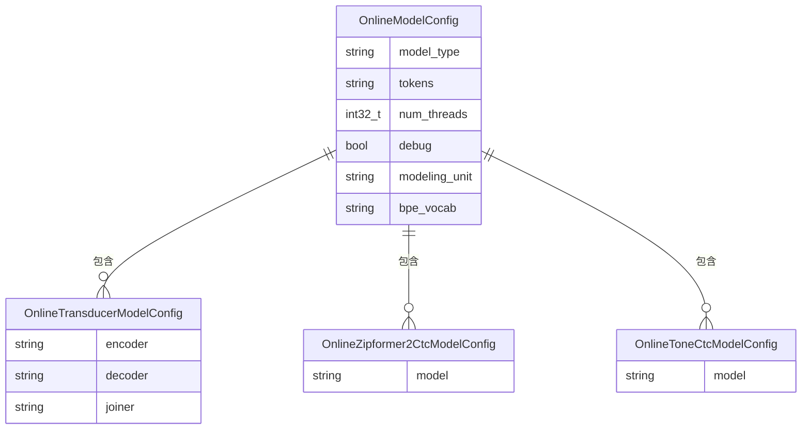
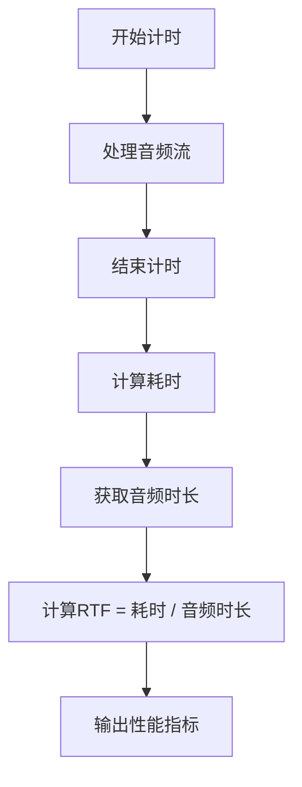
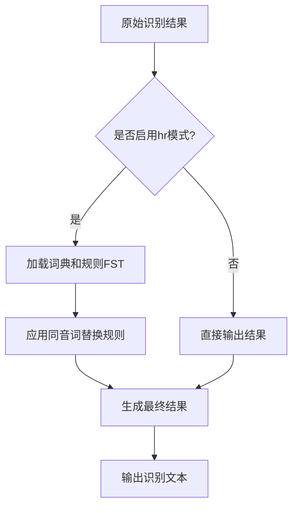
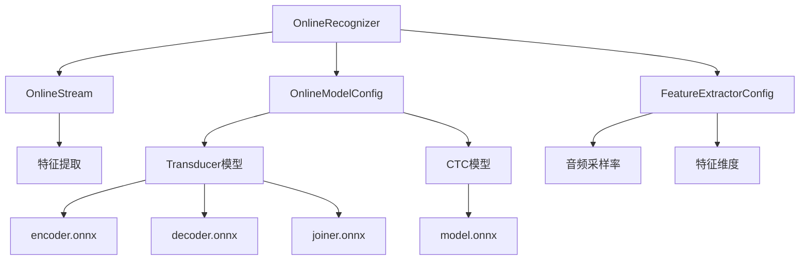

# 基础流式语音识别示例

<cite>
**本文档引用的文件**   
- [online-recognizer.h](file://sherpa-onnx/csrc/online-recognizer.h)
- [online-stream.h](file://sherpa-onnx/csrc/online-stream.h)
- [online-model-config.h](file://sherpa-onnx/csrc/online-model-config.h)
- [streaming-zipformer-cxx-api.cc](file://cxx-api-examples/streaming-zipformer-cxx-api.cc)
- [streaming-t-one-ctc-cxx-api.cc](file://cxx-api-examples/streaming-t-one-ctc-cxx-api.cc)
- [streaming-zipformer-with-hr-cxx-api.cc](file://cxx-api-examples/streaming-zipformer-with-hr-cxx-api.cc)
- [homophone-replacer.h](file://sherpa-onnx/csrc/homophone-replacer.h)
</cite>

## 目录
1. [简介](#简介)
2. [项目结构](#项目结构)
3. [核心组件](#核心组件)
4. [架构概述](#架构概述)
5. [详细组件分析](#详细组件分析)
6. [依赖分析](#依赖分析)
7. [性能考量](#性能考量)
8. [故障排除指南](#故障排除指南)
9. [结论](#结论)

## 简介
本文档深入解析sherpa-onnx基础流式语音识别C++ API示例，重点介绍基于Zipformer CTC、Zipformer Transducer和T-One CTC模型的流式自动语音识别（ASR）实现。文档详细说明了OnlineRecognizer和OnlineStream类的核心接口与使用方法，涵盖模型配置、音频流处理、实时推理和性能监控等关键环节。

## 项目结构
sherpa-onnx项目提供了丰富的API示例，支持多种编程语言和平台。流式语音识别的核心功能主要位于`cxx-api-examples`目录下，包含针对不同模型的C++ API示例。



**图表来源**
- [streaming-zipformer-cxx-api.cc](file://cxx-api-examples/streaming-zipformer-cxx-api.cc)
- [online-recognizer.h](file://sherpa-onnx/csrc/online-recognizer.h)

**章节来源**
- [streaming-zipformer-cxx-api.cc](file://cxx-api-examples/streaming-zipformer-cxx-api.cc)
- [sherpa-onnx/csrc](file://sherpa-onnx/csrc)

## 核心组件
流式语音识别的核心组件包括OnlineRecognizer（在线识别器）和OnlineStream（在线流），它们共同实现了音频流的分块处理和实时推理功能。OnlineRecognizer负责管理识别过程，而OnlineStream则代表单个音频流的处理状态。

**章节来源**
- [online-recognizer.h](file://sherpa-onnx/csrc/online-recognizer.h)
- [online-stream.h](file://sherpa-onnx/csrc/online-stream.h)

## 架构概述
sherpa-onnx的流式ASR架构采用分层设计，从底层的音频特征提取到顶层的模型推理和结果生成，形成了完整的处理流水线。该架构支持多种流式模型，包括Zipformer CTC、Zipformer Transducer和T-One CTC。



**图表来源**
- [online-recognizer.h](file://sherpa-onnx/csrc/online-recognizer.h)
- [online-stream.h](file://sherpa-onnx/csrc/online-stream.h)

## 详细组件分析

### OnlineRecognizer与OnlineStream分析
OnlineRecognizer和OnlineStream是流式语音识别的核心类，它们通过协作实现音频流的实时处理和识别。

#### 类图


**图表来源**
- [online-recognizer.h](file://sherpa-onnx/csrc/online-recognizer.h)
- [online-stream.h](file://sherpa-onnx/csrc/online-stream.h)

#### 识别流程序列图
```mermaid
sequenceDiagram
participant 应用程序
participant OnlineRecognizer
participant OnlineStream
应用程序->>OnlineRecognizer : 创建识别器
应用程序->>OnlineRecognizer : CreateStream()
OnlineRecognizer-->>应用程序 : 返回OnlineStream
应用程序->>OnlineStream : AcceptWaveform()
应用程序->>OnlineStream : InputFinished()
loop 检查是否就绪
应用程序->>OnlineRecognizer : IsReady()
alt 就绪
OnlineRecognizer-->>应用程序 : true
应用程序->>OnlineRecognizer : DecodeStream()
else 未就绪
OnlineRecognizer-->>应用程序 : false
break 结束循环
end
end
应用程序->>OnlineRecognizer : GetResult()
OnlineRecognizer-->>应用程序 : 返回识别结果
```

**图表来源**
- [streaming-zipformer-cxx-api.cc](file://cxx-api-examples/streaming-zipformer-cxx-api.cc)
- [online-recognizer.h](file://sherpa-onnx/csrc/online-recognizer.h)

### OnlineModelConfig配置分析
OnlineModelConfig用于配置不同的流式模型，支持多种模型类型和配置选项。

#### 配置结构图


**图表来源**
- [online-model-config.h](file://sherpa-onnx/csrc/online-model-config.h)
- [streaming-zipformer-cxx-api.cc](file://cxx-api-examples/streaming-zipformer-cxx-api.cc)
- [streaming-t-one-ctc-cxx-api.cc](file://cxx-api-examples/streaming-t-one-ctc-cxx-api.cc)

**章节来源**
- [online-model-config.h](file://sherpa-onnx/csrc/online-model-config.h)
- [streaming-zipformer-cxx-api.cc](file://cxx-api-examples/streaming-zipformer-cxx-api.cc)
- [streaming-t-one-ctc-cxx-api.cc](file://cxx-api-examples/streaming-t-one-ctc-cxx-api.cc)

### 实时因子(RTF)计算与性能监控
实时因子（RTF）是衡量流式语音识别性能的重要指标，表示处理时间与音频时长的比率。

#### RTF计算流程图


**图表来源**
- [streaming-zipformer-cxx-api.cc](file://cxx-api-examples/streaming-zipformer-cxx-api.cc)
- [streaming-t-one-ctc-cxx-api.cc](file://cxx-api-examples/streaming-t-one-ctc-cxx-api.cc)

**章节来源**
- [streaming-zipformer-cxx-api.cc](file://cxx-api-examples/streaming-zipformer-cxx-api.cc)
- [streaming-t-one-ctc-cxx-api.cc](file://cxx-api-examples/streaming-t-one-ctc-cxx-api.cc)

### with-hr（混合推理）模式分析
with-hr模式实现了同音词替换功能，通过规则FST（有限状态转换器）对识别结果进行后处理。

#### with-hr模式流程图


**图表来源**
- [homophone-replacer.h](file://sherpa-onnx/csrc/homophone-replacer.h)
- [streaming-zipformer-with-hr-cxx-api.cc](file://cxx-api-examples/streaming-zipformer-with-hr-cxx-api.cc)

**章节来源**
- [homophone-replacer.h](file://sherpa-onnx/csrc/homophone-replacer.h)
- [streaming-zipformer-with-hr-cxx-api.cc](file://cxx-api-examples/streaming-zipformer-with-hr-cxx-api.cc)

## 依赖分析
流式语音识别系统依赖于多个核心组件和外部库，形成了复杂的依赖关系网络。



**图表来源**
- [online-recognizer.h](file://sherpa-onnx/csrc/online-recognizer.h)
- [online-model-config.h](file://sherpa-onnx/csrc/online-model-config.h)

**章节来源**
- [online-recognizer.h](file://sherpa-onnx/csrc/online-recognizer.h)
- [online-model-config.h](file://sherpa-onnx/csrc/online-model-config.h)

## 性能考量
流式语音识别的性能受多个因素影响，包括模型复杂度、线程数、硬件加速等。通过合理配置这些参数，可以优化识别速度和准确性。

## 故障排除指南
在使用流式语音识别API时，可能会遇到模型加载失败、音频格式不支持等问题。建议检查模型文件路径、音频采样率和配置参数是否正确。

**章节来源**
- [online-recognizer.h](file://sherpa-onnx/csrc/online-recognizer.h)
- [online-stream.h](file://sherpa-onnx/csrc/online-stream.h)

## 结论
sherpa-onnx提供了强大而灵活的流式语音识别C++ API，支持多种先进的ASR模型。通过合理使用OnlineRecognizer和OnlineStream类，开发者可以轻松实现高质量的实时语音识别功能。with-hr模式的引入进一步提升了识别结果的准确性和可读性。