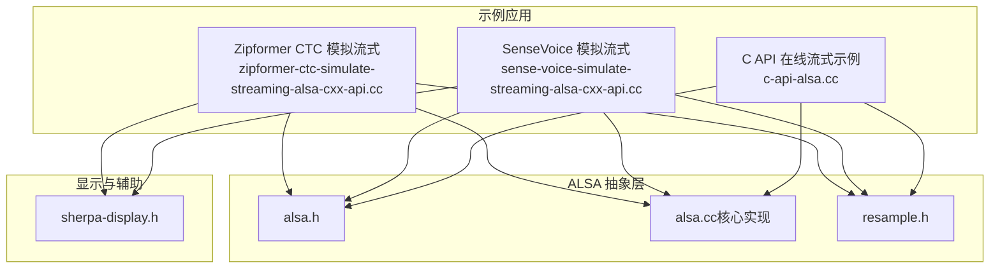
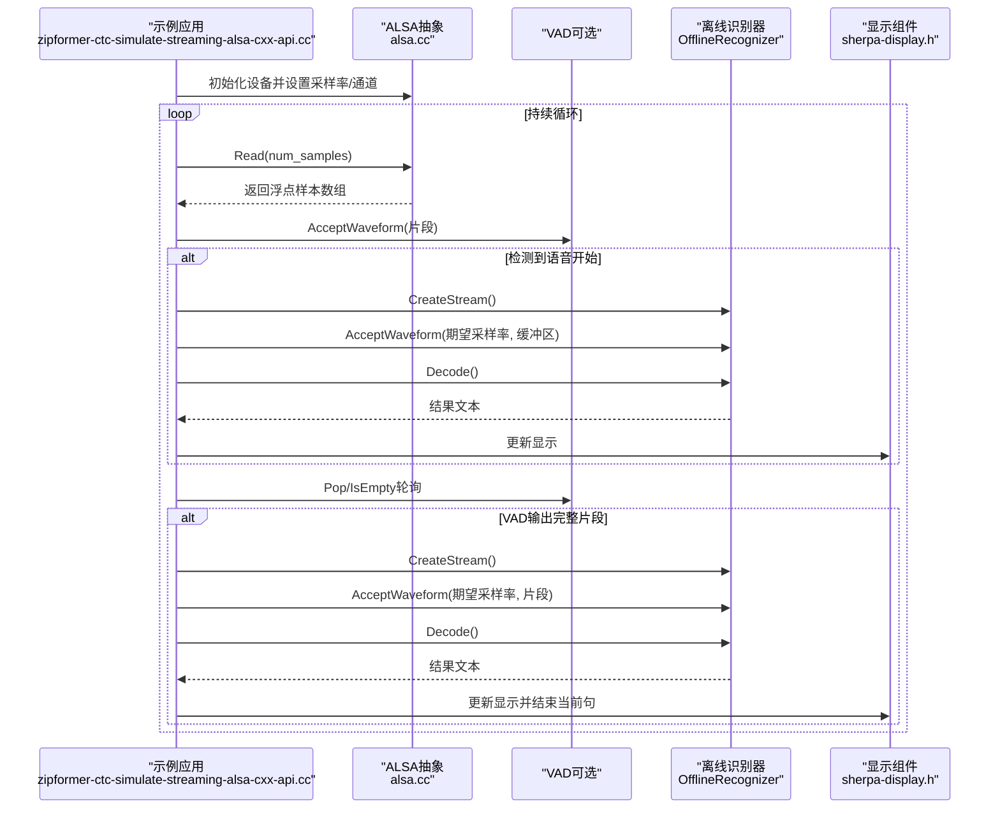
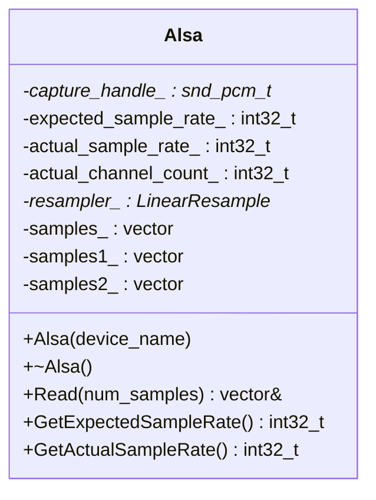
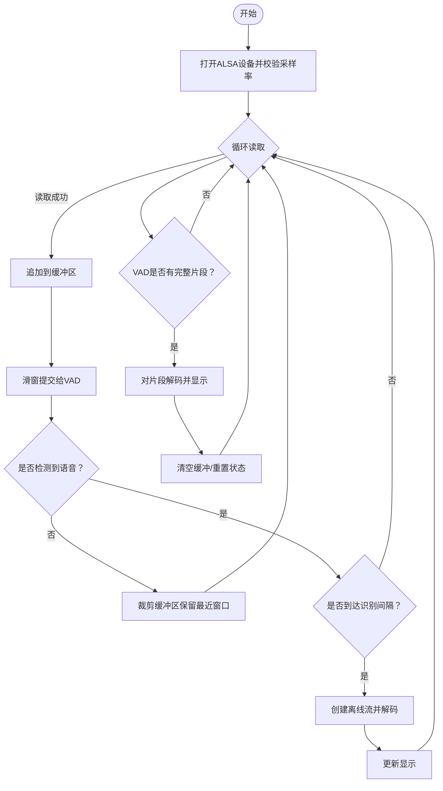
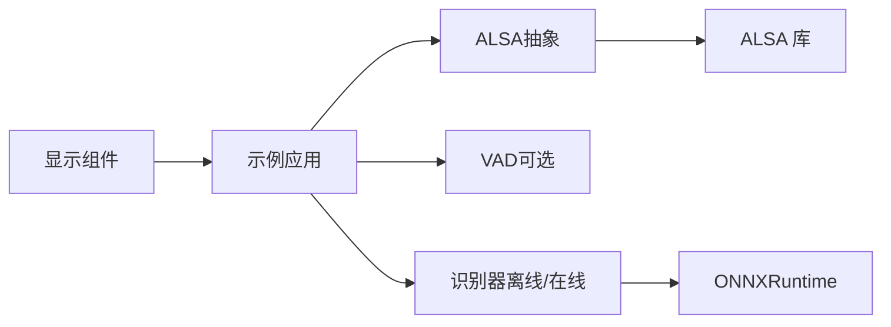

# ALSA输入模拟流式语音识别示例

<cite>
**本文引用的文件列表**
- [zipformer-ctc-simulate-streaming-alsa-cxx-api.cc](file://cxx-api-examples/zipformer-ctc-simulate-streaming-alsa-cxx-api.cc)
- [sense-voice-simulate-streaming-alsa-cxx-api.cc](file://cxx-api-examples/sense-voice-simulate-streaming-alsa-cxx-api.cc)
- [c-api-alsa.cc](file://c-api-examples/asr-microphone-example/c-api-alsa.cc)
- [alsa.cc](file://c-api-examples/asr-microphone-example/alsa.cc)
- [alsa.h](file://sherpa-onnx/csrc/alsa.h)
- [alsa.cc（核心实现）](file://sherpa-onnx/csrc/alsa.cc)
- [resample.h](file://sherpa-onnx/csrc/resample.h)
- [sherpa-display.h](file://cxx-api-examples/sherpa-display.h)
</cite>

## 目录
1. [简介](#简介)
2. [项目结构与定位](#项目结构与定位)
3. [核心组件](#核心组件)
4. [架构总览](#架构总览)
5. [详细组件分析](#详细组件分析)
6. [依赖关系分析](#依赖关系分析)
7. [性能与延迟特性](#性能与延迟特性)
8. [故障排查指南](#故障排查指南)
9. [结论](#结论)
10. [附录：使用示例与最佳实践](#附录使用示例与最佳实践)

## 简介
本文件面向希望在Linux环境下使用ALSA作为音频输入源，对静态音频文件或麦克风进行“模拟流式”语音识别的开发者。文档聚焦于：
- 如何通过ALSA PCM接口打开设备、配置采样率与通道数、读取音频帧；
- 如何将连续音频分块读取并组织为“流式”输入，以支持Zipformer CTC与SenseVoice等模型的在线/离线识别；
- ALSA设备配置、音频缓冲区管理策略、重采样与错误处理；
- 在嵌入式或Linux服务器环境中部署时的性能、延迟与资源消耗优化建议。

## 项目结构与定位
本示例位于sherpa-onnx仓库的多语言示例目录中，包含C++与C API两类实现，均复用同一ALSA抽象层。关键位置如下：
- C++示例：cxx-api-examples下分别提供Zipformer CTC与SenseVoice的“模拟流式”示例
- C API示例：c-api-examples/asr-microphone-example提供通用的在线流式识别示例
- 核心ALSA抽象：sherpa-onnx/csrc/alsa.h与alsa.cc，封装了snd_pcm_*调用与重采样逻辑

图表来源
- [zipformer-ctc-simulate-streaming-alsa-cxx-api.cc](file://cxx-api-examples/zipformer-ctc-simulate-streaming-alsa-cxx-api.cc#L1-L244)
- [sense-voice-simulate-streaming-alsa-cxx-api.cc](file://cxx-api-examples/sense-voice-simulate-streaming-alsa-cxx-api.cc#L1-L246)
- [c-api-alsa.cc](file://c-api-examples/asr-microphone-example/c-api-alsa.cc#L1-L260)
- [alsa.h](file://sherpa-onnx/csrc/alsa.h#L1-L47)
- [alsa.cc（核心实现）](file://sherpa-onnx/csrc/alsa.cc#L1-L184)
- [resample.h](file://sherpa-onnx/csrc/resample.h#L1-L145)
- [sherpa-display.h](file://cxx-api-examples/sherpa-display.h#L1-L73)

章节来源
- [zipformer-ctc-simulate-streaming-alsa-cxx-api.cc](file://cxx-api-examples/zipformer-ctc-simulate-streaming-alsa-cxx-api.cc#L1-L244)
- [sense-voice-simulate-streaming-alsa-cxx-api.cc](file://cxx-api-examples/sense-voice-simulate-streaming-alsa-cxx-api.cc#L1-L246)
- [c-api-alsa.cc](file://c-api-examples/asr-microphone-example/c-api-alsa.cc#L1-L260)
- [alsa.h](file://sherpa-onnx/csrc/alsa.h#L1-L47)
- [alsa.cc（核心实现）](file://sherpa-onnx/csrc/alsa.cc#L1-L184)
- [resample.h](file://sherpa-onnx/csrc/resample.h#L1-L145)
- [sherpa-display.h](file://cxx-api-examples/sherpa-display.h#L1-L73)

## 核心组件
- ALSA抽象类：封装snd_pcm设备打开、硬件参数设置、阻塞读取、重采样与通道选择
- 重采样器：当设备采样率与期望采样率不一致时，进行低通滤波+线性重采样
- 示例应用：以固定窗口大小滑动的方式将连续音频分块送入识别器；可选加入VAD进行端点检测

章节来源
- [alsa.h](file://sherpa-onnx/csrc/alsa.h#L16-L46)
- [alsa.cc（核心实现）](file://sherpa-onnx/csrc/alsa.cc#L28-L183)
- [resample.h](file://sherpa-onnx/csrc/resample.h#L37-L141)

## 架构总览
下面以“Zipformer CTC模拟流式”为例，展示从ALSA读取到识别输出的端到端流程。

图表来源
- [zipformer-ctc-simulate-streaming-alsa-cxx-api.cc](file://cxx-api-examples/zipformer-ctc-simulate-streaming-alsa-cxx-api.cc#L136-L243)
- [alsa.cc（核心实现）](file://sherpa-onnx/csrc/alsa.cc#L145-L179)
- [sherpa-display.h](file://cxx-api-examples/sherpa-display.h#L16-L70)

章节来源
- [zipformer-ctc-simulate-streaming-alsa-cxx-api.cc](file://cxx-api-examples/zipformer-ctc-simulate-streaming-alsa-cxx-api.cc#L136-L243)
- [alsa.cc（核心实现）](file://sherpa-onnx/csrc/alsa.cc#L145-L179)
- [sherpa-display.h](file://cxx-api-examples/sherpa-display.h#L16-L70)

## 详细组件分析

### ALSA抽象类（alsa.h/alsa.cc）
- 设备打开与硬件参数
  - 使用snd_pcm_open打开指定设备名
  - 设置访问类型为交错读写、格式为S16_LE
  - 尝试设置通道数为1；若失败则尝试2通道并记录实际通道数
  - 设置采样率为目标采样率（近似匹配），若不一致则启用重采样器
  - 调用snd_pcm_hw_params与snd_pcm_prepare完成初始化
- 阻塞读取与数据转换
  - Read(num_samples)按帧读取，返回标准化后的float数组
  - 若发生XRUN（欠载），自动prepare并返回空缓冲，避免崩溃
  - 若存在重采样器，则对读取到的float数组进行重采样
- 关闭与资源释放
  - 析构时关闭snd_pcm设备

图表来源
- [alsa.h](file://sherpa-onnx/csrc/alsa.h#L16-L46)
- [alsa.cc（核心实现）](file://sherpa-onnx/csrc/alsa.cc#L28-L183)

章节来源
- [alsa.h](file://sherpa-onnx/csrc/alsa.h#L16-L46)
- [alsa.cc（核心实现）](file://sherpa-onnx/csrc/alsa.cc#L28-L183)

### 重采样器（LinearResample）
- 当设备采样率与期望采样率不一致时，构造低通滤波器并执行线性重采样
- 支持分片处理（flush=false时保留尾部状态，flush=true时输出剩余样本）

章节来源
- [resample.h](file://sherpa-onnx/csrc/resample.h#L37-L141)

### Zipformer CTC模拟流式示例（C++）
- 设备选择与采样率校验
  - 从命令行接收设备名，创建Alsa实例
  - 校验期望采样率与实际采样率是否一致（示例默认16kHz）
- 分块读取与缓冲管理
  - 计算每块样本数（0.1秒），循环读取并追加至环形缓冲
  - 使用固定窗口大小滑动，向VAD提交片段
- VAD与端点检测
  - 未检测到语音时，丢弃过长缓冲的前部，保持最近若干窗口
  - 检测到语音后，定时触发一次识别（如超过一定时间间隔）
  - VAD弹出完整片段时，立即进行离线识别并输出
- 显示与退出
  - 使用SherpaDisplay更新文本并清屏显示
  - 捕获SIGINT优雅退出

图表来源
- [zipformer-ctc-simulate-streaming-alsa-cxx-api.cc](file://cxx-api-examples/zipformer-ctc-simulate-streaming-alsa-cxx-api.cc#L136-L243)

章节来源
- [zipformer-ctc-simulate-streaming-alsa-cxx-api.cc](file://cxx-api-examples/zipformer-ctc-simulate-streaming-alsa-cxx-api.cc#L136-L243)

### SenseVoice模拟流式示例（C++）
- 与Zipformer示例几乎一致的流程，仅模型配置不同（SenseVoice模型路径与语言设置）
- 同样采用固定窗口滑动、VAD端点检测与定时识别策略

章节来源
- [sense-voice-simulate-streaming-alsa-cxx-api.cc](file://cxx-api-examples/sense-voice-simulate-streaming-alsa-cxx-api.cc#L1-L246)

### C API在线流式示例（通用）
- 该示例展示了如何使用C API进行在线流式识别，同样通过Alsa读取音频并逐块提交给在线识别器
- 适合需要最小化依赖或直接使用C API的场景

章节来源
- [c-api-alsa.cc](file://c-api-examples/asr-microphone-example/c-api-alsa.cc#L1-L260)
- [alsa.cc](file://c-api-examples/asr-microphone-example/alsa.cc#L1-L184)

## 依赖关系分析
- 组件耦合
  - 示例应用依赖ALSA抽象类与重采样器
  - 可选依赖VAD组件（示例中使用离线识别器的VAD配置）
  - 显示组件独立于识别逻辑，仅用于终端输出
- 外部依赖
  - ALSA库：snd_pcm_*系列接口
  - ONNXRuntime：模型推理（由Sherpa-onnx C/C++ API封装）
- 潜在循环依赖
  - 无直接循环；示例应用单向依赖ALSA与显示组件

图表来源
- [zipformer-ctc-simulate-streaming-alsa-cxx-api.cc](file://cxx-api-examples/zipformer-ctc-simulate-streaming-alsa-cxx-api.cc#L136-L243)
- [alsa.cc（核心实现）](file://sherpa-onnx/csrc/alsa.cc#L145-L179)
- [resample.h](file://sherpa-onnx/csrc/resample.h#L37-L141)

章节来源
- [zipformer-ctc-simulate-streaming-alsa-cxx-api.cc](file://cxx-api-examples/zipformer-ctc-simulate-streaming-alsa-cxx-api.cc#L136-L243)
- [alsa.cc（核心实现）](file://sherpa-onnx/csrc/alsa.cc#L145-L179)
- [resample.h](file://sherpa-onnx/csrc/resample.h#L37-L141)

## 性能与延迟特性
- 采样率与通道
  - 默认期望采样率为16kHz；若设备实际采样率不同，将自动创建重采样器
  - 通道优先设为1；若失败则尝试2通道并仅使用一个通道
- 延迟与吞吐
  - 读取粒度由每块样本数决定（示例中为0.1秒），影响端点检测灵敏度与首字延迟
  - VAD滑窗大小固定（示例中为512），有助于平滑端点判断
  - 定时触发识别（如超过0.2秒）可降低频繁解码带来的开销
- 资源消耗
  - ALSA阻塞读取简单可靠，但需确保线程间同步与缓冲队列容量
  - 重采样会增加CPU开销；在嵌入式设备上建议选择与目标采样率一致的设备采样率
- 实时因子（RTF）
  - 示例未直接计算RTF；可在实际部署中参考其他脚本的RTF计算方式（如Node.js示例中对RTF的打印逻辑）

章节来源
- [alsa.cc（核心实现）](file://sherpa-onnx/csrc/alsa.cc#L78-L126)
- [zipformer-ctc-simulate-streaming-alsa-cxx-api.cc](file://cxx-api-examples/zipformer-ctc-simulate-streaming-alsa-cxx-api.cc#L183-L217)
- [sense-voice-simulate-streaming-alsa-cxx-api.cc](file://cxx-api-examples/sense-voice-simulate-streaming-alsa-cxx-api.cc#L198-L218)

## 故障排查指南
- 设备打开失败
  - 检查设备名是否正确；可通过arecord -l列出可用设备
  - 若打开失败，程序会打印帮助信息并退出
- XRUN（欠载）
  - 当读取速度慢于设备写入速度时出现；示例中自动prepare并限制最大重试次数
  - 若频繁出现，检查模型推理耗时是否过高（RTF过大）、线程调度或缓冲队列是否过小
- 采样率不匹配
  - 若实际采样率与期望不符，将自动启用重采样器；建议尽量使用16kHz设备
- 通道数问题
  - 若设备不支持1通道，将尝试2通道并仅使用一个通道；确认音频质量不受影响

章节来源
- [alsa.cc（核心实现）](file://sherpa-onnx/csrc/alsa.cc#L47-L94)
- [alsa.cc（核心实现）](file://sherpa-onnx/csrc/alsa.cc#L150-L167)

## 结论
通过ALSA抽象层与示例应用，开发者可以轻松地将麦克风或静态音频文件“模拟为流式”输入Sherpa-onnx的识别器。示例提供了清晰的设备配置、缓冲区管理与端点检测策略，适用于嵌入式与Linux服务器环境。在实际部署中，应结合设备采样率、线程模型与模型性能，合理设置块大小与识别间隔，以获得更优的延迟与稳定性。

## 附录：使用示例与最佳实践
- 设备选择
  - 使用arecord -l查看设备列表，选择合适的plughw:card,device
- 模型准备
  - Zipformer CTC与SenseVoice示例均要求下载对应模型与tokens文件
- 运行步骤
  - 下载并解压模型
  - 编译示例程序（确保已安装ALSA开发包）
  - 以设备名为参数运行示例
- 最佳实践
  - 优先使用与期望采样率一致的设备采样率，避免重采样
  - 合理设置每块样本数与滑窗大小，平衡延迟与稳定性
  - 在嵌入式设备上适当减少线程数与模型复杂度
  - 使用VAD提升端点检测准确性，减少无效解码

章节来源
- [zipformer-ctc-simulate-streaming-alsa-cxx-api.cc](file://cxx-api-examples/zipformer-ctc-simulate-streaming-alsa-cxx-api.cc#L98-L135)
- [sense-voice-simulate-streaming-alsa-cxx-api.cc](file://cxx-api-examples/sense-voice-simulate-streaming-alsa-cxx-api.cc#L100-L131)
- [c-api-alsa.cc](file://c-api-examples/asr-microphone-example/c-api-alsa.cc#L80-L107)