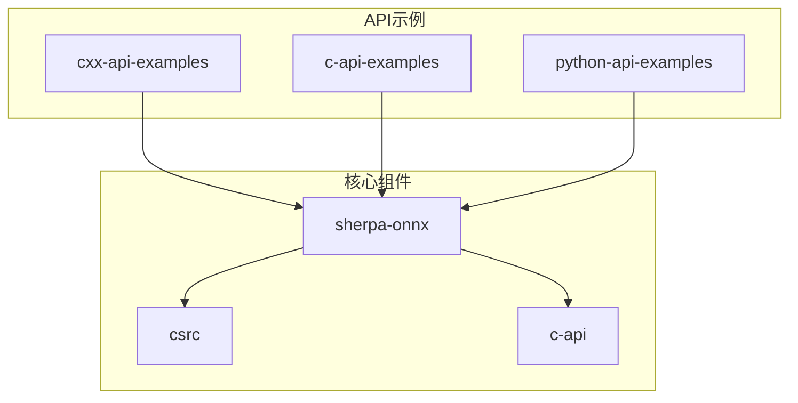
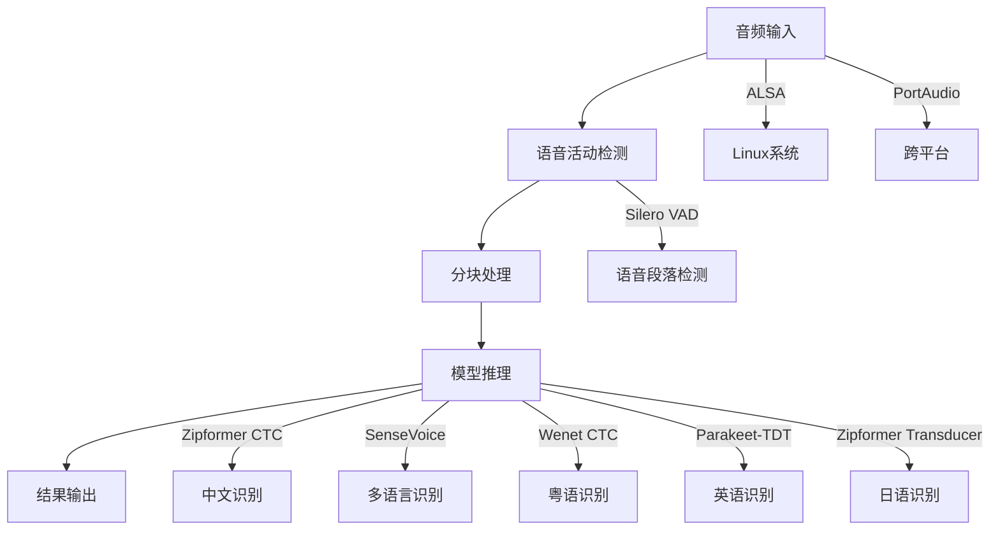
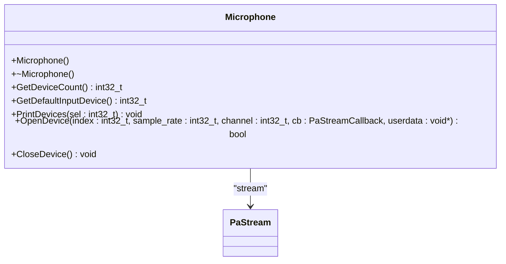
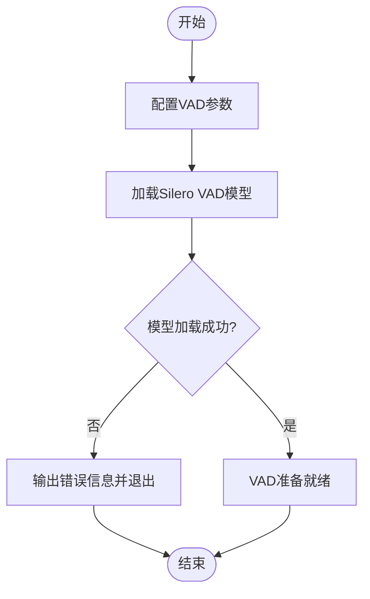
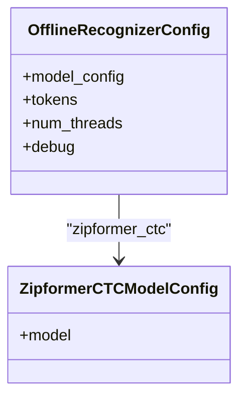
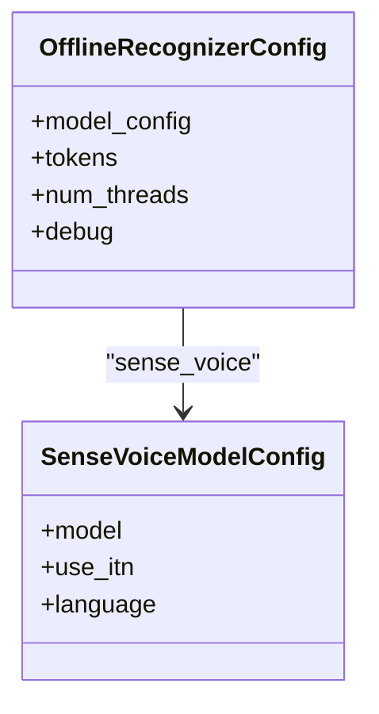
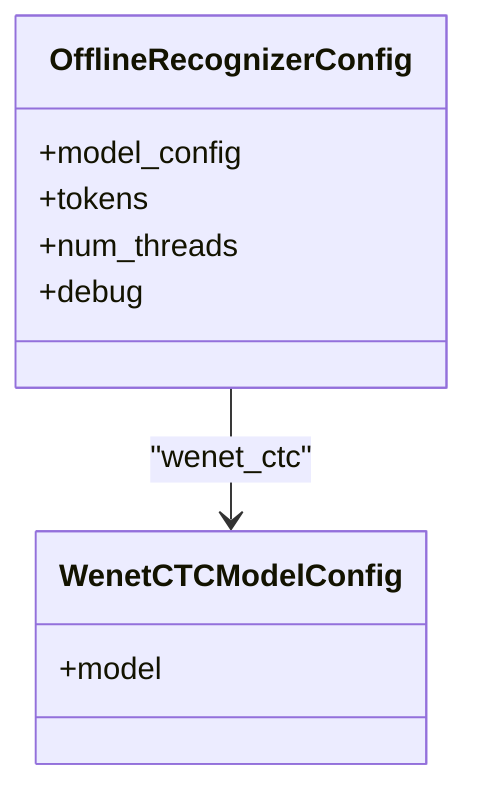
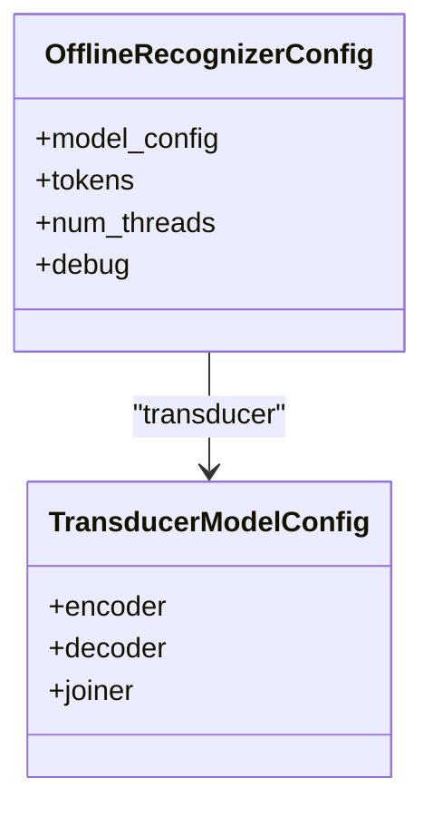
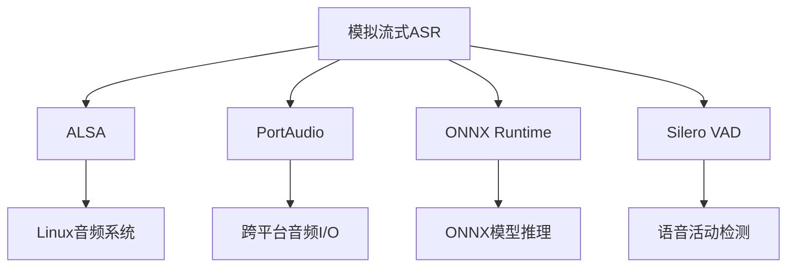

# 模拟流式语音识别示例

<cite>
**本文档引用文件**   
- [zipformer-ctc-simulate-streaming-alsa-cxx-api.cc](file://cxx-api-examples/zipformer-ctc-simulate-streaming-alsa-cxx-api.cc)
- [sense-voice-simulate-streaming-alsa-cxx-api.cc](file://cxx-api-examples/sense-voice-simulate-streaming-alsa-cxx-api.cc)
- [wenet-ctc-simulate-streaming-microphone-cxx-api.cc](file://cxx-api-examples/wenet-ctc-simulate-streaming-microphone-cxx-api.cc)
- [parakeet-tdt-simulate-streaming-microphone-cxx-api.cc](file://cxx-api-examples/parakeet-tdt-simulate-streaming-microphone-cxx-api.cc)
- [zipformer-transducer-simulate-streaming-microphone-cxx-api.cc](file://cxx-api-examples/zipformer-transducer-simulate-streaming-microphone-cxx-api.cc)
- [alsa.h](file://sherpa-onnx/csrc/alsa.h)
- [microphone.h](file://sherpa-onnx/csrc/microphone.h)
- [sherpa-display.h](file://cxx-api-examples/sherpa-display.h)
</cite>

## 目录
1. [引言](#引言)
2. [项目结构](#项目结构)
3. [核心组件](#核心组件)
4. [架构概述](#架构概述)
5. [详细组件分析](#详细组件分析)
6. [依赖分析](#依赖分析)
7. [性能考虑](#性能考虑)
8. [故障排除指南](#故障排除指南)
9. [结论](#结论)

## 引言
本文档详细介绍了sherpa-onnx中模拟流式语音识别C++ API示例的实现。重点分析了使用ALSA和麦克风输入的模拟流式ASR实现，深入解析了如何将静态音频文件分块模拟为实时流进行处理。文档涵盖了基于Zipformer CTC、Zipformer Transducer、Wenet CTC、SenseVoice和Parakeet-TDT模型的模拟流式识别流程，包括音频采集、分块处理、实时推理和结果流式输出的完整过程。同时，解释了如何使用sherpa-onnx提供的音频接口（如alsa.h）实现跨平台音频流处理，并分析了不同模型在模拟流式场景下的性能表现和延迟特性。

## 项目结构
sherpa-onnx项目包含多个API示例，其中C++ API示例位于`cxx-api-examples`目录下。这些示例展示了如何使用不同的语音识别模型进行模拟流式识别。项目结构清晰，分为不同的功能模块，包括语音识别、语音合成、关键词识别等。



**图表来源**
- [cxx-api-examples](file://cxx-api-examples)
- [sherpa-onnx](file://sherpa-onnx)

**章节来源**
- [cxx-api-examples](file://cxx-api-examples)
- [sherpa-onnx](file://sherpa-onnx)

## 核心组件
模拟流式语音识别的核心组件包括音频采集、语音活动检测（VAD）、离线识别器和结果显示。这些组件协同工作，实现了从麦克风输入到文本输出的完整流程。音频采集组件负责从麦克风获取音频数据，VAD组件检测语音活动，离线识别器进行语音识别，结果显示组件则负责将识别结果实时显示给用户。

**章节来源**
- [zipformer-ctc-simulate-streaming-alsa-cxx-api.cc](file://cxx-api-examples/zipformer-ctc-simulate-streaming-alsa-cxx-api.cc#L1-L244)
- [sense-voice-simulate-streaming-alsa-cxx-api.cc](file://cxx-api-examples/sense-voice-simulate-streaming-alsa-cxx-api.cc#L1-L246)

## 架构概述
模拟流式语音识别的架构主要包括音频输入、语音活动检测、分块处理、模型推理和结果输出五个部分。音频输入通过ALSA或PortAudio接口获取麦克风数据，语音活动检测使用Silero VAD模型检测语音段落，分块处理将连续音频分割成小块，模型推理使用离线识别器对每个音频块进行识别，结果输出则通过显示组件实时更新识别结果。



**图表来源**
- [zipformer-ctc-simulate-streaming-alsa-cxx-api.cc](file://cxx-api-examples/zipformer-ctc-simulate-streaming-alsa-cxx-api.cc#L1-L244)
- [sense-voice-simulate-streaming-alsa-cxx-api.cc](file://cxx-api-examples/sense-voice-simulate-streaming-alsa-cxx-api.cc#L1-L246)
- [wenet-ctc-simulate-streaming-microphone-cxx-api.cc](file://cxx-api-examples/wenet-ctc-simulate-streaming-microphone-cxx-api.cc#L1-L241)

## 详细组件分析
### 音频采集组件分析
音频采集组件负责从麦克风获取音频数据。在Linux系统中，使用ALSA接口进行音频采集；在跨平台应用中，使用PortAudio接口。这两个接口都提供了稳定的音频流输入功能。

#### ALSA音频接口
```mermaid
classDiagram
class Alsa {
+Alsa(device_name : const char*)
+~Alsa()
+Read(num_samples : int32_t) const std : : vector<float>&
+GetExpectedSampleRate() int32_t
+GetActualSampleRate() int32_t
}
Alsa --> snd_pcm_t : "capture_handle_"
Alsa --> LinearResample : "resampler_"
Alsa --> std : : vector<int16_t> : "samples_"
Alsa --> std : : vector<float> : "samples1_, samples2_"
```

**图表来源**
- [alsa.h](file://sherpa-onnx/csrc/alsa.h#L1-L47)

#### PortAudio麦克风接口


**图表来源**
- [microphone.h](file://sherpa-onnx/csrc/microphone.h#L1-L33)

### 语音活动检测组件分析
语音活动检测（VAD）组件使用Silero VAD模型检测语音活动。该组件配置了语音检测的阈值、最小静音持续时间、最小语音持续时间和最大语音持续时间等参数，确保能够准确检测语音段落。



**图表来源**
- [zipformer-ctc-simulate-streaming-alsa-cxx-api.cc](file://cxx-api-examples/zipformer-ctc-simulate-streaming-alsa-cxx-api.cc#L56-L74)
- [sense-voice-simulate-streaming-alsa-cxx-api.cc](file://cxx-api-examples/sense-voice-simulate-streaming-alsa-cxx-api.cc#L56-L74)

### 模型推理组件分析
模型推理组件使用离线识别器对音频块进行识别。不同的模型有不同的配置方式，但都遵循相同的推理流程：创建识别流、接受音频数据、解码和获取结果。

#### Zipformer CTC模型配置


**图表来源**
- [zipformer-ctc-simulate-streaming-alsa-cxx-api.cc](file://cxx-api-examples/zipformer-ctc-simulate-streaming-alsa-cxx-api.cc#L76-L96)

#### SenseVoice模型配置


**图表来源**
- [sense-voice-simulate-streaming-alsa-cxx-api.cc](file://cxx-api-examples/sense-voice-simulate-streaming-alsa-cxx-api.cc#L76-L98)

#### Wenet CTC模型配置


**图表来源**
- [wenet-ctc-simulate-streaming-microphone-cxx-api.cc](file://cxx-api-examples/wenet-ctc-simulate-streaming-microphone-cxx-api.cc#L79-L98)

#### Parakeet-TDT模型配置


**图表来源**
- [parakeet-tdt-simulate-streaming-microphone-cxx-api.cc](file://cxx-api-examples/parakeet-tdt-simulate-streaming-microphone-cxx-api.cc#L80-L106)

#### Zipformer Transducer模型配置


**图表来源**
- [zipformer-transducer-simulate-streaming-microphone-cxx-api.cc](file://cxx-api-examples/zipformer-transducer-simulate-streaming-microphone-cxx-api.cc#L79-L108)

### 结果显示组件分析
结果显示组件负责将识别结果实时显示给用户。该组件提供了更新文本、完成当前句子和显示结果的功能。

```mermaid
classDiagram
class SherpaDisplay {
+UpdateText(text : const std : : string&)
+FinalizeCurrentSentence()
+Display() const
}
SherpaDisplay --> std : : vector<std : : pair<std : : string, std : : string>> : "sentences_"
SherpaDisplay --> std : : string : "current_text_"
```

**图表来源**
- [sherpa-display.h](file://cxx-api-examples/sherpa-display.h#L1-L73)

**章节来源**
- [zipformer-ctc-simulate-streaming-alsa-cxx-api.cc](file://cxx-api-examples/zipformer-ctc-simulate-streaming-alsa-cxx-api.cc#L1-L244)
- [sense-voice-simulate-streaming-alsa-cxx-api.cc](file://cxx-api-examples/sense-voice-simulate-streaming-alsa-cxx-api.cc#L1-L246)

## 依赖分析
模拟流式语音识别示例依赖于多个外部库和组件，包括ALSA、PortAudio、ONNX Runtime等。这些依赖项确保了音频采集、模型推理和跨平台兼容性的实现。



**图表来源**
- [alsa.h](file://sherpa-onnx/csrc/alsa.h#L1-L47)
- [microphone.h](file://sherpa-onnx/csrc/microphone.h#L1-L33)

**章节来源**
- [zipformer-ctc-simulate-streaming-alsa-cxx-api.cc](file://cxx-api-examples/zipformer-ctc-simulate-streaming-alsa-cxx-api.cc#L1-L244)
- [wenet-ctc-simulate-streaming-microphone-cxx-api.cc](file://cxx-api-examples/wenet-ctc-simulate-streaming-microphone-cxx-api.cc#L1-L241)

## 性能考虑
在模拟流式语音识别中，性能是一个关键因素。需要考虑音频采集的实时性、模型推理的延迟、内存使用和CPU占用率。通过合理配置线程数、优化音频处理流程和选择合适的模型，可以显著提高系统的整体性能。

## 故障排除指南
在使用模拟流式语音识别示例时，可能会遇到一些常见问题，如音频设备无法打开、模型加载失败、识别结果不准确等。以下是一些故障排除建议：

- 确保音频设备正常工作，可以使用`arecord -l`命令检查可用的录音设备
- 检查模型文件路径是否正确，确保所有必需的模型文件都已下载
- 验证音频采样率是否匹配模型要求，通常为16000Hz
- 检查系统是否有足够的内存和CPU资源来运行模型
- 确保ONNX Runtime库已正确安装和配置

**章节来源**
- [zipformer-ctc-simulate-streaming-alsa-cxx-api.cc](file://cxx-api-examples/zipformer-ctc-simulate-streaming-alsa-cxx-api.cc#L1-L244)
- [wenet-ctc-simulate-streaming-microphone-cxx-api.cc](file://cxx-api-examples/wenet-ctc-simulate-streaming-microphone-cxx-api.cc#L1-L241)

## 结论
sherpa-onnx的模拟流式语音识别C++ API示例提供了一个完整的解决方案，用于实现基于不同模型的实时语音识别。通过使用ALSA和PortAudio接口，实现了跨平台的音频采集；通过Silero VAD模型，实现了准确的语音活动检测；通过离线识别器，实现了高效的模型推理。这些组件的有机结合，使得开发者能够轻松构建高性能的语音识别应用。