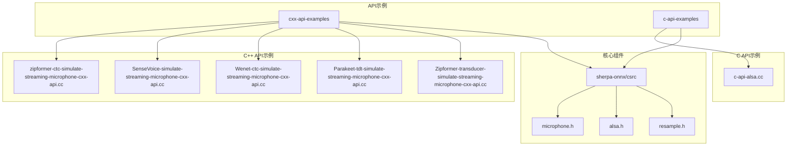
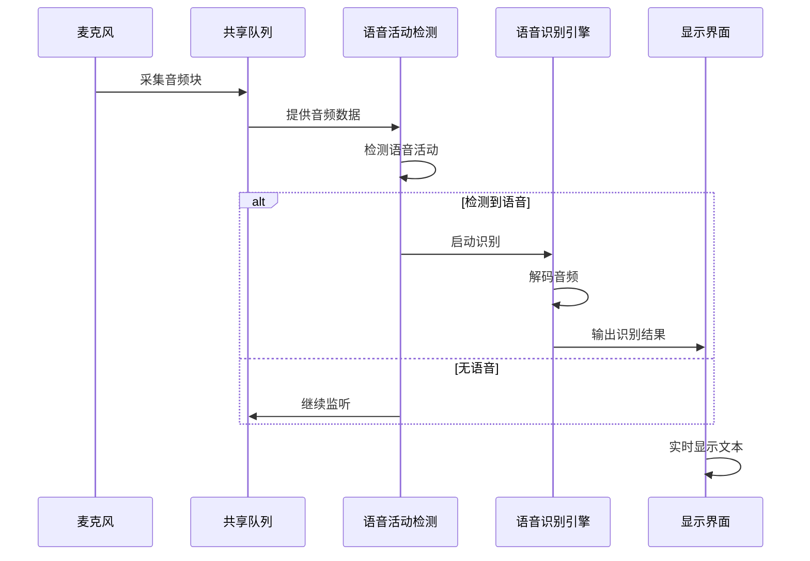
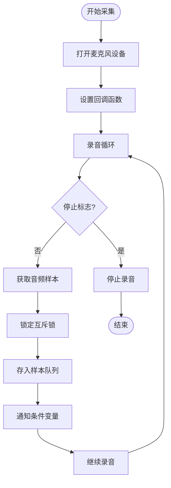
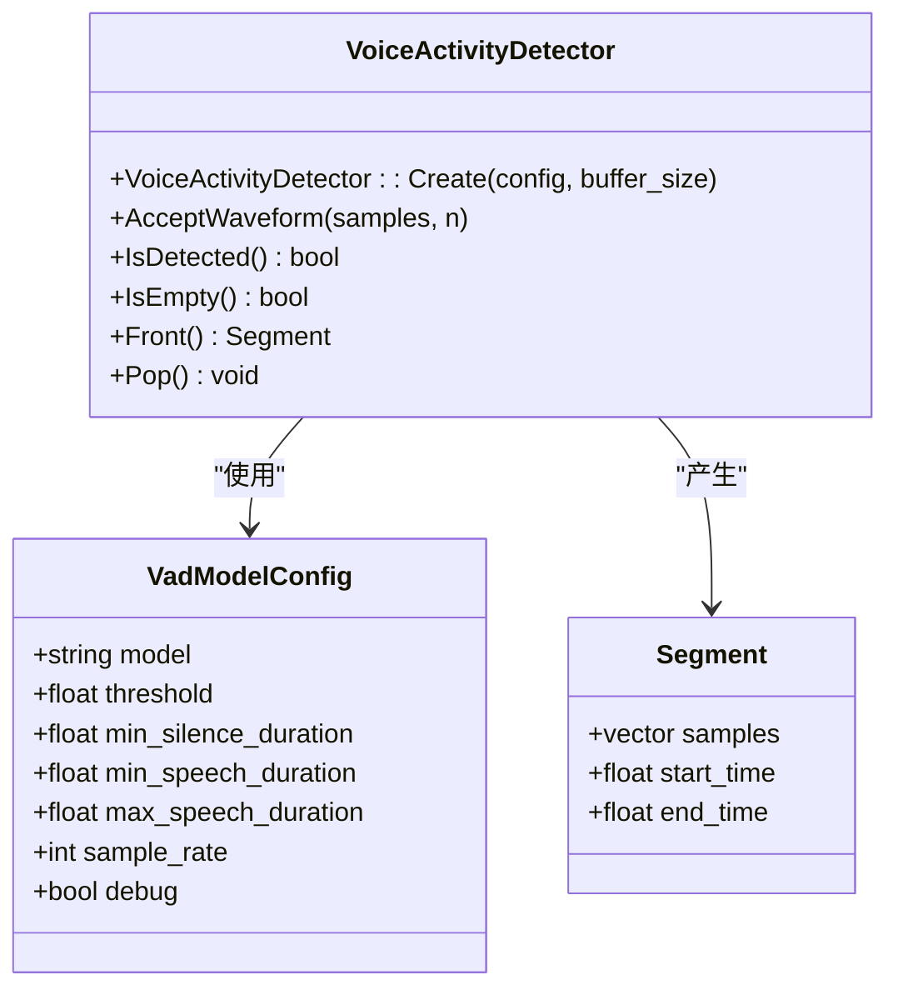
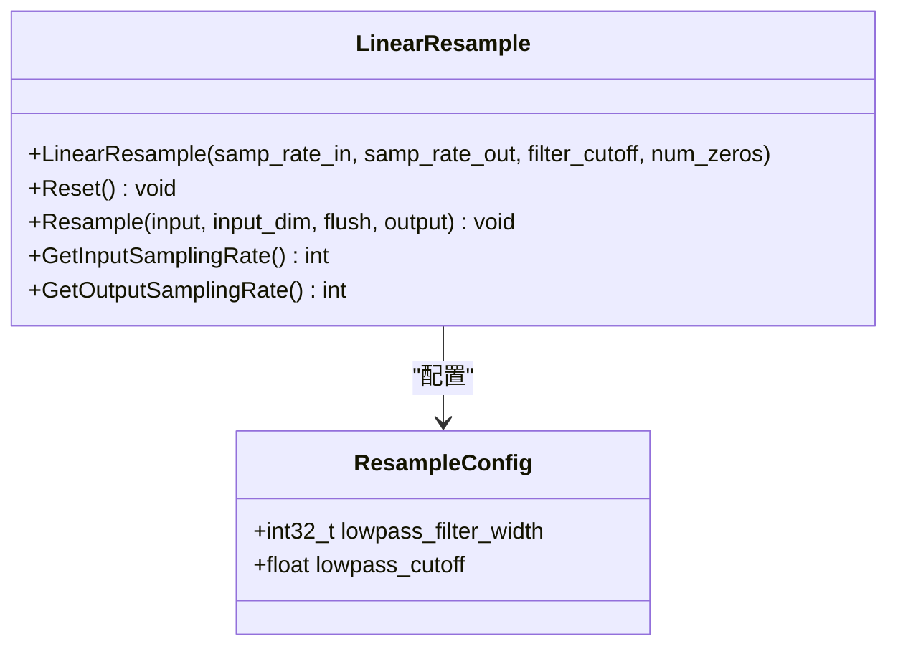
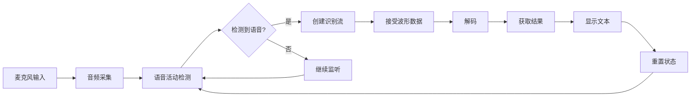
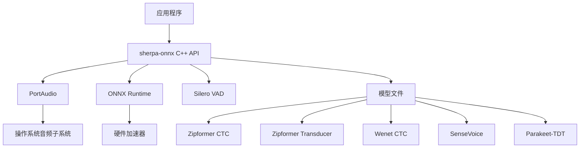

# 麦克风输入模拟流式语音识别示例

<cite>
**本文档引用的文件**   
- [zipformer-ctc-simulate-streaming-microphone-cxx-api.cc](file://cxx-api-examples/zipformer-ctc-simulate-streaming-microphone-cxx-api.cc)
- [sense-voice-simulate-streaming-microphone-cxx-api.cc](file://cxx-api-examples/sense-voice-simulate-streaming-microphone-cxx-api.cc)
- [wenet-ctc-simulate-streaming-microphone-cxx-api.cc](file://cxx-api-examples/wenet-ctc-simulate-streaming-microphone-cxx-api.cc)
- [parakeet-tdt-simulate-streaming-microphone-cxx-api.cc](file://cxx-api-examples/parakeet-tdt-simulate-streaming-microphone-cxx-api.cc)
- [zipformer-transducer-simulate-streaming-microphone-cxx-api.cc](file://cxx-api-examples/zipformer-transducer-simulate-streaming-microphone-cxx-api.cc)
- [c-api-alsa.cc](file://c-api-examples/asr-microphone-example/c-api-alsa.cc)
- [microphone.h](file://sherpa-onnx/csrc/microphone.h)
- [alsa.h](file://sherpa-onnx/csrc/alsa.h)
- [resample.h](file://sherpa-onnx/csrc/resample.h)
- [CMakeLists.txt](file://cxx-api-examples/CMakeLists.txt)
</cite>

## 目录
1. [简介](#简介)
2. [项目结构](#项目结构)
3. [核心组件](#核心组件)
4. [架构概述](#架构概述)
5. [详细组件分析](#详细组件分析)
6. [依赖分析](#依赖分析)
7. [性能考虑](#性能考虑)
8. [故障排除指南](#故障排除指南)
9. [结论](#结论)

## 简介
本文档详细介绍了sherpa-onnx项目中基于麦克风输入的模拟流式语音识别C++ API示例。文档深入解析了如何通过麦克风实时采集音频并将其分块处理以模拟流式识别，重点说明了音频采集、缓冲和实时推理机制。文档涵盖了基于Zipformer CTC、Zipformer Transducer、Wenet CTC、SenseVoice和Parakeet-TDT等多种模型的麦克风流式识别流程，包括音频采集配置、数据分块策略、实时推理引擎调用和结果流式输出的完整过程。同时，文档还解释了如何优化麦克风输入的延迟和准确性，并分析了不同模型在真实麦克风输入场景下的识别性能、抗噪能力和资源占用情况。

## 项目结构
sherpa-onnx项目提供了丰富的API示例，其中与麦克风输入模拟流式语音识别相关的示例主要位于`cxx-api-examples`和`c-api-examples`目录下。这些示例展示了如何使用不同的语音识别模型进行实时语音处理。

**图源**
- [zipformer-ctc-simulate-streaming-microphone-cxx-api.cc](file://cxx-api-examples/zipformer-ctc-simulate-streaming-microphone-cxx-api.cc)
- [sense-voice-simulate-streaming-microphone-cxx-api.cc](file://cxx-api-examples/sense-voice-simulate-streaming-microphone-cxx-api.cc)
- [wenet-ctc-simulate-streaming-microphone-cxx-api.cc](file://cxx-api-examples/wenet-ctc-simulate-streaming-microphone-cxx-api.cc)
- [parakeet-tdt-simulate-streaming-microphone-cxx-api.cc](file://cxx-api-examples/parakeet-tdt-simulate-streaming-microphone-cxx-api.cc)
- [zipformer-transducer-simulate-streaming-microphone-cxx-api.cc](file://cxx-api-examples/zipformer-transducer-simulate-streaming-microphone-cxx-api.cc)
- [c-api-alsa.cc](file://c-api-examples/asr-microphone-example/c-api-alsa.cc)
- [microphone.h](file://sherpa-onnx/csrc/microphone.h)
- [alsa.h](file://sherpa-onnx/csrc/alsa.h)
- [resample.h](file://sherpa-onnx/csrc/resample.h)

**本节源**
- [cxx-api-examples](file://cxx-api-examples)
- [c-api-examples](file://c-api-examples)
- [sherpa-onnx/csrc](file://sherpa-onnx/csrc)

## 核心组件
麦克风输入模拟流式语音识别的核心组件包括音频采集、语音活动检测(VAD)、音频重采样和语音识别引擎。这些组件协同工作，实现了从麦克风输入到文本输出的完整流程。音频采集组件负责从麦克风获取原始音频数据，VAD组件用于检测语音段落，重采样组件确保音频数据符合模型要求的采样率，而语音识别引擎则负责将音频转换为文本。

**本节源**
- [zipformer-ctc-simulate-streaming-microphone-cxx-api.cc](file://cxx-api-examples/zipformer-ctc-simulate-streaming-microphone-cxx-api.cc#L1-L241)
- [sense-voice-simulate-streaming-microphone-cxx-api.cc](file://cxx-api-examples/sense-voice-simulate-streaming-microphone-cxx-api.cc#L1-L244)
- [wenet-ctc-simulate-streaming-microphone-cxx-api.cc](file://cxx-api-examples/wenet-ctc-simulate-streaming-microphone-cxx-api.cc#L1-L241)

## 架构概述
麦克风输入模拟流式语音识别的架构基于生产者-消费者模式。麦克风作为生产者，持续采集音频数据并放入共享队列；语音识别系统作为消费者，从队列中取出数据进行处理。该架构通过多线程和条件变量实现高效的异步处理，确保了低延迟的实时识别性能。

**图源**
- [zipformer-ctc-simulate-streaming-microphone-cxx-api.cc](file://cxx-api-examples/zipformer-ctc-simulate-streaming-microphone-cxx-api.cc#L34-L58)
- [sense-voice-simulate-streaming-microphone-cxx-api.cc](file://cxx-api-examples/sense-voice-simulate-streaming-microphone-cxx-api.cc#L34-L58)
- [wenet-ctc-simulate-streaming-microphone-cxx-api.cc](file://cxx-api-examples/wenet-ctc-simulate-streaming-microphone-cxx-api.cc#L33-L57)

## 详细组件分析

### 麦克风音频采集分析
麦克风音频采集是整个流式识别系统的基础。系统使用PortAudio库实现跨平台的音频采集功能，通过回调函数机制实时获取音频数据。采集到的音频数据以浮点数数组的形式存储，并通过线程安全的队列传递给后续处理模块。

**图源**
- [microphone.h](file://sherpa-onnx/csrc/microphone.h#L12-L28)
- [zipformer-ctc-simulate-streaming-microphone-cxx-api.cc](file://cxx-api-examples/zipformer-ctc-simulate-streaming-microphone-cxx-api.cc#L45-L58)

**本节源**
- [microphone.h](file://sherpa-onnx/csrc/microphone.h#L1-L33)
- [zipformer-ctc-simulate-streaming-microphone-cxx-api.cc](file://cxx-api-examples/zipformer-ctc-simulate-streaming-microphone-cxx-api.cc#L143-L147)

### 语音活动检测(VAD)分析
语音活动检测(VAD)是流式识别中的关键组件，用于区分语音和非语音段落。系统使用Silero VAD模型进行语音检测，通过配置阈值、最小语音持续时间和最大语音持续时间等参数来优化检测性能。VAD组件在后台持续分析音频流，当检测到语音活动时触发识别流程。

**图源**
- [zipformer-ctc-simulate-streaming-microphone-cxx-api.cc](file://cxx-api-examples/zipformer-ctc-simulate-streaming-microphone-cxx-api.cc#L60-L78)
- [sense-voice-simulate-streaming-microphone-cxx-api.cc](file://cxx-api-examples/sense-voice-simulate-streaming-microphone-cxx-api.cc#L60-L78)

**本节源**
- [zipformer-ctc-simulate-streaming-microphone-cxx-api.cc](file://cxx-api-examples/zipformer-ctc-simulate-streaming-microphone-cxx-api.cc#L60-L78)
- [sense-voice-simulate-streaming-microphone-cxx-api.cc](file://cxx-api-examples/sense-voice-simulate-streaming-microphone-cxx-api.cc#L60-L78)

### 音频重采样分析
音频重采样组件负责将不同采样率的麦克风输入转换为模型要求的统一采样率。系统使用线性重采样器实现高质量的采样率转换，通过低通滤波器防止混叠效应。重采样过程考虑了输入和输出采样率的最大公约数，以确保重采样的准确性和效率。

**图源**
- [resample.h](file://sherpa-onnx/csrc/resample.h#L37-L144)
- [zipformer-ctc-simulate-streaming-microphone-cxx-api.cc](file://cxx-api-examples/zipformer-ctc-simulate-streaming-microphone-cxx-api.cc#L134-L142)

**本节源**
- [resample.h](file://sherpa-onnx/csrc/resample.h#L1-L145)
- [zipformer-ctc-simulate-streaming-microphone-cxx-api.cc](file://cxx-api-examples/zipformer-ctc-simulate-streaming-microphone-cxx-api.cc#L134-L142)

### 多模型识别流程分析
sherpa-onnx支持多种语音识别模型的麦克风流式识别，包括Zipformer CTC、Zipformer Transducer、Wenet CTC、SenseVoice和Parakeet-TDT等。这些模型虽然架构不同，但在麦克风流式识别流程上具有相似的处理模式。

**图源**
- [zipformer-ctc-simulate-streaming-microphone-cxx-api.cc](file://cxx-api-examples/zipformer-ctc-simulate-streaming-microphone-cxx-api.cc#L204-L237)
- [sense-voice-simulate-streaming-microphone-cxx-api.cc](file://cxx-api-examples/sense-voice-simulate-streaming-microphone-cxx-api.cc#L207-L239)
- [wenet-ctc-simulate-streaming-microphone-cxx-api.cc](file://cxx-api-examples/wenet-ctc-simulate-streaming-microphone-cxx-api.cc#L204-L236)

**本节源**
- [zipformer-ctc-simulate-streaming-microphone-cxx-api.cc](file://cxx-api-examples/zipformer-ctc-simulate-streaming-microphone-cxx-api.cc#L80-L99)
- [sense-voice-simulate-streaming-microphone-cxx-api.cc](file://cxx-api-examples/sense-voice-simulate-streaming-microphone-cxx-api.cc#L80-L102)
- [wenet-ctc-simulate-streaming-microphone-cxx-api.cc](file://cxx-api-examples/wenet-ctc-simulate-streaming-microphone-cxx-api.cc#L79-L98)

## 依赖分析
麦克风输入模拟流式语音识别系统依赖于多个外部库和内部组件。主要依赖包括PortAudio用于音频采集，ONNX Runtime用于模型推理，以及各种语音处理库。系统通过CMake构建系统管理这些依赖关系，确保跨平台的兼容性。

**图源**
- [CMakeLists.txt](file://cxx-api-examples/CMakeLists.txt#L54-L107)
- [zipformer-ctc-simulate-streaming-microphone-cxx-api.cc](file://cxx-api-examples/zipformer-ctc-simulate-streaming-microphone-cxx-api.cc#L31-L32)

**本节源**
- [CMakeLists.txt](file://cxx-api-examples/CMakeLists.txt#L1-L161)
- [zipformer-ctc-simulate-streaming-microphone-cxx-api.cc](file://cxx-api-examples/zipformer-ctc-simulate-streaming-microphone-cxx-api.cc#L1-L241)

## 性能考虑
在麦克风输入模拟流式语音识别中，性能优化是关键。系统通过多种策略来降低延迟和提高准确性，包括优化音频块大小、调整VAD参数、使用多线程处理和模型量化。音频块大小通常设置为512个样本，这在延迟和计算效率之间提供了良好的平衡。VAD参数的调整对于不同环境下的语音检测至关重要，需要根据实际应用场景进行微调。

**本节源**
- [zipformer-ctc-simulate-streaming-microphone-cxx-api.cc](file://cxx-api-examples/zipformer-ctc-simulate-streaming-microphone-cxx-api.cc#L149-L150)
- [sense-voice-simulate-streaming-microphone-cxx-api.cc](file://cxx-api-examples/sense-voice-simulate-streaming-microphone-cxx-api.cc#L151-L152)

## 故障排除指南
在使用麦克风输入模拟流式语音识别时，可能会遇到各种问题。常见问题包括麦克风设备无法打开、音频采样率不匹配、模型加载失败和识别结果不准确等。对于麦克风设备问题，应检查设备索引和权限设置；对于采样率问题，应确保重采样配置正确；对于模型问题，应验证模型文件路径和完整性。

**本节源**
- [zipformer-ctc-simulate-streaming-microphone-cxx-api.cc](file://cxx-api-examples/zipformer-ctc-simulate-streaming-microphone-cxx-api.cc#L143-L147)
- [sense-voice-simulate-streaming-microphone-cxx-api.cc](file://cxx-api-examples/sense-voice-simulate-streaming-microphone-cxx-api.cc#L145-L149)

## 结论
sherpa-onnx提供的麦克风输入模拟流式语音识别C++ API示例为开发者提供了一个强大而灵活的工具集，用于构建实时语音识别应用。通过深入理解音频采集、语音活动检测、重采样和多模型识别等核心组件，开发者可以有效地优化系统性能，满足不同应用场景的需求。这些示例不仅展示了如何使用各种先进的语音识别模型，还提供了可扩展的架构，便于集成到更复杂的语音处理系统中。