# 流式语音识别示例

<cite>
**本文档中引用的文件**  
- [streaming-zipformer-cxx-api.cc](file://cxx-api-examples/streaming-zipformer-cxx-api.cc)
- [streaming-zipformer-rtf-cxx-api.cc](file://cxx-api-examples/streaming-zipformer-rtf-cxx-api.cc)
- [streaming-t-one-ctc-cxx-api.cc](file://cxx-api-examples/streaming-t-one-ctc-cxx-api.cc)
- [wenet-ctc-simulate-streaming-microphone-cxx-api.cc](file://cxx-api-examples/wenet-ctc-simulate-streaming-microphone-cxx-api.cc)
- [sense-voice-simulate-streaming-alsa-cxx-api.cc](file://cxx-api-examples/sense-voice-simulate-streaming-alsa-cxx-api.cc)
- [zipformer-ctc-simulate-streaming-alsa-cxx-api.cc](file://cxx-api-examples/zipformer-ctc-simulate-streaming-alsa-cxx-api.cc)
- [zipformer-transducer-simulate-streaming-microphone-cxx-api.cc](file://cxx-api-examples/zipformer-transducer-simulate-streaming-microphone-cxx-api.cc)
- [sense-voice-simulate-streaming-microphone-cxx-api.cc](file://cxx-api-examples/sense-voice-simulate-streaming-microphone-cxx-api.cc)
- [zipformer-ctc-simulate-streaming-microphone-cxx-api.cc](file://cxx-api-examples/zipformer-ctc-simulate-streaming-microphone-cxx-api.cc)
- [streaming-zipformer-with-hr-cxx-api.cc](file://cxx-api-examples/streaming-zipformer-with-hr-cxx-api.cc)
- [sherpa-onnx/c-api/cxx-api.h](file://sherpa-onnx/c-api/cxx-api.h)
</cite>

## 目录
1. [简介](#简介)
2. [核心API组件](#核心api组件)
3. [流式识别模型配置](#流式识别模型配置)
4. [音频流处理流程](#音频流处理流程)
5. [基于Zipformer的流式识别](#基于zipformer的流式识别)
6. [基于T-One CTC的流式识别](#基于t-one-ctc的流式识别)
7. [基于Wenet CTC的流式识别](#基于wenet-ctc的流式识别)
8. [基于SenseVoice的流式识别](#基于sensevoice的流式识别)
9. [使用ALSA和麦克风的模拟流式处理](#使用alsa和麦克风的模拟流式处理)
10. [实时因子(RTF)计算与监控](#实时因子rtf计算与监控)
11. [上下文管理与状态同步](#上下文管理与状态同步)

## 简介
sherpa-onnx提供了丰富的C++ API示例，用于实现流式自动语音识别(ASR)功能。这些示例涵盖了多种先进的语音识别模型，包括基于Zipformer CTC、Zipformer Transducer、T-One CTC、Wenet CTC和SenseVoice的流式识别系统。本文档深入解析这些示例代码，详细说明OnlineRecognizer和OnlineStream类的使用方法，如何配置OnlineModelConfig，以及如何分块处理音频流以实现低延迟识别。

**Section sources**
- [streaming-zipformer-cxx-api.cc](file://cxx-api-examples/streaming-zipformer-cxx-api.cc#L1-L94)
- [streaming-t-one-ctc-cxx-api.cc](file://cxx-api-examples/streaming-t-one-ctc-cxx-api.cc#L1-L90)

## 核心API组件

### OnlineRecognizer类
OnlineRecognizer是sherpa-onnx流式语音识别的核心类，负责管理识别器的生命周期和识别过程。通过OnlineRecognizer::Create静态方法创建实例，需要传入OnlineRecognizerConfig配置对象。

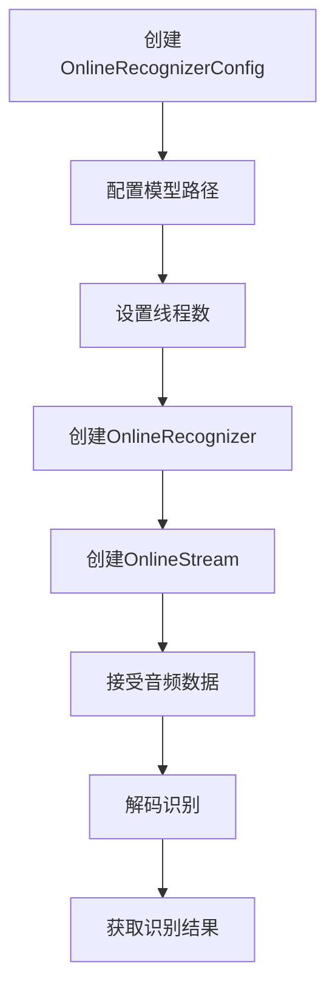

**Diagram sources**
- [streaming-zipformer-cxx-api.cc](file://cxx-api-examples/streaming-zipformer-cxx-api.cc#L24-L52)
- [streaming-t-one-ctc-cxx-api.cc](file://cxx-api-examples/streaming-t-one-ctc-cxx-api.cc#L24-L36)

### OnlineStream类
OnlineStream代表一个独立的音频流识别会话，用于处理单个音频流的识别任务。每个流式识别任务都需要创建一个OnlineStream实例。

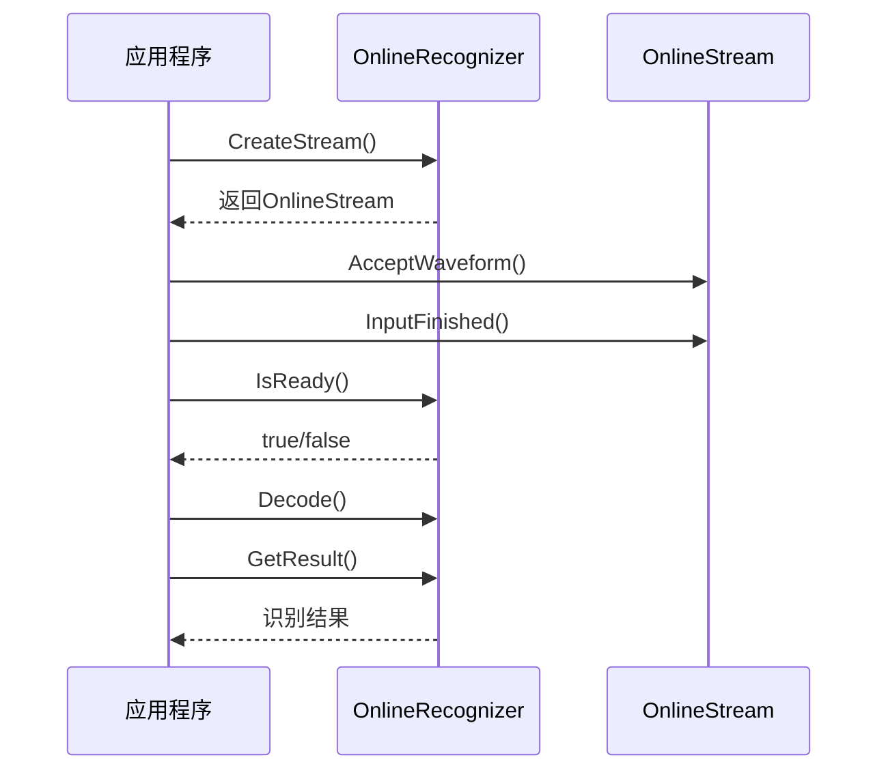

**Diagram sources**
- [streaming-zipformer-cxx-api.cc](file://cxx-api-examples/streaming-zipformer-cxx-api.cc#L66-L75)
- [streaming-t-one-ctc-cxx-api.cc](file://cxx-api-examples/streaming-t-one-ctc-cxx-api.cc#L55-L71)

**Section sources**
- [streaming-zipformer-cxx-api.cc](file://cxx-api-examples/streaming-zipformer-cxx-api.cc#L66-L75)
- [streaming-t-one-ctc-cxx-api.cc](file://cxx-api-examples/streaming-t-one-ctc-cxx-api.cc#L55-L71)

## 流式识别模型配置

### OnlineModelConfig配置
OnlineModelConfig用于配置流式识别模型的各种参数，包括模型路径、线程数、推理提供程序等。

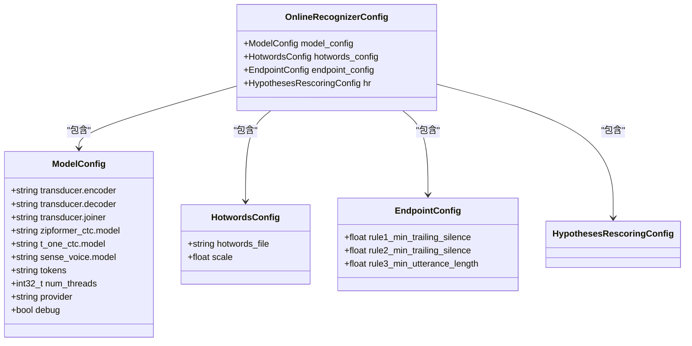

**Diagram sources**
- [streaming-zipformer-cxx-api.cc](file://cxx-api-examples/streaming-zipformer-cxx-api.cc#L24-L44)
- [streaming-zipformer-rtf-cxx-api.cc](file://cxx-api-examples/streaming-zipformer-rtf-cxx-api.cc#L52-L73)
- [streaming-t-one-ctc-cxx-api.cc](file://cxx-api-examples/streaming-t-one-ctc-cxx-api.cc#L24-L33)

**Section sources**
- [streaming-zipformer-cxx-api.cc](file://cxx-api-examples/streaming-zipformer-cxx-api.cc#L24-L44)
- [streaming-zipformer-rtf-cxx-api.cc](file://cxx-api-examples/streaming-zipformer-rtf-cxx-api.cc#L52-L73)

## 音频流处理流程

### 音频流处理完整流程
流式语音识别的完整流程包括音频流建立、数据分块、实时推理和结果流式输出。

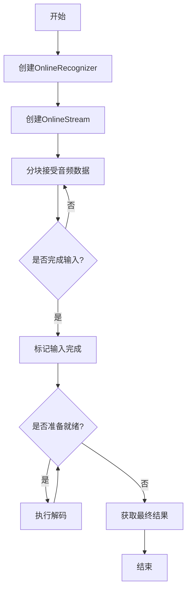

**Diagram sources**
- [streaming-zipformer-cxx-api.cc](file://cxx-api-examples/streaming-zipformer-cxx-api.cc#L66-L75)
- [streaming-t-one-ctc-cxx-api.cc](file://cxx-api-examples/streaming-t-one-ctc-cxx-api.cc#L55-L71)

**Section sources**
- [streaming-zipformer-cxx-api.cc](file://cxx-api-examples/streaming-zipformer-cxx-api.cc#L66-L75)
- [streaming-t-one-ctc-cxx-api.cc](file://cxx-api-examples/streaming-t-one-ctc-cxx-api.cc#L55-L71)

## 基于Zipformer的流式识别

### Zipformer流式识别实现
Zipformer是一种先进的流式语音识别模型架构，支持CTC和Transducer两种模式。

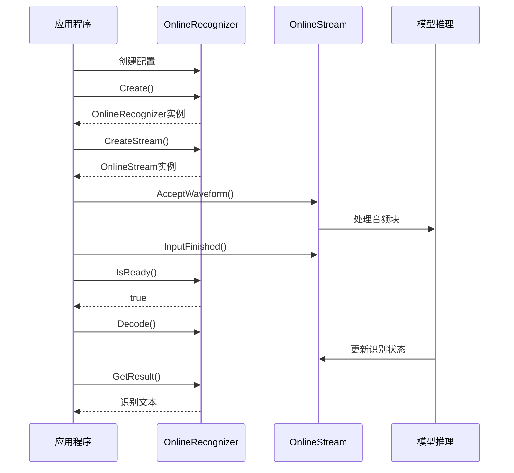

**Diagram sources**
- [streaming-zipformer-cxx-api.cc](file://cxx-api-examples/streaming-zipformer-cxx-api.cc#L24-L85)
- [streaming-zipformer-rtf-cxx-api.cc](file://cxx-api-examples/streaming-zipformer-rtf-cxx-api.cc#L52-L121)

**Section sources**
- [streaming-zipformer-cxx-api.cc](file://cxx-api-examples/streaming-zipformer-cxx-api.cc#L24-L85)
- [streaming-zipformer-rtf-cxx-api.cc](file://cxx-api-examples/streaming-zipformer-rtf-cxx-api.cc#L52-L121)

## 基于T-One CTC的流式识别

### T-One CTC流式识别实现
T-One CTC是一种基于CTC的流式语音识别模型，具有高效的推理性能。

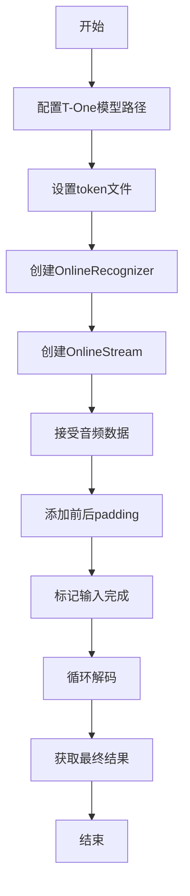

**Diagram sources**
- [streaming-t-one-ctc-cxx-api.cc](file://cxx-api-examples/streaming-t-one-ctc-cxx-api.cc#L24-L90)

**Section sources**
- [streaming-t-one-ctc-cxx-api.cc](file://cxx-api-examples/streaming-t-one-ctc-cxx-api.cc#L24-L90)

## 基于Wenet CTC的流式识别

### Wenet CTC流式识别实现
Wenet CTC模型结合了语音活动检测(VAD)技术，实现更智能的流式识别。

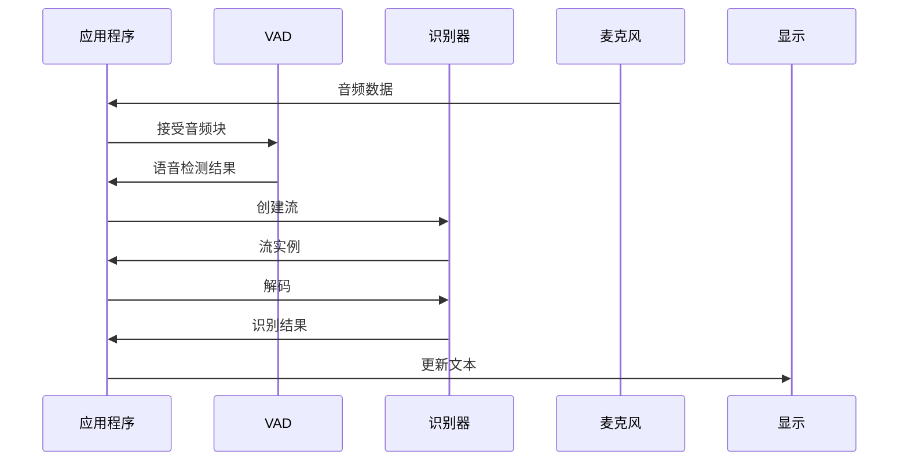

**Diagram sources**
- [wenet-ctc-simulate-streaming-microphone-cxx-api.cc](file://cxx-api-examples/wenet-ctc-simulate-streaming-microphone-cxx-api.cc#L59-L77)
- [wenet-ctc-simulate-streaming-microphone-cxx-api.cc](file://cxx-api-examples/wenet-ctc-simulate-streaming-microphone-cxx-api.cc#L106-L107)

**Section sources**
- [wenet-ctc-simulate-streaming-microphone-cxx-api.cc](file://cxx-api-examples/wenet-ctc-simulate-streaming-microphone-cxx-api.cc#L59-L77)
- [wenet-ctc-simulate-streaming-microphone-cxx-api.cc](file://cxx-api-examples/wenet-ctc-simulate-streaming-microphone-cxx-api.cc#L106-L107)

## 基于SenseVoice的流式识别

### SenseVoice流式识别实现
SenseVoice是一种多语言流式语音识别模型，支持中文、英文、日文等多种语言。

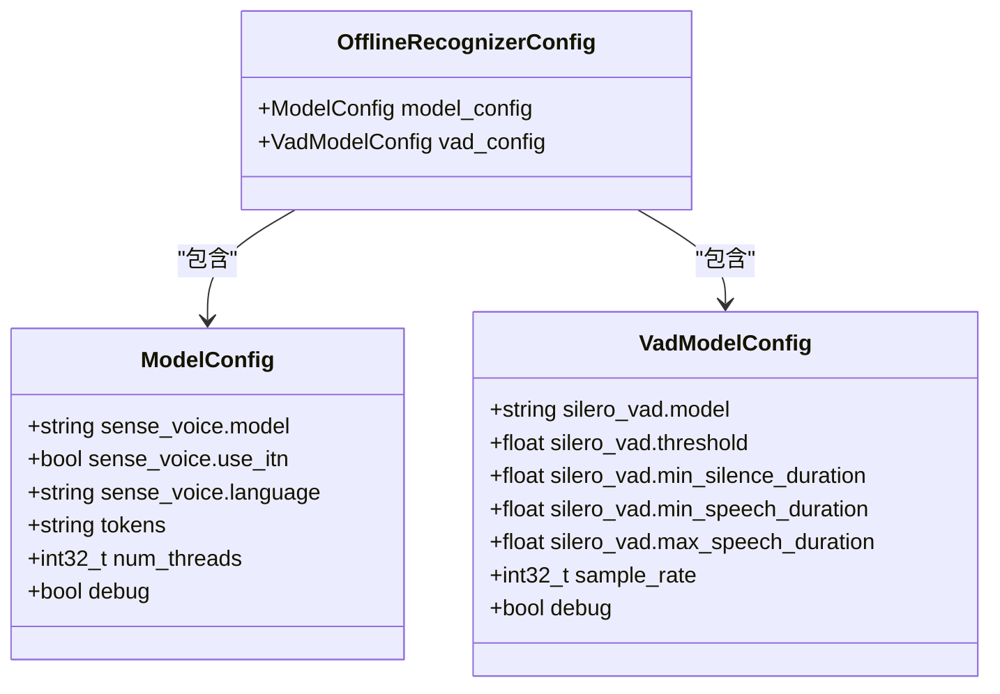

**Diagram sources**
- [sense-voice-simulate-streaming-alsa-cxx-api.cc](file://cxx-api-examples/sense-voice-simulate-streaming-alsa-cxx-api.cc#L56-L85)
- [sense-voice-simulate-streaming-microphone-cxx-api.cc](file://cxx-api-examples/sense-voice-simulate-streaming-microphone-cxx-api.cc#L60-L89)

**Section sources**
- [sense-voice-simulate-streaming-alsa-cxx-api.cc](file://cxx-api-examples/sense-voice-simulate-streaming-alsa-cxx-api.cc#L56-L85)
- [sense-voice-simulate-streaming-microphone-cxx-api.cc](file://cxx-api-examples/sense-voice-simulate-streaming-microphone-cxx-api.cc#L60-L89)

## 使用ALSA和麦克风的模拟流式处理

### ALSA音频输入处理
ALSA(Advanced Linux Sound Architecture)是Linux系统下的音频处理框架，用于从麦克风获取实时音频数据。

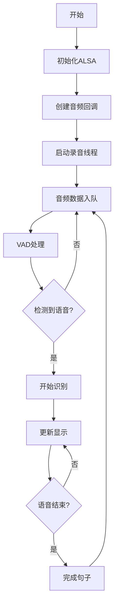

**Diagram sources**
- [sense-voice-simulate-streaming-alsa-cxx-api.cc](file://cxx-api-examples/sense-voice-simulate-streaming-alsa-cxx-api.cc#L45-L54)
- [zipformer-ctc-simulate-streaming-alsa-cxx-api.cc](file://cxx-api-examples/zipformer-ctc-simulate-streaming-alsa-cxx-api.cc#L45-L54)

**Section sources**
- [sense-voice-simulate-streaming-alsa-cxx-api.cc](file://cxx-api-examples/sense-voice-simulate-streaming-alsa-cxx-api.cc#L45-L54)
- [zipformer-ctc-simulate-streaming-alsa-cxx-api.cc](file://cxx-api-examples/zipformer-ctc-simulate-streaming-alsa-cxx-api.cc#L45-L54)

### 麦克风音频输入处理
使用PortAudio库从麦克风获取音频数据，适用于跨平台应用。

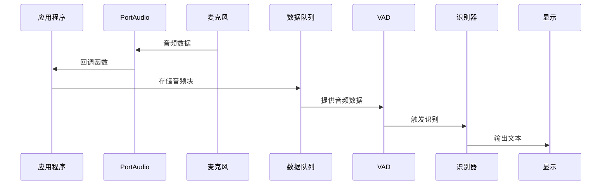

**Diagram sources**
- [wenet-ctc-simulate-streaming-microphone-cxx-api.cc](file://cxx-api-examples/wenet-ctc-simulate-streaming-microphone-cxx-api.cc#L44-L57)
- [zipformer-transducer-simulate-streaming-microphone-cxx-api.cc](file://cxx-api-examples/zipformer-transducer-simulate-streaming-microphone-cxx-api.cc#L44-L57)

**Section sources**
- [wenet-ctc-simulate-streaming-microphone-cxx-api.cc](file://cxx-api-examples/wenet-ctc-simulate-streaming-microphone-cxx-api.cc#L44-L57)
- [zipformer-transducer-simulate-streaming-microphone-cxx-api.cc](file://cxx-api-examples/zipformer-transducer-simulate-streaming-microphone-cxx-api.cc#L44-L57)

## 实时因子(RTF)计算与监控

### RTF计算方法
实时因子(Real Time Factor)是衡量语音识别系统性能的重要指标，表示处理时间与音频时长的比率。

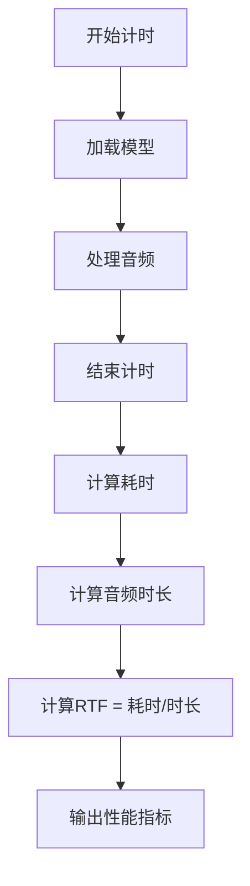

**Diagram sources**
- [streaming-zipformer-cxx-api.cc](file://cxx-api-examples/streaming-zipformer-cxx-api.cc#L64-L90)
- [streaming-zipformer-rtf-cxx-api.cc](file://cxx-api-examples/streaming-zipformer-rtf-cxx-api.cc#L96-L132)

**Section sources**
- [streaming-zipformer-cxx-api.cc](file://cxx-api-examples/streaming-zipformer-cxx-api.cc#L64-L90)
- [streaming-zipformer-rtf-cxx-api.cc](file://cxx-api-examples/streaming-zipformer-rtf-cxx-api.cc#L96-L132)

## 上下文管理与状态同步

### 流式识别状态管理
流式语音识别需要有效管理识别状态，确保上下文的连续性和一致性。

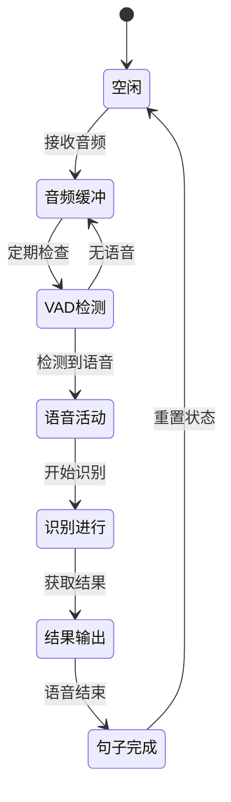

**Diagram sources**
- [wenet-ctc-simulate-streaming-microphone-cxx-api.cc](file://cxx-api-examples/wenet-ctc-simulate-streaming-microphone-cxx-api.cc#L184-L237)
- [sense-voice-simulate-streaming-microphone-cxx-api.cc](file://cxx-api-examples/sense-voice-simulate-streaming-microphone-cxx-api.cc#L188-L239)

**Section sources**
- [wenet-ctc-simulate-streaming-microphone-cxx-api.cc](file://cxx-api-examples/wenet-ctc-simulate-streaming-microphone-cxx-api.cc#L184-L237)
- [sense-voice-simulate-streaming-microphone-cxx-api.cc](file://cxx-api-examples/sense-voice-simulate-streaming-microphone-cxx-api.cc#L188-L239)