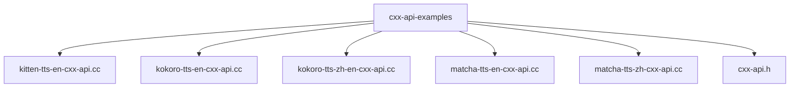
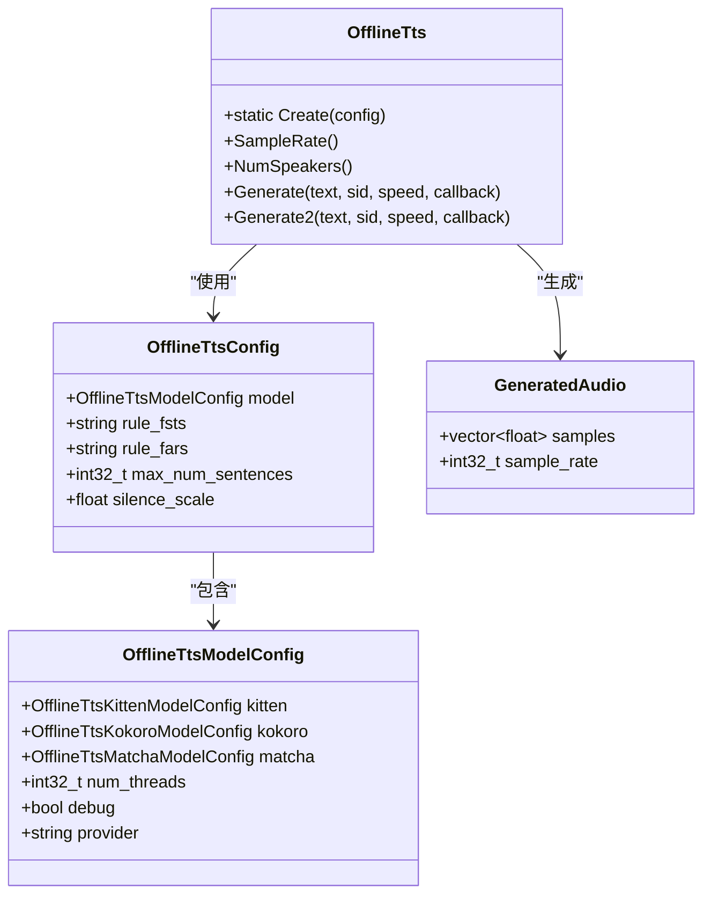
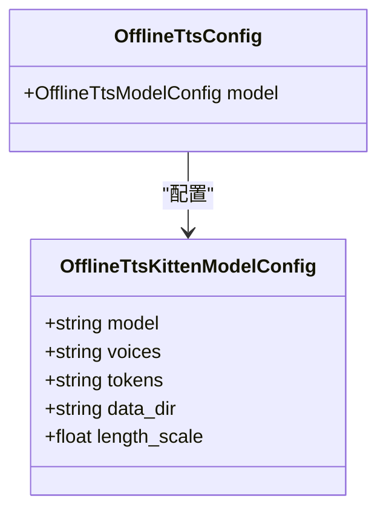
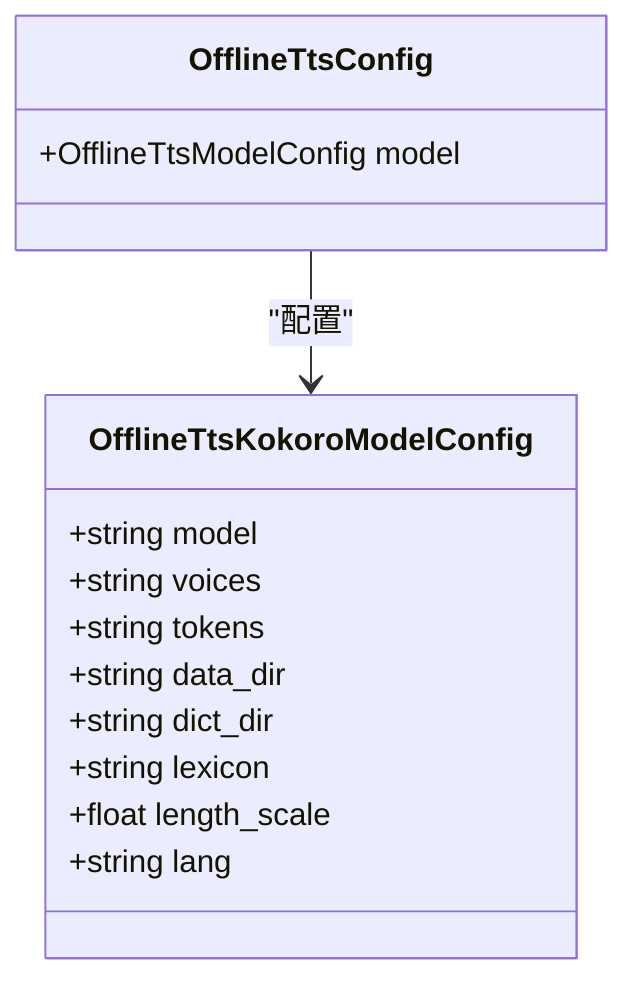
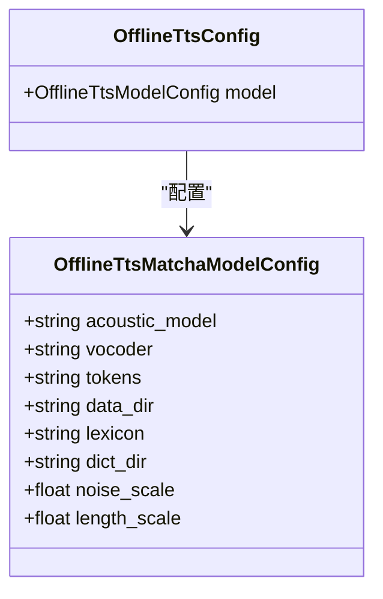
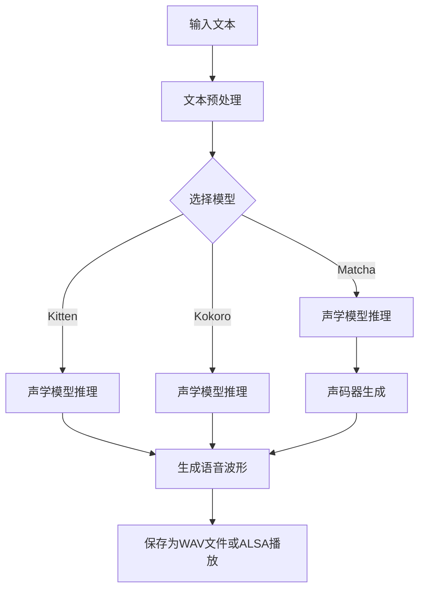
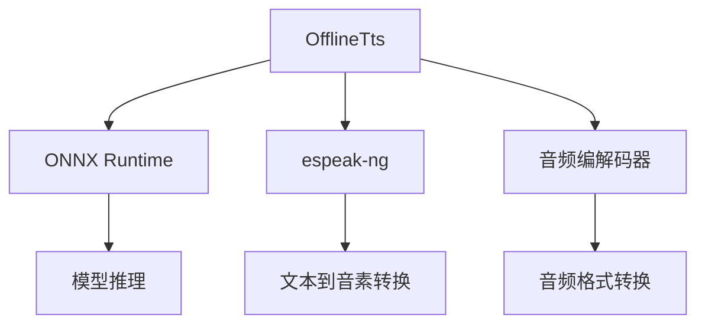

# 语音合成示例

<cite>
**本文档引用的文件**  
- [kitten-tts-en-cxx-api.cc](file://cxx-api-examples/kitten-tts-en-cxx-api.cc)
- [kokoro-tts-en-cxx-api.cc](file://cxx-api-examples/kokoro-tts-en-cxx-api.cc)
- [kokoro-tts-zh-en-cxx-api.cc](file://cxx-api-examples/kokoro-tts-zh-en-cxx-api.cc)
- [matcha-tts-en-cxx-api.cc](file://cxx-api-examples/matcha-tts-en-cxx-api.cc)
- [matcha-tts-zh-cxx-api.cc](file://cxx-api-examples/matcha-tts-zh-cxx-api.cc)
- [cxx-api.h](file://sherpa-onnx/c-api/cxx-api.h)
- [offline-tts.h](file://sherpa-onnx/csrc/offline-tts.h)
- [offline-tts-model-config.h](file://sherpa-onnx/csrc/offline-tts-model-config.h)
- [offline-tts-kitten-model-config.h](file://sherpa-onnx/csrc/offline-tts-kitten-model-config.h)
- [offline-tts-kokoro-model-config.h](file://sherpa-onnx/csrc/offline-tts-kokoro-model-config.h)
- [offline-tts-matcha-model-config.h](file://sherpa-onnx/csrc/offline-tts-matcha-model-config.h)
</cite>

## 目录
1. [简介](#简介)
2. [项目结构](#项目结构)
3. [核心组件](#核心组件)
4. [架构概述](#架构概述)
5. [详细组件分析](#详细组件分析)
6. [依赖分析](#依赖分析)
7. [性能考虑](#性能考虑)
8. [故障排除指南](#故障排除指南)
9. [结论](#结论)

## 简介
本文档详细介绍了sherpa-onnx语音合成C++ API示例，系统性地介绍了Kitten、Kokoro和Matcha系列TTS模型的C++示例代码。文档详细说明了如何使用OfflineTts类，配置OfflineTtsModelConfig参数，加载TTS模型，并生成语音波形。同时解释了不同TTS模型（如Kitten-EN、Kokoro-EN/ZH-EN、Matcha-EN/ZH）在配置和使用上的差异，提供了完整的代码解析，展示了文本到语音的转换流程。

## 项目结构
sherpa-onnx项目包含多个API示例，其中语音合成相关的C++示例位于`cxx-api-examples/`目录下。该项目提供了Kitten、Kokoro和Matcha系列TTS模型的完整实现示例，涵盖了英语、中文以及中英文混合的语音合成场景。

**图示来源**
- [kitten-tts-en-cxx-api.cc](file://cxx-api-examples/kitten-tts-en-cxx-api.cc)
- [kokoro-tts-en-cxx-api.cc](file://cxx-api-examples/kokoro-tts-en-cxx-api.cc)
- [matcha-tts-en-cxx-api.cc](file://cxx-api-examples/matcha-tts-en-cxx-api.cc)
- [cxx-api.h](file://sherpa-onnx/c-api/cxx-api.h)

**本节来源**
- [cxx-api-examples](file://cxx-api-examples)

## 核心组件
语音合成的核心组件包括OfflineTts类、OfflineTtsConfig配置结构体和GeneratedAudio结果结构体。这些组件共同构成了TTS系统的骨架，实现了从文本到语音波形的完整转换流程。

**本节来源**
- [cxx-api.h](file://sherpa-onnx/c-api/cxx-api.h#L454-L511)
- [offline-tts.h](file://sherpa-onnx/csrc/offline-tts.h#L17-L132)

## 架构概述
sherpa-onnx的TTS系统采用模块化设计，通过OfflineTts类封装了语音合成的核心功能。系统支持多种TTS模型，包括Kitten、Kokoro和Matcha系列，每种模型都有其特定的配置参数和使用方式。

**图示来源**
- [cxx-api.h](file://sherpa-onnx/c-api/cxx-api.h#L454-L511)
- [offline-tts.h](file://sherpa-onnx/csrc/offline-tts.h#L17-L132)

## 详细组件分析
本节详细分析Kitten、Kokoro和Matcha三种TTS模型的实现细节，包括配置参数、使用方法和功能差异。

### Kitten TTS模型分析
Kitten模型是专为英语语音合成设计的轻量级模型，适用于单语英语场景。

**图示来源**
- [offline-tts-kitten-model-config.h](file://sherpa-onnx/csrc/offline-tts-kitten-model-config.h)
- [kitten-tts-en-cxx-api.cc](file://cxx-api-examples/kitten-tts-en-cxx-api.cc)

**本节来源**
- [kitten-tts-en-cxx-api.cc](file://cxx-api-examples/kitten-tts-en-cxx-api.cc#L35-L75)
- [offline-tts-kitten-model-config.h](file://sherpa-onnx/csrc/offline-tts-kitten-model-config.h)

### Kokoro TTS模型分析
Kokoro模型支持英语和中英文混合场景，具有更复杂的配置需求。

**图示来源**
- [offline-tts-kokoro-model-config.h](file://sherpa-onnx/csrc/offline-tts-kokoro-model-config.h)
- [kokoro-tts-en-cxx-api.cc](file://cxx-api-examples/kokoro-tts-en-cxx-api.cc)
- [kokoro-tts-zh-en-cxx-api.cc](file://cxx-api-examples/kokoro-tts-zh-en-cxx-api.cc)

**本节来源**
- [kokoro-tts-en-cxx-api.cc](file://cxx-api-examples/kokoro-tts-en-cxx-api.cc#L35-L75)
- [kokoro-tts-zh-en-cxx-api.cc](file://cxx-api-examples/kokoro-tts-zh-en-cxx-api.cc#L35-L76)
- [offline-tts-kokoro-model-config.h](file://sherpa-onnx/csrc/offline-tts-kokoro-model-config.h)

### Matcha TTS模型分析
Matcha模型采用声学模型和声码器分离的架构，支持英语和中文语音合成。

**图示来源**
- [offline-tts-matcha-model-config.h](file://sherpa-onnx/csrc/offline-tts-matcha-model-config.h)
- [matcha-tts-en-cxx-api.cc](file://cxx-api-examples/matcha-tts-en-cxx-api.cc)
- [matcha-tts-zh-cxx-api.cc](file://cxx-api-examples/matcha-tts-zh-cxx-api.cc)

**本节来源**
- [matcha-tts-en-cxx-api.cc](file://cxx-api-examples/matcha-tts-en-cxx-api.cc#L37-L82)
- [matcha-tts-zh-cxx-api.cc](file://cxx-api-examples/matcha-tts-zh-cxx-api.cc#L37-L81)
- [offline-tts-matcha-model-config.h](file://sherpa-onnx/csrc/offline-tts-matcha-model-config.h)

### 文本到语音转换流程
语音合成的完整流程包括文本预处理、声学模型推理和声码器生成等步骤。

**图示来源**
- [kitten-tts-en-cxx-api.cc](file://cxx-api-examples/kitten-tts-en-cxx-api.cc)
- [kokoro-tts-en-cxx-api.cc](file://cxx-api-examples/kokoro-tts-en-cxx-api.cc)
- [matcha-tts-en-cxx-api.cc](file://cxx-api-examples/matcha-tts-en-cxx-api.cc)

## 依赖分析
语音合成系统依赖于多个外部组件和库，包括ONNX运行时、音频处理库和模型文件。

**图示来源**
- [cxx-api.h](file://sherpa-onnx/c-api/cxx-api.h)
- [offline-tts.h](file://sherpa-onnx/csrc/offline-tts.h)

**本节来源**
- [cxx-api.h](file://sherpa-onnx/c-api/cxx-api.h#L454-L511)
- [offline-tts.h](file://sherpa-onnx/csrc/offline-tts.h#L17-L132)

## 性能考虑
在使用语音合成API时，需要考虑线程数、调试模式和音频质量等性能因素。通过合理配置num_threads参数可以平衡性能和资源消耗，而debug参数则影响日志输出的详细程度。

## 故障排除指南
当遇到语音合成问题时，可以检查模型文件路径是否正确、音频设备是否可用以及内存是否充足。对于长时间运行的应用，建议使用进度回调函数来监控生成状态。

**本节来源**
- [kitten-tts-en-cxx-api.cc](file://cxx-api-examples/kitten-tts-en-cxx-api.cc#L27-L33)
- [kokoro-tts-en-cxx-api.cc](file://cxx-api-examples/kokoro-tts-en-cxx-api.cc#L27-L33)
- [matcha-tts-en-cxx-api.cc](file://cxx-api-examples/matcha-tts-en-cxx-api.cc#L29-L35)

## 结论
sherpa-onnx提供了完整的C++ API来实现语音合成功能，支持多种TTS模型和语言场景。通过合理配置OfflineTtsConfig参数，可以灵活地使用Kitten、Kokoro和Matcha系列模型进行文本到语音的转换。系统提供了丰富的功能，包括进度回调、多线程支持和音频播放等，满足了不同应用场景的需求。