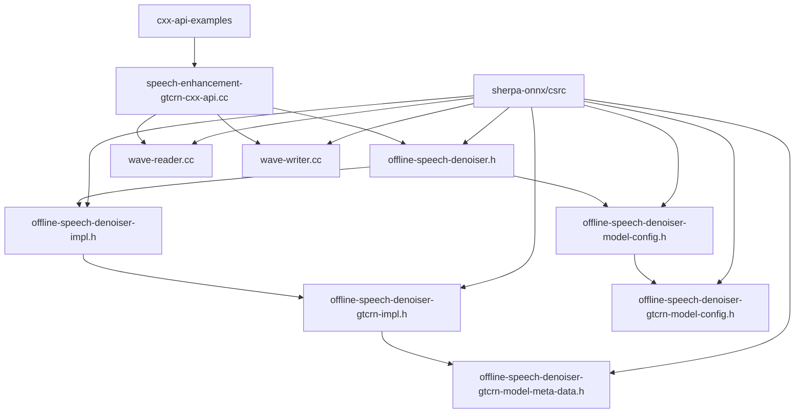
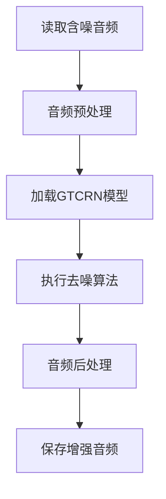
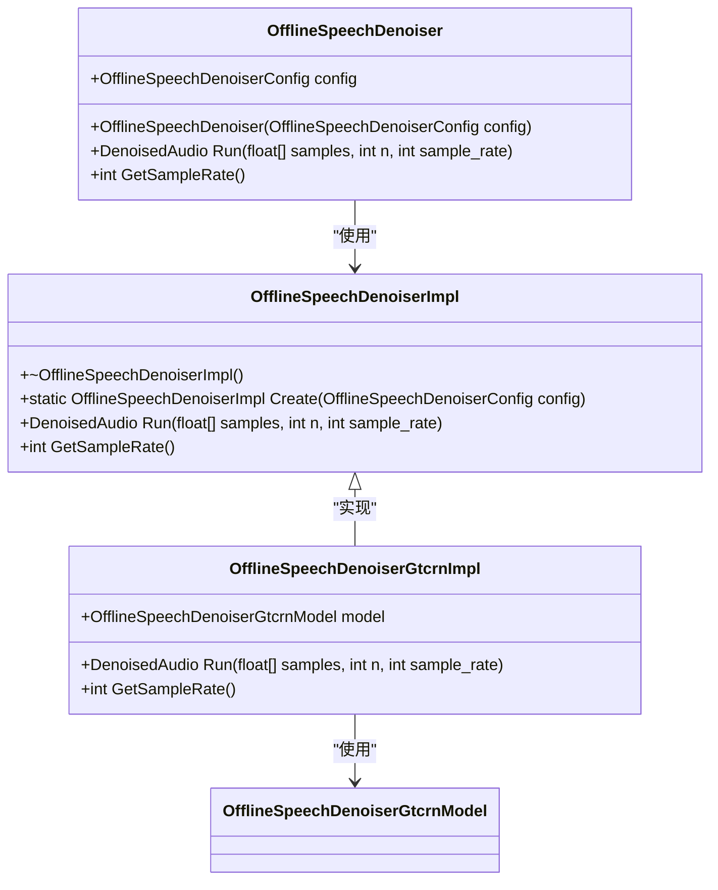
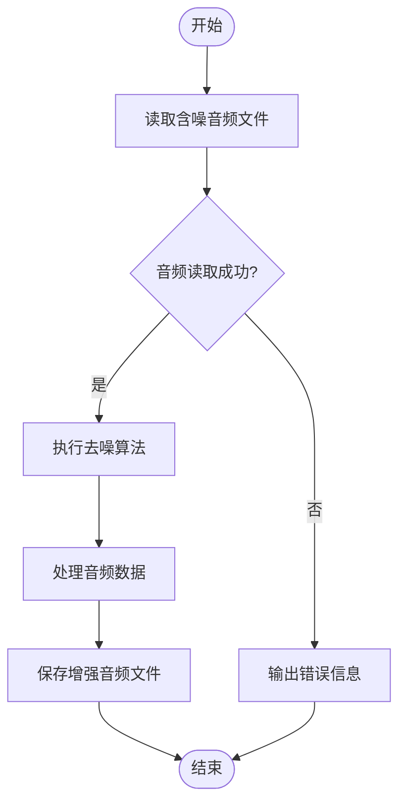
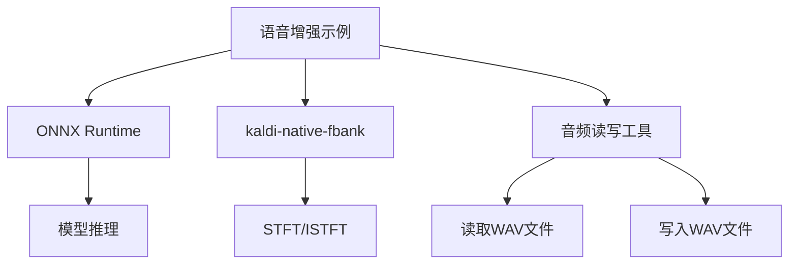

# 语音增强示例

<cite>
**本文档中引用的文件**
- [speech-enhancement-gtcrn-cxx-api.cc](file://cxx-api-examples/speech-enhancement-gtcrn-cxx-api.cc)
- [speech-enhancement-gtcrn-c-api.c](file://c-api-examples/speech-enhancement-gtcrn-c-api.c)
- [offline-speech-denoiser.h](file://sherpa-onnx/csrc/offline-speech-denoiser.h)
- [offline-speech-denoiser-impl.h](file://sherpa-onnx/csrc/offline-speech-denoiser-impl.h)
- [offline-speech-denoiser-gtcrn-impl.h](file://sherpa-onnx/csrc/offline-speech-denoiser-gtcrn-impl.h)
- [offline-speech-denoiser-model-config.h](file://sherpa-onnx/csrc/offline-speech-denoiser-model-config.h)
- [offline-speech-denoiser-gtcrn-model-config.h](file://sherpa-onnx/csrc/offline-speech-denoiser-gtcrn-model-config.h)
- [offline-speech-denoiser-gtcrn-model-meta-data.h](file://sherpa-onnx/csrc/offline-speech-denoiser-gtcrn-model-meta-data.h)
- [wave-reader.cc](file://sherpa-onnx/csrc/wave-reader.cc)
- [wave-writer.cc](file://sherpa-onnx/csrc/wave-writer.cc)
</cite>

## 目录
1. [简介](#简介)
2. [项目结构](#项目结构)
3. [核心组件](#核心组件)
4. [架构概述](#架构概述)
5. [详细组件分析](#详细组件分析)
6. [依赖分析](#依赖分析)
7. [性能考虑](#性能考虑)
8. [故障排除指南](#故障排除指南)
9. [结论](#结论)

## 简介
本文档详细解析了基于GTCRN模型的语音增强C++ API示例代码。文档涵盖了如何使用OfflineSpeechDenoiser类，配置OfflineSpeechDenoiserModelConfig参数，加载GTCRN去噪模型，并对含噪音频进行增强处理的完整流程。通过详细的代码解析，展示了如何读取原始音频、执行去噪算法、获取增强后的音频波形，并将结果保存为新的WAV文件。同时，文档还解释了语音增强在实际应用中的价值，以及如何调整模型参数以优化去噪效果，并提供了构建和运行此示例的具体步骤和可能遇到的问题解决方案。

## 项目结构
语音增强示例代码位于sherpa-onnx项目的cxx-api-examples目录中，主要文件为speech-enhancement-gtcrn-cxx-api.cc。该示例依赖于sherpa-onnx核心库中的多个组件，包括音频处理、模型加载和去噪算法实现。项目结构清晰地分离了API接口、实现细节和示例代码，便于开发者理解和使用。

**图示来源**
- [speech-enhancement-gtcrn-cxx-api.cc](file://cxx-api-examples/speech-enhancement-gtcrn-cxx-api.cc)
- [offline-speech-denoiser.h](file://sherpa-onnx/csrc/offline-speech-denoiser.h)
- [offline-speech-denoiser-impl.h](file://sherpa-onnx/csrc/offline-speech-denoiser-impl.h)
- [offline-speech-denoiser-gtcrn-impl.h](file://sherpa-onnx/csrc/offline-speech-denoiser-gtcrn-impl.h)
- [offline-speech-denoiser-model-config.h](file://sherpa-onnx/csrc/offline-speech-denoiser-model-config.h)
- [offline-speech-denoiser-gtcrn-model-config.h](file://sherpa-onnx/csrc/offline-speech-denoiser-gtcrn-model-config.h)
- [offline-speech-denoiser-gtcrn-model-meta-data.h](file://sherpa-onnx/csrc/offline-speech-denoiser-gtcrn-model-meta-data.h)
- [wave-reader.cc](file://sherpa-onnx/csrc/wave-reader.cc)
- [wave-writer.cc](file://sherpa-onnx/csrc/wave-writer.cc)

**章节来源**
- [speech-enhancement-gtcrn-cxx-api.cc](file://cxx-api-examples/speech-enhancement-gtcrn-cxx-api.cc)
- [offline-speech-denoiser.h](file://sherpa-onnx/csrc/offline-speech-denoiser.h)
- [offline-speech-denoiser-impl.h](file://sherpa-onnx/csrc/offline-speech-denoiser-impl.h)
- [offline-speech-denoiser-gtcrn-impl.h](file://sherpa-onnx/csrc/offline-speech-denoiser-gtcrn-impl.h)
- [offline-speech-denoiser-model-config.h](file://sherpa-onnx/csrc/offline-speech-denoiser-model-config.h)
- [offline-speech-denoiser-gtcrn-model-config.h](file://sherpa-onnx/csrc/offline-speech-denoiser-gtcrn-model-config.h)
- [offline-speech-denoiser-gtcrn-model-meta-data.h](file://sherpa-onnx/csrc/offline-speech-denoiser-gtcrn-model-meta-data.h)
- [wave-reader.cc](file://sherpa-onnx/csrc/wave-reader.cc)
- [wave-writer.cc](file://sherpa-onnx/csrc/wave-writer.cc)

## 核心组件
本示例的核心组件包括OfflineSpeechDenoiser类，用于执行语音增强处理；OfflineSpeechDenoiserConfig结构体，用于配置去噪模型参数；以及相关的音频读写工具。这些组件协同工作，实现了从含噪音频到清晰音频的转换过程。

**章节来源**
- [offline-speech-denoiser.h](file://sherpa-onnx/csrc/offline-speech-denoiser.h)
- [offline-speech-denoiser-model-config.h](file://sherpa-onnx/csrc/offline-speech-denoiser-model-config.h)
- [wave-reader.cc](file://sherpa-onnx/csrc/wave-reader.cc)
- [wave-writer.cc](file://sherpa-onnx/csrc/wave-writer.cc)

## 架构概述
语音增强示例的架构基于GTCRN模型，通过OfflineSpeechDenoiser类封装了复杂的去噪算法。该架构首先读取含噪音频文件，然后通过配置的GTCRN模型进行处理，最后将增强后的音频保存为新的WAV文件。整个过程包括音频读取、预处理、模型推理、后处理和音频写入等步骤。

**图示来源**
- [speech-enhancement-gtcrn-cxx-api.cc](file://cxx-api-examples/speech-enhancement-gtcrn-cxx-api.cc)
- [offline-speech-denoiser.h](file://sherpa-onnx/csrc/offline-speech-denoiser.h)
- [offline-speech-denoiser-impl.h](file://sherpa-onnx/csrc/offline-speech-denoiser-impl.h)
- [offline-speech-denoiser-gtcrn-impl.h](file://sherpa-onnx/csrc/offline-speech-denoiser-gtcrn-impl.h)
- [wave-reader.cc](file://sherpa-onnx/csrc/wave-reader.cc)
- [wave-writer.cc](file://sherpa-onnx/csrc/wave-writer.cc)

## 详细组件分析
### OfflineSpeechDenoiser类分析
OfflineSpeechDenoiser类是语音增强功能的核心，它封装了GTCRN模型的加载和推理过程。该类通过Run方法接收含噪音频数据，返回增强后的音频数据。

#### 类图

**图示来源**
- [offline-speech-denoiser.h](file://sherpa-onnx/csrc/offline-speech-denoiser.h)
- [offline-speech-denoiser-impl.h](file://sherpa-onnx/csrc/offline-speech-denoiser-impl.h)
- [offline-speech-denoiser-gtcrn-impl.h](file://sherpa-onnx/csrc/offline-speech-denoiser-gtcrn-impl.h)
- [offline-speech-denoiser-gtcrn-model.h](file://sherpa-onnx/csrc/offline-speech-denoiser-gtcrn-model.h)

**章节来源**
- [offline-speech-denoiser.h](file://sherpa-onnx/csrc/offline-speech-denoiser.h)
- [offline-speech-denoiser-impl.h](file://sherpa-onnx/csrc/offline-speech-denoiser-impl.h)
- [offline-speech-denoiser-gtcrn-impl.h](file://sherpa-onnx/csrc/offline-speech-denoiser-gtcrn-impl.h)

### 配置参数分析
OfflineSpeechDenoiserModelConfig结构体用于配置去噪模型的参数，包括模型路径、线程数、调试模式和运行提供者等。

#### 配置参数表
| 参数 | 类型 | 描述 |
| --- | --- | --- |
| gtcrn.model | 字符串 | GTCRN模型文件路径 |
| num_threads | 整数 | 运行神经网络的线程数 |
| debug | 布尔值 | 是否在加载模型时打印模型信息 |
| provider | 字符串 | 指定使用的运行提供者（cpu, cuda, coreml） |

**章节来源**
- [offline-speech-denoiser-model-config.h](file://sherpa-onnx/csrc/offline-speech-denoiser-model-config.h)
- [offline-speech-denoiser-gtcrn-model-config.h](file://sherpa-onnx/csrc/offline-speech-denoiser-gtcrn-model-config.h)

### 音频处理流程分析
语音增强的处理流程包括音频读取、去噪处理和音频写入三个主要步骤。

#### 流程图

**图示来源**
- [speech-enhancement-gtcrn-cxx-api.cc](file://cxx-api-examples/speech-enhancement-gtcrn-cxx-api.cc)
- [wave-reader.cc](file://sherpa-onnx/csrc/wave-reader.cc)
- [wave-writer.cc](file://sherpa-onnx/csrc/wave-writer.cc)

**章节来源**
- [speech-enhancement-gtcrn-cxx-api.cc](file://cxx-api-examples/speech-enhancement-gtcrn-cxx-api.cc)
- [wave-reader.cc](file://sherpa-onnx/csrc/wave-reader.cc)
- [wave-writer.cc](file://sherpa-onnx/csrc/wave-writer.cc)

## 依赖分析
语音增强示例依赖于多个外部库和内部组件，包括ONNX Runtime用于模型推理，kaldi-native-fbank用于音频特征提取，以及自定义的音频读写工具。

**图示来源**
- [offline-speech-denoiser-gtcrn-impl.h](file://sherpa-onnx/csrc/offline-speech-denoiser-gtcrn-impl.h)
- [wave-reader.cc](file://sherpa-onnx/csrc/wave-reader.cc)
- [wave-writer.cc](file://sherpa-onnx/csrc/wave-writer.cc)

**章节来源**
- [offline-speech-denoiser-gtcrn-impl.h](file://sherpa-onnx/csrc/offline-speech-denoiser-gtcrn-impl.h)
- [wave-reader.cc](file://sherpa-onnx/csrc/wave-reader.cc)
- [wave-writer.cc](file://sherpa-onnx/csrc/wave-writer.cc)

## 性能考虑
语音增强处理的性能主要受模型复杂度、音频长度和硬件配置的影响。通过调整num_threads参数可以优化多核CPU的利用率，选择合适的provider（如cuda）可以利用GPU加速计算。此外，音频采样率和长度也直接影响处理时间。

**章节来源**
- [offline-speech-denoiser-model-config.h](file://sherpa-onnx/csrc/offline-speech-denoiser-model-config.h)
- [offline-speech-denoiser-gtcrn-impl.h](file://sherpa-onnx/csrc/offline-speech-denoiser-gtcrn-impl.h)

## 故障排除指南
在使用语音增强示例时，可能会遇到模型文件不存在、音频格式不支持或内存不足等问题。确保模型文件路径正确，音频文件为单声道16位WAV格式，并有足够的内存来加载模型和处理音频数据。

**章节来源**
- [offline-speech-denoiser-gtcrn-model-config.cc](file://sherpa-onnx/csrc/offline-speech-denoiser-gtcrn-model-config.cc)
- [wave-reader.cc](file://sherpa-onnx/csrc/wave-reader.cc)
- [wave-writer.cc](file://sherpa-onnx/csrc/wave-writer.cc)

## 结论
基于GTCRN模型的语音增强C++ API示例提供了一个完整的解决方案，用于去除音频中的噪声并提高语音质量。通过合理配置参数和优化硬件资源，可以在各种应用场景中实现高效的语音增强处理。该示例代码结构清晰，易于理解和扩展，为开发者提供了良好的起点。