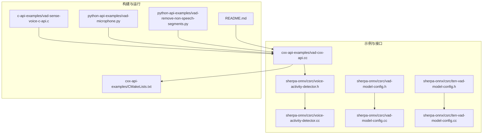
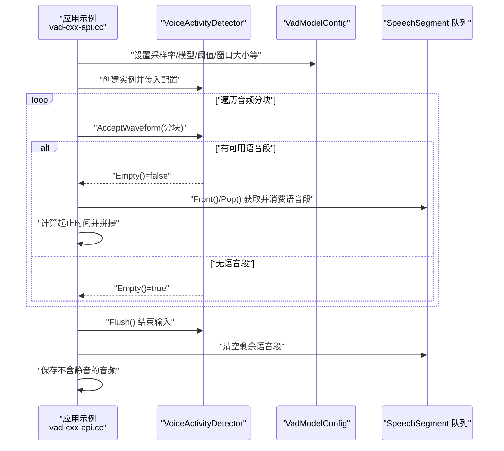
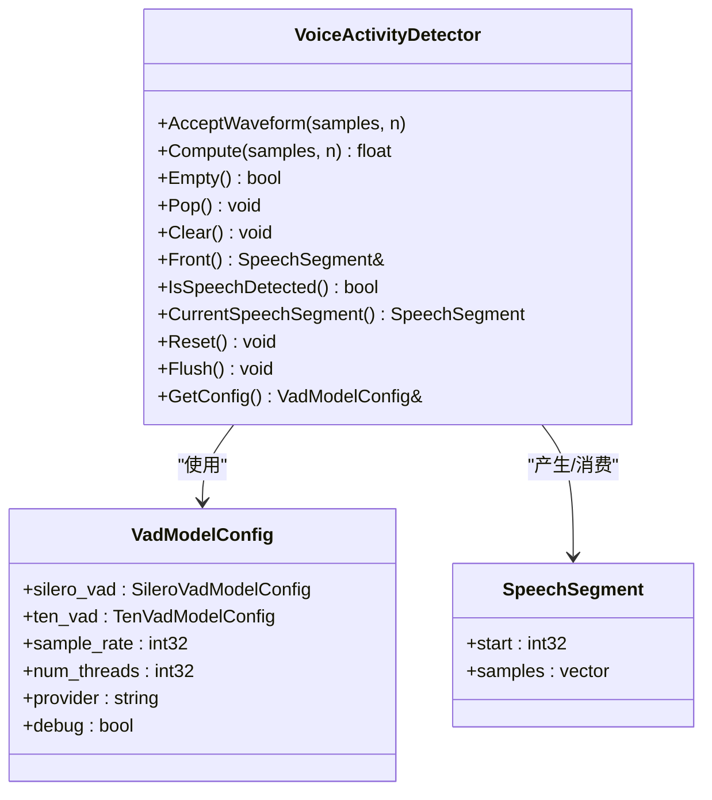
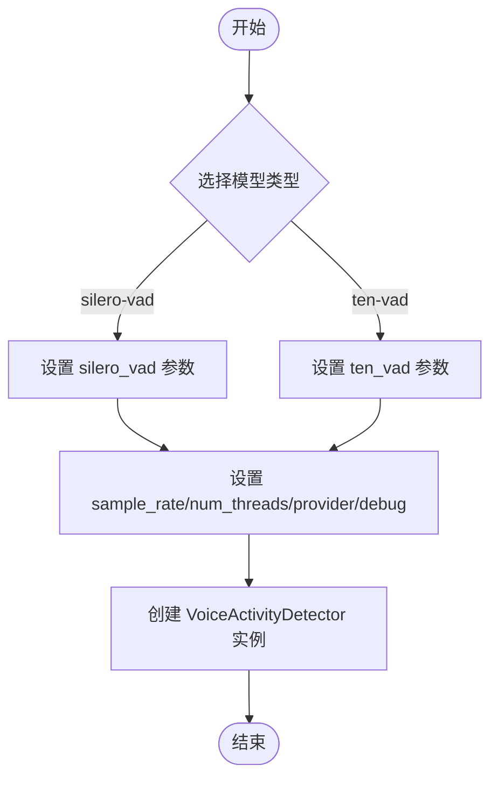
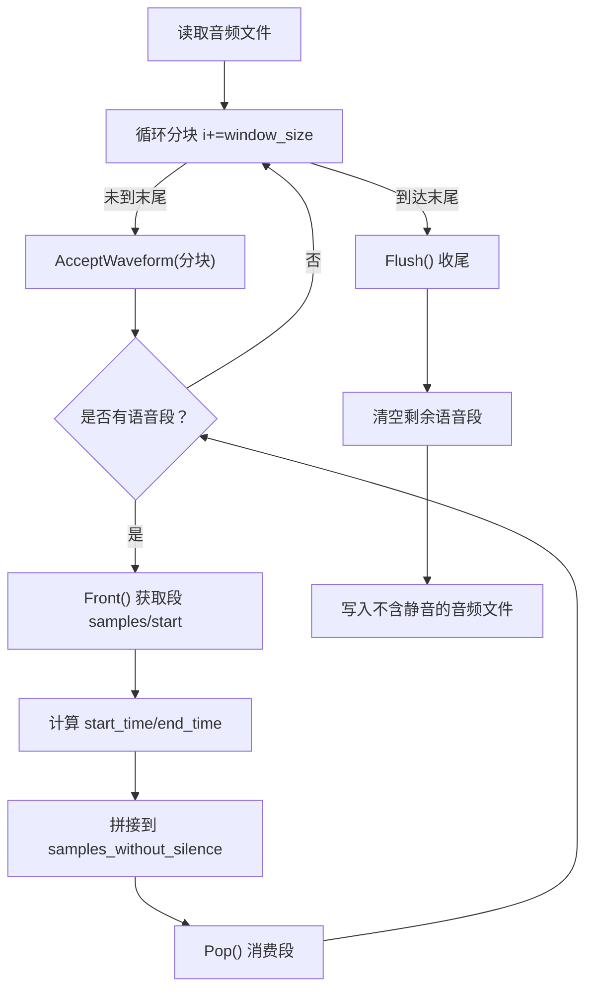
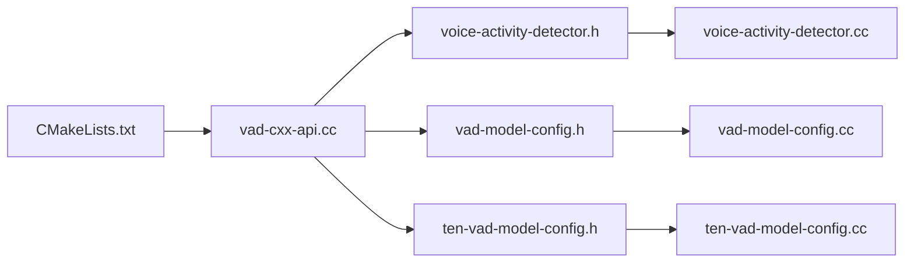

# 语音活动检测示例

<cite>
**本文引用的文件**
- [vad-cxx-api.cc](file://cxx-api-examples/vad-cxx-api.cc)
- [voice-activity-detector.h](file://sherpa-onnx/csrc/voice-activity-detector.h)
- [voice-activity-detector.cc](file://sherpa-onnx/csrc/voice-activity-detector.cc)
- [vad-model-config.h](file://sherpa-onnx/csrc/vad-model-config.h)
- [vad-model-config.cc](file://sherpa-onnx/csrc/vad-model-config.cc)
- [ten-vad-model-config.h](file://sherpa-onnx/csrc/ten-vad-model-config.h)
- [ten-vad-model-config.cc](file://sherpa-onnx/csrc/ten-vad-model-config.cc)
- [CMakeLists.txt（cxx-api-examples）](file://cxx-api-examples/CMakeLists.txt)
- [vad-sense-voice-c-api.c](file://c-api-examples/vad-sense-voice-c-api.c)
- [vad-remove-non-speech-segments.py](file://python-api-examples/vad-remove-non-speech-segments.py)
- [vad-microphone.py](file://python-api-examples/vad-microphone.py)
- [README.md](file://README.md)
</cite>

## 目录
1. [简介](#简介)
2. [项目结构](#项目结构)
3. [核心组件](#核心组件)
4. [架构总览](#架构总览)
5. [详细组件分析](#详细组件分析)
6. [依赖关系分析](#依赖关系分析)
7. [性能考量](#性能考量)
8. [故障排查指南](#故障排查指南)
9. [结论](#结论)
10. [附录：构建与运行指南](#附录构建与运行指南)

## 简介
本文件围绕 sherpa-onnx 的 C++ API 示例“语音活动检测（VAD）”进行系统化解读，重点解析如何使用 VoiceActivityDetector 类完成以下任务：
- 配置 VadModelConfig 参数并加载 silero-vad 或 ten-vad 模型
- 实时或离线地对音频流进行分块处理
- 基于 VAD 判断语音段（speech segments）与静音段（non-speech），并输出语音段的起止时间
- 将非语音段从原始音频中移除，得到仅包含语音的音频片段
- 在语音识别（ASR）预处理中应用 VAD，提升识别准确率与效率

同时，文档提供完整的代码流程解析、关键步骤说明、参数调优建议、以及构建与运行指导，帮助读者快速上手并在不同环境中稳定复现。

## 项目结构
与 VAD 示例直接相关的核心文件分布如下：
- C++ 示例入口：cxx-api-examples/vad-cxx-api.cc
- C++ VAD 接口与实现：sherpa-onnx/csrc/voice-activity-detector.h/.cc
- VAD 配置模型：sherpa-onnx/csrc/vad-model-config.h/.cc、sherpa-onnx/csrc/ten-vad-model-config.h/.cc
- 构建脚本：cxx-api-examples/CMakeLists.txt
- C API 示例（VAD+ASR）：c-api-examples/vad-sense-voice-c-api.c
- Python 示例（麦克风/文件）：python-api-examples/vad-microphone.py、vad-remove-non-speech-segments.py
- 顶层说明：README.md

图表来源
- [vad-cxx-api.cc](file://cxx-api-examples/vad-cxx-api.cc#L1-L123)
- [voice-activity-detector.h](file://sherpa-onnx/csrc/voice-activity-detector.h#L1-L64)
- [voice-activity-detector.cc](file://sherpa-onnx/csrc/voice-activity-detector.cc#L185-L231)
- [vad-model-config.h](file://sherpa-onnx/csrc/vad-model-config.h#L1-L47)
- [vad-model-config.cc](file://sherpa-onnx/csrc/vad-model-config.cc#L52-L79)
- [ten-vad-model-config.h](file://sherpa-onnx/csrc/ten-vad-model-config.h#L1-L45)
- [ten-vad-model-config.cc](file://sherpa-onnx/csrc/ten-vad-model-config.cc#L1-L113)
- [CMakeLists.txt（cxx-api-examples）](file://cxx-api-examples/CMakeLists.txt#L136-L143)
- [vad-sense-voice-c-api.c](file://c-api-examples/vad-sense-voice-c-api.c#L1-L187)
- [vad-microphone.py](file://python-api-examples/vad-microphone.py#L1-L126)
- [vad-remove-non-speech-segments.py](file://python-api-examples/vad-remove-non-speech-segments.py#L1-L132)
- [README.md](file://README.md#L1-L200)

章节来源
- [vad-cxx-api.cc](file://cxx-api-examples/vad-cxx-api.cc#L1-L123)
- [CMakeLists.txt（cxx-api-examples）](file://cxx-api-examples/CMakeLists.txt#L136-L143)
- [README.md](file://README.md#L1-L200)

## 核心组件
- VoiceActivityDetector（VAD 检测器）
  - 负责接收音频分块、维护内部缓冲区、检测语音段、提供语音段队列访问接口
  - 关键方法：AcceptWaveform、Flush、Empty、Front、Pop、IsSpeechDetected、CurrentSpeechSegment、Reset、GetConfig
- VadModelConfig（VAD 模型配置）
  - 统一承载 silero_vad 与 ten_vad 的配置项，以及采样率、线程数、执行提供者、调试开关等
- SileroVadModelConfig / TenVadModelConfig（具体模型配置）
  - 包含模型路径、阈值、最小静音/语音持续时间、最大语音持续时间、窗口大小等
- SpeechSegment（语音段数据结构）
  - 记录语音段起始样本索引与样本序列

章节来源
- [voice-activity-detector.h](file://sherpa-onnx/csrc/voice-activity-detector.h#L1-L64)
- [vad-model-config.h](file://sherpa-onnx/csrc/vad-model-config.h#L1-L47)
- [ten-vad-model-config.h](file://sherpa-onnx/csrc/ten-vad-model-config.h#L1-L45)

## 架构总览
下图展示了 VAD 示例从“加载模型配置”到“分块处理音频并提取语音段”的整体流程。

图表来源
- [vad-cxx-api.cc](file://cxx-api-examples/vad-cxx-api.cc#L49-L120)
- [voice-activity-detector.h](file://sherpa-onnx/csrc/voice-activity-detector.h#L1-L64)

## 详细组件分析

### VoiceActivityDetector 类与生命周期
- 创建与销毁
  - 通过构造函数传入 VadModelConfig 与可选的缓冲时长（秒）
  - 提供 Reset、Flush、Clear 等控制方法
- 分块处理
  - AcceptWaveform 接收固定长度的音频分块（由 window_size 决定）
  - Flush 用于结束输入，确保最后一个语音段被完整输出
- 语音段访问
  - Empty/Pop/Front 提供队列式访问，Front 返回当前语音段引用，Pop 移除已消费的语音段
  - IsSpeechDetected/CurrentSpeechSegment 提供当前检测状态与当前语音段

图表来源
- [voice-activity-detector.h](file://sherpa-onnx/csrc/voice-activity-detector.h#L1-L64)
- [vad-model-config.h](file://sherpa-onnx/csrc/vad-model-config.h#L1-L47)

章节来源
- [voice-activity-detector.h](file://sherpa-onnx/csrc/voice-activity-detector.h#L1-L64)
- [voice-activity-detector.cc](file://sherpa-onnx/csrc/voice-activity-detector.cc#L185-L231)

### VadModelConfig 与模型配置参数
- 通用参数
  - sample_rate：音频采样率（示例默认 16000）
  - num_threads：推理线程数
  - provider：执行提供者（如 cpu）
  - debug：加载模型时是否打印调试信息
- silero_vad / ten_vad
  - model：ONNX 模型路径
  - threshold：语音判定阈值
  - min_silence_duration / min_speech_duration：静音/语音最小持续时间（秒）
  - max_speech_duration：超过该时长后会提高阈值以减少误判
  - window_size：每次输入的样本数量（分块大小）

图表来源
- [vad-cxx-api.cc](file://cxx-api-examples/vad-cxx-api.cc#L49-L96)
- [vad-model-config.h](file://sherpa-onnx/csrc/vad-model-config.h#L1-L47)
- [ten-vad-model-config.h](file://sherpa-onnx/csrc/ten-vad-model-config.h#L1-L45)

章节来源
- [vad-model-config.h](file://sherpa-onnx/csrc/vad-model-config.h#L1-L47)
- [vad-model-config.cc](file://sherpa-onnx/csrc/vad-model-config.cc#L52-L79)
- [ten-vad-model-config.h](file://sherpa-onnx/csrc/ten-vad-model-config.h#L1-L45)
- [ten-vad-model-config.cc](file://sherpa-onnx/csrc/ten-vad-model-config.cc#L1-L113)

### 音频分块处理与语音段提取流程
- 分块策略
  - 使用 window_size 对输入音频进行滑动分块
  - 当到达文件末尾时调用 Flush，确保最后语音段被输出
- 语音段访问
  - 循环调用 Front/Pop 获取语音段，计算起止时间（起始样本/采样率、持续时间=样本数/采样率）
  - 将所有语音段样本拼接为不含静音的新音频

图表来源
- [vad-cxx-api.cc](file://cxx-api-examples/vad-cxx-api.cc#L80-L120)

章节来源
- [vad-cxx-api.cc](file://cxx-api-examples/vad-cxx-api.cc#L80-L120)

### 与 C API 的对比（VAD + ASR）
- C API 示例展示了将 VAD 与 SenseVoice 非流式识别结合的完整流程
- 关键差异
  - C API 中使用 SherpaOnnxVadModelConfig 与 SherpaOnnxVoiceActivityDetector
  - 在每个语音段上创建离线流并解码，输出文本与对应的时间范围
- 适用场景
  - 需要将 VAD 输出的语音段直接送入 ASR 进行转写

章节来源
- [vad-sense-voice-c-api.c](file://c-api-examples/vad-sense-voice-c-api.c#L104-L179)

### Python 示例（麦克风/文件）
- vad-microphone.py
  - 实时从麦克风采集音频，按固定窗口大小喂给 VAD
  - 检测到语音段后保存为独立文件，便于后续处理
- vad-remove-non-speech-segments.py
  - 将所有语音段合并为一个大段并保存，适合批量处理或离线场景

章节来源
- [vad-microphone.py](file://python-api-examples/vad-microphone.py#L1-L126)
- [vad-remove-non-speech-segments.py](file://python-api-examples/vad-remove-non-speech-segments.py#L1-L132)

## 依赖关系分析
- 示例与接口层
  - vad-cxx-api.cc 依赖 voice-activity-detector.h/.cc 与 vad-model-config.h/.cc
  - ten-vad-model-config.h/.cc 提供 ten-vad 的专用参数校验与描述
- 构建与链接
  - CMakeLists.txt 将 vad-cxx-api 示例目标链接 sherpa-onnx-cxx-api 库
- 其他语言示例
  - C API 与 Python 示例展示了相同功能在不同语言中的实现方式，便于迁移与对照

图表来源
- [vad-cxx-api.cc](file://cxx-api-examples/vad-cxx-api.cc#L1-L123)
- [voice-activity-detector.h](file://sherpa-onnx/csrc/voice-activity-detector.h#L1-L64)
- [voice-activity-detector.cc](file://sherpa-onnx/csrc/voice-activity-detector.cc#L185-L231)
- [vad-model-config.h](file://sherpa-onnx/csrc/vad-model-config.h#L1-L47)
- [vad-model-config.cc](file://sherpa-onnx/csrc/vad-model-config.cc#L52-L79)
- [ten-vad-model-config.h](file://sherpa-onnx/csrc/ten-vad-model-config.h#L1-L45)
- [ten-vad-model-config.cc](file://sherpa-onnx/csrc/ten-vad-model-config.cc#L1-L113)
- [CMakeLists.txt（cxx-api-examples）](file://cxx-api-examples/CMakeLists.txt#L136-L143)

章节来源
- [CMakeLists.txt（cxx-api-examples）](file://cxx-api-examples/CMakeLists.txt#L136-L143)

## 性能考量
- 窗口大小（window_size）
  - 较小窗口能更快响应，但可能增加误判；较大窗口更稳健但延迟更高
  - 示例中 silero-vad 使用 512，ten-vad 使用 256（取决于模型设计）
- 最大语音持续时间（max_speech_duration）
  - 超过阈值后会临时提高阈值，降低长语音中的误判风险
- 线程数与提供者（num_threads/provider）
  - 合理设置线程数可提升吞吐；provider 选择影响加速能力（CPU/GPU/NPU）
- 缓冲区大小（buffer_size_in_seconds）
  - 影响内存占用与回放能力；示例中默认 20~60 秒不等

章节来源
- [vad-cxx-api.cc](file://cxx-api-examples/vad-cxx-api.cc#L49-L96)
- [ten-vad-model-config.h](file://sherpa-onnx/csrc/ten-vad-model-config.h#L1-L45)
- [voice-activity-detector.cc](file://sherpa-onnx/csrc/voice-activity-detector.cc#L185-L231)

## 故障排查指南
- 模型文件缺失
  - 若未找到 silero_vad.onnx 或 ten-vad.onnx，示例会提示下载并退出
- 配置无效
  - VadModelConfig.Validate 会在缺少模型或参数越界时返回错误
  - ten-vad 参数校验要求阈值在合理区间、持续时间大于 0
- 创建失败
  - VoiceActivityDetector::Create 返回空指针时，检查配置与模型路径
- 输入格式问题
  - 确保采样率与模型期望一致（示例默认 16000）
- 输出为空
  - 确认 AcceptWaveform 已正确分块并调用 Flush 收尾

章节来源
- [vad-cxx-api.cc](file://cxx-api-examples/vad-cxx-api.cc#L26-L47)
- [vad-model-config.cc](file://sherpa-onnx/csrc/vad-model-config.cc#L52-L79)
- [ten-vad-model-config.cc](file://sherpa-onnx/csrc/ten-vad-model-config.cc#L44-L97)

## 结论
本示例完整演示了如何使用 VoiceActivityDetector 进行语音活动检测与静音移除，涵盖配置、分块处理、语音段提取与保存等关键步骤。通过合理设置阈值、最小持续时间与窗口大小，可在不同噪声与采样率环境下获得稳定的检测效果。结合 ASR 预处理，VAD 能显著提升语音识别的准确性与鲁棒性。

## 附录：构建与运行指南
- 构建
  - 使用 CMake 构建示例程序，确保已生成 sherpa-onnx-cxx-api 库
  - CMakeLists.txt 中已为目标 vad-cxx-api 配置链接库
- 运行
  - 准备音频文件与 VAD 模型（silero-vad 或 ten-vad）
  - 运行示例程序，程序会自动检测模型存在性并输出不含静音的音频文件
- 参考
  - README.md 展示了项目支持的功能与平台列表，便于确认环境兼容性

章节来源
- [CMakeLists.txt（cxx-api-examples）](file://cxx-api-examples/CMakeLists.txt#L136-L143)
- [README.md](file://README.md#L1-L200)